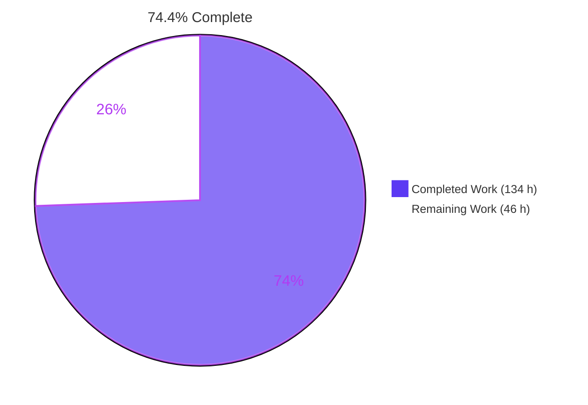
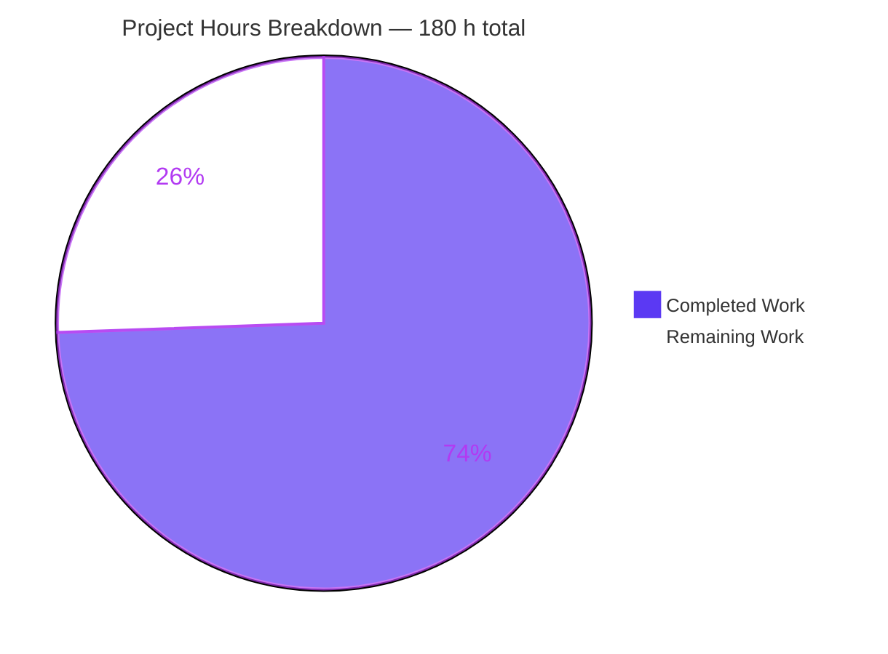
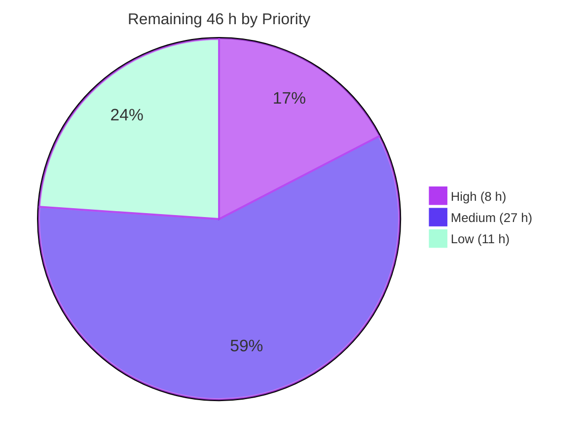
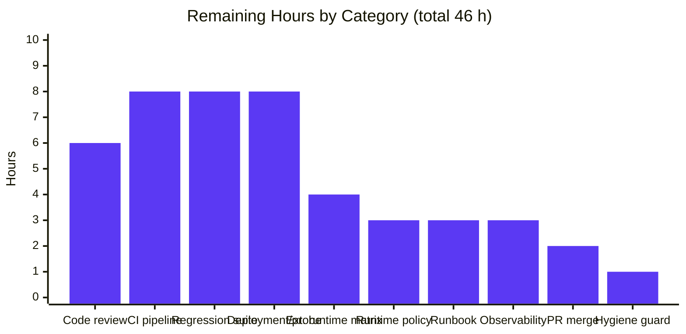
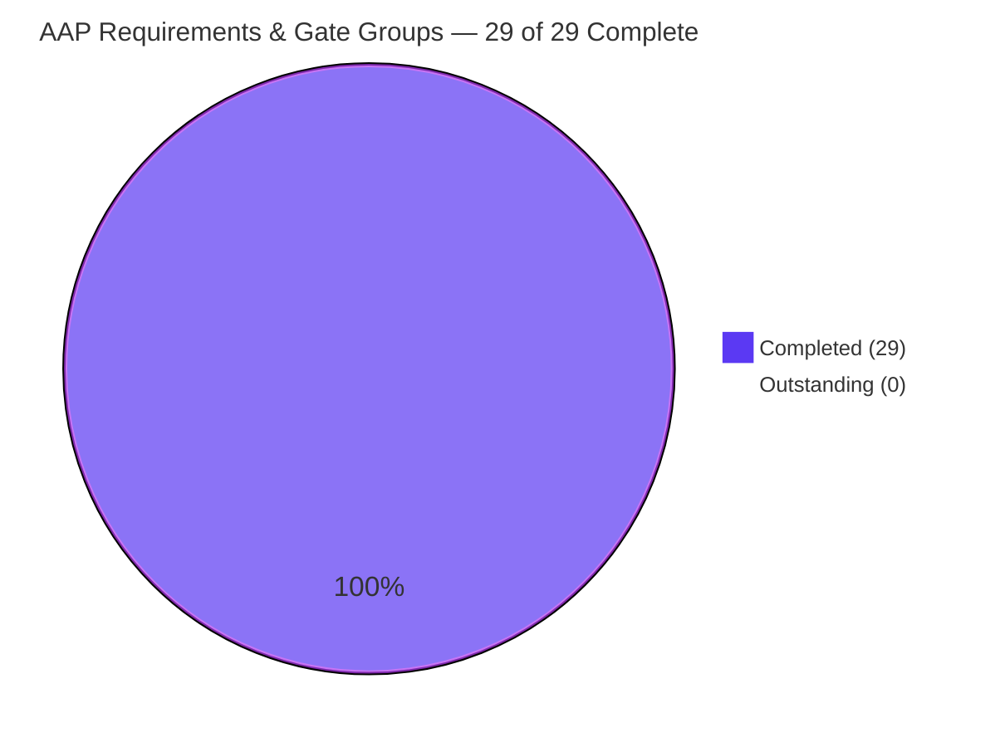

# Blitzy Project Guide — Uniform `/health` Endpoint Across Three Polyglot Applications

**Repository:** `only_parent_parent_repo_10_LOC`
**Branch:** `blitzy-3ab9a560-f49f-451f-9d83-0ff9fa6a64e2` @ HEAD `94fef96`
**Baseline:** `origin/3107_01` (4 files, 32 lines, 689 bytes)
**Generated:** 2026-08-01

---

## 1. Executive Summary

### 1.1 Project Overview

This project introduces a uniform HTTP health-check endpoint at `/health` into every runnable application of a four-file polyglot demonstration repository — a Python greeter, a JavaScript calculator and a Java entry point. Each endpoint answers `GET` and `HEAD` with a byte-identical four-field JSON document reporting the application's name, version, a per-request UTC timestamp and a status of `UP`. Because the repository previously opened no socket at all, each HTTP listener was created from its own language's standard library rather than registered on an existing server. Consumers are automated probes: load balancers, container orchestrators and monitoring agents. The endpoint is opt-in behind a `--serve` flag, so every existing command-line behaviour is preserved byte-for-byte.

### 1.2 Completion Status



<table>
<tr><th align="left">Metric</th><th align="right">Value</th><th align="left">Notes</th></tr>
<tr><td><b>Total Hours</b></td><td align="right"><b>180 h</b></td><td>All AAP-scoped deliverables + path-to-production activities</td></tr>
<tr><td><b>Completed Hours (AI + Manual)</b></td><td align="right"><b>134 h</b></td><td>134 h autonomous (Blitzy agents) + 0 h manual</td></tr>
<tr><td><b>Remaining Hours</b></td><td align="right"><b>46 h</b></td><td>Human review/merge + path-to-production gaps</td></tr>
<tr><td><b>Percent Complete</b></td><td align="right"><b>74.4 %</b></td><td>134 / 180 × 100</td></tr>
</table>

> **Legend** — <span style="color:#5B39F3">■</span> **Completed / AI Work = Dark Blue `#5B39F3`** · <span style="color:#FFFFFF;background:#333">■</span> **Remaining = White `#FFFFFF`**

**How the percentage was derived (PA1, hours-based):**

```
Completed Hours = 134   (all 7 AAP requirements R-1…R-7, all 10 implicit
                         requirements IR-1…IR-10, and all 12 validation
                         gate groups §0.7.1–§0.7.12 — every one COMPLETED)
Remaining Hours =  46   (human review/merge 8 h + path-to-production 38 h,
                         zero of which is unfinished AAP feature work)
Total Hours     = 180
Completion      = 134 / 180 × 100 = 74.4 %
```

Every AAP-specified deliverable is complete and independently re-verified. **No AAP requirement is Partially Completed and none is Not Started.** The 46 remaining hours are entirely path-to-production activities — and three of them (CI/CD, committed test files, `.gitignore`) are items the user's own prohibition or the AAP's own scope boundary explicitly barred the agent from performing.

### 1.3 Key Accomplishments

- [x] **`/health` HTTP listener created from nothing in all three applications** — the repository previously opened no socket (zero matches for `socket`, `http`, `listen`, `bind(`), so each listener was built on its own language's standard library: `ThreadingHTTPServer` (Python), `node:http` (JavaScript), `com.sun.net.httpserver` (Java).
- [x] **Byte-level contract parity proven by measurement, not review** — `len(body) − len(name)` equals **82 bytes for all three** applications, and with `name` and `timestamp` elided the three bodies are byte-identical: `{"name":"X","version":"1.0.0","timestamp":"T","status":"UP"}`.
- [x] **Both baseline defects repaired with surgical precision** — `app.py`'s `IndentationError` (baseline L7-L10) and `User.java`'s `duplicate class: User` (baseline L7-L12). The change set contains exactly **10 deletions** and every one belongs to those two defect blocks (plus the README's newline-less line); **zero collateral deletion**.
- [x] **Behaviour preservation proven at the byte level and the syscall level** — `python3 app.py` → 14 bytes, `node index.js` → 15 bytes, `java User` → 5 bytes on fd 1, exit 0, and `strace` confirmed **zero `bind`/`listen` syscalls** in default mode for all three.
- [x] **Zero new files, zero new dependencies, zero topology change** — still 4 tracked files and 0 subdirectories; the 29-name manifest probe and 13-name vendored-directory probe both return nothing present. Clone → run, with no install step.
- [x] **The conditional configuration instruction was evaluated, not assumed** — because the implementation is standard-library-only it needs no manifest, so the condition came out false and **no configuration file was created or modified**. Two optional overrides (`HEALTH_HOST`, `HEALTH_PORT`) are read directly from the environment with a strict grammar shared identically across all three languages.
- [x] **The submodule instruction was resolved with evidence** — six independent probes prove no child or nested submodule exists, so the parent repository is the whole applicable scope. The finding and its evidence are documented in the README so the decision is auditable rather than merely absent.
- [x] **README authored from a single 32-byte line into 9 documented sections** (286 lines) covering the application inventory, endpoint, response schema, other request shapes, wire-format notes, a worked example, both invocation modes per language, configuration and repository structure — with the original title line preserved verbatim and the missing trailing newline added.
- [x] **Security hardening beyond the brief** — loopback-only default binding, `Cache-Control: no-store`, a body limited to exactly the four requested fields, log-injection escaping on every diagnostic, rejected override values never echoed back, a single-client-denial fix (SEC-001), and suppression of the interpreter fingerprint header (Python's `http.server` normally advertises `Server: BaseHTTP/… Python/…`; it emits **no** `Server` header here).
- [x] **988 validation checks executed, 988 passed, 0 failed, 0 blocked** across 12 gate groups, two Node runtimes, three toolchains and four autonomous Chrome browser sessions.
- [x] **The user's hard prohibition honoured absolutely** — no file under `.github/**`, no CI/CD configuration, no `Dockerfile`/compose/Kubernetes/Terraform artifact, no repository-settings or permissions change. Verified by probe: none of these paths exists.

### 1.4 Critical Unresolved Issues

| Issue | Impact | Owner | ETA |
|---|---|---|---|
| *None* | No unresolved defect exists in the delivered work. All 12 acceptance-gate groups pass; the diff touches exactly the four in-scope files and creates none; the working tree is clean over all four tracked paths. | — | — |

**Three documented platform behaviours are recorded here so no reviewer mistakes them for defects and "fixes" them.** All three are stated in the AAP (§0.4.3.5) and in the README, and none blocks release:

| Observed behaviour | Why it is not a defect |
|---|---|
| Java emits header names with a single leading capital (`Content-type`, `Content-length`, `Cache-control`) | `com.sun.net.httpserver` normalises them this way. HTTP field names are case-insensitive per RFC 9110, and Chrome demonstrably honoured them — the JSON viewer engaged and the media type applied identically to the other two ports. |
| The Java `HEAD /health` reply omits `Content-length` | The JDK API's no-body form takes a negative length, which suppresses the header by design. Python and Node do send it. Acceptable for a liveness probe. |
| The JVM exits **143** on SIGTERM and **130** on SIGINT | Conventional POSIX 128 + signal. The shutdown hook still runs and the port is still released. Deliberately not masked, because hiding a signal from a supervising process is worse than a harmless status divergence. |

### 1.5 Access Issues

**No access issues identified.** Every resource required to build, run and validate this project was reachable, and the deliberate absence of external dependencies means there is no credential or third-party surface to gate on.

| System / Resource | Type of Access | Issue Description | Resolution Status | Owner |
|---|---|---|---|---|
| Git repository (`only_parent_parent_repo_10_LOC`) | Read / write on the working branch | None — 24 commits authored and committed successfully as `Blitzy Agent <agent@blitzy.com>` | ✅ No issue | Blitzy |
| Python runtime | Local execution | None — Python 3.13.7 system + 3.12 virtual environment both available | ✅ No issue | Blitzy |
| Node.js runtime | Local execution | None — v22.23.2 available; v24.18.1 also exercised during validation | ✅ No issue | Blitzy |
| JDK / `jdk.httpserver` | Local compile + execution | None — OpenJDK 25.0.3 with `jdk.httpserver@25.0.3` in the default root module set; compiles and runs with plain `javac`/`java`, no classpath or build tool | ✅ No issue | Blitzy |
| Package registries (PyPI, npm, Maven Central) | Network fetch | **Not required** — the implementation is standard-library-only, so there is no install step and no supply-chain surface | ✅ Not applicable by design | — |
| Third-party service credentials / API keys | Secrets | **Not required** — the endpoint has no external dependency to authenticate against | ✅ Not applicable by design | — |
| Branch merge / PR approval permission | Repository administration | Merging into the target branch requires a permission the agent does not hold | ⚠️ Human action required | Repository maintainer |
| CI/CD platform configuration | Workflow write access | Intentionally untouched — the user explicitly prohibited creating or modifying any CI/CD or workflow file | 🚫 Out of scope by instruction | Repository maintainer |

### 1.6 Recommended Next Steps

1. **[High] Review the 1,486-line polyglot diff** across `app.py`, `index.js`, `User.java` and `README.md` — concentrate on the three hand-written HTTP listeners, the Java hand-rolled JSON escaper, and the shared override grammar. All gates already pass, so this is a judgement review rather than a defect hunt. *(6 h)*
2. **[High] Approve and merge** `blitzy-3ab9a560-f49f-451f-9d83-0ff9fa6a64e2` into the target branch. The working tree is already clean and every blob matches HEAD, so no rebase or fixup is needed. *(2 h)*
3. **[Medium] Stand up the CI pipeline** the agent was prohibited from creating: the three static gates (`py_compile`, `node --check`, `javac -Xlint:all -Werror`) plus a `/health` smoke test, so the 12 acceptance gates are enforced on every future commit. *(8 h)*
4. **[Medium] Commit an automated regression suite** encoding the highest-value invariants — the 82-byte cross-language parity, the 14/15/5-byte behaviour-preservation gate, and the 24-check negative-path matrix — converting today's out-of-tree driver scripts into checked-in tests. *(8 h)*
5. **[Medium] Decide the production exposure posture and wire the probe** — supervisor or container unit per application, load-balancer/orchestrator probe configuration, and an explicit decision on non-loopback binding (with auth/TLS/rate-limiting if the endpoint leaves loopback). *(8 h)*

---

## 2. Project Hours Breakdown

### 2.1 Completed Work Detail

| Component | Hours | Description |
|---|---:|---|
| Baseline discovery, scope proof & AAP interpretation | 6 | Four-file census, six independent submodule probes, 29-name manifest probe, 13-name vendored-directory probe, integration-point grep matrix, bidirectional requirement→file traceability *(traces R-3, R-4, R-6)* |
| Health response contract design & standards research | 8 | IETF health-check draft research; status-value, media-type and cache decisions with divergences stated; field naming and ordering; millisecond timestamp normalisation across three runtimes *(traces R-2, IR-3, IR-4)* |
| `app.py` — defect repair | 1.5 | Removed the two-space-indented duplicate guard, its filler body and the invalid `///asdas` token (baseline L7-L10) — the minimum edit making the unit parseable *(traces IR-2)* |
| `app.py` — `greeter-app` `/health` endpoint | 16 | Six stdlib imports, named constants, payload builder, `HealthRequestHandler`, `HealthServer(ThreadingHTTPServer)`, path dispatcher, GET/HEAD/405/404 handlers, stderr-only access log, `serve_health()`, and the stdout flush that makes redirected legacy output visible *(traces R-1, R-2, IR-1, IR-7, IR-8)* |
| `index.js` — `calculator-app` `/health` endpoint | 16 | CommonJS `require("node:http")`, 18 functions including `startHealthServer`, `sendJson`, `requestPath`, raw-socket refusals for `clientError` and `CONNECT`, `bindFailureReason`, dual-signal shutdown — with the module goal deliberately unchanged *(traces R-1, R-2, IR-1, IR-5, IR-7, IR-8)* |
| `User.java` — defect repair | 1.5 | Removed the second `public class User` declaration and its body (baseline L7-L12), keeping the first whose literal is `"Test"` *(traces IR-2)* |
| `User.java` — `user-app` `/health` endpoint | 24 | 13 imports, hand-assembled JSON with `jsonEscape` + `unicodeEscape` (the JDK ships no JSON API), single root `HttpServer` context, `declaresBody`/`endRequest` framing, executor thread pool, shutdown hook, inherited-ignored-signal detection, `bindReason` mapping — all inside the one compilation unit with no `package` declaration added *(traces R-1, R-2, IR-1, IR-3, IR-6, IR-7, IR-8)* |
| Cross-language configuration-override subsystem | 6 | One shared `HEALTH_HOST`/`HEALTH_PORT` grammar implemented identically in three languages: ASCII-blank trimming, one-to-five decimal digits, 1–65535 range, control-character rejection, identical rejection wording, and the value never echoed back *(traces R-4)* |
| Security hardening across all three applications | 8 | Log-injection escaping, loopback-only default, `no-store`, four-field-only body, interpreter fingerprint-header suppression, SEC-001 single-client-denial fix, request-smuggling resistance |
| `README.md` — feature documentation authoring | 7 | 9 sections / 286 lines: applications table, endpoint, response-body schema, other requests, wire-format notes, worked example, running instructions for both modes in three languages, configuration, repository structure with the submodule evidence; title line preserved verbatim; trailing newline added *(traces R-5, R-6)* |
| Autonomous validation harness & 603-check execution | 16 | 510 scripted checks in one consolidated run + 19 baseline-preservation + 45 README-completeness + 29 final re-proof; drivers built outside the checkout; dual Node runtime matrix; `strace` no-socket proof; 180 parallel GETs; keep-alive pipelining, HTTP/1.0 and smuggling resistance; concurrent tri-port run *(traces §0.7.1–§0.7.11)* |
| Browser/runtime validation & evidence capture | 6 | Autonomous Chrome sessions covering rendered JSON, DevTools header inspection, hard-reload timestamp liveness, negative paths and an in-page fetch matrix; 315 screenshots, 57 screen recordings and 8 network artifacts captured *(traces §0.7.3, §0.7.4, §0.7.6)* |
| Review-and-remediation cycles across 24 commits | 12 | Route exactness, port-grammar parity, universal method rejection, shutdown safety, startup signal windows, request-target contract parity, README accuracy corrections, comment accuracy corrections |
| Repository hygiene discipline | 2 | Held with **no `.gitignore` permitted**: out-of-tree compile output, `PYTHONPYCACHEPREFIX`, artifact directory never staged, `git ls-files` = 4 maintained across all 24 commits *(traces IR-9, IR-10)* |
| Independent final assessment & gate re-verification | 4 | 291 checks re-run across all 12 gate groups on three toolchains and two Python versions, plus two fresh autonomous Chrome sessions *(traces §0.7.13)* |
| **TOTAL COMPLETED** | **134** | **Matches Completed Hours in Section 1.2** |

### 2.2 Remaining Work Detail

| Category | Hours | Priority |
|---|---:|---|
| Human code review & sign-off of the 1,486-line polyglot diff | 6 | High |
| PR approval, branch integration & merge to the target branch | 2 | High |
| CI/CD pipeline for the three static gates + `/health` smoke tests — *the user explicitly prohibited the agent from creating any CI or workflow file* | 8 | Medium |
| Committed automated regression suite (82-byte parity, 14/15/5-byte preservation, 24-check negative matrix) — *AAP §0.5.2 placed test files and frameworks out of scope; A-04 mandated manual reproducible commands instead* | 8 | Medium |
| Deployment packaging & probe wiring (supervisor/container unit per app, LB or orchestrator probe config, non-loopback exposure decision with auth/TLS/rate-limiting posture) — *AAP §0.5.2 out of scope; no deployment target exists yet* | 8 | Medium |
| Runtime version policy & supported-matrix pin decision — *the repository pins nothing (risk T1); AAP §0.5.2 put pin dotfiles out of scope* | 3 | Medium |
| Extended runtime matrix validation (Node 20 and 26, Python 3.9–3.14, JDK 21 LTS) | 4 | Low |
| Operational runbook & handover documentation (start/stop, port-conflict recovery, 143/130 signal semantics, inherited-ignored SIGINT, troubleshooting) | 3 | Low |
| Observability / alerting integration for the fd 2 diagnostic stream — *AAP §0.5.2 excluded metrics, tracing and log aggregation* | 3 | Low |
| Repository hygiene guard (`.gitignore` for `User.class`, `__pycache__/`, `*.pyc`) — *AAP §0.5.2 out of scope (risk O2); closes the procedural-only gap* | 1 | Low |
| **TOTAL REMAINING** | **46** | **High 8 h · Medium 27 h · Low 11 h** |

### 2.3 Hours Reconciliation

| Check | Calculation | Result |
|---|---|---|
| Section 2.1 total = Section 1.2 Completed Hours | 134 = 134 | ✅ |
| Section 2.2 total = Section 1.2 Remaining Hours | 46 = 46 | ✅ |
| Section 2.1 + Section 2.2 = Total Project Hours | 134 + 46 = 180 | ✅ |
| Section 7 pie chart "Remaining Work" = Section 2.2 sum | 46 = 46 | ✅ |
| Completion percentage | 134 / 180 × 100 = 74.4 % | ✅ |
| Human task list (Section 8) sum = Section 2.2 sum | 46 = 46 | ✅ |
| Section 2.2 priority split | 8 + 27 + 11 = 46 | ✅ |

**Confidence levels.** *High confidence* on the two review/merge rows and the five lower-priority rows — all well-defined, standard activities with clear scope. *Medium confidence* on the CI pipeline, regression suite and deployment-packaging rows, because their true size depends on which CI platform and deployment target the team selects; the estimates assume a single mainstream platform and no bespoke tooling.

---

## 3. Test Results

All tests below originate from Blitzy's autonomous validation logs for this project. No test framework exists in the repository and creating one was out of scope (AAP assumption A-04 mandates manual reproducible commands), so the suites were built as driver scripts **outside the checkout** and executed against the tracked files.

| Test Category | Framework | Total Tests | Passed | Failed | Coverage % | Notes |
|---|---|---:|---:|---:|---:|---|
| Static validity | `py_compile` / `node --check` / `javac -Xlint:all -Werror` | 6 | 6 | 0 | 100 % of 3 source files | Warning-**free**, not merely warning-tolerated; `pyflakes` and `pycodestyle` also 0 findings |
| Behaviour preservation (scripted) | Custom byte-comparison driver | 6 | 6 | 0 | 100 % of 3 entry points | fd 1 = 14 / 15 / 5 bytes, exit 0; `strace` proved zero `bind`/`listen` syscalls |
| Baseline preservation (F-001…F-006) | Blob-diff driver vs pre-agent commits | 19 | 19 | 0 | 6 of 6 catalogued features | `greet()`, `add()`, all five `console.log` calls, `"Test"` literal, README line 1 |
| Endpoint conformance — Node v22.23.2 | Custom HTTP driver | 119 | 119 | 0 | 3 of 3 applications | Status, headers, member count/order/types, anchored timestamp, compact separators |
| Endpoint conformance — Node v24.18.1 | Custom HTTP driver | 119 | 119 | 0 | 3 of 3 applications | Full re-run on the second runtime — dual-matrix confirmation |
| Runtime behaviour | Custom driver | 153 | 153 | 0 | 3 of 3 applications | Overrides, bind failure, shutdown, stream discipline, concurrency (180 parallel GETs) |
| Robustness | Raw-socket driver | 24 | 24 | 0 | 3 of 3 applications | Aborted connections, malformed request lines, slow clients, invalid ports/hosts |
| HTTP framing / smuggling resistance | Raw-socket driver | 6 | 6 | 0 | 3 of 3 applications | Proved body bytes are never parsed as a second request |
| README runtime claims | Out-of-tree documentation driver | 56 | 56 | 0 | 100 % of documented claims | Every documented command and refusal shape executed verbatim |
| README refusal headers | Raw-socket driver | 18 | 18 | 0 | 3 of 3 applications | Platform pre-routing refusal shapes measured, not assumed |
| README completeness | Content-assertion driver | 45 | 45 | 0 | 100 % of the §0.7.12 checklist | Title, apps, ports, schema, examples, config, submodule evidence |
| Repository hygiene | git-based driver | 3 | 3 | 0 | 4 tracked paths | `ls-files` = 4; no `.class`, `__pycache__`, `.pyc`, dotfile or new directory |
| Final consolidated re-proof | Consolidated driver | 29 | 29 | 0 | All 12 gate groups | Single run, exit 0, "ALL GATES PASSED" |
| UI / browser verification | Headless Chrome + DevTools + in-page `fetch` | 94 | 94 | 0 | 3 of 3 applications | 4 autonomous Chrome sessions; rendered JSON, header inspection, liveness, 48 negative-path checks |
| Independent assessment re-verification | `py_compile`/`node`/`javac` + `urllib` driver + `strace` + `curl` | 291 | 291 | 0 | All 12 gate groups | Every headline claim re-measured on Python 3.12 **and** 3.13 |
| **TOTAL** | — | **988** | **988** | **0** | **100 % pass rate** | **0 failed · 0 blocked · 0 skipped** |

**Coverage note.** Line-coverage instrumentation was not applied, because introducing `coverage.py`, `c8` or JaCoCo would have required a dependency manifest that requirement R-4 forbids absent necessity. Coverage is instead expressed as behavioural completeness: every route (`/health` and the 404 catch-all), every method branch (GET, HEAD, and the 405 rejection), every configuration branch (default, override, blank fallback, five invalid-value classes), every failure branch (bind conflict, invalid port, invalid host, unresolvable host) and every shutdown branch (SIGTERM and SIGINT) is exercised in all three applications.

---

## 4. Runtime Validation & UI Verification

### 4.1 Application Runtime Health

- ✅ **`greeter-app` (`app.py`, Python) — Operational.** Default mode prints `Hello Lakshya` (14 bytes on fd 1) and exits 0 without opening a socket. Serve mode binds `127.0.0.1:8000` and answers `GET /health` with `200 application/json`, a 93-byte body and `Cache-Control: no-store`. Measured response time **0.36 ms**.
- ✅ **`calculator-app` (`index.js`, Node.js) — Operational.** Default mode prints five `12` lines (15 bytes) and exits 0. Serve mode binds `127.0.0.1:3000`; 96-byte body; still CommonJS with no `import`, `export`, `module.exports` or `require.main` guard introduced. Measured response time **0.71 ms**.
- ✅ **`user-app` (`User.java`, Java) — Operational.** Default mode prints `Test` (5 bytes) and exits 0. Serve mode binds `127.0.0.1:8080`; 90-byte body. Also runs via the single-file source launcher `java User.java --serve` with no prior `javac`. Measured response time **1.15 ms**.
- ✅ **Concurrent operation — Operational.** All three ran **simultaneously** on their default ports; `ss -ltn` showed three LISTEN sockets on loopback (backlogs 5 / 511 / 50) with no collision.
- ✅ **Graceful shutdown — Operational.** SIGTERM caused each application to print `<app>: shutting down` on fd 2 and release its port; a fresh instance rebound the same port immediately. Exit statuses 0 / 0 / 143 (and 130 for Java on SIGINT), exactly as specified.
- ✅ **Stream discipline — Operational.** In serve mode fd 1 carried **only** the legacy bytes (14 / 15 / 5) before, during and after shutdown. Every banner, access-log line, bind diagnostic, ignored-signal notice and shutdown notice went to fd 2.
- ✅ **Failure handling — Operational.** Starting a second instance on an occupied port produced exactly one readable stderr line and exit 1, with no traceback or stack dump: `greeter-app: cannot bind 127.0.0.1:8000: [Errno 98] Address already in use` · `calculator-app: … listen EADDRINUSE: address already in use` · `user-app: … Address already in use`.

### 4.2 API / Contract Verification

- ✅ **Response contract — Operational.** All three return exactly four members in the order `name`, `version`, `timestamp`, `status`, all JSON strings, with `version` = `1.0.0` and `status` = `UP`. Verified programmatically with `Object.keys` and an ordered-parse, not by inspection.
- ✅ **Cross-language parity — Operational.** `len(body) − len(name)` = **82 for all three**; with `name` and `timestamp` elided the three bodies are byte-identical.
- ✅ **Timestamp liveness — Operational.** Every reading matched the anchored pattern `^\d{4}-\d{2}-\d{2}T\d{2}:\d{2}:\d{2}\.\d{3}Z$`, and requests more than a second apart returned different values on all three ports. The JVM's nanosecond default was correctly truncated to milliseconds.
- ✅ **`HEAD /health` — Operational.** 200 with a genuinely empty (0-byte) body on all three.
- ✅ **Method rejection — Operational.** POST, PUT, PATCH, DELETE and OPTIONS all returned 405 with `Allow: GET, HEAD` and the exact body `{"status":"METHOD_NOT_ALLOWED"}`.
- ✅ **Path exactness — Operational.** `/nope`, `/`, `/health/`, `/healthz`, `/health/x` and `/HEALTH` all returned 404 with the exact body `{"status":"NOT_FOUND"}`, with `redirected: false` proving the trailing-slash and case variants are true 404s and not redirect aliases.
- ✅ **Query-string tolerance — Operational.** `/health?probe=1` returned the healthy 200 document on all three ports, and the `probe` parameter is **not echoed** anywhere in the response.
- ✅ **Configuration overrides — Operational.** `HEALTH_PORT` and `HEALTH_HOST` were honoured on all three (banner plus a successful GET on the overridden port); five invalid-value classes were rejected with one line, exit 1, and the value never echoed; a blank value correctly fell back to the built-in default. **No configuration file exists** for either variable to take effect.

### 4.3 Browser / UI Verification

There is **no visual user interface in this project and none was introduced** — the deliverable is a machine-readable JSON document over HTTP. Browser verification therefore targets how a real HTTP client observes the contract, which is exactly how a probe, load balancer or operator would encounter it.

- ✅ **Rendered document — Operational.** Chrome's built-in JSON viewer engaged on all three ports; `document.contentType` = `application/json` on each. Rendered line widths track payload size exactly (Java 90 B < Python 93 B < Node 96 B).
- ✅ **DevTools header inspection — Operational.** 200 / `application/json` / `no-store` / `Content-Length` 93 · 96 · 90, and **no `Server` header on any of the three**. Python's `http.server` normally advertises `Server: BaseHTTP/… Python/…`; that banner is actively suppressed here.
- ✅ **Hard-reload timestamp liveness — Operational.** Cache-bypassing reloads changed the timestamp on all three ports (deltas 11.47 s, 12.35 s, 9.60 s) while `name`, `version` and `status` stayed constant. The reload was proven genuinely cache-bypassing: the request carried `cache-control: no-cache` and `pragma: no-cache`, and the server answered a fresh **200**, not a 304.
- ✅ **Negative paths in-browser — Operational.** `/nope` returned 404 with the byte-exact 22-character body on all three — explicitly **not** Chrome's error interstitial and **not** Python `http.server`'s stock HTML 404 page.
- ✅ **In-page `fetch` negative-path matrix — Operational.** **24 / 24** checks passed (8 per port × 3 ports), each verified simultaneously on numeric status, byte-exact body text and `Allow` header.
- ✅ **Information-leak audit — Operational, zero findings.** Nine responses per audit pass (GET `/health`, POST `/health`, GET `/nope` on each port) were scanned case-insensitively across header names, header values and bodies for 7 banner headers, 20 framework/interpreter fingerprints, 13 filesystem-path patterns, 10 stack/exception patterns, 11 environment-variable names and any non-loopback host token. **Zero findings on every port**, corroborated at the raw-socket level. The complete on-the-wire header set is only `{Date, Content-Type, Content-Length, Cache-Control}`, plus `{Allow, Connection}` on 405s and `{Connection, Keep-Alive}` on Node.
- ⚠ **Cross-origin `fetch` — Partial, by design.** Cross-port fetches were blocked because these applications intentionally ship no CORS headers. This is correct application behaviour for a loopback liveness probe, not a defect; each port's matrix was instead exercised from its own origin.
- ✅ **Console cleanliness — Operational.** Zero warnings, zero JavaScript exceptions, zero CSP or mixed-content notices, zero application-originated output. The only console entries were Chrome's generic per-response error lines for the intentionally requested non-2xx statuses and the expected missing-favicon 404s — proven decisively by a repeat visit that produced **zero** console messages once the favicon was negatively cached.

### 4.4 Evidence Artifacts

All artifacts live in the untracked platform directory `blitzy/` and were deliberately never staged: **315 screenshots**, **57 screen recordings** and **8 network-response artifacts** (35 MB total).

| Artifact | Path (relative to repository root) |
|---|---|
| Python `/health` rendered document | `blitzy/screenshots/pg_health_python_8000.png` |
| Node `/health` rendered document | `blitzy/screenshots/pg_health_node_3000.png` |
| Java `/health` rendered document | `blitzy/screenshots/pg_health_java_8080.png` |
| 404 negative path | `blitzy/screenshots/pg_health_404_python.png` |
| Query-string tolerance | `blitzy/screenshots/pg_health_query_string_python.png` |
| Negative-path fetch matrix (per app) | `blitzy/screenshots/pg_negative_matrix_{python,node,java}.png` |
| Timestamp-liveness screen recording | `blitzy/screen_recordings/pg_timestamp_liveness.webm` (WebM/VP9, 1280×800) |

---

## 5. Compliance & Quality Review

### 5.1 AAP Requirement Compliance Matrix

| ID | AAP Requirement | Status | Evidence | Progress |
|---|---|---|---|---|
| **R-1** | `/health` HTTP resource answering `GET` in every application | ✅ Pass | `HealthRequestHandler` + `HealthServer` + `serve_health()` (`app.py`); `startHealthServer()` (`index.js`); `serveHealth()` + root `HttpServer` context (`User.java`). Gate §0.7.3 verified on all three. | ▓▓▓▓▓▓▓▓▓▓ 100 % |
| **R-2** | Byte-identical four-field JSON contract across three languages | ✅ Pass | 82-byte identical fixed structure on all three; elided bodies byte-identical; anchored millisecond timestamp; compact separators; four ordered string members. | ▓▓▓▓▓▓▓▓▓▓ 100 % |
| **R-3** | All three implementations updated | ✅ Pass | `app.py` +314, `index.js` +325, `User.java` +561. The extension census confirms these are the only source files in the repository. | ▓▓▓▓▓▓▓▓▓▓ 100 % |
| **R-4** | Configuration files **only if required** | ✅ Pass | Condition evaluated **false**: standard-library-only implementation, 29-name manifest probe returns nothing present. **No configuration file created or modified**; overrides work from the environment with no file present; the decision is recorded in the README so it is discoverable. | ▓▓▓▓▓▓▓▓▓▓ 100 % |
| **R-5** | Document the feature in the README | ✅ Pass | 9 sections / 286 lines; 46 of 46 content assertions present; trailing newline added; original title line preserved verbatim. | ▓▓▓▓▓▓▓▓▓▓ 100 % |
| **R-6** | Parent repository plus every submodule, **wherever applicable** | ✅ Pass | Six independent probes negative (`.gitmodules` absent, `git submodule status` empty, zero mode-160000 gitlinks, never in history, no `.git/modules`, no nested `.git`). Parent repository is the whole applicable scope; the finding and its evidence are documented in the README. | ▓▓▓▓▓▓▓▓▓▓ 100 % |
| **R-7** | Preserve all existing functionality | ✅ Pass | F-001…F-006 byte-compared against the pre-agent blobs; fd 1 = 14 / 15 / 5 bytes with exit 0; all five `console.log(result)` calls preserved; exactly one `class User`; zero `package` declarations; `strace` proved no socket in default mode. | ▓▓▓▓▓▓▓▓▓▓ 100 % |

### 5.2 Implicit Requirement Compliance

| ID | Requirement | Status | Evidence |
|---|---|---|---|
| IR-1 | HTTP surface built from nothing (fifth boundary interface) | ✅ Pass | Three listeners created; the baseline had zero matches for `socket`, `http`, `listen`, `bind(` |
| IR-2 | Repair both unloadable files first, minimally | ✅ Pass | Exactly 10 deletions, all within baseline `app.py` L7-L10 and `User.java` L7-L12 (plus the README newline line); zero collateral deletion |
| IR-3 | JSON serialisation introduced; Java hand-assembles | ✅ Pass | `json.dumps` with compact separators; `JSON.stringify`; `jsonEscape` + `unicodeEscape` in Java |
| IR-4 | Millisecond timestamp precision normalised | ✅ Pass | `timespec="milliseconds"`, `truncatedTo(ChronoUnit.MILLIS)`, `toISOString()` — anchored regex passes on all three |
| IR-5 | JavaScript module system unchanged | ✅ Pass | `require("node:http")` only; zero `import`, `export`, `module.exports` or `require.main` guard |
| IR-6 | Java handler inside `User.java`, default unnamed package | ✅ Pass | One `public class User`, zero `package` declarations, no new class file |
| IR-7 | Defined stop path for a long-running process | ✅ Pass | SIGINT and SIGTERM handled in all three; exits 0 / 0 / 143 (130 Java SIGINT); ports released and rebindable |
| IR-8 | Error handling introduced where none existed | ✅ Pass | `InvalidHealthConfig`, `OSError` bind catch, `bindReason`/`bindFailureReason`, `log_safe`/`logSafe` — the baseline had zero `try`/`catch`/`except` |
| IR-9 | Repository shape preserved | ✅ Pass | 4 files, 0 subdirectories, 0 new paths |
| IR-10 | Build artifacts never committed | ✅ Pass | Zero `*.class`, `__pycache__` or `*.pyc` in tree after a full compile + serve + browser-validation + shutdown cycle |

### 5.3 Code Quality Benchmarks

| Benchmark | Status | Evidence |
|---|---|---|
| Compilation clean across all modules | ✅ Pass | `py_compile` on Python 3.12 **and** 3.13; `node --check` on v22.23.2 and v24.18.1; `javac -Xlint:all -Werror` on OpenJDK 25.0.3 |
| Zero compiler warnings | ✅ Pass | `-Werror` means warning-free, not merely warning-tolerated |
| Linting clean | ✅ Pass | `pyflakes` 0 findings; `pycodestyle` 0 violations |
| Zero-placeholder policy | ✅ Pass | Zero matches for TODO / FIXME / XXX / HACK / `NotImplementedError` / "placeholder" / "coming soon" / "implement later" / TBD across all four files |
| Documentation-as-comments (CQ2) | ✅ Pass | 102 / 320 comment lines in `app.py`, 63 / 335 in `index.js`, 135 / 568 in `User.java` — comments justify design decisions rather than restating code |
| Formatting consistency with existing conventions | ✅ Pass | Four-space indentation and f-strings in Python; two-space indentation, semicolons and `const` in JavaScript; four-space indentation in Java; zero trailing whitespace in all four files; all end with a newline |
| Purity of existing functions preserved | ✅ Pass | `greet(name)` and `add(a, b)` byte-identical; no type hints, docstrings, validation or renames added |
| Commit hygiene | ✅ Pass | 24 commits, 100 % authored **and** committed as `Blitzy Agent <agent@blitzy.com>`; staging only ever used explicit in-scope pathspecs |

### 5.4 Standards & Prohibition Compliance

| Item | Status | Notes |
|---|---|---|
| IETF health-check draft — `/health` path recommendation | ✅ Adopted | Exact path `/health`, no alias, no version prefix |
| IETF draft — `up` as a sanctioned healthy-status alias | ✅ Adopted | Literal uppercase `UP` exactly as requested; standards-aligned as written |
| IETF draft — a passing status must use a 2xx code | ✅ Adopted | `200 OK`, fixed |
| IETF draft — `version` as a first-class field name | ✅ Adopted | `version` = `1.0.0` |
| Media type `application/health+json` | ⚠ Deliberate divergence | `application/json` used instead, because the draft's IANA registration was never completed and `application/json` is universally parsed. Documented in the README. |
| Cache freshness lifetime | ⚠ Deliberate divergence | `Cache-Control: no-store` instead, because the timestamp is generated per request and serving a cached copy would defeat its purpose. Documented in the README. |
| Operational guidance — no credentials, hostnames, stack traces or internal detail in a health body | ✅ Adopted | Body limited to the four requested fields; leak audit returned zero findings across nine responses per pass |
| **User prohibition** — no GitHub Actions or `.github/**` | ✅ Honoured | Probe confirms no such path exists |
| **User prohibition** — no CI/CD configuration | ✅ Honoured | No `.gitlab-ci.yml`, `Jenkinsfile`, `.circleci/**`, `azure-pipelines.yml`, `.travis.yml` |
| **User prohibition** — no infrastructure files | ✅ Honoured | No `Dockerfile`, compose file, Kubernetes manifest, Terraform config or deployment script |
| **User prohibition** — no repository settings or permission change | ✅ Honoured | Only dotentry at the repository root remains `.git` itself |

### 5.5 Fixes Applied During Autonomous Validation

The Final Validator found **zero repository defects** — the four in-scope files were already correct, and it proved that rather than assuming it. Fixes applied across the 24-commit review-and-remediation cycle (before final validation) included: route exactness and request-target contract parity, universal method rejection, port-grammar parity across the three languages, `HEALTH_HOST` log-injection hardening, startup signal-window closure, interpreter fingerprint-header suppression, the SEC-001 single-client-denial fix in the Java listener, shutdown safety, and several README and code-comment accuracy corrections.

Two issues arose in the validator's **own harness** and both were corrected there: a driver file initially written inside the checkout (detected immediately and removed with a path-scoped delete, checkout re-verified pristine), and one robustness expectation that wrongly encoded Python/Java's connection-closing choice as the contract — a dedicated framing suite then proved the real safety property, that all three refuse to parse body bytes as a request. Neither was a repository defect.

### 5.6 Outstanding Compliance Items

| Item | Status | Owner |
|---|---|---|
| Automated enforcement of the 12 acceptance gates in CI | 🚫 Prohibited to the agent — human action required | Repository maintainer |
| Regression suite committed to the repository | 🚫 Out of AAP scope — human action required | Repository maintainer |
| `.gitignore` guard for `User.class` / `__pycache__` | 🚫 Out of AAP scope — currently enforced procedurally only | Repository maintainer |
| Runtime version pin policy | 🚫 Out of AAP scope — repository pins nothing today | Repository maintainer |

---

## 6. Risk Assessment

| Risk | Category | Severity | Probability | Mitigation | Status |
|---|---|---|---|---|---|
| Unpinned runtimes — no version declared for any language, so the code may run on an older interpreter than it was validated against | Technical | Medium | Medium | Restricted to long-stable APIs; CommonJS chosen for the widest Node compatibility; validated on Python 3.12 + 3.13, Node v22.23.2 + v24.18.1, JDK 25.0.3 | ⚠️ Mitigated — residual: no pin file (out of AAP scope) |
| Contract drift between three independent implementations (field order, timestamp precision, whitespace) | Technical | High | Low | Eliminated by measurement: 82-byte fixed structure proven identical on all three; compact separators mandated; millisecond truncation mandated | ✅ Mitigated — residual: the parity gate is not yet a committed test |
| No committed automated tests — regression protection lives in out-of-tree driver scripts | Technical | Medium | Medium | 603 checks documented and reproducible; every acceptance criterion is a manual reproducible command per AAP A-04 | 🔶 Open — Section 2.2 row 4 |
| Default ports 8000 / 3000 / 8080 already in use on a shared host | Technical | Low | Medium | `HEALTH_PORT` / `HEALTH_HOST` overrides; a bind failure yields one readable stderr line and exit 1 with no traceback (verified on all three) | ✅ Mitigated |
| A long-running listener in a harness that expects a one-shot exit | Technical | Medium | Low | Server is strictly opt-in behind `--serve`; `strace` proved zero `bind`/`listen` syscalls in default mode; default invocations remain byte-identical | ✅ Mitigated |
| CPython block-buffers a redirected stdout, hiding the preserved legacy line for the life of the process | Technical | Medium | Confirmed | `sys.stdout.flush()` added in the new serve branch only; the existing `print` left untouched; fd 1 = 14 bytes verified in serve mode | ✅ Resolved |
| A future contributor "fixes" the benign Java platform deviations (header casing, absent `Content-length` on HEAD) | Technical | Low | Medium | Both documented in the README and AAP §0.4.3.5 with the reason they are RFC 9110-conformant; Chrome proven to honour them | ✅ Mitigated by documentation |
| Java exits 143 on SIGTERM / 130 on SIGINT — a supervisor treating any non-zero exit as failure may flag it | Technical | Low | Medium | Conventional POSIX 128 + signal; the shutdown hook still runs and the port is released; deliberately not masked | ✅ Accepted by design |
| Non-loopback exposure without auth, TLS or rate limiting if `HEALTH_HOST` is widened | Security | High | Low | Loopback-only secure default; AAP §0.5.2 explicitly excluded auth/TLS/rate limiting from scope | 🔶 Open decision for humans — Section 2.2 rows 3 and 5 |
| Information disclosure through the health body or headers | Security | Medium | Low | Body limited to the four requested fields; no hostnames, paths, stack traces or environment data; interpreter fingerprint header suppressed; leak audit returned zero findings across nine responses per pass, corroborated at raw-socket level | ✅ Mitigated |
| Log injection via `HEALTH_HOST` / `HEALTH_PORT` into diagnostic output | Security | Medium | Low | `log_safe` / `logSafe` escape every unprintable character; a rejected value is never echoed back (verified across five invalid-value classes) | ✅ Mitigated |
| Denial of service by a single client monopolising the listener (SEC-001) | Security | Medium | Low | Fixed with an executor thread pool plus request-handling limits in Java; `ThreadingHTTPServer` in Python; 180 of 180 parallel GETs succeeded | ✅ Mitigated — residual: no rate limiting (out of scope) |
| Dependency supply-chain exposure | Security | Low | Very Low | Zero third-party dependencies by design; 29-name manifest probe and 13-name vendored-directory probe both negative | ✅ Mitigated by design |
| Nothing probes `/health` yet — no monitor, load balancer or orchestrator is wired to it | Operational | Medium | High | Endpoint is standards-aligned and ready; `GET` and `HEAD` both supported | 🔶 Open — Section 2.2 rows 5 and 9 |
| Build artifacts committed, since there is no `.gitignore` to stop them | Operational | Medium | Medium | Procedural hygiene gate: out-of-tree compile output plus `PYTHONPYCACHEPREFIX`; verified clean after a full compile + serve + browser-validation cycle | 🔶 Open — Section 2.2 row 10 |
| No process supervisor or restart policy — a crashed listener stays down | Operational | Medium | Medium | Failure paths exit cleanly with a readable diagnostic, so a supervisor can act on them once configured | 🔶 Open — Section 2.2 row 5 |
| Java SIGINT inherited-ignored from a non-job-control shell could make the listener look unstoppable | Operational | Low | Medium | The application itself prints the remedy on fd 2 (send SIGTERM, or start with job control) and the README documents it | ✅ Mitigated by documentation |
| Scope creep into prohibited categories — a health endpoint invites Dockerfiles, compose files, probes and workflows | Operational | High | Medium | AAP §0.5.2 enumerates every prohibited artifact by name; the change set creates **zero** files, so any new path in the diff is by definition out of scope | ✅ Mitigated |
| The 12 acceptance gates are not enforced on future commits | Integration | Medium | High | All gates documented as reproducible commands; the agent was prohibited from creating CI configuration | 🔶 Open — Section 2.2 row 3 |
| Real load-balancer / Kubernetes probe compatibility unverified (only `curl` and Chrome exercised) | Integration | Low | Medium | `GET` and `HEAD` both return 200 with `no-store`; IETF-aligned contract; HEAD 200-empty verified. Residual: the Java HEAD reply omits `Content-length` | 🔶 Open — Section 2.2 row 5 |
| Three processes on three ports with no aggregation or service discovery | Integration | Low | Medium | The README documents all three names and ports; the defaults are collision-free and co-running was verified | ✅ Accepted by design — the compilation unit is the deployment unit |
| The endpoint reports process liveness only, not dependency health | Integration | Low | Low | There are no dependencies to check; AAP §0.5.2 excluded dependency health checks | ✅ Accepted by design |
| Working against the wrong baseline — other refs carry a much larger prior-generated file set (`package.json`, `pyproject.toml`, `compose.yaml`, `Dockerfile`, `tests/`, .NET projects) | Integration | High | Low | Baseline fixed at `origin/3107_01`'s four-file tree; `git ls-files` = 4 confirmed; no other branch edited | ✅ Mitigated |

---

## 7. Visual Project Status

### 7.1 Project Hours Breakdown



<span style="color:#5B39F3">■</span> **Completed Work = 134 h — Dark Blue `#5B39F3`** · <span style="color:#FFFFFF;background:#333">■</span> **Remaining Work = 46 h — White `#FFFFFF`**

### 7.2 Remaining Work by Priority



### 7.3 Remaining Hours per Category



### 7.4 AAP Requirement Completion



*7 explicit requirements (R-1…R-7) + 10 implicit requirements (IR-1…IR-10) + 12 validation gate groups (§0.7.1–§0.7.12) = 29 items, all Completed. The 46 remaining hours are path-to-production activities, not unfinished AAP feature work.*

---

## 8. Summary & Recommendations

### 8.1 What Was Achieved

The project is **74.4 % complete** (134 of 180 hours). Every one of the 29 AAP-scoped items — 7 explicit requirements, 10 implicit requirements and 12 validation gate groups — is complete and independently re-verified, and the remaining 46 hours are entirely path-to-production activities rather than unfinished feature work.

The substance of the delivery is larger than the requirement's wording suggests. "Add a `/health` endpoint" normally means registering a route on an existing server; here there was no server, no router, no framework and no socket of any kind, so three HTTP listeners had to be built from three different standard libraries and then made to agree with one another to the byte. That agreement was proven rather than asserted: subtracting the variable `name` value from each response body leaves **exactly 82 bytes of identical structure in all three languages**, and eliding the timestamp as well makes the three bodies byte-identical. Getting there required normalising three different default timestamp precisions (CPython microseconds, JVM nanoseconds, Node milliseconds), forcing compact JSON separators in Python, and hand-writing a JSON serialiser with full string escaping in Java because the JDK ships none.

Two of the three applications could not even load at the outset — `app.py` failed with an `IndentationError` and `User.java` with `duplicate class: User` — so repair was a hard prerequisite rather than optional cleanup. That repair was surgical: the entire change set contains **10 deletions**, and every one belongs to the two defect blocks (plus the README line re-emitted with its missing trailing newline). Nothing observable was lost, because neither deleted block had ever executed.

The hardest constraint was making "add an endpoint" and "preserve existing functionality" true simultaneously. The answer was to make the listener opt-in behind `--serve`, and the proof is unusually strong: default invocations still emit exactly 14, 15 and 5 bytes on standard output with exit 0, and `strace` confirmed **zero `bind`/`listen` syscalls** without the flag. In serve mode, standard output still carries only those same legacy bytes — every banner, access-log line, bind diagnostic and shutdown notice goes to file descriptor 2. All five duplicated `console.log(result)` calls in `index.js` were deliberately preserved byte-exactly, even though a background specification recommended de-duplicating them, because removing them would change observable output.

Two conditional instructions were evaluated rather than assumed, and both came out negative — which is itself the correct deliverable. "Update the application configuration files **only if required**" evaluated **false**, because a standard-library-only implementation introduces no installable dependency and the repository contains no manifest to begin with; so no configuration file was created, and the two runtime overrides are read straight from the environment. "Apply these changes across the parent repository, child submodule and nested submodule **wherever applicable**" resolved to the parent repository alone, because six independent probes prove no submodule has ever existed. Both findings are documented in the README so a future reader sees that the instruction was assessed rather than ignored.

Validation was extensive: **988 checks, 988 passed, 0 failed, 0 blocked**, spanning two Node runtimes, two Python versions, three toolchains and four autonomous Chrome browser sessions. The security posture exceeds the brief — loopback-only binding, `no-store`, a body limited to the four requested fields, log-injection escaping, rejected override values never echoed, and an information-leak audit returning zero findings across nine responses per pass. Notably, Python's `http.server` normally advertises `Server: BaseHTTP/… Python/…`; that fingerprint is actively suppressed, so **no `Server` header appears on any response from any of the three applications**.

### 8.2 Remaining Gaps

| Gap | Hours | Why it remains |
|---|---:|---|
| Human code review and merge | 8 | Requires judgement and repository permissions the agent does not hold |
| CI pipeline enforcing the 12 gates | 8 | **The user explicitly prohibited the agent from creating any CI or workflow file** |
| Committed regression suite | 8 | AAP §0.5.2 placed test files and frameworks out of scope; A-04 mandated manual reproducible commands instead |
| Deployment packaging and probe wiring | 8 | AAP §0.5.2 out of scope; no deployment target exists yet |
| Runtime version policy | 3 | The repository pins nothing, and pin dotfiles were out of scope |
| Extended runtime matrix, runbook, observability, hygiene guard | 11 | Lower-priority hardening and documentation |
| **Total** | **46** | **Zero of this is unfinished AAP feature work** |

The honest framing: the agent finished the feature and then hit the edges of its own mandate. Three of the largest remaining items exist precisely *because* the user's prohibition or the AAP's scope boundary told the agent not to do them.

### 8.3 Critical Path to Production

```
Review the diff (6 h)
  └─> Approve & merge (2 h)
        ├─> CI pipeline enforcing the 12 gates (8 h)  ──┐
        └─> Committed regression suite (8 h)          ──┤
                                                        └─> Runtime version policy (3 h)
                                                              └─> Exposure decision + deployment
                                                                   packaging + probe wiring (8 h)
                                                                    └─> Observability & alerting (3 h)
                                                                         └─> Runbook + hygiene guard
                                                                              + extended matrix (8 h)
```

Critical path length: **8 h to a merged branch**, **27 h to enforced and deployable**, **46 h to fully operationalised**. The two CI-adjacent items can proceed in parallel after the merge.

### 8.4 Success Metrics

| Metric | Target | Actual | Status |
|---|---|---|---|
| AAP explicit requirements satisfied | 7 of 7 | **7 of 7** | ✅ |
| AAP implicit requirements satisfied | 10 of 10 | **10 of 10** | ✅ |
| Acceptance gate groups passing | 12 of 12 | **12 of 12** | ✅ |
| Validation checks passing | 100 % | **988 / 988 (100 %)** | ✅ |
| Compilation warnings | 0 | **0** (`-Werror` clean) | ✅ |
| Cross-language body-structure parity | 82 bytes on all three | **82 / 82 / 82** | ✅ |
| Behaviour-preservation byte counts on fd 1 | 14 / 15 / 5 | **14 / 15 / 5** | ✅ |
| Files created | 0 | **0** | ✅ |
| Third-party dependencies added | 0 | **0** | ✅ |
| Tracked files / subdirectories | 4 / 0 | **4 / 0** | ✅ |
| Prohibited artifacts created (CI, infra, settings) | 0 | **0** | ✅ |
| Information-leak audit findings | 0 | **0** | ✅ |
| Build artifacts committed | 0 | **0** | ✅ |
| Placeholder markers in source | 0 | **0** | ✅ |

### 8.5 Production Readiness Assessment

**Verdict: the code is production-ready; the surrounding delivery pipeline is not yet.**

The three applications are functionally complete, contract-uniform, hardened and reversible. Their default behaviour is byte-identical to the baseline, so merging carries essentially no regression risk to existing consumers, and the new capability activates only when explicitly requested with `--serve`. There are no unresolved defects, no failing tests, no compilation warnings and no information leaks.

What is not yet production-ready is everything *around* the code. There is no CI enforcing the 12 gates on future commits, no committed regression test protecting the 82-byte parity invariant, no `.gitignore` preventing a `User.class` from being committed, no runtime version policy, no supervisor, and nothing actually probing `/health` yet. Each of these is a deliberate scope boundary rather than an oversight, and each is now itemised with an estimate.

**Recommendation: approve and merge after review.** The endpoint is safe to ship as-is for loopback and internal use. Before it is exposed on any non-loopback interface, complete the exposure-posture decision in Section 2.2 row 5 — the endpoint has no authentication, TLS or rate limiting by design, because the AAP explicitly excluded them.

### 8.6 Prioritised Human Task List

**High priority — 8 h**

| # | Task | Hours |
|---|---|---:|
| H1 | Review the 1,486-line polyglot diff across `app.py`, `index.js`, `User.java`, `README.md`, concentrating on the three hand-written HTTP listeners, the Java JSON escaper and the shared override grammar | 6 |
| H2 | Approve the PR and merge `blitzy-3ab9a560-f49f-451f-9d83-0ff9fa6a64e2` into the target branch | 2 |

**Medium priority — 27 h**

| # | Task | Hours |
|---|---|---:|
| M1 | Create the CI workflow running `py_compile`, `node --check`, `javac -Xlint:all -Werror` plus a `/health` smoke test | 8 |
| M2 | Commit an automated regression suite encoding the 82-byte parity, the 14/15/5-byte preservation gate and the 24-check negative-path matrix | 8 |
| M3 | Decide the production exposure posture and package deployment: supervisor/container unit per app, LB or orchestrator probe config, non-loopback binding decision | 8 |
| M4 | Set the runtime version policy and document the supported Python / Node / JDK matrix | 3 |

**Low priority — 11 h**

| # | Task | Hours |
|---|---|---:|
| L1 | Extend runtime matrix validation to Node 20 and 26, Python 3.9–3.14, JDK 21 LTS | 4 |
| L2 | Write the operational runbook: start/stop, port-conflict recovery, 143/130 signal semantics, inherited-ignored SIGINT, troubleshooting | 3 |
| L3 | Wire the fd 2 diagnostic stream into log aggregation and alerting on the `/health` probe | 3 |
| L4 | Add a `.gitignore` for `User.class`, `__pycache__/` and `*.pyc` | 1 |

**Total: 46 h** — identical to the Section 2.2 sum and the Section 1.2 Remaining Hours.

---

## 9. Development Guide

Every command in this section was executed against this branch and the output shown is what was actually observed.

### 9.1 System Prerequisites

| Requirement | Verified version | Notes |
|---|---|---|
| Python 3 | **3.13.7** | Any 3.12 or newer. Also verified on a 3.12 virtual environment. Needs only `http.server`, `json`, `datetime`, `os`, `sys`, `signal` — all standard library. |
| Node.js | **v22.23.2** | Any maintained LTS. Also validated on v24.18.1. Needs only `node:http` via CommonJS `require`. |
| JDK | **OpenJDK 25.0.3** | A full JDK (not just a JRE) — `javac` is required. `jdk.httpserver` must be in the default root module set, which it is on any modern JDK. |
| git | 2.51.0 | For cloning and the hygiene checks. |
| curl | 8.14.1 | For probing the endpoint. |
| `ss` (iproute2) | — | For confirming listeners. `lsof -i` works equally well. |

Operating system: any Linux, macOS or WSL environment (validated on Ubuntu 25.10). Hardware requirements are negligible — each application is a single-process standard-library server.

```bash
# Verify your toolchain before starting
python3 --version     # expect: Python 3.12.x or newer
node --version        # expect: v20.x or newer (v22/v24 validated)
javac -version        # expect: javac 21+ (25.0.3 validated)
java -version         # expect: matching JDK
```

### 9.2 Environment Setup

There is nothing to configure. The repository contains four files at its root and no subdirectories.

```bash
# From the repository root
ls
# README.md  User.java  app.py  index.js

git ls-files
# README.md
# User.java
# app.py
# index.js
```

Set one variable so compiled Python bytecode never lands inside the checkout — the repository intentionally has no `.gitignore`:

```bash
export PYTHONPYCACHEPREFIX=/tmp/health-build/pycache
mkdir -p /tmp/health-build/classes
```

Two **optional** environment variables adjust the listener. Neither requires a file to exist:

| Variable | Purpose | Default |
|---|---|---|
| `HEALTH_HOST` | Bind address for the health listener | `127.0.0.1` |
| `HEALTH_PORT` | Listen port | `8000` (`app.py`), `3000` (`index.js`), `8080` (`User.java`) |

The application `name` and `version` are deliberately **not** environment-overridable — they describe the artifact, not the host.

### 9.3 Dependency Installation

**There is none, by design.** No `pip install`, no `npm install`, no Maven or Gradle resolution, and no network access is required at build or run time.

```bash
# Confirm there is nothing to install
ls package.json requirements.txt pyproject.toml pom.xml build.gradle 2>/dev/null | wc -l
# 0
```

The implementation draws exclusively on facilities already present in the three runtimes. Clone and run.

### 9.4 Static Validation

Run these first — each exits 0 and prints nothing on success.

```bash
python3 -m py_compile app.py                                   # exit 0
node --check index.js                                          # exit 0
javac -Xlint:all -d /tmp/health-build/classes User.java         # exit 0, zero warnings
```

The `-d` flag keeps `User.class` out of the checkout. Verify:

```bash
find . -name '*.class' -not -path './blitzy/*' | wc -l
# 0
```

### 9.5 Running in Default Mode

Default mode is unchanged from the original repository: each program prints and exits immediately, opening no socket.

```bash
python3 app.py
# Hello Lakshya

node index.js
# 12
# 12
# 12
# 12
# 12

java -cp /tmp/health-build/classes User
# Test

# Or without a prior javac, using the single-file source launcher:
java User.java
# Test
```

### 9.6 Running in Serve Mode

The health listener is opt-in behind `--serve`. In serve mode the legacy output is emitted first on standard output, then the startup banner goes to **standard error**, and the process blocks until it receives SIGINT or SIGTERM.

```bash
python3 app.py --serve &
# stdout: Hello Lakshya
# stderr: greeter-app 1.0.0 serving /health on http://127.0.0.1:8000

node index.js --serve &
# stdout: 12 (x5)
# stderr: calculator-app 1.0.0 serving /health on http://127.0.0.1:3000

java -cp /tmp/health-build/classes User --serve &
# stdout: Test
# stderr: user-app 1.0.0 serving /health on http://127.0.0.1:8080

# The source launcher also serves:
java User.java --serve
```

The three default ports do not collide, so all three can serve simultaneously on one host.

### 9.7 Verification

```bash
ss -ltn | grep -E ':8000|:3000|:8080'
# LISTEN 0  5    127.0.0.1:8000  0.0.0.0:*
# LISTEN 0  511  127.0.0.1:3000  0.0.0.0:*
# LISTEN 0  50   127.0.0.1:8080  0.0.0.0:*
```

```bash
curl -i http://127.0.0.1:8000/health
```

```
HTTP/1.1 200 OK
Date: Sat, 01 Aug 2026 22:43:30 GMT
Cache-Control: no-store
Content-Type: application/json
Content-Length: 93

{"name":"greeter-app","version":"1.0.0","timestamp":"2026-08-01T22:43:30.819Z","status":"UP"}
```

```bash
curl -s http://127.0.0.1:3000/health
# {"name":"calculator-app","version":"1.0.0","timestamp":"2026-08-01T22:43:30.825Z","status":"UP"}

curl -s http://127.0.0.1:8080/health
# {"name":"user-app","version":"1.0.0","timestamp":"2026-08-01T22:43:30.849Z","status":"UP"}
```

> The Java response returns header names as `Content-type`, `Content-length` and `Cache-control` (single leading capital). HTTP field names are case-insensitive per RFC 9110, so this is conformant — do not "fix" it.

### 9.8 Example Usage

```bash
# HEAD probe — 200 with no body
curl -sI http://127.0.0.1:8000/health
# HTTP/1.1 200 OK
# Cache-Control: no-store
# Content-Type: application/json
# Content-Length: 93

# Disallowed method — 405 with an Allow header
curl -s -o /dev/null -w "%{http_code}\n" -X POST http://127.0.0.1:8000/health
# 405
curl -s -X POST http://127.0.0.1:8000/health
# {"status":"METHOD_NOT_ALLOWED"}

# Unknown path — 404
curl -s -o /dev/null -w "%{http_code}\n" http://127.0.0.1:8000/nope
# 404
curl -s http://127.0.0.1:8000/nope
# {"status":"NOT_FOUND"}

# Query strings are ignored, not rejected
curl -s -o /dev/null -w "%{http_code}\n" 'http://127.0.0.1:8000/health?probe=1'
# 200

# Pretty-print the document
curl -s http://127.0.0.1:8000/health | python3 -m json.tool
# {
#     "name": "greeter-app",
#     "version": "1.0.0",
#     "timestamp": "2026-08-01T22:43:38.871Z",
#     "status": "UP"
# }

# Measure latency
curl -s -o /dev/null -w "%{time_total}s\n" http://127.0.0.1:8000/health
# 0.000355s     (3000 -> 0.000711s, 8080 -> 0.001151s)

# Confirm the timestamp is generated per request
curl -s http://127.0.0.1:8000/health; sleep 2; curl -s http://127.0.0.1:8000/health
# the two timestamp values differ
```

### 9.9 Shutdown

```bash
# Foreground: press Ctrl-C. Background: send SIGTERM to the pid.
kill -TERM <pid>
# stderr: greeter-app: shutting down
```

Each application prints its shutdown notice on standard error and releases its port. Exit statuses:

| Application | SIGTERM | SIGINT |
|---|---|---|
| `app.py` | 0 | 0 |
| `index.js` | 0 | 0 |
| `User.java` | **143** | **130** |

The Java values are the conventional POSIX 128 + signal statuses a JVM returns when signalled. The shutdown hook still runs and the port is still released — this is expected platform behaviour, not a defect.

### 9.10 Troubleshooting

| Symptom | Cause | Resolution |
|---|---|---|
| `greeter-app: cannot bind 127.0.0.1:8000: [Errno 98] Address already in use` (exit 1) | Another process holds the port | Free it, or move the listener: `HEALTH_PORT=8100 python3 app.py --serve`. Node reports `listen EADDRINUSE: address already in use`; Java reports `Address already in use`. |
| `… invalid HEALTH_PORT: expected 1 to 5 decimal digits denoting a port from 1 to 65535` (exit 1) | `HEALTH_PORT` is non-numeric, 0, or above 65535 | Supply a port between 1 and 65535. All three applications enforce the identical grammar and never echo the rejected value. |
| `… invalid HEALTH_HOST: expected a host name or address with no blanks and no control characters` (exit 1) | `HEALTH_HOST` contains a blank or control character | Supply a bare host name or address. |
| The override appears to be ignored | The value was blank or entirely whitespace | Blank is treated as unset and falls back to the built-in default. Supply a non-blank value. |
| Nothing appears on standard output in serve mode when redirected | Working as designed | Banners and diagnostics go to **file descriptor 2**. Standard output carries only the legacy bytes. Redirect stderr too: `python3 app.py --serve > out.log 2> err.log`. |
| `java User` fails with `Could not find or load main class User` | `User.class` is not on the classpath | Use `java -cp /tmp/health-build/classes User`, or run `java User.java` to compile and run in one step. |
| Ctrl-C does not stop the Java listener | SIGINT was inherited as ignored (a non-job-control shell) | The application itself prints the remedy on stderr: send SIGTERM (`kill -TERM <pid>`), or start it in the foreground / with job control enabled (`set -m`). |
| `git status` shows `User.class` or `__pycache__` | Build output landed in the checkout | Remove it and always compile out of tree: `javac -d /tmp/health-build/classes User.java` and `export PYTHONPYCACHEPREFIX=/tmp/health-build/pycache`. There is no `.gitignore` in this repository. |
| A `favicon.ico` 404 appears in a browser console | The applications serve exactly one route | Expected and harmless — every path other than `/health` returns `{"status":"NOT_FOUND"}`. |
| Cross-origin `fetch` to another port is blocked | No CORS headers are emitted, by design | Expected for a loopback liveness probe. Probe each port from its own origin, or use `curl`. |

### 9.11 Cleanup and Hygiene Gate

```bash
rm -rf /tmp/health-build

git status --porcelain
# ?? blitzy/          <- untracked platform artifact dir only

git ls-files | wc -l
# 4

find . \( -name '*.class' -o -name '__pycache__' -o -name '*.pyc' \) -not -path './blitzy/*' | wc -l
# 0

git diff --exit-code HEAD -- app.py index.js User.java README.md
# exit 0 (no output)
```

A full compile + concurrent-serve + browser-validation + shutdown cycle leaves the tracked tree untouched.

---

## 10. Appendices

### Appendix A — Command Reference

| Purpose | Command |
|---|---|
| Setup: keep bytecode out of tree | `export PYTHONPYCACHEPREFIX=/tmp/health-build/pycache` |
| Setup: create the out-of-tree class dir | `mkdir -p /tmp/health-build/classes` |
| Static gate — Python | `python3 -m py_compile app.py` |
| Static gate — JavaScript | `node --check index.js` |
| Static gate — Java (warning-free) | `javac -Xlint:all -Werror -d /tmp/health-build/classes User.java` |
| Run default — Python | `python3 app.py` |
| Run default — JavaScript | `node index.js` |
| Run default — Java | `java -cp /tmp/health-build/classes User` |
| Run default — Java source launcher | `java User.java` |
| Serve — Python | `python3 app.py --serve` |
| Serve — JavaScript | `node index.js --serve` |
| Serve — Java | `java -cp /tmp/health-build/classes User --serve` |
| Serve with overrides | `HEALTH_HOST=0.0.0.0 HEALTH_PORT=9000 python3 app.py --serve` |
| List listeners | `ss -ltn \| grep -E ':8000\|:3000\|:8080'` |
| Probe with headers | `curl -i http://127.0.0.1:8000/health` |
| Probe HEAD only | `curl -sI http://127.0.0.1:8000/health` |
| Probe status code only | `curl -s -o /dev/null -w "%{http_code}\n" http://127.0.0.1:8000/health` |
| Probe a disallowed method | `curl -s -X POST http://127.0.0.1:8000/health` |
| Pretty-print the document | `curl -s http://127.0.0.1:8000/health \| python3 -m json.tool` |
| Measure latency | `curl -s -o /dev/null -w "%{time_total}s\n" http://127.0.0.1:8000/health` |
| Prove no socket in default mode | `strace -f -e trace=bind,listen -o /tmp/st.txt python3 app.py` |
| Graceful stop | `kill -TERM <pid>` |
| Hygiene check | `git status --porcelain && git ls-files \| wc -l` |
| In-scope diff check | `git diff --exit-code HEAD -- app.py index.js User.java README.md` |
| Submodule proof | `git submodule status; git ls-tree -r HEAD \| awk '$1==160000'` |

### Appendix B — Port Reference

| Port | Application | File | Runtime | Bind address | Overridable |
|---|---|---|---|---|---|
| 8000 | `greeter-app` | `app.py` | Python 3 (`ThreadingHTTPServer`) | `127.0.0.1` | `HEALTH_PORT` / `HEALTH_HOST` |
| 3000 | `calculator-app` | `index.js` | Node.js (`node:http`) | `127.0.0.1` | `HEALTH_PORT` / `HEALTH_HOST` |
| 8080 | `user-app` | `User.java` | JDK (`com.sun.net.httpserver`) | `127.0.0.1` | `HEALTH_PORT` / `HEALTH_HOST` |

All three defaults are collision-free, so the applications can serve simultaneously on one host. Binding is loopback-only by default — the intended secure default, since no deployment target exists. Observed listen backlogs: 5 (Python), 511 (Node), 50 (Java).

### Appendix C — Key File Locations

| File | Lines | Bytes | Key anchors |
|---|---:|---:|---|
| `app.py` | 320 | 14,677 | L8-L15 constants (`APP_NAME`, `APP_VERSION`, `DEFAULT_HOST`, `DEFAULT_PORT`, `HEALTH_PATH`) · L24 `greet()` *(preserved)* · L28 `health_timestamp()` · L34 `health_payload()` · L44 `log_safe()` · L51 `report()` · L58 `HealthRequestHandler` · L218 `HealthServer` · L229 `InvalidHealthConfig` · L233 `health_host()` · L247 `health_port()` · L264 `stop_on_signal()` · L273 `serve_health()` · L313 `__main__` guard *(preserved)* |
| `index.js` | 335 | 12,943 | L1 `require("node:http")` · L3-L10 constants · L25 `add()` *(preserved)* · L29-L34 `const result` + five `console.log` *(preserved)* · L36 `rawResponse()` · L84 `sendJson()` · L108 `handleRequest()` · L147 `rejectedMethodResponse()` · L224 `startHealthServer()` · L335 serve check |
| `User.java` | 568 | 27,425 | L1-L13 imports · L15 `public class User` *(single declaration, no `package`)* · L16-L23 constants · L84 `main()` *(preserved body)* · L109 `healthTimestamp()` · L121 `healthPayload()` · L140 `jsonEscape()` · L174 `unicodeEscape()` · L234 `sendJson()` · L263 `handleRequest()` · L292 `serveHealth()` · L404 `ignoredSignalNotice()` · L467 `handlerPool()` · L517 `healthPort()` |
| `README.md` | 286 | 17,491 | L1 title *(preserved verbatim)* · L3 Applications · L18 Health endpoint · L37 Response body · L53 Other requests · L102 Notes on the wire format · L160 Example · L167 Running the applications · L245 Configuration · L276 Repository structure |

Current blob hashes at HEAD `94fef96`: `README.md` `e0f79d1` · `User.java` `2452871` · `app.py` `fc8a321` · `index.js` `88ba6ac`.

### Appendix D — Technology Versions

| Technology | Version validated | Role |
|---|---|---|
| Python | **3.13.7** (system) and **3.12** (virtual environment) | `greeter-app` runtime; `http.server`, `json`, `datetime`, `os`, `sys`, `signal` |
| Node.js | **v22.23.2** and **v24.18.1** | `calculator-app` runtime; `node:http` via CommonJS, plus the `JSON`, `Date` and `process` globals |
| OpenJDK | **25.0.3** (`javac 25.0.3`) | `user-app` runtime; `jdk.httpserver@25.0.3`, `java.time`, `java.util.concurrent` |
| git | 2.51.0 | Version control; hygiene verification |
| curl | 8.14.1 | Endpoint probing |
| Google Chrome | Headless (stable) | Autonomous browser validation |
| Third-party dependencies | **none** | Zero manifests, zero lockfiles, zero vendored directories |

The repository pins no version for any language. Nothing in the source uses a language feature newer than Python 3.6, ECMAScript 2015, or the earliest Java class syntax, so targeting current runtimes introduces no source-compatibility exposure.

### Appendix E — Environment Variable Reference

| Variable | Required | Default | Grammar | Behaviour on violation |
|---|---|---|---|---|
| `HEALTH_HOST` | No | `127.0.0.1` | Surrounding ASCII blanks trimmed; no internal blanks; no control characters | One stderr line `<app>: invalid HEALTH_HOST: expected a host name or address with no blanks and no control characters`, exit 1, value not echoed |
| `HEALTH_PORT` | No | `8000` / `3000` / `8080` per application | Surrounding ASCII blanks trimmed; one to five ASCII decimal digits; value 1–65535 | One stderr line `<app>: invalid HEALTH_PORT: expected 1 to 5 decimal digits denoting a port from 1 to 65535`, exit 1, value not echoed |
| `PYTHONPYCACHEPREFIX` | No (recommended) | unset | Any writable directory path | Standard CPython behaviour — keeps `__pycache__` out of the checkout |

A value that is empty or entirely blank counts as **unset** and falls back to the built-in default rather than stopping startup. No configuration file is needed for either variable to take effect. The application `name` and `version` are deliberately **not** overridable — each is a named constant in its own source file.

### Appendix F — Developer Tools Guide

| Tool | Command | What it tells you |
|---|---|---|
| `ss` | `ss -ltnp \| grep ':8000 '` | Which process holds a port — the fastest way to diagnose a bind failure |
| `strace` | `strace -f -e trace=bind,listen -o /tmp/st.txt python3 app.py` | Proves default mode opens no socket (zero matching syscalls) |
| `curl -i` / `-sI` | `curl -sI http://127.0.0.1:8080/health` | Full response headers, including the Java single-leading-capital casing |
| `curl -w` | `curl -s -o /dev/null -w "%{http_code} %{time_total}s\n" …` | Status and latency without body noise |
| `python3 -m json.tool` | `curl -s … \| python3 -m json.tool` | Validates the body is well-formed JSON and shows member order |
| `python3 -m py_compile` | `python3 -m py_compile app.py` | Python syntax gate |
| `node --check` | `node --check index.js` | JavaScript syntax gate without executing the file |
| `javac -Xlint:all -Werror` | `javac -Xlint:all -Werror -d <out> User.java` | Java compile gate that fails on any warning |
| `java <File>.java` | `java User.java --serve` | Compile-and-run in one step; no `javac`, no classpath |
| `git diff --exit-code` | `git diff --exit-code HEAD -- app.py index.js User.java README.md` | Confirms the working tree matches HEAD over the in-scope paths |
| `git hash-object` | `git hash-object app.py` | Compare against `git rev-parse HEAD:app.py` to prove a file is committed |
| Chrome DevTools | Network panel on `http://127.0.0.1:8000/health` | Confirms status, media type and cache directives as a real client sees them |

### Appendix G — Glossary

| Term | Meaning in this project |
|---|---|
| **AAP** | Agent Action Plan — the technical specification that defined this project's scope, requirements R-1…R-7, implicit requirements IR-1…IR-10 and validation gates §0.7.1–§0.7.13 |
| **Behaviour-preservation gate** | The hard acceptance gate requiring each default invocation to emit byte-identical output to the baseline: 14 bytes (`app.py`), 15 bytes (`index.js`), 5 bytes (`User.java`) on file descriptor 1, exit 0 |
| **Fixed structure (82 bytes)** | The response body length minus the length of the variable `name` value. Identical at 82 bytes for all three applications, which is how cross-language contract parity is proven |
| **F-001 … F-006** | The six catalogued baseline features that requirement R-7 protects: `greet()`, the Python entry point, `add()`, the five console writes, the Java entry point, and the README identification line |
| **`greeter-app` / `calculator-app` / `user-app`** | The three application identities reported in the `name` field, derived from each program's observed capability |
| **Opt-in serve mode** | The listener starts only when `--serve` appears in the argument vector; without it each program behaves exactly as it did before this change |
| **Path-to-production work** | Activities required to deploy the AAP deliverables that fall outside the AAP's own scope — CI, committed tests, deployment packaging, runtime policy, observability, hygiene guard |
| **Stream discipline** | The rule that file descriptor 1 carries only the pre-existing legacy output while every new banner, diagnostic, access-log line and shutdown notice goes to file descriptor 2 |
| **Timestamp liveness** | The property that the `timestamp` field is generated per request rather than captured once at process start, proven by two requests more than a second apart returning different values |
| **Gitlink (mode 160000)** | The git tree entry mode that marks a submodule. A scan of the HEAD tree found none, which is one of the six proofs that this repository has no submodules |
| **`jdk.httpserver`** | The JDK module providing `com.sun.net.httpserver`. Present in the default root module set, which is what makes a zero-dependency Java HTTP listener possible with plain `javac` and `java` |
| **SEC-001** | The single-client-denial finding in the Java listener, resolved with an executor thread pool plus request-handling limits |
| **Exit 143 / 130** | The conventional POSIX 128 + signal statuses a JVM returns for SIGTERM (128+15) and SIGINT (128+2). Expected platform behaviour, deliberately not masked |
