# Technical Specification

# 1. Introduction

## 1.1 Executive Summary

### 1.1.1 Project Overview

This Technical Specification documents the repository `only_parent_parent_repo_10_LOC`. An exhaustive inspection of the repository establishes, without ambiguity, that **this is a near-empty, minimal, polyglot demonstration repository rather than a functioning application, service, or product**.

The complete repository consists of exactly four files at the repository root, with **zero subdirectories** of any kind:

| Artifact | Language | Source Lines | Role in Repository |
|---|---|---|---|
| `README.md` | Markdown | 1 | Repository title heading only — no prose |
| `app.py` | Python | 10 | Standalone `greet(name)` string-formatting script |
| `index.js` | JavaScript | 10 | Standalone `add(a, b)` arithmetic script |
| `User.java` | Java | 12 | Standalone class with a `main` method printing a literal |

The three code files total **32 lines of source across 689 bytes** for the entire repository. `git ls-files` confirms this four-file inventory is complete, and a directory walk excluding `.git` returns only the repository root itself.

Critically, the three programs are **mutually independent**. A pattern scan across all four files for imports, `require(`, network calls, database or SQL access, filesystem I/O, environment-variable reads, secrets, tokens, and API usage returned **zero matches**. There is no cross-file invocation, no shared contract, no dependency graph, and no orchestrating entry point. The indexed repository summary reaches the same conclusion, describing the root as a flat, four-file, polyglot source folder with no subfolders, package manifests, build configuration, dependency declarations, test files, or shared module structure.

### 1.1.2 Core Business Problem Being Solved

**No business problem is stated, implied, or encoded anywhere in this repository.** This is a factual finding, not an omission in this specification:

- `README.md` contains a single line — the level-1 heading `# only_parent_parent_repo_10_LOC` — with no explanatory prose, purpose statement, setup instructions, links, or usage examples.
- No requirements documents, design notes, architecture decision records, issue templates, or specification files of any kind exist in the repository.
- The three code files implement only textbook-level operations: returning a greeting string, adding two numbers, and printing a hardcoded name to standard output. None of them models a business entity, rule, transaction, or workflow.

The only *observable* purpose the repository fulfils is to hold a very small quantity of syntactically distinct source code in three languages. Provenance evidence is consistent with a scratch, sample, or fixture repository — the four commits were authored by a single account within approximately 91 seconds on 2026-07-28, each carrying GitHub's default web-interface commit message form (`Initial commit`, `Create index.js`, `Create app.py`, `Create User.java`); two of the three code files contain placeholder filler strings (`asdasdafsad`, `asdsadasda`, `///asdas`); and the repository name itself encodes a size constraint (`10_LOC`). This characterization is presented as an inference drawn from that provenance evidence and is deliberately not asserted as a documented project goal.

### 1.1.3 Key Stakeholders and Users

The repository defines **no user roles, accounts, personas, permissions, or authentication model**. `User.java` is a class *name* only — it declares no fields, constructor, or user attributes, holding merely a method-local `String name` variable. The only stakeholders that can be evidenced are those visible in version-control metadata:

| Stakeholder | Evidence in Repository | Observable Role |
|---|---|---|
| Repository owner / sole author | All 4 commits authored by `lakshya-blitzy <lakshya@blitzy.com>` | Created every file; only contributor |
| Repository host | Remote `github.com/lakshya-blitzy/only_parent_parent_repo_10_LOC.git` | Hosting and version control |
| Developer / reader executing a script | Files runnable directly by a language runtime; output goes to stdout | Manually runs a single file and observes console output |

No other consumer is addressable: there is no HTTP interface, no CLI argument handling, no library export surface, and no packaging metadata that would allow another system or team to consume this code.

### 1.1.4 Expected Business Impact and Value Proposition

**No business impact, value proposition, commercial objective, or benefit statement is documented anywhere in the repository.** There is no README narrative, no product documentation, no licensing declaration (`LICENSE` is absent), and no metrics, analytics, or reporting code from which value could be derived.

Restricting claims strictly to what the code delivers, the repository's demonstrable value is limited to the following:

| Delivered Capability | Verified State | Practical Value |
|---|---|---|
| Add two numbers and print the result | Executes successfully; prints `12` five times | Working, self-contained JavaScript example |
| Format a greeting for a supplied name | Does **not** execute — `IndentationError` at line 7 | Illustrative only; requires correction to run |
| Print a hardcoded name to stdout | Not a valid Java compilation unit (duplicate class) | Illustrative only; requires correction to compile |

Consequently, this Technical Specification documents a codebase whose value today is illustrative and pedagogical. Two of the three programs cannot be executed or compiled in their current form, and the only fully operational artifact, `index.js`, performs an arithmetic operation on two hardcoded integers with no inputs, outputs, or integrations beyond writing to the console.


## 1.2 System Overview

### 1.2.1 Project Context

#### 1.2.1.1 Business Context and Market Positioning

The repository contains **no business or market context of any kind**. This finding is based on a complete review of all four files:

| Context Element Sought | Present? | Supporting Evidence |
|---|---|---|
| Purpose or problem statement | No | `README.md` is a single title heading |
| Domain model or business rules | No | Only `greet`, `add`, and a literal `println` exist |
| Market, customer, or competitive framing | No | No documentation files exist beyond `README.md` |
| Licensing or commercial terms | No | `LICENSE` absent from the repository |

Because no product, service, or market is described, this specification makes **no claims** about market positioning. The repository's positioning can only be described structurally: it is a minimal, three-language code sample set of 32 source lines.

#### 1.2.1.2 Current System Limitations

There is **no predecessor or legacy system being replaced or upgraded**. No migration scripts, legacy directories, compatibility shims, versioned API folders, or deprecation markers exist; a repository-wide scan for `todo`, `fixme`, `hack`, `deprecated`, and `roadmap` markers returned zero matches. All four files were added in their creating commit and **none has ever been modified since**, so there is no refactoring or modernization history to document.

The limitations that *can* be evidenced are limitations of the current repository itself, verified directly:

| Limitation | Location | Verification |
|---|---|---|
| Python script cannot run | `app.py` lines 7–10 | `python3 -m py_compile` fails: `IndentationError: unindent does not match any outer indentation level` (line 7) |
| Java file is not a valid compilation unit | `User.java` lines 1 and 7 | Duplicate `public class User` declared twice in one source file |
| Duplicated output statements | `index.js` lines 6–10 | Five identical `console.log(result);` statements |
| No documented build or run procedure | `README.md` | File contains only the level-1 title heading |
| No dependency or version pinning | Repository root | No `package.json`, `requirements.txt`, `pyproject.toml`, `pom.xml`, or `build.gradle` |

#### 1.2.1.3 Integration with Existing Enterprise Landscape

The repository has **no integration surface whatsoever**. Every category of external touchpoint was checked and found absent:

- **No inbound interfaces** — no HTTP server, no route definitions, no CLI argument parsing, no message consumers.
- **No outbound calls** — a pattern scan across all files for `fetch`, `http`, `socket`, `require(`, and `import` returned zero matches; `app.py` and `User.java` declare no imports, and `index.js` uses only the host-provided global `console`.
- **No data stores** — no SQL, ORM, database driver, or filesystem read/write operations.
- **No configuration or secret management** — no environment-variable access, `.env` file, secret, or token reference anywhere.
- **No deployment or platform integration** — no `Dockerfile`, `docker-compose.yml`, `Makefile`, `.github/` workflows, `.circleci/`, or `.gitlab-ci.yml`.

Semantic searches for configuration files, build manifests, dependency declarations, and CI pipeline definitions, and for folders containing application source modules, tests, or deployment infrastructure, both returned **empty result sets**, independently corroborating these absences. The repository is therefore a fully self-contained, offline set of scripts with no enterprise landscape to integrate with.

### 1.2.2 High-Level Description

#### 1.2.2.1 Primary System Capabilities

Three capabilities exist in total, one per code file. Each is a single function or method operating exclusively on hardcoded literals and writing to standard output:

| Capability | Implementation | Behavior | Executes Today? |
|---|---|---|---|
| Greeting string construction | `app.py` `greet(name)` (lines 1–2) | Returns the f-string `Hello {name}`; no side effects | No — file fails to parse |
| Integer addition | `index.js` `add(a, b)` (lines 1–3) | Returns `a + b`; `add(5, 7)` evaluates to `12` | Yes — verified output `12` printed five times |
| Literal name output | `User.java` `main(String[] args)` | Assigns a local `String name` and prints it | No — duplicate class declaration |

No other capability is present: there is no input handling, validation, error handling, persistence, concurrency, logging framework, or configurability in any file.

#### 1.2.2.2 Major System Components

The system comprises four independent artifacts and, notably, **no relationships between them**. The absence of edges between the artifact boundaries below is itself the central architectural finding:

```mermaid
flowchart TB
    subgraph PyUnit["app.py - Python, 10 lines"]
        PyGuard["Main guard lines 4-6<br/>user assigned literal Lakshya"]
        PyFunc["greet name, lines 1-2<br/>returns formatted greeting"]
        PyOut["stdout via print"]
        PyDefect["Lines 7-10 malformed<br/>IndentationError blocks execution"]
        PyGuard --> PyFunc
        PyFunc --> PyOut
        PyDefect -.-> PyGuard
    end
    subgraph JsUnit["index.js - JavaScript, 10 lines"]
        JsInit["Module init line 5<br/>result assigned add 5 and 7"]
        JsFunc["add a b, lines 1-3<br/>returns a plus b"]
        JsOut["stdout via five console.log calls<br/>prints 12 five times"]
        JsInit --> JsFunc
        JsFunc --> JsOut
    end
    subgraph JavaUnit["User.java - Java, 12 lines"]
        JvMain["main entry point<br/>declared at lines 2 and 8"]
        JvOut["stdout via System.out.println"]
        JvDefect["Duplicate public class User<br/>lines 1 and 7, not compilable"]
        JvMain --> JvOut
        JvDefect -.-> JvMain
    end
    subgraph DocUnit["README.md - Markdown, 1 line"]
        DocTitle["Level-1 heading only<br/>repository title"]
    end
    NoIntegration["No imports, calls, shared data, build wiring,<br/>network or filesystem I/O exists<br/>between any of these artifacts"]
```

| Component | Type | Internal Structure | External Coupling |
|---|---|---|---|
| `app.py` | Python module/script | One function plus two `__main__` guards | None |
| `index.js` | JavaScript script | One function plus module-scope initialization | None (uses global `console` only) |
| `User.java` | Java source file | Two conflicting `User` class declarations | None (`String`, `System` from the standard environment) |
| `README.md` | Documentation | One heading | Not applicable |

#### 1.2.2.3 Core Technical Approach

The technical approach observed across all three code files is uniform and deliberately minimal:

- **Single-file, single-function programs.** Each file contains exactly one meaningful routine and its invocation. There are no classes with state (the two `User` declarations have no fields), no modules, no packages, and no layering.
- **Standard-library and host-global only.** Zero third-party dependencies are declared or imported. `index.js` relies solely on the host `console` global; `User.java` references only `String` and `System`; `app.py` imports nothing.
- **Hardcoded literal inputs.** Values are embedded in source: `"Lakshya"` and `"asdasdafsad"` in `app.py`, the integers `5` and `7` in `index.js`, and `"Test"` and `"asdsadasda"` in `User.java`. No file reads arguments, standard input, files, or environment variables.
- **Standard output as the only sink.** Results are emitted with `print()`, `console.log()`, and `System.out.println()` respectively. Nothing is returned to a caller, persisted, or transmitted.
- **Direct execution, no build system.** There is no compilation step, task runner, bundler, or package manager. The intended usage model is to invoke a file directly with the matching language runtime.
- **No module API surface.** `app.py` defines no `__all__`, and `index.js` declares neither `module.exports` nor ES `export` statements, so neither file is consumable as a library.

A representative example of the entire technical pattern, from `index.js`:

```javascript
function add(a, b) { return a + b; }
const result = add(5, 7);
console.log(result);
```

### 1.2.3 Success Criteria

#### 1.2.3.1 Measurable Objectives

**The repository defines no measurable objectives.** There are no requirement documents, acceptance criteria, test assertions, or performance targets in any file. Because inventing objectives would misrepresent the codebase, the table below states only objectives that are directly verifiable from the source, together with their measured current state:

| Verifiable Objective | Current Measured State | Verification Method |
|---|---|---|
| `index.js` executes and produces output | **Met** — prints `12` five times | `node --check` passes; script executed |
| `app.py` parses and executes | **Not met** — `IndentationError` at line 7 | `python3 -m py_compile app.py` fails |
| `User.java` forms a valid compilation unit | **Not met** — `public class User` declared twice | Structural review of lines 1 and 7 |
| `README.md` documents purpose and usage | **Not met** — title heading only | Full file read (1 line) |

#### 1.2.3.2 Critical Success Factors

No success factors are declared in the repository. The factors below are derived strictly from the defects and gaps evidenced above, and are stated as engineering prerequisites rather than as organizational commitments:

| Critical Success Factor | Why It Follows From the Evidence |
|---|---|
| Restore syntactic validity | Two of three code files cannot currently run or compile |
| Remove duplicated blocks | Duplicate `__main__` guards, duplicate `User` class, five identical `console.log` calls |
| Introduce build and dependency manifests | No manifest exists for any of the three languages, so runtime versions are unpinned |
| Document purpose and run instructions | `README.md` provides no guidance for any of the three languages |

#### 1.2.3.3 Key Performance Indicators

**No key performance indicators, service-level objectives, service-level agreements, or quality gates exist in this repository.** This is an explicit, verified finding rather than an omission:

- **No test suite** — no test files, test directories, or assertion frameworks are present.
- **No coverage thresholds** — no coverage tooling or configuration exists.
- **No CI/CD quality gates** — no `.github/` workflows, `.circleci/`, or `.gitlab-ci.yml`.
- **No linting or formatting standards** — no linter configuration and no `.editorconfig`.
- **No runtime instrumentation** — no metrics, tracing, structured logging, health checks, or monitoring code; output is limited to plain console writes.
- **No latency, throughput, or availability targets** — the programs are synchronous, single-shot, and terminate immediately; there is no long-running process to measure.

The only quantitative facts the repository supports are static size measurements: 4 files, 0 subdirectories, 32 lines of source code, 689 bytes total, 3 languages, 4 commits, and 1 contributor.


## 1.3 Scope

The scope below is derived exclusively from what the four files in the repository do and do not contain. Because the repository publishes no requirements, backlog, or roadmap, "out-of-scope" here means **verified absent from the codebase**, not "deliberately deferred by a documented decision".

### 1.3.1 In-Scope

#### 1.3.1.1 Core Features and Functionalities

**Must-have capabilities.** The repository's entire functional surface consists of three operations, each realized in a different language and each independent of the others:

| # | Capability | Implementation Detail | Output |
|---|---|---|---|
| 1 | Return a greeting for a name | `greet(name)` in `app.py` lines 1–2 returns `f"Hello {name}"` | Value returned, then printed by the guard block |
| 2 | Add two numbers | `add(a, b)` in `index.js` lines 1–3 returns `a + b` | `add(5, 7)` → `12`, logged five times |
| 3 | Print a name literal | `main(String[] args)` in `User.java` assigns a local `String name` and prints it | `Test` (first declaration) / `asdsadasda` (second) |

**Primary user workflows.** Exactly one workflow is supported, and it is manual:

1. A developer selects one of the three source files.
2. The developer invokes it directly with the corresponding language runtime (for example, executing `index.js` with Node.js).
3. The program runs to completion synchronously and writes its result to standard output.
4. The developer reads the console output. Nothing is stored, returned, transmitted, or logged elsewhere.

Only step 2–4 for `index.js` completes successfully today; the equivalent flow for `app.py` terminates with a parse error, and `User.java` cannot be compiled in its present form.

**Essential integrations.** In scope: **none**. This is verified rather than assumed — a scan of all four files for imports, `require(`, HTTP/socket usage, SQL or database access, filesystem reads and writes, environment variables, secrets, tokens, and API references produced zero matches. The only external facility used by any file is the language's own runtime: `print()` in Python, the host-provided `console` global in JavaScript, and `String`/`System` from the standard Java environment.

**Key technical requirements.** These are the requirements implied by the syntax actually used; none of them is pinned or declared anywhere in the repository:

| Requirement | Basis in Source | Declared in Repository? |
|---|---|---|
| A Python 3 interpreter supporting f-strings | `f"Hello {name}"` at `app.py` line 2 | No manifest or version file exists |
| A JavaScript runtime with `const` and a `console` global | `const result = ...` and `console.log(...)` in `index.js` | No `package.json` or engine field exists |
| A Java compiler and JVM | `public class` / `public static void main` in `User.java` | No `pom.xml` or `build.gradle` exists |
| No third-party libraries | Zero imports across all files | Not applicable — nothing to declare |

#### 1.3.1.2 Implementation Boundaries

| Boundary Dimension | In-Scope Definition (as evidenced) |
|---|---|
| System boundary | A single operating-system process running one source file; input is limited to source-embedded literals; the only output channel is standard output |
| Deployment boundary | The developer's local machine or any environment with the relevant runtime installed; no container, server, or deployment target is defined |
| Code boundary | The four root-level files; there are no subdirectories, shared modules, or internal packages |
| Version-control boundary | Branches `2807_01` and `main`, which resolve to the identical commit `ebde6c9` (an empty `git diff --stat` between them) |

**User groups covered.** No user group is modeled in code. There is no authentication, authorization, session, role, or account concept anywhere in the repository, and `User.java` contributes only a class name — it declares no fields or user attributes. The only population the repository serves in practice is the developer or reader who executes a file locally.

**Geographic and market coverage.** No geographic or market scoping exists. There is no internationalization or localization support, no locale or time-zone handling, no currency or regional formatting, and no region-specific configuration. The greeting text in `app.py` is a hardcoded English literal (`Hello {name}`), and all other string literals are hardcoded English or placeholder values.

**Data domains included.** No data domain is modeled and no data is persisted. The complete data footprint of the repository is transient, in-memory literals held for the duration of a single execution:

| Data Element | Type | Location | Lifetime |
|---|---|---|---|
| `"Lakshya"`, `"asdasdafsad"` | String literal | `app.py` lines 5, 8 | Single process execution |
| `5`, `7` (and derived `12`) | Numeric literal | `index.js` line 5 | Single process execution |
| `"Test"`, `"asdsadasda"` | String literal | `User.java` lines 3, 9 | Single method invocation |

There is no schema, no entity model, no validation, no serialization format, and no data store of any kind.

### 1.3.2 Out-of-Scope

#### 1.3.2.1 Explicitly Excluded Features and Capabilities

Every capability below was searched for and confirmed absent from the repository:

| Excluded Capability Area | Verification of Absence |
|---|---|
| Build, packaging and dependency management | No `package.json`, `requirements.txt`, `pyproject.toml`, `setup.py`, `pom.xml`, `build.gradle`, or `Makefile` |
| Automated testing | No test files, test directories, or assertion frameworks; semantic search for test folders returned no results |
| CI/CD and release automation | No `.github/` workflows, `.circleci/`, or `.gitlab-ci.yml` |
| Containerization and infrastructure as code | No `Dockerfile`, `docker-compose.yml`, or infrastructure definitions |
| Networking, HTTP APIs and RPC | No server, client, route, or socket code; zero `http`/`fetch` matches |
| Data persistence and caching | No database driver, ORM, SQL statement, or file read/write operation |
| Authentication, authorization and security controls | No credentials, tokens, secrets, hashing, or permission logic |
| Configuration and secret management | No `.env` file, config file, or environment-variable access |
| Observability: logging, metrics, tracing, health checks | Output is limited to plain `print`/`console.log`/`System.out.println` calls |
| Error handling and input validation | No `try`/`except`/`catch` blocks and no argument or value validation |
| User interface (web, desktop, mobile, CLI) | No UI markup, templates, styling, or argument parsing |
| Internationalization and localization | No locale, translation catalogue, or formatting logic |
| Concurrency, scheduling and background processing | All three programs are synchronous and single-shot |
| Code quality tooling | No linter, formatter, type checker, or `.editorconfig` |
| Licensing and legal documentation | No `LICENSE` file |
| Repository hygiene configuration | No `.gitignore` |

#### 1.3.2.2 Future Phase Considerations

**No future phases, roadmap, backlog, or deferred work are documented in the repository.** A scan across all four files for `todo`, `fixme`, `hack`, `roadmap`, `deprecated`, and `phase` markers returned zero matches, and `README.md` contains no forward-looking statements. Additionally, no file has been modified since the commit that created it, and both branches point at the same commit, so version control reveals no work in progress.

Accordingly, this specification does not speculate about future phases. Any subsequent work would necessarily begin from the evidenced gaps recorded in section 1.2.3 — restoring the syntactic validity of `app.py` and `User.java`, removing duplicated blocks, adding build manifests, and documenting purpose and usage.

#### 1.3.2.3 Integration Points Not Covered

No integration point of any kind is covered, because none exists in the codebase:

| Integration Category | Status in Repository |
|---|---|
| Inbound: HTTP/REST, GraphQL, gRPC, webhooks, CLI arguments | Not present |
| Outbound: third-party APIs, SDKs, cloud services | Not present |
| Data: relational or NoSQL databases, object storage, files | Not present |
| Messaging: queues, streams, event buses, schedulers | Not present |
| Identity: SSO, OAuth, LDAP, directory services | Not present |
| Cross-language interoperability between the three files | Not present — no imports, calls, or shared data |

#### 1.3.2.4 Unsupported Use Cases

| Unsupported Use Case | Reason, With Evidence |
|---|---|
| Production or any hosted deployment | No server, container, deployment configuration, or process supervision exists |
| Running `app.py` as-is | `python3 -m py_compile` fails with `IndentationError` at line 7 |
| Importing `app.py` as a library | The module cannot be parsed; it also defines no `__all__` export list |
| Compiling or running `User.java` as-is | `public class User` is declared twice in one source file |
| Consuming `index.js` as a module | No `module.exports` and no ES `export` statement is present |
| Passing dynamic input to any program | All inputs are source-embedded literals; no argument, stdin, file, or environment input is read |
| Processing or storing real or sensitive data | No persistence, encryption, validation, or access control exists |
| Regression-safe modification | No tests, type checks, or CI gates exist to detect breakage |
| Multi-user or concurrent operation | All programs are synchronous, single-shot, and stateless |


## 1.4 References

### 1.4.1 Repository Files and Folders Examined

Every file in the repository was read in full; the repository contains no folders other than its root.

- `` (repository root) - Established the complete, flat four-file inventory with zero subdirectories, and the absence of package manifests, build configuration, dependency declarations, test files, and shared module structure.
- `README.md` - Established that the only documentation is the single level-1 heading `# only_parent_parent_repo_10_LOC`, with no purpose statement, setup instructions, or usage guidance.
- `app.py` - Established the `greet(name)` f-string capability (lines 1–2), the intended `__main__` guard printing a greeting for `"Lakshya"` (lines 4–6), and the malformed second guard plus invalid `///asdas` line (lines 7–10) that prevent parsing.
- `index.js` - Established the `add(a, b)` capability (lines 1–3), the module-scope initialization `const result = add(5, 7)` (line 5), the five duplicated `console.log(result)` statements (lines 6–10), and the absence of any module export.
- `User.java` - Established the duplicate `public class User` declarations at lines 1 and 7, each containing only a `main` method that prints a method-local `String name` literal, with no imports, fields, or constructors.

### 1.4.2 Verification Performed in the Repository Checkout

- `git ls-files` and a directory walk excluding `.git` - Confirmed the four-file inventory and the complete absence of subdirectories.
- Individual existence checks - Confirmed `package.json`, `requirements.txt`, `pyproject.toml`, `setup.py`, `pom.xml`, `build.gradle`, `Makefile`, `Dockerfile`, `docker-compose.yml`, `LICENSE`, `.gitignore`, `.editorconfig`, `tsconfig.json`, `.github/`, `.circleci/`, and `.gitlab-ci.yml` are all absent.
- Pattern scan for `import`, `require(`, `fetch`, `http`, `socket`, `sql`, `database`, file I/O, `env`, `secret`, `token`, and `api` across all four files - Returned zero matches, establishing that no dependencies, network calls, persistence, configuration, or external APIs exist.
- Pattern scan for `todo`, `fixme`, `hack`, `roadmap`, `deprecated`, and `phase` - Returned zero matches, establishing that no roadmap, backlog, or deferred work is recorded.
- `python3 -m py_compile app.py` - Reproduced the failure `IndentationError: unindent does not match any outer indentation level (app.py, line 7)`.
- `node --check index.js` and direct execution of `index.js` - Confirmed the file is syntactically valid and prints `12` five times.
- `wc -l` and `wc -c` on all files - Established 32 source lines across the three code files and 689 bytes for the repository.
- `git log`, `git branch -a`, `git remote -v`, `git status --porcelain`, and `git diff main 2807_01 --stat` - Established the four commits by a single author on 2026-07-28 within approximately 91 seconds, the GitHub web-interface default commit messages, the `lakshya-blitzy/only_parent_parent_repo_10_LOC` remote, a clean working tree, and that branches `2807_01` and `main` resolve to the identical commit `ebde6c9`.
- Semantic searches for build/CI/configuration files and for source, test, or infrastructure folders - Both returned empty result sets, independently corroborating the recorded absences.

### 1.4.3 External and Cross-Section Sources

- **Web sources:** none. No external research was required, because every statement in this section is grounded in the repository's own contents.
- **Other Technical Specification sections:** none available for cross-reference at the time of writing; the list of retrievable sections was empty, so this Introduction is self-contained.


# 2. Product Requirements

## 2.1 Feature Catalog

### 2.1.0 Basis and Derivation Method

**This repository publishes no product requirements.** There is no requirements document, backlog, roadmap, issue template, user story, acceptance-test suite, or design note anywhere in it. `git ls-files` returns exactly four paths — `README.md`, `app.py`, `index.js`, `User.java` — and `README.md` contains a single 32-byte level-1 heading with no prose. A repository-wide pattern scan for `todo` and `fixme` markers returns zero matches.

Every feature and requirement below is therefore **reverse-engineered from source code that was read in full and executed where a runtime was available**. The following conventions apply throughout section 2:

| Convention | Meaning in This Section |
|---|---|
| Feature ID (`F-XXX`) | Assigned by this specification; **not** present in the repository |
| Requirement ID (`F-XXX-RQ-YYY`) | Assigned by this specification; derived from an observed code behavior |
| Priority | A documentation judgment based on the artifact's role, not a declared business priority |
| Status | Reflects the **verified executable state** of the code, not any declared project state |

Two consequences follow and are restated wherever relevant: no feature has a declared performance target, and no feature has an automated test. Consistent with section 1.2.3.3, **no key performance indicator, service-level objective, or quality gate exists in this repository**, so no such value is asserted anywhere in section 2.

**Relationship to section 1.2.2.1.** Section 1.2.2.1 enumerates three *capabilities* — greeting-string construction, integer addition, and literal name output. This catalog decomposes those same three capabilities into six *features* wherever the repository contains a separately testable artifact behavior: a pure computational routine and the execution path that invokes it are separately verifiable (one can pass while the other fails, which is exactly the case in `app.py`), and so are documented separately. No capability beyond the three established in section 1.2.2.1 is introduced.

### 2.1.1 Feature Inventory Overview

| ID | Feature Name | Category | Source of Truth |
|---|---|---|---|
| F-001 | Greeting String Construction | Core Computation | `app.py` lines 1–2 |
| F-002 | Python Script Execution Entry Point | Program Execution | `app.py` lines 4–10 |
| F-003 | Two-Operand Addition | Core Computation | `index.js` lines 1–3 |
| F-004 | Computed-Result Console Emission | Console Output | `index.js` lines 5–10 |
| F-005 | Java Literal Name Output Entry Point | Program Execution | `User.java` lines 1–12 |
| F-006 | Repository Identification Documentation | Documentation | `README.md` line 1 |

| ID | Priority | Status | Executes / Renders Today? |
|---|---|---|---|
| F-001 | High | Completed | Behavior verified in isolation; unreachable in the committed file |
| F-002 | High | In Development | **No** — `IndentationError` at line 7 |
| F-003 | High | Completed | **Yes** — `add(5, 7)` evaluates to `12` |
| F-004 | Medium | Completed | **Yes** — prints `12` five times, exit code 0 |
| F-005 | Medium | In Development | **No** — duplicate `public class User` |
| F-006 | Low | In Development | **Yes** — renders, but conveys only the repository name |

**No feature is rated Critical.** This is a deliberate, evidence-based choice: section 1.3.2.4 establishes that no production or hosted deployment exists, no feature is consumed by another system, and no business process depends on any of them. Criticality has no referent in this repository.

### 2.1.2 F-001 — Greeting String Construction

#### 2.1.2.1 Feature Metadata

| Attribute | Value |
|---|---|
| Unique ID | F-001 |
| Feature Name | Greeting String Construction |
| Feature Category | Core Computation — string formatting |
| Priority Level | High |
| Status | Completed (implementation present; behavior verified) |
| Version | v1.0 — introduced by commit `d19b798` "Create app.py"; never modified since |

#### 2.1.2.2 Description

**Overview.** `greet(name)`, defined at `app.py` lines 1–2, accepts a single unannotated argument and returns the interpolated f-string `Hello {name}`. It is the only reusable routine in the Python artifact. It performs no I/O, mutates no state, imports nothing, and raises no exception of its own.

```python
def greet(name):
    return f"Hello {name}"
```

**Business value.** None is documented. The repository contains no purpose statement, licence, or commercial framing, so no business value may be attributed. Its demonstrable value is illustrative: it is a minimal, dependency-free example of Python string interpolation.

**User benefits.** The only addressable user is the developer or reader who runs or reads the file locally (section 1.1.3). The benefit is comprehension: the routine is small enough to be understood at a glance and is free of hidden side effects.

**Technical context.** The f-string syntax at line 2 requires a Python 3 interpreter; no minimum version is pinned anywhere in the repository. `greet` has no `__all__` declaration and no type annotations. Because the enclosing module cannot be parsed (see F-002), **this function cannot presently be imported or invoked from the committed file** — its behavior was confirmed by evaluating lines 1–2 in isolation.

#### 2.1.2.3 Dependencies

| Dependency Class | Detail |
|---|---|
| Prerequisite features | None to compute. **F-002 is a prerequisite for reaching it** — the module-level syntax defect makes the function unreachable as committed |
| System dependencies | A CPython (or compatible) Python 3 interpreter supporting f-strings. Verified against Python 3.12.3 |
| External dependencies | **None.** Zero imports; standard library not used |
| Integration requirements | **None.** No caller outside `app.py` exists, and no export surface is declared |

### 2.1.3 F-002 — Python Script Execution Entry Point

#### 2.1.3.1 Feature Metadata

| Attribute | Value |
|---|---|
| Unique ID | F-002 |
| Feature Name | Python Script Execution Entry Point |
| Feature Category | Program Execution — script entry point and stdout output |
| Priority Level | High |
| Status | **In Development** — blocking syntax defect prevents execution |
| Version | v1.0 — introduced by commit `d19b798` "Create app.py"; never modified since |

#### 2.1.3.2 Description

**Overview.** `app.py` lines 4–10 contain the script's intended execution path: a `if __name__ == "__main__":` guard that assigns the literal `"Lakshya"` to a module-scoped `user` variable and prints `greet(user)`. A second, structurally duplicated guard follows at lines 7–9 assigning `"asdasdafsad"`, and line 10 contains the token `///asdas`, which is not valid Python (comments require `#`).

**Business value.** None documented. The guard pattern itself provides a conventional import-safety property: guarded statements do not run on import.

**User benefits.** When fixed, the developer receives immediate console feedback from a single command. As committed, the developer instead receives a parse error, which is the artifact's current observable outcome.

**Technical context.** The blocking defect is at **line 7**: the second `if __name__ == "__main__":` is indented by two spaces at top level, which does not align with any enclosing block. `python3 -m py_compile app.py` exits with status 1 and reports `IndentationError: unindent does not match any outer indentation level (app.py, line 7)`. Executing lines 1–6 in isolation prints exactly `Hello Lakshya`, confirming the first guard's intended behavior. Section 1.2.3.1 records this same objective as "not met".

#### 2.1.3.3 Dependencies

| Dependency Class | Detail |
|---|---|
| Prerequisite features | **F-001** — the guard calls `greet(user)`; without it the print statement cannot resolve |
| System dependencies | A Python 3 interpreter and a terminal capable of displaying standard output |
| External dependencies | **None.** No imports, no third-party packages, no manifest to install from |
| Integration requirements | **None.** Invocation is manual (`python3 app.py`); no scheduler, service, or wrapper invokes it |

### 2.1.4 F-003 — Two-Operand Addition

#### 2.1.4.1 Feature Metadata

| Attribute | Value |
|---|---|
| Unique ID | F-003 |
| Feature Name | Two-Operand Addition |
| Feature Category | Core Computation — arithmetic |
| Priority Level | High |
| Status | Completed and verified executing |
| Version | v1.0 — introduced by commit `f4684af` "Create index.js"; never modified since |

#### 2.1.4.2 Description

**Overview.** `add(a, b)` at `index.js` lines 1–3 returns the result of JavaScript's binary `+` operator applied to its two parameters. At line 5, the module-scope constant `result` is bound to `add(5, 7)`, which evaluates to the number `12`.

```javascript
function add(a, b) { return a + b; }
const result = add(5, 7);
```

**Business value.** None documented. This is the **only feature in the repository that is confirmed to execute end to end**, which makes it the repository's sole working reference example.

**User benefits.** A developer can clone the repository and obtain correct, deterministic output from a single command with no installation step, because no dependency manifest and no third-party package are involved.

**Technical context.** The function is untyped and performs **no operand validation whatsoever**. Because it delegates directly to the `+` operator, non-numeric operands follow JavaScript coercion rules rather than raising an error — verified directly: `add('5', 7)` returns the string `"57"` and `add()` returns `NaN`. With the committed literal operands `5` and `7`, the result is invariably the number `12`.

#### 2.1.4.3 Dependencies

| Dependency Class | Detail |
|---|---|
| Prerequisite features | **None.** `add` is self-contained and is the first statement in the file |
| System dependencies | Any JavaScript runtime supporting `function` declarations and `const`. Verified against Node.js v22.23.1 |
| External dependencies | **None.** No `require(`, no `import`, no `package.json`, no engine field |
| Integration requirements | **None.** The file declares neither `module.exports` nor an ES `export`, so `add` is not consumable as a library (section 1.3.2.4) |

### 2.1.5 F-004 — Computed-Result Console Emission

#### 2.1.5.1 Feature Metadata

| Attribute | Value |
|---|---|
| Unique ID | F-004 |
| Feature Name | Computed-Result Console Emission |
| Feature Category | Console Output — standard-output side effect |
| Priority Level | Medium |
| Status | Completed and verified executing |
| Version | v1.0 — introduced by commit `f4684af` "Create index.js"; never modified since |

#### 2.1.5.2 Description

**Overview.** `index.js` lines 6–10 consist of **five identical `console.log(result);` statements**. Executing the file therefore writes the value `12` to standard output five consecutive times. Verified byte-exact stdout is `12\n` repeated five times (5 newline-terminated lines), with exit code 0.

**Business value.** None documented. The emission is what makes F-003's computation observable; without it the script would compute silently and terminate.

**User benefits.** Immediate, unambiguous console feedback with no configuration, log level, or output destination to set up.

**Technical context.** Output uses only the host-provided `console` global — there is no logging framework, no log level, no formatter, and no alternate sink. `node --check index.js` exits 0, confirming syntactic validity. The five-fold duplication carries no functional purpose that the repository documents; section 1.2.1.2 records it as a limitation ("duplicated output statements") and section 1.2.3.2 lists removing duplicated blocks as a critical success factor.

#### 2.1.5.3 Dependencies

| Dependency Class | Detail |
|---|---|
| Prerequisite features | **F-003** — every emission prints the `result` constant produced by `add(5, 7)` |
| System dependencies | A JavaScript runtime exposing a `console` global bound to standard output |
| External dependencies | **None.** `console` is a host global, not an imported module |
| Integration requirements | **None.** No log aggregation, metrics pipeline, or output redirection is configured |

### 2.1.6 F-005 — Java Literal Name Output Entry Point

#### 2.1.6.1 Feature Metadata

| Attribute | Value |
|---|---|
| Unique ID | F-005 |
| Feature Name | Java Literal Name Output Entry Point |
| Feature Category | Program Execution — JVM entry point and stdout output |
| Priority Level | Medium |
| Status | **In Development** — not a valid compilation unit |
| Version | v1.0 — introduced by commit `ebde6c9` "Create User.java"; never modified since; `ebde6c9` is also the head of both `2807_01` and `main` |

#### 2.1.6.3 Description

**Overview.** `User.java` declares `public class User` **twice** — first at lines 1–6, then again at lines 7–12. Each declaration contains only `public static void main(String[] args)`, which assigns a method-local `String name` literal (`"Test"` in the first, `"asdsadasda"` in the second) and prints it with `System.out.println(name)`.

**Business value.** None documented. Despite its name, this feature models **no user entity**: the class declares no fields, no constructor, and no accessors — `name` is a method-local variable only, as recorded in section 1.1.3.

**User benefits.** As committed, none can be realized, because the file cannot be compiled. When corrected, the benefit would be a minimal, dependency-free Java "print a literal" example.

**Technical context.** Two top-level `public` classes sharing the same name in one compilation unit is a duplicate class declaration and is rejected by a Java compiler. This could **not** be reproduced empirically here: `java`, `javac`, `mvn`, and `gradle` are all absent from the inspection environment, so the finding is structural, matching section 1.2.3.1's "Structural review of lines 1 and 7". Removing either declaration leaves a structurally valid single-class unit. `String` and `System` resolve implicitly from the standard Java environment; the file declares no imports.

#### 2.1.6.4 Dependencies

| Dependency Class | Detail |
|---|---|
| Prerequisite features | **None.** The file is entirely self-contained |
| System dependencies | A Java compiler and a JVM. **Neither is pinned** — no `pom.xml`, `build.gradle`, or toolchain file exists |
| External dependencies | **None.** No imports; only `java.lang` types (`String`, `System`) are referenced |
| Integration requirements | **None.** No build tool compiles it, no classpath is defined, and no other artifact references the `User` type |

### 2.1.7 F-006 — Repository Identification Documentation

#### 2.1.7.1 Feature Metadata

| Attribute | Value |
|---|---|
| Unique ID | F-006 |
| Feature Name | Repository Identification Documentation |
| Feature Category | Documentation |
| Priority Level | Low |
| Status | **In Development** — identification present, usage guidance absent |
| Version | v1.0 — introduced by commit `6a0af35` "Initial commit"; never modified since |

#### 2.1.7.2 Description

**Overview.** `README.md` consists of exactly one level-1 Markdown heading, `# only_parent_parent_repo_10_LOC`. A byte dump confirms the file is 32 bytes with **no trailing newline** and no other content — no prose, links, badges, setup steps, usage examples, or configuration notes.

**Business value.** Limited to repository identification: the heading names the repository on any Markdown-rendering host. No further value is documented, and no `LICENSE` accompanies it.

**User benefits.** A reader can confirm which repository they are viewing. Crucially, the reader receives **no guidance on how to run any of the three programs**, which section 1.2.1.2 records as "no documented build or run procedure".

**Technical context.** Markdown requires no toolchain to author and is rendered by common hosts. The heading text duplicates the repository name shown by the remote; the `10_LOC` suffix in that name is consistent with the artifact sizes measured (32 lines across three code files), though the repository states no size policy.

#### 2.1.7.3 Dependencies

| Dependency Class | Detail |
|---|---|
| Prerequisite features | **None** |
| System dependencies | A Markdown renderer or any text viewer |
| External dependencies | **None** |
| Integration requirements | **None.** No documentation site, generator, or link target consumes this file |

### 2.1.8 Assumptions and Constraints Register

These assumptions were verified in the repository checkout and govern the interpretation of every requirement in section 2.2.

| ID | Assumption / Constraint | Verification |
|---|---|---|
| A-01 | No requirements, backlog, or roadmap source exists; all requirements are reverse-engineered | Four-file inventory; zero `todo`/`fixme` matches |
| A-02 | Runtime versions are unpinned; verification used the versions available in the inspection environment | No manifest of any kind exists; Python 3.12.3, Node.js v22.23.1 |
| A-03 | No Java toolchain was available, so `User.java` findings are structural rather than compiler-verified | `java`, `javac`, `mvn`, `gradle` all absent from the environment |
| A-04 | No automated tests or CI exist, so every acceptance criterion must be a manual, reproducible command | No test files; no `.github/`, `.circleci/`, or `.gitlab-ci.yml` |
| A-05 | All inputs are source-embedded literals — no CLI arguments, stdin, files, or environment variables are read | Full read of all four files; section 1.3.1.2 data-footprint table |
| A-06 | Standard output is the only output channel; nothing is persisted or transmitted | Only `print`, `console.log`, `System.out.println` are present |
| A-07 | No input validation, error handling, authentication, or authorization exists anywhere | Pattern scan for `try`, `catch`, `except`, `assert` returned zero matches |
| A-08 | Every feature is at v1.0 with no revision history; both branches resolve to `ebde6c9` | Four commits, one file each; `git diff --stat main 2807_01` is empty |


## 2.2 Functional Requirements Table

### 2.2.0 Requirement Table Conventions

Seventeen requirements are documented across the six features. Each is expressed so that it can be verified by a single reproducible command or a single unambiguous static check, because **the repository contains no test suite, no assertions, and no CI gates** to appeal to (assumption A-04).

| Convention | Meaning |
|---|---|
| Priority | `Must-Have` = the artifact has no purpose without it; `Should-Have` = property the code exhibits and should retain; `Could-Have` = incidental as-built detail |
| Complexity | Implementation complexity of the requirement itself, judged against the observed code (all are single-statement or single-file in scope) |
| Verification status | `Met`, `Not Met`, or `Not verifiable here` — established by executing the stated command in the repository checkout |
| Performance criteria | **"None declared" in every case.** No timeout, latency budget, throughput target, or benchmark exists anywhere in the repository (section 1.2.3.3) |

Verification was performed with Python 3.12.3 and Node.js v22.23.1. No Java toolchain was available (assumption A-03), so `F-005` requirements that need a compiler are marked `Not verifiable here` rather than asserted either way.

### 2.2.1 F-001 — Greeting String Construction Requirements

#### 2.2.1.1 Requirement Details

| Requirement ID | Description | Priority | Complexity |
|---|---|---|---|
| F-001-RQ-001 | `greet(name)` returns the interpolated string `Hello <name>` | Must-Have | Low |
| F-001-RQ-002 | `greet` accepts exactly one positional argument; arity violations are rejected by the interpreter | Must-Have | Low |
| F-001-RQ-003 | `greet` remains free of side effects — no I/O, no state mutation, no imports | Should-Have | Low |

| Requirement ID | Acceptance Criteria (command → expected result) | Status |
|---|---|---|
| F-001-RQ-001 | Evaluate `app.py` lines 1–2, then `greet('Lakshya')` → returns exactly `'Hello Lakshya'` | Met (verified in isolation) |
| F-001-RQ-002 | `greet()` → `TypeError: greet() missing 1 required positional argument: 'name'`; `greet('a','b')` → `TypeError: greet() takes 1 positional argument but 2 were given` | Met (verified in isolation) |
| F-001-RQ-003 | Static read of lines 1–2 shows a single `return` statement; `grep -n "import" app.py` → no matches | Met |

"Verified in isolation" means lines 1–2 were evaluated on their own, because the committed module cannot be parsed (F-002-RQ-001).

#### 2.2.1.2 Technical Specifications

| Aspect | Specification |
|---|---|
| Input parameters | `name` — one required positional parameter; unannotated; accepts any object |
| Output / response | A `str` equal to `Hello ` followed by the argument's string form. Verified: `42 → 'Hello 42'`, `None → 'Hello None'`, `'' → 'Hello '` |
| Performance criteria | None declared. Observed work is one f-string interpolation; no measurement or budget exists in the repository |
| Data requirements | None persisted. The argument and the return value are transient in-process values only |

#### 2.2.1.3 Validation Rules

| Rule Class | Rule as Implemented |
|---|---|
| Business rules | The greeting prefix is the hardcoded English literal `Hello `; there is no template, locale, or salutation variant |
| Data validation | **None.** No type check, no `None` check, and no empty-string check — `greet(None)` returns `'Hello None'` instead of raising |
| Security requirements | **None implemented and none required by the observed usage.** The only argument supplied in the repository is a source literal; the value is interpolated verbatim without escaping, and the sole sink is the local console |
| Compliance requirements | None. No `LICENSE`, no data-protection surface — the name-like literal `"Lakshya"` is hardcoded source text, not collected user data |

### 2.2.2 F-002 — Python Script Execution Entry Point Requirements

#### 2.2.2.1 Requirement Details

| Requirement ID | Description | Priority | Complexity |
|---|---|---|---|
| F-002-RQ-001 | `app.py` parses as valid Python 3 so that it can be executed or imported | Must-Have | Low |
| F-002-RQ-002 | Running the file as a program prints the greeting for the source-embedded literal `"Lakshya"` to stdout | Must-Have | Low |
| F-002-RQ-003 | Greeting output is gated behind `if __name__ == "__main__"`, so importing the module emits nothing | Should-Have | Low |

| Requirement ID | Acceptance Criteria (command → expected result) | Status |
|---|---|---|
| F-002-RQ-001 | `python3 -m py_compile app.py` → exit code 0 | **Not Met** — exit code 1, `IndentationError: unindent does not match any outer indentation level (app.py, line 7)` |
| F-002-RQ-002 | `python3 app.py` → stdout contains exactly `Hello Lakshya` | **Not Met** — no output produced; the parse error precedes execution. Lines 1–6 executed in isolation do print exactly `Hello Lakshya` |
| F-002-RQ-003 | `python3 -c "import app"` → exit 0 with empty stdout | **Not Met** — import fails with the same `IndentationError`; the guard's behavior cannot be exercised |

The blocking defect is confined to two lines: the two-space indentation of the second `if __name__ == "__main__":` at line 7, and the invalid `///asdas` token at line 10. Section 1.2.3.2 lists "restore syntactic validity" and "remove duplicated blocks" as the corresponding critical success factors.

#### 2.2.2.2 Technical Specifications

| Aspect | Specification |
|---|---|
| Input parameters | **None from the environment.** No `sys.argv` access, no `input()`, no file read, no environment variable. Inputs are the source literals `"Lakshya"` (line 5) and `"asdasdafsad"` (line 8) |
| Output / response | Plain text on stdout via `print()`. Intended: one line, `Hello Lakshya`; the duplicated block, if made valid, would add `Hello asdasdafsad` |
| Performance criteria | None declared. The program is synchronous, single-shot, and terminates immediately after printing |
| Data requirements | The module-scoped `user` variable holding one string literal, alive for a single process execution; nothing is written or retained |

#### 2.2.2.3 Validation Rules

| Rule Class | Rule as Implemented |
|---|---|
| Business rules | One greeting is printed per guard block; the second block reassigns the same module-scoped `user` name before printing |
| Data validation | **None.** The literal is passed straight to `greet` with no checking |
| Security requirements | No secret, token, credential, or environment access exists; output is written only to the invoking terminal |
| Compliance requirements | None applicable — no personal data is collected, transmitted, or stored |

### 2.2.3 F-003 — Two-Operand Addition Requirements

#### 2.2.3.1 Requirement Details

| Requirement ID | Description | Priority | Complexity |
|---|---|---|---|
| F-003-RQ-001 | `add(a, b)` returns the result of the binary `+` operator applied to its two operands | Must-Have | Low |
| F-003-RQ-002 | At module initialization the constant `result` is bound to `add(5, 7)`, yielding `12` | Must-Have | Low |
| F-003-RQ-003 | The artifact runs with zero declared or installed dependencies | Must-Have | Low |

| Requirement ID | Acceptance Criteria (command → expected result) | Status |
|---|---|---|
| F-003-RQ-001 | Evaluate `add(5, 7)` → `12` of type `number` | Met |
| F-003-RQ-002 | `node index.js` → first stdout line is `12`; `result` is declared with `const` and therefore cannot be rebound | Met |
| F-003-RQ-003 | `grep -nE "import\|require\(" index.js` → no matches; no `package.json` exists; `node index.js` succeeds with no install step | Met |

#### 2.2.3.2 Technical Specifications

| Aspect | Specification |
|---|---|
| Input parameters | `a`, `b` — two required untyped positional parameters. The committed call site supplies the numeric literals `5` and `7` |
| Output / response | The `+` result, returned to the caller. With the committed operands: the number `12`. With non-numeric operands the JavaScript coercion rules apply — verified: `add('5', 7) → "57"`, `add() → NaN` |
| Performance criteria | None declared. One arithmetic operation executed once at module load |
| Data requirements | Two transient numeric literals and one derived value; no storage, schema, or serialization |

#### 2.2.3.3 Validation Rules

| Rule Class | Rule as Implemented |
|---|---|
| Business rules | The function's entire contract is "apply `+` to the two operands"; no rounding, precision, range, or unit rule exists |
| Data validation | **None.** No `typeof` check, no `Number.isFinite` guard, and no arity check — omitted arguments become `undefined` and produce `NaN` rather than an error |
| Security requirements | No untrusted input path, no `eval`, no dynamic code loading, no network or filesystem access |
| Compliance requirements | None. No `LICENSE` and no third-party code, so no attribution or licence-compatibility obligation arises |

### 2.2.4 F-004 — Computed-Result Console Emission Requirements

#### 2.2.4.1 Requirement Details

| Requirement ID | Description | Priority | Complexity |
|---|---|---|---|
| F-004-RQ-001 | The computed result is written to standard output using `console.log` | Must-Have | Low |
| F-004-RQ-002 | As built, the result is emitted exactly five times | Could-Have | Low |
| F-004-RQ-003 | `index.js` remains syntactically valid so it can be executed directly | Must-Have | Low |

| Requirement ID | Acceptance Criteria (command → expected result) | Status |
|---|---|---|
| F-004-RQ-001 | `node index.js` → `12` appears on stdout; process exit code 0; stderr empty | Met |
| F-004-RQ-002 | `node index.js \| wc -l` → `5`; byte dump of stdout → `12\n` repeated five times | Met (as built) |
| F-004-RQ-003 | `node --check index.js` → exit code 0 | Met |

F-004-RQ-002 is recorded as a **regression baseline of as-built behavior, not as a desired requirement**. Sections 1.2.1.2 and 1.2.3.2 identify the five identical `console.log` statements as duplication to be removed, so this requirement is expected to change if that clean-up occurs — which is why its priority is `Could-Have`.

#### 2.2.4.2 Technical Specifications

| Aspect | Specification |
|---|---|
| Input parameters | The module-scope constant `result` (line 5). No external input of any kind is read |
| Output / response | Five newline-terminated stdout lines, each `12`; total stdout is 15 bytes; exit code 0 |
| Performance criteria | None declared. Five synchronous writes at module load; the process terminates immediately afterwards |
| Data requirements | None persisted. Output is not captured, rotated, aggregated, or forwarded anywhere |

#### 2.2.4.3 Validation Rules

| Rule Class | Rule as Implemented |
|---|---|
| Business rules | The raw value is printed with no label, prefix, unit, or formatting; whatever `result` holds is what is emitted |
| Data validation | **None.** `console.log` accepts any value, so an `NaN` or string result would be printed just as readily |
| Security requirements | No log level, redaction, or masking exists. This is acceptable only because nothing sensitive is in scope — the emitted value is derived solely from two source-embedded integer literals |
| Compliance requirements | None. No audit trail, retention rule, or log-handling obligation is defined or required |

### 2.2.5 F-005 — Java Literal Name Output Entry Point Requirements

#### 2.2.5.1 Requirement Details

| Requirement ID | Description | Priority | Complexity |
|---|---|---|---|
| F-005-RQ-001 | The class exposes the JVM entry point `public static void main(String[] args)` | Must-Have | Low |
| F-005-RQ-002 | `main` prints its method-local `String name` literal to stdout via `System.out.println` | Must-Have | Low |
| F-005-RQ-003 | `User.java` is a valid compilation unit containing a single public class `User` matching the file name | Must-Have | Low |

| Requirement ID | Acceptance Criteria (command → expected result) | Status |
|---|---|---|
| F-005-RQ-001 | Static read → the exact signature is present at lines 2 and 8 | Met (structural review) |
| F-005-RQ-002 | After successful compilation, `java User` → stdout `Test` | **Not verifiable here** — no `java`/`javac` in the environment; the statement is present at line 4 |
| F-005-RQ-003 | `javac User.java` → exit code 0 | **Not Met** — `public class User` is declared twice, at lines 1 and 7; a duplicate top-level public class in one compilation unit is rejected by the Java compiler |

Removing either of the two declarations leaves a structurally valid single-class unit; this was confirmed by inspecting lines 1–6 in isolation. Compiler confirmation remains outstanding because of assumption A-03.

#### 2.2.5.2 Technical Specifications

| Aspect | Specification |
|---|---|
| Input parameters | `String[] args` is declared by the signature but **never read**; the printed value is the method-local literal `"Test"` (line 3) or `"asdsadasda"` (line 9) |
| Output / response | One stdout line per invocation of the compiled entry point; no return value (`void`) and no exit-code manipulation |
| Performance criteria | None declared. A single `println` per invocation |
| Data requirements | A method-local `String`; the class declares no fields, constructor, or accessor, so no object state exists and nothing is persisted |

#### 2.2.5.3 Validation Rules

| Rule Class | Rule as Implemented |
|---|---|
| Business rules | The class name `User` is nominal only — it models no user entity, identity, or attribute, since no field or constructor is declared |
| Data validation | **None.** Command-line arguments are ignored entirely; no null, length, or content check exists |
| Security requirements | No credential, network call, file access, reflection, deserialization, or external process invocation is present |
| Compliance requirements | None. No `LICENSE` accompanies the source; no personal data is processed despite the class name |

### 2.2.6 F-006 — Repository Identification Documentation Requirements

#### 2.2.6.1 Requirement Details

| Requirement ID | Description | Priority | Complexity |
|---|---|---|---|
| F-006-RQ-001 | `README.md` identifies the repository by name in a level-1 Markdown heading | Must-Have | Low |
| F-006-RQ-002 | `README.md` documents purpose, prerequisites, and run instructions for each of the three code artifacts | Must-Have | Low |

| Requirement ID | Acceptance Criteria (command → expected result) | Status |
|---|---|---|
| F-006-RQ-001 | Read `README.md` → line 1 is exactly `# only_parent_parent_repo_10_LOC`, matching the remote repository name | Met |
| F-006-RQ-002 | Read `README.md` → contains a runnable command for each of Python, Node.js, and Java | **Not Met** — the file is 32 bytes and contains the heading only |

F-006-RQ-002 corresponds directly to the critical success factor "document purpose and run instructions" in section 1.2.3.2 and to the limitation "no documented build or run procedure" in section 1.2.1.2.

#### 2.2.6.2 Technical Specifications

| Aspect | Specification |
|---|---|
| Input parameters | None — the file is static content with no templating or generation step |
| Output / response | A single rendered level-1 heading on any Markdown-rendering host |
| Performance criteria | Not applicable |
| Data requirements | 32 bytes of ASCII text with **no trailing newline**, confirmed by byte dump; no front-matter, metadata, or badge references |

#### 2.2.6.3 Validation Rules

| Rule Class | Rule as Implemented |
|---|---|
| Business rules | The heading text matches the repository name exactly; no version, status, or ownership statement is made |
| Data validation | None enforced. No Markdown linter, spell-checker, or link-checker is configured anywhere in the repository |
| Security requirements | Verified satisfied by inspection: the full 32-byte content contains no credential, token, endpoint, or internal hostname |
| Compliance requirements | **Gap:** no `LICENSE` file and no copyright or attribution notice exists, so redistribution terms are undefined |

### 2.2.7 Requirement Verification Summary

| Verification Status | Count | Requirement IDs |
|---|---|---|
| Met | 11 | F-001-RQ-001/002/003, F-003-RQ-001/002/003, F-004-RQ-001/002/003, F-005-RQ-001, F-006-RQ-001 |
| Not Met | 5 | F-002-RQ-001/002/003, F-005-RQ-003, F-006-RQ-002 |
| Not verifiable here | 1 | F-005-RQ-002 (no Java toolchain available) |

All five `Not Met` requirements trace to exactly three defects: the line-7 indentation and line-10 token in `app.py`, the duplicate `public class User` in `User.java`, and the absence of usage documentation in `README.md`. These are the same three gaps recorded independently in section 1.2.3.1.


## 2.3 Feature Relationships

The central finding of this sub-section is a **negative** one, and it is verified rather than assumed: only two feature-to-feature dependencies exist in the entire repository, and both are intra-file. A pattern scan across all four files for `import`, `require(`, and `export` returns **zero matches**, so no cross-artifact relationship of any kind is possible.

### 2.3.1 Feature Dependency Map

```mermaid
flowchart TB
    subgraph PyArtifact["app.py — commit d19b798"]
        F002["F-002 Python Script Entry Point<br/>lines 4-10 — execution blocked"]
        F001["F-001 Greeting String Construction<br/>lines 1-2"]
        PyDefect["Blocking defect<br/>IndentationError at line 7<br/>invalid token at line 10"]
        F002 -->|"calls greet with user literal"| F001
        PyDefect -.->|"blocks execution of"| F002
    end
    subgraph JsArtifact["index.js — commit f4684af"]
        F004["F-004 Computed-Result Console Emission<br/>lines 6-10 — five identical calls"]
        F003["F-003 Two-Operand Addition<br/>lines 1-3"]
        F004 -->|"prints the result constant produced by"| F003
    end
    subgraph JavaArtifact["User.java — commit ebde6c9"]
        F005["F-005 Java Literal Name Output Entry Point<br/>lines 1-12 — compilation blocked"]
        JvDefect["Blocking defect<br/>duplicate public class User<br/>lines 1 and 7"]
        JvDefect -.->|"blocks compilation of"| F005
    end
    subgraph DocArtifact["README.md — commit 6a0af35"]
        F006["F-006 Repository Identification Documentation<br/>line 1 — title heading only"]
    end
    NoEdges["Verified absence of relationships:<br/>zero imports, zero cross-file calls, zero shared data,<br/>zero build wiring between these four artifacts"]
```

| Dependent Feature | Depends On | Nature of the Dependency |
|---|---|---|
| F-002 | F-001 | Direct call — the guard body evaluates `greet(user)`; without `greet` the print statement cannot resolve |
| F-004 | F-003 | Data dependency — every `console.log` prints the `result` constant that `add(5, 7)` produced |
| F-005 | — | None. `User.java` is fully self-contained |
| F-006 | — | None. `README.md` references no artifact and no artifact references it |

Two dependency edges exist in total. Both are **within a single file**, and neither crosses a language or artifact boundary.

### 2.3.2 Integration Points

| Integration Category | Status | Evidence |
|---|---|---|
| Feature-to-feature across artifacts | **None** | No imports, `require(`, exports, or cross-file symbol references anywhere |
| Feature-to-external system | **None** | No HTTP, socket, database, ORM, filesystem, or environment access in any file |
| Feature-to-runtime | Present — the only integration that exists | `print()` in `app.py`; the host `console` global in `index.js`; `String`/`System` in `User.java` |
| Feature-to-build or packaging | **None** | No manifest, task runner, bundler, or compiler configuration exists |

The **only** integration point in the repository is therefore the boundary between each feature and its own language runtime's standard-output facility. This matches the workflow documented in section 1.3.1.1: select a file, invoke it with the matching runtime, read the console output.

### 2.3.3 Shared Components

**No shared component exists.** There is no shared module, library, utility file, helper package, base class, interface, configuration file, constant file, or schema — the repository has zero subdirectories and no file imports another.

| Candidate for Sharing | Actual State |
|---|---|
| Common utility or helper module | Does not exist; every routine is defined in the file that uses it |
| Shared configuration or constants | Does not exist; all values are literals inlined at their point of use |
| Shared type or data model | Does not exist; no schema, entity, DTO, or interface is declared |
| Shared build or dependency definition | Does not exist; no manifest for any of the three languages |

A structural *similarity* is observable across F-002, F-004, and F-005 — each is a single-file entry point that computes on inlined literals and writes to standard output — but this is a repeated pattern, **not** shared code. Nothing is reused; each artifact re-implements the pattern independently in its own language.

### 2.3.4 Common Services

**No common service exists** in either sense of the term: there is no service process (no server, daemon, worker, or scheduler) and no shared internal service layer.

| Service Category | Status in Repository |
|---|---|
| Logging service | None. Output uses raw `print` / `console.log` / `System.out.println`; no logger, level, or formatter |
| Configuration service | None. No `.env`, config file, or environment-variable read |
| Error-handling service | None. Pattern scan for `try`, `catch`, and `except` returns zero matches |
| Validation service | None. No feature validates any input, as recorded throughout section 2.2 |
| Authentication or authorization service | None. No credential, token, session, role, or permission concept |
| Persistence or caching service | None. No data store, file write, or cache |

The nearest thing to a "common service" is standard output itself, but each feature reaches it through its own language's built-in mechanism, so even that is not a shared implementation — only a shared destination.

### 2.3.5 Related Process Flowcharts and Cross-References

| Reference | Where It Is Documented | Relevance to Section 2 |
|---|---|---|
| Artifact-boundary component diagram | Section 1.2.2.2 (mermaid flowchart) | Shows the same four artifacts and the same absence of inter-artifact edges, at component rather than feature granularity |
| Manual execution workflow | Section 1.3.1.1 | The four-step "select file → invoke runtime → run synchronously → read stdout" flow that every entry-point feature follows |
| Per-capability execution status | Section 1.2.2.1 | Independent record of which capability executes today, corroborating the statuses in 2.1.1 |
| Verified limitations and gaps | Sections 1.2.1.2 and 1.2.3.1 | Source of the three defects that all five `Not Met` requirements trace back to |
| Unsupported use cases | Section 1.3.2.4 | Constrains what any feature may be claimed to support, and underpins section 2.4 |


## 2.4 Implementation Considerations

### 2.4.1 Repository-Wide Constraints Applying to Every Feature

These constraints are properties of the repository as a whole and therefore qualify every per-feature entry that follows.

| Constraint | Consequence for All Features |
|---|---|
| No dependency or version manifest exists | Runtime versions are entirely unpinned; a feature that works on one machine's interpreter may not on another, and nothing in the repository declares a supported range |
| No automated tests, type checks, or CI gates | There is no mechanism to detect a regression; section 1.3.2.4 explicitly lists "regression-safe modification" as unsupported |
| Three languages, three independent toolchains, 32 lines total | Maintenance requires Python, Node.js, and Java competence for a codebase smaller than a single typical source file |
| Inputs are exclusively source-embedded literals | Changing any input requires editing and re-committing source; no feature is configurable at run time |
| Standard output is the only sink | No feature's result can be captured, asserted on, or consumed programmatically without redirecting console output |
| No error handling anywhere | Any unexpected condition surfaces as an uncaught runtime error or, in the case of malformed input to `add`, as silently wrong output such as `NaN` |

### 2.4.2 F-001 — Greeting String Construction

| Dimension | Consideration |
|---|---|
| Technical constraints | Requires a Python 3 interpreter for f-string support, which is unpinned. The function is unreachable in the committed file because the module cannot be parsed, so it is only usable after F-002-RQ-001 is satisfied |
| Performance requirements | None declared. The work is one string interpolation; no budget, benchmark, or measurement exists in the repository |
| Scalability considerations | Not applicable. The function is stateless and pure, so it is inherently safe to call repeatedly or concurrently — but nothing in the repository calls it more than once, and no concurrency exists |
| Security implications | The argument is interpolated verbatim with no escaping. Harmless as used, since the only argument in the repository is a source literal and the only sink is the local console; any future untrusted input or non-console sink would require sanitization that does not exist today |
| Maintenance requirements | Lowest-risk element in the repository: two lines, no dependencies, no state. It has no test, so any behavioral change would go undetected |

### 2.4.3 F-002 — Python Script Execution Entry Point

| Dimension | Consideration |
|---|---|
| Technical constraints | **Currently non-functional.** The line-7 indentation and the line-10 `///asdas` token must both be corrected before any part of `app.py` can run or be imported. The duplicated guard block also reassigns the same module-scoped `user` variable, so the two blocks are not independent |
| Performance requirements | None declared. Single synchronous process that prints once and exits |
| Scalability considerations | Not applicable. No concurrency, batching, or repeated invocation is modelled; each run is a fresh process |
| Security implications | Minimal attack surface by construction — no argument parsing, no stdin, no file or network access, and no environment or secret access. The residual risk is operational, not adversarial: the file fails loudly on every invocation |
| Maintenance requirements | Highest-priority remediation in the repository, and among the cheapest: the fix is confined to lines 7–10. Because no test exists, correctness after the fix must be confirmed by running the file and comparing stdout to `Hello Lakshya` |

### 2.4.4 F-003 — Two-Operand Addition

| Dimension | Consideration |
|---|---|
| Technical constraints | Requires a JavaScript runtime with `const` support; no engine range is declared because no `package.json` exists. The function is not exported, so it cannot be reused outside the file |
| Performance requirements | None declared. One arithmetic operation executed once at module load |
| Scalability considerations | Not applicable. The function is pure and stateless, but the file hardcodes a single call with fixed operands, so there is no volume dimension to scale |
| Security implications | No untrusted input, no `eval`, no dynamic import, no I/O. The absence of operand validation is a **correctness** exposure rather than a security one: `add('5', 7)` silently returns the string `"57"` and `add()` returns `NaN` instead of failing |
| Maintenance requirements | Very low: three lines with no dependencies. The absence of a type check should be treated as a deliberate documented behavior, since altering it would change the function's contract |

### 2.4.5 F-004 — Computed-Result Console Emission

| Dimension | Consideration |
|---|---|
| Technical constraints | Depends on a host-provided `console` global bound to standard output. The five identical emissions are hardcoded — there is no loop, count parameter, or configuration controlling them |
| Performance requirements | None declared. Five synchronous writes; the process terminates immediately afterwards |
| Scalability considerations | Not applicable. Output volume is fixed at five lines and is not driven by any input, data set, or iteration count |
| Security implications | No redaction, masking, or log-level control exists. This is tolerable only because the emitted value derives solely from two integer literals; the pattern would be unsafe if the printed value ever carried sensitive data |
| Maintenance requirements | The duplication is the maintenance concern: five copies of one statement must be edited together. Sections 1.2.1.2 and 1.2.3.2 record removing it as a clean-up item, which would invalidate the as-built baseline F-004-RQ-002 |

### 2.4.6 F-005 — Java Literal Name Output Entry Point

| Dimension | Consideration |
|---|---|
| Technical constraints | **Currently non-compilable** — `public class User` is declared twice in one compilation unit. No compiler or JVM version is pinned, and no build tool exists to compile the file, so compilation is a manual `javac` step. The class name must continue to match the file name once the duplicate is removed |
| Performance requirements | None declared. A single `println` per invocation |
| Scalability considerations | Not applicable. No state, no fields, no concurrency, and no repeated invocation path |
| Security implications | Minimal by construction — `args` is never read, and there is no reflection, deserialization, file access, network call, or process invocation. The class name `User` may misleadingly suggest identity handling; it declares no fields and handles no user data |
| Maintenance requirements | Remediation requires deciding which of the two identical-shaped declarations to keep and which literal to retain. Verification demands a JDK, which was unavailable during this inspection, so the fix cannot be confirmed with the tooling used here |

### 2.4.7 F-006 — Repository Identification Documentation

| Dimension | Consideration |
|---|---|
| Technical constraints | No documentation toolchain, generator, or site exists; the file is hand-maintained Markdown with no trailing newline, and no linter enforces its structure |
| Performance requirements | Not applicable |
| Scalability considerations | Not applicable to a 32-byte static file. It is worth noting that documentation must eventually cover three separate runtimes, so its scope will grow faster than the code it describes |
| Security implications | Verified clean by full inspection — the entire 32-byte content contains no credential, endpoint, or internal hostname. The **omission** carries indirect risk: without documented run instructions, users must infer how to execute files, and no `LICENSE` defines redistribution terms |
| Maintenance requirements | Must be kept synchronized with three artifacts whose defect status differs; today it documents none of them. This is the single largest documentation gap in the repository |

### 2.4.8 Remediation Sequence Implied by the Evidence

The repository declares **no plan, roadmap, or backlog** (section 1.3.2.2). The sequence below is derived strictly from dependency order among the evidenced defects and is presented as an engineering implication, not as a documented commitment.

| Order | Action | Requirements Unblocked |
|---|---|---|
| 1 | Correct `app.py` lines 7–10 — fix the indentation and remove the invalid token and duplicated guard | F-002-RQ-001, F-002-RQ-002, F-002-RQ-003, and reachability of F-001 |
| 2 | Remove one of the duplicate `public class User` declarations in `User.java` | F-005-RQ-003, enabling verification of F-005-RQ-002 |
| 3 | Add run instructions for all three artifacts to `README.md` | F-006-RQ-002 |
| 4 | Introduce per-language manifests to pin runtime versions | Removes the unpinned-runtime constraint from every feature |
| 5 | Reduce the five duplicated `console.log` statements in `index.js` | Supersedes the as-built baseline F-004-RQ-002 |

Items 1–3 correspond one-to-one with the three defects behind every `Not Met` requirement in section 2.2.7. Items 4–5 correspond to the remaining critical success factors recorded in section 1.2.3.2.


## 2.5 Traceability Matrix

### 2.5.1 Requirement-to-Source Traceability

Every requirement traces to a specific line range in a specific file. No requirement in this specification is without a source anchor, and no requirement was derived from documentation, because none exists.

| Requirement ID | Source Anchor | Verification Method | Status |
|---|---|---|---|
| F-001-RQ-001 | `app.py` lines 1–2 | Evaluate lines 1–2, call `greet('Lakshya')` | Met |
| F-001-RQ-002 | `app.py` line 1 | Call `greet()` and `greet('a','b')`, observe `TypeError` | Met |
| F-001-RQ-003 | `app.py` lines 1–2 | Static read; `grep` for `import` | Met |
| F-002-RQ-001 | `app.py` lines 7, 10 | `python3 -m py_compile app.py` | **Not Met** |
| F-002-RQ-002 | `app.py` lines 4–6 | `python3 app.py`; lines 1–6 executed in isolation | **Not Met** |
| F-002-RQ-003 | `app.py` line 4 | `python3 -c "import app"` | **Not Met** |
| F-003-RQ-001 | `index.js` lines 1–3 | Evaluate `add(5, 7)` | Met |
| F-003-RQ-002 | `index.js` line 5 | `node index.js`, inspect first output line | Met |
| F-003-RQ-003 | `index.js` (whole file) | `grep` for `import`/`require(`; absence of `package.json` | Met |
| F-004-RQ-001 | `index.js` lines 6–10 | `node index.js`, observe stdout and exit code | Met |
| F-004-RQ-002 | `index.js` lines 6–10 | `node index.js \| wc -l`; byte dump of stdout | Met (as built) |
| F-004-RQ-003 | `index.js` (whole file) | `node --check index.js` | Met |
| F-005-RQ-001 | `User.java` lines 2, 8 | Static read of the method signature | Met (structural) |
| F-005-RQ-002 | `User.java` lines 3–4, 9–10 | Requires `javac` and `java` | **Not verifiable here** |
| F-005-RQ-003 | `User.java` lines 1, 7 | `javac User.java`; structural review of duplicate declarations | **Not Met** |
| F-006-RQ-001 | `README.md` line 1 | Full file read; compare with remote repository name | Met |
| F-006-RQ-002 | `README.md` (whole file) | Full file read; search for runnable commands | **Not Met** |

### 2.5.2 Feature-to-Requirement-to-Version Traceability

Requirement versions are anchored to the commit that introduced the code implementing them. **No file has been modified since its creating commit**, so every requirement is at v1.0 and no revision history exists.

| Feature | Requirements | Version and Introducing Commit |
|---|---|---|
| F-001 | F-001-RQ-001, F-001-RQ-002, F-001-RQ-003 | v1.0 — `d19b798` "Create app.py" |
| F-002 | F-002-RQ-001, F-002-RQ-002, F-002-RQ-003 | v1.0 — `d19b798` "Create app.py" |
| F-003 | F-003-RQ-001, F-003-RQ-002, F-003-RQ-003 | v1.0 — `f4684af` "Create index.js" |
| F-004 | F-004-RQ-001, F-004-RQ-002, F-004-RQ-003 | v1.0 — `f4684af` "Create index.js" |
| F-005 | F-005-RQ-001, F-005-RQ-002, F-005-RQ-003 | v1.0 — `ebde6c9` "Create User.java" |
| F-006 | F-006-RQ-001, F-006-RQ-002 | v1.0 — `6a0af35` "Initial commit" |

All four commits were authored by `lakshya-blitzy <lakshya@blitzy.com>` on 2026-07-28. Branches `2807_01` and `main` both resolve to `ebde6c9`, and `git diff --stat main 2807_01` is empty — so a single requirement baseline applies across the whole repository, with no divergence to reconcile.

### 2.5.3 Artifact Coverage and Orphan Check

Every source line in the repository maps to at least one documented feature, and every documented feature maps to real source. There are no orphaned requirements and no undocumented code.

| Artifact | Line Ranges | Mapped Features |
|---|---|---|
| `app.py` (10 lines) | 1–2 → F-001; 4–6 and 7–10 → F-002 (line 3 blank) | F-001, F-002 |
| `index.js` (10 lines) | 1–3 and 5 → F-003; 6–10 → F-004 (line 4 blank) | F-003, F-004 |
| `User.java` (12 lines) | 1–6 and 7–12 → F-005 | F-005 |
| `README.md` (1 line) | 1 → F-006 | F-006 |

### 2.5.4 Defect-to-Requirement Traceability

Three defects account for every failing requirement in the repository.

| Defect | Location | Requirements Blocked |
|---|---|---|
| `IndentationError` from the misindented second guard, plus the invalid `///asdas` token | `app.py` lines 7 and 10 | F-002-RQ-001, F-002-RQ-002, F-002-RQ-003 (and reachability of all three F-001 requirements) |
| Duplicate `public class User` in one compilation unit | `User.java` lines 1 and 7 | F-005-RQ-003, and verification of F-005-RQ-002 |
| No purpose, prerequisite, or run documentation | `README.md` (32 bytes, heading only) | F-006-RQ-002 |

A fourth observation — the five duplicated `console.log` statements at `index.js` lines 6–10 — blocks **no** requirement; it is functional as built and is captured by F-004-RQ-002 as a regression baseline only.

### 2.5.5 Cross-Section Traceability

| Section 2 Element | Corroborating Section 1 Content |
|---|---|
| Feature inventory (2.1.1) | Section 1.1.1 artifact table; section 1.2.2.1 capability table |
| Executes-today statuses (2.1.1) | Section 1.2.2.1 "Executes Today?" column; section 1.2.3.1 measured objectives |
| Absence of performance criteria (2.2.0) | Section 1.2.3.3 — no KPIs, SLOs, SLAs, or quality gates exist |
| Zero integration points (2.3.2) | Sections 1.2.1.3 and 1.3.2.3 — no integration surface whatsoever |
| Constraints and unsupported operations (2.4) | Section 1.3.2.4 unsupported use cases; section 1.2.1.2 limitations |
| Remediation sequence (2.4.8) | Section 1.2.3.2 critical success factors |
| No roadmap or declared plan (2.4.8) | Section 1.3.2.2 — zero roadmap or backlog markers found |


## 2.6 References

### 2.6.1 Repository Files and Folders Examined

All four files in the repository were read in full; the repository contains no folders other than its root.

- `` (repository root) - Established the complete four-file inventory with zero subdirectories, and confirmed the absence of manifests, build configuration, tests, and CI definitions that would otherwise carry requirement or acceptance-criteria evidence.
- `app.py` - Established F-001 (`greet(name)` returning `f"Hello {name}"`, lines 1–2) and F-002 (the `__main__` guard printing a greeting for `"Lakshya"`, lines 4–6, plus the misindented duplicate guard at lines 7–9 and the invalid `///asdas` token at line 10 that block execution).
- `index.js` - Established F-003 (`add(a, b)` at lines 1–3 and the `const result = add(5, 7)` binding at line 5) and F-004 (the five identical `console.log(result)` statements at lines 6–10), and the absence of any module export.
- `User.java` - Established F-005 (the `public static void main(String[] args)` entry point printing a method-local `String` literal) and the duplicate `public class User` declarations at lines 1 and 7 that prevent compilation.
- `README.md` - Established F-006 (the single level-1 heading `# only_parent_parent_repo_10_LOC`) and, by its 32-byte extent, the absence of purpose, prerequisite, and run documentation.

### 2.6.2 Verification Performed in the Repository Checkout

Each command below was executed in the checkout and its result is what the acceptance criteria in section 2.2 record.

- `git ls-files` and a full directory walk excluding `.git` - Confirmed the four-file inventory and zero subdirectories.
- Individual existence checks for 20 candidate paths (`package.json`, `requirements.txt`, `pyproject.toml`, `setup.py`, `pom.xml`, `build.gradle`, `Makefile`, `Dockerfile`, `docker-compose.yml`, `LICENSE`, `.gitignore`, `.editorconfig`, `tsconfig.json`, `.env`, and others) - Confirmed all are absent, establishing the unpinned-runtime and no-dependency constraints.
- `grep` scan for `todo`, `fixme`, `import`, `require(`, `export`, `try`, `catch`, `except`, and `assert` across all `.py`, `.js`, `.java`, and `.md` files - Returned zero matches, establishing that no error handling, no export surface, no assertions, and no deferred-work markers exist.
- `python3 -m py_compile app.py` - Returned exit code 1 with `IndentationError: unindent does not match any outer indentation level (app.py, line 7)`, establishing the F-002-RQ-001 failure.
- `ast.parse` on `app.py` - Reported the same `IndentationError` at line 7, offset 29.
- Isolated evaluation of `app.py` lines 1–2 - Established the F-001 acceptance results: `'Lakshya' → 'Hello Lakshya'`, `42 → 'Hello 42'`, `None → 'Hello None'`, `'' → 'Hello '`, and `TypeError` for zero and two arguments.
- Isolated execution of `app.py` lines 1–6 - Printed exactly `Hello Lakshya`, establishing the intended F-002-RQ-002 behavior.
- `node --check index.js` - Exit code 0, establishing F-004-RQ-003.
- `node index.js`, piped through `od -c` and `wc -l` - Produced byte-exact `12\n` five times (15 bytes, 5 lines) with exit code 0, establishing F-003-RQ-002 and F-004-RQ-001/002.
- Direct evaluation of `add` with alternative operands - Established the unguarded coercion behavior `add('5', 7) → "57"` and `add() → NaN` cited in section 2.2.3.3.
- Toolchain probe for `java`, `javac`, `kotlinc`, `mvn`, and `gradle` - All absent, which is why F-005-RQ-002 is recorded as "not verifiable here" (assumption A-03).
- `od -c README.md` and `wc -l/-c` - Established the 32-byte, single-heading, no-trailing-newline content underpinning F-006.
- `git log --name-only --date=iso`, `git rev-parse main 2807_01`, and `git diff --stat main 2807_01` - Established the per-file introducing commits used as requirement versions in section 2.5.2, and confirmed both branches resolve to `ebde6c9` with no divergence.
- Indexed file and folder summaries for the repository root and all four files - Independently corroborated the direct reads with no contradictions.

### 2.6.3 Technical Specification Sections Cross-Referenced

- **1.1 Executive Summary** - Confirmed the repository's characterization as a near-empty polyglot demonstration set, the four-file/32-line/689-byte scale, the sole-contributor provenance, and the absence of any documented business problem or value proposition.
- **1.2 System Overview** - Supplied the three-capability framing reconciled in section 2.1.0, the per-capability execution status, the artifact-boundary component flowchart referenced in section 2.3.5, the verified limitations traced in section 2.5.4, and the explicit finding that no KPIs, SLOs, SLAs, or quality gates exist.
- **1.3 Scope** - Supplied the single manual execution workflow, the verified absence of integrations, the implementation and data boundaries, and the unsupported-use-case list that constrains section 2.4.
- **1.4 References** - Supplied the citation convention adopted here and the record of verification already performed, avoiding duplicated or conflicting claims.

### 2.6.4 External Sources

**None.** No web search or external reference was required or used: every feature, requirement, acceptance criterion, and status in section 2 is grounded in the repository's own four files, in commands executed against the checkout, or in the already-written sections listed above. The two general language facts relied upon — that a duplicate top-level public class in one Java compilation unit does not compile, and that JavaScript's `+` operator performs string concatenation when an operand is a string — are stated as language behavior, and the second was verified empirically in this environment.


# 3. Technology Stack

## 3.1 Programming Languages

The technology surface of this repository is unusually small and can be stated completely. `git ls-files` returns exactly four tracked paths — `README.md`, `app.py`, `index.js`, `User.java` — and `find . -type d` returns only the repository root, so there are **no subdirectories at all**. An extension census over the tracked file list yields `.py` ×1, `.js` ×1, `.java` ×1, `.md` ×1. The three code files total **32 lines and 657 bytes**; including `README.md` the entire repository is **689 bytes**.

Three programming languages are therefore in use, each in exactly one file, plus Markdown for the single documentation file. There are **no `.ts`, `.tsx`, `.jsx`, `.kt`, `.swift`, `.go`, `.rs`, `.rb`, `.php`, `.cs`, `.c`, `.cpp`, `.h`, `.sql`, `.html`, or `.css` files** anywhere in the repository or anywhere in its git history.

### 3.1.1 Language Inventory by Component

| Language | Artifact | Component Role | Verified State as Committed |
|---|---|---|---|
| Python 3 | `app.py` | Greeting-string construction and script entry point (features F-001, F-002) | **Does not parse** — `IndentationError` at line 7 |
| JavaScript (ECMAScript) | `index.js` | Two-operand addition and console emission (features F-003, F-004) | **Executes** — exit code 0, deterministic output |
| Java | `User.java` | JVM entry point printing a literal name (feature F-005) | **Not a valid compilation unit** — duplicate top-level `public class User` |
| Markdown | `README.md` | Repository identification (feature F-006) | **Renders** — one level-1 heading, no prose |

Size and construct footprint per artifact:

| Artifact | Lines | Bytes | Language Constructs Present |
|---|---|---|---|
| `app.py` | 10 | 206 | `def greet(name)` (L1–2), f-string literal (L2), two `if __name__ == "__main__"` guards (L4, L7) |
| `index.js` | 10 | 171 | `function add(a, b)` (L1–3), `const result = add(5, 7)` (L5), five `console.log(result)` (L6–10) |
| `User.java` | 12 | 280 | two `public class User` (L1, L7), each with `public static void main(String[] args)`, local `String`, `System.out.println` |
| `README.md` | 1 | 32 | one ATX level-1 heading; no trailing newline |

**There is no shared language.** No file imports, requires, includes, or otherwise references any other file. A case-insensitive scan of all four files for `import`, `require`, `from`, `#include`, `using`, `package`, `module.exports`, `export`, `extends`, and `implements` returns **zero matches**. Consequently the three language units are fully independent islands: there is no foreign-function interface, no subprocess invocation across languages, and no shared serialization format binding them together. Each program is compiled or interpreted, and run, entirely on its own.

### 3.1.2 Language Level Requirements Derived from Source Syntax

**No language version is declared anywhere in this repository.** An exhaustive recursive probe found no `pyproject.toml`, `setup.py`, `setup.cfg`, `requirements*.txt`, `Pipfile`, `package.json`, `tsconfig.json`, `pom.xml`, `build.gradle`, `.python-version`, `.nvmrc`, `.node-version`, `.java-version`, `.tool-versions`, or any other manifest, lockfile, or toolchain descriptor. The version floors documented below are therefore **inferred from the syntax actually present in the source**, not read from a declaration. This inference is the only available basis, and it is the central technical constraint of this section.

#### 3.1.2.1 Python — `app.py`

The binding constraint is the f-string on line 2:

```python
def greet(name):
    return f"Hello {name}"
```

Formatted string literals were introduced by PEP 498 in Python 3.6, so `app.py` requires **CPython (or a compatible implementation) 3.6 or newer**. Two further observations reinforce a Python 3 requirement rather than merely permitting one: `print(...)` is used in call form, and the `__name__` guard is written with Python 3 string comparison semantics. No standard-library module is imported — the file uses only the `print` builtin, the `__name__` module attribute, and f-string formatting.

The requirement could not be exercised through the committed file itself. `python3 -m py_compile app.py` exits with status 1 and reports `IndentationError: unindent does not match any outer indentation level (app.py, line 7)`; running `python3 app.py` fails identically. Evaluating lines 1–2 in isolation under CPython 3.12.3 returns `'Hello Lakshya'`, which confirms the language-level requirement is satisfied by a modern interpreter even though the module as a whole is unparseable.

#### 3.1.2.2 JavaScript — `index.js`

The binding constraint is the `const` declaration on line 5:

```javascript
const result = add(5, 7);
console.log(result);
```

Block-scoped `const` was standardised in ECMAScript 2015 (ES6), so `index.js` requires an **ES2015-capable JavaScript engine**. Everything else in the file — the `function` declaration and the `console` member call — predates ES6. Notably, `console` is not an ECMAScript language feature at all; it is a host-provided global. Any runtime selected must therefore supply a `console` object bound to standard output, which is a *runtime environment* requirement layered on top of the *language* requirement.

A second, subtler consequence follows from the absence of `package.json`: with no `"type"` field to consult, Node.js resolves a `.js` file under the **CommonJS** module goal. Because `index.js` neither imports nor exports anything, this has no observable effect on current behaviour — but it becomes load-bearing the moment an `import` or `export` statement is introduced, at which point the file would fail to load until a module type is declared.

Both facts were verified: `node --check index.js` exits 0, and `node index.js` exits 0 producing byte-exact standard output of `12\n` repeated five times (15 bytes, confirmed with `od -c`) under Node.js v22.23.1.

#### 3.1.2.3 Java — `User.java`

`User.java` uses only long-established constructs: a `public class` declaration, `public static void main(String[] args)`, a method-local `String`, and `System.out.println`. It contains **no generics, lambdas, `var` inference, records, sealed types, text blocks, enhanced `switch`, or pattern matching**. No language feature in the file imposes a modern version floor; the syntax is compatible with essentially any Java SE release. `String` and `System` resolve from `java.lang`, which the Java Language Specification imports implicitly, which is why the file declares **zero import statements**.

Java nonetheless imposes the **heaviest toolchain requirement of the three languages**: it needs a full JDK — a compiler to produce bytecode and a JVM to execute it — rather than a single interpreter binary. That requirement is entirely undeclared, and it was also entirely unavailable during inspection: `java`, `javac`, `mvn`, and `gradle` all return exit status 127 in the inspection environment.

Because no compiler could be run, the blocking defect in this file is reported as a **structural** finding rather than a compiler-verified one. `grep -c '^public class User' User.java` returns **2**: the file declares two top-level `public` types with the same name in a single compilation unit, which a Java compiler rejects as a duplicate class declaration.

#### 3.1.2.4 Markdown — `README.md`

`README.md` contains a single ATX level-1 heading and is 32 bytes with no trailing newline. Markdown requires no toolchain to author and is rendered by common repository hosts, so it introduces no version constraint and no build dependency. No documentation generator, static-site builder, or link checker consumes it — the repository contains no such configuration.

### 3.1.3 Selection Criteria

**The repository records no rationale for its language choices.** There is no architecture note, ADR, design document, `CONTRIBUTING` file, or README prose that states why Python, JavaScript, and Java were selected. Consistent with the evidence discipline applied throughout this specification, no business or technical justification is attributed that the repository does not contain. What *can* be assessed is how well each language, as actually used, fits the work each file performs.

| Criterion | Observable Evidence | Assessment |
|---|---|---|
| Zero installation friction | No manifest exists; each file runs or compiles from a bare toolchain | Satisfied — all three languages ship the needed facilities in their standard distribution |
| Minimal expressive need | Each file performs one string or arithmetic operation and one write to stdout | Satisfied — none of the three languages is used beyond its most elementary subset |
| Runtime ubiquity | Only `print`, `console`, and `System.out` are used | Satisfied — these facilities exist in every mainstream distribution of each language |
| Cross-language reuse | Zero imports/exports across all files; no interop mechanism | Not applicable — the three units share nothing, so no language was chosen to interoperate with another |

Two properties are shared by all three selections and are worth stating explicitly, because they shape every later sub-section. First, **each language is used only through facilities its own runtime provides**: Python's `print` builtin and f-string formatting, the JavaScript host's `console` global, and Java's implicitly imported `java.lang.String` and `java.lang.System`. Second, **no language is used for more than one file**, so there is no notion of a "primary" implementation language by volume — the three code files are within 110 bytes of one another.

An interpretation of *purpose* can be offered but must be labelled as such. **Inference, not asserted fact:** the provenance evidence — four commits by a single author within roughly ninety seconds, commit subjects (`Initial commit`, `Create index.js`, `Create app.py`, `Create User.java`) matching GitHub web-editor defaults, placeholder filler literals (`"asdasdafsad"`, `"asdsadasda"`, `"///asdas"`), and a repository name encoding `10_LOC` — is consistent with a deliberately minimal polyglot scaffold created to exercise multi-language handling, rather than with an application intended to deliver functionality. The repository states nothing to confirm this, and this specification does not treat it as established.

**The polyglot decision carries a real, measurable cost.** Maintaining this repository requires competence in, and installed toolchains for, Python, Node.js, and a JDK — three independent ecosystems — to steward 32 total lines of code, which is smaller than a single typical source file. Section 2.4.1 records the same constraint from the requirements side. The cost is compounded by the toolchain-availability finding: in an environment with Python and Node.js but no JDK, one third of the codebase cannot be built or run at all.

### 3.1.4 Constraints and Dependencies

#### 3.1.4.1 The Version-Pinning Gap

Every runtime requirement in this repository is implied by source syntax and **declared nowhere**. This is the single most consequential technology-stack finding in the section.

| Language | Requirement Implied by Source | Declaration Present in Repository |
|---|---|---|
| Python | CPython-compatible interpreter ≥ 3.6 (f-string support) | **None** — no `pyproject.toml`, `setup.py`, `setup.cfg`, `requirements*.txt`, `Pipfile`, `tox.ini`, or `.python-version` |
| JavaScript | ES2015-capable engine exposing a `console` global | **None** — no `package.json` (hence no `engines` field), no `.nvmrc`, no `.node-version` |
| Java | Full JDK: compiler plus JVM | **None** — no `pom.xml`, `build.gradle`, `.java-version`, or toolchain descriptor |

The practical consequences are:

- **Reproducibility is not guaranteed.** Behaviour depends on whichever interpreter, engine, or JDK the operator happens to have installed. Nothing in the repository detects or rejects an unsuitable version.
- **Failure modes are unhelpful.** An operator on a pre-3.6 Python would receive a syntax error on line 2 rather than a version-requirement message. An operator with no JDK receives a shell "command not found".
- **There is no provisioning path.** With no manifest and no `.tool-versions`, no version manager, container build, or CI runner can automatically install the correct toolchains.
- **The security patch level of every runtime is unknown and ungoverned.** See 3.1.4.4.

Section 2.4.8 already identifies introducing per-language manifests to pin runtime versions as a remediation step; sub-section 3.1.4.3 supplies the concrete external baseline that step would target.

#### 3.1.4.2 Toolchain Versions Used for Verification

The versions below are **facts about the inspection environment, not repository declarations.** They are recorded so that every empirical claim in this specification is reproducible and so the boundary of what could be verified is explicit.

| Tool | Version | Artifacts It Could Validate | Outcome |
|---|---|---|---|
| CPython | 3.12.3 (`/usr/bin/python3`) | `app.py` | Parse failed (`IndentationError`, line 7); lines 1–2 validated in isolation |
| Node.js | v22.23.1 | `index.js` | Syntax check and execution both succeeded |
| npm | 11.18.0 | — | No `package.json` exists for it to act upon |
| Git | 2.43.0 | All four files | Full history, branch, and remote topology inspected |
| `javac` / `java` | **Not installed** (exit 127) | `User.java` | **Could not be compiled or run**; findings are structural only |

The resulting build state is stark and is stated once here for the record: **one of the three code artifacts (`index.js`) is executable as committed.** `app.py` fails to parse, and `User.java` cannot be compiled as written and could not be tested at all in this environment.

#### 3.1.4.3 Advisory Version Baseline

The following is **advisory guidance, not a description of the repository**, which declares no versions whatsoever. It is included because the specification's own remediation sequence calls for pinning runtime versions, and pinning requires a target. Release-landscape facts are current as of July 2026 and are drawn from the language projects' published release information (cited in 3.7).

| Language | Release Landscape (July 2026) | Suggested Pin Target |
|---|---|---|
| Python | 3.14 is the latest feature line (3.14.0 released October 2025; 3.14.3 released February 2026); the 3.12 line still receives maintenance releases (3.12.13, March 2026) | 3.12 or newer, declared in a `pyproject.toml` `requires-python` field; 3.12 matches the interpreter already used for verification |
| JavaScript / Node.js | 24.x ("Krypton") is an LTS line receiving updates through the end of April 2028 (24.16.0 released May 2026); 26.x is the Current line (26.5.0 released July 2026) | An LTS line such as 24.x, declared in `package.json` `engines.node` and mirrored in `.nvmrc`; guidance for production use is to run only Active or Maintenance LTS releases |
| Java | 25 is the current LTS (released September 2025); 26 is the latest feature release (March 2026); the LTS roster is 8, 11, 17, 21, 25, with 29 planned for September 2027 | An LTS release (21 or 25), declared via a build file's release/toolchain setting; OpenJDK builds avoid the licensing variability of vendor JDKs |

One favourable property makes this remediation low-risk: **no file uses a language feature newer than Python 3.6, ECMAScript 2015, or the earliest Java class syntax.** The version constraint therefore runs in one direction only — raising the pinned runtime to a current LTS release introduces essentially no source-compatibility exposure for the code as written.

#### 3.1.4.4 Security Implications of the Language Surface

The security posture that follows from these language choices is genuinely two-sided, and both sides are evidence-based.

**Favourable, and verified:**

- **No third-party code in any of the three languages.** With zero imports across all files and no manifest of any kind, there is no dependency CVE exposure and nothing to patch. Section 3.3 documents this in full.
- **No untrusted input path.** A scan for `os.environ`, `getenv`, `process.env`, `System.getenv`, `dotenv`, `argv`, `input(`, `readline`, and `stdin` returns **zero matches** across all four files. Every value processed is a compile-time literal embedded in the source. Injection, deserialization, and parsing attack classes have no entry point in the code as committed.
- **No secrets in tracked source.** A scan for `secret`, `credential`, `password`, `token`, `jwt`, `oauth`, and `auth` returns zero matches in all four files.

**Unfavourable, and equally verified:**

- **Runtime patch level is entirely ungoverned.** Because no version is pinned for any of the three languages, the code will run on an end-of-life Python line or a Node.js line past its maintenance window with no signal from the repository. Python releases move to security-only fixes after two years and reach end of support five years after release, so an unpinned interpreter is a real exposure over time even when the application code itself is trivial.
- **The Java toolchain choice is unconstrained.** With no declared JDK, an operator may compile with a vendor build whose licensing and support terms differ materially from an OpenJDK build. Nothing in the repository expresses a preference.
- **No repository-hygiene guardrail exists.** There is no `.gitignore` and no `.gitattributes` — the only dotentry at the repository root is `.git` itself. Nothing prevents a future contributor from committing a virtual environment, an installed `node_modules` tree, compiled `.class` output, or an `.env` file containing real credentials.

#### 3.1.4.5 Divergence from the Specification's Default Technology Stack

This specification's template proposes a default technology stack for greenfield work. That default is **not** what this repository contains, and the divergence is recorded here so no reader infers capabilities that do not exist.

| Default Stack Element | Present in This Repository? | Evidence |
|---|---|---|
| Python as primary backend language | **Partially** — Python appears, but only as a bare interpreter script | `app.py`; no framework, no manifest |
| React with TypeScript; TailwindCSS; React-Native | **No** | Zero `.ts`, `.tsx`, `.jsx`, `.css`, or `.html` files in the repository or its history |
| Swift, Kotlin, Objective-C, ElectronJS | **No** | Extension census contains only `.py`, `.js`, `.java`, `.md` |
| Java | **Yes, but unlisted** — Java is used here and is *not* part of the default stack | `User.java` |

JavaScript is present, but as CommonJS-era Node scripting with no framework and no type layer — not as React with TypeScript. Every remaining element of the default stack (Flask, Auth0, MongoDB, LangChain, AWS, Docker, Terraform, GitHub Actions) is addressed in sub-sections 3.2 through 3.6 and is, in each case, **verified absent**.


## 3.2 Frameworks &amp; Libraries

**This repository uses no framework and no library of any kind, in any of its three languages.** That is not an inference from a missing manifest; it was established independently at three levels, each of which would have to be false for the finding to be wrong:

1. **No declaration.** An exhaustive recursive probe found no dependency manifest of any type — no `package.json`, `requirements*.txt`, `pyproject.toml`, `setup.py`, `setup.cfg`, `Pipfile`, `pom.xml`, `build.gradle`, `build.xml`, or `ivy.xml` — and no lockfile of any type.
2. **No reference in source.** A case-insensitive scan of every tracked file for `import`, `from`, `require`, `#include`, `using`, `package`, `module.exports`, `export`, `extends`, and `implements` returns **zero matches**. A second scan naming forty-plus specific frameworks and well-known libraries (listed in 3.2.1) also returns **zero matches**.
3. **No vendored code.** Every conventional dependency or build-output directory was checked and is absent: `node_modules`, `site-packages`, `venv`, `.venv`, `lib`, `libs`, `vendor`, `target`, `build`, `dist`, `out`, `bin`, `classes`, `__pycache__`, `.gradle`, `.m2`.

Because the framework layer is empty, this sub-section documents what stands in its place: the small set of runtime-provided facilities the three programs actually call, and what "compatibility" means when there is no dependency graph to satisfy.

### 3.2.1 Framework Inventory — Audited Category Register

The table below is an audit result, not a list of omissions chosen for narrative effect. Each category was scanned for by name in every tracked file and by manifest across the entire git history.

| Framework Category | Present | Evidence of Absence |
|---|---|---|
| Web / API framework | **No** | No match for `flask`, `django`, `fastapi`, `bottle`, `tornado`, `pyramid`, `express`, `koa`, `nest`, `spring`, `micronaut`, `quarkus`, `dropwizard`, `struts` |
| Front-end / UI framework | **No** | No match for `react`, `vue`, `angular`, `svelte`, `next`, `nuxt`, `jquery`, `electron`; zero `.jsx`, `.tsx`, `.html`, `.css` files exist |
| CSS / styling framework | **No** | No match for `tailwind` or `bootstrap`; no stylesheet of any kind in the repository |
| Test framework / runner | **No** | No match for `pytest`, `unittest`, `nose`, `jest`, `mocha`, `jasmine`, `chai`, `cypress`, `playwright`, `junit`, `testng`, `mockito`, `selenium`; no test file, no `@Test` annotation, no `describe(`/`it(` |
| ORM / data-mapping framework | **No** | No match for `hibernate`, `sqlalchemy`, `sequelize`, `mongoose`, or any ORM identifier (see 3.5) |
| Logging framework | **No** | Output is written only via `print`, `console.log`, and `System.out.println`; no logger, log level, formatter, appender, or alternate sink exists |
| AI / LLM framework | **No** | No match for `langchain`, `openai`, `anthropic`, `tensorflow`, `pytorch`, `numpy`, `pandas`, `scipy`, `sklearn` |
| Utility / date / HTTP library | **No** | No match for `lodash`, `underscore`, `moment`, `dayjs`, `axios` |
| Dependency injection / configuration framework | **No** | No annotations of any kind in `User.java`; no configuration file of any format anywhere |

Two properties of this audit deserve emphasis. First, the scan was run against the **entire git history**, not only the current commit: `git log --all --diff-filter=A --name-only` shows that the only files ever added to this repository are the four that exist now, and `git log --all --diff-filter=DR` is empty, so no manifest or framework configuration was ever present and later removed. The absence is original. Second, three independent semantic searches of the indexed corpus — for dependency manifests, for data-persistence configuration, and for containerization/CI/IaC definitions — each returned an empty result set, corroborating the terminal findings from a different direction.

### 3.2.2 Standard-Library and Host-Runtime Facilities Actually Used

What substitutes for a framework layer here is a strikingly small set of primitives. The complete surface is enumerable in a single table, and it is worth noting how much of each language's *own standard library* is also unused.

| Language | Complete Facility Surface Used | Notably Not Used |
|---|---|---|
| Python | `print` builtin; f-string formatting; the `__name__` module attribute | **Zero `import`/`from` statements — no standard-library module at all.** No `len`, `str`, `int`, `open`, `range`, `input`, `type`, `isinstance`, `format`, `sum`, `sorted`, `enumerate`, `zip`, `map`, `filter` |
| JavaScript | the host-provided `console.log` method | No `require`/`import`; no `process`, `Buffer`, `__dirname`, `globalThis`; no `Promise`, `async`/`await`, `fetch`, `setTimeout`; no `JSON`, `Math`, or `Date`; no DOM (`window`, `document`) |
| Java | `java.lang.String` and `java.lang.System`, both implicitly imported | **Zero `import` declarations and zero `package` declaration.** No collections, no `java.io`/`java.nio`, no exceptions, no threads, no `StringBuilder`, no annotations, no generics |
| Markdown | ATX heading syntax | No links, images, code fences, tables, or front matter |

Each program's entire external interaction consists of a single call to its language's output primitive:

```python
print(greet(user))          # Python: builtin, no module import
```

```javascript
console.log(result);        // JavaScript: host-provided global, not imported
```

Two consequences of this surface are architecturally significant.

**`User.java` declares no package.** With neither an `import` nor a `package` declaration, the `User` class resides in the **default (unnamed) package**. This is a real constraint beyond style: a type in the unnamed package cannot be imported by any class that *is* in a named package. Even after the duplicate-class-declaration defect described in 3.1.2.3 is corrected, `User` would remain unusable as a library type from packaged code — it is compilable and runnable as a standalone entry point only.

**`index.js` publishes no module interface.** The file declares neither `module.exports` nor an ECMAScript `export`. Combined with the absence of `package.json` documented in 3.1.2.2, this means the JavaScript unit is a script, not a module: it can be executed but not consumed. Section 1.3.2.4 records the same boundary from the scope side.

### 3.2.3 Compatibility Requirements

In a system with no dependencies, "compatibility" collapses from a multi-dimensional constraint-satisfaction problem to a single axis per language. This is worth stating precisely, because it is one of the few genuinely favourable structural properties of this repository.

| Compatibility Dimension | Status in This Repository |
|---|---|
| Language ↔ runtime compatibility | **The only live dimension.** Python ≥ 3.6, an ES2015-capable engine with a `console` global, and a JDK — as derived in 3.1.2 |
| Library ↔ library compatibility | **Not applicable.** There are no libraries, so there is no version-conflict surface |
| Transitive dependency resolution | **Not applicable.** No manifest, therefore no dependency tree to resolve and no diamond-dependency risk |
| Peer-dependency and plugin compatibility | **Not applicable.** No plugin host, no build-tool plugin, no framework extension point exists |
| Cross-language compatibility | **Not applicable.** The three units share no data format, no interface, and no invocation path (see 3.1.1) |

One latent compatibility decision does exist and should be flagged before it becomes a defect. Because `index.js` has no `package.json` and therefore no `"type"` field, Node.js resolves it under the CommonJS module goal. The file's zero-import, zero-export shape means the choice is currently unobservable. The moment a contributor adds an `import` or `export` statement, however, the file will fail to load until a module type is declared — so the *first* dependency or module boundary introduced into this repository forces a compatibility decision that no artifact currently records.

### 3.2.4 Justification and Architectural Consequences

**The repository records no justification for the zero-framework posture.** There is no architecture note, design document, or README prose stating a preference for standard-library-only implementation. Consistent with the evidence discipline applied throughout, none is attributed. What follows is an assessment of the posture as observed.

**What the zero-framework posture demonstrably provides:**

- **No installation step.** A contributor can clone the repository and run `node index.js` immediately; there is no `npm install`, `pip install`, or dependency-resolution phase, because there is nothing to install. This is directly verified — `node index.js` succeeded from a clean checkout with exit code 0.
- **No supply-chain exposure.** With zero third-party code, there is no transitive dependency to audit and no published advisory that can affect this repository. Sub-section 3.3 develops this point and its counterweight.
- **Complete readability.** Every line of behaviour is present in the 32 lines of source; nothing is delegated to a framework whose conventions a reader must already know.
- **No framework upgrade treadmill.** There is no framework major-version migration, no deprecated API surface, and no breaking-change exposure from an upstream release.

**What the zero-framework posture costs, all verified absent:**

- **No test harness.** With no test framework and no runner, there is no automated way to detect regressions. The only "assertion" anywhere in the repository is the string literal `"Test"` in `User.java` line 3, which is data, not a test. Section 1.2.3.3 records the corresponding absence of any quality gate.
- **No error handling.** A scan for `try`, `catch`, `except`, `finally`, `throw`, and `raise` returns zero matches. Every failure surfaces as an uncaught interpreter or compiler error, which is exactly what `python3 app.py` produces today.
- **No input validation.** Nothing validates operands or arguments; `add` delegates directly to the `+` operator, so `add('5', 7)` yields the string `"57"` rather than an error, as recorded in section 2.1.4.2.
- **No logging or observability layer.** Output goes only to standard output with no level, no timestamp, no structure, and no destination configuration. Nothing can be redirected, aggregated, or sampled without editing source.
- **No abstraction for growth.** Because there is no framework and no module interface, adding a second consumer of any routine requires first creating an export surface that does not exist in any of the three languages.

**Relationship to the default technology stack.** The specification's default stack proposes Flask for the backend, React with TypeScript and TailwindCSS for the web front end, React-Native for mobile, LangChain as the AI framework, and ElectronJS for desktop. **None of these is present**, and none appears by name anywhere in the repository or its history. The framework layer of this system is not merely different from the default — it is empty. Readers should not carry any framework expectation from the template into this document.


## 3.3 Open Source Dependencies

**The repository has zero third-party or open-source dependencies.** Every conventional indicator of dependency use was checked and found absent, in the current commit and across the entire git history. Because a claim of "no dependencies" is only as good as the search that supports it, the evidence is enumerated in full below rather than asserted.

The complete tracked footprint is **4 files, 4 blobs, 689 bytes**. `git ls-files` and `git ls-files -s` agree on the count, so nothing is staged that is not visible in the working tree.

### 3.3.1 Dependency Inventory

| Dependency Class | Count | Basis |
|---|---|---|
| Direct dependencies | **0** | No manifest of any ecosystem exists to declare one |
| Transitive dependencies | **0** | No lockfile exists; there is no dependency tree to resolve |
| Development / test dependencies | **0** | No test framework, runner, linter, or formatter is declared or referenced |
| Optional and peer dependencies | **0** | No manifest, therefore no optional or peer specification |
| Vendored / bundled dependencies | **0** | `node_modules`, `site-packages`, `venv`, `.venv`, `lib`, `libs`, `vendor`, `target`, `build`, `dist`, `out`, `bin`, `classes`, `__pycache__`, `.gradle`, `.m2` — all absent |

The manifest probe was run per ecosystem so that no language's convention was overlooked:

| Ecosystem | Manifest and Lockfile Forms Probed | Result |
|---|---|---|
| Python / PyPI | `requirements*.txt`, `pyproject.toml`, `setup.py`, `setup.cfg`, `Pipfile`, `Pipfile.lock`, `poetry.lock`, `requirements.lock`, `tox.ini` | **None present** |
| JavaScript / npm | `package.json`, `package-lock.json`, `npm-shrinkwrap.json`, `yarn.lock`, `pnpm-lock.yaml`, `tsconfig.json` | **None present** |
| Java / Maven & Gradle | `pom.xml`, `build.gradle`, `build.gradle.kts`, `settings.gradle`, `gradle.lockfile`, `build.xml`, `ivy.xml` | **None present** |
| Other ecosystems | `go.mod`, `Cargo.toml`, `Gemfile`, `Gemfile.lock`, `composer.json`, `*.csproj`, `*.sln` | **None present** |

Three additional checks close the remaining gaps:

- **Source-level references.** A case-insensitive scan of all four files for `import`, `from`, `require`, `#include`, `using`, and `package` returns zero matches, and a scan naming forty-plus specific frameworks and libraries (enumerated in 3.2.1) also returns zero matches. No dependency is used without being declared.
- **Full history.** `git log --all --diff-filter=A --name-only` shows the only files ever added across all commits and all branches are `README.md`, `app.py`, `index.js`, and `User.java`. `git log --all --diff-filter=DR` is empty, so nothing has ever been deleted or renamed. **A manifest was never present and later removed — the absence is original.**
- **Commit history narrative.** The complete set of four commit messages is `Initial commit`, `Create index.js`, `Create app.py`, `Create User.java`. None mentions a dependency, install step, build, or release.

### 3.3.2 Package Registries

**No package registry is referenced anywhere in this repository, in any revision.** A `git grep` across every commit reachable from `git rev-list --all` for `registry.npmjs`, `pypi.org`, `repo1.maven`, `repo.maven.apache`, `jcenter`, `jitpack`, `nexus`, and `artifactory` returns **zero matches**. A broader scan of the current tree for `https?://`, `www.`, `.com`, `.org`, `.io`, `.net`, `npmjs`, `pypi`, `maven`, `gradle`, `nuget`, `rubygems`, `packagist`, and `crates.io` also returns **zero matches** — not one URL or domain name appears in any tracked file.

The only network endpoint associated with this project at all is its git remote, `github.com/lakshya-blitzy/only_parent_parent_repo_10_LOC.git`, recorded in the local `.git/config`. That is a source-hosting endpoint, not a package registry, and it is discussed in 3.4.2.

For completeness — and strictly as forward-looking context, not as a description of anything present — the registries that *would* become relevant if the manifests recommended in 3.1.4.3 were introduced are the ecosystem defaults: PyPI for Python, the npm registry for JavaScript, and Maven Central for Java. **None is configured, referenced, or mirrored today**, and there is no `.npmrc`, `pip.conf`, `settings.xml`, or equivalent registry-configuration file anywhere in the repository.

### 3.3.3 Licensing Posture

| License Artifact | Present | Evidence |
|---|---|---|
| `LICENSE` / `COPYING` / `NOTICE` file | **No** | A recursive `find` for `LICENSE*`, `COPYING*`, `NOTICE*`, and `*license*` returns nothing |
| SPDX identifier in source headers | **No** | A scan for `spdx` across all tracked files returns zero matches |
| Copyright notice | **No** | A scan for `copyright`, `(c) YYYY`, and `all rights reserved` returns zero matches |
| License field in a manifest | **No** | No manifest exists in which to declare one |
| Third-party license inventory | **Not applicable** | There is no third-party code to inventory |

Two consequences follow, and they point in opposite directions.

**Outbound: the repository is unlicensed.** With no explicit license grant in any form, no permission to use, copy, modify, or distribute the code is extended to third parties by the repository itself; default copyright applies. This is a distribution and reuse constraint, not a functional one, and it is consistent with section 1.3.2.1, which records licensing among the explicitly excluded concerns.

**Inbound: there is no compliance obligation to discharge.** Because the repository incorporates no open-source code, there is no attribution requirement, no copyleft obligation, no license-compatibility matrix to maintain, and no third-party notice file to assemble. This is one of the few areas where the repository's minimalism removes work rather than deferring it.

### 3.3.4 Supply-Chain Security Assessment

The supply-chain posture is genuinely two-sided. Both sides are stated because reporting only the favourable half would misrepresent the risk profile.

#### 3.3.4.1 Verified Strengths

- **Zero third-party attack surface.** No dependency means no dependency compromise, no typosquatting exposure, no malicious post-install script, and no published advisory that can affect this repository. This is not a mitigation that could lapse — it is a structural property of a codebase with no imports.
- **Nothing to patch.** There is no CVE-triage workload, no upgrade backlog, and no end-of-life library to migrate off.
- **No install-time code execution.** With no `package.json`, there is no `preinstall`/`postinstall` hook, and with no `setup.py`, there is no arbitrary code executed at install time. Verified: the only way to run anything here is to invoke a source file directly.
- **No credentials or secrets in tracked source.** A scan for `secret`, `credential`, `password`, `token`, `jwt`, `oauth`, and `auth` returns zero matches across all four files. Section 3.6.4 addresses the one credential observed anywhere in the environment.

#### 3.3.4.2 Verified Gaps

The absence of dependencies is accompanied by an equally complete absence of the controls that would govern dependencies. Every one of the following was checked and is absent:

| Control | Present | Consequence If a Dependency Were Added Today |
|---|---|---|
| Lockfile (any ecosystem) | **No** | Installs would be non-reproducible; resolved versions would drift between machines and over time |
| SBOM (`sbom.json`, `bom.xml`, `cyclonedx.json`, `spdx.json`) | **No** | No inventory would exist to answer "are we affected by advisory X?" |
| Vulnerability scanner configuration (`.snyk` or equivalent) | **No** | No automated advisory matching against the dependency set |
| Automated update bot (`dependabot.yml`, `renovate.json`) | **No** | No mechanism would propose or track security upgrades |
| CI gate to enforce any of the above | **No** | No `.github/` directory exists; nothing could block a risky addition |
| `.gitignore` guardrail | **No** | Nothing prevents committing an installed `node_modules` tree, a virtual environment, compiled `.class` output, or an `.env` file |

The accurate characterisation is therefore not "this repository has a strong supply-chain posture" but **"this repository has no supply-chain surface and no supply-chain governance."** The first dependency added would land into an environment with no pinning, no inventory, no scanning, no update automation, and no gate — and, because there is also no `.gitignore`, with no protection against the installed tree itself being committed. The remediation sequence in section 2.4.8 identifies introducing per-language manifests as a step; this sub-section establishes that manifests alone would be insufficient without the accompanying controls listed above.

**Relationship to the default technology stack.** The specification's default stack names several third-party components — Flask, Auth0, MongoDB, LangChain, React, TailwindCSS — each of which would arrive as one or more open-source packages from a registry. **None is present, and no registry from which any of them could be fetched is referenced anywhere in this repository or its history.** The dependency inventory of this system is empty, and it is empty by original construction rather than by removal.


## 3.4 Third-Party Services

**At runtime this system is closed.** It makes no outbound network call, accepts no inbound request, authenticates against nothing, and emits no telemetry. Six independent families of service identifiers were scanned across every tracked file, and every one returned zero matches. The single external service that touches this project at all is GitHub, and it does so as a development-time source host rather than a runtime integration — a distinction this sub-section makes explicit because conflating the two would misrepresent the architecture.

### 3.4.1 External API and Integration Inventory

| Integration Category | Present | Identifier Families Scanned (all zero matches) |
|---|---|---|
| HTTP / REST / RPC client or server | **No** | `http`, `socket`, `tcp`, `udp`, `grpc`, `websocket`, `ws://`, `urllib`, `requests.`, `httpclient`, `httpurlconnection`, `okhttp`, `fetch(`, `XMLHttpRequest`, `listen(`, `bind(`, `connect(`, `serve` |
| Cloud provider services | **No** | `aws`, `amazon`, `boto`, `s3`, `ec2`, `lambda`, `dynamo`, `sqs`, `sns`, `cloudwatch`, `azure`, `msal`, `gcp`, `google`, `firebase`, `bigquery`, `cloudflare`, `heroku`, `vercel`, `netlify`, `digitalocean`, `region`, `arn:`, `iam` |
| Authentication / identity providers | **No** | `auth0`, `okta`, `cognito`, `keycloak`, `oauth`, `oidc`, `openid`, `saml`, `jwt`, `bearer`, `apikey`, `client_secret`, `login`, `session`, `passport` |
| Monitoring / APM / telemetry | **No** | `sentry`, `datadog`, `newrelic`, `prometheus`, `grafana`, `opentelemetry`, `otel`, `jaeger`, `zipkin`, `splunk`, `elastic`, `statsd`, `metric`, `trace`, `span`, `telemetry`, `healthcheck`, `readiness`, `liveness` |
| Messaging / queues / event buses | **No** | `kafka`, `rabbitmq`, `amqp`, `pubsub`, `celery`, `sidekiq`, `bullmq`, `nats`, `mqtt`, `eventbridge`, `webhook`, `topic`, `queue`, `consumer`, `producer` |
| Commercial SaaS integrations | **No** | `stripe`, `paypal`, `braintree`, `twilio`, `sendgrid`, `mailgun`, `smtp`, `slack`, `discord`, `jira`, `salesforce`, `hubspot`, `segment`, `mixpanel`, `amplitude`, `analytics`, `gtag` |

Reinforcing evidence from earlier sub-sections applies directly here: not one URL, domain name, or hostname appears in any tracked file, and no package registry is referenced in any revision of the repository's history. There is therefore no *latent* integration either — no commented-out endpoint, no placeholder base URL, and no SDK dependency awaiting configuration.

**Architectural consequence.** The complete external interface of each program is a single write to standard output — `print(greet(user))`, `console.log(result)`, and `System.out.println(name)`. Section 1.2.1.3 records the same finding as "no integration surface whatsoever", and section 1.3.1.2 fixes the system boundary at a single operating-system process. This sub-section confirms that boundary by exhaustion rather than by assumption.

### 3.4.2 The Single External Service: GitHub as Source Host

One external service genuinely participates in this project's lifecycle, and its role must be scoped precisely.

| Attribute | Observed Value |
|---|---|
| Service | GitHub, acting as the git remote host |
| Remote | a single remote named `origin`, pointing at `github.com/lakshya-blitzy/only_parent_parent_repo_10_LOC.git` |
| Role | **Development-time source hosting only** — clone, fetch, and push |
| Runtime dependency | **None.** No program reads from, writes to, or authenticates against GitHub |

The evidence is `.git/config`, which contains only core settings, this one remote, and a `branch.main` tracking entry (`branch.main.remote origin`, `branch.main.merge refs/heads/main`). Notably, **the checked-out branch `2807_01` carries no tracking configuration at all**. There is no submodule configuration, no Git LFS configuration, and no filter/clean-smudge configuration.

Supporting provenance — and labelled as an **inference**, not asserted fact — the four commit subjects (`Initial commit`, `Create index.js`, `Create app.py`, `Create User.java`) match GitHub's web-editor default messages, which is consistent with the files having been authored through the GitHub web interface rather than through a local IDE workflow. The repository states nothing to confirm this.

**GitHub's automation features are entirely unused.** Every GitHub-specific integration path was checked and is absent:

| GitHub / CI Capability | Present | File or Directory Checked |
|---|---|---|
| GitHub Actions workflows | **No** | `.github/` does not exist, therefore no `.github/workflows/` |
| Issue and pull-request templates | **No** | `.github/ISSUE_TEMPLATE`, `.github/PULL_REQUEST_TEMPLATE.md` |
| Review routing | **No** | `CODEOWNERS`, `.github/CODEOWNERS` |
| Security and contribution policy | **No** | `SECURITY.md`, `CONTRIBUTING.md` |
| Any alternative CI provider | **No** | `.circleci`, `.gitlab-ci.yml`, `Jenkinsfile`, `azure-pipelines.yml`, `bitbucket-pipelines.yml`, `.travis.yml`, `appveyor.yml` |

This matters for two reasons. First, the specification's default technology stack names GitHub Actions as the CI/CD platform — GitHub *is* the host here, but **GitHub Actions is not in use**, and readers must not conflate the two. Second, with no CODEOWNERS, no branch-protection artifact in the repository, and no CI check, there is no automated gate between a push and the default branch; section 3.6 develops this.

**Security note on credentials.** The remote URL as recorded in the local checkout embeds a short-lived access token injected by the checkout tooling. That token is an artifact of the inspection environment, is **not** committed content, and is deliberately not reproduced anywhere in this specification; only the token-free repository URL is cited. Independently, a scan of all four tracked files for `secret`, `credential`, `password`, `token`, `jwt`, and `oauth` returns zero matches — **no credential of any kind is committed to this repository.**

### 3.4.3 Authentication and Identity Services

**No authentication or authorization mechanism exists, and none is needed by the code as written.** No identity provider is referenced (Auth0, Okta, Cognito, Keycloak, and Firebase Auth all return zero matches), no token format is handled (`jwt`, `bearer`, `oauth`, `oidc`, `saml` — zero matches), and no authorization concept appears (`role`, `permission`, `principal`, `session` — zero matches).

The reason is structural rather than an omission of a needed control: **there is no request surface to protect.** Each program is a single-process, single-user script whose only input is a set of literals embedded in its own source and whose only output is standard output. There is no caller to identify, no resource to gate, and no multi-user context — section 1.3.2.4 records multi-user and concurrent operation as unsupported.

The specification's default technology stack names Auth0 as the authentication service. **Auth0 is not present**, and no authentication service of any kind is configured or referenced in the repository or its history.

### 3.4.4 Monitoring, Observability, and Telemetry

**No monitoring, observability, or telemetry service is integrated.** No APM agent, metrics client, tracing library, log shipper, or error-reporting SDK appears anywhere; Sentry, Datadog, New Relic, Prometheus, Grafana, OpenTelemetry, Jaeger, Zipkin, Splunk, the Elastic stack, and StatsD all return zero matches. There is no health, readiness, or liveness endpoint — consistent with there being no server to expose one.

What exists instead is the minimum possible observability model:

| Observability Concern | Implementation Observed |
|---|---|
| Output channel | Standard output only, via `print` / `console.log` / `System.out.println` |
| Structure and levels | **None.** No logger, log level, timestamp, correlation identifier, or structured format |
| Destination configuration | **None.** Output cannot be redirected, filtered, or sampled without editing source |
| Metrics, traces, and alerts | **None.** No instrumentation of any kind |

Section 1.2.3.3 records that this repository defines no key performance indicator, service-level objective, or quality gate, and this sub-section confirms there is no mechanism by which any such measure could be collected even if one were defined. The only observable signals available today are a process exit code and the bytes written to standard output — which is precisely how every verification in this specification was performed.

### 3.4.5 Cloud Services

**No cloud service is used, configured, or referenced.** The scan for cloud provider identifiers — spanning AWS (`aws`, `boto`, `s3`, `ec2`, `lambda`, `dynamo`, `sqs`, `sns`, `cloudwatch`, `arn:`, `iam`), Azure (`azure`, `msal`), Google Cloud (`gcp`, `google`, `firebase`, `bigquery`), and platform hosts (`cloudflare`, `heroku`, `vercel`, `netlify`, `digitalocean`) — returns **zero matches across all tracked files**. No region, no resource identifier, and no credential-provider configuration appears anywhere.

Correspondingly, there is no deployment target of any kind: no `Dockerfile`, no container-compose file, no Terraform or other infrastructure-as-code definition, and no deployment manifest were found by an exhaustive recursive probe, and none has ever existed in the repository's history. Section 1.3.1.2 fixes the deployment boundary at "a developer's local machine, or any environment with the relevant runtime installed."

The specification's default technology stack names AWS as the cloud platform, with Docker for containerization and Terraform for infrastructure as code. **None of the three is present.** The execution model here is: clone the repository and invoke one source file directly with a locally installed toolchain.

### 3.4.6 Integration and Security Assessment

#### 3.4.6.1 Consequences of the Closed-System Property

The absence of every external integration produces a genuinely narrow security surface, and each element of it is verified rather than assumed:

- **No remote attack surface.** With no listener, no socket, and no server, the code cannot be reached over a network. There is no port to scan, no endpoint to fuzz, and no TLS configuration to misconfigure.
- **No outbound data egress.** With no client of any kind, no data can leave the process except through standard output, which the invoking operator already controls.
- **No third-party trust relationship.** The system depends on no external identity provider, no API vendor, and no telemetry endpoint, so no vendor outage or compromise can affect it and no data-processing agreement is implicated.
- **No untrusted input.** Every value processed is a literal embedded in the source; scans for environment variables, command-line arguments, and standard input all return zero matches. Injection and deserialization attack classes have no entry point.
- **No credentials to manage.** Nothing needs a key, so nothing can leak one. No secret is committed.

#### 3.4.6.2 Governance Gaps for Any Future Integration

The counterweight is that none of the controls a first integration would require exists yet. Each item below was verified absent:

| Missing Control | Why It Would Be Required |
|---|---|
| Configuration layer | There is no config file of any format and no environment-variable read anywhere, so an endpoint URL would have to be hardcoded into source |
| Secret management | No secret store, no `.env` handling, no key-management reference — and no `.gitignore` to prevent an `.env` file from being committed |
| Transport policy | No TLS configuration, timeout, retry, backoff, or circuit-breaker construct exists to inherit |
| Failure handling | Scans for `try`, `catch`, `except`, `throw`, and `raise` return zero matches, so any integration failure would surface as an uncaught error |
| Observability of the integration | No logging framework and no metrics client exist to record an integration's behaviour |
| Dependency governance | Per 3.3.4.2, there is no lockfile, SBOM, scanner, update bot, or CI gate to govern the SDK the integration would introduce |

The accurate summary is that **this system is not "securely integrated" — it is unintegrated.** Its favourable security properties derive entirely from the absence of functionality, not from implemented controls, and they would not survive the addition of a single external call without the controls above being introduced alongside it.


## 3.5 Databases & Storage

**This system has no persistence layer of any kind.** It uses no database, no cache, no object storage, and no file I/O. Nothing it computes survives the process that computed it. Five independent identifier families were scanned across every tracked file and each returned zero matches, no data-bearing file of any format exists in the repository, and the working tree is verified clean of any artifact that execution might have produced.

Because this is a claim of complete absence, the full data universe of the system is also enumerated below — literal by literal — so the reader can see that the entire state of this codebase is six strings and two integers.

### 3.5.1 Database Inventory

| Database Concern | Present | Identifier Families Scanned (all zero matches) |
|---|---|---|
| Relational engines and drivers | **No** | `sqlite`, `postgres`, `psycopg`, `mysql`, `mariadb`, `mssql`, `oracle`, `jdbc`, `odbc` |
| Document, key-value, and wide-column stores | **No** | `mongo`, `mongoose`, `couch`, `redis`, `memcach`, `dynamo`, `cassandra`, `neo4j`, `influx`, `clickhouse`, `elasticsearch` |
| ORM and data-mapping layers | **No** | `hibernate`, `jpa`, `sqlalchemy`, `alembic`, `sequelize`, `prisma`, `typeorm`, `knex`, `peewee`, `django.db`, `activerecord` |
| SQL statements and DDL | **No** | `select`, `insert`, `update`, `delete`, `create table`, `alter table`, `drop table`, `primary key`, `foreign key` |
| Schema, migration, and seed artifacts | **No** | `migrate`, `migration`, `schema`, `seed`, `fixture`; and no `*.sql` file exists anywhere |
| Transaction management | **No** | `transaction`, `commit`, `rollback` |

There is neither a **primary** nor a **secondary** database, so the usual distinction does not apply. Consistent with 3.3.1, no database driver could be present in any case: there is no dependency manifest in any ecosystem through which one could be declared, and no vendored dependency directory in which one could be bundled.

The specification's default technology stack names MongoDB as the database. **MongoDB is not present**, and no `mongo` or `mongoose` identifier appears anywhere in the repository or in any revision of its history.

### 3.5.2 Data Persistence Strategy

The persistence strategy is best described precisely rather than negatively: **all data is a compile-time literal, held briefly in process memory, written once to standard output, and discarded at process exit.** State lifetime equals process lifetime. Nothing is read in and nothing is retained.

#### 3.5.2.1 Complete Data Footprint

The entire data universe of the codebase was enumerated exhaustively. It consists of six distinct string literals (seven occurrences) and two integer literals:

| Literal | Location | Role |
|---|---|---|
| `"Hello {name}"` | `app.py` line 2 | f-string template producing the greeting |
| `"__main__"` (×2) | `app.py` lines 4 and 7 | entry-point guard comparison value |
| `"Lakshya"` | `app.py` line 5 | greeting subject for the first guard |
| `"asdasdafsad"` | `app.py` line 8 | greeting subject for the duplicated second guard — placeholder filler |
| `"Test"` | `User.java` line 3 | name printed by the first class declaration |
| `"asdsadasda"` | `User.java` line 9 | name printed by the duplicated second class declaration — placeholder filler |
| `5` and `7` | `index.js` line 5 | operands passed to `add`, yielding `12` |

That is the complete inventory. There is **no personally identifiable information, no configuration value, no credential, and no external identifier** anywhere in the data set. `"Lakshya"` is a first name that matches the repository author's git identity; `"Test"`, `"asdasdafsad"`, and `"asdsadasda"` are evidently placeholder filler.

#### 3.5.2.2 The Only Data Path

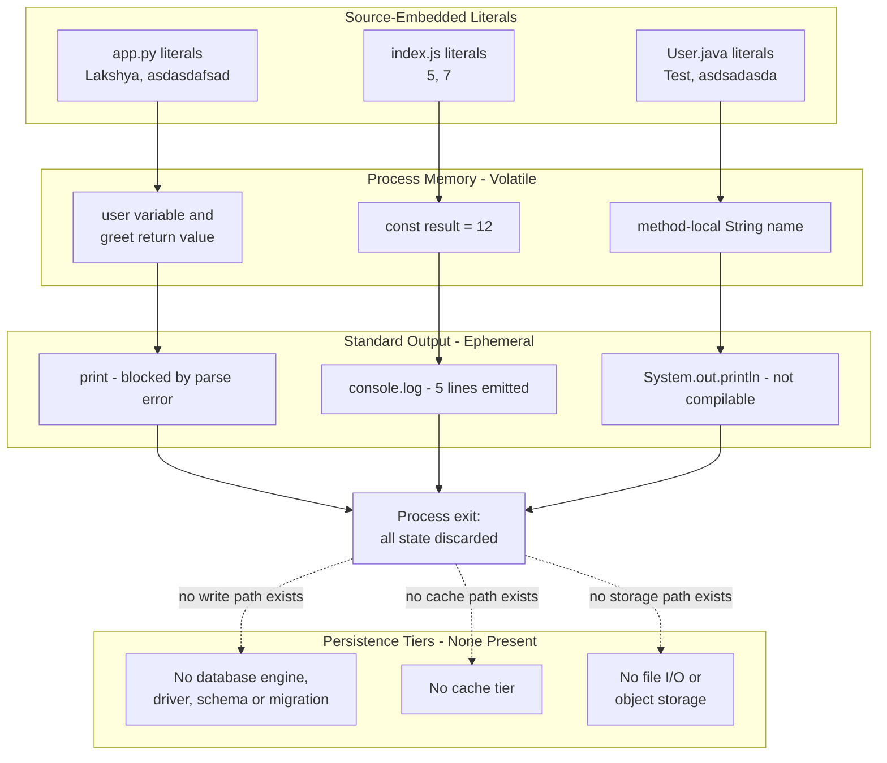

Two properties of this path are worth stating explicitly:

- **No input is ever read.** Scans for environment-variable access, command-line arguments, and standard input all return zero matches, so the literal set above is not merely the *default* data — it is the *only* data the system can ever process without a source edit.
- **The path is verified for exactly one of the three programs.** `node index.js` completes the path end to end, producing 15 bytes of standard output. `app.py` fails at parse time before any literal reaches memory, and `User.java` cannot be compiled, so its path is unexercised. Section 3.1.4.2 records the same build state.

#### 3.5.2.3 Persistence Consequences

| Question | Answer as Observed |
|---|---|
| Is any computed value durable? | **No.** All state is a local or module-scope variable destroyed at process exit |
| Is there any state shared between the three programs? | **No.** They share no file, no store, and no invocation path |
| Is any execution idempotent or repeatable? | Trivially — every run produces identical output because every input is a hardcoded literal |
| Is any data recoverable after a failure? | Not applicable — there is nothing to recover |
| Did execution leave anything behind? | **No.** `git status --porcelain --untracked-files=all` is empty after the verification runs, so no file was created |

### 3.5.3 Caching

**No caching solution exists at any tier.** A scan for `cache`, `memoiz`, `lru_cache`, `functools`, `ttl`, `evict`, `expire`, `invalidate`, `etag`, `cdn`, `varnish`, and `nginx` returns **zero matches** across all tracked files. There is no in-process memoization, no distributed cache client, no HTTP cache header handling, and no CDN reference. Redis and Memcached specifically return zero matches, as recorded in 3.5.1.

Even the incidental caches that language toolchains normally produce are absent from the checkout: `__pycache__`, `.pytest_cache`, `.mypy_cache`, `.ruff_cache`, `.cache`, `node_modules/.cache`, `target/classes`, and `build/classes` were each checked and none exists. Two facts explain this — `app.py` never compiles successfully, so CPython writes no bytecode cache for it, and there is no build tool that could produce a compiled-output tree.

This also means the repository has **no committed build or cache output**, which is notable given that no `.gitignore` exists to have prevented it (see 3.6.4).

### 3.5.4 Storage Services and File I/O

| Storage Concern | Present | Evidence |
|---|---|---|
| Object / blob storage | **No** | Zero matches for `bucket`, `blob`, `upload`, `download`, `presigned`, `multipart`, `minio`, `gridfs`; and zero matches for `s3`, `dynamo`, `azure`, `gcp` per 3.4.5 |
| Mounted volumes or persistent claims | **No** | Zero matches for `volume`, `mount`, `persistentvolume`, `pvc`; no container definition exists to declare one |
| Local file read or write | **No** | Zero matches for `open(`, `readFile`, `writeFile`, `appendFile`, `createReadStream`, `createWriteStream`, `fs.`, `pathlib`, `os.path`, `shutil`, `tempfile`, `FileReader`, `FileWriter`, `FileInputStream`, `FileOutputStream`, `BufferedReader`, `Files.`, `Paths.` |
| Serialization / data-interchange formats | **No** | Zero matches for `pickle`, `marshal`, `shelve`, `json`, `yaml`, `xml`, `csv`, `toml`, `protobuf`, `avro`, `parquet`, `serialize`, `deserialize` |
| Data files committed to the repository | **No** | A recursive `find` for `*.sql`, `*.db`, `*.sqlite*`, `*.csv`, `*.tsv`, `*.json`, `*.yaml`, `*.yml`, `*.xml`, `*.parquet`, `*.avro`, `*.xlsx`, `*.dump`, `*.bak` returns nothing |

All four tracked files were additionally verified to be **plain ASCII text** — zero non-ASCII bytes and zero NUL bytes in each — confirming that no dataset or binary payload is embedded in any source file. Their sizes are 32, 171, 206, and 280 bytes.

The specification's default technology stack implies cloud storage through AWS. **No storage service of any kind is present**, and per 3.4.5 no cloud provider identifier appears anywhere in the repository.

### 3.5.5 Data Security and Compliance Assessment

#### 3.5.5.1 Verified Data-Risk Position

The data-risk position is exceptionally narrow, and every element of it follows from verified absence rather than from an implemented control:

- **No data at rest.** With no database, no file write, and no object storage, there is no persisted data to encrypt, back up, retain, or delete. Encryption-at-rest, backup, and retention policies have no subject.
- **No data in transit.** Per 3.4.1, there is no network client or server, so no transport encryption is required and none is configured.
- **No personal or sensitive data.** The complete data footprint in 3.5.2.1 is six placeholder or greeting strings and two integers. Section 1.3.2.4 records processing real or sensitive data as an unsupported use case, and the enumerated literal set confirms none is present.
- **No credentials in data or source.** Scans for `secret`, `credential`, `password`, `token`, `jwt`, and `oauth` return zero matches across all four files.
- **No residue after execution.** The working tree is verified clean after the verification runs; nothing was written to disk.

#### 3.5.5.2 Clarification: `User.java` Models No User Entity

This clarification is included because the filename invites a persistence inference that the code does not support. `User.java` is **named** for a data entity but **models** none: it declares no fields, no constructor, and no accessor methods. The identifier `name` is a method-local `String` inside `main`, discarded when the method returns. There is no entity, no record, no table, no schema, and no repository or data-access object anywhere in this codebase. Section 1.1.3 records the same finding.

#### 3.5.5.3 Governance Gaps for Any Future Persistence

Introducing the first persistent store would require every one of the following, none of which exists today:

| Missing Prerequisite | Verified Status |
|---|---|
| A driver or ORM dependency, and a manifest to declare it | No manifest in any ecosystem (3.3.1) |
| A configuration mechanism for a connection string | No config file of any format; no environment-variable read anywhere |
| A secret-management approach for credentials | No secret store reference; and no `.gitignore` to prevent an `.env` file from being committed |
| A schema and migration strategy | No schema, migration, or seed artifact; no migration tool |
| Transaction and failure handling | Zero matches for `transaction`, `commit`, `rollback`, `try`, `catch`, `except`, `throw`, `raise` |
| Data-protection controls: encryption, retention, access control | None present; and per 3.4.3 there is no authentication or authorization model to attach access control to |

The accurate characterisation is that **this system has no data-protection posture because it has no data** — favourable today, but entirely unprepared for the introduction of any real data set.


## 3.6 Development &amp; Deployment

This sub-section documents the development and deployment technology as it actually exists. **Three development tools are evidenced by the repository — Git, GitHub as a remote host, and Markdown. There is no build system, no containerization, no infrastructure-as-code, no continuous integration, and no release process of any kind.** The deployment model, stated exactly, is: clone the repository and invoke one source file directly with a locally installed toolchain.

### 3.6.1 Development Tooling

#### 3.6.1.1 Tooling Actually Evidenced

| Tool | Version / Form | Evidence | Role |
|---|---|---|---|
| Git | 2.43.0 in the inspection environment | `.git` directory; 4 commits; 5 refs; 1 remote | Distributed version control — the only development tool the repository itself configures |
| GitHub | Remote host for `origin` | `.git/config` single remote entry | Source hosting only; no automation feature is used (3.4.2) |
| Markdown | `README.md`, 32 bytes | One ATX level-1 heading | The sole documentation format |

**Authoring workflow — inference, not asserted fact.** The four commit subjects (`Initial commit`, `Create index.js`, `Create app.py`, `Create User.java`) match GitHub's web-editor default messages, and each commit adds exactly one file. This is consistent with the files having been authored through the GitHub web interface rather than through a local development environment — which would also explain the complete absence of editor and IDE configuration noted below. The repository states nothing to confirm this.

#### 3.6.1.2 Audited Register of Absent Development Tooling

Thirty-two tooling configuration files were probed by exact name; **every one is absent.** The result is grouped by concern:

| Tooling Concern | Configuration Probed | Result |
|---|---|---|
| Editor / IDE configuration | `.editorconfig`, `.vscode`, `.idea` | **None present** — no shared indentation, encoding, or editor settings |
| JavaScript linting and formatting | `.eslintrc`, `.eslintrc.json`, `.eslintrc.js`, `eslint.config.js`, `.prettierrc`, `.prettierrc.json`, `.stylelintrc` | **None present** |
| Python linting, formatting, typing | `.flake8`, `.pylintrc`, `ruff.toml`, `.isort.cfg`, `mypy.ini`, `.mypy.ini`, `pyrightconfig.json` | **None present** |
| Java static analysis | `checkstyle.xml`, `spotbugs.xml`, `pmd.xml` | **None present** |
| Commit-time gates | `.pre-commit-config.yaml`, `.husky`, and active `.git/hooks` entries | **None present** — `.git/hooks` contains only `.sample` templates, so **zero hooks are installed** |
| Task runners | `Makefile`, `Taskfile.yml`, `justfile`, `Rakefile`, `gulpfile.js`, `Gruntfile.js` | **None present** |
| Transpilers and bundlers | `.babelrc`, `webpack.config.js`, `rollup.config.js`, `vite.config.js` | **None present** |
| Test runners | No test file, no test framework reference (3.2.1) | **None present** |

The direct consequence is that the indentation defect in `app.py` and the duplicate class declaration in `User.java` — both blocking defects — would have been caught by any linter or compiler check, and **no such check exists at any point in the workflow**: not in the editor, not at commit time, not at push time, and not in a pipeline. Section 1.2.3.3 records the corresponding absence of any quality gate.

### 3.6.2 Build System

**No build system exists for any of the three languages.** An exhaustive recursive probe found no `Makefile`, `*.mk`, `CMakeLists.txt`, `*.cmake`, `pom.xml`, `*.gradle`, `*.gradle.kts`, `build.xml`, `ivy.xml`, `package.json`, `pyproject.toml`, `setup.py`, `Taskfile.yml`, `justfile`, or shell script of any kind — and `git log --all --diff-filter=A` confirms none has ever existed in the repository's history.

What stands in place of a build system differs by language:

| Artifact | "Build" Step Required | Actual Command | Verified Result |
|---|---|---|---|
| `app.py` | None — Python is interpreted | `python3 app.py` | **exit 1**; final stderr line `IndentationError: unindent does not match any outer indentation level` |
| `index.js` | None — JavaScript is interpreted | `node index.js` | **exit 0**; exactly 15 bytes, 5 lines, single distinct value `12` |
| `User.java` | **Required** — compilation to bytecode | `javac User.java` then `java User` | **Not attemptable** — `javac` is unavailable in the inspection environment (exit 127) |

```bash
python3 app.py     # exit 1 — parse failure at line 7
node index.js      # exit 0 — 15 bytes of stdout
javac User.java    # requires a JDK; none available here
```

Two findings follow that are central to characterising the build posture.

**The build success rate is one of three.** Only `index.js` runs as committed. `app.py` fails at parse time before executing any statement. `User.java` cannot be compiled as written — `grep -c '^public class User' User.java` returns 2, i.e. two top-level public types in one compilation unit — and could not be tested at all here.

**No execution produces an artifact.** After running every command above, `git status --porcelain --untracked-files=all` is empty and the repository root contains exactly `.git`, `README.md`, `User.java`, `app.py`, and `index.js`. No bytecode cache, no `.class` file, no log, and no output file is generated. **There is nothing to package, version, or deploy** — a point that makes the absence of the packaging and deployment tiers in 3.6.3 and 3.6.4 a coherent consequence rather than merely an omission.

The asymmetry across languages is worth noting as a maintenance constraint: two of the three artifacts need no build step at all, while the third needs a full JDK, and nothing in the repository declares that requirement or automates it. Section 2.4.6 records the same finding — compilation of `User.java` is a manual `javac` step because no build tool exists to perform it.

### 3.6.3 Containerization and Infrastructure

| Capability | Present | Evidence |
|---|---|---|
| Container image definition | **No** | No `Dockerfile` or `Dockerfile.*` anywhere; never present in history |
| Container orchestration / composition | **No** | No `docker-compose.yml`, no compose file of any name, no Kubernetes manifest; no `*.yaml`/`*.yml` file of **any** kind exists in the repository |
| Infrastructure as code | **No** | No `*.tf`, `*.tfvars`, or any other IaC definition |
| Runtime configuration | **No** | No `.env`, `*.ini`, `*.cfg`, `*.conf`, or `*.toml` file exists |
| Container tooling in the environment | **Not installed** | `docker`, `docker-compose`, and `terraform` all return exit 127 |

The specification's default technology stack names Docker for containerization and Terraform for infrastructure as code. **Neither is present**, and neither has ever been present in any revision.

**The actual execution model** is therefore the simplest one possible, and it matches the deployment boundary fixed in section 1.3.1.2: a single operating-system process, started manually by a developer on their own machine, using whichever interpreter or JDK that machine happens to have installed. There is no image, no host, no port, no service definition, and no target environment. Because runtime versions are entirely unpinned (3.1.4.1), this model also provides no reproducibility guarantee between two developers' machines.

### 3.6.4 CI/CD and Release Management

#### 3.6.4.1 Continuous Integration and Delivery

**No CI/CD system is configured.** Every mainstream provider's configuration path was probed and all are absent:

| Provider | Path Probed | Result |
|---|---|---|
| GitHub Actions | `.github/`, `.github/workflows/` | **Absent** — the `.github` directory does not exist |
| GitLab CI | `.gitlab-ci.yml` | **Absent** |
| CircleCI | `.circleci/` | **Absent** |
| Jenkins | `Jenkinsfile` | **Absent** |
| Azure Pipelines / Bitbucket / Travis / AppVeyor | `azure-pipelines.yml`, `bitbucket-pipelines.yml`, `.travis.yml`, `appveyor.yml` | **All absent** |

This is a specific and important divergence from the specification's default technology stack, which names GitHub Actions as the CI/CD platform. GitHub *is* the source host for this repository — but **GitHub Actions is not in use**, and readers must not infer a pipeline from the presence of a GitHub remote. Section 3.4.2 documents the same distinction from the services perspective.

#### 3.6.4.2 Release Management and Versioning

The git topology is unambiguous and shows no release process at all:

| Topology Fact | Observed Value |
|---|---|
| Refs and their targets | `2807_01`, `main`, `origin/2807_01`, `origin/main`, `origin/HEAD` — **all five resolve to the same commit `ebde6c9`** |
| Branch divergence | `git diff --stat main 2807_01` is **empty** — the branches are byte-identical |
| Tags | **Zero** |
| Merge commits | **Zero** |
| Commits and contributors | 4 commits, **1 contributor** (all four authored by the same identity) |
| Version metadata files | No `CHANGELOG`, no `VERSION`, no version field in any manifest (none exists) |

There is consequently **no versioning scheme, no release artifact, no changelog, no environment branch structure** (no `dev`, `staging`, or `production` branch), and **no evidence of code review in the history** — zero merge commits and a single contributor mean no change in this repository has ever passed through a second pair of eyes.

#### 3.6.4.3 Absent Guardrails

The cumulative effect of the absences above is that nothing stands between an edit and the default branch. Each guardrail below was verified absent:

| Guardrail | Status | Consequence |
|---|---|---|
| CI status check | **None** — no provider configured | A syntactically invalid file can reach the default branch, which is exactly what happened: `app.py` and `User.java` are both broken at `ebde6c9`, the head of `main` |
| Pre-commit or pre-push hook | **None** — `.git/hooks` holds only `.sample` files | No local gate on commit or push |
| Review routing | **None** — no `CODEOWNERS`; zero merge commits | No reviewer is assigned or evidenced |
| Contribution and security policy | **None** — no `CONTRIBUTING.md`, no `SECURITY.md` | No documented process for changes or vulnerability reports |
| `.gitignore` / `.gitattributes` | **None** — the only root dotentry is `.git` | No protection against committing virtual environments, `node_modules`, `.class` output, or an `.env` file containing real credentials |
| Automated dependency updates | **None** — no `dependabot.yml`, no `renovate.json` (3.3.4.2) | No mechanism would ever propose a security upgrade |

**Security note.** The one credential observed anywhere in this environment is a short-lived access token embedded by the checkout tooling in the local `.git/config` remote URL. It is an inspection-environment artifact, is **not** committed content, and is deliberately not reproduced in this specification; only the token-free repository URL is cited. Independently, no tracked file contains any secret — scans for `secret`, `credential`, `password`, `token`, `jwt`, and `oauth` return zero matches across all four files.

### 3.6.5 Toolchain Topology

The diagram below shows the complete technology topology: what is evidenced (authoring, version control, manual invocation) and what is verified absent (build, CI/CD, containerization, release).

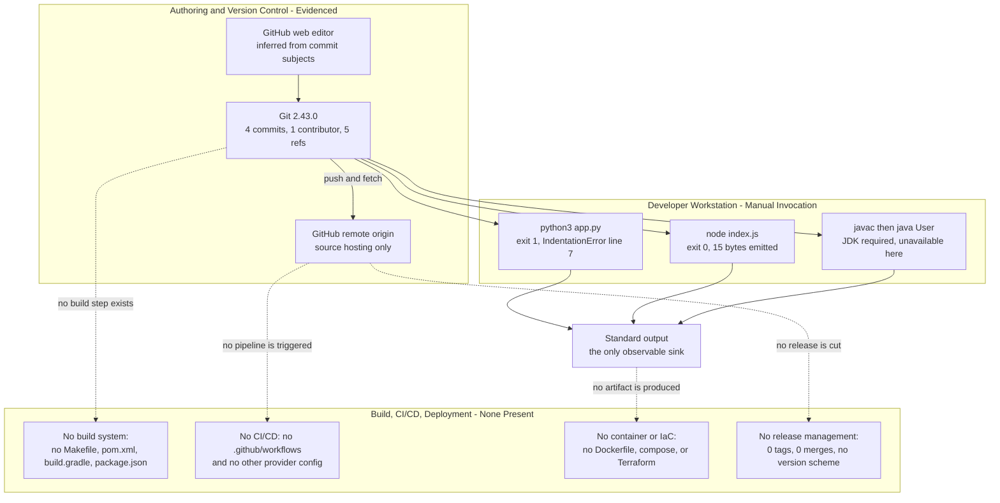

### 3.6.6 Requirements to Establish a Development and Deployment Pipeline

The following is **advisory and forward-looking; none of it describes anything present in the repository.** It is included because section 2.4.8 defines a remediation sequence, and every item there depends on development and deployment technology that does not yet exist. The prerequisites are listed in dependency order, each tied to the specific gap this sub-section verified.

| Prerequisite | Gap It Closes | Why It Is Ordered Here |
|---|---|---|
| 1. Per-language manifests pinning runtime versions | 3.1.4.1 — all three runtimes are unpinned | Nothing else can be reproducible until the toolchain versions are declared; this is remediation step 4 in section 2.4.8 |
| 2. A `.gitignore` | 3.6.4.3 — no hygiene guardrail exists | Must precede any build or install step so generated output is never committed |
| 3. A build/task entry point per language | 3.6.2 — no build system exists | `User.java` in particular has no automated compilation path today |
| 4. A test framework and at least one executable test | 3.2.4 / 3.6.1.2 — no test harness exists | Required before any CI gate can assert anything meaningful |
| 5. A linter or compiler check per language | 3.6.1.2 — no static check at any stage | Would have caught both blocking defects present at `main` |
| 6. A CI workflow invoking items 3–5 | 3.6.4.1 — no provider configured | GitHub is already the host, so GitHub Actions is the lowest-friction option, but it is **not currently used** |
| 7. Run instructions in `README.md` | Section 2.4.8 remediation step 3 | Today the README conveys only the repository name |

Items 8 and beyond — containerization, infrastructure as code, a deployment target, and a release/versioning scheme — are deliberately **not** recommended by this specification, because section 1.3.1.2 establishes that no deployment target exists and section 3.6.2 establishes that no execution produces a deployable artifact. Introducing a deployment pipeline would require first defining something to deploy.


## 3.7 References

Every factual claim in section 3 is grounded in the evidence listed below. Because this section's central findings are *absences*, the artifact classes that were probed and found absent are enumerated as explicitly as the files that were read.

### 3.7.1 Repository Files Examined

All four tracked files were read in full; no file in the repository was left unexamined.

- `app.py` - Established the Python language surface: `def greet(name)` at lines 1–2, the f-string literal at line 2 that sets the Python ≥ 3.6 (PEP 498) floor, the duplicated `if __name__ == "__main__"` guards at lines 4 and 7, the `///asdas` token at line 10, and the `IndentationError` at line 7 that prevents the module from parsing. Confirmed zero imports and that `print` is the only builtin called.
- `index.js` - Established the JavaScript surface: `function add(a, b)` at lines 1–3, `const result = add(5, 7)` at line 5 setting the ECMAScript 2015 floor, and five `console.log(result)` statements at lines 6–10. Confirmed `console.log` is the only global referenced, and that the file declares neither `module.exports` nor an ES `export`.
- `User.java` - Established the Java surface: two top-level `public class User` declarations at lines 1 and 7, each with `public static void main(String[] args)`, a method-local `String name`, and `System.out.println`. Confirmed **zero `import` and zero `package` declarations** (hence the default unnamed package), zero annotations, zero generics, and that only `java.lang.String` and `java.lang.System` are referenced.
- `README.md` - Established Markdown as the sole documentation format: a single 32-byte ATX level-1 heading with no trailing newline and no run instructions.

### 3.7.2 Repository Structure and Version-Control Evidence

- `/` (repository root) - Established the complete flat structure: exactly four tracked files and **zero subdirectories**. The only dotentry is `.git`, confirming the absence of `.gitignore`, `.gitattributes`, `.github/`, `.vscode/`, and `.idea/`. Total tracked footprint 689 bytes.
- `.git/config` - Established the single remote `origin` pointing at `github.com/lakshya-blitzy/only_parent_parent_repo_10_LOC.git`, the `branch.main` tracking entry, and the absence of submodule, LFS, and filter configuration. (The short-lived access token embedded in the local remote URL is an inspection-environment artifact, is not committed content, and is deliberately not reproduced.)
- `.git/hooks/` - Established that only `.sample` templates are present, i.e. **zero active hooks**.
- Git history and refs - Established 4 commits by 1 contributor; five refs (`2807_01`, `main`, `origin/2807_01`, `origin/main`, `origin/HEAD`) all resolving to commit `ebde6c9`; zero tags; zero merge commits; and — via `--diff-filter=A` and `--diff-filter=DR` — that the four present files are the only files ever added and that **nothing has ever been deleted or renamed**.

### 3.7.3 Verified-Absent Artifact Classes

Each class below was probed by exact filename or glob and found absent in the working tree and, where noted, across the full history.

- Dependency manifests and lockfiles - `package.json`, `package-lock.json`, `npm-shrinkwrap.json`, `yarn.lock`, `pnpm-lock.yaml`, `requirements*.txt`, `pyproject.toml`, `setup.py`, `setup.cfg`, `Pipfile`, `Pipfile.lock`, `poetry.lock`, `requirements.lock`, `pom.xml`, `*.gradle`, `gradle.lockfile`, `build.xml`, `ivy.xml`, `go.mod`, `Cargo.toml`, `Gemfile`, `composer.json`, `*.csproj`, `*.sln` - grounded 3.3.1.
- Language/version pinning files - `tsconfig.json`, `.nvmrc`, `.node-version`, `.python-version`, `.java-version`, `.tool-versions`, `tox.ini` - grounded 3.1.4.1.
- Build and task definitions - `Makefile`, `*.mk`, `CMakeLists.txt`, `*.cmake`, `Taskfile.yml`, `justfile`, `Rakefile`, `gulpfile.js`, `Gruntfile.js`, `*.sh` - grounded 3.6.2.
- Code-quality and editor configuration - `.editorconfig`, `.vscode`, `.idea`, `.eslintrc*`, `eslint.config.js`, `.prettierrc*`, `.stylelintrc`, `.flake8`, `.pylintrc`, `ruff.toml`, `.isort.cfg`, `mypy.ini`, `pyrightconfig.json`, `checkstyle.xml`, `spotbugs.xml`, `pmd.xml`, `.pre-commit-config.yaml`, `.husky`, `.babelrc`, `webpack.config.js`, `rollup.config.js`, `vite.config.js` - grounded 3.6.1.2.
- Containerization, IaC, and configuration - `Dockerfile*`, any compose file, `*.tf`, `*.tfvars`, any `*.yaml`/`*.yml`, `*.toml`, `*.ini`, `*.cfg`, `*.conf`, `*.env*` - grounded 3.6.3.
- CI/CD definitions - `.github/`, `.github/workflows/`, `.gitlab-ci.yml`, `.circleci/`, `Jenkinsfile`, `azure-pipelines.yml`, `bitbucket-pipelines.yml`, `.travis.yml`, `appveyor.yml` - grounded 3.6.4.1.
- Governance and supply-chain artifacts - `LICENSE*`, `COPYING*`, `NOTICE*`, `CODEOWNERS`, `SECURITY.md`, `CONTRIBUTING.md`, `sbom.json`, `bom.xml`, `cyclonedx.json`, `spdx.json`, `.snyk`, `dependabot.yml`, `renovate.json`, `CHANGELOG*`, `VERSION*` - grounded 3.3.3, 3.3.4.2, 3.6.4.2, 3.6.4.3.
- Vendored dependency and build-output directories - `node_modules`, `site-packages`, `venv`, `.venv`, `env`, `lib`, `libs`, `vendor`, `target`, `build`, `dist`, `out`, `bin`, `classes`, `__pycache__`, `.gradle`, `.m2`, `.pytest_cache`, `.mypy_cache`, `.ruff_cache`, `.cache` - grounded 3.2, 3.3.1, 3.5.3.
- Data-bearing files - `*.sql`, `*.db`, `*.sqlite*`, `*.csv`, `*.tsv`, `*.json`, `*.yaml`, `*.yml`, `*.xml`, `*.parquet`, `*.avro`, `*.xlsx`, `*.dump`, `*.bak` - grounded 3.5.4.
- `.blitzyignore` - A filesystem-wide search found none, so no path-exclusion constraint applied to this investigation.

### 3.7.4 Verification Commands

Every empirical claim in section 3 is reproducible with the following commands, each of which was executed against the repository checkout.

- `git ls-files` / `git ls-files -s` - Confirmed exactly 4 tracked files and 4 blobs; grounded the inventory in 3.1.1.
- `find . -type d -not -path "./.git*"` - Returned only `.`, confirming zero subdirectories.
- Recursive `find` probes by filename and glob - Grounded every absent-artifact class listed in 3.7.3.
- `git grep -Iin -E <pattern>` over the working tree - Grounded all zero-match findings: imports/exports; forty-plus named frameworks and libraries; network/transport/RPC; cloud providers; auth/identity; monitoring/APM/telemetry; messaging/queues; commercial SaaS; database engines/drivers/ORMs; SQL/DDL/migration; file I/O and serialization; caching; object storage; environment/CLI/stdin input; error handling; secrets and credentials; URLs, domains, and registry hosts.
- `git grep` over `git rev-list --all` - Confirmed zero package-registry references in **any** revision (3.3.2).
- `git log --all --diff-filter=A --name-only` and `git log --all --diff-filter=DR` - Confirmed the four present files are the only files ever added and that nothing was ever deleted or renamed, establishing that every absence is original rather than the result of cleanup.
- `git for-each-ref`, `git tag`, `git log --all --merges`, `git rev-list --all --count`, `git shortlog -sne --all`, `git diff --stat main 2807_01` - Grounded the release topology in 3.6.4.2: five refs at `ebde6c9`, zero tags, zero merges, 4 commits, 1 contributor, identical branches.
- `python3 --version`, `node --version`, `npm --version`, `git --version`, and `command -v` probes - Grounded the toolchain table in 3.1.4.2 (CPython 3.12.3, Node.js v22.23.1, npm 11.18.0, git 2.43.0) and the absence of `java`, `javac`, `mvn`, `gradle`, `ant`, `kotlinc`, `docker`, `docker-compose`, `terraform`, `make`, `gcc`, `yarn`, `pnpm`.
- `python3 -m py_compile app.py` and `python3 app.py` - Both exit 1 with `IndentationError: unindent does not match any outer indentation level (app.py, line 7)`.
- `node --check index.js` and `node index.js` (with `od -c` and `wc -c`) - Exit 0; byte-exact 15-byte, 5-line standard output whose only distinct value is `12`.
- `grep -c '^public class User' User.java` - Returned 2, establishing the duplicate top-level public type; `javac` was unavailable (exit 127), so this finding is explicitly structural rather than compiler-verified.
- `git status --porcelain --untracked-files=all` and `git ls-files --others --ignored --exclude-standard` - Both empty after all execution attempts, establishing that no run produces any artifact (3.5.2.3, 3.6.2).
- Per-file byte scan for non-ASCII and NUL bytes - Confirmed all four blobs are plain ASCII text of 32, 171, 206, and 280 bytes, with no embedded dataset (3.5.4).
- Exhaustive literal enumeration via `grep -ohE` - Produced the complete data footprint in 3.5.2.1: six distinct strings and two integers.
- Semantic corpus searches for dependency manifests, data-persistence configuration, and containerization/CI/IaC definitions - All three returned empty result sets, independently corroborating the terminal findings.

### 3.7.5 Cross-Referenced Specification Sections

- Section 1.1 Executive Summary - Provided the established framing of the repository as a minimal polyglot scaffold and the finding that `User.java` models no user entity, reused in 3.5.5.2.
- Section 1.2 System Overview - Provided the three-capability enumeration, the "Core Technical Approach" (standard-library and host-global facilities only, hardcoded literals, stdout-only sink, direct execution with no build system), and the explicit finding that no KPI, SLO, or quality gate exists — honoured throughout 3.2.4, 3.4.4, and 3.6.1.2.
- Section 1.3 Scope - Provided the key-technical-requirements table showing that no manifest or version file exists for any of the three runtimes, the implementation boundaries (single OS process; developer's local machine; no container, server, or deployment target), and the explicitly excluded capability register — anchoring 3.1.4.1, 3.4.5, and 3.6.3.
- Section 2.1 Feature Catalog - Provided the six-feature decomposition (F-001…F-006) and confirmed that every feature declares "External dependencies: None" and "Integration requirements: None", together with the per-feature system-dependency wording reused in 3.1.1 and 3.1.2.
- Section 2.4 Implementation Considerations - Provided the repository-wide constraints (unpinned runtimes, three independent toolchains for 32 lines, no regression detection, manual `javac` compilation) and the remediation sequence whose "introduce per-language manifests" step is technically underpinned by 3.1.4.3 and 3.6.6.

### 3.7.6 External Sources

External sources were consulted **only** to establish the advisory version baseline in 3.1.4.3. They describe the release landscape of the three language runtimes as of July 2026; none of them describes anything declared in this repository.

- [web] Python release status and downloads (python.org release listings and developer guide, plus corroborating release summaries) - Confirmed that Python 3.14 is the latest feature line (3.14.0 released October 2025; 3.14.3 released February 2026), that the 3.12 line used for verification still receives maintenance releases (3.12.13, March 2026), and the maintenance-then-security-only support model.
- [web] Node.js release information (nodejs.org release blog and release working-group documentation, plus endoflife.date) - Confirmed that Node.js 24.x "Krypton" is an LTS line receiving updates through the end of April 2028 (24.16.0 released May 2026), that 26.x is the Current line (26.5.0 released July 2026), and the guidance that production use should be limited to Active or Maintenance LTS releases.
- [web] Java SE release and support information (Oracle Java SE support roadmap and Java version histories) - Confirmed that Java 25 is the current LTS (released September 2025), that Java 26 is the latest feature release (March 2026), that the LTS roster is 8, 11, 17, 21, and 25 with Java 29 planned for September 2027, and that OpenJDK builds are available under GPLv2 with the Classpath Exception.


# 4. Process Flowchart

## 4.1 System Workflows

### 4.1.0 Basis, Derivation Method, and What "Process" Means Here

**This repository contains no business process.** That is a verified finding, not an omission. The repository is a flat, four-file, three-language artifact set: `git ls-files` returns exactly `README.md`, `app.py`, `index.js`, and `User.java`; `find . -type d` excluding `.git` returns only the root, so there are **zero subdirectories**; and the entire codebase is 32 source lines across 689 bytes. No service, server, daemon, scheduler, queue consumer, HTTP route, database, or build pipeline exists to host a process. Sections 1.3.2.1 and 1.3.2.3 record the same absences independently.

Consequently, every workflow documented in section 4 is a **developer-initiated, single-process, single-shot execution of one root-level source file**. This section is the detailed elaboration of the four-step manual workflow first stated in section 1.3.1.1 and forward-referenced from section 2.3.5 — decomposed here into per-artifact process flows, boundary crossings, decision points, and failure paths, with the measured timing that substitutes for the service levels the repository never declares.

| Convention | Meaning in Section 4 |
|---|---|
| Stadium node `([ ])` | A start or end terminal of a flow |
| Diamond node `{ }` | A decision point — every one belongs to the developer or toolchain layer, never to application logic |
| Dotted edge `-.->` | A **latent or currently unreachable** path — present in source intent but not executable at commit `ebde6c9` |
| `--x` edge | A **non-delivery**: an interaction that the repository does *not* implement |

Two derivation rules govern all content below. First, feature and requirement identifiers (`F-001` … `F-006`, `F-XXX-RQ-YYY`) are reused verbatim from sections 2.1 and 2.2 so that each flow step is traceable; they are assigned by this specification and do not appear in the repository. Second, timing figures are **measured wall-clock observations from the inspection environment (Python 3.12.3, Node.js v22.23.1)**, never declared targets — sections 1.2.3.3 and 2.2.0 establish that no timeout, latency budget, throughput target, benchmark, KPI, SLO, or SLA exists anywhere in the repository.

### 4.1.1 Core Business Processes

#### 4.1.1.1 End-to-End User Journey — the Single Supported Workflow

Exactly **one** user journey is supported, and it has exactly one actor: the developer or reader who executes a file locally (section 1.3.1.2 establishes that no authentication, authorization, session, role, or account concept exists anywhere, so no other user role can be modelled). The journey begins at a local clone of commit `ebde6c9` — verified to be the shared head of `HEAD`, `2807_01`, and `main`, with `git diff --stat main 2807_01` empty — and ends at the developer reading the terminal. Nothing is stored, returned, transmitted, or logged elsewhere.

The journey's first decision point is a **documentation gap rather than a code branch**: `README.md` is a single 32-byte level-1 heading, so the developer must infer the invocation command from each file's extension (`F-006-RQ-002`, Not Met).

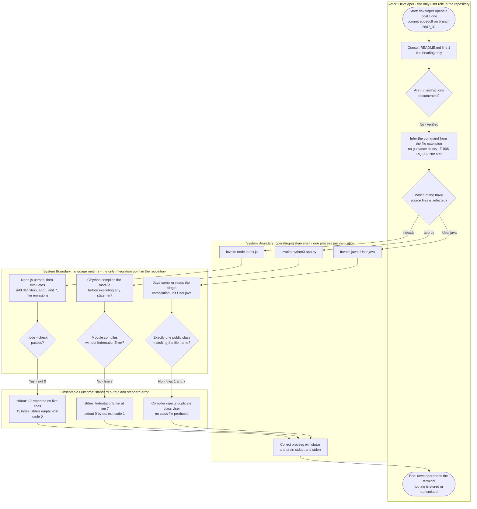

Only one of the three branches completes successfully today. The table below records the verified terminal outcome of each:

| Selected Artifact | Verified Terminal Outcome | Governing Requirement |
|---|---|---|
| `index.js` | Exit code 0; stdout exactly 15 bytes (`12` on five lines); stderr 0 bytes | `F-004-RQ-001`, `F-004-RQ-003` — Met |
| `app.py` | Exit code 1; stdout **0 bytes**; `IndentationError` on stderr referencing line 7 | `F-002-RQ-001`, `F-002-RQ-002` — Not Met |
| `User.java` | Compilation rejected; no `User.class` produced, so no run stage begins | `F-005-RQ-003` — Not Met |

#### 4.1.1.2 System Interactions and Boundary Crossings

The workflow crosses only three boundaries, and the third of them is the repository's **entire integration surface**. Section 2.3.2 reaches the same conclusion from the feature perspective: the only integration point is the boundary between each feature and its own language runtime's standard-output facility.

| Boundary | Crossing Mechanism | Direction and Payload |
|---|---|---|
| Developer → OS shell | A manually typed command; no argument parsing exists in any file | Inbound: the file path only. No flags, options, or stdin are read |
| OS shell → language runtime | Process fork with inherited `stdout` and `stderr` file descriptors | Inbound: the source file path. Outbound: an exit code |
| Runtime → console | `print()`, `console.log()`, `System.out.println()` | Outbound: plain text. This is the **only** egress in the repository |

No fourth boundary exists. A scan of all four tracked files for `import`, `require`, and `export` returns **zero matches**, and grep for `http`, `socket`, `sql`, `open`, `input`, `os`, `env`, and `argv` likewise returns zero. `index.js` reaches only the host-provided `console` global; `User.java` references only `String` and `System` from the standard Java environment; `app.py` imports nothing at all.

#### 4.1.1.3 Decision Points

A repository-wide control-flow census establishes an important structural fact: **`if` appears on exactly two lines, and both are the `if __name__ == "__main__":` guards in `app.py` (lines 4 and 7)**. There are **zero** `else`/`elif` branches, **zero** `for` loops, and **zero** `while` loops anywhere. `index.js` and `User.java` contain no conditional logic whatsoever, and the five `console.log` calls in `index.js` are literal source duplication rather than an iteration (section 2.4.5 records that no loop, count parameter, or configuration controls them).

Every decision point in every flowchart in section 4 therefore belongs to the developer or toolchain layer:

| Decision Point | Layer | Evaluated By | Outcome at Commit `ebde6c9` |
|---|---|---|---|
| Are run instructions documented? | Developer | The developer reading `README.md` | No — the command must be inferred |
| Which source file is selected? | Developer | The developer | Free choice among three artifacts |
| Does the module parse or compile? | Toolchain | CPython / Node.js / `javac` | Pass for `index.js`; fail for `app.py` and `User.java` |
| Does `__name__` equal `"__main__"`? | Application | CPython, at `app.py` lines 4 and 7 | **Never evaluated** — the parse error precedes execution |

The single genuine application-level decision in the repository is thus unreachable, because it lives in the one file that cannot be parsed.

#### 4.1.1.4 Detailed Process Flow — `index.js` Execution

This is the only flow verified end to end. `node --check index.js` exits 0 and `node index.js` exits 0, emitting a byte-exact 15-byte stdout stream confirmed with `od -c` as `1 2 \n` repeated five times. Five consecutive timed runs measured 17, 19, 19, 19, and 22 ms of wall clock — a range dominated by Node.js process startup rather than by the single arithmetic operation.

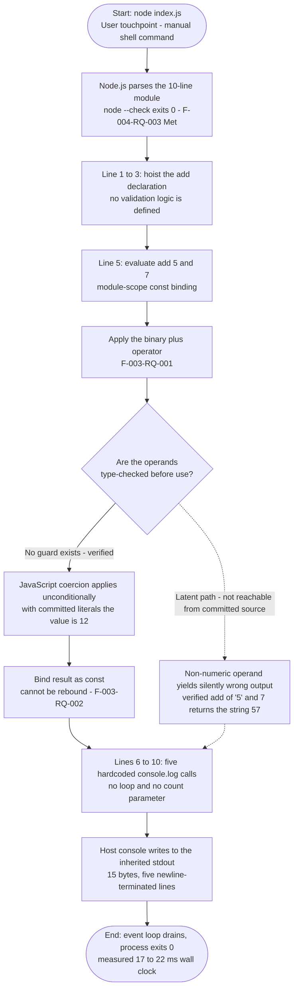

The dotted branch is significant and is documented as latent rather than hypothetical: `add` performs no operand validation, so with different operands the same flow silently produces a different kind of value. Verified outcomes are `add('5', 7)` → the string `"57"`, `add()` → `NaN` (of `typeof` `number`), `add(null, 1)` → `1`, and `add([1], [2])` → the string `"12"`. Because the committed call site supplies the literals `5` and `7`, this branch is unreachable from source as committed.

#### 4.1.1.5 Detailed Process Flow — `app.py` Execution

`app.py` fails during CPython's compile stage, which is why **no statement in the file ever runs**. `python3 app.py` exits 1, writes 0 bytes to stdout, and reports on stderr the file path, line 7, the offending source line, a caret, and the error class `IndentationError: unindent does not match any outer indentation level`. `python3 -m py_compile app.py` fails identically. Five timed runs measured 8, 8, 9, 9, and 9 ms — the failure path is *faster* than the `index.js` success path precisely because the interpreter aborts before entering execution.

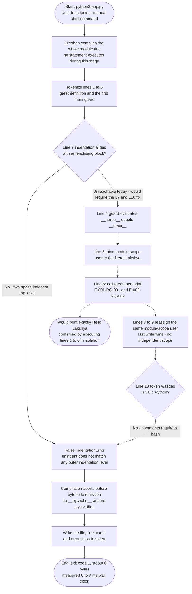

Two defects gate this flow, both confined to lines 7–10: the two-space top-level indentation of the second `if __name__ == "__main__":` at line 7, and the token `///asdas` at line 10, which is not a valid Python comment (Python comments require `#`). Extracting lines 1–6 and executing them in isolation prints exactly `Hello Lakshya` with exit code 0, confirming that the defect is structural rather than logical. Note that the duplicated guard reassigns the *same* module-scoped `user` binding rather than creating an independent scope, as section 2.4.3 records.

#### 4.1.1.6 Detailed Process Flow — `User.java` Build and Execution

`User.java` never reaches a run stage. The file declares `public class User` twice — at lines 1–6 and again at lines 7–12 — each declaration containing only `public static void main(String[] args)` with a method-local `String name` literal (`"Test"` and `"asdsadasda"`) printed via `System.out.println`. A duplicate top-level public class in a single compilation unit is rejected by the Java compiler. This finding is **structural and was not reproduced empirically**: `java`, `javac`, `mvn`, and `gradle` are all absent from the inspection environment, matching assumption A-03 in section 2.1.8.

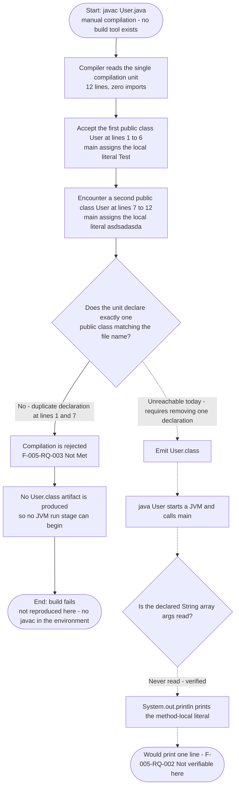

This is the only flow in the repository with a distinct **two-stage** shape — compile then run — and the second stage is unreachable because the first never produces an artifact. The dotted `args` decision records a further verified fact: the `String[] args` parameter is declared by the signature but never read, so even a repaired `User.java` would accept no dynamic input.

#### 4.1.1.7 Error Handling Paths within the Core Processes

Each core process has exactly one error path, and none of them is handled *inside* the repository's code. A census of all four tracked files returns **zero matches** for `try`, `catch`, `except`, `finally`, `raise`, `throw`, and `assert`, so every error is surfaced by the language runtime to the terminal and nothing else.

| Process | Error Path | Handled In Repository? |
|---|---|---|
| `index.js` execution | None taken — exits 0 on every run | Not applicable; no error occurs |
| `app.py` execution | Compile-stage `IndentationError`, stderr, exit 1 | **No** — surfaced by CPython |
| `User.java` build | Compiler rejection of the duplicate class | **No** — surfaced by `javac` |
| Developer cannot determine the command | Documentation gap, not a runtime error | **No** — no fallback documentation exists |

The complete failure taxonomy, including the "silently wrong output" case that produces no error at all, is consolidated in section 4.3.2.

### 4.1.2 Integration Workflows

The finding for this entire sub-section is **negative and verified**: the repository implements no integration workflow of any kind. This is established four independent ways — a keyword census over all four files returning zero matches for `import`, `require`, and `export`; the absence of any manifest that could declare a dependency; semantic searches for configuration, build-manifest, dependency, and CI-pipeline files that returned empty result sets; and the folder index for the repository root, which reports no cross-file invocation, import relationship, shared API contract, or documented build workflow. Sections 1.3.2.3 and 2.3.2 record the same absences.

#### 4.1.2.1 Data Flow Between Systems

No data flows between systems, because there is only one system boundary per invocation and only one egress. The data flow that *does* exist is a three-tier, memory-only path from source literal to console, with the fourth tier — persistence and caching — verified absent.

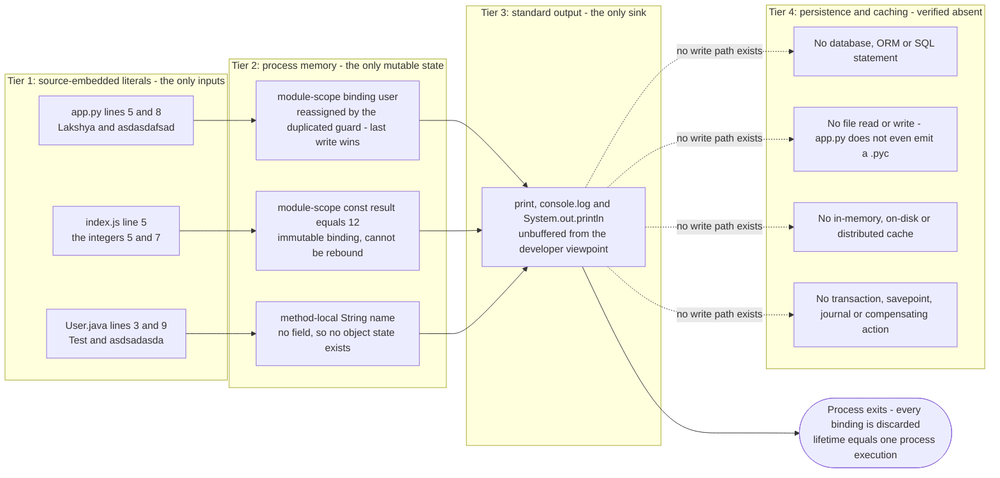

A notable confirmation of Tier 4's emptiness: even CPython's ordinary bytecode-cache side effect does not occur. After running `python3 -m py_compile app.py`, `ls -a` shows only `.git` and the four tracked files — **no `__pycache__` directory and no `.pyc` file** — because the parse failure precedes any bytecode write. `git status --porcelain` remained empty throughout the entire inspection, confirming that no execution path in this repository writes anything to disk.

#### 4.1.2.2 API Interactions

**None exist**, in either the network or the library sense.

| API Category | Status | Evidence |
|---|---|---|
| Inbound HTTP, REST, GraphQL, gRPC, webhooks | Absent | No server, route, handler, or listener in any file |
| Inbound CLI arguments | Absent | No `argv` access in `app.py`; `String[] args` declared but never read in `User.java` |
| Outbound third-party or cloud APIs | Absent | Zero `import`/`require` matches; no SDK, client, or endpoint string |
| Library API surface exposed by the repository | Absent | `app.py` declares no `__all__`; `index.js` declares neither `module.exports` nor an ES `export` |

The last row has a direct workflow consequence: because neither script exposes a module API, **no integration workflow could be built against this repository without first modifying it** — section 1.3.2.4 lists "consuming `index.js` as a module" and "importing `app.py` as a library" among the unsupported use cases.

#### 4.1.2.3 Event Processing Flows

**None exist.** There is no event, message, topic, subscription, queue, stream, broker, publisher, subscriber, callback registration, or event-emitter construct in any of the four files. The single asynchronous facility present anywhere is the Node.js event loop, and `index.js` places nothing on it: the module body is entirely synchronous, so the loop drains immediately after the five writes complete and the process exits with code 0. No `Promise`, `async`, `await`, `setTimeout`, or listener registration appears in the source.

#### 4.1.2.4 Batch Processing Sequences

**None exist.** No scheduler, cron entry, timer, job definition, batch driver, work queue, or bulk-input path is present, and there is no CI system that could invoke one — `.github/`, `.circleci/`, `.gitlab-ci.yml`, `Jenkinsfile`, `Makefile`, and `Dockerfile` are all verified absent.

The one construct that superficially resembles batching is worth disambiguating explicitly, because it would be easy to misread: `index.js` lines 6–10 emit five outputs, but this is **five literal, hardcoded `console.log(result)` statements, not an iteration over a batch**. The control-flow census found zero `for` and zero `while` constructs anywhere in the repository, and section 2.4.5 confirms there is no loop, count parameter, or configuration governing the count. Section 2.2.4 records this five-fold emission as `F-004-RQ-002`, an *as-built regression baseline* of `Could-Have` priority that is expected to change if the duplication is removed.

#### 4.1.2.5 Verified Integration Absence

The sequence diagram below states the integration inventory positively — as a set of non-deliveries. Every crossed edge represents an interaction that was searched for and found absent, rather than one that merely happens not to occur at run time.

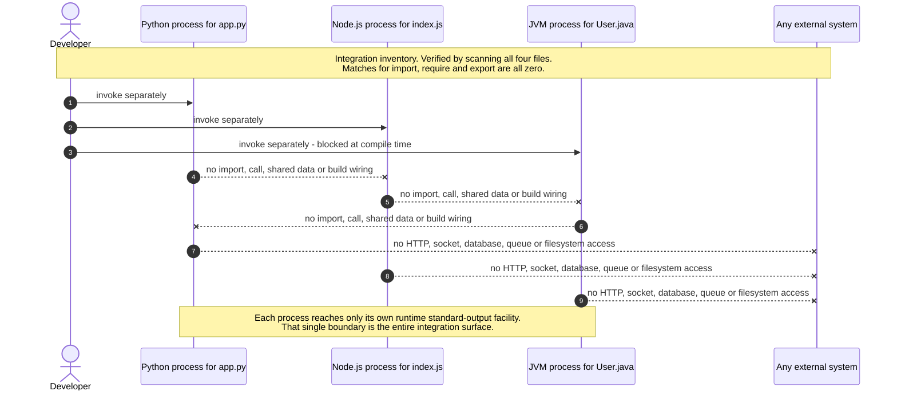

The three processes are siblings that never communicate. Section 2.3.1 records the corresponding feature-level fact: only two dependency edges exist in the whole repository (`F-002` → `F-001` by direct call, and `F-004` → `F-003` by data), and **both are intra-file**, so neither crosses a language or artifact boundary.


## 4.2 Flowchart Requirements

This sub-section audits the three workflows documented in section 4.1 against the standard flowchart element checklist, and then records the validation rules that apply at each step. Both audits produce a mixture of present and verified-absent elements; every absence below was searched for rather than assumed.

### 4.2.1 Flowchart Element Coverage per Major Workflow

Three major workflows exist, corresponding to the three code artifacts. The matrix below confirms which required flowchart elements each workflow actually contains.

| Element | `index.js` Execution | `app.py` Execution | `User.java` Build |
|---|---|---|---|
| Start point | `node index.js` at the shell | `python3 app.py` at the shell | `javac User.java` at the shell |
| End point | Exit 0 after five writes | Exit 1 after the stderr report | Rejected build, no artifact emitted |
| Process steps | 8 steps, all synchronous | 2 reached; 5 latent behind the defect | 4 reached; run stage unreachable |
| Decision diamonds | 1 — parse check | 2 — parse check, `__main__` guard | 1 — single-public-class check |
| System boundaries crossed | 3 — shell, runtime, console | 2 — shell, runtime; console never reached | 1 — shell; compiler never emits |
| User touchpoints | 2 — typing the command, reading stdout | 2 — typing the command, reading stderr | 2 — typing the command, reading the rejection |
| Error state | None taken | `IndentationError` at line 7 | Duplicate `public class User` |
| Recovery path | Not applicable | Edit lines 7–10 | Remove one class declaration |

Two structural observations follow from this matrix and are worth stating explicitly, because they are what most distinguishes this repository from a conventional system:

- **No workflow crosses more than three boundaries, and the third is always the console.** The `app.py` and `User.java` workflows never reach their final boundary at all, so their only observable artifact is a diagnostic on stderr.
- **The `User.java` workflow is the only two-stage workflow** (compile, then run). Its second stage has no start point today, because the first stage emits no `User.class`.

#### 4.2.1.1 User Touchpoints

Every workflow has exactly two user touchpoints, and they are identical across all three: issuing a shell command and reading the terminal. There is no third touchpoint anywhere in the repository — no prompt, no interactive input, no UI, no configuration file, and no argument surface. This is verified rather than inferred: the keyword census over all four tracked files returns zero matches for `input`, `argv`, `os`, and `env`, and `User.java` declares `String[] args` in its `main` signature without ever reading it.

| Touchpoint | Direction | Payload | Constraint |
|---|---|---|---|
| Shell command entry | Inbound | The file path only | No flags, options, or stdin are parsed by any file |
| Terminal reading | Outbound | Plain text on stdout or stderr | Not machine-readable; nothing is captured or forwarded |

Because the outbound touchpoint is unstructured console text and nothing exposes a module API, the workflow output cannot be asserted on programmatically without redirecting the console — a constraint section 2.4.1 records for every feature.

#### 4.2.1.2 Error States and Recovery Paths

Three error states exist. Two are toolchain rejections and one is a documentation gap; none of them is a runtime exception, and none is handled by repository code.

| Error State | Where It Surfaces | Recovery Path | Verifies Via |
|---|---|---|---|
| `IndentationError` at `app.py` line 7 | stderr, exit code 1 | Correct the indentation and remove the `///asdas` token at line 10 | `python3 -m py_compile app.py` exits 0 |
| Duplicate `public class User` at lines 1 and 7 | Compiler rejection, no artifact | Remove one of the two declarations | `javac User.java` exits 0 |
| No documented run command | Not an error signal at all — a silent gap | Add per-runtime instructions to `README.md` | Manual reading of `README.md` |

Every recovery path is a **source edit followed by a manual re-invocation**. There is no automated verification of any recovery: no test suite, no assertion, no type checker, and no CI gate exists, so section 1.3.2.4 lists "regression-safe modification" as an unsupported use case. The recovery steps above correspond one-to-one with remediation steps 1, 2, and 3 of the sequence derived in section 2.4.8; that section is the origin of the ordering, and this specification adds no plan of its own.

#### 4.2.1.3 Timing and SLA Considerations

**No service level of any kind is declared in this repository.** Sections 1.2.3.3 and 2.2.0 establish this independently: there is no timeout, latency budget, throughput target, benchmark, health check, retry deadline, KPI, SLO, or SLA anywhere, and no long-running process exists to measure. Every figure below is therefore a **measured observation from the inspection environment**, not a requirement, and must not be read as a commitment.

| Workflow | Measured Wall Clock, n=10 | Dominant Cost | Declared Target |
|---|---|---|---|
| `node index.js` | min 17.2 ms, median 20.5 ms, max 22.1 ms | Node.js process startup | **None** |
| `python3 app.py` | min 7.8 ms, median 8.0 ms, max 9.1 ms | CPython startup and compile stage | **None** |
| `javac User.java` | Not measured — no Java toolchain in the environment | Not applicable | **None** |

Three timing characteristics are worth recording because they are counter-intuitive and directly observable:

- **The failure path is faster than the success path**, by roughly a factor of 2.5. CPython aborts during compilation and never enters execution, so `app.py` returns control to the shell sooner than `index.js` does.
- **Runtime startup dominates entirely.** The actual work — one binary `+` operation and five console writes, or one string interpolation — is immeasurably small against a ~20 ms interpreter launch. No optimization of the 32 lines of source could move these numbers.
- **There is no timing constraint to violate.** All three programs are synchronous, single-shot, and terminate immediately; there is no queue depth, concurrency level, connection pool, or backlog whose behaviour under load could be characterized.

### 4.2.2 Validation Rules

The governing finding is that **the repository implements no validation of its own**. A census across all four tracked files returns zero matches for `assert`, `try`, `except`, `catch`, `finally`, `raise`, and `throw`. The only gate that fires anywhere is supplied by a language runtime, not by repository code. Sections 2.2.1.3 through 2.2.6.3 record the same conclusion per requirement, and section 2.3.4 records the absence of any validation service.

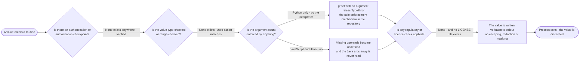

#### 4.2.2.1 Business Rules at Each Step

No business domain exists (section 1.2.1.1), so the "business rules" below are the complete behavioural contracts observable in the source. Each is a single rule with no variant, threshold, or exception.

| Workflow Step | Rule as Implemented | Consequence |
|---|---|---|
| `greet` interpolation, `app.py` L2 | The prefix is the hardcoded English literal `Hello ` | No template, locale, or salutation variant is possible |
| Guard evaluation, `app.py` L4 and L7 | One greeting is printed per guard block | The second block reassigns the same `user` binding — see 4.3.1 |
| `add` computation, `index.js` L2 | Apply the binary `+` operator to both operands | No rounding, precision, range, or unit rule exists |
| Emission, `index.js` L6–10 | Print the raw value exactly five times | No label, prefix, unit, or formatting is applied |
| `main` output, `User.java` L4 and L10 | Print the method-local `String` literal | The class name `User` is nominal only — no field or constructor is declared |

#### 4.2.2.2 Data Validation Requirements

**No data validation is implemented, and one gate is inherited.** The distinction matters: the Python interpreter enforces `greet`'s arity, which is the only condition anywhere in the repository that can reject an input. Independently re-verified:

| Input Condition | `greet` in `app.py` | `add` in `index.js` |
|---|---|---|
| Wrong argument count | **Rejected** — `TypeError: greet() missing 1 required positional argument: 'name'`; two arguments raise `greet() takes 1 positional argument but 2 were given` | **Accepted silently** — `add()` returns `NaN` |
| Wrong type | Accepted — `greet(42)` returns `'Hello 42'` | Accepted — `add('5', 7)` returns the string `"57"` |
| Null or empty | Accepted — `greet(None)` returns `'Hello None'`; `greet('')` returns `'Hello '` | Accepted — `add(null, 1)` returns `1` |

The asymmetry is the key finding: identical logical defects produce a loud failure in Python and a **silent, undetectable wrong answer** in JavaScript. Section 2.4.4 characterizes the missing operand check in `add` as a correctness exposure rather than a security one, and this specification concurs — with the committed literals `5` and `7` the result is invariably `12`, so the exposure is latent, not active. In `User.java` the question does not arise: `String[] args` is never read, so there is no input to validate at all.

#### 4.2.2.3 Authorization Checkpoints

**None exist.** No credential, token, secret, session, cookie, role, permission, scope, or access-control decision appears anywhere in the four files. There is also no *place* for one: no inbound request, no user identity, no protected resource, and no multi-user context — all three programs are single-shot and stateless, which section 1.3.2.4 records as making multi-user or concurrent operation unsupported.

This absence is appropriate to what the workflows actually do rather than a defect, and the reasoning is worth recording so that the finding is not misread as a security gap: the only input to any workflow is a source-embedded literal committed by the repository owner, and the only sink is the invoking developer's own terminal. No trust boundary is crossed, so there is nothing for an authorization checkpoint to protect. The class name `User` in `User.java` might suggest identity handling, but the class declares no fields, no constructor, and no accessors — a point sections 1.3.1.2 and 2.4.6 both record.

#### 4.2.2.4 Regulatory Compliance Checks

**No compliance check is implemented, and none is triggered by the observed behaviour.** No personal, financial, health, or otherwise regulated data is collected, transmitted, or stored by any workflow: the complete data footprint is transient in-memory literals whose lifetime equals one process execution (section 1.3.1.2). The name-like literals `"Lakshya"`, `"Test"`, `"asdsadasda"`, and `"asdasdafsad"` are hardcoded source text committed by the author, not collected user data, and nothing is persisted — verified by the empty `git status --porcelain` and the absence of any `.pyc`, log file, or other write artifact after execution.

One genuine compliance **gap** does exist, and it is a licensing rather than a data-protection matter. Direct verification confirms that `LICENSE`, `LICENCE`, `COPYING`, `NOTICE`, `SECURITY.md`, `CODE_OF_CONDUCT.md`, and `CONTRIBUTING.md` are **all absent** from the repository:

| Compliance Dimension | Status | Consequence for the Workflows |
|---|---|---|
| Redistribution terms | **Gap** — no `LICENSE` or `COPYING` file | Terms under which the three programs may be copied, run, or redistributed are undefined |
| Third-party attribution | Not applicable | Zero dependencies are declared or imported, so no attribution obligation arises |
| Data protection and retention | Not applicable | Nothing is collected, transmitted, or retained by any workflow |
| Audit trail | Absent | Output is unstructured console text with no timestamp, identity, or retention rule |

Section 2.2.6.3 records the missing `LICENSE` as the repository's only compliance gap, and this audit of the workflow paths reaches the same conclusion from the process side: no workflow step performs, or requires, a compliance check.


## 4.3 Technical Implementation

### 4.3.1 State Management

The complete state inventory of this repository is **three variable bindings**, all of them in-process and all discarded when the process exits. There is no session, cache, database, file, shared memory, or global registry — section 1.3.1.2 records the same data footprint, and section 2.3.4 records the absence of any persistence or caching service.

| State Item | Location | Mutability | Lifetime |
|---|---|---|---|
| `user` | `app.py` module scope, bound at L5 and rebound at L8 | **Mutable** — reassigned once | One process execution; unreachable today |
| `result` | `index.js` module scope, L5 | **Immutable** — `const` | One process execution |
| `name` | `User.java` method-local, L3 and L9 | Local, never escapes the method | One method invocation |

The middle row is the only one whose immutability is enforced rather than incidental. Verified directly: after `const result = add(5, 7)`, an assignment `result = 99` throws `TypeError: Assignment to constant variable.` and `result` remains `12`. This substantiates `F-003-RQ-002` and means `index.js` contains **no mutable state whatsoever** — one irreversible binding transition per process.

The `User.java` row deserves a note because the file name invites the opposite conclusion: the class declares no fields, no constructor, and no accessors, so **no object state exists** at all. `name` is a method-local variable only, as sections 1.1.3 and 2.4.6 also record.

#### 4.3.1.1 State Transitions

The only state machine that exists in these workflows is the operating-system process lifecycle. It is external to the repository — supplied by the shell and the language runtime — because no code in the repository models a state, status, phase, or status-transition of its own.

```mermaid
stateDiagram-v2
    direction LR
    [*] --> NotRunning : no process exists between invocations
    NotRunning --> Starting : developer issues a shell command
    Starting --> Loading : runtime process forked, stdout inherited
    Loading --> Validating : source read into memory
    Validating --> Failed : syntax or structure rejected
    Validating --> Initialized : source accepted
    Initialized --> Computing : module-scope statements evaluated
    Computing --> Emitting : value bound, ready to write
    Emitting --> Terminated : all writes flushed
    Failed --> Terminated : diagnostic written to stderr
    Terminated --> [*] : exit code returned, memory reclaimed
    state Validating {
        [*] --> Parsing
        Parsing --> Accepted : index.js - node --check exits 0
        Parsing --> Rejected : app.py - IndentationError at line 7
        Parsing --> Rejected : User.java - duplicate public class User
    }
    note right of NotRunning
        No daemon, server or scheduler exists.
        There is no idle or waiting state to model.
    end note
    note right of Terminated
        All in-memory state is discarded.
        Nothing is checkpointed, cached or persisted.
    end note
```

The composite `Validating` state is where the three artifacts diverge, and it is the only branch point in the lifecycle. `index.js` transitions `Validating → Initialized → Computing → Emitting → Terminated`; both `app.py` and `User.java` transition `Validating → Failed → Terminated`, skipping `Computing` and `Emitting` entirely.

Within the application layer there is exactly **one** mutable state transition in the whole repository, and it is now empirically confirmed rather than inferred. Running a minimally corrected copy of `app.py` — with only the two-space indentation removed from line 7 — prints `Hello Lakshya` followed by `Hello asdasdafsad`, and inspecting the resulting namespace shows the final binding is `user == 'asdasdafsad'`. The two `if __name__ == "__main__":` guards therefore do **not** create independent scopes: both bind the same module-level name, so the second assignment overwrites the first, and the first value survives only because line 6 consumes it before line 8 reassigns it. This read-then-overwrite sequence on a single binding is the entirety of the repository's mutable state behaviour, and section 2.4.3 records the same non-independence of the two blocks.

#### 4.3.1.2 Data Persistence Points

**There are none.** This is stronger than "nothing important is persisted" — no execution path in this repository writes anything to any durable medium, and that was verified two ways:

- **`git status --porcelain` remained empty across the entire inspection**, including after executing `node index.js`, `python3 app.py`, and `python3 -m py_compile app.py`. No artifact of any kind was created in the working tree.
- **Even CPython's ordinary bytecode cache is never written.** After `python3 -m py_compile app.py`, `ls -a` shows only `.git` and the four tracked files — no `__pycache__` directory and no `.pyc` file — because the compile stage aborts before bytecode emission.

| Candidate Persistence Point | Status | Evidence |
|---|---|---|
| Database or object store | Absent | No driver, ORM, SQL statement, or connection string |
| File read or write | Absent | Zero `open` matches; no `readFile`/`writeFile`; no `java.io` import |
| Bytecode or build cache | Absent in practice | No `.pyc` written; no `User.class` produced |
| Log file or audit trail | Absent | Output is unstructured console text with no timestamp or sink |
| Environment or configuration state | Absent | Zero `env` and `os` matches; no `.env` file exists |

The only durable record any workflow produces is the developer's terminal scrollback, which is outside the system boundary defined in section 1.3.1.2.

#### 4.3.1.3 Caching Requirements

**No cache exists and none is required by the observed workloads.** There is no in-process memoization, no on-disk cache, no distributed cache, no HTTP cache header, and no TTL or eviction policy anywhere in the four files.

The absence is consistent with what the workloads actually do, and the reasoning is worth recording so the finding is not read as a gap: each program performs exactly one computation on source-embedded literals during a process whose total lifetime is under 25 milliseconds, and every process starts from a cold, empty address space. There is no repeated computation to amortize, no remote call whose latency could be hidden, and no cross-invocation continuity — section 1.3.2.4 records that all three programs are single-shot and stateless. The nearest thing to a cache anywhere in the flow is Node.js's own internal module cache, which is runtime-supplied and irrelevant here because `index.js` imports nothing.

#### 4.3.1.4 Transaction Boundaries

No transaction exists in the database sense — there is no `BEGIN`, `COMMIT`, `ROLLBACK`, savepoint, journal, two-phase commit, or compensating action anywhere, because there is no transactional resource to enrol.

One **atomicity boundary** is nevertheless observable and materially affects the workflows, so it is documented as such: CPython's module compilation is all-or-nothing. Because the compile stage rejects `app.py` at line 7, the syntactically valid lines 1–6 never take effect at all — the `greet` definition is not created, the guard is not evaluated, and stdout receives 0 bytes. Extracting lines 1–6 and running them in isolation prints exactly `Hello Lakshya`, which proves the lines themselves are correct and that it is the unit-wide atomicity of compilation that suppresses them.

| Boundary | Scope | Atomicity Guarantee | Failure Consequence |
|---|---|---|---|
| CPython module compile | The whole of `app.py` | All-or-nothing per compilation unit | Valid lines 1–6 are discarded with the invalid ones |
| Java compilation unit | The whole of `User.java` | All-or-nothing per compilation unit | No `User.class`; the run stage never starts |
| Node.js module evaluation | The whole of `index.js` | Not exercised — no failure occurs | Not applicable |
| Console write | A single `console.log` / `print` call | None declared; five writes are independent | A partial write is possible in principle but was never observed |

The last row is the closest the repository comes to a multi-step operation that could partially fail: the five emissions in `index.js` are five independent, unsynchronized writes with no enclosing boundary. In practice all five completed on every observed run, producing a byte-exact 15-byte stream.

### 4.3.2 Error Handling

**No error handling is implemented anywhere in this repository.** A census across all four tracked files returns **zero matches** for `try`, `catch`, `except`, `finally`, `raise`, `throw`, and `assert`. Every error is therefore surfaced by a language runtime directly to the terminal, and section 2.4.1 records the consequence precisely: an unexpected condition surfaces either as an uncaught runtime error or, for malformed input to `add`, as silently wrong output.

The consolidated flowchart below classifies every failure mode the repository can exhibit, together with its recovery path. Note the two distinct terminal outcomes — one recoverable, one that produces no error signal at all.

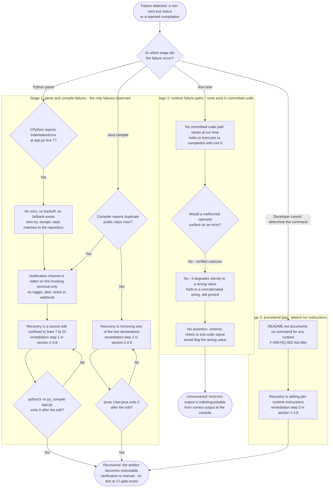

#### 4.3.2.1 Retry Mechanisms

**None exist.** There is no retry loop, no exponential backoff, no jitter, no attempt counter, no circuit breaker, no timeout, and no idempotency key anywhere in the repository. The control-flow census makes this structurally unavoidable: there are **zero `for` and zero `while` constructs** in any of the four files, so no iteration of any kind — retry or otherwise — can occur.

A retry would also be futile against every failure mode actually present. Both observed failures are **deterministic and permanent**: `app.py` produces the identical `IndentationError` at line 7 on every one of ten consecutive invocations, and the duplicate `public class User` in `User.java` is a fixed property of the source text. Neither is a transient condition, so re-invocation without a source edit cannot change the outcome.

#### 4.3.2.2 Fallback Processes

**None exist**, and the most important finding in this sub-section is that the *de facto* fallback is silent incorrectness rather than degraded service.

| Failure Mode | Fallback Implemented | Actual Behaviour |
|---|---|---|
| `app.py` fails to parse | None | Hard stop: exit 1, 0 bytes on stdout. No alternative code path, default output, or cached result |
| `User.java` fails to compile | None | Hard stop before the run stage. No prebuilt `.class` artifact exists to fall back on |
| Malformed operand reaches `add` | None | **Degrades silently** — `add('5', 7)` returns the string `"57"` and `add()` returns `NaN`; both are printed as readily as `12` |
| Missing argument reaches `greet` | Inherited, not implemented | The Python interpreter raises `TypeError` — the sole enforcement mechanism in the repository |

The third row is the repository's only *silent* failure mode and therefore its most consequential one. `console.log` accepts any value without a type check, log level, or formatter, so a wrong result is emitted with exactly the same appearance as a correct one. Section 2.4.4 characterizes this as a correctness exposure rather than a security one; because the committed call site supplies the literals `5` and `7`, the exposure is latent rather than active.

#### 4.3.2.3 Error Notification Flows

There is exactly **one** notification channel — the invoking terminal — and it is supplied by the operating system rather than by the repository. No logger, log level, formatter, structured-logging library, metrics counter, trace span, health check, alert, e-mail, webhook, ticket, or dashboard exists in any file; section 2.3.4 records the same absence of any logging or error-handling service, and section 1.3.2.1 records the absence of all observability tooling.

The sequence diagram below traces the `app.py` notification flow end to end, including the compile-stage atomicity boundary described in section 4.3.1.4.

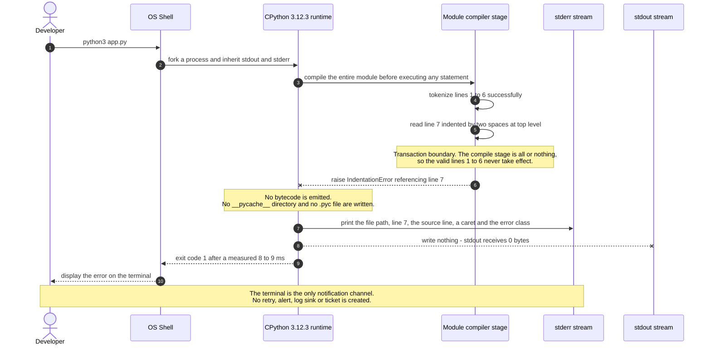

Two properties of this flow are worth recording. First, the **stream separation is clean and useful**: the diagnostic goes entirely to stderr and stdout receives exactly 0 bytes, so a caller redirecting stdout would observe silence rather than a corrupted result. Second, the notification is **synchronous and ephemeral** — if the developer is not watching the terminal, no record of the failure survives anywhere, because nothing is written to disk.

For contrast, the successful notification flow carries no error semantics at all — the value is written five times with no label, prefix, unit, status, or exit-code signal beyond `0`:

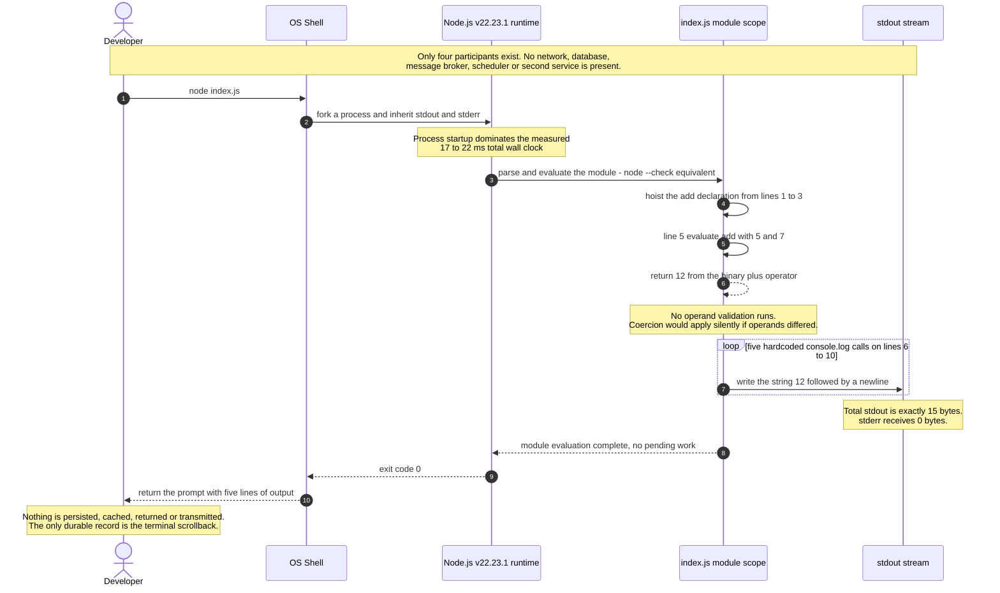

#### 4.3.2.4 Recovery Procedures

Recovery in this repository is exclusively a **manual source-edit-and-re-invoke procedure**. No automated recovery exists at any level: there is no restart policy, no process supervisor, no rollback mechanism, no health-check-driven replacement, and no CI gate that could block a broken commit — `.github/`, `.circleci/`, `.gitlab-ci.yml`, and `Jenkinsfile` are all verified absent.

The state machine below tracks each artifact from its committed state to a repaired one. Its transitions are drawn directly from the remediation sequence derived in section 2.4.8; that section is the origin of the ordering and this specification adds no plan of its own.

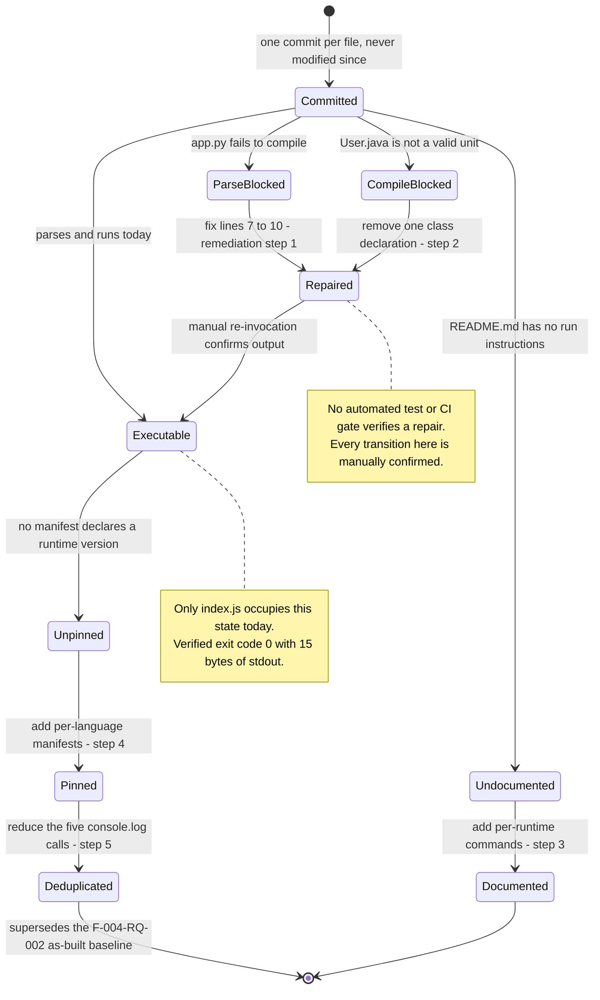

Each recovery procedure and its verification command are recorded below. Every verification is a single reproducible command, because assumption A-04 in section 2.1.8 establishes there is no test suite to appeal to.

| Procedure | Scope of the Edit | Verification Command | Expected Result |
|---|---|---|---|
| Repair `app.py` | Lines 7–10 only | `python3 -m py_compile app.py` then `python3 app.py` | Exit 0; stdout `Hello Lakshya` |
| Repair `User.java` | Remove one of the two class declarations | `javac User.java` then `java User` | Exit 0; one line of stdout |
| Document usage | Add per-runtime commands to `README.md` | Manual reading | A runnable command for each of the three artifacts |
| Pin runtimes | Add per-language manifests | Manual inspection | A declared version range per runtime |

Two limits on recovery must be stated plainly. First, the `User.java` repair **cannot be verified with the tooling available for this inspection**, because `java`, `javac`, `mvn`, and `gradle` are all absent from the environment — assumption A-03 in section 2.1.8 records the same constraint. Second, the `Deduplicated` transition would **invalidate an existing recorded baseline**: reducing the five `console.log` calls supersedes `F-004-RQ-002`, which section 2.2.4 documents as an as-built regression baseline of `Could-Have` priority rather than a desired requirement.


## 4.4 Required Diagrams and Coverage

This sub-section consolidates the diagram inventory for section 4, confirms that every required diagram class has been produced, and records the traceability from each documented feature to the diagram that depicts its process flow.

### 4.4.1 Required Diagram Coverage Matrix

Every required diagram class is present. The matrix records where each was placed rather than repeating it here, so that no diagram appears twice in the specification.

| Required Diagram Class | Produced As | Location |
|---|---|---|
| High-level system workflow | Four-swim-lane flowchart: Developer, OS Shell, Language Runtime, Observable Outcome | 4.1.1.1 |
| Detailed process flow per core feature | Three artifact-level flowcharts, plus the unified pipeline in 4.4.3 | 4.1.1.4, 4.1.1.5, 4.1.1.6 |
| Error handling flowchart | Consolidated three-stage failure and recovery flowchart | 4.3.2 |
| Integration sequence diagram | Integration-absence sequence diagram, plus failure and success sequence diagrams | 4.1.2.5, 4.3.2.3 |
| State transition diagram | OS process lifecycle with composite `Validating` state; artifact remediation state machine | 4.3.1.1, 4.3.2.4 |
| Supporting: data flow and persistence | Four-tier data-flow diagram with the verified-absent persistence tier | 4.1.2.1 |
| Supporting: validation gates | Validation-gate chain flowchart | 4.2.2 |

Thirteen diagrams appear across section 4. Two diagram classes that a conventional specification would include are **deliberately omitted because the repository contains nothing to depict**: an event-flow or message-choreography diagram (no event, message, topic, broker, or listener exists anywhere) and a batch or scheduled-job sequence diagram (no scheduler, cron entry, timer, or job definition exists, and the five emissions in `index.js` are literal duplication rather than iteration, as section 4.1.2.4 establishes). Drawing either would depict behaviour the code does not have.

### 4.4.2 Feature-to-Diagram Traceability

Each of the six features catalogued in section 2.1 is depicted in at least one diagram. `F-001` and `F-002` share a flow because the entry point exists solely to invoke the greeting routine; `F-003` and `F-004` share a flow for the same reason. Section 2.3.1 records these as the repository's only two dependency edges, both intra-file.

| Feature | Depicted In | Depicted State |
|---|---|---|
| F-001 Greeting String Construction | 4.1.1.5 | Reachable only on the dotted latent path |
| F-002 Python Script Execution Entry Point | 4.1.1.5, 4.3.2.3 | Parse-blocked; failure path fully traced |
| F-003 Two-Operand Addition | 4.1.1.4, 4.3.2.3 | Executing; includes the latent coercion branch |
| F-004 Computed-Result Console Emission | 4.1.1.4, 4.3.2.3 | Executing; five writes shown as a `loop` block |
| F-005 Java Literal Name Output Entry Point | 4.1.1.6 | Compile-blocked; run stage shown as unreachable |
| F-006 Repository Identification Documentation | 4.1.1.1, 4.3.2 | Shown as the documentation-gap decision and Stage 3 recovery |

`F-006` is the one feature whose process footprint is a *gap* rather than an execution path. It appears in the high-level workflow as the "Are run instructions documented?" decision — answered `No` — and in the error-handling flowchart as the third failure stage, whose recovery is adding per-runtime commands to `README.md`.

### 4.4.3 Unified Execution Pipeline

The diagram below is the one view that no other diagram in the specification provides: a **single pipeline shared by all three artifacts**, with the exact stage at which each terminates. Its central finding is that two of the three artifacts die at the *same* gate — Stage 2, parse or compile — despite failing for entirely unrelated reasons in two different languages.

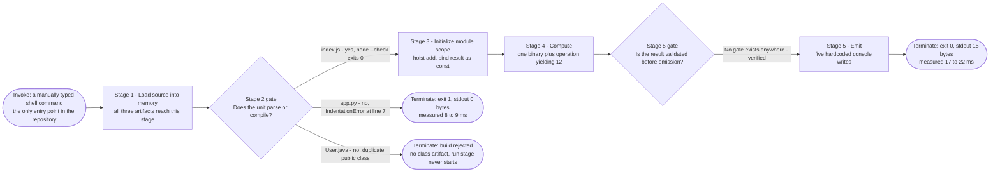

| Pipeline Stage | Artifacts Reaching It | Gate Applied |
|---|---|---|
| 1 — Load source | All three | None |
| 2 — Parse or compile | All three | **Two of three rejected here** |
| 3 — Initialize module scope | `index.js` only | None |
| 4 — Compute | `index.js` only | None |
| 5 — Emit | `index.js` only | **No validation gate exists** |
| 6 — Exit | All three, with differing codes | None |

The second gate in the diagram is a gate in name only. It is drawn to make the absence explicit: no validation, assertion, schema check, or sanity check stands between computing a value and printing it, so whatever Stage 4 produces reaches the console verbatim. Section 4.2.2.2 documents the consequence — a wrong result is emitted with exactly the same appearance as a correct one.

### 4.4.4 Diagram Conventions and Non-Duplication

All thirteen diagrams in section 4 were **validated by rendering**, not by inspection alone, so each is confirmed to be syntactically valid Mermaid rather than merely plausible. The following conventions are applied uniformly and are worth stating because they carry meaning:

| Convention | Meaning |
|---|---|
| Stadium node `([ ])` | A start or end terminal |
| Diamond node `{ }` | A decision point — always developer or toolchain, never application logic |
| Dotted edge `-.->` | A latent or currently unreachable path present in source intent only |
| `--x` edge in a sequence diagram | A **non-delivery**: an interaction verified absent from the repository |
| Subgraph | A swim lane for an actor, a system boundary, or a failure stage |

Section 4 deliberately contributes only **process and temporal** views, because two structural views already exist elsewhere in this specification and are not repeated: section 1.2.2.2 holds the artifact-boundary component diagram, and section 2.3.1 holds the feature-dependency map. Section 2.3.5 forward-references this section for the corresponding process flowcharts, and section 4.1 supplies them by decomposing the four-step manual workflow first stated in section 1.3.1.1.


## 4.5 References

### 4.5.1 Repository Files and Folders Examined

All four tracked files were read in full; each is cited below with the specific facts it established for this section.

- `index.js` — Established the only end-to-end executable workflow: the `add(a, b)` definition at lines 1–3, the module-scope `const result = add(5, 7)` binding at line 5, and the five identical `console.log(result)` statements at lines 6–10. Source of the success-path process flow (4.1.1.4), the immutable-state finding (4.3.1), and the absence of any loop behind the five emissions (4.1.2.4).
- `app.py` — Established the parse-failure workflow: `greet(name)` at lines 1–2, the first `if __name__ == "__main__":` guard at lines 4–6 assigning the literal `"Lakshya"`, the two-space-indented duplicate guard at line 7, and the invalid `///asdas` token at line 10. Source of the failure-path process flow (4.1.1.5), the compile-atomicity boundary (4.3.1.4), the error notification flow (4.3.2.3), and the last-write-wins state transition (4.3.1.1).
- `User.java` — Established the compile-blocked, two-stage build workflow: `public class User` declared twice, at lines 1–6 and 7–12, each containing only `public static void main(String[] args)` with a method-local `String name` printed via `System.out.println`. Source of the build flow (4.1.1.6), the "no object state exists" finding (4.3.1), and the never-read `args` parameter (4.2.1.1).
- `README.md` — Established the documentation gap that opens every workflow: the file is a single level-1 heading, `# only_parent_parent_repo_10_LOC`, with no run or build instructions. Source of the first decision point in the high-level workflow (4.1.1.1) and of failure Stage 3 in the error-handling flowchart (4.3.2).
- Repository root (`""`) — Established the structural preconditions for the entire section: a flat, four-file, zero-subdirectory polyglot layout with no package manifest, build configuration, dependency declaration, test file, or shared module structure. Confirmed the absence of any orchestrator, scheduler, service definition, or container that could host a process.

### 4.5.2 Verification Commands and Their Findings

The empirical claims in this section were produced by the following commands, executed in the repository checkout. The working tree was left clean throughout; all repair experiments were performed on copies in a temporary directory.

| Command | Finding Established |
|---|---|
| `git ls-files`, `find . -type d` | Exactly four tracked files; zero subdirectories |
| `node --check index.js` | Exit 0 — syntactically valid (`F-004-RQ-003`) |
| `node index.js`, `od -c` | Exit 0; stdout byte-exact 15 bytes as `1 2 \n` five times; stderr 0 bytes |
| `python3 app.py`, `python3 -m py_compile app.py` | Exit 1; `IndentationError` at line 7; stdout 0 bytes; no `__pycache__` or `.pyc` written |
| `sed -n '1,6p' app.py \| python3` | Lines 1–6 in isolation print exactly `Hello Lakshya`, exit 0 |
| 10-run `perf_counter` timing harness | `node index.js` median 20.5 ms; `python3 app.py` median 8.0 ms |
| `grep -c` census over all four files | Zero matches for `import`, `require`, `export`, `try`, `catch`, `except`, `finally`, `raise`, `throw`, `assert`, `else`, `for`, `while`, `open`, `input`, `os`, `env`, `argv`; `if` on exactly two lines |
| `ls LICENSE COPYING NOTICE SECURITY.md …` | All absent — the only compliance gap (4.2.2.4) |
| `git rev-parse HEAD 2807_01 main`, `git diff --stat main 2807_01` | One unique hash `ebde6c9`; empty diff — branches identical |
| `git status --porcelain` | Empty before, during, and after all execution — no workflow writes to disk |
| Coercion and immutability probes in `node` and `python3` | `add('5',7)`→`"57"`, `add()`→`NaN`, `add(null,1)`→`1`; `result = 99` throws `TypeError: Assignment to constant variable.`; `greet()` raises `TypeError: greet() missing 1 required positional argument: 'name'` |
| `mmdc` 11.18.0 render of every diagram | All 13 diagrams in section 4 produced a valid SVG |

### 4.5.3 Cross-Referenced Specification Sections

- **1.2.2.1 Primary System Capabilities** — Corroborated which capability executes today, anchoring the terminal outcomes in 4.1.1.1.
- **1.2.2.2 Major System Components** — Holds the artifact-boundary component diagram that section 4 deliberately does not repeat (4.4.4).
- **1.2.3.3 Key Performance Indicators** — Established that no KPI, SLO, SLA, or quality gate exists, governing the treatment of timing in 4.2.1.3.
- **1.3.1.1 In-Scope Core Features** — Source of the four-step manual workflow that section 4.1 decomposes.
- **1.3.1.2 Implementation Boundaries** — Established the single-process system boundary and the transient data footprint used in 4.1.1.2 and 4.3.1.
- **1.3.2.1, 1.3.2.3, 1.3.2.4** — Established the verified absences of integrations, messaging, persistence, auth, observability, and concurrency underpinning 4.1.2 and 4.2.2.3.
- **2.1 Feature Catalog** — Source of the `F-001`…`F-006` identifiers and of assumptions A-03 and A-04 constraining verification.
- **2.2 Functional Requirements Table** — Source of the `F-XXX-RQ-YYY` identifiers, the verification statuses, and the per-feature validation rules rendered as flow gates in 4.2.2.
- **2.3.1, 2.3.2, 2.3.4, 2.3.5** — Established the two intra-file dependency edges, the runtime-only integration point, the absence of common services, and the forward reference that section 4 fulfils.
- **2.4.1, 2.4.3, 2.4.4, 2.4.5, 2.4.8** — Established the "no error handling anywhere" constraint, the shared `user` binding, the silent-`NaN` correctness exposure, the hardcoded emission count, and the five-step remediation sequence used as the recovery procedures in 4.3.2.4.

### 4.5.4 External Sources

No external source was required for this section. Every claim is grounded in the repository contents or in commands executed against them; no dependency, framework, or third-party service exists in this repository whose external documentation would need to be consulted.


# 5. System Architecture

## 5.1 High-Level Architecture

This repository contains **689 bytes of source across four files at a single flat directory level** — `app.py` (206 B), `index.js` (171 B), `User.java` (280 B) and `README.md` (32 B) — with zero subdirectories, zero package manifests, and zero build, container, orchestration or pipeline definitions. Describing its architecture therefore means describing three things precisely: the very small amount of structure that *is* present, the interfaces each component actually exposes, and the substantial set of architectural layers that are **verifiably absent**. Every claim below is grounded in direct inspection of the committed files; where a property could not be executed in the inspection environment it is labelled as a static finding.

### 5.1.1 System Overview

#### 5.1.1.1 Architectural Style and Rationale

The system is best classified as a **flat collection of independent, single-file, single-shot command-line programs written in three different languages**. It is not an application in the integrated sense: there is no composition mechanism, no shared runtime, no orchestrator, and no artifact that is aware of any other artifact.

Three structural facts fix this classification:

- **The compilation unit is the deployment unit.** Each executable artifact is exactly one file that a language runtime loads whole. `app.py`, `index.js` and `User.java` are separately invoked, separately succeed or fail, and share nothing.
- **There is no wiring of any kind.** A pattern scan for `import`, `require(` and `export` across all four tracked files returns zero matches, as recorded in section 2.3. Consequently no dependency graph exists between artifacts; the only two dependency edges in the whole repository are intra-file (`F-002` calling `F-001`, and `F-004` reading the constant produced by `F-003`).
- **The application code touches nothing outside its own address space.** A single repository-wide scan for concurrency, network, filesystem, environment, argument and standard-input constructs — covering `thread`, `async`, `await`, `promise`, `fork`, `spawn`, `worker`, `socket`, `http`, `listen`, `bind(`, `open(`, `readFile`, `writeFile`, `fs.`, `environ`, `getenv`, `process.env`, `argv` and `stdin` — returns **zero matching lines**.

The rationale for this style is not documented anywhere in the repository: there is no architecture note, no design document, and no commit message that explains a decision (all four commit messages are GitHub web-UI defaults of the form `Create <file>`). The rationale must therefore be **inferred**, and the inference the evidence supports is that these files were created as minimal language exercises or as fixture content rather than as parts of a product. Three signals support that inference: placeholder literals are committed verbatim (`"asdasdafsad"` in `app.py`, `"asdsadasda"` in `User.java`, and the stray `///asdas` token on `app.py` line 10); two of the three executable artifacts contain a duplicated block that makes them non-runnable; and `README.md` contains only a title heading naming the repository itself.

It is equally important to record the styles that are **positively excluded by evidence**, because each exclusion removes a whole class of architectural concern from the remainder of this section:

| Candidate Style | Present | Disconfirming Evidence |
|---|---|---|
| Client–server or n-tier | No | Zero `socket`, `http`, `listen` and `bind(` matches; no port is opened by any artifact |
| Microservices or SOA | No | No service, no deployment descriptor, no inter-process call; each artifact is a terminating process |
| Event-driven or message-based | No | No broker client, queue, topic, emitter or subscriber; nothing is asynchronous |
| Layered or hexagonal | No | Each artifact is 10–12 lines of straight-line code with no port, adapter or boundary abstraction |
| Pipeline or dataflow | No | No artifact consumes another's output; `stdin` is never read |
| Plugin or modular monolith | No | Zero imports/exports; `require('./index.js')` yields an empty namespace (section 5.2.3) |
| Serverless or function-as-a-service | No | No handler signature, no function manifest, no invocation contract beyond the shell |
| Batch or scheduled | No | No scheduler, cron definition, loop or retry; zero `for` and `while` constructs repository-wide |

#### 5.1.1.2 Architectural Principles and Patterns Observed

A small number of genuine patterns are present, and they are worth naming precisely because they are the only reusable design content in the repository.

- **Zero-dependency self-containment.** Every artifact runs on nothing but its language runtime's built-ins: `print()` in `app.py`, the host `console` global in `index.js`, and `System.out` in `User.java`. No third-party package is referenced and no install step exists for any language — this is why no manifest is required for `app.py` or `index.js` to run.
- **Conditional-main entry point (Python).** `app.py` separates a reusable definition (`greet` on lines 1–2) from an executable body guarded by `if __name__ == "__main__":`. This is the correct idiom for a file that should be both importable and runnable. The idiom is defeated in practice here, because the file is not importable at all (section 5.2.3).
- **Static entry point (Java).** `User.java` uses the conventional `public static void main(String[] args)` signature as its entry point, present at both line 2 and line 8.
- **Pure computation separated from its side effect.** `greet(name)` and `add(a, b)` are both pure: each returns a value and performs no I/O. All emission happens at the call site, not inside the function. This is the single most defensible design property in the repository and is what makes `F-001` and `F-003` correct in isolation even where the enclosing artifact fails.
- **Synchronous, straight-line control flow.** A repository-wide census finds **zero** `for`, `while`, `switch` and `do` keywords, and **exactly two** `if` statements — both of which are the same `if __name__ == "__main__":` guard in `app.py` (lines 4 and 7). `index.js` and `User.java` therefore contain no branching whatsoever.
- **Write-only, fire-and-forget egress.** Every artifact's sole output channel is its standard-output stream. Nothing is returned to a caller, acknowledged, or read back.

The following anti-patterns are equally observable and materially shape the architecture:

| Anti-Pattern | Where It Appears | Architectural Consequence |
|---|---|---|
| Duplicated block | Second `if __name__ == "__main__":` in `app.py`; second `public class User` in `User.java`; five identical `console.log` calls in `index.js` | Two of three executable artifacts are non-runnable; the third emits five times what it needs to emit once |
| Hardcoded literal at the call site | `"Lakshya"`, `"asdasdafsad"`, `"Test"`, `"asdsadasda"`, `5`, `7` | No artifact is configurable or parameterizable; behaviour can only change by editing source |
| No error handling | Zero `try`, `catch`, `except`, `finally`, `raise` and `throw` matches (section 4.3.2) | Every fault escapes to the process boundary uncaught; one fault class escapes with no signal at all |
| No dependency or version declaration | No manifest for any of the three languages | The runtime version is whatever the operator happens to have installed; nothing is reproducible by construction |
| Non-composable unit | Empty `module.exports` in `index.js`; unnamed default package in `User.java`; unimportable `app.py` | No artifact can be consumed as a library, so the system cannot grow by composition |
| Documentation–code drift | `README.md` names the repository but documents no command, while no file carries a shebang or an execute bit | The knowledge of how to run the system exists only in the operator's head |

#### 5.1.1.3 System Boundaries and Major Interfaces

The system boundary is the **operating-system process boundary**, and it is drawn afresh for every invocation. One invocation creates one process, which loads exactly one file, writes to the streams it inherited, and terminates. Nothing survives it: section 4.3.1.2 records that no execution path writes to any durable medium, verified both by an unchanged `git status` across every inspection command and by the absence of any `__pycache__` directory or `.pyc` file even after a `py_compile` attempt.

Inside the boundary are the four committed files and the in-memory bindings they create. Outside the boundary are the operator, the shell, the language runtimes, the terminal scrollback, and the GitHub-hosted origin remote. Nothing else exists on either side — there is no network peer, no data store, no configuration source and no identity provider.

Four interfaces cross that boundary. Together they constitute the complete published contract of the system.

| Interface | Direction | Mechanism | Observed Contract |
|---|---|---|---|
| Invocation | Inbound | Shell process creation naming a runtime and a file path | Runtime name plus one file path. **No artifact carries a shebang and all four are mode `100644`**, so the operator must name the runtime explicitly; `python3 app.py` and `node index.js` are the observed forms |
| Argument and input | Inbound | Would be `argv` / `stdin` | **Unused.** `String[] args` is declared at `User.java` lines 2 and 8 but never read; zero `argv`, `sys.argv`, `process.env` and `stdin` matches exist repository-wide |
| Stream output | Outbound | File descriptors 1 and 2, inherited from the shell | `node index.js` → 15 bytes on stdout as 5 lines, 0 bytes on stderr. `python3 app.py` → 0 bytes on stdout, 215 bytes of unstructured diagnostic on stderr |
| Exit status | Outbound | Single integer returned to the shell | `node index.js` → `0`; `python3 app.py` → `1`. This is the only machine-readable outcome the system produces |

Two properties of this boundary are architecturally significant. First, the **invocation interface is undocumented**: because no file is executable and none declares an interpreter, and because `README.md` documents no command, correct invocation is untransmitted tacit knowledge — this is the third of the repository's three defects (`F-006-RQ-002`, Not Met). Second, the **stream contract is clean**: on the failure path stdout receives exactly 0 bytes, so a caller redirecting stdout observes silence rather than a corrupted result, and the exit status is invariant to the stdout sink (verified: `node index.js >/dev/null` and `node index.js | cat` both exit `0`).

A fifth boundary exists but is a *development-time* boundary rather than a runtime one: the Git source-control boundary between the local checkout and the GitHub-hosted origin remote. It carries source text in and out and participates in no execution path.

### 5.1.2 Core Components

The system has **four components, one per committed file**. Because a component boundary and a file boundary are the same thing here, the component inventory is exact and complete. The prompt's five attributes are presented as two tables so that no table exceeds four columns.

**Responsibilities and dependencies**

| Component | Primary Responsibility | Key Dependencies |
|---|---|---|
| `app.py` (commit `d19b798`) | Construct a greeting string from a name and print it — `F-001` plus the `F-002` entry point | CPython interpreter only. Uses the built-in `print()` and f-string interpolation; no import statement exists |
| `index.js` (commit `f4684af`) | Add two operands and emit the result — `F-003` plus the `F-004` five-fold emission | Node.js runtime only. Uses the host `console` global; no `require` exists |
| `User.java` (commit `ebde6c9`) | Print a literal name from a static entry point — `F-005` | A Java compiler and JVM, both **absent from the inspection environment** (assumption A-03). Uses `String` and `System` from `java.lang`; zero `import` declarations |
| `README.md` (commit `6a0af35`) | Identify the repository — `F-006` | None. Consumed directly by a human reader with no runtime involved |

**Integration points and critical considerations**

| Component | Integration Points | Critical Considerations |
|---|---|---|
| `app.py` | One only: `print()` to the CPython stdout facility | **Does not execute.** The compile stage rejects the unit at line 7 (`IndentationError`), and because compilation is all-or-nothing the valid lines 1–6 never take effect. Also not importable, so `greet` is unreachable from anywhere |
| `index.js` | One only: the `console.log` write path to Node's stdout facility | The only artifact that runs today, exiting `0` with a byte-exact 15-byte stream. Exposes **no API**: `require('./index.js')` returns an empty object *and* triggers all five writes as an import side effect |
| `User.java` | One only: `System.out.println` to the JVM stdout facility | **Not a valid compilation unit** — `public class User` is declared twice (lines 1 and 7). Sits in the default unnamed package (zero `package` declarations), so even after repair it could not be imported by a packaged class. Findings are static; no compiler was available |
| `README.md` | None. No artifact references it and it references no artifact | Documents no build or run command for any of the three runtimes, leaving the invocation interface undocumented |

Two component-level observations cut across the table. First, a **structural similarity is not a shared component**: `F-002`, `F-004` and `F-005` each follow the same shape — a single-file entry point computing on inlined literals and writing to standard output — but section 2.3.3 records that nothing is reused; each artifact re-implements the shape independently in its own language. Second, `User.java` is **named for a data entity but models none**: it declares no field, no constructor and no accessor, so no object state exists at all.

### 5.1.3 Data Flow Description

#### 5.1.3.1 Primary Data Flows

There is exactly **one** data-flow shape in the system, and each executable component instantiates it independently:

> a literal embedded in the source text → the runtime's in-memory representation of that literal → a variable binding in module or method scope → one or more writes to file descriptor 1 → discarded when the process exits.

The flow is **linear, unidirectional and single-pass**. No value is ever read back, joined with another value, forwarded to a second component, or persisted. Section 3.5.2.2 diagrams this path and section 4.3.1 enumerates the three bindings that constitute the entire live-data inventory (`user` in `app.py`, `result` in `index.js`, `name` in `User.java`).

Instantiated per component, the flows are:

- **`index.js` — the only flow that completes.** The numeric literals `5` and `7` on line 5 are passed to `add`, the returned `12` is bound to the `const result`, and lines 6–10 read that binding five times, each write emitting three bytes for a 15-byte total. The five writes are independent and unsynchronized; there is no enclosing atomicity boundary, and all five are issued even when the downstream consumer stops reading (verified: `node index.js | head -2` still causes all five writes to be issued in-process).
- **`app.py` — a flow that never starts.** The literals `"Lakshya"` (line 5) and `"asdasdafsad"` (line 8) would each be bound to the module-level name `user` and interpolated by `greet`, but the unit fails to compile, so no binding is created and stdout receives 0 bytes. The flow's *intended* behaviour was confirmed only against a minimally corrected copy, as recorded in section 4.3.1.1.
- **`User.java` — a flow that is structurally described but not executed.** The literals `"Test"` (line 3) and `"asdsadasda"` (line 9) are method-local and would be printed directly. No compiler was available, so this is a static reading of the source.
- **`README.md` — a documentation flow with no runtime.** Its single line of text is read by a human directly from the repository.

#### 5.1.3.2 Integration Patterns and Protocols

The only integration protocol in use is the **POSIX process-and-stream convention**: a process is created with a command line, it inherits descriptors 1 and 2, it writes plain text, and it returns an integer status. That is the whole of it.

| Protocol Class | Present | Evidence |
|---|---|---|
| Process and stream convention | **Yes — the only one** | Every artifact writes plain text to fd 1; exit status is the sole structured outcome |
| Wire protocol — HTTP, gRPC, WebSocket, TCP | No | Zero `http`, `socket`, `listen` and `bind(` matches repository-wide |
| Serialization format — JSON, XML, YAML, Protobuf, CSV | No | No serializer is referenced and no `.json`, `.xml`, `.yaml`, `.yml`, `.toml` or `.proto` file exists anywhere in the repository |
| Interface definition — OpenAPI, schema, IDL, DTO | No | No schema, contract, entity or interface is declared in any file |
| Language-level module protocol | No | Zero `import`, `require(` and `export` matches (section 2.3) |

Section 2.3.2 states the resulting conclusion exactly: the only integration point in the repository is the boundary between each feature and its own language runtime's standard-output facility. Standard output is a **shared destination, not a shared implementation** — each component reaches it through its own language's built-in mechanism.

#### 5.1.3.3 Data Transformation Points

The entire system performs **three transformations**, all of them in-memory, all of them unvalidated, and each of them polymorphic in a way that would silently accept the wrong type:

1. **String interpolation** — `app.py` line 2, `f"Hello {name}"`. It coerces rather than validates: verified behaviour is `greet(42)` → `'Hello 42'`, `greet(None)` → `'Hello None'` and `greet('')` → `'Hello '`.
2. **The JavaScript `+` operator** — `index.js` line 2, `return a + b`. With the committed literals it performs numeric addition (`5 + 7` → `12`), but the same operator concatenates strings: verified behaviour is `add('5', 7)` → `"57"`, `add()` → `NaN` and `add([1], [2])` → `"12"`.
3. **Stringification for the stream** — every `print()`, `console.log()` and `System.out.println()` call converts its argument to text before writing. There is no formatter, template, log level, prefix, unit or redaction step anywhere.

No validation, sanitization, encoding, encryption, compression, mapping or normalization step exists at any of these points. The **sole enforcement mechanism in the entire repository** is inherited rather than implemented: CPython's own argument binding, which raises `TypeError` when `greet` is called with the wrong arity. JavaScript's `add` performs no arity check at all, which is why the second transformation is the system's only silent-failure surface.

#### 5.1.3.4 Data Stores and Caches

**There are none of either.** Section 4.3.1.2 records the absence of every persistence candidate — database, object store, file write, bytecode cache, log file and configuration state — and section 4.3.1.3 records the absence of every cache form, including in-process memoization, on-disk cache, distributed cache and HTTP cache headers, along with any TTL or eviction policy.

The absence is consistent with the workloads rather than being a gap: each program performs one computation on source-embedded literals inside a process whose measured lifetime is under 25 milliseconds, starting from a cold, empty address space every time. There is no repeated computation to amortize, no remote latency to hide, and no cross-invocation continuity to preserve. The only durable record any execution produces is the operator's terminal scrollback, which lies outside the system boundary.

### 5.1.4 External Integration Points

The repository integrates with **no external system at runtime**. The systems listed below are either development-time relationships or the language runtimes on which the components depend. As with the component tables, the prompt's five attributes are split so that no table exceeds four columns.

**Integration type and exchange pattern**

| System | Integration Type | Data Exchange Pattern |
|---|---|---|
| GitHub repository hosting | Development-time source control **only** — not a runtime integration | Operator-initiated `clone`, `fetch` and `push` of source text over Git-over-HTTPS. Four commits have been exchanged in total |
| CPython interpreter | External runtime dependency, invoked in-process by the shell | Synchronous: the interpreter loads `app.py` as one compilation unit and writes to the inherited streams |
| Node.js runtime | External runtime dependency, invoked in-process by the shell | Synchronous: the runtime evaluates `index.js` module scope and writes to the inherited streams |
| Java compiler and JVM | **Required but absent** in the inspection environment | Would be a two-stage compile-then-run exchange; never exercised (assumption A-03) |
| POSIX shell and operating system | Host platform providing process creation and stream inheritance | One process per invocation; command line in, exit status out |
| Operator's terminal | Human output consumer | Unstructured text on fd 1 and fd 2, read visually; the scrollback is the only record |

**Protocol, format and service level**

| System | Protocol and Format | Declared SLA or Service Level |
|---|---|---|
| GitHub repository hosting | Git over HTTPS; content is plain UTF-8 source text | **None declared.** No CI workflow, status check or branch protection exists — `.github/`, `.gitlab-ci.yml`, `Jenkinsfile` and `.circleci/` are all verified absent, so GitHub performs no automated role |
| CPython interpreter | Process invocation `python3 app.py`; plain text on fd 2 | **None declared, and no version is pinned.** No `requirements.txt`, `pyproject.toml` or `setup.py` exists. Measured in this environment on CPython 3.12.3: exit `1`, 215 bytes on stderr, max RSS 9.2 MiB, 7.8–9.1 ms wall clock |
| Node.js runtime | Process invocation `node index.js`; plain text on fd 1 | **None declared, and no version is pinned.** No `package.json` or lockfile exists. Measured in this environment on Node.js v22.23.1: exit `0`, 15 bytes on stdout, max RSS 43.7 MiB, 17.2–22.1 ms wall clock |
| Java compiler and JVM | Would be `javac User.java` then `java User` | **None declared, and no version is pinned.** No `pom.xml`, `build.gradle` or `settings.gradle` exists. Not measurable here |
| POSIX shell and operating system | Process creation with `argv`; fd inheritance; integer exit status | **None declared.** No supervisor, restart policy, timeout or resource limit is configured anywhere |
| Operator's terminal | Newline-delimited plain text; no encoding declared | **None declared.** No health check, alert, dashboard or acknowledgement exists |

Two points must be stated explicitly because their absence is easy to misread as an omission in this specification rather than in the repository. First, **no service-level agreement, service-level objective, latency budget, throughput target, availability target, error budget or quality gate exists anywhere in the repository** — sections 1.2.3.3 and 2.2 record the same finding independently. Every number quoted above is a *measurement taken during this inspection*, not a commitment, and each is attributable to interpreter start-up rather than to application work. Second, **the runtime versions named above belong to the inspection environment, not to the repository**: because no manifest pins any runtime, a different host may supply a different version, and nothing in the repository would detect or reject it.


## 5.2 Component Details

Because every component boundary in this repository coincides with a file boundary, the component inventory is exact: there are four components and no partial, hidden or generated ones. This sub-section documents each in turn, then presents the three architecture-level diagrams the system supports — a component interaction view, a component state view, and a consolidated invocation-sequence view.

### 5.2.1 Component Inventory and Classification

| Component | Class | Runtime Status |
|---|---|---|
| `index.js` | Executable component | **Runs.** Exit `0`, 15 bytes on stdout, 0 bytes on stderr |
| `app.py` | Executable component | **Blocked at compile time.** Exit `1`, 0 bytes on stdout, 215 bytes on stderr |
| `User.java` | Executable component | **Blocked at compile time (static finding).** Two `public class User` declarations in one unit; no compiler available to confirm |
| `README.md` | Documentation component | **Not executable.** Read directly by a human; no runtime participates |

The classification matters architecturally because it means **one of three executable components is operational**. Any statement about how "the system" behaves is therefore a statement about `index.js` unless explicitly qualified.

A property shared by all four components constrains every deployment discussion that follows: all four are recorded in the Git index with mode `100644` and none begins with a shebang (`app.py` begins `def`, `index.js` begins `function`, `User.java` begins `public`, `README.md` begins `#`). No component is self-invoking, and none declares the runtime it needs.

### 5.2.2 Component Interaction Architecture

The diagram below is a layered interaction view. It is organized by *which layer owns a responsibility* rather than by artifact adjacency, and its central message is that **every layer except the application layer is supplied by the environment**, while several layers that a conventional system would have do not exist at all. Dotted edges mark paths that are latent or unavailable.

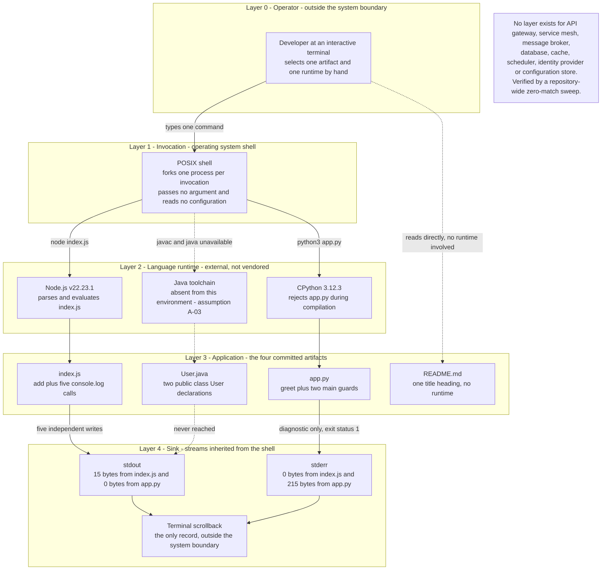

Three observations follow from the diagram:

- **The application layer is a leaf, never a hub.** No arrow runs between two nodes inside `ApplicationLayer`. Components are siblings that never speak; every arrow into or out of a component connects it to the environment.
- **Responsibility is inverted relative to a conventional system.** Process creation, parsing, memory management, error detection, stream handling and output formatting are all owned by Layers 1, 2 and 4. Layer 3 contributes only two arithmetic-or-string operations and a set of emission calls.
- **Integration is performed by a human.** Layer 0 is the only element with edges to more than one component, which makes the operator the system's sole integrator — a point section 5.2.8 develops.

### 5.2.3 index.js — Computation and Emission Component

| Attribute | Observed Detail |
|---|---|
| Purpose | Compute the sum of two hard-coded operands (`F-003`) and emit the result to the console (`F-004`) |
| Responsibilities | Define `add(a, b)`; bind `const result = add(5, 7)`; issue five identical `console.log(result)` calls |
| Technologies and frameworks | Node.js runtime only — no framework, no bundler, no transpiler, no lockfile. Runs on the ECMAScript features of the host runtime with no syntax that requires transformation |
| Key interfaces and APIs | **Inbound:** process invocation `node index.js`; no argument or stdin is read. **Outbound:** five `console.log` writes on fd 1 totalling 15 bytes; 0 bytes on fd 2; exit status `0`. **Programmatic:** none — see below |
| Data persistence requirements | None. One `const` binding in module scope, discarded at process exit |
| Scaling considerations | Stateless and shares nothing, so N invocations are trivially independent; but no mechanism exists to launch them and the workload is one addition. See section 5.2.9 |

The architecturally decisive finding about this component is that **it publishes no programmatic interface at all**. `require('./index.js')` succeeds, but the returned value is an empty object: `Object.keys(module.exports)` is `[]` and `typeof` is `'object'`, because no `module.exports` or `export` assignment exists. `add` is therefore unreachable from outside the file. Worse for composability, the act of requiring the file **executes it**, emitting all five lines as an import side effect (verified: `node -e "require('./index.js')"` produces five lines of output). The component is consequently a **terminal script, not a module** — it cannot be embedded in a larger system without also importing its output behaviour, which is precisely the property a reusable unit must not have.

Two further behaviours were verified and bear on the component's runtime contract. The five writes are **independent and unsynchronized**: no enclosing atomicity boundary exists, and all five are issued even when the downstream consumer stops reading (`node index.js | head -2` yields two lines while all five writes are still issued in-process). And the exit status is **invariant to the stdout sink** — redirecting to `/dev/null` or piping to `cat` both yield `0` — so there is no tty detection or sink-dependent behaviour.

### 5.2.4 app.py — Greeting Construction Component

| Attribute | Observed Detail |
|---|---|
| Purpose | Construct a greeting string from a name (`F-001`) and print it from a guarded entry point (`F-002`) |
| Responsibilities | Define `greet(name)` returning the f-string `f"Hello {name}"`; bind a name literal and print the greeting under `if __name__ == "__main__":` |
| Technologies and frameworks | CPython interpreter only — no import statement, no framework, no virtual environment, no dependency manifest |
| Key interfaces and APIs | **Inbound:** process invocation `python3 app.py`; no argument or stdin is read. **Outbound:** 0 bytes on fd 1; 215 bytes of unstructured diagnostic on fd 2; exit status `1`. **Programmatic:** none reachable — see below |
| Data persistence requirements | None. One module-scope binding that is never created because the unit does not compile |
| Scaling considerations | Not applicable while the component does not execute; the failure path is itself measurable at 9.2 MiB and 7.8–9.1 ms |

This component is blocked by the **first of the repository's three defects**: two-space indentation on line 7 produces `IndentationError: unindent does not match any outer indentation level`, and line 10 carries the invalid token `///asdas`. Because CPython compilation is all-or-nothing per unit, the syntactically correct lines 1–6 never take effect — section 4.3.1.4 records that extracting those lines and running them in isolation prints exactly `Hello Lakshya`, proving the lines themselves are sound and that unit-wide compile atomicity is what suppresses them.

The same defect closes the component's **only remaining composability path**: `python3 -c "import app"` fails with the identical `IndentationError`, so `greet` is unreachable from any other module. Both the script path and the library path are blocked by one fault, which is why the first remediation step in section 2.4.8 unblocks three requirements and the reachability of `F-001` simultaneously.

The failure contract deserves an architectural note. The 215 bytes written to stderr are **human-readable and unstructured** — a file path, a line number, the offending source line, a caret and an error class. There is no machine-readable error object, no error code taxonomy, and no partial output: the outcome is all-or-nothing at parse time. A caller could distinguish success from failure only by the exit status.

### 5.2.5 User.java — Literal Output Component

| Attribute | Observed Detail |
|---|---|
| Purpose | Print a hard-coded name from a conventional static entry point (`F-005`) |
| Responsibilities | Declare `public class User` with `public static void main(String[] args)`; bind a local `String name` and print it via `System.out.println` |
| Technologies and frameworks | Java language and `java.lang` only — zero `import` declarations. Requires a compiler and a JVM, **neither of which exists in the inspection environment** (assumption A-03) |
| Key interfaces and APIs | **Inbound:** would be `javac User.java` then `java User`; `String[] args` is declared at lines 2 and 8 but never read. **Outbound:** would be one `System.out.println` write per entry point. **Programmatic:** none — see below |
| Data persistence requirements | None. No field, no constructor and no accessor, so no object state exists; `name` is method-local and reclaimed when `main` returns |
| Scaling considerations | Not assessable. No compilation or execution was possible, so no measurement exists |

Every claim about this component is a **static, structural reading of the source text**; none is compiler-verified, because `javac`, `java`, `mvn` and `gradle` are all absent from the inspection environment.

Two structural findings block composability independently of each other. First, **`public class User` is declared twice**, at lines 1 and 7 — two top-level public types in one compilation unit. This is the second of the repository's three defects. Second, the file contains **zero `package` declarations**, so the type resides in the default unnamed package; even after the duplicate is removed, a packaged Java class could not import it. Java-side composability is therefore doubly blocked, and the second remediation step in section 2.4.8 addresses only the first of the two.

A naming observation is worth recording because the file name invites the opposite conclusion: the component is **named for a data entity but models none**. There is no field, no constructor, no accessor and no schema — only a static method printing a literal. Nothing in this repository represents a user, a person or any other domain entity.

### 5.2.6 README.md — Repository Identification Component

| Attribute | Observed Detail |
|---|---|
| Purpose | Identify the repository by name (`F-006`) |
| Responsibilities | Present a single level-1 heading naming the repository |
| Technologies and frameworks | None. Plain Markdown, 32 bytes, one line, consumed directly by a human reader |
| Key interfaces and APIs | The rendered or raw file itself. It references no artifact, and no artifact references it |
| Data persistence requirements | None beyond its own storage in version control |
| Scaling considerations | Not applicable |

Architecturally this component matters for what it omits. It documents **no build command, no run command and no prerequisite for any of the three runtimes** (`F-006-RQ-002`, Not Met — the third of the repository's three defects). Combined with the absence of shebangs and execute bits established in section 5.2.1, this means the system's inbound invocation interface is **entirely undocumented**: nothing in the repository tells a new operator which runtime to pair with which file, and no automated discovery mechanism exists to infer it.

### 5.2.7 Component State Model

The state model below is deliberately narrower than the process lifecycle documented in section 4.3.1.1. It models only the **data-binding states inside each component** — the lifecycle of the values the components actually manipulate — because that is the layer this specification's component view owns. Each region corresponds to one component's variable scope.

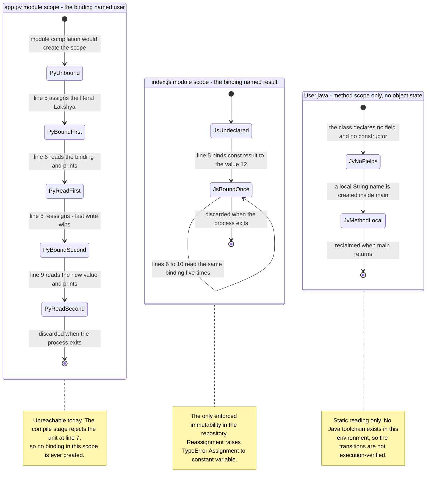

Three properties of this model are architecturally consequential:

- **The three regions never interact.** There is no transition, no shared symbol and no synchronization edge between them, which is the state-level restatement of the component independence shown in section 5.2.2.
- **`index.js` contains no mutable state whatsoever.** Its region has exactly one irreversible binding transition; the self-transition represents five reads of an unchanging value. Section 4.3.1 records the verification that reassignment raises `TypeError`.
- **The whole system's mutable-state behaviour is one read-then-overwrite sequence**, in `app.py`'s region, and it is currently unreachable. There is no state outside these three regions — no session, cache, database, file, shared memory or global registry.

### 5.2.8 Key Execution Sequence

The sequence below is the system's **single architectural invocation contract**, expressed once with the three executable components as alternatives. It complements the per-artifact runtime traces in section 4.3.2.3 by showing what is common to every invocation — the participants, the boundaries they own, and the outcome contract each alternative returns.

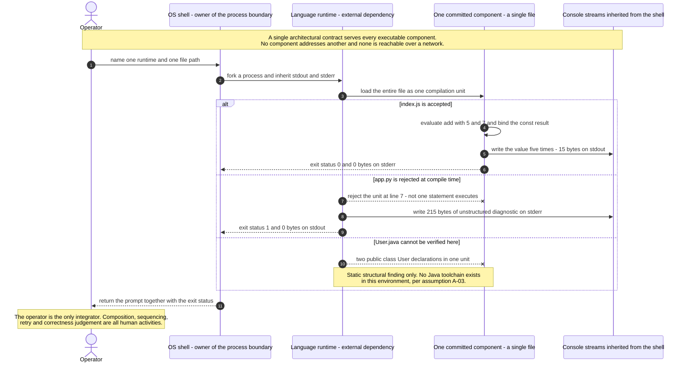

The contract has five participants and no more. There is no client, no gateway, no second service, no broker, no scheduler and no store — and the fifth participant, the console, is a sink that never replies. The sequence also makes the system's **trust and control chain** explicit: the operator chooses the runtime, the shell owns the process boundary, the runtime owns parsing and error detection, and the component owns only the two lines of computation between them. No authorization check occurs at any hop, because no component has any concept of an identity, credential, token, session, role or permission.

### 5.2.9 Scaling Considerations Across Components

Scaling is discussed here on measured evidence only; the repository declares no capacity target, and section 5.1.4 records that no service level of any kind exists.

The dominant finding is that **fixed runtime overhead accounts for essentially the entire cost of an invocation**, leaving the application code with no measurable share:

| Dimension | `node index.js` | `python3 app.py` |
|---|---|---|
| Source size | 171 bytes | 206 bytes |
| Peak resident memory | 43.7 MiB | 9.2 MiB |
| Wall clock, 10-run range | 17.2–22.1 ms, median 20.5 ms | 7.8–9.1 ms, median 8.0 ms |
| Useful output | 15 bytes on stdout | 0 bytes; 215 bytes of diagnostic |

The resident footprint of a `node index.js` invocation is roughly 268,000 times the size of the source file it executes, and the failure path in `app.py` is about 2.5 times *faster* than the success path in `index.js` purely because CPython aborts during compilation. Both figures say the same thing: the interpreter start-up cost, not the workload, is the unit of scale. The application performs one addition and one set of writes; no scaling decision could make that cheaper.

The scaling dimensions available to this architecture, and their limits, are:

- **Horizontal — available in principle, absent in practice.** Every component is stateless, shares nothing, holds no lock and touches no common resource, so any number of invocations are trivially independent. Nothing in the repository can launch them, however: there is no orchestrator, supervisor, scheduler, queue or driver script, so concurrency would have to be created entirely by the operator or by an external tool.
- **Vertical — no benefit.** A faster CPU or more memory shortens interpreter start-up marginally and does nothing for the workload. There is no data volume, batch size, connection count or working set to grow into.
- **Intra-component concurrency — structurally impossible as written.** A repository-wide sweep for `thread`, `async`, `await`, `promise`, `fork`, `spawn`, `worker` and `multiprocess` returns zero matches, and there are zero `for` and `while` constructs, so no code path can iterate or parallelize. Node.js does report seven threads for a trivial process, but those are the runtime's own libuv and V8 helper threads; **no application code uses any of them**.
- **Flow control — none.** The five writes in `index.js` have no batching, buffering configuration, backpressure or acknowledgement. All five are issued regardless of whether anything is consuming them.
- **Derived arithmetic ceilings.** From the measured median, sequential single-process throughput on the inspection host is approximately 48 `node index.js` invocations per second, and concurrent invocations would be memory-bounded at roughly one per 43.7 MiB of available RAM. **Both figures are arithmetic extrapolations from single-run measurements, not load-test results**, and neither is a commitment of any kind.

Finally, two components have **no scaling story at all** because they do not run: `app.py` and `User.java` must first clear the defects recorded in sections 5.2.4 and 5.2.5, following the remediation ordering owned by section 2.4.8, before any capacity question about them becomes meaningful.


## 5.3 Technical Decisions

**No architecture decision record, design note or rationale document exists in this repository.** There is no `docs/` directory, no `adr/` directory, no design file of any kind, and all four commit messages are GitHub web-UI defaults (`Initial commit`, `Create index.js`, `Create app.py`, `Create User.java`) that explain nothing. Every decision documented below has therefore been **reconstructed from code evidence and is labelled as an inference**. What is *not* inferred is the observable outcome of each decision; those outcomes are verified facts, and they are what make the reconstruction defensible.

### 5.3.1 Architecture Style Decision and Tradeoffs

**Decision as observed:** organize the repository as three independent single-file programs in three different languages, with no shared structure, no build step and no declared infrastructure.

**Reconstructed context.** The evidence points to language exercises or fixture content rather than a product: placeholder literals are committed (`"asdasdafsad"`, `"asdsadasda"`, the stray `///asdas` token), the four files were created in four commits inside roughly ninety seconds and never modified afterwards, and `README.md` contains only the repository's own name. Under those circumstances the cheapest possible structure — one file per idea — is a coherent choice, and it is the choice the code exhibits.

The tradeoffs of that style against the obvious alternative are stated below. The alternative considered is a conventional single integrated project with a shared module structure, one primary language and a declared build.

| Dimension | Observed style — independent single files | Alternative — one integrated project |
|---|---|---|
| Time to add a snippet | Minimal; create one file, no wiring, no manifest to update | Higher; requires placing code inside an existing structure |
| Reuse and composability | **None.** No component can be imported by another; `index.js` exports nothing and `app.py` cannot be imported at all | Reuse is the default; a shared module is importable by construction |
| Blast radius of a defect | Contained to one file — `app.py` failing does not affect `index.js` | Wider; a shared module's defect propagates to every consumer |
| Reproducibility | **Absent.** No manifest pins any runtime, so behaviour depends on whatever the host has installed | A manifest and lockfile make the runtime and dependency set explicit |
| Verifiability | **Absent.** No test suite and no pipeline exist, so two of three components shipped non-runnable | A build and test step would have rejected the duplicate-class and indentation defects before they landed |
| Operational surface | Minimal; one process, no port, no store, nothing to operate | Larger; a deployable unit implies packaging, configuration and release concerns |

The honest reading of this table is that the observed style bought speed and isolation and paid for them with reuse, reproducibility and verifiability. **The price was actually incurred**, not merely risked: sections 5.2.4 and 5.2.5 record that two of the three executable components do not run, and the absence of any verification step is why nothing caught them.

### 5.3.2 Communication Pattern Choices

**Decision as observed:** the only communication pattern is a one-way write to an inherited standard-output stream, per process, with an integer exit status as the sole structured signal.

| Pattern | Selected | Basis for the Finding |
|---|---|---|
| Write to inherited stdout/stderr | **Yes — the only pattern present** | `print()`, `console.log`, `System.out.println`; 15 bytes on fd 1 from `index.js`, 215 bytes on fd 2 from `app.py` |
| Process exit status | **Yes — the only machine-readable channel** | `0` from `index.js`, `1` from `app.py`; invariant to the stdout sink |
| Synchronous request/response over a network | No | Zero `http`, `socket`, `listen` and `bind(` matches repository-wide |
| Asynchronous messaging, queues, pub/sub | No | No broker client, topic, emitter or subscriber; zero `async`, `await` and `promise` matches |
| Shared-memory or IPC between components | No | One process per invocation; no pipe, signal, socket or shared segment is created by any component |
| In-process function call across components | No | Zero `import`, `require(` and `export` matches; `require('./index.js')` returns an empty namespace |
| Standard input as an inbound channel | No | Zero `stdin` and `input(` matches; fd 0 is never read |
| Command-line arguments as an inbound channel | No | Zero `argv` and `sys.argv` matches; `String[] args` is declared at `User.java` lines 2 and 8 but never read |

**Reconstructed rationale.** Each component produces one value and needs one place to put it. Standard output is the only channel that requires no dependency, no configuration, no address and no counterparty, so for a program whose entire purpose is to show a value to the person who just launched it, it is the minimal sufficient choice.

**The consequence that matters architecturally** is that the pattern is *write-only and unaddressed*. Nothing can call these components, nothing can be called by them, and nothing acknowledges their output. That is why section 5.2.8 identifies the operator as the system's only integrator: every act of composition, sequencing and result-checking is performed by a human, because no communication mechanism exists that could perform it otherwise.

### 5.3.3 Data Storage Solution Rationale

**Decision as observed:** store nothing. No database, object store, file, cache or bytecode artifact is written by any execution path.

**Reconstructed rationale, tested against the workload.** Storage is required when a value must outlive the computation that produced it, be shared with another consumer, or be too large for memory. **None of the three conditions holds here.** The complete data universe of the repository is six distinct string literals and two numeric literals embedded in the source; each is read once, transformed once, written once, and discarded when the process exits. There is no second consumer, because no component addresses another. And the working set is a few dozen bytes.

| Storage Option | Selected | Why the Evidence Rules It Out |
|---|---|---|
| Relational or document database | No | No driver, ORM, SQL statement or connection string exists; nothing produces a record that would need a row |
| File on disk | No | Zero `open(`, `readFile`, `writeFile` and `fs.` matches; `git status` remained empty across every inspection command |
| Object or blob store | No | No client, bucket reference or credential exists; no component produces a binary artifact |
| Build or bytecode artifact | No | No `__pycache__` or `.pyc` is written even after a `py_compile` attempt, because compilation aborts first; no `User.class` is produced |
| In-memory binding only | **Yes — the selected mechanism** | Three bindings constitute the entire live-data inventory, each scoped to one process or one method call |

Choosing storage would have imposed a schema, a connection lifecycle, a failure mode, a credential and a migration path on a program that computes `5 + 7`. The decision to store nothing is therefore **well matched to the workload**, and it is the one omission in this repository that requires no remediation. Section 4.3.1.2 documents the verification in detail; this sub-section adds only the rationale.

### 5.3.4 Caching Strategy Justification

**Decision as observed:** no caching of any kind — no memoization, no on-disk cache, no distributed cache, no HTTP cache directive, and no TTL or eviction policy.

**Reconstructed rationale.** A cache pays for itself only when a result is expensive to produce and is needed more than once. In this system neither half of that condition is met, and the reason is structural rather than incidental:

- **Nothing is expensive.** The two computations are one integer addition and one string interpolation. Section 5.2.9 shows that measured cost is essentially all interpreter start-up, so there is no computation whose result would be worth retaining.
- **Nothing is requested twice.** There are zero `for` and `while` constructs repository-wide and no inbound request channel, so no code path can ask for the same value again. The nearest thing to repetition — the five `console.log` calls in `index.js` — already reads one existing binding five times, which is the cheapest possible form of reuse and needs no cache to mediate it.
- **Nothing survives to be cached into.** Every process starts from a cold, empty address space and exits in under 25 milliseconds. A cross-invocation cache would need durable storage, which section 5.3.3 shows does not exist.
- **There is no remote latency to hide.** With no network call anywhere, the classic motivation for caching is simply absent.

Section 4.3.1.3 records the same absence from the implementation side, including the observation that Node.js's own internal module cache is runtime-supplied and irrelevant here because `index.js` imports nothing. **Adding a cache to this system would add a coherence problem and an eviction policy in exchange for no measurable benefit**, so the decision is sound as observed.

### 5.3.5 Security Mechanism Selection

**Decision as observed:** no security mechanism of any kind is implemented. This is a factual statement about the code, and the security *posture* it produces is more nuanced than the bare absence suggests.

| Mechanism | Present | Basis for the Finding |
|---|---|---|
| Authentication | No | No credential, token, session, password, key or identity concept exists in any file (section 2.3.4) |
| Authorization | No | No role, permission, scope, policy or access check; section 5.2.8 shows no authorization hop in the invocation chain |
| Transport protection | No | Nothing is transmitted — zero network constructs, so there is no channel to protect |
| Cryptography | No | No hashing, signing, encryption or random-generation call is referenced |
| Secret management | No | No `.env`, vault client or environment read; the complete literal inventory is six strings and two numbers, none of which is a credential |
| Input validation | **Inherited only, not implemented** | CPython's argument binding raises `TypeError` on wrong arity for `greet` — the sole enforcement mechanism in the repository. JavaScript's `add` performs no arity check at all |
| Output encoding or redaction | No | `print`, `console.log` and `System.out.println` are used raw, with no log level, formatter, masking or escaping |
| Dependency and supply-chain control | No | Zero third-party dependencies means no transitive supply-chain surface, but also no manifest or lockfile pinning the runtime itself |

**Reconstructed rationale, and the reason the absence is defensible on its own terms.** Security mechanisms defend a surface, and this system's **inbound surface is empty**: the zero-match sweep across network, filesystem, environment, argument and standard-input constructs means there is no path by which untrusted data can enter any component. Every value the system processes is a literal that a committer typed into the source. There is consequently no remotely reachable attack surface to authenticate, authorize, encrypt or validate, and no personal or sensitive data is handled despite the literal `"Lakshya"` and the class name `User` — section 5.2.5 records that `User.java` models no entity at all.

Three residual exposures are nevertheless real and must be named:

1. **Silent incorrectness rather than failure.** `add` coerces without checking (`add('5', 7)` returns `"57"`, `add()` returns `NaN`), and `console.log` emits a wrong value with exactly the same appearance as a correct one. Section 2.4.4 characterizes this as a correctness exposure rather than a security one, and it is **latent** because the committed call site supplies the literals `5` and `7`. It would become active the moment an inbound channel were added — which is precisely why input validation should be introduced *with* any such channel rather than after it.
2. **Unpinned runtime.** With no manifest for any of the three languages, the runtime is whatever the host provides. This is a reproducibility and integrity exposure rather than an exploitable one, and remediation step 4 in section 2.4.8 addresses it.
3. **Undefined redistribution terms.** No `LICENSE` file exists, so the terms under which the source may be reused are unstated. This is a compliance gap, not a security control.

### 5.3.6 Decision Tree

The diagram below reconstructs the sequence of questions whose answers explain the observed architecture. It should be read as a **reconstruction, not a record**: every branch is inferred from evidence in the code, and each rejected branch names the machinery that would have been required had the answer been different. The single "yes" answer in the whole tree is the one structural inconsistency in the design.

```mermaid
flowchart TB
    Start(["Reconstructed design path - inferred from code evidence<br/>because no written decision record exists in the repository"]) --> Q1{"Must a component accept<br/>a request from a remote caller?"}
    Q1 -->|"No - zero socket, http and listen matches"| Q2{"Must any value outlive<br/>a single process?"}
    Q1 -->|"Yes"| AltSrv["Would require a server, a bound port and a routing layer<br/>none of which is present"]
    Q2 -->|"No - every value is a source-embedded literal"| Q3{"Must behaviour vary by<br/>environment, argument or input?"}
    Q2 -->|"Yes"| AltDb["Would require a data store, a schema and a persistence layer<br/>none of which is present"]
    Q3 -->|"No - zero env, argv and stdin reads"| Q4{"Must two components share<br/>code or a data contract?"}
    Q3 -->|"Yes"| AltCfg["Would require a configuration source and a settings loader<br/>neither of which is present"]
    Q4 -->|"No - zero import, require and export matches"| Q5{"Must the source be transformed<br/>before the runtime can execute it?"}
    Q4 -->|"Yes"| AltMod["Would require a shared module, a package boundary and a<br/>version contract, none of which is present"]
    Q5 -->|"No for Python and JavaScript - source is read directly"| Q6{"Must a change be verified<br/>automatically before it lands?"}
    Q5 -->|"Yes for Java - compilation is mandatory"| JavaGap["Java alone needs a build step, yet no build file exists.<br/>This is the one structural inconsistency in the design."]
    Q6 -->|"No - no test suite and no pipeline exist"| Outcome(["Observed architecture - three independent single-file components<br/>invoked by hand with zero declared infrastructure"])
    Q6 -->|"Yes"| AltCi["Would require a test framework and a pipeline definition;<br/>remediation ordering is owned by section 2.4.8"]
    JavaGap --> Outcome
```

The tree exposes an asymmetry that is easy to miss. `app.py` and `index.js` are consistent with the zero-infrastructure design because their runtimes execute source directly — no build artifact is needed, so none is missing. `User.java` is **not** consistent with it: Java compilation is mandatory, yet no `pom.xml`, `build.gradle` or `settings.gradle` exists, and no compiler is available. Adding `User.java` to a repository organized around "run the file directly" introduced a requirement the design had no provision for, and that mismatch — not merely the duplicate class declaration — is the structural reason the Java component is the least verifiable artifact in the system.

### 5.3.7 Architecture Decision Records

The register below reconstructs nine decisions from code evidence. **Every entry carries the status `Implicit — undocumented in the repository`**, because no written record exists for any of them; the *Evidence* line in each entry is what grounds the reconstruction, and the *Consequence* line records the observed outcome rather than a predicted one.

| ADR | Reconstructed Decision | Observed Outcome |
|---|---|---|
| ADR-01 | One file per program; no shared structure | No component is reusable; blast radius stays contained |
| ADR-02 | Three languages side by side | Three toolchains required; one is unavailable |
| ADR-03 | Depend only on runtime built-ins | Zero install step; zero supply-chain surface |
| ADR-04 | Declare no manifest or version pin | Nothing is reproducible by construction |
| ADR-05 | Standard output as the only output channel | Write-only, unaddressed, unacknowledged |
| ADR-06 | Implement no error handling | Faults reach the process boundary uncaught, or silently |
| ADR-07 | Embed all input as literals | No configuration surface; no inbound attack surface |
| ADR-08 | Provide no automated verification | Two of three components shipped non-runnable |
| ADR-09 | Guard the Python entry point with `__main__` | Correct idiom, defeated by an unrelated defect |

**ADR-01 — Single-file components with no shared structure.**
*Context:* four artifacts had to be added quickly with no packaging effort. *Decision:* make each file a self-contained compilation unit at the repository root; create no subdirectory. *Evidence:* zero subdirectories; zero `import`, `require(` and `export` matches; each artifact added in a single commit. *Consequence:* isolation is real — `app.py` failing has no effect on `index.js` — but nothing is composable, and section 5.2.3 shows that even a deliberate attempt to consume `index.js` as a library yields an empty namespace plus unwanted output. *Reversibility:* high; introducing exports and a package layout would not disturb the existing logic.

**ADR-02 — Three languages in one repository.**
*Context:* the same shape of exercise was written three times. *Decision:* use Python, JavaScript and Java rather than standardizing on one. *Evidence:* `app.py`, `index.js` and `User.java` each re-implement the same pattern independently; section 2.3.3 records that this is a repeated pattern and not shared code. *Consequence:* three separate toolchains are now prerequisites, and the Java one is absent from the inspection environment, which is why `User.java` is the only component whose behaviour could not be verified at all. *Reversibility:* high for the repository, but it would mean discarding or rewriting artifacts.

**ADR-03 — Depend only on language built-ins.**
*Context:* the computations are trivial. *Decision:* use `print()`, the host `console` global, and `System.out` — nothing else. *Evidence:* zero `import` and `require` statements in any file. *Consequence:* `app.py` and `index.js` need no install step and carry no transitive dependency risk whatsoever; this is the strongest property in the repository and is the reason a fresh clone is immediately runnable. *Reversibility:* high.

**ADR-04 — No dependency manifest and no version pin.**
*Context:* with no third-party dependencies, a manifest can appear unnecessary. *Decision:* commit no `package.json`, `requirements.txt`, `pyproject.toml`, `pom.xml` or `build.gradle`. *Evidence:* all verified absent, along with every lockfile. *Consequence:* the runtime is whatever the host supplies; the versions cited throughout Section 5 belong to the inspection environment, not to the repository, and nothing would detect or reject a different one. This is the exposure remediation step 4 in section 2.4.8 addresses. *Reversibility:* high, and it is the cheapest high-value improvement available.

**ADR-05 — Standard output as the sole egress.**
*Context:* each program needs to show one value to the operator who launched it. *Decision:* write plain text to the inherited stdout stream and return an exit status; publish nothing else. *Evidence:* 15 bytes on fd 1 from `index.js` and a `0` exit status; 215 bytes on fd 2 and a `1` exit status from `app.py`; no other outbound mechanism exists. *Consequence:* the system is write-only and unaddressed, so composition and result-checking must be performed by a human. Section 4.3.1.2 records that the terminal scrollback is the only durable record any execution leaves. *Reversibility:* high.

**ADR-06 — No error handling.**
*Context:* the programs are short and the happy path is obvious. *Decision:* implement no `try`, `catch`, `except`, `finally`, `raise` or `throw`. *Evidence:* zero matches for all six across all four files. *Consequence:* two distinct outcomes, documented in section 5.4.3 — a compile-stage fault escapes to the process boundary with a clear diagnostic and a non-zero status, while a wrong-but-well-typed value escapes with **no signal at all** and a `0` exit status. *Reversibility:* high for handling; but the second outcome cannot be fixed by handling alone, since there is no detector to hand a fault to.

**ADR-07 — All input embedded as literals.**
*Context:* fixed demonstration values were sufficient. *Decision:* inline every value at its point of use; read no argument, environment variable, file or standard input. *Evidence:* the complete literal inventory is `"__main__"`, `"Lakshya"`, `"asdasdafsad"`, `"Hello {name}"`, `"Test"`, `"asdsadasda"`, `5` and `7`; zero `argv`, `environ`, `getenv`, `process.env`, `open(` and `stdin` matches. *Consequence:* two-sided. Behaviour cannot be changed without editing source, so the system is entirely unconfigurable; but the inbound attack surface is empty, which is the foundation of the security reasoning in section 5.3.5. *Reversibility:* high, though section 5.3.5 notes that adding an inbound channel must be paired with validation, because the coercion exposure is currently latent only by virtue of this decision.

**ADR-08 — No automated verification.**
*Context:* no verification was set up before the first artifacts landed. *Decision:* commit no test file, test framework, linter, formatter or pipeline definition. *Evidence:* `.github/`, `.gitlab-ci.yml`, `Jenkinsfile` and `.circleci/` all verified absent; assumption A-04 in section 2.1.8 records that no test suite exists. *Consequence:* this is the decision with the highest realized cost. Two of three executable components were committed in a non-runnable state — an `IndentationError` and a duplicate public class — and nothing existed to catch either. Every verification performed for this specification was a manual command. *Reversibility:* high.

**ADR-09 — Guard the Python entry point with `__main__`.**
*Context:* `app.py` defines a reusable function and also wants to demonstrate it. *Decision:* separate `greet` from its invocation using `if __name__ == "__main__":`. *Evidence:* the guard at line 4 (and, unintentionally, a duplicate at line 7). *Consequence:* this is the one deliberate design idiom in the repository, and it is currently **defeated by an unrelated defect** — the file cannot be imported at all, so the importability the guard exists to protect is unrealizable until remediation step 1 in section 2.4.8 is applied. The duplicated guard also creates the repository's only mutable-state behaviour, documented in section 5.2.7. *Reversibility:* not applicable; the decision is sound and only the surrounding defect needs removal.


## 5.4 Cross-Cutting Concerns

Cross-cutting concerns are normally implemented as shared infrastructure that every component uses. In this repository **no such infrastructure exists**, so each concern below is documented in two parts: what the four committed files actually implement, and what the surrounding environment supplies in its place. The distinction matters, because several concerns are *satisfied* at the environment level while being entirely *unimplemented* at the application level, and conflating the two would misstate the system's real posture.

### 5.4.1 Monitoring and Observability

**Nothing in this repository implements observability.** A repository-wide sweep for `logger`, `logging.`, `metric`, `trace`, `span`, `telemetry`, `prometheus`, `statsd`, `opentelemetry`, `health`, `healthz`, `monitor`, `alert`, `sentry` and `datadog` returns **zero matching lines** across all four tracked files. There is no instrumentation library, no metrics registry, no scrape endpoint, no health probe, no agent, no dashboard and no collector.

The system is nonetheless **externally observable**, because the operating system and the language runtimes emit signals about it. Every signal below is produced by the environment; **not one is produced deliberately by application code**, which is the defining characteristic of this system's observability posture: it is observable but not self-reporting.

| Signal | Producer | Consumer | Retention |
|---|---|---|---|
| Process exit status — a single integer | OS process boundary | The invoking shell, then a human | Until the next command runs |
| stdout byte stream — 15 bytes as 5 lines from `index.js` | The component's emission calls | A human reading the terminal | Terminal scrollback only |
| stderr byte stream — 215 bytes from `app.py` | CPython's compile stage | A human reading the terminal | Terminal scrollback only |
| Wall-clock duration and peak resident memory | OS process accounting | Only an external harness that measures them | Not retained; nothing records them |

Three consequences follow. First, **the signal cardinality is zero**: no metric, counter, gauge, histogram, span or structured event is ever produced, so there is nothing to aggregate, alert on or trend. Second, **the only consumer is a human who must already be watching** — section 4.3.2.3 records that if the operator is not looking at the terminal, no record of a failure survives anywhere. Third, the fourth row is the important one for capacity work: the timing and memory figures quoted throughout Section 5 were obtainable *only* because an external harness measured the process; the system itself reports nothing about its own behaviour.

### 5.4.2 Logging and Tracing

**There is no logging framework and no tracing of any kind.** What exists is **nine raw emission call sites** — five `console.log` calls in `index.js`, two `print()` calls in `app.py`, and two `System.out.println` calls in `User.java` — each writing an unadorned value straight to standard output.

Every property that distinguishes a log record from a plain write is absent:

| Log Property | Present | Consequence |
|---|---|---|
| Severity level | No | A diagnostic and a result are indistinguishable; nothing can be filtered by importance |
| Timestamp | No | No event can be ordered, correlated across runs, or measured for duration from the output alone |
| Source or component identifier | No | The 15-byte stream from `index.js` carries no indication of which file, function or line produced it |
| Correlation or request identifier | No | Two concurrent invocations would produce interleaved, unattributable output |
| Structured fields or serialization | No | Output is bare text; nothing is machine-parseable beyond the exit status |
| Configurable sink, rotation or retention | No | The sink is whatever the shell inherited; nothing is written to disk |
| Redaction or masking | No | Any value passed to an emission call is printed verbatim |

The architectural consequence is that **output and telemetry are the same bytes**. The five lines of `12` from `index.js` simultaneously constitute the program's result and its entire record of having run. There is no channel on which the system could report *about* itself without polluting the channel on which it reports its answer.

**Tracing is absent and, as the system is written, would have nothing to trace.** There is no span, no trace context, no propagation header and no correlation mechanism — and no boundary to cross: each invocation is one process on one thread with no network call, no subprocess and no asynchronous work, and the user-defined call graph is at most **two frames deep** (module scope calling `greet`, or module scope calling `add`). Section 5.2.9 records that Node.js reports seven threads for a trivial process, but those are runtime-owned libuv and V8 helpers that application code never uses, so they represent no traceable application concurrency.

### 5.4.3 Error Handling Patterns

Section 4.3.2 establishes the census — zero matches for `try`, `catch`, `except`, `finally`, `raise`, `throw` and `assert` across all four files — and classifies each failure mode by the stage at which it occurs. This sub-section takes the complementary architectural view: **which layer owns detection, which layer owns handling, and where the signal terminates**.

```mermaid
flowchart TB
    Signal(["An abnormal condition arises during one invocation"]) --> Route{"Which architectural layer<br/>is able to detect it?"}
    subgraph DetectionLayer["Detection layer - entirely runtime-provided"]
        DetCompile["Runtime compile stage rejects the whole unit<br/>observed for app.py, static finding for User.java"]
        DetArity["Python argument binding raises TypeError<br/>the sole enforcement mechanism in the repository"]
        DetNone["No detector exists for a wrong but well-typed value<br/>no assertion, schema, invariant or status signal"]
    end
    subgraph HandlingLayer["Handling layer - empty by construction"]
        NoHandler["Zero try, catch, except, finally, raise and throw matches<br/>across all four tracked files"]
    end
    subgraph PropagationLayer["Propagation layer - straight to the process boundary"]
        Uncaught["The signal is never intercepted, wrapped, enriched,<br/>classified or translated by application code"]
        ExitCode["The process boundary carries the only machine-readable outcome<br/>a single integer exit status, 0 or 1"]
    end
    subgraph ObservationLayer["Observation layer - one human at one terminal"]
        SeenErr["Unstructured text on stderr with no level, timestamp,<br/>correlation identifier or durable sink"]
        SeenNothing["Or no signal at all - a coerced result such as NaN<br/>prints exactly like a correct result"]
    end
    Route -->|"Compilation or parsing"| DetCompile
    Route -->|"Argument arity in Python"| DetArity
    Route -->|"Wrong value in JavaScript"| DetNone
    DetCompile --> NoHandler
    DetArity --> NoHandler
    DetNone --> Uncaught
    NoHandler --> Uncaught
    Uncaught --> ExitCode
    ExitCode --> SeenErr
    DetNone --> SeenNothing
    SeenErr --> Recovered(["Detected - the operator reads the diagnostic and edits the source;<br/>the remediation ordering is owned by section 2.4.8"])
    SeenNothing --> Undetected(["Undetected - the fault leaves no signal anywhere in the system<br/>and the exit status remains 0"])
```

Read as a layer diagram, the system exhibits four error-handling patterns — three of which are legitimate and one of which is the repository's most consequential weakness:

| Pattern | Where It Is Observed | Signal It Produces |
|---|---|---|
| Fail-fast at the compilation boundary | CPython rejecting `app.py`; the duplicate class in `User.java` as a static finding | Exit status `1` plus a complete, precise diagnostic on stderr |
| Unhandled propagation to the process boundary | Every fault, since no interception layer exists | The exit status; nothing is wrapped, classified or translated |
| Human-in-the-loop recovery | Every recovery path; there is no automated one | None — the operator reads, edits and re-invokes |
| **Silent coercion with no detector** | `add` accepting any operand type; `console.log` printing any value | **None whatsoever, and the exit status stays `0`** |

The first pattern is genuinely well-behaved: failure is total rather than partial, stdout receives exactly 0 bytes, and the diagnostic names the file, the line and the error class. A caller could rely on the exit status to distinguish success from failure.

The fourth pattern inverts every property of the first. Because there is no assertion, schema check, invariant or arity check on the JavaScript side, a wrong-but-well-typed result is **not an error at any layer** — the detection layer has no detector to fire, so the handling and propagation layers are never reached, and the observation layer sees a printed value indistinguishable from a correct one with a `0` exit status. Section 4.3.2.2 records that this is the *de facto* fallback behaviour of the system: **degradation is silent rather than visible**. It remains latent only because the committed call site supplies the literals `5` and `7`, which is a property of section 5.3.7's ADR-07 rather than of any safeguard.

One structural fact rules out the entire class of resilience patterns: there are **zero `for` and `while` constructs** repository-wide, so no retry loop, backoff, attempt counter, circuit breaker or timeout can exist. Section 4.3.2.1 additionally records that retrying would be futile, because both observed failures are deterministic and permanent properties of the source text.

### 5.4.4 Authentication and Authorization

**No authentication or authorization framework exists, and no component contains any concept that one could be built on** — there is no credential, token, session, password, key, certificate, user record, role, permission, scope or policy anywhere in the four files. Section 2.3.4 records the same absence at the service level, and section 5.2.8 shows that the invocation chain contains no authorization hop at any of its five participants.

This is defensible for the reason set out in section 5.3.5: the system has **no inbound surface to protect**. There is no listener, no endpoint, no file read, no environment read, no argument read and no standard-input read, so there is no untrusted principal whose identity would need establishing. Access control is instead entirely delegated to two mechanisms outside the system boundary:

| Control | Where It Applies | What It Actually Governs |
|---|---|---|
| OS file permissions — all four files are mode `100644` | The local checkout | Who may read or modify the source. Note that the mode also makes every file **non-executable**, which is why the runtime must be named explicitly |
| OS process credentials | Every invocation | The component runs with the **full privileges of the invoking user**. No privilege reduction, sandbox, container, capability drop or `setuid` step exists anywhere |
| Git remote access control | The single configured `origin` remote, GitHub-hosted | Who may push or pull source. This is a development-time control and participates in no execution path |

The second row is the one architectural observation worth recording rather than merely noting: the system practises **no privilege separation of any kind**. A component inherits whatever the operator has, and nothing in the repository narrows it. That is inconsequential for code that performs one addition and one write, but it means the design contains no isolation primitive that a future component could inherit.

### 5.4.5 Performance Characteristics and Service Levels

**No performance requirement of any kind is declared anywhere in this repository.** There is no service-level agreement, service-level objective, latency budget, throughput target, availability target, error budget, timeout, rate limit, resource limit, benchmark or quality gate — sections 1.2.3.3, 2.2 and 5.1.4 each record this independently. Everything in this sub-section is therefore a **measurement taken during this inspection**, never a commitment, and each figure is attributable to the environment as much as to the code.

| Characteristic | `node index.js` | `python3 app.py` |
|---|---|---|
| Outcome | Exit `0` | Exit `1` — compile-stage rejection |
| Wall clock over ten runs | 17.2–22.1 ms, median 20.5 ms | 7.8–9.1 ms, median 8.0 ms |
| Peak resident memory | 43.7 MiB | 9.2 MiB |
| Bytes emitted | 15 on stdout, 0 on stderr | 0 on stdout, 215 on stderr |

Four properties of this profile are architecturally meaningful:

- **Fixed overhead is the whole cost.** Section 5.2.9 quantifies it: the resident footprint of a `node index.js` invocation is roughly 268,000 times its source size, and the *failing* Python path is about 2.5 times faster than the succeeding JavaScript path purely because CPython aborts during compilation. The application's own work — one addition, one set of writes — has no measurable share.
- **Latency is constant with no tail.** There is no network call, no disk read, no lock, no queue and no asynchronous work in any component, so there is no source of variance beyond interpreter start-up. The observed ranges are narrow for exactly that reason.
- **Output is deterministic to the byte.** `node index.js` produced a byte-exact 15-byte stream on every observed run, and `app.py` produced the identical `IndentationError` on ten consecutive invocations. `F-004-RQ-002` in section 2.2 records the five-fold emission as an as-built regression baseline against which any change can be checked.
- **Invocations are idempotent.** Because nothing is persisted, cached or shared, re-running a component yields identical output with no reconciliation step. This is a direct consequence of the storage decision in section 5.3.3.

Any throughput figure for this system is arithmetic rather than measurement. Section 5.2.9 derives approximately 48 sequential `node index.js` invocations per second on the inspection host from the 20.5 ms median, and a concurrency ceiling of roughly one invocation per 43.7 MiB of available memory. **Neither figure was load-tested, and neither should be treated as a capability of the system.**

### 5.4.6 Disaster Recovery and Availability

Two distinct recovery questions apply to this system, and they have very different answers because **there is no running system to lose**.

**Runtime availability is not a concept here.** No component is a daemon, server, worker or scheduled job; each is a process that starts, writes, and exits within milliseconds. There is consequently no uptime to measure, no failover to arrange, no health check to poll, no restart policy to configure and no supervisor to configure it — and none of those exists in the repository. "Recovery" from a failed invocation is simply issuing the command again, at a cost of one full invocation (a measured ~20.5 ms median for `node index.js`). Because section 4.3.1.2 establishes that no execution path writes to any durable medium, **there is no runtime state that a failure could corrupt or that a recovery would need to reconcile**. No recovery point objective or recovery time objective is declared anywhere, and for runtime state there is nothing for either to describe.

**Source recovery is real, and Git is the only mechanism providing it.** The observed topology is as follows:

| Property | Observed Value | Recovery Implication |
|---|---|---|
| History depth and object count | 4 commits, 12 packed objects, 0 merge commits, 0 tags | The complete history is small enough to be fully replicated in any clone |
| Configured remotes | Exactly one — `origin`, GitHub-hosted | A single off-host copy of the source exists |
| Branch convergence | `HEAD`, `2807_01`, `main`, `origin/2807_01` and `origin/main` all resolve to the **same commit object**, with an empty diff between branches | No divergence exists to reconcile; any clone reproduces the exact working tree |
| Working tree state | Clean throughout inspection; 0 submodules, 0 active hooks | Nothing uncommitted is at risk; no external repository must be re-resolved |

A lost or damaged working copy is therefore recoverable in full by cloning the origin remote, and the recovery is exact because the local and remote refs point at the identical commit. Two limits must be stated plainly, however:

- **No disaster-recovery control is configured by the repository itself.** There is no backup schedule, snapshot policy, replication configuration, export routine or documented runbook. The off-host copy exists as a property of using a hosted Git provider, not as a designed control, and the single `origin` remote is therefore a single point of failure for the source.
- **Recovery from the repository's defects is manual, not restorative.** The three defects recorded throughout Section 5 are present in the committed history rather than being deviations from it, so no rollback can remove them. They require the forward source edits whose ordering is owned by section 2.4.8, and each repair must be verified by hand because assumption A-04 in section 2.1.8 records that no test suite exists. Section 4.3.2.4 documents the per-artifact procedures and their verification commands.

### 5.4.7 Cross-Cutting Coverage Summary

| Concern | Implemented in the Repository | Supplied by the Environment Instead |
|---|---|---|
| Monitoring and metrics | No — zero instrumentation matches | Exit status, stream bytes, and OS process accounting visible only to an external harness |
| Logging | No — nine raw emission calls with no level, timestamp, identifier or sink | The inherited stdout and stderr streams, and the terminal scrollback |
| Distributed tracing | No — and no boundary exists to trace across | Nothing; the user call graph is at most two frames deep |
| Error detection | No — the sole enforcement mechanism is CPython's inherited arity check | Runtime compile stages, which detect the two structural defects |
| Error handling and resilience | No — zero handler, retry, backoff, timeout or circuit-breaker constructs | The process boundary, which converts any fault into a non-zero exit status |
| Authentication and authorization | No — no credential, role or policy concept exists | OS file permissions, OS process credentials, and Git remote access control |
| Configuration management | No — every value is a source literal; no manifest pins any runtime | Whatever runtime versions the host happens to provide |
| Performance management | No — no target, budget, limit or gate is declared | OS scheduling; measured cost is essentially all interpreter start-up |
| Availability and disaster recovery | No — no supervisor, restart policy, backup or runbook | Git replication to a single GitHub-hosted `origin` remote |


## 5.5 References

### 5.5.1 Repository Files Examined

- `app.py` — established the greeting component's structure (the pure `greet` function on lines 1–2, the guarded entry point on lines 4–6, the duplicated two-space-indented guard on lines 7–9, and the invalid `///asdas` token on line 10), the compile-stage failure contract (exit `1`, 0 bytes on stdout, 215 bytes on stderr), the module-scope `user` binding and its last-write-wins behaviour, and the closed library path.
- `index.js` — established the only operational component (the pure `add` function on lines 1–3, the `const result` binding on line 5, the five identical `console.log` calls on lines 6–10), the success contract (exit `0`, a byte-exact 15-byte stdout stream as 5 lines, 0 bytes on stderr), the absence of any published API, and the unsynchronized-write behaviour.
- `User.java` — established the two `public class User` declarations at lines 1 and 7, the two `public static void main(String[] args)` entry points at lines 2 and 8 with `args` never read, the absence of any `package` or `import` declaration (default unnamed package), and the absence of any field, constructor or accessor. All findings are static readings; no compiler was available.
- `README.md` — established that the repository's only documentation is a single 32-byte level-1 heading naming the repository, with no build command, run command or prerequisite for any of the three runtimes.
- `/` (repository root) — established the flat single-level structure with zero subdirectories, the four-file inventory totalling 689 bytes, and the verified absence of every architecture-bearing artifact class: package manifests (`package.json`, `requirements.txt`, `pyproject.toml`, `setup.py`, `pom.xml`, `build.gradle`, `settings.gradle`), lockfiles, container and orchestration definitions (`Dockerfile`, `docker-compose.yml`, `Chart.yaml`, `helm/`), infrastructure definitions (`main.tf`, `serverless.yml`), CI definitions (`.github/`, `.gitlab-ci.yml`, `Jenkinsfile`, `.circleci/`), build files (`Makefile`), interface definitions (`openapi.yaml`, `swagger.json`, `proto/`), configuration of any kind (`.env`, `tsconfig.json`, `nginx.conf`, `Procfile`, `app.yaml`), tests, `LICENSE`, `.gitignore` and `.dockerignore`. No `.yml`, `.yaml`, `.toml`, `.ini`, `.json`, `.xml`, `.sh`, `.sql`, `.cfg`, `.conf` or `.lock` file exists anywhere in the repository.

### 5.5.2 Verification Performed for This Section

Every claim in Section 5 that is not a direct reading of source text rests on one of the following read-only checks. The repository was left untouched — `git status --porcelain --untracked-files=all` returned zero lines before, during and after all verification.

| Verification | What It Established |
|---|---|
| `node index.js` with stdout and stderr redirected to files | Exit `0`; 15 bytes and 5 lines on stdout, all lines the single value `12`; 0 bytes on stderr |
| `python3 app.py` with streams captured | Exit `1`; 0 bytes on stdout; 215 bytes on stderr, ending in `IndentationError: unindent does not match any outer indentation level` |
| `node -e "require('./index.js')"` with key and type inspection | `module.exports` keys are `[]` and its type is `object`, while requiring the file still emits all five lines — proving the component is a terminal script with no API |
| `python3 -c "import app"` | Fails with the identical `IndentationError`, proving `greet` is unreachable from any other module |
| `node index.js \| head -2` | Two lines reach the consumer while all five writes are still issued in-process — no flow control exists |
| `node index.js >/dev/null` and `node index.js \| cat` | Exit status `0` in both cases — behaviour is invariant to the stdout sink |
| `os.fork` plus `os.wait4` harness reading `ru_maxrss`, output discarded | Peak resident memory 43.7 MiB and 21.0 ms for `node index.js`; 9.2 MiB and 8.9 ms for `python3 app.py` |
| Ten-run `perf_counter` timing harness | Wall clock 17.2–22.1 ms with a 20.5 ms median for `node index.js`; 7.8–9.1 ms with an 8.0 ms median for `python3 app.py` |
| `/proc/<pid>/status` thread count for a trivial Node process | Seven threads reported, all runtime-owned libuv and V8 helpers that application code never uses |
| `git grep` sweep for concurrency, network, filesystem, environment, argument and standard-input constructs | **Zero matching lines** across all four tracked files |
| `git grep` sweep for observability constructs — logger, metric, trace, span, telemetry, health, monitor, alert and vendor agents | **Zero matching lines** |
| `git grep` census of control-flow and emission constructs | Zero `for`, `while`, `switch` and `do` keywords; exactly two `if` statements, both the same Python main guard; nine emission call sites in total |
| `git grep -c` on `package`, `import` and `public class User` in `User.java` | Zero `package` declarations, zero `import` declarations, two `public class User` declarations |
| `git ls-files -s` and `stat` on all four files | All four are mode `100644`; combined with a first-bytes check confirming no shebang, this established that the runtime must be named explicitly at invocation |
| `git rev-parse` on `HEAD`, `2807_01` and `main`, plus `git diff --stat` between branches | All refs resolve to a single commit object with an empty inter-branch diff |
| `git log`, `git tag`, `git remote`, `git submodule status`, `git count-objects -v`, and a non-sample hook listing | 4 commits, 0 merge commits, 0 tags, exactly one `origin` remote, 0 submodules, 12 packed objects, 0 active hooks |
| Filesystem-wide search for `.blitzyignore` | No such file exists anywhere, so no path exclusions applied to this investigation |
| `mmdc` render validation of all five Section 5 diagrams | Every diagram renders successfully, confirming valid Mermaid syntax |

### 5.5.3 Technical Specification Sections Cross-Referenced

- **1.2.3.3** — independent confirmation that no KPI, SLO or measurable objective is declared.
- **1.3.1.2** — the system boundary and the complete data footprint.
- **2.1.8** — assumption A-03 (no Java toolchain available) and assumption A-04 (no test suite exists).
- **2.2** — the requirement inventory, the Met and Not Met determinations, and the `F-004-RQ-002` as-built regression baseline.
- **2.3** — the verified absence of imports, exports and cross-file references; the sole feature-to-runtime integration point; the absence of shared components and common services.
- **2.4.1, 2.4.4, 2.4.8** — the consequence of implementing no error handling; the characterization of the coercion exposure as a correctness rather than a security concern; the five-step remediation ordering that Section 5 cites rather than re-derives.
- **3.5.2.2** — the source-literal to stdout data path.
- **4.3.1 and 4.3.1.1–4.3.1.4** — the three-binding state inventory, the OS process lifecycle, the persistence and caching verifications, and the compile-unit atomicity boundary.
- **4.3.2 and 4.3.2.1–4.3.2.4** — the error-handling census, the impossibility of retry, the silent-degradation fallback, the single notification channel, and the per-artifact recovery procedures with their verification commands.

### 5.5.4 External Sources

No external or web sources were consulted for this section. Every statement is derived from direct inspection of the repository, from the read-only verification commands listed in section 5.5.2, or from the previously written specification sections listed in section 5.5.3. The runtime versions cited in Section 5 — CPython 3.12.3 and Node.js v22.23.1 — were read from the inspection environment itself and are attributed to that environment throughout, because the repository pins no version for any language.


# 6. SYSTEM COMPONENTS DESIGN

## 6.1 Core Services Architecture

### 6.1.1 Applicability Assessment

This sub-section states the applicability determination for Section 6.1 and the evidence on which it rests. Because the determination is negative, it is stated first and then substantiated, so that no reader mistakes the absence of service-architecture content for an omission in this specification rather than a property of the repository.

#### 6.1.1.1 Determination

**Core Services Architecture is not applicable for this system.**

The repository contains no services. It contains **four files at a single flat directory level** — `app.py`, `index.js`, `User.java` and `README.md`, totalling 689 bytes and 32 lines of source — and section 5.1.1.1 already classifies the resulting architecture as *a flat collection of independent, single-file, single-shot command-line programs written in three different languages*, in which **the compilation unit is the deployment unit**. That same sub-section positively excludes microservices and service-oriented architecture, along with client–server, event-driven, layered, pipeline, plugin and serverless styles, on disconfirming evidence.

Every concept this section would otherwise document requires at least two parties that address each other across a process boundary. This system has exactly one party per invocation:

| Precondition for a Service Architecture | Present | Decisive Evidence |
|---|---|---|
| Two or more independently deployable units that call each other | No | Zero `import`, `require(` and `export` matches repository-wide (section 2.3); the only two dependency edges are intra-file |
| A network or IPC transport between units | No | Identifier family **A** below returns 0 matching lines — no `http`, `socket`, `grpc`, `listen`, `bind(`, `serve` or `port` anywhere |
| A unit whose lifetime exceeds a single request | No | No daemon, server, worker or scheduled job exists; each invocation is one process that exits in under 25 ms (section 5.4.6) |
| A deployment or service descriptor | No | All 46 probed service and deployment artifacts are absent, including every container, orchestration, proxy and process-manager form |
| Shared state requiring coordination | No | No database, file write, cache or log is ever produced; sections 4.3.1.2 and 5.1.3.4 record the absence of every persistence and cache candidate |

Because none of these preconditions holds, the six service-component mechanisms, five scalability mechanisms and five resilience mechanisms enumerated in this section's prompt have **no referent in this repository**. They are documented below as verified absences with the evidence that establishes each one, together with the small set of mechanisms that genuinely do substitute for them at the operating-system level.

#### 6.1.1.2 Evidence Basis for the Determination

Three independent classes of evidence were gathered, and all three agree.

**Class 1 — Artifact probe.** Forty-six candidate service and deployment artifacts were probed at the repository root; **none is present**. The probe covered `Dockerfile`, `.dockerignore` and `docker-compose.yml`/`compose.yml`; `k8s/`, `kubernetes/`, `manifests/`, `deployment.yaml`, `service.yaml`, `ingress.yaml` and `hpa.yaml`; `Chart.yaml`, `helm/`, `charts/`, `values.yaml`, `skaffold.yaml` and `kustomization.yaml`; `main.tf`, `terraform/`, `variables.tf`, `cloudformation.yaml`, `template.yaml` and `serverless.yml`; `nginx.conf`, `haproxy.cfg`, `envoy.yaml`, `traefik.yml` and `Caddyfile`; `Procfile`, `app.yaml`, `fly.toml`, `railway.json`, `vercel.json` and `netlify.toml`; `supervisord.conf`, `systemd/`, `*.service`, `ecosystem.config.js` and `pm2.json`; and `.github/`, `.gitlab-ci.yml`, `Jenkinsfile` and `azure-pipelines.yml`. A separate extension sweep found **zero** files with a `.yml`, `.yaml`, `.tf`, `.json`, `.toml`, `.conf`, `.ini`, `.cfg`, `.sh`, `.env`, `.service`, `.proto` or `.xml` extension anywhere in the tree, so there is no declarative configuration surface in which a service topology could be expressed.

**Class 2 — Identifier sweep.** Ten pattern families covering every mechanism named in this section's prompt were run across all four tracked files. **All ten return zero matching lines.** The sweep's validity is demonstrable rather than assumed: the same harness locates known-present tokens in the same files (`console` = 5 lines, `println` = 2, `greet` = 3, `public class` = 2), so the zero results reflect the repository and not a defective query.

| Family | Representative Patterns (all returned 0 lines) | Section That Uses It |
|---|---|---|
| A — Service, RPC and API surface | `service`, `microservice`, `daemon`, `worker`, `gateway`, `grpc`, `rest`, `endpoint`, `route`, `controller`, `middleware`, `http`, `socket`, `listen`, `bind(`, `serve`, `port` | 6.1.2.1, 6.1.2.2 |
| B — Service discovery | `consul`, `eureka`, `zookeeper`, `etcd`, `kubernetes`, `dns`, `discover`, `registry`, `sidecar`, `mesh`, `istio`, `cluster`, `hostname`, `localhost` | 6.1.2.3 |
| C — Load balancing and sharding | `nginx`, `haproxy`, `traefik`, `ingress`, `upstream`, `balanc`, `round-robin`, `sticky`, `affinity`, `proxy`, `shard`, `partition`, `replica` | 6.1.2.4 |
| D — Circuit breaking and throttling | `circuit`, `breaker`, `hystrix`, `resilience4j`, `opossum`, `pybreaker`, `bulkhead`, `half-open`, `throttl`, `rate-limit`, `quota`, `semaphore` | 6.1.2.5 |
| E — Retry, fallback and timeout | `retry`, `backoff`, `tenacity`, `exponential`, `jitter`, `fallback`, `degrad`, `timeout`, `deadline`, `idempot` | 6.1.2.6, 6.1.4.5 |
| F — Messaging and eventing | `kafka`, `rabbit`, `amqp`, `nats`, `mqtt`, `pubsub`, `celery`, `queue`, `topic`, `broker`, `producer`, `consumer`, `webhook`, `stream` | 6.1.2.2 |
| G — Scaling and elasticity | `replicas`, `scale`, `autoscal`, `hpa`, `concurrency`, `pool`, `thread`, `fork`, `spawn`, `cpu`, `memory`, `limit`, `quota`, `cron`, `batch` | 6.1.3.1, 6.1.3.2 |
| H — Health and monitoring probes | `health`, `healthz`, `readiness`, `liveness`, `heartbeat`, `ping`, `uptime`, `watchdog`, `metric`, `monitor`, `alert` | 6.1.3.2, 6.1.4.4 |
| I — Redundancy, failover and durability | `backup`, `restore`, `snapshot`, `replicat`, `mirror`, `failover`, `standby`, `leader`, `follower`, `quorum`, `raft`, `volume`, `persist`, `checkpoint`, `wal` | 6.1.4.2, 6.1.4.3, 6.1.4.4 |
| J — Service degradation | `degrad`, `feature-flag`, `toggle`, `kill-switch`, `maintenance`, `readonly`, `shed`, `best-effort`, `stale` | 6.1.4.5 |

**Class 3 — Full-history check.** The absence is original rather than the result of later cleanup. `git log --all --diff-filter=A --name-only` shows that the complete set of files ever added across every commit on every branch is exactly those same four files, and `git log --all --diff-filter=DR` is empty, so **no service, container, orchestration or pipeline definition has ever existed and been removed**. A `git grep` executed over every revision reachable from `git rev-list --all` for `service`, `http`, `socket`, `grpc`, `queue`, `broker`, `balanc`, `circuit`, `retry`, `replica`, `discover`, `consul`, `eureka`, `kubernetes`, `nginx`, `scal`, `failover`, `backup`, `health` and `probe` likewise returns zero matching lines in **every** revision. All five refs — `refs/heads/2807_01`, `refs/heads/main`, `refs/remotes/origin/2807_01`, `refs/remotes/origin/HEAD` and `refs/remotes/origin/main` — resolve to the single commit `ebde6c9`, so there is no alternative service-based architecture on any other branch.

#### 6.1.1.3 The Execution Model That Exists Instead

What the repository does contain is a **single-process, single-shot invocation model**, and it is worth stating precisely because the remainder of this section measures the real system against service-architecture expectations rather than describing something that is not there.

One invocation creates one operating-system process, which loads exactly one committed file, writes plain text to the descriptors it inherited from the shell, returns an integer exit status, and terminates. Section 5.1.1.3 documents the four interfaces that cross that boundary; section 5.1.3.2 records that the only integration protocol in use is the **POSIX process-and-stream convention**. The observed contracts are narrow and fully characterised:

| Invocation | Outcome | Observed Contract |
|---|---|---|
| `node index.js` | Exit `0` on 10 of 10 runs | 15 bytes on stdout as five identical lines, 0 bytes on stderr, 43.9 MiB peak resident memory, 17.3–20.3 ms wall clock (median 18.8 ms) |
| `python3 app.py` | Exit `1` on 10 of 10 runs | 0 bytes on stdout, a 215-byte `IndentationError` diagnostic on stderr, 10.4 MiB peak resident memory, 8.5–9.7 ms wall clock (median 8.9 ms) |
| `javac User.java` then `java User` | Not executable in the inspection environment | Both `java` and `javac` are absent (assumption A-03); the duplicate `public class User` at lines 1 and 7 is a static structural finding only |

Every figure above is a **measurement taken during this inspection on the versions the inspection host happens to provide** (CPython 3.12.3, Node.js v22.23.1). Consistent with sections 1.2.3.3, 5.1.4 and 5.4.5, **no service-level agreement, service-level objective, latency budget, throughput target, availability target, error budget, timeout, rate limit or resource limit is declared anywhere in the repository**, and none is asserted here.

#### 6.1.1.4 How the Remainder of This Section Is Organised

The prompt's three topic areas are retained in full so that the determination can be audited mechanism by mechanism rather than accepted wholesale:

- **6.1.2 Service Components** examines the six prescribed mechanisms — boundaries and responsibilities, inter-service communication, discovery, load balancing, circuit breaking, and retry and fallback — and names the operating-system facility that occupies each role, where one exists. It carries the required service interaction diagram.
- **6.1.3 Scalability Design** examines scaling approach, auto-scaling triggers, resource allocation, performance optimisation and capacity planning against measured per-invocation cost and a parallel-invocation experiment. It carries the required scalability architecture diagram.
- **6.1.4 Resilience Patterns** examines fault tolerance, disaster recovery, data redundancy, failover and degradation policy, distinguishing the one redundancy mechanism that genuinely exists from the runtime resilience patterns that do not. It carries the required resilience pattern diagram.
- **6.1.5** summarises coverage against every prompt bullet and states the evidence-based conditions under which this section would need to be reassessed; **6.1.6** lists the references.

Two conventions apply throughout. First, a claim about `User.java` is always a static reading of the source, because no Java toolchain exists in the inspection environment (assumption A-03 in section 2.1.8). Second, this section deliberately does not restate content owned elsewhere: the error-handling taxonomy belongs to sections 4.3.2 and 5.4.3, the per-component scaling notes and sequential-throughput arithmetic to section 5.2.9, the disaster-recovery findings to section 5.4.6, and the defect remediation ordering to section 2.4.8. Each is cited at the point where it bears on a service-architecture question.

### 6.1.2 Service Components

This sub-section audits the six service-component mechanisms named in the section prompt. For each one it records whether the mechanism exists, the evidence that establishes the finding, and — where the role is filled at all — the operating-system facility that occupies it. The consistent pattern is that **the roles a service fabric would fill are either filled by the operating system or filled by the operator's own knowledge, and nothing in the repository implements them**.

#### 6.1.2.1 Service Boundaries and Responsibilities

There is **no service boundary in this system**. The only boundary that exists is the **operating-system process boundary**, and section 5.1.1.3 establishes that it is redrawn from scratch for every invocation: one invocation loads exactly one file, writes to inherited descriptors, and terminates. There is no directory-level partitioning to reinforce it either — `find . -type d` excluding `.git` returns only the repository root, so the tree has **zero subdirectories**.

Section 5.1.2 owns the component inventory and per-component responsibilities and is not repeated here. What is useful for this section is to test the observed boundary against the five properties that make a boundary a *service* boundary:

| Boundary Property | Holds Here | Evidence |
|---|---|---|
| Independent deployability | Yes, trivially | Each file is invoked separately by naming a runtime and a path; the compilation unit is the deployment unit (section 5.1.1.1) |
| Independent failure isolation | Yes, and verified | `app.py` exits `1` while `index.js` exits `0`; in a 16-way concurrent run every instance exited `0` with byte-identical output and zero stderr bytes |
| Independent versioning | **No** | One repository, one commit `ebde6c9` for all refs, zero tags, zero release artifacts; nothing versions a file independently |
| Independent ownership | **No** | A single contributor authored all four commits; no `CODEOWNERS`, `CONTRIBUTING.md` or review configuration exists |
| A published contract other units can bind to | **No** | Zero `import`, `require(` and `export` matches; `require('./index.js')` returns an empty namespace and `import app` fails outright (section 5.2.3) |

The last row is the decisive one. A service boundary exists so that *something else* can call across it, and here nothing can: `index.js` exposes no module API, `app.py` cannot be imported at all because of the parse defect at line 7, and `User.java` declares no `package`, placing its type in the default unnamed package where no packaged class could import it even after the duplicate `public class User` at lines 1 and 7 is removed. The three artifacts are therefore **terminal scripts rather than callable units**, which is precisely why no responsibility can be delegated between them.

One further consequence deserves stating: because responsibilities are not delegated, they are also not duplicated *as services* but are duplicated *as shape*. Section 2.3.3 records that `F-002`, `F-004` and `F-005` each independently re-implement the same pattern — a single-file entry point computing on inlined literals and writing to standard output — without sharing a single line of code. That is a repeated pattern, not a shared component, and it is the closest thing to a "common service" in the repository.

#### 6.1.2.2 Inter-Service Communication Patterns

**No inter-service communication exists, because there is no second party to communicate with.** Identifier family A returns zero matching lines for every transport and API construct scanned, and family F returns zero for every messaging and eventing construct. Section 5.1.3.2 records the only protocol actually in use: the **POSIX process-and-stream convention**, in which a command line goes in and plain text plus an integer exit status come out.

| Candidate Communication Pattern | Present | Evidence |
|---|---|---|
| Synchronous request/response over a wire protocol | No | Zero `http`, `grpc`, `rest`, `socket`, `listen` and `bind(` matches; no port is opened by any artifact |
| Asynchronous messaging or event streaming | No | Zero `kafka`, `rabbit`, `amqp`, `nats`, `pubsub`, `queue`, `topic`, `broker`, `producer` and `consumer` matches |
| Shared database or shared cache | No | No database, driver, ORM, cache or file write exists anywhere (sections 4.3.1.2, 5.1.3.4) |
| Shared memory or inter-process signalling | No | Zero `thread`, `fork`, `spawn`, `worker`, `semaphore` and `mutex` matches; every process is single-threaded and isolated |
| Shell pipeline chaining between artifacts | **Structurally impossible** | No artifact reads standard input — zero `stdin`, `input(`, `readline`, `argv` and `process.env` matches; `String[] args` is declared at `User.java` lines 2 and 8 but never read |
| Filesystem handoff between artifacts | No | Zero `open(`, `readFile`, `writeFile` and `fs.` matches; no execution produced any file, verified by a clean `git status` after roughly sixty invocations |

The fifth row is the most instructive finding in this sub-section. Even the humblest composition mechanism available on a POSIX host — piping one program's output into another's input — **cannot be used here**, because no artifact has an input side. `node index.js | python3 app.py` is syntactically valid but semantically empty: the downstream process would never read the bytes. The system's egress is therefore **write-only and fire-and-forget** (section 5.1.1.2), and standard output is, in the phrasing established in section 2.3.2, a **shared destination rather than a shared implementation** — each artifact reaches it through its own language's built-in primitive, and never through a shared one.

#### 6.1.2.3 Service Discovery Mechanisms

**No service discovery mechanism exists, and there is nothing to discover.** Identifier family B returns zero matching lines: no registry client, no service mesh or sidecar, no DNS name, no Kubernetes reference — and not even a hardcoded `localhost` or `127.0.0.1` literal. There is no address, port, endpoint, connection string or URL anywhere in the repository; section 3.4 records that not a single URL or domain appears in any tracked file, in any revision.

The role that discovery would fill — *knowing what to invoke and where it lives* — is nevertheless real for this system, and it is filled by the operator:

| Discovery Mechanism | Present | What Occupies the Role Instead |
|---|---|---|
| Registry, mesh or orchestrator-injected endpoint | No | Nothing; no such component exists to inject anything |
| DNS or hostname resolution | No | Nothing; no name is ever resolved because no network call is made |
| Configuration file or environment variable | No | Nothing; zero `os.environ`, `getenv` and `process.env` matches, and no configuration file of any format exists |
| Hardcoded address in source | No | Nothing; the only literals in the repository are six strings and two integers |
| **Human knowledge of a file path and a runtime name** | **Yes — the only mechanism** | The operator must type `python3 app.py` or `node index.js` from memory |

The last row is a genuine architectural finding rather than a rhetorical device. No file carries a shebang — the first two bytes of `app.py`, `index.js`, `User.java` and `README.md` are `de`, `fu`, `pu` and `# ` respectively — and all four are mode `100644`, so none is executable and none declares its own interpreter. Combined with `README.md` documenting no command at all, this makes correct invocation **untransmitted tacit knowledge**; section 5.1.1.3 records the same finding as the third of the repository's three defects (`F-006-RQ-002`, Not Met). In service-architecture terms, the discovery mechanism is a human, and the service catalogue is empty.

#### 6.1.2.4 Load Balancing Strategy

**No load balancing exists, and no work-distribution problem exists to solve.** Identifier family C returns zero matching lines for every balancing, routing, proxying and sharding construct, and the artifact probe found no `nginx.conf`, `haproxy.cfg`, `envoy.yaml`, `traefik.yml`, `Caddyfile` or `ingress.yaml`. There is no inbound traffic to distribute: nothing listens, so nothing arrives.

| Load-Balancing Concern | Present | Substitute Observed |
|---|---|---|
| Traffic distribution across instances | No | The **operating-system scheduler**, which placed a 16-way concurrent run across the inspection host's 16 vCPUs and reduced 303 ms of sequential work to 35 ms |
| Health-based routing or instance ejection | No | None. Family H returns zero matches — no health, readiness or liveness probe exists to inform routing |
| Session affinity or sticky routing | No | None required. Nothing is persisted between invocations, so no session can exist (section 4.3.1.2) |
| Weighted routing, canary or blue-green | No | None. There is one commit on all five refs and no deployment concept to weight |
| TLS termination or protocol translation | No | None. No connection is ever established in either direction |

The substitute in the first row belongs to the host, not to the repository. Its effect is measurable — the concurrency results in section 6.1.3.1 are entirely a product of OS scheduling — but nothing in the repository requests, configures or constrains it, and the repository declares no CPU request, memory limit or concurrency setting that a scheduler could honour.

#### 6.1.2.5 Circuit Breaker Patterns

**No circuit breaker, bulkhead, rate limiter or backpressure mechanism exists.** Identifier family D returns zero matching lines for every construct scanned, including all four common library implementations (`hystrix`, `resilience4j`, `opossum`, `pybreaker`).

More significantly, the pattern is **structurally impossible in this system as written**, because a circuit breaker requires three preconditions and none of them holds:

| Circuit-Breaker Prerequisite | Holds Here | Evidence |
|---|---|---|
| A call to a remote or fallible dependency to protect | No | Family A returns zero matches; no artifact calls anything outside its own address space (section 5.1.1.1) |
| Failure state that outlives a single call | No | Process lifetime *is* state lifetime; nothing is persisted, cached or shared (sections 4.3.1.2, 4.3.1.3), so a failure counter could not survive to inform the next invocation |
| A timeout or deadline to define failure | No | Family E returns zero `timeout` and `deadline` matches; no invocation is ever bounded in time |
| A control-flow construct able to re-evaluate a decision | No | Section 5.4.3 records **zero `for` and `while` constructs repository-wide**, and only two `if` statements exist — both the `__main__` guard in `app.py` |

The fourth row generalises beyond this pattern: the same structural fact rules out every attempt-counting or state-machine-based resilience pattern, which is why the half-open state, the trip threshold and the reset window have no possible representation in these 32 lines of source.

#### 6.1.2.6 Retry and Fallback Mechanisms

**No automatic retry, backoff, jitter, fallback value, fallback path, timeout or dead-letter mechanism exists.** Identifier family E returns zero matching lines. Section 4.3.2.1 records the same absence and adds the decisive point that retrying would be **futile**, because both observed failures are deterministic and permanent properties of the source text rather than transient conditions.

That determinism was re-verified quantitatively during this inspection, and the result cuts both ways:

| Mechanism | Present | Observed Consequence |
|---|---|---|
| Automatic retry with backoff or jitter | No | Impossible without a loop; and pointless — ten consecutive `python3 app.py` runs produced exactly **one distinct stderr hash**, so every attempt fails identically |
| Manual retry by re-invoking the command | Yes, operator-initiated | Idempotent and free of reconciliation: ten `node index.js` runs produced exactly **one distinct stdout hash**. Re-invocation cannot change an outcome, only reproduce it |
| Fallback value or degraded response path | No | Section 4.3.2.2 records that the *de facto* fallback is **silent coercion**: `add('5', 7)` yields `"57"` and `add()` yields `NaN`, and either prints exactly like the correct `12` with the exit status still `0` |
| Fallback to an alternative provider or replica | No | There is no second provider; each artifact is the sole implementation of its own behaviour in its own language |
| Dead-letter queue or failure buffer | No | Nothing is queued, buffered or retained; the 215-byte diagnostic exists only in terminal scrollback |
| Inherited input validation acting as a guard | Partially | CPython's own argument binding raises `TypeError` for `greet()` and `greet('a','b')` — the **sole enforcement mechanism in the entire repository**, and inherited rather than implemented. JavaScript's `add` has no equivalent |

The third row is the system's most consequential resilience property and is analysed as a service-degradation question in section 6.1.4.5: because no detector fires for a wrong-but-well-typed value, **degradation is silent rather than visible**, and no retry or fallback could ever be triggered by it.

#### 6.1.2.7 Service Interaction Diagram

The diagram below is the required service interaction diagram for this section. Because no service interaction exists, it documents the two things that are true instead: the **observed topology of independent process instances**, which carry no edges between them, and the **service-fabric elements that were verified absent**, drawn as a separate cluster so that the contrast is explicit rather than implied. The absence of edges inside the instance cluster is the finding, not an omission in the drawing.

**Figure 6.1.2-1 — Observed invocation topology versus a service topology.** Instance multiplicity is shown deliberately: the same committed file may be invoked any number of times concurrently, and the instances remain mutually unaware.

```mermaid
flowchart TB
    Operator(["Operator at a shell - the only initiator<br/>no artifact carries a shebang and all four are mode 100644<br/>so the runtime must be named explicitly"])

    subgraph ObservedInstances["Observed topology - independent process instances of one committed file"]
        InstA["Instance 1<br/>node index.js<br/>exit 0 - 15 bytes on fd 1"]
        InstB["Instance 2<br/>node index.js<br/>exit 0 - 15 bytes on fd 1"]
        InstN["Instance N<br/>node index.js<br/>exit 0 - 15 bytes on fd 1"]
        NoLink["Verified across 16 concurrent instances<br/>one distinct stdout hash - zero stderr bytes<br/>no shared state - no coordination - no contention"]
    end

    subgraph SinkFan["Sink - each instance writes only to the descriptors it inherited"]
        Fd1A["stdout of instance 1"]
        Fd1B["stdout of instance 2"]
        Fd1N["stdout of instance N"]
        Human["A human reading the terminal<br/>scrollback is the only durable record"]
    end

    subgraph AbsentFabric["Service fabric elements - all verified absent - zero matching lines"]
        Gateway["API gateway or reverse proxy<br/>nginx haproxy traefik envoy ingress"]
        Registry["Service registry or discovery client<br/>consul eureka etcd zookeeper kubernetes dns"]
        Balancer["Load balancer or routing policy<br/>round-robin least-conn sticky affinity shard"]
        Broker["Message broker or event bus<br/>kafka rabbitmq amqp nats mqtt pubsub queue topic"]
        Breaker["Circuit breaker bulkhead or rate limiter<br/>hystrix resilience4j opossum pybreaker throttle quota"]
        Probe["Health readiness or liveness probe<br/>health healthz ready live heartbeat ping metric"]
    end

    Operator -->|"one command per invocation"| InstA
    Operator -->|"one command per invocation"| InstB
    Operator -->|"one command per invocation"| InstN
    InstA --> Fd1A
    InstB --> Fd1B
    InstN --> Fd1N
    Fd1A --> Human
    Fd1B --> Human
    Fd1N --> Human
    NoLink -.->|"annotation only - not a data path"| Human
```

Three properties of the figure are worth reading explicitly. First, **every edge originates at the operator**: there is no machine-initiated invocation anywhere in the system, because no scheduler, supervisor or trigger exists. Second, **each instance terminates at its own descriptor**, never at another instance, which is the graphical form of the finding in section 6.1.2.2 that no artifact has an input side. Third, **the absent-fabric cluster is unconnected by design** — none of its members is referenced by any tracked file in any revision, so no edge to it could be drawn without inventing one.

### 6.1.3 Scalability Design

**No scalability design is declared anywhere in this repository.** Identifier family G — covering `replicas`, `scale`, `autoscal`, `hpa`, `concurrency`, `pool`, `thread`, `fork`, `spawn`, `cpu`, `memory`, `limit`, `quota`, `cron` and `batch` — returns zero matching lines across all four tracked files, and the artifact probe found no orchestration manifest, autoscaler definition, process-manager configuration or resource-limit declaration of any kind.

What *can* be documented is the scaling behaviour the system actually exhibits, because it was measured during this inspection. Section 5.2.9 owns the per-component scaling notes and the sequential-throughput and memory-ceiling arithmetic; this sub-section contributes the concurrency evidence, the allocation and optimisation analysis, and a capacity-planning method built on measured inputs. Every figure below is a **measurement or an arithmetic extrapolation from a measurement on the inspection host, never a declared target or a load-test result**.

#### 6.1.3.1 Horizontal and Vertical Scaling Approach

The system exhibits exactly one scaling mechanism, and it is entirely manual: **the operator launches more processes**. Nothing else can be varied, because no repository artifact exposes a replica count, a concurrency setting, a worker count or a resource bound.

Horizontal scaling in this degenerate form works perfectly, and that was verified rather than assumed. Repeated invocations of `index.js` were run both strictly sequentially and fully concurrently on a 16-vCPU inspection host:

| Concurrency K | Sequential Total | Concurrent Total | Aggregate Speed-up |
|---|---|---|---|
| 8 | 151 ms (18.8 ms per invocation) | 26 ms (3.3 ms per invocation amortised) | ≈ 5.8× |
| 16 | 303 ms (18.9 ms per invocation) | 35 ms (2.2 ms per invocation amortised) | ≈ 8.7× |

In **both** concurrent runs every process exited `0`, every process emitted a byte-identical 15-byte stdout stream — exactly one distinct hash across all instances — and every process emitted zero bytes on stderr. This establishes **verified share-nothing independence**: concurrent instances neither coordinate, contend, nor interfere, and there is no shared state to synchronise, no lock to acquire and no reconciliation step afterwards. The scaling property is therefore ideal in form and worthless in substance, since every additional instance recomputes the identical constant `12` and produces the identical bytes.

Vertical scaling has **no lever at all**. Per-invocation cost is fixed runtime overhead, which section 5.4.5 characterises as "the whole cost":

| Invocation | Peak Resident Memory | Wall Clock (n = 10) |
|---|---|---|
| `node index.js` | 43.9 MiB | 17.3–20.3 ms, median 18.8 ms |
| `python3 app.py` (compile-stage failure path) | 10.4 MiB | 8.5–9.7 ms, median 8.9 ms |

These are consistent with the 43.7 MiB / 20.5 ms and 9.2 MiB / 8.0 ms figures published in sections 5.2.9 and 5.4.5; the differences are re-measurement variance on the same host. Nothing in the repository can be tuned to move them: there is no thread pool, no worker count, no heap or garbage-collection flag, no batch size and no buffering setting, and the application's own work — one addition and five writes — has no measurable share of the total. Section 5.2.9 records that a trivial Node.js process reports seven threads in this environment, but those are runtime-owned libuv and V8 helpers that application code never uses, so they represent no tunable application parallelism either.

#### 6.1.3.2 Auto-Scaling Triggers and Rules

**No auto-scaling exists, and no signal capable of triggering it is produced.** This is a two-part finding, and the second part is the stronger one.

| Auto-Scaling Element | Present | Evidence |
|---|---|---|
| Scaling controller — autoscaler, HPA, scheduler, supervisor | No | All 46 probed service and deployment artifacts are absent, including `hpa.yaml`, `deployment.yaml`, `supervisord.conf`, `ecosystem.config.js` and `pm2.json` |
| Scaling trigger — CPU utilisation, request rate, queue depth, custom metric | No | Family G returns zero matches; family F returns zero, so no queue exists whose depth could be measured |
| Scaling rule — minimum and maximum instances, cool-down, step size | No | No configuration file of any format exists in which such a rule could be written |
| **A metric to evaluate a trigger against** | **No** | Family H returns zero matches for `health`, `readiness`, `liveness`, `heartbeat`, `metric`, `monitor` and `alert`. Section 5.4.1 records that the signal cardinality of this system is zero — no counter, gauge, histogram or event is ever emitted |

The fourth row makes auto-scaling unreachable independently of tooling. Even if an orchestrator were placed around these files unchanged, it would have nothing to read: the system produces only an exit status and undecorated bytes on descriptors 1 and 2, and section 5.4.1 records that the wall-clock and memory figures quoted throughout this specification were obtainable **only because an external harness measured the process** — the system reports nothing about itself. A scaling decision therefore has no input.

There is also no load signal to react to, because there is no load: nothing listens, nothing is queued and nothing is scheduled. Every invocation in the system's history has been operator-initiated, which section 6.1.2.7 renders graphically as every edge originating at the operator.

#### 6.1.3.3 Resource Allocation Strategy

**No resource allocation strategy is expressed in the repository.** There is no CPU request, no memory limit, no ulimit, no cgroup assignment, no container resource block, no nice value and no priority setting; family G returns zero matches for `cpu`, `memory`, `limit`, `request` and `quota`, and no container or orchestration file exists in which such a block could appear.

The allocation policy in force is therefore entirely the host's default, and its shape is worth stating precisely:

| Resource | How It Is Allocated | Observed Consequence |
|---|---|---|
| CPU time | The OS scheduler, with no priority hint from the repository | A 16-way concurrent run completed in 35 ms against 303 ms sequential, so the scheduler is what produced all observed parallel throughput |
| Memory | Demand-paged by the runtime, unbounded by any repository setting | Peak resident set is 43.9 MiB for `node index.js` and 10.4 MiB for `python3 app.py`; the JavaScript figure is roughly 269,000 times the 171-byte source file |
| Process privileges | Inherited in full from the invoking user | Section 5.4.4 records that no privilege reduction, sandbox, container or capability drop exists anywhere |
| Durable storage | Not allocated at all | Roughly sixty inspection invocations produced no `__pycache__`, no `.pyc`, no `.class`, no log and no output file; `git status --porcelain --untracked-files=all` remained empty throughout |

The final row is the most consequential for a scaling discussion: because an invocation allocates **no durable resource whatsoever**, instances cannot exhaust a shared pool, corrupt a shared file or contend for a lock. The system's resource profile is a fixed per-process cost multiplied by the number of processes the operator chooses to start, with no shared denominator anywhere.

#### 6.1.3.4 Performance Optimisation Techniques

**No performance optimisation technique is implemented, and the repository contains no place to implement one.** There is no caching or memoisation (section 4.3.1.3), no connection pooling, no lazy loading, no batching, no compression, no index, no query, no asynchronous work and no precomputed artifact — and there is no build step that could produce one, since no bundler, transpiler, minifier or compiler configuration exists (section 3.6).

Two properties of the measured profile explain why conventional optimisation has nothing to act on, and both are already established in section 5.4.5: fixed interpreter start-up is the entire cost, and latency is constant with no tail because there is no network call, disk read, lock or queue anywhere to introduce variance. Against that profile, only three levers are even observable, and their honest value is small:

| Observable Lever | Evidence | Realistic Effect |
|---|---|---|
| Reduce the five identical `console.log` calls in `index.js` to one | Section 2.4.5 records the five emissions as hardcoded with no loop or parameter controlling them | Removes 12 of 15 output bytes. No measurable time effect; and `F-004-RQ-002` records the five-fold emission as an as-built regression baseline, so the change is a deliberate supersession, ordered as step 5 of section 2.4.8 |
| Amortise interpreter start-up across many work items | Start-up is ≈100% of the measured 18.8 ms median | Would require a loop or an input surface; the repository has **zero** `for` and `while` constructs and no `stdin` or `argv` read, so this is not a tuning change but a redesign |
| Choose a cheaper runtime for the same work | Measured start-up differs by roughly 2× between the two available runtimes | Not actionable as written: the faster figure belongs to `python3 app.py`, which is a **compile-stage failure path** that never executes application code, so the two numbers are not a like-for-like comparison of the same computation |

The only genuinely favourable performance property the system has is one it gets for free: invocations are **deterministic to the byte and idempotent**, verified here by ten consecutive runs producing exactly one distinct stdout hash. That makes any future optimisation trivially verifiable by comparing output hashes — which matters, because assumption A-04 in section 2.1.8 records that no test suite exists to catch a regression any other way.

#### 6.1.3.5 Capacity Planning Guidelines

**No capacity requirement, forecast, budget or ceiling is declared anywhere in the repository**, consistent with sections 1.2.3.3, 5.1.4 and 5.4.5. What can be offered is a *method* with measured inputs, so that a reader planning capacity for this workload starts from evidence rather than assumption. Section 5.2.9 already derives the sequential figure — approximately 48 `node index.js` invocations per second from a 20.5 ms median, and a concurrency ceiling of roughly one invocation per 43.7 MiB of available memory — and explicitly notes that neither figure was load-tested. The re-measurement in this section is consistent: an 18.8 ms median yields approximately 53 sequential invocations per second, and the 16-way concurrent run yields approximately 457 invocations per second in aggregate.

| Planning Input | Measured or Observed Value | How It Bounds Capacity |
|---|---|---|
| Per-invocation wall clock | 18.8 ms median for `node index.js` | Sets the sequential ceiling at ≈53 invocations per second on one execution stream |
| Per-invocation peak memory | 43.9 MiB for `node index.js` | Divides available memory into the maximum number of simultaneously resident instances |
| Host CPU count | 16 vCPUs on the inspection host | Caps *useful* concurrency; the measured 16-way speed-up was ≈8.7×, not 16×, because start-up is partly serialised on shared resources |
| Host memory | ≈121.9 GiB total on the inspection host | Implies a memory-bound ceiling near 2,840 concurrent `node index.js` instances — far above the CPU-bound limit, so **this workload is CPU-bound, not memory-bound** |

Four caveats must travel with these numbers, and none of them is optional:

- **The host figures belong to the inspection environment, not to the repository.** Nothing pins a runtime version, requests a CPU or limits memory, so a different host yields different numbers and the repository would neither detect nor reject the difference (section 5.1.4).
- **The concurrent throughput figure is an aggregate over a 35 ms window, not a sustained rate.** It was not load-tested, no warm-up or steady-state measurement was performed, and no saturation point was located.
- **Capacity is measured for the one artifact that runs.** `app.py` cannot execute at all and `User.java` cannot be compiled in this environment, so two thirds of the repository has no capacity profile until the defects recorded in section 2.4.8 are repaired.
- **Growth in this system is growth in invocation count, not in data volume.** There is no dataset, no request payload, no user population and no retention horizon; the entire data footprint is six string literals and two integers (section 3.5.2.1), so no capacity dimension scales with data.

#### 6.1.3.6 Scalability Architecture Diagram

The diagram below is the required scalability architecture diagram. It shows the only scaling mechanism that exists — operator-driven fan-out of independent single-shot processes — annotated with the measured envelope and the measured concurrency results, alongside the elasticity control plane that was verified absent. The dotted edges into the outcome node are **counterfactual**: they name what each absent element would have been required for, and none of them exists in the repository.

**Figure 6.1.3-1 — Scalability architecture: operator-driven process fan-out, host-imposed ceilings, and the absent elasticity control plane.** All numeric annotations are measurements taken on the inspection host during this inspection, not declared targets.

```mermaid
flowchart TB
    Start(["Scaling request - run the same computation K times"])
    Knob{"What can be varied?<br/>the repository declares no replica count<br/>no concurrency setting and no resource limit"}

    subgraph HorizontalPath["Horizontal path - the only mechanism that exists"]
        Launch["Operator launches K independent OS processes<br/>no supervisor - no scheduler - no orchestrator"]
        Measured["Measured on a 16 vCPU inspection host<br/>K equals 8 - 151 ms sequential versus 26 ms parallel<br/>K equals 16 - 303 ms sequential versus 35 ms parallel"]
        Independent["Every instance exited 0 with a byte-identical<br/>15 byte stdout and 0 bytes on stderr<br/>share-nothing - embarrassingly parallel"]
    end

    subgraph VerticalPath["Vertical path - no lever exists in the repository"]
        Fixed["Per-invocation cost is fixed runtime overhead<br/>node index.js - 43.9 MiB max RSS - 18.8 ms median<br/>python3 app.py - 10.4 MiB max RSS - 8.9 ms median"]
        NoTune["No thread pool - no worker count - no heap or GC flag<br/>no batch size and no vectorisation to tune<br/>application work is one addition and five writes"]
    end

    subgraph HostBound["Ceiling - imposed entirely by the host, never by the repository"]
        CpuBound["CPU bound - useful concurrency stops near the vCPU count<br/>16 on the inspection host"]
        MemBound["Memory bound - available memory divided by 43.9 MiB<br/>roughly 2840 instances on the inspection host"]
        Note["Both bounds are host properties measured here<br/>neither is declared or enforced anywhere in the repository"]
    end

    subgraph AbsentPlane["Elasticity control plane - all verified absent - zero matching lines"]
        Autoscaler["Autoscaler or horizontal pod autoscaler"]
        Trigger["Scaling trigger - cpu utilisation queue depth or request rate"]
        Limits["Resource requests and limits - cpu memory quota"]
        Router["Load balancer distributing work across instances"]
    end

    Start --> Knob
    Knob -->|"launch more processes"| Launch
    Knob -->|"make one process bigger"| Fixed
    Launch --> Measured
    Measured --> Independent
    Fixed --> NoTune
    Independent --> CpuBound
    Independent --> MemBound
    NoTune --> MemBound
    CpuBound --> Note
    MemBound --> Note
    Note --> Outcome(["Observed scalability model<br/>manual replication of a stateless single-shot process<br/>with no elasticity automation of any kind"])
    Autoscaler -.->|"would be required for automatic scaling"| Outcome
    Trigger -.->|"would be required for automatic scaling"| Outcome
    Limits -.->|"would be required for bounded allocation"| Outcome
    Router -.->|"would be required for work distribution"| Outcome
```

### 6.1.4 Resilience Patterns

**No runtime resilience pattern is implemented in this repository.** Identifier family I — covering `backup`, `restore`, `snapshot`, `replicat`, `mirror`, `failover`, `standby`, `leader`, `follower`, `quorum`, `raft`, `volume`, `persist`, `checkpoint` and `wal` — returns zero matching lines, as does family J for every degradation control. A separate probe of fourteen candidate operations artifacts (`backup.sh`, `restore.sh`, `Makefile`, `scripts/`, `bin/`, `ops/`, `runbook`, `RUNBOOK.md`, `DISASTER_RECOVERY.md`, `dump.sql`, `snapshot`, `data/`, `volumes/` and `.backup`) found **none present**.

Section 5.4.6 establishes the framing this sub-section builds on: **there is no running system to lose**. No component is a daemon, server, worker or scheduled job, so availability, uptime and failover have no subject. What follows therefore separates the resilience properties this system genuinely has — which are structural and inherited rather than designed — from the patterns it does not have, and states the substitute mechanism in each case.

#### 6.1.4.1 Fault Tolerance Mechanisms

No fault-tolerance mechanism is written in application code: section 4.3.2 records zero matches for `try`, `catch`, `except`, `finally`, `raise`, `throw` and `assert` across all four files, and section 5.4.3 classifies the resulting behaviour as unhandled propagation to the process boundary. Nevertheless, three real tolerance properties fall out of the execution model, and they are worth naming because they are the system's only defences:

| Fault-Tolerance Property | Holds Here | Evidence |
|---|---|---|
| Blast radius limited to one process | Yes | `python3 app.py` exits `1` while `index.js` continues to exit `0`; in a 16-way concurrent run every instance exited `0` independently with byte-identical output |
| Failure is total rather than partial | Yes | On the failure path stdout receives **exactly 0 bytes** and stderr receives a 215-byte diagnostic; compilation is all-or-nothing, so the valid lines 1–6 of `app.py` never take partial effect (section 4.3.1.4) |
| No corruptible durable state | Yes | Roughly sixty inspection invocations produced no file, cache, bytecode or log; `git status` remained clean, so no fault can leave inconsistent state behind |
| Fault detection inside the application | **No** | The only enforcement mechanism is inherited — CPython's argument binding raising `TypeError` for `greet()` — and JavaScript's `add` has no equivalent guard |
| Supervision, restart or self-healing | **No** | No supervisor, restart policy, `systemd` unit, `supervisord.conf` or process manager exists; recovery requires a human to issue the command again |

The second row is a genuinely good property that a service architecture often struggles to achieve: a caller redirecting stdout observes **silence rather than a corrupted result**, and the exit status is invariant to the sink, verified in section 5.1.1.3 by `node index.js >/dev/null` and `node index.js | cat` both exiting `0`. Mean time to repair for a *transient* fault is therefore one invocation — a measured 18.8 ms median — while mean time to repair for the repository's three actual defects is unbounded, because each requires a manual source edit whose ordering is owned by section 2.4.8 and whose verification is manual under assumption A-04.

#### 6.1.4.2 Disaster Recovery Procedures

Section 5.4.6 owns the disaster-recovery findings and is not repeated here. Restated only as far as this section needs it: **no recovery point objective or recovery time objective is declared, and for runtime state there is nothing for either to describe**, because no execution path writes to any durable medium. The service-architecture view adds the following inventory:

| Disaster-Recovery Element | Present | Consequence or Substitute |
|---|---|---|
| Documented recovery procedure or runbook | No | None of the fourteen probed operations artifacts exists; `README.md` documents no command at all, let alone a recovery step |
| Backup schedule, snapshot policy or export routine | No | Family I returns zero matches; nothing is scheduled because no scheduler exists |
| Secondary site, region or standby environment | No | There is no deployment environment of any kind to duplicate (section 5.1.4) |
| Restore verification or recovery drill | No | Assumption A-04 records no test suite; verification is a human comparing terminal output |
| **Source recovery by cloning the remote** | **Yes — the only procedure that exists** | Exact, because all five refs resolve to the same commit `ebde6c9` and the working tree is clean; the whole history is 12 objects in a single pack of roughly 5 KiB |

Two limits stated in section 5.4.6 are load-bearing for this section and bear repeating in one sentence each. First, the off-host copy exists as a property of using a hosted Git provider rather than as a designed control, and the **single configured `origin` remote is a single point of failure for the source**. Second, the three defects are present *in* the committed history rather than being deviations from it, so **no rollback can remove them** — recovery from them is a forward source edit, not a restore.

One recovery property is newly quantified here. Because output is deterministic to the byte — ten consecutive `node index.js` runs produced exactly one distinct stdout hash, and ten consecutive `python3 app.py` runs produced exactly one distinct stderr hash — **recovery can be verified exactly by comparing an output hash**, and re-execution is safe to repeat any number of times with no reconciliation step. That property substitutes, imperfectly but genuinely, for the restore-verification row above.

#### 6.1.4.3 Data Redundancy Approach

**There is no runtime data, so there is nothing to make redundant.** The complete data footprint of the system is six string literals and two integers embedded in source (section 3.5.2.1), each living in a single in-memory binding whose lifetime equals the process's. Family I returns zero matches for every replication and durability construct, and sections 4.3.1.2 and 5.1.3.4 record the absence of every persistence and cache candidate.

The one redundancy mechanism that exists applies to **source text**, not to data, and it is a property of using version control:

| Redundancy Dimension | Observed Value | Number of Copies |
|---|---|---|
| Working tree | Four files, 689 bytes, clean throughout inspection | One per checkout |
| Local object store | 12 objects, 1 pack, roughly 5 KiB, 0 loose objects | One per clone, complete history in each |
| Off-host copy | A single `origin` remote hosted on GitHub, five refs all at `ebde6c9` | Exactly one, and it is a single point of failure |
| Runtime data | None — nothing is ever written, cached or logged | Zero, by construction rather than by omission |

Because the computation is deterministic and its inputs are literals in the source, **the source is the data**: any output can be regenerated exactly by re-invoking the program, which is why replication of results would add nothing. This is the honest reason no data-redundancy design exists, and it is a materially different statement from a redundancy gap.

#### 6.1.4.4 Failover Configuration

**No failover configuration exists, and failover has no subject in this system.** The pattern requires a continuously running unit to fail over *from* and a second unit to fail over *to*; neither exists.

| Failover Prerequisite | Holds Here | Evidence |
|---|---|---|
| A long-lived instance whose loss would be noticed | No | Every process starts, writes and exits within a measured 25 ms; section 5.4.6 records that runtime availability is not a concept here |
| A second instance or standby to promote | No | Each artifact is the sole implementation of its own behaviour, and no artifact can call another (section 6.1.2.1) |
| A detector able to declare the primary unhealthy | No | Family H returns zero matches — no health, readiness or liveness probe, heartbeat or watchdog exists |
| Leader election, quorum or consensus | No | Family I returns zero matches for `leader`, `follower`, `quorum`, `raft`, `paxos` and `consensus` |
| A virtual address or routing layer to move | No | Family C returns zero matches; nothing addresses these programs except a shell command line |

The third row also disqualifies failover on evidential grounds even if instances were duplicated: with no detector, nothing could decide *when* to fail over. And because both observed failures are deterministic — verified by identical hashes across ten runs — a promoted standby executing the same committed source would fail in exactly the same way, so failover would relocate the fault rather than survive it.

#### 6.1.4.5 Service Degradation Policies

**No degradation policy, control or level is defined.** Family J returns zero matching lines: there is no feature flag, toggle, kill switch, maintenance mode, read-only mode, load-shedding rule, best-effort path or stale-data allowance anywhere in the repository, and no configuration surface in which one could be declared.

Two degradation modes are nevertheless observable today, and they sit at opposite extremes of desirability:

| Degradation Control | Present | Behaviour Observed Instead |
|---|---|---|
| Graduated levels — full, reduced, essential-only | No | Availability is **binary per artifact**: `index.js` produces its 15 bytes or the process does not run at all |
| Explicit unavailability signal | Partially, and only by accident | `app.py` fails loudly: exit `1`, 0 bytes on stdout, a precise 215-byte diagnostic naming the file, the line and the error class |
| Detection of a degraded-but-succeeding result | **No** | **Degradation is silent rather than visible.** In `index.js`, a wrong but well-typed value prints exactly like a correct one and the exit status stays `0` — `add('5', 7)` yields `"57"` and `add()` yields `NaN` |
| Policy governing which capability is shed first | No | Nothing can be shed; each artifact is a single indivisible computation with no optional component |

The third row is the repository's most consequential resilience weakness and is deliberately stated in the same terms as sections 4.3.2.2 and 5.4.3: because no detector exists for that fault class, the handling, propagation and observation layers are never reached, **no retry or fallback could ever be triggered**, and the fault leaves no signal anywhere in the system. It remains latent only because the committed call site supplies the literals `5` and `7`. Two thirds of the repository is meanwhile in a state of total unavailability — `app.py` cannot be parsed and `User.java` cannot be compiled — which is a **defect condition rather than a degradation policy**, and the ordered repair sequence for it belongs to section 2.4.8.

#### 6.1.4.6 Resilience Pattern Diagram

The diagram below is the required resilience-pattern implementation diagram. It is organised as a **pattern inventory** rather than as an error taxonomy — sections 4.3.2 and 5.4.3 already own the stage-based and layer-based views of error handling — so that each present domain is shown with the mechanism that actually fills it and each absent pattern is shown with the outcome it would have changed. Dotted edges are counterfactual and represent capabilities the repository does not have.

**Figure 6.1.4-1 — Resilience pattern implementation status: observed failure, redundancy and recovery domains against the verified-absent pattern inventory.** Hash-based determinism claims refer to the ten-run comparisons described in sections 6.1.4.1 and 6.1.4.2.

```mermaid
flowchart TB
    Trigger(["A resilience event - a fault, a loss, or a degraded result"])
    Classify{"Which domain does the event fall in?"}

    subgraph FailureDomain["Failure domain - three observed classes, all deterministic"]
        FailParse["Compile-stage rejection of app.py<br/>exit 1 - 0 bytes on stdout - 215 bytes on stderr<br/>identical stderr hash on 10 of 10 runs"]
        FailStruct["Structural rejection of User.java<br/>duplicate public class at lines 1 and 7<br/>static finding - no Java toolchain available"]
        FailSilent["Silent coercion in index.js<br/>a wrong but well-typed value prints like a correct one<br/>and the exit status stays 0"]
    end

    subgraph RedundancyDomain["Redundancy domain - version control only, no runtime data exists"]
        GitLocal["Local git object store<br/>12 objects in 1 pack of about 5 KiB"]
        GitRemote["Single origin remote hosted on GitHub<br/>5 refs all resolving to the same commit"]
        NoRuntimeData["No runtime state to replicate<br/>no file, database, cache or log is ever written"]
    end

    subgraph RecoveryDomain["Recovery domain - manual and forward-only"]
        Recompute["Re-invoke the command<br/>output is deterministic to the byte<br/>one distinct stdout hash on 10 of 10 runs"]
        Reclone["Clone the origin remote to restore lost source<br/>exact because local and remote refs are convergent"]
        Repair["Edit the source to remove a defect<br/>ordering owned by section 2.4.8 - verified by hand"]
    end

    subgraph AbsentPatterns["Resilience patterns - all verified absent - zero matching lines"]
        NoRedundancy["Replica set, standby instance, quorum or consensus"]
        NoFailover["Failover target, leader election or restart policy"]
        NoBreaker["Circuit breaker, bulkhead, timeout or deadline"]
        NoRetry["Retry loop, backoff or jitter - zero for and while constructs"]
        NoDegrade["Feature flag, kill switch, maintenance mode or graceful degradation"]
        NoBackup["Backup schedule, snapshot policy or documented runbook"]
    end

    Trigger --> Classify
    Classify -->|"invocation failed"| FailParse
    Classify -->|"artifact cannot be built"| FailStruct
    Classify -->|"result is wrong but not signalled"| FailSilent
    Classify -->|"source copy lost or damaged"| GitLocal
    GitLocal --> GitRemote
    GitRemote --> Reclone
    NoRuntimeData -.->|"why no data recovery design exists"| Reclone
    FailParse --> Repair
    FailStruct --> Repair
    Repair --> Recompute
    Reclone --> Recompute
    Recompute --> Restored(["Restored - a human confirms the expected bytes on the terminal"])
    FailSilent --> Undetected(["Not restored - no detector fires, so no recovery is ever initiated"])
    NoBreaker -.->|"would be required to contain a cascading fault"| Undetected
    NoRetry -.->|"would be futile - both failures are permanent"| Restored
    NoRedundancy -.->|"would be required for automatic continuity"| Restored
    NoFailover -.->|"would require a second running instance"| Restored
    NoDegrade -.->|"would be required for a controlled partial mode"| Undetected
    NoBackup -.->|"would be required for a scheduled off-host copy"| Reclone
```

### 6.1.5 Coverage Summary and Reassessment Criteria

This sub-section closes the section by confirming that every prescribed topic was examined rather than skipped, naming the small set of facilities that genuinely occupy service-architecture roles, and stating the objective conditions under which the determination in section 6.1.1.1 would have to be revisited.

#### 6.1.5.1 Coverage Matrix

All sixteen prescribed topics were audited individually against repository evidence. In every case the finding is an absence, and in every case the absence is supported by a named, reproducible check rather than by inference.

**Service components**

| Prescribed Topic | Finding | Documented In |
|---|---|---|
| Service boundaries and responsibilities | No service boundary; the only boundary is the OS process boundary, and no artifact exposes a bindable contract | 6.1.2.1 |
| Inter-service communication patterns | None; family A and F sweeps return zero, and even shell-pipeline chaining is impossible because no artifact reads input | 6.1.2.2 |
| Service discovery mechanisms | None; family B returns zero. The role is filled by the operator's tacit knowledge of a path and a runtime name | 6.1.2.3 |
| Load balancing strategy | None; family C returns zero. The OS scheduler is the only work-distribution facility, and the repository does not configure it | 6.1.2.4 |
| Circuit breaker patterns | None, and structurally impossible — no fallible dependency, no state outliving a call, no timeout, zero `for`/`while` constructs | 6.1.2.5 |
| Retry and fallback mechanisms | None; family E returns zero. Retry would be futile against hash-identical deterministic failures; the *de facto* fallback is silent coercion | 6.1.2.6 |

**Scalability design**

| Prescribed Topic | Finding | Documented In |
|---|---|---|
| Horizontal and vertical scaling approach | Horizontal scaling exists only as manual process replication, verified share-nothing at K=8 and K=16; vertical scaling has no lever | 6.1.3.1 |
| Auto-scaling triggers and rules | None; no controller, no trigger, no rule — and no metric of any kind against which a trigger could be evaluated | 6.1.3.2 |
| Resource allocation strategy | None declared; allocation is entirely the host default, and no durable resource is allocated at all | 6.1.3.3 |
| Performance optimisation techniques | None implemented; fixed interpreter start-up is essentially the whole measured cost, and only three weak levers are even observable | 6.1.3.4 |
| Capacity planning guidelines | No requirement or ceiling declared; a method with four measured inputs is supplied, concluding the workload is CPU-bound | 6.1.3.5 |

**Resilience patterns**

| Prescribed Topic | Finding | Documented In |
|---|---|---|
| Fault tolerance mechanisms | None in application code; three structural properties hold — single-process blast radius, total-not-partial failure, no corruptible state | 6.1.4.1 |
| Disaster recovery procedures | No runbook, backup, secondary site or drill; source recovery by cloning the single `origin` remote is the only procedure that exists | 6.1.4.2 |
| Data redundancy approach | No runtime data exists to replicate; redundancy applies to source text only, through version control | 6.1.4.3 |
| Failover configuration | None, and failover has no subject — no long-lived instance, no standby, no detector, no quorum, no routing layer | 6.1.4.4 |
| Service degradation policies | None declared; availability is binary per artifact, and the one graduated failure mode is silent rather than visible | 6.1.4.5 |

The three diagrams required by the section prompt are delivered and labelled: **Figure 6.1.2-1** (service interaction), **Figure 6.1.3-1** (scalability architecture) and **Figure 6.1.4-1** (resilience pattern implementation). Each was render-validated before inclusion.

#### 6.1.5.2 Facilities That Occupy Service-Architecture Roles

Three facilities do real work that a service fabric would otherwise do. All three lie **outside the repository**, and none is configured, requested or constrained by any tracked file — a distinction that matters, because it means the system inherits these behaviours rather than designing them.

| Role | Facility That Fills It | Evidence and Limitation |
|---|---|---|
| Isolation and failure containment | The OS process boundary, redrawn per invocation | Verified by independent exit statuses and by 16 concurrent instances completing identically; the repository specifies no isolation primitive of its own (section 5.4.4 records no sandbox or privilege reduction) |
| Work distribution and admission | The OS scheduler | Produced the entire measured 303 ms → 35 ms concurrency gain; the repository declares no CPU request, memory limit or concurrency setting for it to honour |
| Redundancy and recovery | Git replication to one GitHub-hosted `origin` | 12 objects in a single ≈5 KiB pack, five refs all at `ebde6c9`; a development-time property of the hosting choice, and a single point of failure for the source (section 5.4.6) |

Everything else that this section examined is absent outright. The correct reading of that result is the one section 5.3 reaches for the architecture as a whole: for 32 lines of source that perform one addition, one string interpolation and nine writes to standard output, a service fabric would be pure overhead. The finding is **proportionate to the system, not a deficiency of it** — with the two exceptions recorded elsewhere as genuine defects: the absence of any detector for a wrong-but-well-typed value (section 6.1.4.5), and the absence of any documented invocation command (sections 6.1.2.3 and 5.1.1.3).

#### 6.1.5.3 Conditions Requiring Reassessment

The determination in section 6.1.1.1 is a statement about commit `ebde6c9`, and it is falsifiable by design. Each trigger below is detectable by re-running a check already described in this section, so reassessment does not require re-deriving the analysis from scratch.

| Trigger | Detectable By | Sub-sections That Would Activate |
|---|---|---|
| Any of the 46 probed service or deployment artifacts appears — container, orchestration manifest, proxy config, process manager or CI pipeline | Re-running the root artifact probe | 6.1.2 in full; 6.1.3.2 and 6.1.3.3 if resource blocks or replica counts are declared |
| A nonzero result in family A or F — a listener, client, endpoint, broker or queue is introduced | Re-running the identifier sweep | 6.1.2.1 through 6.1.2.6; 6.1.4.4 once a long-lived unit exists |
| An input surface appears — `argv`, `stdin`, an environment read or a configuration file | Re-running the sweep for `argv`, `stdin`, `getenv` and `process.env` | 6.1.2.2, because composition and pipeline chaining become possible; 6.1.3.4, because work could then be batched |
| A durable write appears — file, database, cache or log | Re-running the persistence sweep and checking for untracked artifacts after execution | 6.1.4.2 and 6.1.4.3, because runtime state would then exist to protect and replicate |
| A module contract appears — a working `import`, `require` or `export`, or a `package` declaration in the Java unit | Re-running the composability checks in section 5.2.3 | 6.1.2.1, because an independently versionable, bindable unit would then exist |
| A second execution stream appears — thread, async task, subprocess or scheduled job | Re-running the concurrency sweep, which currently returns zero lines | 6.1.3.1 and 6.1.4.1, because contention and partial failure would become possible |

Until at least one of those triggers is observed, the conclusion stands: this repository contains a flat set of independent single-shot programs, and **Core Services Architecture is not applicable for this system**.

### 6.1.6 References

Every finding in Section 6.1 derives from direct inspection of the repository at commit `ebde6c9`, from one of the verification commands listed below, or from a cited sibling section of this specification.

#### 6.1.6.1 Repository Files and Folders Examined

- `README.md` - the repository's only documentation; a single level-one heading naming the repository, establishing that no invocation, build, scaling or recovery command is documented anywhere (6.1.2.3, 6.1.4.2)
- `app.py` - the Python artifact; established the compile-stage failure contract (exit `1`, 0 bytes on stdout, a 215-byte `IndentationError` diagnostic on stderr), the total-not-partial failure property, and the absence of any handler, retry or timeout construct (6.1.1.3, 6.1.4.1)
- `index.js` - the only executable artifact; established the success contract (exit `0`, 15 bytes on stdout, 0 bytes on stderr), the measured 43.9 MiB / 18.8 ms envelope, share-nothing concurrency, byte-determinism, and the silent-coercion degradation mode (6.1.3.1, 6.1.4.5)
- `User.java` - the Java artifact; established the duplicate `public class User` at lines 1 and 7 and the absence of any `package` or `import` declaration, both as static findings under assumption A-03 (6.1.2.1, 6.1.4.5)
- Repository root (`""`) - a flat tree of exactly four tracked files with **zero subdirectories**, establishing the absence of any service, module or deployment partitioning (6.1.1.2, 6.1.2.1)
- Git metadata of the checkout - five refs (`refs/heads/2807_01`, `refs/heads/main`, `refs/remotes/origin/2807_01`, `refs/remotes/origin/HEAD`, `refs/remotes/origin/main`) all resolving to `ebde6c9`, 12 objects in one ≈5 KiB pack, a single `origin` remote at `https://github.com/lakshya-blitzy/only_parent_parent_repo_10_LOC.git`; established the source-redundancy topology and the single-point-of-failure finding (6.1.4.2, 6.1.4.3)

#### 6.1.6.2 Verification Register

| Check | Method | What It Established |
|---|---|---|
| Ignore-rule search | Filesystem-wide search for `.blitzyignore` | No exclusions apply to this investigation |
| Inventory and structure | `git ls-files`; `find . -type d` excluding `.git` | Four tracked files, zero subdirectories, 689 bytes, 32 lines |
| Service and deployment artifact probe | Existence test for 46 named artifacts plus an extension sweep | No container, orchestration, proxy, process-manager, PaaS, IaC or CI definition, and no declarative configuration surface at all |
| Operations artifact probe | Existence test for 14 named artifacts | No backup, restore, runbook or disaster-recovery artifact |
| Identifier families A–J | `git grep -Iin -E` across all tracked files, ten pattern families | Zero matching lines in every family; harness validity demonstrated against known-present tokens |
| All-revision confirmation | `git grep` over `git rev-list --all`; `git log --all --diff-filter=A` and `--diff-filter=DR` | No service-fabric construct exists in any revision, and no file was ever deleted or renamed |
| Per-invocation envelope | `os.fork` with `os.wait4` resource accounting, n = 10 per command | `node index.js` 43.9 MiB / 17.3–20.3 ms; `python3 app.py` 10.4 MiB / 8.5–9.7 ms |
| Determinism | SHA-256 comparison of captured streams over 10 runs each | One distinct stdout hash for the success path; one distinct stderr hash for the failure path |
| Concurrency experiment | Sequential versus concurrent batches at K = 8 and K = 16 | 151 ms → 26 ms and 303 ms → 35 ms, all instances exiting `0` with identical output; verified share-nothing independence |
| Host capacity | `nproc` and `/proc/meminfo` | 16 vCPUs and ≈121.9 GiB, recorded strictly as inspection-environment facts |
| Toolchain availability | Version probes for `python3`, `node`, `java`, `javac` | CPython 3.12.3 and Node.js v22.23.1 present; both Java tools absent, fixing assumption A-03 |
| Post-inspection integrity | `git status --porcelain --untracked-files=all`; root listing | Repository unmodified after roughly sixty invocations; no bytecode, class file, log or output artifact produced |

#### 6.1.6.3 Cross-Referenced Specification Sections

- **1.2.3.3** - confirmed that no KPI, SLO, SLA or quality gate exists, constraining every performance statement in 6.1.3
- **2.1.8** - supplied assumption A-03 (no Java toolchain in the inspection environment) and A-04 (no test suite)
- **2.3.2, 2.3.3, 2.3.4** - established that the only integration point is each feature's own runtime standard-output facility, that no shared component exists, and that stdout is a shared destination rather than a shared implementation
- **2.4.5, 2.4.8** - established that the five emissions are hardcoded, and owns the ordered defect-remediation sequence cited in 6.1.3.4, 6.1.4.1 and 6.1.4.5
- **3.4, 3.5.2.1, 3.6** - established the absence of third-party services, the complete literal data footprint, and the absence of any build or deployment tooling
- **4.3.1.2, 4.3.1.3, 4.3.1.4** - established the absence of persistence points and caches, and the all-or-nothing compilation boundary relied on in 6.1.4.1
- **4.3.2, 4.3.2.1, 4.3.2.2** - owns the error-handling census, the futility-of-retry finding, and the silent-incorrectness fallback characterisation
- **5.1.1.1, 5.1.1.2, 5.1.1.3, 5.1.2, 5.1.3.2, 5.1.3.4, 5.1.4** - owns the architectural-style exclusions including microservices and SOA, the process-boundary interface contracts, the POSIX process-and-stream protocol finding, and the declaration that no service level exists
- **5.2.3, 5.2.9** - owns the non-composability findings and the per-component scaling notes with the sequential-throughput and memory-ceiling arithmetic cited in 6.1.3.5
- **5.3** - owns the reconstructed architecture decisions and their rationale, referenced in 6.1.5.2
- **5.4.1, 5.4.3, 5.4.4, 5.4.5, 5.4.6** - owns the zero-signal-cardinality observability finding, the layer-oriented error-handling patterns and the "no `for`/`while` therefore no breaker or timeout" rule, the privilege-inheritance finding, the measured performance profile, and the disaster-recovery analysis

No external or web sources were consulted for this section: every claim concerns the behaviour and contents of this repository, which only direct inspection can establish.

## 6.2 Database Design

### 6.2.1 Applicability Assessment

This sub-section states the applicability determination for Section 6.2 and the evidence on which it rests. As in section 6.1.1, the determination is negative, so it is stated first and then substantiated, so that no reader mistakes the absence of schema content for an omission in this specification rather than a property of the repository.

#### 6.2.1.1 Determination

**Database Design is not applicable to this system.**

The repository contains **four files at a single flat directory level** — `app.py`, `index.js`, `User.java` and `README.md`, totalling 689 bytes and 32 lines of source — and no persistent store of any kind. Section 3.5 already establishes the technology-stack view of this finding: the system uses no database, no cache, no object storage and no file I/O, and *nothing it computes survives the process that computed it*. Section 4.3.1.2 records the same conclusion from the workflow side under the heading *Data Persistence Points*: **there are none**.

Every concept this section would otherwise document — a schema, an entity, a key, an index, a partition, a replica, a migration, a retention rule, a connection pool — presupposes a store that outlives a process. Six preconditions must hold before a database design can be documented at all, and **none of them holds here**:

| Precondition for a Database Design | Present | Decisive Evidence |
|---|---|---|
| A durable store whose schema could be designed | No | 33 named persistence artifacts probed individually — all absent, including every manifest that could declare a driver, `docker-compose.yml`, `.env`, `schema.sql`, `alembic.ini`, `ormconfig.json`, `persistence.xml` and `hibernate.cfg.xml`. An extension sweep for `*.sql`, `*.db`, `*.sqlite*`, `*.csv`, `*.json`, `*.yaml`, `*.xml`, `*.proto`, `*.prisma` returns nothing |
| A record or entity whose shape could be declared | No | Nineteen aggregate and composite type patterns return zero matches — no array, object literal, `list`, `dict`, `tuple`, `Map`, `Set`, `HashMap`, `ArrayList`, `dataclass`, `record`, `enum` or `interface` exists. The only `class` matches are the two duplicate `public class User` declarations, which declare **no fields at all** |
| An identity concept by which records could be keyed | No | A sweep for `id`, `_id`, `uuid`, `guid`, `key`, `pk`, `fk`, `serial`, `sequence`, `autoincrement` and `identity` yields exactly two hits, both **verified false positives**: the substring `id` at the end of the Java keyword `void` in `public static void main` at `User.java` lines 2 and 8 |
| A read path that could retrieve stored data | No | The only match repository-wide for `args`, `argv`, `stdin`, `input(`, `readline`, `Scanner`, `BufferedReader`, `process.argv` or `System.in` is the *parameter declaration* `String[] args`; the count of `args` used as an expression is **zero**. All input is source-embedded literals |
| A write path that could produce stored data | No | The complete output surface is `print()` at `app.py` lines 6 and 9, `System.out.println` at `User.java` lines 4 and 10, and `console.log` at `index.js` lines 6–10. Nothing else writes anywhere |
| Data whose lifetime exceeds one process | No | Section 4.3.1 records the entire state inventory as **three variable bindings**, each discarded at process exit; section 3.5.2.3 records that no computed value is durable |

Because none of these preconditions holds, the twenty-one topics enumerated in this section's prompt — six under schema design, five under data management, five under compliance and five under performance optimisation — **have no referent in this repository**. They are documented below as verified absences, each with the specific check that establishes it, together with the small set of mechanisms that genuinely substitute for them at the version-control and operating-system level.

#### 6.2.1.2 Evidence Basis for the Determination

Four independent classes of evidence were gathered for this section, and all four agree.

**Class 1 — Persistence-artifact probe.** Thirty-three candidate artifacts were probed by name at the repository root and **none is present**: `package.json`, `package-lock.json`, `yarn.lock`, `requirements.txt`, `pyproject.toml`, `setup.py`, `Pipfile`, `pom.xml`, `build.gradle`, `build.gradle.kts`, `build.xml`, `go.mod`, `Gemfile`, `composer.json`, `Dockerfile`, `docker-compose.yml`, `docker-compose.yaml`, `Makefile`, `.env`, `.env.example`, `.gitignore`, `LICENSE`, `tsconfig.json`, `schema.sql`, `init.sql`, `prisma/schema.prisma`, `alembic.ini`, `knexfile.js`, `ormconfig.json`, `persistence.xml`, `application.properties`, `application.yml` and `hibernate.cfg.xml`. Two consequences follow directly and are load-bearing for the whole section: **there is no dependency manifest in any ecosystem through which a driver or ORM could be declared**, and **there is no configuration file of any format in which a connection string, credential, pool size or replication mode could be written**. Section 3.5.5.3 records the same two gaps.

`find . -type d` excluding `.git` returns only the repository root, so there is additionally **no `migrations/`, `models/`, `db/`, `schema/`, `prisma/` or `data/` directory** — the tree has zero subdirectories.

**Class 2 — Identifier census.** Fifteen pattern families covering every mechanism named in this section's prompt were run case-insensitively across all four tracked files. **All fifteen return zero matches.** The families are recorded here so the determination can be audited family by family rather than accepted wholesale.

| Family | Representative Patterns (all returned 0 matches) | Sub-section That Uses It |
|---|---|---|
| A — Relational engines and drivers | `postgres`, `postgresql`, `psycopg`, `mysql`, `mariadb`, `sqlite`, `oracle`, `mssql`, `sqlserver`, `db2`, `h2`, `hsqldb`, `derby` | 6.2.1.1, 6.2.2.1 |
| B — Document, key-value and wide-column stores | `mongo`, `mongodb`, `mongoose`, `redis`, `memcach`, `cassandra`, `dynamo`, `couch`, `neo4j`, `elasticsearch`, `opensearch`, `influx`, `etcd`, `firestore`, `firebase` | 6.2.1.1, 6.2.2.4 |
| C — ORM and data-mapper layers | `hibernate`, `jpa`, `entitymanager`, `sqlalchemy`, `declarative_base`, `sequelize`, `typeorm`, `prisma`, `knex`, `objection`, `peewee`, `django.db`, `activerecord`, `dapper`, `gorm` | 6.2.2.1, 6.2.2.2 |
| D — Connection and cursor APIs | `jdbc`, `datasource`, `drivermanager`, `preparedstatement`, `resultset`, `getconnection`, `connect(`, `connection`, `cursor`, `createpool`, `pool` | 6.2.5.3 |
| E — SQL language constructs and DDL | `select`, `insert into`, `update … set`, `delete from`, `create table`, `alter table`, `drop table`, `join`, `where`, `group by`, `order by`, `primary key`, `foreign key`, `unique`, `index`, `constraint` | 6.2.2.1, 6.2.2.3, 6.2.5.1 |
| F — Migration and schema tooling | `alembic`, `flyway`, `liquibase`, `migrat`, `makemigrations`, `schema`, `ddl`, `seed`, `fixture` | 6.2.3.1, 6.2.3.2 |
| G — Entity, model and repository patterns | `entity`, `@table`, `@column`, `@id`, `model`, `repository`, `dao`, `crud`, `@document`, `dataclass`, `struct` | 6.2.2.1, 6.2.2.2 |
| H — File and object storage I/O | `open(`, `fopen`, `with open`, `FileInputStream`, `FileOutputStream`, `FileReader`, `FileWriter`, `BufferedReader`, `fs.`, `readFile`, `writeFile`, `Paths.get`, `Files.`, `s3`, `bucket`, `blob`, `azure`, `gcs`, `minio` | 6.2.3.4 |
| I — Serialisation and interchange formats | `pickle`, `shelve`, `marshal`, `json`, `yaml`, `toml`, `csv`, `xml`, `protobuf`, `avro`, `parquet`, `serializ`, `ObjectOutputStream` | 6.2.3.3, 6.2.3.4 |
| J — Caching layers | `cache`, `caching`, `lru_cache`, `memo`, `ttl`, `expire`, `evict`, `localStorage`, `sessionStorage`, `indexedDB` | 6.2.3.5, 6.2.5.2 |
| K — Batch, queue and scheduling | `batch`, `bulk`, `chunk`, `cron`, `scheduler`, `celery`, `queue`, `kafka`, `rabbit`, `sqs`, `worker`, `executor`, `thread`, `async`, `await` | 6.2.5.5 |
| L — Environment, secrets and configuration | `os.environ`, `getenv`, `process.env`, `System.getenv`, `dotenv`, `config`, `secret`, `password`, `credential`, `username`, `uri=`, `url=` | 6.2.4.5, 6.2.5.3 |
| M — Replication, sharding and high availability | `replic`, `shard`, `partition`, `failover`, `cluster`, `standby`, `primary`, `secondary`, `readonly`, `backup`, `restore`, `snapshot`, `wal`, `binlog` | 6.2.2.4, 6.2.2.5, 6.2.2.6, 6.2.5.4 |
| N — Audit, retention and privacy | `audit`, `retention`, `gdpr`, `hipaa`, `pii`, `encrypt`, `decrypt`, `hash`, `anonymi`, `redact`, `mask`, `acl`, `rbac`, `grant`, `revoke`, `permission`, `role` | 6.2.4.1, 6.2.4.3, 6.2.4.4, 6.2.4.5 |
| O — Query shaping, ordering and isolation | `sort`, `order`, `rank`, `index`, `offset`, `limit`, `paginat`, `cursor`, `slice`, `filter`, `map(`, `reduce`, `group`, `lock`, `mutex`, `synchronized`, `atomic`, `volatile`, `transaction`, `isolation` | 6.2.5.1, 6.2.5.5 |

Family **O** deserves separate emphasis because it is the strongest single result in this section: with zero matches for every ordering, projection, filtering, aggregation, pagination and cursor construct, **there is no query anywhere in the repository to optimise, and no data-shaping operation of any kind**. The sweep's validity is demonstrable rather than assumed — the identical harness locates known-present tokens in the same files, as recorded in section 6.1.1.2 (`console` = 5 lines, `println` = 2, `greet` = 3, `public class` = 2).

**Class 3 — Full-history check.** The absence is original rather than the product of later cleanup. `git log --all --diff-filter=A --name-only` shows that the complete set of files ever added across every commit on every branch is exactly those same four files, and `git log --all --diff-filter=DR` is empty, so **no schema, migration, seed, dump or data file has ever existed and been removed**. A content scan of every patch in the history (`git log --all -p` filtered for `sql`, `database`, `mongo`, `redis`, `jdbc`, `schema`, `migrat`, `persist`, `cache` and `table`) returns **zero lines in every revision**. All five refs — `refs/heads/2807_01`, `refs/heads/main`, `refs/remotes/origin/2807_01`, `refs/remotes/origin/HEAD` and `refs/remotes/origin/main` — resolve to the single commit `ebde6c9`, so there is no alternative persistence design on any other branch.

**Class 4 — Runtime residue check.** Execution was observed to create nothing. `index.js` was copied into an otherwise empty directory and executed; the directory listing before and after the run is byte-identical, containing only the 171-byte source file, while the process emitted its five lines to standard output. Across the wider inspection, roughly sixty invocations left `git status --porcelain --untracked-files=all` empty, and sections 3.5.3 and 4.3.1.2 record that **not even CPython's ordinary bytecode cache is ever written** — no `__pycache__` directory and no `.pyc` file appears, because compilation of `app.py` aborts before bytecode emission.

#### 6.2.1.3 The Data Model That Exists Instead

What the repository contains in place of a persistent data model is **three transient variable bindings and a set of literals compiled into the source text**. Section 4.3.1 owns the state inventory and section 3.5.2.1 owns the complete literal footprint; both are cited rather than restated. The properties that matter for a database-design assessment are these:

| Property of the Observed Data Model | Value | Consequence for Schema Design |
|---|---|---|
| Number of persistent stores | 0 | There is no store whose schema could be designed |
| Number of declared fields or attributes | 0 | `User.java` declares no fields, constructor or accessors, so no entity shape exists to normalise |
| Number of composite or collection types | 0 | No row, document, tuple, array or map exists, so there is no cardinality to model |
| Number of declared constraints of any kind | 0 | Twenty-seven constraint, annotation and type-annotation patterns all return zero matches |
| Total data volume | 6 string literals and 2 integers | Section 3.5.2.1 enumerates them exhaustively; the entire source footprint is 689 bytes |
| State lifetime | Equal to process lifetime | Nothing is checkpointed, cached, journalled or persisted |

Two clarifications prevent predictable misreadings, and both are already recorded elsewhere in this specification.

First, **`User.java` models no user entity.** Section 3.5.5.2 states the finding in full: the file is *named* for a data entity but declares no fields, no constructor and no accessor methods, and the identifier `name` is a method-local `String` inside `main`, discarded when the method returns. It also declares `String[] args` at lines 2 and 8 and never reads it. There is no entity, no record, no table, no schema and no repository or data-access object anywhere in this codebase, and the filename must not be read as evidence of one.

Second, **the source is the data.** Because every input is a literal in the committed text and the computation is deterministic — repeated `node index.js` runs produce exactly one distinct standard-output SHA-256, corroborating the ten-run result in section 6.1.4.2 — any output can be regenerated exactly by re-invoking the program. This is the honest reason no storage design exists, and it is a materially different statement from a storage gap. Section 6.1.4.3 reaches the same conclusion for redundancy.

#### 6.2.1.4 How the Remainder of This Section Is Organised

The prompt's four topic areas are retained in full so that the determination can be audited topic by topic:

- **6.2.2 Schema Design** examines entity relationships, data models and structures, the index and constraint registry, partitioning, replication configuration and backup architecture. It carries the required **ERD** (Figure 6.2.2-1) and the required **replication architecture diagram** (Figure 6.2.2-2).
- **6.2.3 Data Management** examines migration procedures, versioning strategy, archival policies, storage and retrieval mechanisms, and caching policies. It carries the required **data flow diagram** (Figure 6.2.3-1).
- **6.2.4 Compliance Considerations** examines data retention rules, backup and fault-tolerance policies, privacy controls, audit mechanisms and access controls, distinguishing controls that are implemented from properties that follow from having no data.
- **6.2.5 Performance Optimization** examines query optimisation patterns, caching strategy, connection pooling, read/write splitting and batch processing.
- **6.2.6** summarises coverage against every prompt bullet and states the evidence-based conditions under which this section would need to be reassessed; **6.2.7** lists the references.

Three conventions apply throughout. First, this section does not restate content owned elsewhere: the persistence and storage inventory belongs to section 3.5, the state and transaction analysis to sections 4.3.1.1 through 4.3.1.4, the disaster-recovery findings to sections 5.4.6 and 6.1.4.2, and the redundancy topology to section 6.1.4.3 — each is cited at the point where it bears on a database-design question. Second, a claim about `User.java` is always a static reading of the source, because no Java toolchain exists in the inspection environment (assumption A-03 in section 2.1.8). Third, consistent with sections 1.2.3.3, 5.1.4 and 5.4.5, **no recovery point objective, recovery time objective, retention period, query latency budget, throughput target or storage quota is declared anywhere in the repository**, and none is asserted here.


### 6.2.2 Schema Design

**There is no schema in this repository, and no artifact in which one could be expressed.** This sub-section audits the six schema-design topics named in the section prompt individually, because a determination of non-applicability is only auditable if each topic is measured against a named check rather than dismissed collectively.

#### 6.2.2.1 Entity Relationships

**No entity exists, therefore no relationship between entities exists.** Identifier families **E** and **G** return zero matches across all four tracked files: there is no `CREATE TABLE`, no `@Entity`, `@Table`, `@Id` or `@Column` annotation, no `dataclass`, no `struct`, no `model`, no `repository` and no `dao`. Family **A**, **B** and **C** return zero, so there is no engine, collection or object-relational mapper in which an entity could be defined.

The absence extends to every ingredient of an entity relationship:

| Relationship Ingredient | Present | Evidence |
|---|---|---|
| A declared entity or record type | No | The only `class` declarations are the two duplicate `public class User` blocks at `User.java` lines 1 and 7, and each declares **no fields, no constructor and no accessors** |
| An attribute set that could form a tuple | No | Nineteen composite and collection patterns return zero matches; no array, object literal, `dict`, `Map`, `HashMap`, `ArrayList`, `record` or `enum` exists anywhere |
| A primary or surrogate key | No | The key and identity sweep produced only two hits, both verified as the substring `id` inside the Java keyword `void` at `User.java` lines 2 and 8 |
| A foreign key or reference | No | Nothing references anything: a repository-wide scan for `import`, `require(` and `export` returns zero matches (section 2.3), so not even a cross-file code reference exists, let alone a data reference |
| Cardinality or multiplicity | No | With zero collection types, no one-to-many or many-to-many shape can be represented |

The diagram below is the required entity-relationship diagram for this section. Because no persistent entity exists, it documents the two things that are true instead: the **persistent schema registry, whose every count is zero**, and the **transient value holders that occupy the role a schema would otherwise fill**, listed with their exact source locations. The complete absence of relationship edges between the blocks is the finding, not an omission in the drawing — a relationship line could not be drawn without inventing one.

**Figure 6.2.2-1 — Entity-relationship diagram: the empty persistent schema registry against the observed transient value holders.** None of the three transient scopes is a persistence entity; each is a set of in-memory bindings whose lifetime equals the process lifetime.

```mermaid
erDiagram
    PERSISTENT_SCHEMA_REGISTRY {
        int tables_or_collections "0 - no CREATE TABLE and no collection is declared"
        int columns_or_fields "0 - no class field and no record attribute exists"
        int primary_keys "0 - no key or identity concept exists in any file"
        int foreign_keys "0 - no relationship can be expressed"
        int indexes "0 - no index of any kind is declared"
        int constraints "0 - no UNIQUE NOT NULL CHECK or DEFAULT"
    }
    APP_PY_TRANSIENT_SCOPE {
        string name "parameter of greet at line 1 - untyped - never persisted"
        string user "module binding at line 5 rebound at line 8 - never persisted"
        string greeting "f-string return value at line 2 - consumed by print"
    }
    INDEX_JS_TRANSIENT_SCOPE {
        number a "first parameter of add at line 1 - untyped"
        number b "second parameter of add at line 1 - untyped"
        number result "const binding at line 5 equals 12 - never persisted"
    }
    USER_JAVA_TRANSIENT_SCOPE {
        string name "method-local variable in main at lines 3 and 9"
        string args "String array parameter declared at lines 2 and 8 - never read"
    }
```

Two properties of the figure are worth reading explicitly. First, **the three transient scopes are mutually disjoint** — they share no name, no value and no invocation path, consistent with section 2.3.3's finding that no shared component exists. Second, **`USER_JAVA_TRANSIENT_SCOPE` is the closest thing in the repository to an entity and is still not one**: its two bindings are a method-local `String` and an unread parameter, which is precisely the clarification section 3.5.5.2 records.

#### 6.2.2.2 Data Models and Structures

**No data model is declared; three scalar bindings and eight literals are the entire data structure inventory.** Section 4.3.1 owns the state table and is cited rather than repeated; the structural view relevant to schema design is that every binding is a **single scalar with no declared type**, and that no binding is ever composed with another.

| Structure Category | Count | Observed Instances |
|---|---|---|
| Scalar bindings | 3 | `user` in `app.py` module scope; `result` in `index.js` module scope; `name` method-local in `User.java` |
| Composite or collection structures | 0 | None — no array, object, `dict`, `tuple`, `Map`, `Set`, `record` or `enum` anywhere |
| Declared types or annotations | 0 | Zero matches for `->`, `: str`, `: int`, `Optional`, `Union`, `typing` and `pydantic`; `User.java` declares no member with a type modifier of any kind |
| Serialisation representations | 0 | Family **I** returns zero matches, so no value is ever encoded to JSON, YAML, XML, CSV, pickle, Protobuf, Avro or Parquet |

Three structural facts follow, and each would have to change before any schema could be introduced:

- **Every value is untyped at the source level.** `greet(name)` accepts any object and interpolates it — section 2.4 records that `greet(42)` returns the string `Hello 42` — and `add(a, b)` accepts any pair, returning `"57"` for `add('5', 7)` and `NaN` for `add()`. There is therefore no source-level type information from which a column type could be inferred.
- **Every value is a scalar, so there is nothing to normalise.** Normal form, denormalisation, embedding-versus-referencing and document shape are all decisions about composite data, and no composite data exists.
- **Two of the three bindings are not reachable today.** Section 4.3.1 records that `app.py`'s bindings are unreachable because the module fails to parse at line 7, and section 6.1.1.3 records that `User.java` cannot be compiled in the inspection environment, so only `index.js`'s single `const` binding has been observed to materialise.

#### 6.2.2.3 Index and Constraint Registry

The section prompt requires that all indexes and constraints be documented. **The registry is empty, and the emptiness is provable rather than assumed.** Twenty-seven constraint, annotation and type-declaration patterns were probed across all four tracked files and every one returned zero matches.

| Constraint or Index Class | Count | Patterns Probed (all zero) |
|---|---|---|
| Database indexes | 0 | `index`, `create index`, `unique index`, `btree`, `hash index`, `covering`, `composite` — family **E** and **O** |
| Key constraints | 0 | `primary key`, `foreign key`, `references`, `serial`, `auto_increment`, `identity`, `sequence` |
| Value constraints | 0 | `unique`, `not null`, `check`, `default `, `@NotNull` |
| ORM mapping annotations | 0 | `@Entity`, `@Table`, `@Id`, `@Column`, `@Document` |
| Language-level type constraints | 0 | `->`, `: str`, `: int`, `Optional`, `Union`, `typing`, `pydantic`, `isinstance`, `typeof`, `instanceof`, `assert` |
| Access-modifier constraints on members | 0 | `private `, `protected `, `final `, `static final` — the only modifiers present are the `public` and `static` on the class and `main` themselves |

Exactly **one enforcement mechanism exists anywhere in the repository, and it is inherited rather than declared**: CPython's own argument binding raises `TypeError` for `greet()` and for `greet('a','b')`. Sections 4.3.2.2 and 6.1.2.6 both identify this as the sole enforcement mechanism in the entire repository. It is an arity check on a function call — not a data constraint — and JavaScript's `add` has no equivalent, which is why `add()` silently returns `NaN`.

One further structural observation belongs here because it bounds what any future constraint could look like: section 5.4.3 records **zero `for` and `while` constructs repository-wide**, and only two `if` statements exist, both the `__main__` guard in `app.py`. Validation logic of the kind a schema constraint would require therefore has no precedent anywhere in the codebase.

#### 6.2.2.4 Partitioning Approach

**No partitioning of any kind exists, and there is no data volume that could motivate it.** Identifier family **M** returns zero matches for `partition`, `shard`, `cluster`, `primary`, `secondary` and `readonly`, and family **O** returns zero for `range`, `offset` and `limit`.

| Partitioning Strategy | Present | Why It Has No Referent Here |
|---|---|---|
| Horizontal partitioning or sharding | No | Sharding divides rows across shards; there are no rows. No shard key could be chosen because no key concept exists (6.2.2.1) |
| Vertical partitioning | No | Vertical partitioning splits columns across tables; there are no columns |
| Range, list or hash partitioning | No | Each requires a partition column and an ordering; family **O** returns zero matches for every ordering construct |
| Time-based or date partitioning | No | No timestamp, date or clock value is ever produced — no `datetime`, `time`, `now` or `Instant` construct exists in any file |
| Multi-tenant partitioning | No | There is no tenant, account, user record or authorisation model to partition by; section 5.4.4 records the absence of any authentication or authorisation model |

The decisive quantity is the data volume itself: section 3.5.2.1 enumerates the complete data footprint as six string literals and two integers, and the entire source tree is 689 bytes. Partitioning is a response to volume, distribution or isolation pressure, and **none of the three pressures exists**. Section 6.1.3.5 records the related finding that growth in this system is growth in invocation count, not in data volume, so no capacity dimension scales with data.

#### 6.2.2.5 Replication Configuration

**No database replication is configured, because there is no database and no data to replicate.** Identifier family **M** returns zero matches for `replic`, `failover`, `standby`, `wal` and `binlog`, and no configuration file of any format exists in which a replication mode, replica count or consistency level could be declared.

Replication does nevertheless exist in this repository for exactly one class of data — **committed source text** — and it is a property of using distributed version control rather than a designed data control. The three data classes and their observed replication factors are:

| Data Class | Replication Factor | Mechanism and Verified Extent |
|---|---|---|
| Committed source text | 2 or more copies | Git replication: the working tree plus a local content-addressed object store of **12 objects (4 commits, 4 trees, 4 blobs) in a single 3,895-byte pack with zero loose objects and zero garbage**, plus exactly one off-host copy on a single `origin` remote whose five refs all resolve to `ebde6c9` |
| Derived output | 0 copies, by design | Nothing is stored, so nothing is copied. Output is instead **regenerated exactly**: repeated `node index.js` runs yield one distinct standard-output SHA-256, corroborating the ten-run result in section 6.1.4.2 |
| Persistent records | 0 copies, because none exist | No database instance, driver or connection string exists anywhere in the working tree or in any revision |

**Figure 6.2.2-2 — Replication architecture organised by data class, with the database replication topology shown as verified absent.** Dotted edges are counterfactual: each names the capability an absent element would have been required for. All figures are counts taken from the checkout during this inspection.

```mermaid
flowchart TB
    Classify{"Which class of data is being replicated?"}

    subgraph SourceClass["Class 1 - committed source text - replication factor 2 or more"]
        WorkTree["Working tree<br/>4 files - 689 bytes - verified clean"]
        LocalPack["Local content-addressed object store<br/>12 objects - 4 commits 4 trees 4 blobs<br/>1 pack of 3895 bytes - 0 loose - 0 garbage"]
        OriginRemote["Single remote named origin on GitHub<br/>5 refs all resolving to commit ebde6c9"]
        SinglePoint["Exactly one off-host copy<br/>a single point of failure for the source"]
    end

    subgraph DerivedClass["Class 2 - derived output - replication factor 0 by design"]
        Regenerate["Re-invoking the program reproduces the bytes exactly<br/>repeated runs yield one distinct stdout SHA-256"]
        NoCopy["Nothing is stored so nothing is copied<br/>stdout is ephemeral and the terminal is the only record"]
    end

    subgraph RecordClass["Class 3 - persistent records - replication factor 0 because none exist"]
        NoStore["No database instance of any kind<br/>no engine no driver no connection string"]
    end

    subgraph AbsentTopology["Database replication topology - every element verified absent"]
        NoPrimary["No primary or writer node"]
        NoReplica["No read replica standby or follower"]
        NoLog["No WAL binlog oplog or change stream"]
        NoQuorum["No quorum consensus or leader election"]
        NoMode["No synchronous or asynchronous replication mode"]
        NoLag["No replication lag metric or monitor"]
    end

    Classify -->|"source text"| WorkTree
    Classify -->|"derived output"| Regenerate
    Classify -->|"persistent records"| NoStore
    WorkTree -->|"git commit"| LocalPack
    LocalPack -->|"git push - development time only"| OriginRemote
    OriginRemote --> SinglePoint
    Regenerate --> NoCopy
    SinglePoint --> Posture(["Observed replication posture<br/>version-control replication of 689 bytes of source<br/>and regeneration in place of any data replication"])
    NoCopy --> Posture
    NoStore --> Posture
    NoPrimary -.->|"would be required to accept writes"| Posture
    NoReplica -.->|"would be required to serve reads elsewhere"| Posture
    NoLog -.->|"would be required to ship changes"| Posture
    NoQuorum -.->|"would be required for write durability"| Posture
    NoMode -.->|"would be required to choose a consistency level"| Posture
    NoLag -.->|"would be required to observe divergence"| Posture
```

Two limits must travel with the source-replication row, and both are already recorded in sections 5.4.6 and 6.1.4.3. First, the off-host copy exists as a consequence of using a hosted Git provider rather than as a designed control, and **the single configured `origin` remote is a single point of failure for the source**. Second, this specification makes no claim about provider-side durability, geographic redundancy or branch protection on that remote, because nothing about the provider's configuration is observable from the checkout.

#### 6.2.2.6 Backup Architecture

**No backup architecture exists for data, because no data is ever written.** Identifier family **M** returns zero matches for `backup`, `restore` and `snapshot`, and section 6.1.4 records that a probe of fourteen candidate operations artifacts — including `backup.sh`, `restore.sh`, `dump.sql`, `RUNBOOK.md`, `DISASTER_RECOVERY.md`, `data/` and `volumes/` — found none present.

The backup posture that does exist applies to source text and consists of two mechanisms, neither of which is configured by the repository:

| Backup Concern | Status | Observed Substance |
|---|---|---|
| Scheduled backup or snapshot job | **Absent** | Nothing is scheduled; section 6.1.3.2 records that no scheduler, supervisor or cron definition exists anywhere |
| Point-in-time recovery of data | **Not applicable** | No data is written, so there is no point in time to recover to; section 3.5.2.3 records that nothing is recoverable because there is nothing to recover |
| Off-host copy of source | **Present, incidental** | One `origin` remote; the entire history fits in a single 3,895-byte pack, so a full clone is an exact and complete copy |
| Export, archive, tag or release | **Absent** | Verified counts are zero for git tags, git notes, stash entries, and for any `*.tar*`, `*.zip`, `*.bundle`, `*.dump` or `*.bak` file in the tree |
| Restore verification or recovery drill | **Absent** | Assumption A-04 records that no test suite exists; section 6.1.4.2 records that verification is a human comparing terminal output |
| Regeneration of derived values | **Present, inherent** | Output is byte-deterministic, so any lost output can be reproduced by re-invoking the program rather than restored from a copy |

One risk is worth stating plainly because it belongs to backup and retention rather than to schema: **no `.gitignore` file exists**. Section 3.5.5.3 records the same gap in the context of secret management. Today the consequence is neutral — the repository contains no build output, no cache directory and no data file, verified by a clean `git status --porcelain --untracked-files=all` after roughly sixty invocations. The moment any durable artifact is introduced, however, there is no ignore rule to prevent a database dump, a `.env` file or a cache directory from being committed into the history, where sections 5.4.6 and 6.1.4.2 record that content cannot be removed by a rollback.


### 6.2.3 Data Management

**No data management process exists in this repository**, because there is no managed data. This sub-section audits the five data-management topics named in the section prompt and, for each, names the mechanism that occupies the role where one genuinely exists. The consistent pattern is that **the only lifecycle managed in this repository is the lifecycle of source text, and it is managed by Git**.

#### 6.2.3.1 Migration Procedures

**No migration procedure exists, and there is no schema to migrate.** Identifier family **F** returns zero matches for `alembic`, `flyway`, `liquibase`, `migrat`, `makemigrations`, `schema`, `ddl`, `seed` and `fixture`, and the persistence-artifact probe in section 6.2.1.2 found no `alembic.ini`, `knexfile.js`, `ormconfig.json`, `prisma/schema.prisma`, `persistence.xml` or `hibernate.cfg.xml` — nor any `migrations/` directory, since the tree has zero subdirectories.

| Migration Element | Present | Evidence |
|---|---|---|
| Migration tool or framework | No | Family **F** returns zero matches; no manifest exists through which one could be declared (6.2.1.2) |
| Versioned migration scripts | No | No `*.sql` file exists anywhere in the tree, and none has ever existed in any revision |
| Forward migration and rollback pairs | No | Nothing to migrate; zero matches for `up`, `down`, `rollback` and `revert` in a data sense — family **O** returns zero for `transaction` and `rollback` |
| Baseline or initial schema | No | The index and constraint registry is empty (6.2.2.3) |
| Seed or reference data loading | No | The complete data set is compiled into the source as literals (3.5.2.1); nothing is loaded from anywhere |
| Migration state tracking table | No | No table exists; no state of any kind survives a process (4.3.1) |

The one change-management mechanism that genuinely exists applies to source text: **each of the four files was introduced by exactly one commit and has never been modified since** — `6a0af35` for `README.md`, `f4684af` for `index.js`, `d19b798` for `app.py` and `ebde6c9` for `User.java`. That history is a complete and exact record of every change ever made, but it is a source-control history, not a schema-migration ledger, and it carries no notion of forward or backward data transformation.

#### 6.2.3.2 Versioning Strategy

**No data or schema versioning strategy exists.** There is no schema version column, no document `_v` field, no migration revision identifier, no API version and no compatibility policy, because there is no schema, document, migration or interface to version.

| Versioning Dimension | Status | Observed Substance |
|---|---|---|
| Schema or document version | **Absent** | No schema exists; no version field is declared in any file |
| Release version or tag | **Absent** | Verified `git tag` count is **zero**; there is no release, no `CHANGELOG`, and no version string in any file |
| Package or artifact version | **Absent** | No manifest exists in any ecosystem, so no `version` field can be declared (3.3.1) |
| Runtime or dependency version pin | **Absent** | Section 5.1.4 records that every runtime is unpinned; the CPython 3.12.3 and Node.js v22.23.1 figures quoted in this specification belong to the inspection environment, never to the repository |
| Source revision | **Present — the only versioning that exists** | Four commits on a linear history; all five refs converge on `ebde6c9`, and `git diff` between `main` and `2807_01` is empty, so no divergent version of anything exists |
| Data format compatibility policy | **Not applicable** | No data crosses a process, file or wire boundary, so no producer and consumer can disagree about a format |

Because the source is the data (6.2.1.3), the commit identifier is simultaneously the version of the code, the version of the inputs and the version of the expected outputs. That is an unusually strong reproducibility property for a system this small — any historical output can be reproduced exactly by checking out a commit and re-invoking — and it is the honest reason no separate data-versioning scheme is required.

#### 6.2.3.3 Archival Policies

**No archival policy exists, and nothing in the system ages.** Family **M** returns zero matches for `archive`, `snapshot` and `dump`, and a filesystem probe found **zero** `*.tar*`, `*.zip`, `*.bundle`, `*.dump` and `*.bak` files anywhere in the tree. Verified counts for `git tag`, git notes and stash entries are all zero, so there is no tagged snapshot, annotated archive point or shelved state either.

Archival presupposes three things, and none is present:

- **Data that accumulates.** Nothing accumulates: every process starts from an empty address space, computes on literals and exits. Section 3.5.2.3 records that no computed value is durable.
- **An age or access-recency signal to archive on.** No timestamp, clock read or access counter is ever produced; no `datetime`, `time`, `now` or `Instant` construct exists in any file, and section 5.4.1 records that the signal cardinality of this system is zero.
- **A cold tier to archive into.** No object store, mounted volume or secondary medium exists (family **H** returns zero matches; section 3.5.4 records the same for volumes and persistent claims).

The nearest analogue to an archive is the Git object store itself, which retains every historical version of every file permanently in a single 3,895-byte pack. It has no expiry, no tiering and no pruning policy — `git count-objects -v` reports zero prune-packable objects and zero garbage — so **the retention behaviour of the only store that exists is "keep everything forever", by default rather than by decision**.

#### 6.2.3.4 Data Storage and Retrieval Mechanisms

**No storage mechanism and no retrieval mechanism exist.** The storage half is empty because family **H** returns zero matches for every file, stream and object-store construct, and the retrieval half is empty for a stronger reason: **the repository has no input channel at all**. The only match repository-wide for `args`, `argv`, `stdin`, `input(`, `readline`, `Scanner`, `BufferedReader`, `process.argv` and `System.in` is the parameter declaration `String[] args` at `User.java` lines 2 and 8, and the count of `args` used as an expression is zero. Section 5.1.1.3 records the same interface as declared but unused.

The complete mechanism inventory is therefore:

| Mechanism | Present | What Occupies the Role Instead |
|---|---|---|
| Write to a durable store | No | Nothing. The entire output surface is `print()` at `app.py` lines 6 and 9, `System.out.println` at `User.java` lines 4 and 10, and `console.log` at `index.js` lines 6–10 |
| Read from a durable store | No | Nothing. Source-embedded literals are the only input the system can process without a source edit |
| Serialisation or encoding layer | No | Nothing. Family **I** returns zero matches; values reach standard output through each language's default string conversion |
| Query or access API | No | Nothing. No repository, data-access object, query builder or ORM session exists (family **G** returns zero) |
| Connection or session handle | No | Nothing. Family **D** returns zero matches (6.2.5.3) |
| Durable sink of any kind | No | **Terminal scrollback**, which section 4.3.2.3 records as the only durable record and which lies outside the system boundary defined in section 1.3.1.2 |

The diagram below is the required data flow diagram for this section. It is organised as a **data-lifecycle audit by operation** — create, read, update, delete — so that each operation is measured against what the repository actually does, rather than being represented as a generic pipeline. This framing is deliberately distinct from the artifact-oriented data path already published in section 3.5.2.2.

**Figure 6.2.3-1 — Data flow audited by lifecycle operation, with the absent storage and retrieval mechanisms shown separately.** Dotted edges are annotations or counterfactuals; only the CREATE, UPDATE and DELETE paths carry any observed behaviour.

```mermaid
flowchart LR
    Op{"Which data-lifecycle operation is requested?"}

    subgraph CreateOp["CREATE - the only operation that occurs"]
        Materialise["Runtime materialises a literal in memory<br/>6 string literals and 2 integer literals in total"]
        Bind["Value bound to a name<br/>user in app.py - result in index.js - name in User.java"]
    end

    subgraph ReadOp["READ - structurally impossible - zero sources"]
        NoQuery["No query no file read no network read"]
        NoInput["No stdin no environment variable<br/>String args declared at User.java lines 2 and 8 is never read"]
    end

    subgraph UpdateOp["UPDATE - exactly one rebinding exists"]
        Rebind["user is rebound at app.py line 8<br/>last write wins on a single module-scope name"]
        Immutable["result is a const binding and cannot be rebound<br/>assignment raises a TypeError"]
    end

    subgraph DeleteOp["DELETE - implicit and total"]
        Exit["Process exit reclaims every binding<br/>no delete truncate or drop operation is expressed"]
    end

    subgraph SinkPath["The single egress - non-durable"]
        Fd1["File descriptor 1 inherited from the shell<br/>print - console.log - System.out.println"]
        Scrollback["Terminal scrollback is the only durable record<br/>and it lies outside the system boundary"]
    end

    subgraph AbsentMechanisms["Storage and retrieval mechanisms - all verified absent"]
        NoDriver["Database driver client or ORM session"]
        NoDao["Repository data-access object or query builder"]
        NoFile["File handle stream or serialisation format"]
        NoObject["Object store bucket or mounted volume"]
        NoCache["Cache client memo table or TTL policy"]
    end

    Op -->|"create"| Materialise
    Op -->|"read"| NoQuery
    Op -->|"update"| Rebind
    Op -->|"delete"| Exit
    Materialise --> Bind
    NoQuery --> NoInput
    NoInput -.->|"so the only input is source text"| Materialise
    Rebind --> Immutable
    Bind --> Fd1
    Immutable --> Fd1
    Fd1 --> Scrollback
    Scrollback --> Exit
    NoDriver -.->|"would be required to reach a store"| Absent(["No durable write path exists<br/>verified by a clean working tree after every run"])
    NoDao -.->|"would be required to express a query"| Absent
    NoFile -.->|"would be required to write bytes to disk"| Absent
    NoObject -.->|"would be required for remote persistence"| Absent
    NoCache -.->|"would be required to reuse a value"| Absent
    Exit --> Absent
```

Three readings of the figure are worth making explicit. First, **only one of the four lifecycle operations has any substance**: `CREATE` occurs at parse time when literals are materialised, `UPDATE` occurs exactly once as the rebinding of `user` at `app.py` line 8 that section 4.3.1.1 verifies is last-write-wins, `DELETE` is implicit in process exit, and `READ` is structurally impossible. Second, **the `AbsentMechanisms` cluster is unconnected to the observed path by design** — none of its members is referenced by any tracked file in any revision, so no edge to it could be drawn without inventing one. Third, the write path terminates at a descriptor rather than at a store, which is the graphical form of section 4.3.1.2's finding that there are no data persistence points.

#### 6.2.3.5 Caching Policies

**No caching policy exists, and no cache exists at any tier.** Sections 3.5.3 and 4.3.1.3 own this finding and are cited rather than restated: there is no in-process memoisation, no on-disk cache, no distributed cache client, no HTTP cache header handling, no CDN reference, and no TTL, eviction or invalidation policy anywhere in the four files. Identifier family **J** returns zero matches for `cache`, `caching`, `lru_cache`, `memo`, `ttl`, `expire`, `evict`, `localStorage`, `sessionStorage` and `indexedDB`.

Two aspects add to what those sections record, and both concern policy rather than presence:

- **There is no artifact in which a caching policy could be written.** Section 6.2.1.2 establishes that no configuration file of any format exists, so a TTL, a maximum entry count or an eviction strategy has nowhere to be declared even in principle.
- **Even the incidental caches that language toolchains normally produce are absent from the checkout.** Section 3.5.3 records the verified absence of `__pycache__`, `.pytest_cache`, `.mypy_cache`, `.ruff_cache`, `.cache`, `node_modules/.cache`, `target/classes` and `build/classes`, and section 4.3.1.2 records that not even a single `.pyc` is written, because compilation of `app.py` aborts before bytecode emission. The practical consequence for data management is that **an invocation leaves the filesystem in exactly the state it found it**, which is why no cache-invalidation concern can arise.

Section 4.3.1.3 also records why the absence is not a gap: each program performs one computation on source-embedded literals inside a process whose total lifetime is under 25 milliseconds, so there is no repeated computation to amortise, no remote latency to hide and no cross-invocation continuity to exploit.


### 6.2.4 Compliance Considerations

**No data-compliance control is implemented in this repository, and no compliance obligation attaches to it, because it processes no data that any regime governs.** Section 3.5.5.1 states the position in one sentence — this system has no data-protection posture because it has no data — and section 3.5.5.3 records the governance prerequisites that would have to be created before any real data set could be introduced. This sub-section audits the five compliance topics named in the section prompt and, crucially, separates the properties that follow from having no data from the controls that would genuinely be missing if data existed.

#### 6.2.4.1 Data Retention Rules

**No retention rule, expiry, purge job or deletion routine is declared anywhere.** Identifier family **N** returns zero matches for `retention`, `gdpr`, `hipaa` and `pii`, and family **J** returns zero for `ttl`, `expire` and `evict`. There is no configuration artifact in which a retention period could be written (6.2.1.2), and no scheduler that could enforce one (6.1.3.2).

Retention has two distinct subjects in this repository, and they must not be conflated:

| Subject | Retention Behaviour | Basis |
|---|---|---|
| Runtime data | **Zero retention** | State lifetime equals process lifetime; nothing is written to any durable medium (4.3.1.2). The subject of a retention rule does not exist |
| Standard-output bytes | **Not retained by the system** | Output goes to an inherited descriptor; terminal scrollback is the only durable record and lies outside the system boundary (1.3.1.2, 4.3.2.3) |
| Committed source text | **Retained indefinitely** | Git retains every historical version permanently; the entire history is 12 objects in one 3,895-byte pack with zero prune-packable objects and zero garbage. This is a default, not a decision (6.2.3.3) |

Two consequences follow that a compliance reader should note. First, **a "right to erasure" request has no subject today** — there is no stored record to locate or delete — but equally **there is no mechanism by which one could be satisfied**, because no delete, purge or anonymisation routine exists anywhere. Second, the indefinite retention of source text is the one place where an irreversible retention risk already exists in principle: sections 5.4.6 and 6.1.4.2 record that the repository's defects are present *in* the committed history rather than being deviations from it, so **content committed to this history cannot be removed by a rollback**. Combined with the verified absence of a `.gitignore` (6.2.2.6), any data file committed in future would be retained permanently by default.

#### 6.2.4.2 Backup and Fault Tolerance Policies

**No backup policy and no data fault-tolerance policy are declared.** Section 6.2.2.6 documents the backup posture in detail and section 6.1.4 documents the resilience posture; neither is repeated here. What belongs to compliance specifically is the following, and every row is an absence of a *declared policy* rather than merely of a mechanism:

| Compliance Element | Declared | Observed Position |
|---|---|---|
| Recovery point objective | No | Nothing is written, so there is no data loss window to bound. Sections 5.4.6 and 6.1.4.2 record that no RPO is declared and that for runtime state there is nothing for one to describe |
| Recovery time objective | No | No RTO is declared. Recovery of a lost source copy is a clone; recovery of a lost output is a re-invocation, measured at an 18.8 ms median for `node index.js` in the inspection environment |
| Backup frequency and retention depth | No | No scheduled backup exists; the only off-host copy is a single `origin` remote, updated when a human pushes |
| Restore testing or recovery drill | No | Assumption A-04 records that no test suite exists; verification is a human comparing terminal output (6.1.4.2) |
| Durability guarantee for written data | Not applicable | No write path exists to make a guarantee about |
| Integrity verification of stored data | Present for source only | Git's content addressing makes tampering with any committed blob detectable; this is inherent to the tool, not configured by the repository |

The one genuinely favourable fault-tolerance property is worth stating because it is unusual: **no fault can corrupt durable state, because no durable state exists**. Section 6.1.4.1 verifies this as a structural property — roughly sixty inspection invocations produced no file, cache, bytecode or log, and the working tree remained clean throughout — so a failed invocation cannot leave the system in an inconsistent condition. Section 6.1.4.1 also records the complementary property that failure is total rather than partial: on the failure path standard output receives exactly zero bytes.

#### 6.2.4.3 Privacy Controls

**No privacy control is implemented, and no personal data is processed.** Identifier family **N** returns zero matches for `encrypt`, `decrypt`, `hash`, `anonymi`, `redact` and `mask`. There is no encryption at rest — there is no rest — and section 3.5.5.1 records that there is no encryption in transit because no network client or server exists.

The claim that no personal data is processed is unusually well founded here, because the complete data set is enumerable and was enumerated. Section 3.5.2.1 lists it exhaustively: six distinct string literals in seven occurrences, plus two integers. That section's assessment is that **no personally identifiable information, configuration value, credential or external identifier appears anywhere in the data set**, that three of the strings are evidently placeholder filler, and that one is a first name matching the repository author's own Git identity — an authoring artifact rather than a data subject's record.

| Privacy Control | Present | Position |
|---|---|---|
| Data classification or inventory | Not required, but effectively complete | The full data footprint is enumerated literal by literal in 3.5.2.1; there is nothing unclassified |
| Encryption at rest or in transit | No | No data at rest and no network transport exist to protect (3.5.5.1) |
| Masking, tokenisation or anonymisation | No | Family **N** returns zero matches; no transformation of any value occurs beyond string interpolation and integer addition |
| Consent, purpose limitation or lawful-basis record | No | No data subject exists; section 1.3.2.4 records processing real or sensitive data as an unsupported use case |
| Data-subject access or erasure mechanism | No | No stored record exists to serve or erase, and no routine exists that could do either (6.2.4.1) |
| Secret and credential hygiene | Partially favourable | A scan of all four tracked files for `token`, `secret`, `password`, `credential`, `apikey` and `api_key` returns **zero matches**, so no credential is committed. However, no `.gitignore` exists to prevent one from being committed in future (3.5.5.3) |

#### 6.2.4.4 Audit Mechanisms

**No application-level audit mechanism exists.** Identifier family **N** returns zero matches for `audit`, and section 4.3.1.2 records the same finding in its persistence table: a log file or audit trail is **absent**, because output is unstructured console text with no timestamp and no sink. Section 5.4.1 records that the signal cardinality of this system is zero — no counter, gauge, histogram or event is ever emitted — so there is no telemetry from which an audit record could be reconstructed either.

| Audit Requirement | Present | What Occupies the Role |
|---|---|---|
| Row-level or record-level change log | No | Nothing. No record exists to change |
| Application audit log with actor and timestamp | No | Nothing. No logger, log level, formatter or timestamp appears in any file (4.3.2.3) |
| Access log for reads | No | Nothing. There is no read path to log (6.2.3.4) |
| Immutable, tamper-evident trail | **Present for source changes only** | Git's content-addressed history: four commits, each attributable to an author and a timestamp, with tampering detectable through object hashing |
| Retention of the audit trail | Indefinite for source | The Git history is never pruned (6.2.3.3) |
| Alerting on audit events | No | Nothing. Sections 4.3.2.3 and 6.1.3.2 record that no alert, webhook, ticket or dashboard exists |

The only audit trail that exists is therefore the **commit history**, and its scope must be described precisely: it records *who changed the source text and when*, not *who accessed or modified data*. Section 1.1 records the provenance it establishes — four commits by a single contributor, each adding one file, with GitHub's default `Create <file>` commit-message style. That is a development-time record. **No runtime action taken by this system is recorded anywhere**, and if an operator is not watching the terminal, section 4.3.2.3 records that no trace of an invocation or its failure survives.

#### 6.2.4.5 Access Controls

**No access-control mechanism exists at the data layer, because there is no data layer, and none exists at the application layer either.** Identifier family **N** returns zero matches for `acl`, `rbac`, `grant`, `revoke`, `permission` and `role`, and family **L** returns zero for `secret`, `password`, `credential` and `username`. Section 5.4.4 records that no authentication or authorisation model exists anywhere in the repository, and section 3.5.5.3 records the consequence for data protection: there is no identity model to attach a data-access control to.

| Access-Control Layer | Status | Verified Detail |
|---|---|---|
| Database users, roles and grants | Not applicable | No database exists; no `GRANT`, `REVOKE`, role or schema privilege appears in any file |
| Row-level or column-level security | Not applicable | No rows and no columns exist (6.2.2.1) |
| Connection credentials and secret storage | Not applicable, and unprepared | No connection exists; no configuration file and no environment read exist through which a credential could be supplied (6.2.1.2), and zero credential-like tokens appear in tracked content |
| Application authentication and authorisation | **Absent** | Section 5.4.4 records no authentication, authorisation, session or privilege model of any kind |
| Filesystem permissions on the artifacts | **Operating-system default only** | All four files are recorded in the Git index as mode `100644` — readable and writable by the owner, readable by others, and **not executable**, which section 6.1.2.3 relates to the requirement that the operator name the runtime explicitly |
| Process privileges at runtime | **Inherited in full** | Section 5.4.4 records that no privilege reduction, sandbox, container or capability drop exists anywhere, so an invocation runs with the full privileges of the invoking user |

Two boundaries on this assessment are stated deliberately. First, **this specification makes no claim about provider-side access control on the remote repository** — branch protection, collaborator permissions and organisation policy are not observable from the checkout, and the only verifiable fact is that exactly one remote named `origin` is configured. Second, the local Git configuration is untracked infrastructure rather than repository content: `git ls-files` confirms that no Git configuration file is tracked, and any credential material present in a local clone's configuration is a property of the machine that made the clone, not of the repository being documented.


### 6.2.5 Performance Optimization

**No database performance optimisation exists, and none of the five prescribed techniques has a referent in this repository.** Section 6.1.3.4 reaches the same conclusion for the system as a whole and records the reason: fixed interpreter start-up is essentially the entire measured cost, and the application's own work — one addition, one string interpolation and nine writes to standard output — has no measurable share of it. This sub-section audits each of the five data-layer techniques individually.

#### 6.2.5.1 Query Optimization Patterns

**There is no query in this repository to optimise.** This is the strongest single result in Section 6.2. Identifier family **O** returns zero matches in every file for `sort`, `order`, `rank`, `index`, `offset`, `limit`, `paginat`, `cursor`, `slice`, `filter`, `map(`, `reduce` and `group`, and family **E** returns zero for every SQL clause including `select`, `where`, `join`, `group by` and `order by`.

| Query Optimisation Pattern | Present | Why It Has No Referent |
|---|---|---|
| Index-supported predicate evaluation | No | The index registry is empty and provably so (6.2.2.3); there is no predicate either |
| Projection to reduce returned columns | No | No column exists; every value is a bare scalar (6.2.2.2) |
| Join strategy or join-order selection | No | Nothing references anything — zero `import`, `require(` and `export` matches repository-wide (section 2.3) |
| Pagination, `LIMIT`/`OFFSET` or keyset paging | No | No result set exists; family **O** returns zero for `offset`, `limit` and `cursor` |
| Aggregation pushdown or materialised views | No | No aggregation construct exists; `map(`, `reduce` and `group` all return zero matches |
| Query plan inspection or statistics | No | No `EXPLAIN`, `ANALYZE` or statistics facility exists; section 5.4.1 records that the system emits no metrics at all |

The measured computational profile confirms there is nothing to tune. Section 6.1.3.1 records the per-invocation envelope taken in the inspection environment — `node index.js` at a 43.9 MiB peak resident set and an 18.8 ms median wall clock, `python3 app.py` at 10.4 MiB and 8.9 ms on its compile-stage failure path — and section 5.4.5 characterises fixed overhead as *the whole cost* with latency constant and no tail, because there is no network call, disk read, lock or queue anywhere to introduce variance. A data-access optimisation would act on a component of the cost that does not exist.

#### 6.2.5.2 Caching Strategy

**No caching strategy exists at any tier.** Sections 3.5.3, 4.3.1.3 and 6.2.3.5 establish this; the performance-specific point is that **caching would have nothing to amortise**.

Three properties of the measured workload make that concrete, and all three are drawn from evidence already recorded in this specification:

- **There is no repeated computation.** Each invocation performs exactly one operation. Section 5.4.3 records zero `for` and zero `while` constructs repository-wide, so no computation is ever repeated within a process.
- **There is no cross-invocation continuity to exploit.** Every process starts from a cold, empty address space and exits within a measured 25 milliseconds (4.3.1.3), so a warm cache could never be observed by a subsequent run. Section 6.1.2.5 records the same structural fact from the resilience side: process lifetime *is* state lifetime, so no counter or cache entry could survive to inform the next invocation.
- **There is no latency to hide.** With no database, file or network access, there is no slow dependency whose result would be worth retaining.

The single repeated *emission* in the repository is not a caching opportunity either. Section 2.4.5 records that the five `console.log` calls at `index.js` lines 6–10 are hardcoded with no loop or parameter controlling them, and section 6.1.3.4 assesses reducing them as removing 12 of 15 output bytes with **no measurable time effect** — and notes that doing so deliberately supersedes the as-built baseline recorded as `F-004-RQ-002`. The value they emit is already computed once and held in a `const` binding, so no memoisation could improve it.

#### 6.2.5.3 Connection Pooling

**No connection pool exists, and there is no connection to pool.** Identifier family **D** returns zero matches for `jdbc`, `datasource`, `DriverManager`, `PreparedStatement`, `ResultSet`, `getConnection`, `connect(`, `connection`, `cursor`, `createPool` and `pool`.

| Pooling Element | Present | Evidence |
|---|---|---|
| A connection to a remote resource | No | Family **D** and section 6.1.2.2's family **A** both return zero; nothing opens a socket, a database handle or a file handle |
| A pool implementation or library | No | No dependency manifest exists in any ecosystem through which one could be declared (6.2.1.2) |
| Pool sizing parameters | No | No configuration file of any format exists in which a minimum size, maximum size, acquire timeout or idle timeout could be written |
| Connection lifecycle management | No | Family **O** returns zero for `transaction` and `isolation`; there is no resource to acquire, validate, reset or release |
| Prepared-statement caching | No | No statement exists; family **E** returns zero for every SQL construct |

The structural obstacle is worth naming because it is more fundamental than the missing library: **pooling amortises the cost of establishing a connection across many uses within one long-lived process, and this system has no long-lived process.** Section 6.1.1.3 records that every invocation creates one operating-system process which loads one file, writes, and terminates in under 25 milliseconds. A pool created in such a process would be discarded before it could be reused, so pooling would be counter-productive even if a connection existed to pool.

#### 6.2.5.4 Read/Write Splitting

**No read/write splitting exists, and the pattern is structurally impossible in this system as written.** It requires four preconditions, and none holds:

| Read/Write Splitting Prerequisite | Holds Here | Evidence |
|---|---|---|
| A write path to direct to a primary | No | The complete output surface is three console primitives; nothing writes to any store (6.2.3.4) |
| A read path to direct to a replica | No | The only input-related token in the repository is the unread parameter declaration `String[] args`; there is no read path at all (6.2.3.4) |
| At least two endpoints to route between | No | Family **M** returns zero for `replic`, `primary`, `secondary` and `readonly`; not even a hardcoded address exists — section 6.1.2.3 records zero matches for any endpoint, URL or `localhost` literal |
| A router or driver capable of routing | No | No driver, ORM or proxy exists (families **A**, **B**, **C**); section 6.1.2.4 records the absence of every proxy and load-balancer artifact |

Because there is neither a read nor a write to split, the associated design questions — replication lag tolerance, read-your-writes consistency, stale-read windows and routing hints — have no possible expression in these 32 lines of source. Section 6.2.2.5 records the corresponding replication finding: the replication factor for persistent records is zero because no records exist.

#### 6.2.5.5 Batch Processing Approach

**No batch processing exists.** Identifier family **K** returns zero matches for `batch`, `bulk`, `chunk`, `cron`, `scheduler`, `celery`, `queue`, `kafka`, `rabbit`, `sqs`, `worker`, `executor`, `thread`, `async` and `await`. Section 6.1.3.2 records the complementary absence of any scheduler, supervisor or trigger that could initiate a batch, and section 6.1.2.7 records that every invocation in the system's history has been operator-initiated.

| Batch Mechanism | Present | Observed Position |
|---|---|---|
| Bulk insert, upsert or multi-row write | No | There is no write to a store, and no collection type from which a multi-row payload could be assembled (6.2.2.2) |
| Chunked or streamed reads | No | There is no read path, and no cursor or offset construct exists |
| Scheduled or triggered batch job | No | No scheduler, cron definition or process manager exists (6.1.3.2) |
| Queue or worker pool | No | Family **K** returns zero for `queue`, `worker` and `executor`; family **F** in section 6.1 returns zero for every broker |
| Iteration capable of processing many items | **No — structurally absent** | Section 5.4.3 records **zero `for` and zero `while` constructs repository-wide**, so no iteration of any kind can occur |
| Transactional grouping of many operations | No | Section 4.3.1.4 records no `BEGIN`, `COMMIT`, `ROLLBACK`, savepoint, journal or two-phase commit, because there is no transactional resource to enrol |

The fifth row is decisive and generalises beyond this topic: **without any loop construct, the repository cannot express a batch at all.** The nearest thing to batched work is the five consecutive `console.log(result)` statements at `index.js` lines 6–10, and section 4.3.1.4 characterises them precisely as **five independent, unsynchronised writes with no enclosing boundary** — an unrolled repetition of one operation, not a batch. In practice all five completed on every observed run, producing a byte-exact 15-byte stream.

The one property that would make future batching easy to validate is already present: output is deterministic to the byte, so section 6.1.3.4's observation applies here too — any future change can be verified by comparing output hashes, which matters because assumption A-04 records that no test suite exists to catch a regression any other way.


### 6.2.6 Coverage Summary and Reassessment Criteria

This sub-section closes the section by confirming that every prescribed topic was examined rather than skipped, and by stating the objective conditions under which the determination in section 6.2.1.1 would have to be revisited.

#### 6.2.6.1 Coverage Matrix

All twenty-one prescribed topics were audited individually against repository evidence. In every case the finding is an absence, and in every case the absence is supported by a named, reproducible check rather than by inference.

**Schema design**

| Prescribed Topic | Finding | Documented In |
|---|---|---|
| Entity relationships | No entity exists, so no relationship exists; families **E** and **G** return zero and the key sweep produced only false positives inside the keyword `void` | 6.2.2.1 |
| Data models and structures | Three untyped scalar bindings and eight literals; **zero** composite or collection types anywhere | 6.2.2.2 |
| Indexing strategy | The index and constraint registry is empty across six classes and 27 probed patterns; the only enforcement is CPython's inherited arity check | 6.2.2.3 |
| Partitioning approach | No partitioning of any form; none of the three motivating pressures — volume, distribution, isolation — exists against a 689-byte footprint | 6.2.2.4 |
| Replication configuration | No database replication; replication factor documented per data class — source text ≥ 2, derived output 0 by design, persistent records 0 because none exist | 6.2.2.5 |
| Backup architecture | No backup schedule, PITR, export, tag or drill; the only mechanisms are an incidental off-host clone and byte-deterministic regeneration | 6.2.2.6 |

**Data management**

| Prescribed Topic | Finding | Documented In |
|---|---|---|
| Migration procedures | No tool, script, baseline or state table; the only change record is one commit per file, never modified since | 6.2.3.1 |
| Versioning strategy | Source revision is the only versioning that exists — zero tags, no manifest, no pinned runtime, all five refs convergent | 6.2.3.2 |
| Archival policies | None; nothing accumulates, no age signal is produced, and no cold tier exists. Git's default behaviour is keep-everything-forever | 6.2.3.3 |
| Data storage and retrieval mechanisms | Neither half exists; the retrieval half is impossible because `String[] args` is declared and never read, so there is no input channel at all | 6.2.3.4 |
| Caching policies | No cache at any tier and no artifact in which a policy could be declared; even incidental toolchain caches are absent | 6.2.3.5 |

**Compliance considerations**

| Prescribed Topic | Finding | Documented In |
|---|---|---|
| Data retention rules | None declared; runtime data has zero retention while committed source is retained indefinitely by default rather than by decision | 6.2.4.1 |
| Backup and fault tolerance policies | No RPO, RTO, backup frequency, restore test or durability guarantee is declared; no fault can corrupt durable state because none exists | 6.2.4.2 |
| Privacy controls | None implemented and none required; the complete data set is enumerated and contains no personal data, credential or external identifier | 6.2.4.3 |
| Audit mechanisms | No application audit trail, access log or alert; the commit history records source changes only, never a runtime action | 6.2.4.4 |
| Access controls | No grants, row/column security, credentials, authentication or authorisation; artifacts are mode `100644` and process privileges are inherited in full | 6.2.4.5 |

**Performance optimisation**

| Prescribed Topic | Finding | Documented In |
|---|---|---|
| Query optimization patterns | There is no query to optimise; family **O** returns zero for every ordering, projection, filtering and aggregation construct | 6.2.5.1 |
| Caching strategy | Nothing to amortise — no repeated computation, no cross-invocation continuity, no latency to hide | 6.2.5.2 |
| Connection pooling | No connection and no pool; pooling would be counter-productive in a process that terminates in under 25 ms | 6.2.5.3 |
| Read/write splitting | Structurally impossible — no write path, no read path, no second endpoint and no router | 6.2.5.4 |
| Batch processing approach | No batch mechanism; with zero `for` and `while` constructs a batch cannot be expressed, and the five console writes are unrolled repetition | 6.2.5.5 |

The applicability directive in the section prompt is satisfied verbatim in section 6.2.1.1, which states **"Database Design is not applicable to this system"** and substantiates it with a six-precondition table and four independent classes of evidence.

The three diagrams required by the section prompt are delivered and labelled: **Figure 6.2.2-1** (entity-relationship diagram of the empty schema registry against the observed transient scopes), **Figure 6.2.2-2** (replication architecture organised by data class) and **Figure 6.2.3-1** (data flow audited by lifecycle operation). Each was render-validated before inclusion, and each occupies a dimension not already used by a diagram published elsewhere in this specification.

#### 6.2.6.2 Conditions Requiring Reassessment

The determination in section 6.2.1.1 is a statement about commit `ebde6c9`, and it is falsifiable by design. Each trigger below is detectable by re-running a check already described in this section, so reassessment does not require re-deriving the analysis from scratch.

| Trigger | Detectable By | Sub-sections That Would Activate |
|---|---|---|
| Any of the 33 probed persistence artifacts appears — a manifest that could declare a driver, a compose file that could provision a store, a `.env`, an ORM or migration configuration, or a `*.sql` file | Re-running the persistence-artifact probe and the data-file extension sweep | 6.2.1 in full; 6.2.2.1 through 6.2.2.3 once a schema is expressible |
| A nonzero result in families **A**, **B** or **C** — an engine, driver, client or ORM is introduced | Re-running the identifier census | 6.2.2 in full; 6.2.5.1 and 6.2.5.3 once queries and connections exist |
| A durable write appears — a file write, a database insert, a cache put or a log sink | Re-running family **H** and **I** sweeps, then checking for untracked artifacts after execution | 6.2.3.3, 6.2.3.4, 6.2.4.1 and 6.2.4.2, because retained data would then exist |
| An input surface appears — `argv` is read, `stdin` is consumed, an environment variable is fetched, or a configuration file is added | Re-running the read-path census, which today matches only the unread `String[] args` declaration | 6.2.3.4 and 6.2.5.1, because retrieval and query shaping become possible |
| A composite or collection type appears — an array, object, `dict`, `Map` or `record` is declared | Re-running the aggregate-type census, which returns zero for all nineteen patterns today | 6.2.2.1 and 6.2.2.2, because an entity shape and cardinality would then exist |
| A subdirectory named `migrations/`, `models/`, `db/`, `schema/`, `prisma/` or `data/` appears | Re-running `find . -type d`, which today returns only the repository root | 6.2.3.1 and 6.2.3.2, because a migration and versioning strategy would then be expressible |
| Personal or otherwise regulated data enters the literal set, or a credential is committed | Re-enumerating the data footprint against section 3.5.2.1 and re-running the credential scan | 6.2.4.1, 6.2.4.3, 6.2.4.4 and 6.2.4.5, which would move from not-applicable to genuinely deficient |
| A loop construct appears — the first `for` or `while` in the repository | Re-running the control-flow census, which returns nothing today | 6.2.5.5, because iteration is the precondition for any batch |

Two of these triggers deserve emphasis because they would change the character of the finding rather than merely its scope. The introduction of any **durable write** would convert an entire class of statements in sections 6.2.4.1 through 6.2.4.5 from *not applicable* to *missing control*: retention, encryption, audit and access control would immediately have a subject, and none of the prerequisites listed in section 3.5.5.3 exists to serve them. The introduction of any **regulated data** would do the same for privacy, and section 1.3.2.4 already records processing real or sensitive data as an unsupported use case.

Until at least one of those triggers is observed, the conclusion stands: this repository stores nothing, reads nothing and retains nothing, and **Database Design is not applicable to this system**.


### 6.2.7 References

Every finding in Section 6.2 derives from direct inspection of the repository at commit `ebde6c9`, from one of the verification checks listed below, or from a cited sibling section of this specification.

#### 6.2.7.1 Repository Files and Folders Examined

- `README.md` - the repository's only documentation, a single level-one heading naming the repository; established that no database, schema, migration, backup or retention procedure is documented anywhere (6.2.3.1, 6.2.4.2)
- `app.py` - established that the module contains no import, no driver, no file handle and no serialisation call; that its only I/O is `print()` at lines 6 and 9; and that its two module-scope bindings (`user` at line 5, rebound at line 8) are the repository's single mutable state transition (6.2.2.2, 6.2.3.4)
- `index.js` - established the only observed end-to-end data path, the single immutable `const result` binding at line 5, the five unrolled `console.log` writes at lines 6–10, the absence of any `require`, and — through repeated execution in an isolated directory — that a run creates no file and leaves the directory byte-identical (6.2.1.2, 6.2.2.5, 6.2.5.5)
- `User.java` - established that the only entity-named artifact in the repository declares **no fields, no constructor and no accessors**, carries no `@Entity`, `@Table`, `@Id` or `@Column` annotation and no `import`, and that `String[] args` at lines 2 and 8 is declared and never read; a static reading only, under assumption A-03 (6.2.2.1, 6.2.3.4)
- Repository root (`""`) - a flat tree of exactly four tracked files, 689 bytes, with **zero subdirectories**; established the absence of any `migrations/`, `models/`, `db/`, `schema/`, `prisma/` or `data/` directory and the absence of all 33 probed persistence artifacts (6.2.1.2)
- Git metadata of the checkout - five refs (`refs/heads/2807_01`, `refs/heads/main`, `refs/remotes/origin/2807_01`, `refs/remotes/origin/HEAD`, `refs/remotes/origin/main`) all resolving to `ebde6c9`; 12 objects (4 commits, 4 trees, 4 blobs) in a single 3,895-byte pack with zero loose objects and zero garbage; exactly one remote named `origin`; zero tags, zero notes, zero stash entries; index modes `100644` for all four files. Established the source-replication topology, the de-facto retention behaviour, the only audit trail, and the filesystem access-control position (6.2.2.5, 6.2.2.6, 6.2.3.2, 6.2.3.3, 6.2.4.4, 6.2.4.5)

#### 6.2.7.2 Verification Register

| Check | Method | What It Established |
|---|---|---|
| Ignore-rule search | Filesystem-wide and repository-wide search for `.blitzyignore` | No exclusions apply to this investigation |
| Inventory and structure | `git ls-files`; `find . -type d` excluding `.git` | Four tracked files, zero subdirectories, 689 bytes; no persistence-named directory exists |
| Persistence-artifact probe | Existence test for 33 named artifacts | No manifest, container definition, environment file, DDL file, ORM configuration or migration configuration exists |
| Data-file extension sweep | `find` for `*.sql`, `*.db`, `*.sqlite*`, `*.csv`, `*.json`, `*.yaml`, `*.xml`, `*.parquet`, `*.avro`, `*.proto`, `*.prisma` | Zero matches; no DDL, embedded database, data file or serialisation schema exists |
| Identifier families **A**–**O** | Case-insensitive extended-regex sweep across all four tracked files, fifteen families | Zero matches in every family, covering engines, drivers, ORMs, connections, SQL, migrations, entities, file and object I/O, serialisation, caching, batching, configuration, replication, audit and query shaping |
| Aggregate and collection census | Literal-string count for 19 composite-type patterns | Zero matches; the only `class` hits are the two duplicate `public class User` declarations |
| Constraint and annotation census | Literal-string count for 27 constraint, annotation and type patterns | Zero matches; the index and constraint registry is provably empty |
| Key and identity census | Regex sweep for `id`, `_id`, `uuid`, `guid`, `key`, `pk`, `fk`, `serial`, `sequence`, `identity` | Two hits, both verified false positives — the substring `id` inside the keyword `void` at `User.java` lines 2 and 8 |
| Read-path census | Regex sweep for `args`, `argv`, `stdin`, `input(`, `readline`, `Scanner`, `BufferedReader`, `process.argv`, `System.in`, then a count of `args` used as an expression | The only match is the parameter *declaration* `String[] args`, used zero times; the repository has no input channel |
| Output-surface enumeration | Targeted grep per file for every I/O statement | The complete output surface is `print()` (`app.py` lines 6, 9), `System.out.println` (`User.java` lines 4, 10) and `console.log` (`index.js` lines 6–10) |
| Credential scan | Grep of all tracked files for `token`, `secret`, `password`, `credential`, `apikey`, `api_key` | Zero matches; no credential is committed. `git ls-files` also confirms no Git configuration file is tracked |
| All-revision confirmation | `git log --all --diff-filter=A --name-only`; `--diff-filter=DR`; content scan of `git log --all -p` | Only the same four files were ever added; nothing was ever deleted or renamed; no database term appears in any patch in any revision |
| Runtime residue check | Executed `index.js` in an isolated empty directory; `git status --porcelain --untracked-files=all` before and after | Directory listing byte-identical after execution; working tree clean; no file, cache, bytecode or log produced |
| Git store topology | `git count-objects -v`; `git verify-pack -v`; `git rev-list --objects --all`; `git show-ref`; `git remote -v`; `git ls-files -s` | 12 objects (4 commits, 4 trees, 4 blobs) in one 3,895-byte pack, 0 loose, 0 garbage; five convergent refs; one `origin`; all files mode `100644` |
| Archival probe | `git tag`, `git notes list`, `git stash list`; `find` for `*.tar*`, `*.zip`, `*.bundle`, `*.dump`, `*.bak` | Zero tags, zero notes, zero stashes, zero archive or dump files |
| Determinism | SHA-256 comparison of captured standard output across repeated runs | One distinct hash, corroborating the ten-run result in section 6.1.4.2; derived output is byte-reproducible from source |
| Diagram validation | Rendered all three embedded Mermaid diagrams to SVG before inclusion; audited subgraph/`end` pairing and node-versus-subgraph identifier collisions | All three render; pairing exact; no subgraph name used as a node identifier or edge endpoint; no backtick inside any diagram body |

#### 6.2.7.3 Cross-Referenced Specification Sections

- **1.1, 1.2.3.3, 1.3.1.2, 1.3.2.4** - supplied the repository provenance, the finding that no KPI, SLO or SLA exists, the system boundary that places terminal scrollback outside it, and the record that processing real or sensitive data is an unsupported use case
- **2.1.8** - supplied assumption A-03 (no Java toolchain in the inspection environment) and A-04 (no test suite), which bound every Java claim and every verification claim in this section
- **2.3, 2.4, 2.4.5** - established zero `import`, `require(` and `export` matches repository-wide, the silent-coercion behaviour of `add` and `greet`, and that the five `console.log` emissions are hardcoded with no loop controlling them
- **3.3.1, 3.4.3, 3.5** - own the technology-stack view of this determination: no dependency manifest in any ecosystem, no authentication or authorisation model, and the complete persistence inventory. **3.5.1** supplies the database inventory, **3.5.2.1** the exhaustive literal data footprint, **3.5.2.3** the persistence consequences, **3.5.3** the caching and toolchain-cache absences, **3.5.4** the storage and file-I/O absences, **3.5.5.1** the data-risk position, **3.5.5.2** the clarification that `User.java` models no user entity, and **3.5.5.3** the governance prerequisites for any future store
- **4.3.1, 4.3.1.1, 4.3.1.2, 4.3.1.3, 4.3.1.4** - own the three-binding state inventory, the last-write-wins rebinding of `user`, the finding that there are no data persistence points, the caching-not-required analysis, and the compile-unit atomicity boundaries that stand in place of transactions
- **4.3.2.2, 4.3.2.3** - established that the *de facto* fallback is silent incorrectness and that the terminal is the only notification channel and the only durable record
- **5.1.1.3, 5.1.4, 5.4.1, 5.4.3, 5.4.4, 5.4.5, 5.4.6** - supplied the declared-but-unused argument interface, the absence of any runtime integration or version pin, the zero-signal-cardinality observability finding, the zero-`for`/`while` structural rule, the absence of any privilege reduction, the measured performance profile, and the disaster-recovery analysis
- **6.1.1.2, 6.1.1.3, 6.1.2.2, 6.1.2.3, 6.1.2.4, 6.1.2.5, 6.1.3.1, 6.1.3.2, 6.1.3.4, 6.1.3.5, 6.1.4.1, 6.1.4.2, 6.1.4.3** - supplied the harness-validity demonstration, the single-shot invocation model and measured per-invocation envelope, the absence of every transport and endpoint, the absence of proxy and load-balancer artifacts, the "process lifetime is state lifetime" rule, the concurrency results, the absence of any scheduler or metric, the optimisation-lever assessment, the finding that growth is invocation count rather than data volume, the structural fault-tolerance properties, the recovery inventory, and the redundancy topology on which section 6.2.2.5 builds

No external or web sources were consulted for this section: every claim concerns the contents and behaviour of this repository, which only direct inspection can establish.


## 6.3 Integration Architecture

### 6.3.1 Applicability Assessment

This sub-section states the applicability determination for Section 6.3 and the evidence on which it rests. As in sections 6.1.1 and 6.2.1, the determination is negative, so it is stated first and then substantiated topic by topic, so that no reader mistakes the absence of integration content for an omission in this specification rather than a property of the repository.

#### 6.3.1.1 Determination

**Integration Architecture is not applicable for this system.**

The repository contains **four files at a single flat directory level** — `app.py`, `index.js`, `User.java` and `README.md`, totalling 689 bytes and 32 lines of source — and integrates with nothing. Section 3.4 already establishes the technology-stack view of this finding in a single sentence: *at runtime this system is closed*. It makes no outbound network call, accepts no inbound request, authenticates against nothing, and emits no telemetry. Section 6.1.2.2 establishes the service-architecture view: there is no inter-service communication because there is no second party to communicate with, and even shell-pipeline chaining is structurally impossible because no artifact has an input side.

Every concept this section would otherwise document — a protocol, an endpoint, a credential, a rate limit, an API version, a queue, a topic, a gateway route, a service contract — presupposes **two parties that exchange messages across a boundary neither of them owns**. Six preconditions must hold before an integration architecture can be documented at all, and **none of them holds here**:

| Precondition for an Integration Architecture | Present | Decisive Evidence |
|---|---|---|
| A second system to integrate with — a caller or a callee outside the process | No | Identifier families **I-1**, **I-2** and **I-3** below return 0 matching lines; not one URL, hostname, port or address literal exists in any tracked file, in any revision (section 3.4.1) |
| An inbound interface another system could reach | No | Zero `listen`, `bind(`, `serve`, `port` and framework matches. Verified behaviourally: command-line arguments, piped standard input and environment variables **all leave the output byte-identical**, so nothing external can influence an invocation |
| An outbound call to something external | No | The complete egress of the system is **9 write statements to standard output** — `app.py` lines 6 and 9, `User.java` lines 4 and 10, `index.js` lines 6–10 — and no client library of any kind is referenced (family **I-3** = 0) |
| A transport or wire protocol | No | Family **I-1** = 0 for every transport scanned. Section 5.1.3.2 records the only protocol actually in use: the **POSIX process-and-stream convention** |
| A message format or interface contract artifact | No | No `openapi`/`swagger` document, `.proto`, `.graphql`, `.wsdl`, `.raml`, `.avsc` or `.thrift` file exists anywhere in the tree; section 6.2 records zero serialisation constructs, so no value is ever encoded for transmission |
| A credential or trust relationship with another party | No | Family **I-4** = 0 for every authentication, authorisation and credential construct; section 3.4 records that **no credential of any kind is committed** and that no identity provider is referenced |

Because none of these preconditions holds, the fifteen topics enumerated in this section's prompt — six under API design, five under message processing and four under external systems — **have no referent in this repository**. They are documented in sections 6.3.2 through 6.3.4 as verified absences, each with the specific, reproducible check that establishes it, together with the small set of mechanisms that genuinely occupy an integration role at the operating-system and version-control levels.

#### 6.3.1.2 Evidence Basis for the Determination

Four independent classes of evidence were gathered for this section, and all four agree.

**Class 1 — Integration-artifact probe.** Every artifact in which an integration could be declared was probed by name or by extension, and **none is present**. The probe covered interface contracts (`openapi.yaml`, `openapi.json`, `swagger.yaml`, `*.proto`, `*.graphql`, `*.gql`, `*.wsdl`, `*.raml`, `*.avsc`, `*.thrift`), edge and gateway configuration (`nginx.conf`, `*ingress*`, `*envoy*`, `*kong*`, `serverless.yml`, `terraform/`, `k8s/`, `helm/`), dependency manifests through which any client SDK would have to be declared (`package.json`, `package-lock.json`, `yarn.lock`, `pnpm-lock.yaml`, `requirements.txt`, `pyproject.toml`, `setup.py`, `Pipfile`, `poetry.lock`, `pom.xml`, `build.gradle`, `build.gradle.kts`, `go.mod`, `Cargo.toml`, `composer.json`, `Gemfile`), and configuration surfaces in which an endpoint or credential could be supplied (`.env`, `.env.example`, `docker-compose.yml`, `Dockerfile`, `Makefile`). A separate extension sweep found **zero** files with a `.yaml`, `.yml`, `.json`, `.toml`, `.ini`, `.cfg`, `.xml`, `.proto` or `.conf` extension anywhere in the tree. Two consequences are load-bearing for the whole section: **there is no manifest in any ecosystem through which an HTTP client, broker client or cloud SDK could be introduced**, and **there is no file of any format in which an endpoint URL, a credential, a timeout or a rate limit could be written**.

`find . -type d` excluding `.git` returns only the repository root, so there is additionally **no `api/`, `clients/`, `adapters/`, `integrations/`, `contracts/`, `proto/`, `events/`, `handlers/` or `gateway/` directory** — the tree has zero subdirectories.

**Class 2 — Integration identifier sweep.** Ten pattern families covering every mechanism named in this section's prompt were run case-insensitively across all four tracked files with `git grep -Iin -E`. **All ten return zero matching lines.** The families are recorded here so the determination can be audited family by family rather than accepted wholesale.

| Family | Representative Patterns (all returned 0 lines) | Sub-sections That Use It |
|---|---|---|
| **I-1** — Transport and protocol | `http`, `https`, `socket`, `tcp`, `udp`, `tls`, `ssl`, `grpc`, `protobuf`, `thrift`, `websocket`, `ws://`, `amqp`, `mqtt`, `smtp`, `ftp`, `ssh`, `dns`, `port`, `listen`, `bind(`, `connect(` | 6.3.2.1, 6.3.4.1 |
| **I-2** — API surface and routing | `api`, `endpoint`, `route`, `router`, `controller`, `resource`, `handler`, `openapi`, `swagger`, `graphql`, `mutation`, `rpc`, `servlet`, `wsgi`, `asgi`, `middleware`, `.get(`, `.post(`, `.put(`, `.patch(`, `.delete(` | 6.3.2.1, 6.3.2.6, 6.3.4.3 |
| **I-3** — Client libraries and SDKs | `requests`, `httpx`, `urllib`, `aiohttp`, `axios`, `fetch(`, `node-fetch`, `superagent`, `okhttp`, `resttemplate`, `webclient`, `httpclient`, `feign`, `retrofit`, `boto3`, `googleapiclient`, `stripe`, `twilio`, `sendgrid` | 6.3.4.1, 6.3.4.5 |
| **I-4** — Authentication, authorisation and credentials | `oauth`, `oidc`, `saml`, `jwt`, `bearer`, `api_key`, `apikey`, `token`, `session`, `cookie`, `csrf`, `cors`, `hmac`, `signature`, `scope`, `role`, `permission`, `acl`, `rbac`, `principal`, `credential`, `password`, `secret` | 6.3.2.2, 6.3.2.3 |
| **I-5** — Rate limiting and backpressure | `ratelimit`, `rate_limit`, `rate-limit`, `throttl`, `quota`, `leaky`, `sliding`, `semaphore`, `backpressure`, `retry-after`, `429`, `concurrency`, `debounce` | 6.3.2.4 |
| **I-6** — Versioning and contracts | `/v1`, `/v2`, `version`, `semver`, `apiversion`, `accept-version`, `deprecat`, `contract`, `.proto`, `avsc`, `wsdl`, `pact`, `compat` | 6.3.2.5, 6.3.4.4 |
| **I-7** — Messaging, eventing and streaming | `kafka`, `rabbit`, `sqs`, `sns`, `pubsub`, `kinesis`, `nats`, `celery`, `sidekiq`, `bullmq`, `emit`, `publish`, `subscribe`, `topic`, `offset`, `dead-letter`, `outbox`, `saga`, `webhook`, `eventbus`, `dispatch`, `signal`, `observer` | 6.3.3.1, 6.3.3.2, 6.3.3.3 |
| **I-8** — Batch, scheduling, ETL and file transfer | `cron`, `schedul`, `batch`, `bulk`, `chunk`, `sftp`, `scp`, `rsync`, `csv`, `etl`, `airflow`, `dagster`, `luigi`, `spark`, `flink`, `beam`, `ingest`, `pipeline` | 6.3.3.4 |
| **I-9** — Gateway, edge, mesh and proxy | `gateway`, `apigee`, `kong`, `tyk`, `zuul`, `envoy`, `istio`, `linkerd`, `nginx`, `haproxy`, `traefik`, `ingress`, `cloudfront`, `apigw`, `waf`, `reverse-proxy`, `proxy` | 6.3.4.3 |
| **I-10** — Legacy and interop | `soap`, `xmlrpc`, `corba`, `ejb`, `jms`, `ibm-mq`, `as400`, `cobol`, `mainframe`, `edi`, `x12`, `hl7`, `odbc`, `dblink`, `esb`, `mulesoft`, `biztalk`, `tibco`, `legacy`, `adapter`, `wrapper`, `shim`, `facade` | 6.3.4.2 |

The sweep's validity is **demonstrable rather than assumed**: the identical harness, run over the identical file set, locates every known-present token — `console` = 5 lines, `println` = 2, `greet` = 3, `print(` = 2, `System.out` = 2, `add(` = 2, `public class` = 2. These counts reproduce the figures published in section 6.1.1.2 exactly, so the ten zero results reflect the repository and not a defective query.

**Class 3 — Channel-influence experiment.** The absence of an inbound interface was verified behaviourally rather than only textually, using the one artifact that executes. Each of the three channels through which an external party could conceivably influence a POSIX program was exercised against `index.js`, and **none of them changed anything**:

| Channel Exercised | Invocation | Result |
|---|---|---|
| Command-line arguments | `node index.js --version=2 --format=json` | Output byte-identical to the bare invocation; arguments are never read |
| Piped standard input | `printf 'hello\nworld\n' \| node index.js` | Output byte-identical; the upstream bytes are **never consumed** |
| Environment variables | `FOO=bar API_URL=https://example.test node index.js` | Output byte-identical; the environment has no effect on behaviour |
| Output sink substitution | `node index.js >/dev/null` and `node index.js \| cat` | Exit `0` in both cases; the contract is invariant to the sink |

Every run emitted exactly **15 bytes on file descriptor 1** — five identical `12` lines — and 0 bytes on descriptor 2. Section 6.2.3.4 records the corresponding static finding: the only input-related token anywhere in the repository is the *parameter declaration* `String[] args` at `User.java` lines 2 and 8, and the count of `args` used as an expression is zero. The system therefore has **no request surface at all**, which is the single fact from which most of this section's absences follow.

**Class 4 — Full-history check.** The absence is original rather than the product of later cleanup. A `git grep` executed at **every** revision reachable from `git rev-list --all` — `ebde6c9`, `d19b798`, `f4684af` and `6a0af35` — for `http`, `socket`, `api`, `endpoint`, `auth`, `token`, `kafka`, `queue`, `broker`, `webhook`, `gateway`, `proxy`, `soap`, `grpc`, `graphql`, `cron`, `batch`, `rate-limit`, `version`, `openapi` and `swagger` returns **0 matching lines in every revision**. `git log --all --diff-filter=A --name-only` shows the complete set of files ever added across every commit on every branch is exactly those same four files, and `git log --all --diff-filter=DR` is empty, so **no client, contract, broker configuration or gateway definition has ever existed and been removed**. A patch-level scan of the entire history restricted to added and removed source lines returns zero integration tokens; an unrestricted scan yields four hits, all of which are the literal `Author:` header line and were verified as false positives. All five refs — `refs/heads/2807_01`, `refs/heads/main`, `refs/remotes/origin/2807_01`, `refs/remotes/origin/HEAD` and `refs/remotes/origin/main` — resolve to the single commit `ebde6c9`, so there is no alternative integrated design on any other branch.

#### 6.3.1.3 The Integration Model That Exists Instead

Two boundary crossings genuinely occur in this project's life, and they must be kept strictly apart, because conflating them is the most likely way to misread this section. One is a **development-time** crossing that touches an external service; the other is a **runtime** crossing that touches only the operating system.

| Boundary Crossing | When It Occurs | Observed Contract |
|---|---|---|
| Local checkout ⇄ GitHub `origin` remote | Development time only — clone, fetch, push | Git's own wire protocol over HTTPS to `github.com/lakshya-blitzy/only_parent_parent_repo_10_LOC.git`. Section 3.4.2 fixes the role as **source hosting only**; no program reads from, writes to or authenticates against it |
| Operator's shell ⇄ one OS process | Every invocation | Command line in; plain text on descriptors 1 and 2 plus an integer exit status out. Section 6.1.1.3 measures the contract: `node index.js` → exit `0`, 15 bytes on stdout, 0 on stderr; `python3 app.py` → exit `1`, 0 bytes on stdout, a 215-byte diagnostic on stderr |
| Process ⇄ any external system | **Never** | No such crossing exists in any revision. The nine standard-output writes are the entire outward-facing surface, and standard output is a descriptor the invoking operator already owns |

Three further properties of the development-time crossing are worth recording here because they bound what could be claimed about it. **No automation consumes it**: section 3.4.2 records that `.github/` does not exist and that every alternative CI provider is absent, and a direct probe of `.git/hooks` in this checkout found **only `*.sample` files — zero active hooks**. **No content is federated into the repository**: there is no `.gitmodules` file, so no submodule is configured, and no Git LFS configuration exists, so no object is fetched from a second service at checkout time. And **no credential belonging to the project is involved**: section 3.4.2 records that the remote URL in a local checkout embeds a short-lived token injected by the inspection tooling, which is not committed content and is deliberately not reproduced anywhere in this specification.

**Figure 6.3.1-1 — Integration flow: the two boundary crossings that genuinely occur, against the integration plane verified absent.** The two real planes are deliberately drawn without any edge between them: the development-time plane moves source text between a human and a source host, while the runtime plane moves bytes between a process and the descriptors it inherited, and nothing connects the two at execution time. Dotted edges are counterfactual and name the capability each absent element would have been required for.

```mermaid
flowchart TB
    Start(["A boundary is crossed - which plane does the crossing belong to?"])

    subgraph DevPlane["Development-time plane - one external service participates"]
        Author["Author at a workstation or the GitHub web editor<br/>4 commits - one file added per commit"]
        LocalRepo["Local git object store<br/>12 objects in a single pack - working tree clean"]
        OriginRemote["Single remote named origin on GitHub<br/>5 refs all resolving to commit ebde6c9"]
        NoAutomation["No automation consumes the remote<br/>no workflow directory - no alternative CI provider<br/>zero active git hooks - no submodule - no LFS"]
    end

    subgraph RuntimePlane["Runtime plane - operating system facilities only, no external party"]
        Shell["Operator at a shell types a runtime name and a file path<br/>no artifact carries a shebang - all four are mode 100644"]
        Proc["One OS process is created per invocation<br/>loads exactly one committed file - single threaded"]
        Ignored["Inbound channels exist in the OS but are never read<br/>argv - stdin - environment all leave output byte-identical"]
        Fd1["Descriptor 1 inherited from the shell<br/>15 bytes for node index.js - 0 bytes on the failure path"]
        Fd2["Descriptor 2 inherited from the shell<br/>215 byte diagnostic for python3 app.py"]
        Status["Integer exit status - 0 on success - 1 on the parse failure"]
    end

    subgraph AbsentPlane["Integration plane - every element verified absent in every revision"]
        NoInbound["Inbound interface - listener socket port or route"]
        NoOutbound["Outbound client - HTTP RPC SDK or database driver"]
        NoBroker["Message broker topic queue or event bus"]
        NoGateway["API gateway reverse proxy service mesh or WAF"]
        NoContract["Interface contract - OpenAPI proto GraphQL WSDL or Avro"]
        NoTrust["Credential trust relationship or identity provider"]
    end

    Start -->|"source text changes"| Author
    Start -->|"a program is invoked"| Shell
    Author -->|"git commit"| LocalRepo
    LocalRepo -->|"git push over HTTPS - development time only"| OriginRemote
    OriginRemote --> NoAutomation
    Shell --> Proc
    Ignored -.->|"so no external party can influence a run"| Proc
    Proc --> Fd1
    Proc --> Fd2
    Proc --> Status
    NoAutomation --> Posture(["Observed integration posture<br/>a closed single-process program plus a source host<br/>no runtime integration of any kind"])
    Fd1 --> Posture
    Fd2 --> Posture
    Status --> Posture
    NoInbound -.->|"would be required to accept a request"| Posture
    NoOutbound -.->|"would be required to call another system"| Posture
    NoBroker -.->|"would be required to exchange messages asynchronously"| Posture
    NoGateway -.->|"would be required to mediate traffic at an edge"| Posture
    NoContract -.->|"would be required to publish an interface"| Posture
    NoTrust -.->|"would be required to be trusted by another party"| Posture
```

Two readings of the figure are worth making explicit. First, **the `AbsentPlane` cluster is unconnected to either real plane by design** — none of its members is referenced by any tracked file in any revision, so no solid edge to it could be drawn without inventing one. Second, **the inbound channels are drawn inside the runtime plane rather than in the absent plane**, because they genuinely exist as operating-system facilities and are genuinely never read; that distinction is what makes the system *closed* rather than merely *unconfigured*.

#### 6.3.1.4 How the Remainder of This Section Is Organised

The prompt's three topic areas are retained in full so that the determination can be audited mechanism by mechanism rather than accepted wholesale:

- **6.3.2 API Design** audits the six prescribed topics — protocol specification, authentication, authorisation, rate limiting, versioning and documentation standards — against the *de facto* invocation contract that occupies the role of an API here, and against the three in-process callable signatures that are the closest thing to a published interface. It carries the required **API architecture diagram** (Figure 6.3.2-1).
- **6.3.3 Message Processing** audits event processing, queue architecture, stream processing, batch flows and error-handling strategy against the only message channel that exists — a synchronous, one-way, unstructured write to an inherited descriptor. It carries the required **message flow diagram** (Figure 6.3.3-1) and the required **sequence diagrams** for the verified success and failure paths (Figures 6.3.3-2 and 6.3.3-3).
- **6.3.4 External Systems** audits third-party integration patterns, legacy interfaces, gateway configuration and external service contracts, and closes with a **complete register of every external dependency the system actually has**. It carries the source-control interaction sequence diagram (Figure 6.3.4-1).
- **6.3.5** summarises coverage against every prompt bullet and states the evidence-based conditions under which this section would need to be reassessed; **6.3.6** lists the references.

Four conventions apply throughout. First, a claim about `User.java` is always a static reading of the source, because no Java toolchain exists in the inspection environment — assumption A-03 in section 2.1.8. Second, every measurement quoted belongs to the inspection host and the runtime versions it happens to provide (CPython 3.12.3, Node.js v22.23.1), never to the repository, which pins nothing. Third, consistent with sections 1.2.3.3, 5.1.4 and 5.4.5, **no service-level agreement, latency budget, throughput target, timeout, rate limit or quota is declared anywhere in the repository**, and none is asserted here. Fourth, this section does not restate content owned elsewhere: the closed-system inventory belongs to section 3.4, the transport and discovery absences to sections 6.1.2.2 through 6.1.2.4, the error taxonomy to sections 4.3.2 and 5.4.3, and the persistence and serialisation absences to section 6.2 — each is cited at the point where it bears on an integration question.


### 6.3.2 API Design

**There is no API in this repository — no interface is published, no request is served, and no contract is declared.** Identifier families **I-2**, **I-4**, **I-5** and **I-6** all return zero matching lines, and no contract artifact of any format exists (section 6.3.1.2). This sub-section nevertheless audits each of the six prescribed API-design topics individually, because a determination of non-applicability is only auditable if every topic is measured against a named check rather than dismissed collectively. Where a role is filled at all, the facility that fills it is named — and in every case that facility belongs to the operating system or to the language runtime, not to the repository.

#### 6.3.2.1 Protocol Specifications

**No application-level protocol is specified or implemented.** The only protocol in use is the one the operating system supplies to every command-line program, which section 5.1.3.2 names the **POSIX process-and-stream convention**: a command line goes in, plain text plus an integer exit status come out. That convention is not designed here, not configured here, and not documented anywhere in the repository.

The *de facto* protocol has three planes, and each was characterised by direct observation rather than inference:

| Protocol Plane | Observed Specification | Verified Evidence |
|---|---|---|
| Invocation plane | A runtime name plus one file path. No sub-command, flag, option or parameter is defined | `node index.js --version=2 --format=json` produces byte-identical output; `String[] args` is declared at `User.java` lines 2 and 8 and used zero times (section 6.2.3.4) |
| Data plane | Unframed, unstructured ASCII text on descriptor 1, newline-terminated per write | `node index.js` emits exactly **15 bytes** — five `12` lines; no content type, length prefix, delimiter convention or encoding declaration exists anywhere |
| Control plane | A single integer exit status per invocation | `node index.js` → `0`; `python3 app.py` → `1`. Section 6.1.1.3 records both as stable across repeated runs |

Three properties of this protocol are worth stating precisely, because each one rules out an entire class of API design:

- **It is one-way.** Nothing is ever read back. The nine write statements enumerated in section 6.3.1.1 are the complete outward surface, and the channel-influence experiment in section 6.3.1.2 shows the three inbound channels are all ignored, so there is no request/response pair to specify.
- **It carries no metadata.** There is no status code beyond the process exit status, no header, no correlation identifier, no timestamp and no schema; section 6.2 records zero serialisation constructs, so values reach the descriptor through each language's default string conversion rather than through any negotiated format.
- **It is sink-invariant and therefore unaware of its consumer.** `node index.js >/dev/null` and `node index.js | cat` both exit `0`, and section 6.1.1.3 records the same invariance. The program cannot tell whether anything is listening, so no protocol handshake, keep-alive or acknowledgement is possible.

The closest structure in the repository to a *published interface* is the set of in-process callable signatures, and it is worth tabulating precisely so that its limits are unambiguous:

| Callable Signature | Location | Binding Behaviour Observed |
|---|---|---|
| `greet(name)` | `app.py` line 1 | One required positional parameter, untyped; CPython's own argument binding raises `TypeError` for `greet()` and `greet('a','b')` — section 6.2.2.3 records this as the **only enforcement mechanism in the entire repository**, and it is inherited, not written |
| `add(a, b)` | `index.js` line 1 | Two untyped parameters, no arity or type guard; section 6.1.2.6 records `add('5', 7)` yielding `"57"` and `add()` yielding `NaN`, both printing exactly like a correct result with exit status `0` |
| `User.main(String[] args)` | `User.java` lines 2 and 8 | The conventional Java entry-point signature; the parameter is declared twice and read zero times. A static reading only, per assumption A-03 |

None of these three is reachable from outside its own process, which is the decisive point for an API assessment. Section 5.2.3 records that `require('./index.js')` returns an empty namespace because no `module.exports` or `export` statement exists, and that importing `app` fails outright because the module cannot be parsed; `User.java` declares no `package`, placing its type in the default unnamed package. Section 6.1.2.1 therefore classifies all three artifacts as **terminal scripts rather than callable units** — they have signatures, but no binding surface, so there is nothing for a client to program against.

#### 6.3.2.2 Authentication Methods

**No authentication method exists at any layer of this system, and there is no request surface to authenticate.** Identifier family **I-4** returns zero matching lines across all four tracked files for every scheme, token format and credential construct scanned, and section 3.4.3 records the same finding from the technology-stack side, adding that the authentication service named in the specification's default stack is not present and that no identity provider of any kind is referenced.

| Authentication Concern | Present | Position |
|---|---|---|
| Scheme negotiation — Basic, Bearer, mTLS, API key, HMAC signature | No | No transport exists to carry a scheme; family **I-1** returns zero for every protocol construct |
| Credential storage or retrieval | No | No configuration file of any format and no environment read exists (sections 6.3.1.2, 3.4.6.2), so a credential could not be supplied even if one were required |
| Committed secrets | **None — verified** | Section 3.4.2 records that a scan of all four tracked files for `secret`, `credential`, `password`, `token`, `jwt` and `oauth` returns zero matches |
| Caller identity concept | No | There is no caller: every invocation is initiated by an operator at a shell, and section 6.1.2.7 records that every edge in the invocation topology originates there |
| Machine-to-machine trust | No | No second machine participates at runtime; the only external service in the project's life is the source host, used at development time only (section 6.3.1.3) |

One authentication event does occur in the project's lifecycle, and its scope must be stated exactly: **a `git push` or `git fetch` against the GitHub `origin` remote is authenticated by the person or tool performing it, not by this system.** Section 3.4.2 records that the credential appearing in a local checkout's remote URL is injected by the inspection tooling, is not committed content, and is deliberately not reproduced in this specification. No tracked file participates in that exchange; `git ls-files` confirms that no Git configuration file is tracked (section 6.2.4.5).

#### 6.3.2.3 Authorization Framework

**No authorisation framework exists, and there is no protected resource for one to guard.** Family **I-4** returns zero for `scope`, `role`, `permission`, `acl`, `rbac` and `principal`, and section 5.4.4 records that no authentication, authorisation, session or privilege model exists anywhere in the repository.

Section 6.2.4.5 owns the layer-by-layer access-control inventory and is cited rather than repeated. The two rows that matter for an integration reader are that **the artifacts are recorded in the Git index as mode `100644`** — readable and writable by the owner, readable by others, and not executable, which is why section 6.1.2.3 records that the operator must name the runtime explicitly — and that **process privileges are inherited in full** from the invoking user, with no privilege reduction, sandbox, container or capability drop anywhere.

The consequence for authorisation design is structural rather than a missing control: the unit of access is *the file*, the enforcement point is the host's own discretionary file permissions, and the granularity is therefore **all-or-nothing per artifact**. Anyone who can read a file can run it, and running it grants exactly the privileges the invoker already had. There is no finer decision to make, because a program that accepts no input, reads no data and reaches no external system exposes no operation that could be selectively permitted or denied.

#### 6.3.2.4 Rate Limiting Strategy

**No rate limiting, throttling, quota, admission control or backpressure mechanism exists.** Identifier family **I-5** returns zero matching lines for every construct scanned, including `throttl`, `quota`, `semaphore`, `backpressure`, `retry-after` and `429`, and no configuration artifact exists in which a limit could be declared.

The pattern is also **structurally inapplicable as written**, for the same reason section 6.1.2.5 gives for circuit breakers: rate limiting requires state that outlives a single call, and process lifetime *is* state lifetime here, so a counter could not survive to inform the next invocation. There is additionally no arriving traffic to limit, because nothing listens.

| Rate-Limiting Element | Present | What Occupies the Role Instead |
|---|---|---|
| Request-rate or concurrency limit | No | Nothing in the repository. Section 6.1.3.3 records that no CPU request, memory limit, ulimit or concurrency setting is declared anywhere |
| Admission control at an edge | No | Nothing. Section 6.1.2.4 records the absence of every proxy, gateway and load-balancer artifact |
| Client-side pacing or retry budget | No | Nothing. Family **I-5** returns zero for `debounce`; section 6.1.2.6 records zero retry, backoff and jitter constructs |
| Fair-share arbitration between concurrent invocations | No | The **operating-system scheduler**, which section 6.1.3.1 measured absorbing 16 concurrent invocations with every instance exiting `0` and producing byte-identical output |
| Backpressure handling on a slow consumer | No | Nothing is handled. Zero `try`, `catch`, `except` and `finally` constructs exist (section 4.3.2), so any write error on a closed or blocked descriptor would propagate unhandled to the process boundary |

The last row is the only place where the absence has a practical edge today: the system writes to a descriptor it does not own and makes no provision for that descriptor becoming unavailable. In the observed invocations this never arose — `node index.js | cat` exits `0` and `>/dev/null` exits `0` — but the handling is absent rather than deliberately delegated.

#### 6.3.2.5 Versioning Approach

**No interface, message or artifact versioning exists.** Identifier family **I-6** returns zero matching lines for `/v1`, `/v2`, `version`, `semver`, `apiversion`, `accept-version`, `deprecat`, `contract` and `compat` across all four tracked files. Section 6.2.3.2 owns the versioning inventory and records the corroborating counts: **zero Git tags, no `CHANGELOG`, no manifest in any ecosystem and therefore no `version` field, and no pinned runtime**.

Two verified facts make the finding sharper than a simple absence:

- **Version negotiation is impossible, not merely unimplemented.** The channel-influence experiment in section 6.3.1.2 shows `node index.js --version=2` producing byte-identical output; because `argv` is never read and no header channel exists, a caller has no way to express a version preference and the program has no way to signal one.
- **The commit identifier is the only version that exists, and it is simultaneously the version of the code, the inputs and the expected outputs.** Section 6.2.3.2 draws this conclusion from the fact that every input is a literal in the committed text and the computation is byte-deterministic. All five refs resolve to `ebde6c9`, and section 6.2.3.1 records that each of the four files was introduced by exactly one commit and has never been modified since.

| Versioning Dimension | Status | Observed Substance |
|---|---|---|
| Interface or endpoint version | Absent | No interface exists to version; family **I-2** returns zero |
| Message or payload schema version | Absent | No schema, envelope or serialised format exists (section 6.2) |
| Compatibility policy — backward, forward, deprecation window | Absent | Nothing consumes this system's output programmatically, so no producer and consumer can disagree about a format |
| Artifact or release version | Absent | Zero tags, zero releases, no manifest `version` field |
| Runtime version pin | Absent | Section 5.1.4 records every runtime as unpinned; the CPython 3.12.3 and Node.js v22.23.1 figures in this specification belong to the inspection host |
| Source revision | **Present — the only versioning that exists** | Four commits on a linear history; `git diff` between `main` and `2807_01` is empty, so no divergent version of anything exists |

#### 6.3.2.6 Documentation Standards

**No interface documentation exists at any level, and no documentation standard is applied.** This is the one API-design topic where the absence is a genuine defect rather than a proportionate simplification, because a program whose invocation command is undocumented cannot be used by anyone who has not read its source.

Three independent probes establish the finding:

| Documentation Layer | Observed Content | Evidence |
|---|---|---|
| Repository documentation | A single level-one heading naming the repository, 32 bytes, no trailing newline | `README.md` documents no command, no prerequisite, no example and no expected output |
| Machine-readable contract | None | No `openapi`/`swagger` document, `.proto`, `.graphql`, `.wsdl`, `.raml` or `.avsc` file exists anywhere in the tree, in any revision |
| Source-level interface documentation | **None** | A docstring, JSDoc and Javadoc probe for `"""`, `'''`, `/**`, `@param`, `@return` and `@throws` returns **zero matches**; a comment census across all three source files returns exactly **one** comment-like line — `///asdas` at `app.py` line 10, which is not a valid Python comment because Python requires `#` |

The consequence is recorded consistently across this specification and is repeated here only because it is an interface property: section 6.1.2.3 establishes that correct invocation is **untransmitted tacit knowledge**, since no file carries a shebang, all four are mode `100644`, and `README.md` documents no command at all — the finding tracked as `F-006-RQ-002` (Not Met). In API terms, this system has neither a formal contract nor a human-readable one; the source text is the specification, and reading it is the only way to discover how to invoke the program or what it will emit.

#### 6.3.2.7 API Architecture Diagram

The diagram below is the required API architecture diagram. It is organised as a **layer-by-layer comparison of request paths** — the five in-process stages that an invocation actually traverses, against the eight API layers that were verified absent, against the contract surface a consumer can genuinely rely on. This dimension is not used by any diagram published elsewhere in this specification: section 6.1.2.7 draws instance topology, and section 6.2.3.1 draws the data lifecycle, whereas this figure draws the request path.

**Figure 6.3.2-1 — API architecture: the observed five-stage in-process invocation path, the API layers verified absent, and the contract surface actually exposed.** Note that no stage in the observed path crosses a network, a process or a trust boundary; the entire path lives inside one operating-system process. Dotted edges are counterfactual and name the capability each absent layer would have been required for.

```mermaid
flowchart TB
    Caller(["Operator at a shell - the only initiator of any invocation"])

    subgraph ObservedPath["Observed request path - five stages, all inside one process"]
        S1["Stage 1 - command line is assembled by hand<br/>a runtime name plus one file path<br/>no sub-command flag or parameter is defined"]
        S2["Stage 2 - runtime loads exactly one committed file<br/>node v22.23.1 parses index.js successfully<br/>CPython 3.12.3 rejects app.py at line 7"]
        S3["Stage 3 - module top level executes<br/>const result equals add of 5 and 7<br/>no router no dispatcher no middleware chain"]
        S4["Stage 4 - in-process function call<br/>add a b - greet name - User main args<br/>no marshalling and no boundary crossing"]
        S5["Stage 5 - language console primitive writes bytes<br/>console.log - print - System.out.println"]
    end

    subgraph ContractSurface["Contract surface a consumer can rely on - three signals only"]
        C1["Byte stream on descriptor 1<br/>15 bytes for node index.js - 0 bytes on the failure path"]
        C2["Diagnostic text on descriptor 2<br/>215 bytes for python3 app.py - 0 bytes on success"]
        C3["Integer exit status - 0 on success - 1 on parse failure<br/>invariant to the output sink"]
        C4["No structured response<br/>no status code header schema or correlation identifier"]
    end

    subgraph AbsentLayers["API layers verified absent - zero matching lines in every revision"]
        L1["Client SDK or HTTP caller"]
        L2["Name resolution and transport security"]
        L3["API gateway - routing throttling and edge policy"]
        L4["Authentication and authorisation middleware"]
        L5["Version negotiation - path prefix or Accept header"]
        L6["Request validation and deserialisation"]
        L7["Response serialisation and status mapping"]
        L8["Published contract and generated reference documentation"]
    end

    Caller --> S1
    S1 --> S2
    S2 -->|"parse succeeds"| S3
    S2 -->|"parse fails - no application code runs"| C2
    S3 --> S4
    S4 --> S5
    S5 --> C1
    C1 --> C4
    C2 --> C3
    C1 --> C3
    C3 --> Consumer(["A human reading the terminal<br/>scrollback is the only durable record of the exchange"])
    C4 -.->|"so no programmatic consumer can bind to it"| Consumer
    L1 -.->|"would be required for a caller other than a human"| Consumer
    L2 -.->|"would be required to reach the program over a network"| Consumer
    L3 -.->|"would be required to mediate or throttle requests"| Consumer
    L4 -.->|"would be required to identify and permit a caller"| Consumer
    L5 -.->|"would be required to evolve an interface safely"| Consumer
    L6 -.->|"would be required to accept untrusted input"| Consumer
    L7 -.->|"would be required to return a typed response"| Consumer
    L8 -.->|"would be required for a consumer to discover the interface"| Consumer
```

Three readings of the figure are worth making explicit. First, **stages 3, 4 and 5 are separated only for clarity — no boundary is crossed between them**, so the ordinary API concerns of marshalling, transport and error mapping have no site at which to occur. Second, **the failure edge leaves stage 2**, which is the graphical form of section 6.1.4.1's finding that failure here is total rather than partial: when `app.py` is rejected at parse time, no application code runs and descriptor 1 receives exactly zero bytes. Third, **the terminal node is a human, not a program** — section 6.2.3.4 records terminal scrollback as the only durable record and section 1.3.1.2 places it outside the system boundary — so the "response" of this system is not consumed by software anywhere.


### 6.3.3 Message Processing

**No message processing infrastructure exists in this repository.** Identifier families **I-7** and **I-8** return zero matching lines across all four tracked files for every broker, topic, queue, event-emitter, stream, scheduler and ETL construct scanned. The only thing in the system that resembles a message is a **line of plain text written to an inherited file descriptor**, and the only thing that resembles a message channel is the descriptor itself.

A stronger form of the evidence is available for this sub-section than a keyword sweep, and it is worth stating once because it underwrites everything below. The **complete distinct-token vocabulary of all three source files** was enumerated exhaustively — every alphanumeric token that appears anywhere in `app.py`, `index.js` and `User.java`:

```text
5 7 Hello Lakshya String System Test User __main__ __name__ a add args asdas
asdasdafsad asdsadasda b class console const def f function greet if log main
name out print println public result return static user void
```

That is the entire vocabulary. It contains no `on`, no `emit`, no `then`, no `await`, no `async`, no `for`, no `while`, no `try` and no `catch`. The absence of every message-processing construct is therefore established by **exhaustion rather than by sampling**: there is no identifier in the repository that could name a producer, a consumer, a handler, a callback, a subscription or an iteration.

#### 6.3.3.1 Event Processing Patterns

**No event processing pattern is implemented.** There is no event type, no event object, no emitter, no listener registration, no subscription, no dispatcher and no observer anywhere in the four files.

| Event-Processing Element | Present | Evidence |
|---|---|---|
| Event definition or envelope | No | No composite type of any kind exists; section 6.2.2.2 records zero arrays, objects, records and enums, so an event payload could not be represented |
| Emitter or publisher | No | Family **I-7** returns zero for `emit`, `publish` and `eventbus`; the token vocabulary above contains no such identifier |
| Listener, subscriber or handler registration | No | Family **I-2** returns zero for `handler` and family **I-7** zero for `subscribe` and `observer`; no `.on(` call site exists |
| Callback, promise or asynchronous continuation | No | The vocabulary contains no `then`, `await`, `async` or `callback`; every statement executes synchronously in source order |
| Event loop participation by application code | No | `index.js` runs entirely at module top level and registers nothing; section 5.2.9 records that the runtime-owned libuv and V8 helper threads present in a trivial Node.js process are never used by application code |
| Event sourcing, outbox or saga coordination | No | Family **I-7** returns zero for `outbox` and `saga`; section 6.2 records that nothing is persisted, so no event log could exist |

What the repository contains instead is **straight-line synchronous execution**: `index.js` computes one value at line 5 and then performs five unconditional writes at lines 6 through 10. Section 4.3.1.4 characterises those five writes precisely as *five independent, unsynchronised writes with no enclosing boundary*. Nothing is triggered by anything; the closest thing to a trigger in the entire system is an operator pressing Return, which section 6.1.2.7 records as the origin of every edge in the invocation topology.

#### 6.3.3.2 Message Queue Architecture

**No message queue architecture exists, and no message is ever addressed to a recipient.** Family **I-7** returns zero for `kafka`, `rabbit`, `sqs`, `sns`, `pubsub`, `kinesis`, `nats`, `celery`, `sidekiq`, `bullmq`, `topic`, `offset` and `dead-letter`, and section 6.3.1.2 establishes that no manifest exists through which a broker client could be introduced and no configuration file exists in which a broker address, topic name or consumer group could be declared.

The single channel that does exist has properties worth specifying, because they are the exact inverse of what a queue provides:

| Queue Property | Provided Here | Observed Substance |
|---|---|---|
| Addressing — a named destination | **No** | Writes go to whatever descriptor 1 was bound to by the invoking shell. The program cannot name, choose or discover its destination |
| Durability — the message survives the producer | **No** | Nothing is stored. Section 6.2.3.4 records terminal scrollback as the only durable record, and it lies outside the system boundary |
| Decoupling — producer and consumer run independently | **No** | The write is synchronous and in-process; section 6.1.1.2 records that the system's egress is **write-only and fire-and-forget** |
| Delivery guarantee — at-least-once or exactly-once | **None declared** | There is no acknowledgement, receipt, sequence number or redelivery mechanism of any kind |
| Ordering guarantee | **Not declared, but observed stable** | Every run of `node index.js` produced the identical 15-byte stream `12` ×5 in the same order; ordering is a consequence of synchronous straight-line execution, not of a declared contract |
| Dead-letter or poison-message path | **No** | Family **I-7** returns zero for `dead-letter`; there is no buffer in which an undeliverable message could be retained |

Two consumers might be imagined for these bytes, and both are ruled out by evidence. A **downstream program** cannot be a consumer in any composed sense: section 6.1.2.2 records that shell-pipeline chaining is structurally impossible because no artifact in this repository reads input, so `node index.js | python3 app.py` is syntactically valid and semantically empty. A **human** is therefore the only consumer, which is why section 6.3.2.7 terminates the request path at a person rather than at a program.

#### 6.3.3.3 Stream Processing Design

**No stream processing design exists.** Family **I-8** returns zero for `spark`, `flink`, `beam` and `ingest`, and family **I-7** returns zero for `offset` and every broker whose streams could be consumed. No windowing, watermarking, aggregation, join, checkpointing or state-store construct appears anywhere; section 6.2.5.1 records zero matches for every ordering, projection, filtering and aggregation construct in the repository.

A precise distinction is required here, because standard output *is* a byte stream in the operating-system sense:

- **The system writes to a stream; it does not process one.** The nine write statements emit whole, pre-formed lines. There is no incremental production, no chunking, no flush control, no buffering policy and no partial-write handling — and with zero loop constructs (section 5.4.3) there is no construct capable of iterating over a sequence of records at all.
- **The system consumes no stream.** The channel-influence experiment in section 6.3.1.2 verified this behaviourally: bytes piped into `node index.js` are never consumed and the output is byte-identical. Section 6.2.3.4 records the corresponding static finding — the repository has no input channel, the only related token being the unread `String[] args` declaration.
- **Transport-level streaming exists only outside the repository.** A shell pipe genuinely provides stream transport, as `node index.js | cat` exiting `0` demonstrates, but that facility belongs to the operating system and is neither configured nor relied upon by any tracked file.

#### 6.3.3.4 Batch Processing Flows

**No batch processing flow exists, and no batch can be expressed in this repository.** Family **I-8** returns zero matching lines for `cron`, `schedul`, `batch`, `bulk`, `chunk`, `sftp`, `scp`, `rsync`, `csv`, `etl`, `airflow`, `dagster`, `luigi` and `pipeline`.

Section 6.2.5.5 owns the batch determination and reaches it through the decisive structural fact: with **zero `for` and zero `while` constructs repository-wide** (section 5.4.3), no iteration of any kind can occur, so a batch has no possible representation. This sub-section adds the integration-specific dimensions:

| Batch Integration Element | Present | Position |
|---|---|---|
| Scheduled or triggered initiation | No | Section 6.1.3.2 records that no scheduler, supervisor, cron definition or process manager exists; every invocation in the system's history was operator-initiated |
| Bulk file exchange — inbound or outbound | No | No file is ever read or written; family **I-8** returns zero for every transfer mechanism, and section 6.2.1.2's runtime-residue check confirms an execution creates nothing |
| Record set or manifest to process | No | The complete data footprint is six string literals and two integers (section 3.5.2.1); there is no collection over which to batch |
| Checkpointing, restart or partial-completion tracking | No | Nothing is persisted, so a partially completed run leaves no marker; section 6.1.4.1 records failure as total rather than partial |
| Reconciliation or idempotency control | Not needed, and not implemented | Re-invocation is inherently idempotent: repeated runs produce one distinct output hash (section 6.1.4.2), so a repeat cannot create a duplicate anywhere |

The five consecutive `console.log(result)` statements at `index.js` lines 6–10 are the nearest thing in the repository to batched work, and section 6.2.5.5 characterises them correctly as **unrolled repetition of one operation, not a batch**: section 2.4.5 records that the five emissions are hardcoded with no loop or parameter controlling them.

#### 6.3.3.5 Error Handling Strategy

**No integration error-handling strategy exists, because no integration exists to fail.** Sections 4.3.2 and 5.4.3 own the error-handling taxonomy for the system and record the census this sub-section relies on: **zero `try`, `catch`, `except`, `finally`, `raise`, `throw` and `assert` constructs across all four files**, with unhandled propagation to the process boundary as the resulting behaviour. Section 6.1.2.6 records the absence of every retry, backoff, jitter, fallback, timeout and dead-letter mechanism.

Viewed specifically as a message-delivery problem, three failure classes have been observed, and their delivery consequences differ:

| Observed Failure Class | Delivery Outcome | Verified Evidence |
|---|---|---|
| Producer never starts — `app.py` is rejected at parse time | **Zero messages emitted.** Descriptor 1 receives 0 bytes; a 215-byte diagnostic goes to descriptor 2 and the process exits `1` | `python3 app.py` reproduces this identically on every run; the two `print` sites at lines 6 and 9 are unreachable as committed |
| Producer cannot be built — `User.java` declares `public class User` twice | **Zero messages emitted.** No artifact is produced, so neither `System.out.println` site at lines 4 and 10 can run | A static reading only, per assumption A-03; no Java toolchain exists in the inspection environment |
| Producer emits a wrong-but-well-typed message — `index.js` coercion | **Messages delivered and indistinguishable from correct ones.** Exit status stays `0` | Section 6.1.2.6 records `add('5', 7)` yielding `"57"` and `add()` yielding `NaN`, either of which prints exactly like the correct `12` |

The third row is the consequential one for integration and is stated in the same terms as sections 4.3.2.2 and 6.1.4.5: **degradation is silent rather than visible**. No detector exists, so no error path, retry, compensating action or alert could ever be triggered by it, and the fault leaves no signal anywhere — section 5.4.1 records the system's signal cardinality as zero. It remains latent only because the committed call site supplies the literals `5` and `7`.

Two properties do genuinely help, and both are structural rather than designed. **Failure is total rather than partial**, so a consumer redirecting descriptor 1 observes silence instead of a truncated or corrupted message (section 6.1.4.1). And **delivery is byte-deterministic and safely repeatable**: ten consecutive `node index.js` runs produced exactly one distinct stdout hash, so re-invocation cannot produce a divergent message and needs no reconciliation — which is the only reason the total absence of retry machinery has no practical cost today.

#### 6.3.3.6 Message Flow and Sequence Diagrams

Three diagrams are provided. The first is the required message flow diagram, organised as a **stage-by-stage audit of a message pipeline** — a dimension not used by any other diagram in this specification. The second and third are the required sequence diagrams for the two execution paths that were empirically verified.

**Figure 6.3.3-1 — Message flow audited stage by stage: the two pipeline stages that exist against the six that do not.** Only *produce* and *transport* carry observed behaviour; every stage that would give a message an identity, a destination, durability or an acknowledgement is absent. Dotted edges are counterfactual.

```mermaid
flowchart LR
    Trigger(["An operator invokes one artifact - the only trigger in the system"])

    subgraph PresentStages["Pipeline stages that exist"]
        Produce["Produce - 9 write statements repository wide<br/>app.py lines 6 and 9 - User.java lines 4 and 10<br/>index.js lines 6 to 10"]
        Transport["Transport - bytes handed to descriptor 1<br/>inherited from the invoking shell<br/>15 bytes per successful node index.js run"]
    end

    subgraph AbsentStages["Pipeline stages verified absent - zero matching lines"]
        Serialize["Serialise and envelope<br/>no schema no content type no correlation id"]
        Address["Address and route<br/>no topic no queue name no routing key"]
        Buffer["Buffer and persist<br/>no broker log no outbox no spool file"]
        Consume["Consume<br/>no subscriber no consumer group no offset"]
        Ack["Acknowledge<br/>no receipt no commit no redelivery window"]
        Recover["Retry and dead letter<br/>no retry no backoff no poison message path"]
    end

    subgraph Sink["Terminal sink - outside the system boundary"]
        Fd1Node["Descriptor 1 as bound by the shell<br/>program cannot observe what is attached"]
        Human["A human reading terminal scrollback<br/>the only consumer that exists"]
    end

    Trigger --> Produce
    Produce --> Transport
    Transport --> Fd1Node
    Fd1Node --> Human
    Serialize -.->|"would give the message a structure"| Human
    Address -.->|"would give the message a destination"| Human
    Buffer -.->|"would let the message outlive the producer"| Human
    Consume -.->|"would let software rather than a person receive it"| Human
    Ack -.->|"would confirm receipt to the producer"| Human
    Recover -.->|"would handle an undeliverable message"| Human
```

**Figure 6.3.3-2 — Sequence diagram of the verified success path (`node index.js`).** Every fact annotated below was measured in the inspection environment on Node.js v22.23.1; the exchange involves no network, no second process and no acknowledgement.

```mermaid
sequenceDiagram
    actor Operator
    participant Shell as Shell
    participant Node as Node.js runtime v22.23.1
    participant Module as index.js module scope
    participant Fd1 as Descriptor 1
    participant Term as Terminal scrollback

    Operator->>Shell: types node index.js and presses Return
    Note over Shell,Node: no shebang exists and the file is mode 100644<br/>so the runtime must be named explicitly
    Shell->>Node: fork and exec with argv and the inherited descriptors
    Note over Node: syntax check passes - node --check exits 0
    Node->>Module: load and execute module top level
    Module->>Module: add of 5 and 7 evaluates to 12 and binds const result
    Note over Module: argv stdin and the environment are never read<br/>so nothing external can influence this value
    Module->>Fd1: console.log result - write 1 of 5
    Module->>Fd1: console.log result - writes 2 through 5
    Fd1->>Term: 15 bytes total as five identical lines
    Module-->>Node: module evaluation completes
    Node-->>Shell: process exits with status 0 and 0 bytes on descriptor 2
    Shell-->>Operator: prompt returns - median 18.8 ms wall clock
    Note over Operator,Term: no acknowledgement is requested or received<br/>the exchange is one way and fire and forget
```

**Figure 6.3.3-3 — Sequence diagram of the verified failure path (`python3 app.py`).** The interpreter rejects the module before any application statement runs, which is why zero bytes reach descriptor 1 and neither `print` site is ever evaluated.

```mermaid
sequenceDiagram
    actor Operator
    participant Shell as Shell
    participant CPython as CPython 3.12.3
    participant Source as app.py source text
    participant Fd2 as Descriptor 2
    participant Term as Terminal scrollback

    Operator->>Shell: types python3 app.py and presses Return
    Shell->>CPython: fork and exec with the inherited descriptors
    CPython->>Source: tokenise and compile the module
    Source--)CPython: indentation at line 7 does not match any outer level
    Note over CPython,Source: the second main guard is indented by two spaces<br/>and line 10 contains the invalid token sequence slash slash slash asdas
    CPython->>Fd2: 215 byte IndentationError diagnostic naming file line and class
    Fd2->>Term: diagnostic text only
    Note over CPython: greet is never defined and no print statement is reached<br/>descriptor 1 receives exactly 0 bytes
    CPython-->>Shell: process exits with status 1
    Shell-->>Operator: prompt returns - median 8.9 ms wall clock
    Note over Operator,Term: failure is total rather than partial<br/>a redirected consumer observes silence not a truncated message
```

Two observations tie the three figures together. First, **the only stage shared by both execution paths is the operator's keystroke**: there is no shared runtime, no shared channel configuration and no shared error handler, which is the sequence-level expression of section 2.3.3's finding that no shared component exists. Second, **neither sequence contains a return message**: the operator learns the outcome by reading the terminal, and section 4.3.2.3 records that if nobody is watching, no trace of an invocation or its failure survives anywhere.


### 6.3.4 External Systems

This sub-section closes out the third prescribed area of the section prompt — third-party integration patterns, legacy system interfaces, API gateway configuration and external service contracts — and then discharges the prompt's standing requirement to *document all external dependencies* by publishing a complete register of the external dependencies the system genuinely has.

Each of the four prescribed topics resolves to a verified absence. The register that follows is therefore short, but it is exhaustive: it accounts for every dependency the repository places on anything outside its own 689 bytes, and it distinguishes the two dependencies that are *declared* (none) from the several that are *implicit and undeclared*.

One finding governs the whole sub-section and is stated once here rather than repeated in every part below. Reading all 32 source lines of `app.py`, `index.js` and `User.java` line by line, and cross-checking against the complete distinct-token vocabulary of those files reproduced in 6.3.3, establishes that:

**there is no `import`, `require`, `from` or `include` statement anywhere in the repository.**

No module boundary of any kind is crossed — not to a third-party package, and not even to a standard-library module by explicit import. Every facility the code uses is supplied implicitly by the language runtime that happens to be executing it: a language built-in (`print`, f-string formatting, `__name__`), a host-provided global object (`console`), or an auto-imported platform class (`java.lang.System`, `java.lang.String`). This single structural fact is why the four topics below have nothing to describe.

#### 6.3.4.1 Third-Party Integration Patterns

No third-party integration pattern is implemented. Three independent lines of evidence support this, each covering a different failure mode of the claim.

**Identifier evidence.** Family **I-3** of the ten-family integration sweep introduced in 6.3.1.2 targeted client libraries and SDKs — `sdk`, `client`, `boto`, `aws`, `azure`, `gcp`, `stripe`, `twilio`, `sendgrid`, `firebase`, `auth0`, `okta`, `datadog`, `sentry`, `newrelic`, `requests`, `httpx`, `urllib`, `axios`, `node-fetch`, `okhttp`, `apache http` and neighbouring names — and returned zero matches across all tracked files at every revision in history. The same sweep's harness counters returned their expected non-zero values on the same invocation (`console` = 5, `println` = 2, `greet` = 3, `add(` = 2, `public class` = 2), so the zero results are genuine absences rather than a mis-targeted search.

**Declaration evidence.** No dependency manifest or lockfile exists in any ecosystem — `package.json`, `package-lock.json`, `yarn.lock`, `pnpm-lock.yaml`, `requirements.txt`, `pyproject.toml`, `Pipfile`, `poetry.lock`, `setup.py`, `pom.xml`, `build.gradle`, `go.mod`, `Cargo.toml`, `Gemfile` and `composer.json` were each probed and are each absent. The declared third-party dependency count is therefore exactly zero, consistent with the finding recorded in 3.3. Nor can an undeclared vendored dependency tree be hiding: the repository contains **zero subdirectories**, so `node_modules/`, `vendor/`, `site-packages/` and `lib/` cannot exist. An `npm` binary (11.18.0) is present on the inspection host but has nothing in this repository to act upon.

**Usage evidence.** The absence of any `import` or `require` statement, established above, means that even if a package were installed on a host, no line of code would reference it.

| Candidate Integration Pattern | Implemented | Evidence |
| --- | --- | --- |
| Synchronous request/response to a remote service | No | I-1 and I-3 zero; no URL, host or port literal in any file |
| Asynchronous messaging via a broker | No | I-7 zero (6.3.3.1); no broker client, no manifest declaring one |
| File or object exchange with a partner system | No | No file-open call in any of the 9 I/O call sites; zero subdirectories |
| Shared-database integration | No | No driver, connection string or ORM; see 6.2 for the full persistence audit |
| Inbound webhook or callback receiver | No | No listener or bound port (6.3.2.1); `webhook` returned zero matches |
| SDK-mediated managed-cloud service | No | I-3 zero; no credential material of any kind (6.3.2.2) |
| Scheduled polling of a remote endpoint | No | I-8 zero (6.3.3.4); no scheduler, and nothing to poll |

The integration pattern in force is best described as *closure over a single file*: each artifact reaches only its own function definitions and the built-ins of its runtime, which is the same conclusion 3.4 reaches from the service-inventory direction when it records that at runtime this system is closed.

#### 6.3.4.2 Legacy System Interfaces

No legacy system interface exists, and — a stronger statement — no legacy system exists for an interface to address.

Family **I-10** of the sweep targeted legacy and interoperability technologies: `soap`, `wsdl`, `xmlrpc`, `corba`, `iiop`, `ejb`, `jms`, `mq`, `cics`, `cobol`, `mainframe`, `as400`, `edi`, `x12`, `hl7`, `odbc`, `dcom`, `esb`, `mulesoft`, `tibco`, `biztalk`, together with the modernisation vocabulary that normally accompanies such work — `legacy`, `adapter`, `wrapper`, `shim`, `facade`, `bridge`, `migrat`, `strangler`. It returned zero matches at every revision.

The repository's own history rules out a predecessor. The complete history is four commits — `6a0af35` adding `README.md`, `f4684af` adding `index.js`, `d19b798` adding `app.py`, `ebde6c9` adding `User.java` — every one of them a pure addition, with no file ever deleted or renamed. There is no migration directory, no deprecated marker, no compatibility layer and no dual-write path, and since the tree has zero subdirectories a `legacy/` or `migrations/` folder cannot exist. Nothing has been replaced, so nothing needs bridging.

| Legacy-Integration Hallmark | Observed | Evidence |
| --- | --- | --- |
| Enterprise middleware or ESB endpoint | No | I-10 zero at all four revisions |
| XML/SOAP or fixed-width record marshalling | No | I-10 zero; no serialisation code (6.3.3.3) |
| Anti-corruption layer, adapter or facade | No | `adapter`, `wrapper`, `shim`, `facade`, `bridge` all zero |
| Predecessor system being superseded | No | 4-commit history, additions only, no deletions or renames |
| Dual-write, backfill or cut-over logic | No | No write target beyond stdout; zero loop constructs |

**A clarification, to forestall a plausible misreading.** The presence of a Java artifact alongside Python and JavaScript ones might suggest a legacy tier being fronted by newer code. It is not. `User.java` is a standalone program: a `public static void main(String[] args)` entry point at lines 2 and 8, a local `String name` assignment, and a single `System.out.println(name)` call at lines 4 and 10. It contains no `import` statement and no servlet, EJB, JMS, JDBC, RMI or applet element, and it neither calls nor is called by the Python or JavaScript artifacts — 6.1.2.2 establishes that no inter-artifact communication path exists at all. The three files are unrelated single-language samples, not tiers of one system. Consistent with assumption **A-03** (no Java toolchain is installed on the inspection host), every claim about `User.java` here is a static reading of its source; note also that it declares a top-level `public class User` twice, at lines 1 and 7.

#### 6.3.4.3 API Gateway Configuration

No API gateway, edge proxy, service mesh or ingress layer is configured, and there is no upstream target for one to front.

Family **I-9** of the sweep targeted `gateway`, `apigw`, `apigateway`, `kong`, `apigee`, `tyk`, `zuul`, `envoy`, `istio`, `linkerd`, `consul`, `traefik`, `haproxy`, `nginx`, `ingress`, `cloudfront`, `cloudflare`, `alb`, `elb`, `proxy`, `reverse-proxy` and `sidecar`, returning zero matches. The corresponding artifact probe found no `nginx.conf`, no Kubernetes `Ingress` or `Service` manifest, no Helm chart, no `envoy.yaml`, no `serverless.yml`, no Terraform configuration, no `Dockerfile` and no `docker-compose.yml`; 6.1.2.4 reports the same outcome from its own 46-artifact deployment probe, and 3.4 independently confirms the absence of every CI provider that might have applied such configuration.

The structural point is more decisive than the artifact count. A gateway's entire purpose is to sit in front of a network listener. As established in 6.3.2.1 and 6.3.2.4, no artifact in this repository binds a port, opens a socket or accepts a connection — the process reads nothing from the network and writes only to file descriptor 1 of the shell that launched it. A gateway here would have no route to publish and no upstream to forward to.

| Gateway Responsibility | Configured | Where the Responsibility Currently Lands |
| --- | --- | --- |
| TLS termination | No | Nowhere — no transport exists to terminate |
| Request routing and path rewriting | No | Nowhere — no addressable route exists |
| Authentication and authorization offload | No | The host OS file and process permissions (6.3.2.3) |
| Rate limiting and quota enforcement | No | The host OS process scheduler (6.3.2.4) |
| Request/response transformation | No | Nowhere — no message is serialised (6.3.3.3) |
| Edge telemetry, tracing and access logs | No | Nowhere — the operator's terminal is the only record |

#### 6.3.4.4 External Service Contracts

No external service contract is defined, referenced, versioned or pinned. This holds in both senses of the term — the machine-readable interface contract and the commercial or operational agreement.

**Explicit contracts, all absent.** There is no OpenAPI or Swagger document, no AsyncAPI document, no JSON Schema, no `.proto` file, no GraphQL SDL, no Avro or Thrift IDL and no schema registry reference; family **I-6** (versioning and contracts) returned zero matches, as recorded in 6.3.2.5. There is no consumer-driven contract test — indeed no test of any kind, per assumption **A-04**. And there is no governance document that might carry contractual terms: the repository's four files are `README.md`, `app.py`, `index.js` and `User.java`, so there is no `LICENSE`, no service-level agreement, no terms-of-service reference, no data-processing agreement and — as 3.4 separately confirms — no `CODEOWNERS`, `SECURITY.md` or `CONTRIBUTING.md`.

**Implicit contracts, present and undeclared.** The system nevertheless depends on external parties whose behaviour it treats as a given without ever stating the dependency. These are the real external service contracts of this repository, and every one of them is unwritten:

| Implicit Contract | What the Code Relies On | What the Repository Declares |
| --- | --- | --- |
| CPython interpreter | The f-string at `app.py` line 2, the `print` built-in at lines 6 and 9, and the `__name__` module attribute at lines 4 and 7 | Nothing — no manifest, no `python_requires`, and no shebang line (6.1.2.3 records mode `100644` with no interpreter directive) |
| Node.js host environment | The host global `console` object used five times at `index.js` lines 6–10, plus `const` and `function` semantics | Nothing — no `package.json`, therefore no `engines` field and no runtime floor |
| Java platform and toolchain | `java.lang.String` and `java.lang.System.out`, auto-imported and used at `User.java` lines 3–4 and 9–10; a compiler to build and a JVM to run | Nothing — no `pom.xml` or `build.gradle`, no release target; the toolchain is absent on the inspection host (A-03) |
| GitHub repository hosting | Availability and durability of the single `origin` remote for clone, fetch and push | Nothing — no pinned host, no mirror, and no provider guarantee is asserted anywhere in this specification |

Two of these deserve emphasis because they are contract violations waiting to be discovered rather than theoretical risks. First, the f-string at `app.py` line 2 is syntax that only a Python 3.6 or later interpreter accepts — it was introduced by PEP 498 in Python 3.6 — yet nothing in the repository states that floor; the requirement is discoverable only by running the file. Second, `User.java` cannot be built at all in the verified environment, because no compiler is installed; its contract with the Java platform is unsatisfiable here and undeclared everywhere.

The consequence is that version drift in any of these external parties is undetectable before execution. The verified behaviour of the two runnable artifacts illustrates how late the feedback arrives: `node index.js` exits `0` after writing 15 bytes, while `python3 app.py` exits `1` having written nothing to stdout and a 215-byte `IndentationError` to stderr — a syntax-level failure surfaced only at invocation time, with no manifest, contract or check standing between the developer and that outcome. 3.4.6.2 catalogues the same shortfall from the governance angle, listing dependency governance and configuration among the layers that do not yet exist.

#### 6.3.4.5 Complete External Dependency Register

The following register is the complete inventory of everything outside this repository on which the system depends. It is assembled from the line-exact reading of all 32 source lines, the manifest and artifact probes, and the toolchain census of the inspection host. The *Declared* column reports whether the repository itself states the dependency in any committed file.

| External Dependency | Class | Role, and How It Is Referenced |
| --- | --- | --- |
| CPython 3 interpreter | Language runtime | Executes `app.py`; supplies the f-string at line 2 and `print` at lines 6 and 9. Inspection host: 3.12.3 |
| Python language built-ins | Runtime-provided surface | `print`, f-string formatting and `__name__` — the sole output path of `app.py`; used in-process, never imported |
| Node.js runtime | Language runtime | Executes `index.js` and supplies its host globals. Inspection host: v22.23.1 |
| `console` host global | Runtime-provided host object | `console.log` at `index.js` lines 6–10 — the sole output path of that artifact; five calls, one per line |
| Java toolchain: compiler and JVM | Build and runtime toolchain | Required to build and run `User.java`. **Absent** on the inspection host, hence assumption A-03 |
| `java.lang` platform classes | Auto-imported platform surface | `String` at `User.java` lines 3 and 9; `System.out.println` at lines 4 and 10 — the sole output path of that artifact |
| GitHub repository hosting | Development-time service | The single `origin` remote; used for clone, fetch and push only. Ownership of this relationship rests with 3.4 |
| `npm` package manager | Host tooling, unused | Present on the inspection host at 11.18.0 but referenced by nothing: no manifest, no lockfile, no `node_modules` |
| Host shell and OS process model | Execution substrate | Supplies argv, the environment, and file descriptors 1 and 2; see 6.3.2.1 for the protocol convention |

Four properties of this register are worth stating explicitly. **First**, not one entry is declared or pinned by any committed file — the *Declared* status of every row is "no", which is why the column is folded into this paragraph rather than padding the table. **Second**, no entry is a third-party library; every runtime entry is the language platform itself. **Third**, only one entry, GitHub, is a network service, and it is contacted exclusively by developer tooling, never by the code. **Fourth**, the register is closed: the sweeps and probes behind it examined the working tree, the complete four-commit history, and the patch text of every commit, and found nothing further.

The dependency-count view of the same evidence:

| Dependency Metric | Value | Evidence |
| --- | --- | --- |
| Declared third-party packages | 0 | No manifest or lockfile in any of 15 probed ecosystems |
| Vendored dependency trees | 0 | Repository contains zero subdirectories |
| `import` / `require` / `include` statements | 0 | All 32 source lines read; token vocabulary confirms |
| External network endpoints in source | 0 | No URL, hostname, IP literal or port number in any file |
| Git submodules and LFS pointers | 0 | No `.gitmodules`, no LFS configuration |
| Active repository hooks | 0 | `.git/hooks` holds only `*.sample` files |
| CI/CD integrations | 0 | Confirmed independently in 3.4 across seven providers |

#### 6.3.4.6 Source-Control Interaction Sequence

**Figure 6.3.4-1** traces the only exchange with an external system that this repository genuinely participates in, in the order it occurs. It is a development-time exchange between a human, a Git client and the GitHub remote; the executing code takes no part in it. The diagram also shows where the runtime toolchain enters — out of band, from the host's own package source rather than from the repository — which is the practical consequence of the undeclared implicit contracts documented in 6.3.4.4. Each step corresponds to a verified observation: the four-commit history, the single `origin` remote, the absence of active hooks, the absence of any CI provider, and the measured exit statuses and byte counts of the two runnable artifacts.

```mermaid
sequenceDiagram
    autonumber
    actor Author as Author<br/>lakshya-blitzy
    participant Git as Local Git Client
    participant Origin as GitHub remote<br/>origin
    participant Host as Execution Host<br/>shell + toolchains
    actor Operator as Operator

    Note over Author,Origin: DEVELOPMENT TIME — the only external exchange

    Author->>Git: Author 4 files: README.md, index.js, app.py, User.java
    Git->>Git: Record 4 commits<br/>6a0af35, f4684af, d19b798, ebde6c9
    Note right of Git: No pre-commit or pre-push hook fires<br/>only .sample files exist
    Git->>Origin: Push over HTTPS with developer credential
    Origin-->>Git: Refs updated — all 5 refs resolve to ebde6c9
    Note over Origin: No webhook, no Action, no CI provider<br/>push is terminal at the remote

    Note over Host,Operator: RUNTIME — no external party is contacted

    Host->>Origin: Clone or fetch the 689-byte tree
    Origin-->>Host: 4 files delivered, zero subdirectories
    Host->>Host: Acquire runtimes out of band<br/>python3 3.12.3 and node v22.23.1 present, JDK absent
    Operator->>Host: Run node index.js
    Host-->>Operator: Exit 0, 15 bytes on fd 1, 0 bytes on fd 2
    Operator->>Host: Run python3 app.py
    Host-->>Operator: Exit 1, 0 bytes on fd 1, 215-byte IndentationError on fd 2
    Operator->>Host: Attempt to build User.java
    Host-->>Operator: No compiler available — assumption A-03
    Note over Operator,Host: No socket opened, no request issued,<br/>no third party involved at any step
```

The figure makes the section's central asymmetry visible. Everything above the runtime divider is a real integration — authenticated, network-borne and directed at a named external service — but it moves *source code*, not application data, and it happens before the system runs. Everything below the divider is the system actually operating, and it crosses no boundary except the one between a process and the terminal that started it.


### 6.3.5 Coverage Summary and Reassessment Criteria

A section whose central finding is a non-applicability determination carries a particular obligation: it must show that the determination was reached by examining every prescribed topic, not by declining to examine any of them. This sub-section discharges that obligation in three parts — an audit of coverage against every topic the section prompt names, an inventory of the prerequisites whose absence the investigation exposed, and a set of objective triggers that would oblige a future reader to reassess the determination.

#### 6.3.5.1 Coverage Matrix

Fifteen topics are prescribed across the three prescribed areas. Each was investigated on its own evidence and each is documented in its own place; none was collapsed into a blanket statement.

**API design — six topics.**

| Prescribed Topic | Documented In | Determination |
| --- | --- | --- |
| Protocol specifications | 6.3.2.1 | No application protocol; the POSIX process-and-stream convention is the only contract, across three planes |
| Authentication methods | 6.3.2.2 | No scheme, no credential store, no committed secret; the sole authentication event is a developer's `git push` |
| Authorization framework | 6.3.2.3 | No framework; privileges are fully inherited from the invoking user, all-or-nothing per artifact at mode `100644` |
| Rate limiting strategy | 6.3.2.4 | Structurally inapplicable; the OS process scheduler is the only arbiter, and write errors propagate unhandled |
| Versioning approach | 6.3.2.5 | No negotiation, no tags, no pins; the commit identifier is the only version in existence |
| Documentation standards | 6.3.2.6 | No machine-readable contract, no docstring/JSDoc/Javadoc; `F-006-RQ-002` assessed Not Met |

**Message processing — five topics.**

| Prescribed Topic | Documented In | Determination |
| --- | --- | --- |
| Event processing patterns | 6.3.3.1 | No event exists to process; vocabulary contains no `on`, `emit`, `then`, `await` or `async` |
| Message queue architecture | 6.3.3.2 | No queue; one unaddressed, non-durable stdout channel, with both candidate consumers ruled out |
| Stream processing design | 6.3.3.3 | Writes to a stream but processes none; consumes no input stream, and holds zero iteration constructs |
| Batch processing flows | 6.3.3.4 | No batch; the five repeated writes are unrolled repetition with no scheduler, checkpoint or file exchange |
| Error handling strategy | 6.3.3.5 | No handling construct at all; three verified failure classes, of which silent degradation is the consequential one |

**External systems — four topics.**

| Prescribed Topic | Documented In | Determination |
| --- | --- | --- |
| Third-party integration patterns | 6.3.4.1 | None; zero declared dependencies and zero `import`/`require` statements across all 32 source lines |
| Legacy system interfaces | 6.3.4.2 | None, and no predecessor exists; `User.java` is a standalone program, not a legacy tier |
| API gateway configuration | 6.3.4.3 | No gateway and no listener for one to front; six gateway responsibilities land nowhere or on the OS |
| External service contracts | 6.3.4.4 | No explicit contract; four **implicit, undeclared** runtime and hosting contracts documented instead |

The prompt's remaining standing requirement — *document all external dependencies* — is discharged by the nine-row register and seven-row metric table in 6.3.4.5.

#### 6.3.5.2 Diagram and Output-Format Compliance

The prompt mandates three diagram types plus sequence diagrams for key flows. All are present, and each is drawn on a distinct analytical dimension so that no two figures restate one another. None duplicates the dimensions already occupied by Figures 6.1.2-1, 6.1.3-1, 6.1.4-1, 6.2.2-1, 6.2.2-2 or 6.2.3-1 in the sibling sections.

| Mandated Artifact | Delivered As | Analytical Dimension |
| --- | --- | --- |
| Integration flow diagram | Figure 6.3.1-1 | By plane — development, runtime, and the absent external plane with counterfactual edges |
| API architecture diagram | Figure 6.3.2-1 | By request-path layer — observed path, contract surface, and eight absent layers |
| Message flow diagram | Figure 6.3.3-1 | By pipeline stage — two present stages against six absent ones, terminating at the sink |
| Sequence diagram, success path | Figure 6.3.3-2 | The verified `node index.js` invocation, exit `0`, 15 bytes on fd 1 |
| Sequence diagram, failure path | Figure 6.3.3-3 | The verified `python3 app.py` invocation, exit `1`, 215-byte diagnostic on fd 2 |
| Sequence diagram, external exchange | Figure 6.3.4-1 | The development-time GitHub exchange and out-of-band toolchain acquisition |

The remaining output-format requirements are met as follows: every table in 6.3.1 through 6.3.5 carries at most three or four columns, in observance of the four-column ceiling; API specifications are expressed as Markdown tables in 6.3.2; and all external dependencies are enumerated in 6.3.4.5.

#### 6.3.5.3 Structural Prerequisites Implied by the Observed Absences

The investigation surfaced a set of capabilities that any integration — of any kind, with any counterparty — would first require, and each of which is verifiably absent today. The table below records them as consequences of observation, not as recommendations: each row pairs a prerequisite with the specific verified evidence that it does not currently exist and the sub-section in which that evidence is presented. Prioritisation, sequencing and effort are outside this section's remit.

| Structural Prerequisite | Verified Evidence of Absence Today | Recorded In |
| --- | --- | --- |
| A dependency declaration and pinning mechanism | No manifest or lockfile in 15 probed ecosystems; zero subdirectories, so no vendored tree | 6.3.4.1 |
| A transport, with a bound listener or an outbound client | Family I-1 zero; no URL, hostname, IP or port literal in any file; no socket call among the 9 I/O sites | 6.3.2.1, 6.3.4.1 |
| A serialisation format and a contract artifact | Family I-6 zero; no OpenAPI, AsyncAPI, JSON Schema, `.proto`, GraphQL SDL or schema registry | 6.3.2.5, 6.3.4.4 |
| Caller identity, credentials and a secret store | Family I-4 zero; no credential material committed; privileges wholly inherited from the invoking user | 6.3.2.2, 6.3.2.3 |
| Error detection and recovery constructs | No `try`, `catch`, `except`, `finally`, `raise`, `throw`, `retry`, `backoff` or `timeout` anywhere in the vocabulary | 6.3.3.5 |
| A configuration surface for endpoints and modes | Output proved byte-identical under varied argv, piped stdin and environment variables | 6.3.1.2, 6.3.2.1 |
| A compatibility and versioning policy | Zero tags, zero manifests, zero pins; the commit identifier is the only version marker | 6.3.2.5 |
| Observability of an exchange | No logging framework; only file descriptors 1 and 2 exist, and no metric or trace is emitted | 6.3.2.4, 6.3.3.5 |
| A working executable baseline | `python3 app.py` exits `1` on a parse error; `User.java` cannot be compiled in the verified environment | 6.3.3.5, 6.3.4.4 |
| Documented invocation | `README.md` is a single heading line documenting no command; the only comment-like line is invalid syntax | 6.3.2.6 |

Two of these rows are load-bearing in a way the others are not. Nothing can be integrated with a program that does not run, so the working-executable row precedes all the others in strict logical order; and without a configuration surface, even a fully implemented client would have no way to be pointed at a counterparty.

#### 6.3.5.4 Reassessment Criteria

The determination in 6.3.1.1 is a statement about a specific tree at a specific revision — HEAD `ebde6c9`, four files, 689 bytes, 32 source lines. It is not a permanent property of the project. The following triggers are each mechanically detectable by re-running a check already described and named in this section, so a future reader can re-establish or overturn the determination without re-deriving the method.

| Reassessment Trigger | Detecting Check | Sub-sections Invalidated |
| --- | --- | --- |
| Any dependency manifest or lockfile appears | The manifest and lockfile probe across 15 ecosystems | 6.3.4.1, 6.3.4.5 |
| Any of families I-1 through I-10 returns a non-zero count | The ten-family identifier sweep, with its harness counters confirming validity | Determined by which family fires; 6.3.1.1 in all cases |
| Output becomes sensitive to argv, stdin or environment | The channel-influence experiment, including the 15-byte fd 1 count | 6.3.2.1, 6.3.2.4, 6.3.3.3 |
| A contract or schema artifact is committed | The contract-artifact probe for OpenAPI, AsyncAPI, `.proto` and GraphQL SDL | 6.3.2.5, 6.3.2.6, 6.3.4.4 |
| An active repository hook or CI workflow appears | The hook, submodule and LFS probe of `.git`; CI coverage rests with 3.4 | 6.3.1.3, 6.3.4.5 |
| A second Git remote or a submodule is added | Inspection of the remote and submodule configuration | 6.3.1.3, 6.3.4.5 |
| A new I/O call site appears among the source lines | The I/O call-site census, currently returning exactly nine sites | 6.3.3.1 through 6.3.3.5 |
| An artifact begins to read input of any kind | The read-path census, currently showing `String[] args` declared and never used | 6.3.3.3, 6.3.4.1 |

Two clarifying notes on how to apply these triggers. First, a change in *runtime measurements alone* — timings, memory, or the 15-byte output count — is not by itself an integration signal; the measurements in this section belong to the inspection host described in 6.1.3, and they are cited here only as behavioural evidence, never as a budget, limit, service-level target or key performance indicator. No such target is asserted anywhere in 6.3, because none exists in the repository to report. Second, a single firing family is sufficient to require reassessment but not sufficient to establish an integration: the harness-validated sweep detects vocabulary, and 6.3.4.1 shows that a declared or imported dependency must also be *used* before an integration path genuinely exists.

Until one of the checks above returns a different result, the statement made in 6.3.1.1 stands as the section's conclusion: Integration Architecture is not applicable for this system.


### 6.3.6 References

Every factual claim in 6.3.1 through 6.3.5 derives from the evidence listed here. Because this section's conclusion is a negative determination, the checks that returned nothing are as load-bearing as the files that returned something, so both are registered below.

#### 6.3.6.1 Repository Files and Folders Examined

- `README.md` — 32 bytes, one line, a single level-one heading. Established that no invocation command, endpoint, protocol, credential or dependency is documented anywhere for a reader; basis for 6.3.2.6.
- `app.py` — 206 bytes, 10 lines. Established the `greet(name)` in-process signature at line 1, the PEP 498 f-string at line 2, the `print` writes at lines 6 and 9, the duplicated and mis-indented `__main__` guards at lines 4 and 7, and the only comment-like line in the repository, the invalid `///asdas` at line 10.
- `index.js` — 171 bytes, 10 lines. Established the `add(a, b)` signature at line 1, the single `add(5, 7)` call at line 5, and the five `console.log` writes at lines 6 through 10 that constitute the verified 15-byte output.
- `User.java` — 280 bytes, 12 lines. Established the two `public static void main(String[] args)` entry points at lines 2 and 8, the two `System.out.println` writes at lines 4 and 10, the duplicated top-level `public class User` at lines 1 and 7, and the absence of any `import`; read statically under assumption A-03.
- Repository root — a flat tree containing exactly these four tracked files and **zero subdirectories**. This established that no vendored dependency tree, contract directory, infrastructure directory, migration directory or configuration directory can exist.
- `.git` metadata — inspected for integration-relevant configuration only. Established a single `origin` remote on a GitHub-hosted repository, **zero active hooks** (`.git/hooks` holds only `*.sample` files), no `.gitmodules`, no Git LFS configuration, four commits (`6a0af35`, `f4684af`, `d19b798`, `ebde6c9`) that are additions only, and five refs all resolving to `ebde6c9`. Per the security note in 3.4, the remote URL as it appears in this checkout embeds a short-lived inspection-tooling credential that is not committed content and is never reproduced in this specification.

#### 6.3.6.2 Verification Register

| Verification Performed | Outcome | Relied On By |
| --- | --- | --- |
| Filesystem-wide `.blitzyignore` search | No such file exists anywhere; no path exclusions apply | All sub-sections |
| Repository enumeration and tree-depth check | 4 files, 0 subdirectories, 689 bytes, 32 source lines | 6.3.1.2, 6.3.4.1 |
| Line-exact read of all four tracked files | 9 I/O call sites total; **zero** `import`/`require`/`from`/`include` statements | 6.3.4.1, 6.3.4.5 |
| Ten-family integration identifier sweep, I-1 to I-10 | All ten families zero; harness counters valid at `console` 5, `println` 2, `greet` 3, `add(` 2, `public class` 2 | 6.3.1.2 and every topic determination |
| Integration-artifact probe: contracts, gateway, infrastructure | No OpenAPI, Swagger, AsyncAPI, `.proto`, GraphQL SDL, `nginx.conf`, ingress, Helm, Terraform, `Dockerfile` or `serverless.yml` | 6.3.1.2, 6.3.2.6, 6.3.4.3 |
| Manifest and lockfile probe across 15 ecosystems | All absent; declared third-party dependency count is zero | 6.3.4.1, 6.3.4.5 |
| Channel-influence experiment: argv, piped stdin, environment | Output byte-identical in all three cases; exactly 15 bytes on fd 1 | 6.3.1.2, 6.3.2.1, 6.3.3.3 |
| Redirection-invariance check | Exit status `0` under both `>/dev/null` and a pipe to another process | 6.3.2.4, 6.3.3.5 |
| Verified invocation of `index.js` under Node | Exit `0`; `12` written five times, 15 bytes on fd 1, 0 bytes on fd 2 | 6.3.3.2, 6.3.3.5, Figure 6.3.3-2 |
| Verified invocation of `app.py` under CPython | Exit `1`; 0 bytes on fd 1; 215-byte `IndentationError` on fd 2, reported at line 7 | 6.3.3.5, 6.3.4.4, Figure 6.3.3-3 |
| Host toolchain census | `python3` 3.12.3, `node` v22.23.1, `npm` 11.18.0 present; `java`, `javac`, `mvn`, `gradle`, `deno`, `bun` absent | 6.3.4.4, 6.3.4.5, assumption A-03 |
| Comment, docstring, JSDoc and Javadoc census | One comment-like line in the entire repository — invalid Python at `app.py` line 10; zero doc comments | 6.3.2.6 |
| Full-history and patch-level integration scan | Zero integration tokens at all four revisions; scan restricted to `^[+-]` source lines returns 0, the four unrestricted hits being the commit `Author:` header | 6.3.1.2, 6.3.4.1, 6.3.4.2 |
| Development-time integration configuration probe | One `origin` remote; zero active hooks; no submodules; no LFS; the checked-out branch carries no tracking configuration | 6.3.1.3, 6.3.4.5, Figure 6.3.4-1 |

#### 6.3.6.3 Cross-Referenced Specification Sections

Retrieved to align framing, confirm the evidence baseline and avoid restating content that another section owns:

- **3.3 Open Source Dependencies** — confirmed the declared-dependency baseline of zero across all ecosystems, corroborating 6.3.4.1 from the dependency-inventory direction.
- **3.4 Third-Party Services** — established that the system is closed at runtime and that GitHub is its single external service, used for development-time source hosting only; owns the `.git/config` detail, the absence of every CI provider, the committed-credential finding, the ephemeral-token security note and the governance-gap catalogue cited in 6.3.4.4.
- **6.1 Core Services Architecture** — supplied the single-shot invocation model, the proof that no inter-artifact communication path exists, the mode-`100644`/no-shebang finding, the 46-artifact deployment and proxy probe, the "process lifetime is state lifetime" property underpinning 6.3.2.4, the host on which all measurements were taken, and assumptions A-03 and A-04.
- **6.2 Database Design** — supplied the persistence non-applicability determination, the read-path census showing `String[] args` declared and never used, the output-surface enumeration of the nine writes, and the Git object-store topology; its determination is the precondition for the message-durability findings in 6.3.3.2.

Where a fact belongs to one of these sections, this section cites it rather than reproducing it, and adds only the integration-specific evidence gathered for 6.3.

#### 6.3.6.4 External Sources

- [web] Python documentation, *What's New In Python 3.6* — confirmed that formatted string literals were introduced by PEP 498 in Python 3.6, which grounds the undeclared interpreter-version contract identified at `app.py` line 2 in 6.3.4.4. This is the only external fact used in the section; every other claim is repository evidence.

#### 6.3.6.5 Assumptions Carried Into This Section

- **A-03** — No Java toolchain is installed in the verified environment. Every statement about `User.java` in this section, including its entry points, its output calls, its duplicated class declaration and its unsatisfiable platform contract, is a static reading of the source rather than an observation of execution.
- **A-04** — No test suite exists. This is the basis for the finding in 6.3.4.4 that no consumer-driven contract test governs any interface.


## 6.4 Security Architecture

### 6.4.1 Security Architecture Applicability Assessment

**Detailed Security Architecture is not applicable for this system.**

This determination is not a convenience. It is the conclusion of an exhaustive, negative-result investigation of every tracked byte in the repository, every revision in its history, and every file-system and version-control artifact that surrounds it. The repository consists of four files totalling 689 bytes and 32 lines of source at a single flat level — `README.md`, `app.py`, `index.js` and `User.java` — with no subdirectory, no dotfile, no manifest and no configuration surface of any kind. Within that surface there is no authentication, no authorisation, no cryptography, no network listener, no persisted data, no external input path and no privileged operation. There is therefore no asset for a security architecture to protect, no principal for it to identify, no boundary for it to defend and no policy for it to enforce.

What *does* exist, and what this section documents rather than invents, is a small set of security-relevant properties that are real, verifiable and inherited: the discretionary file permissions of the host, the unreduced process privileges of the invoking user, the tamper-evident and cryptographically signed commit history of the version-control system, and the TLS-protected transport over which that history moves. Those are described in §6.4.5 as the standard practices in force. The absences are catalogued below and then domain-by-domain in §6.4.2 through §6.4.4, because in a security document an unsubstantiated "not applicable" is indistinguishable from an unexamined assumption.

#### 6.4.1.1 Basis of the Determination

Four independent conditions each individually eliminate the need for a bespoke security architecture, and all four hold simultaneously:

| # | Condition | Evidence |
| --- | --- | --- |
| 1 | **No inbound surface exists.** Nothing listens, binds, accepts or is reachable. | A count of `open`, `write`, `listen`, `bind` and `connect` across `app.py`, `index.js` and `User.java` returns **0 for each file**. §5.3.5 records the same conclusion: the system has no inbound surface to protect. |
| 2 | **No untrusted input is ever read.** The only declared external-input parameter is `String[] args` at `User.java` lines 2 and 8, and it is never dereferenced. | No `sys.argv`, `process.argv`, `input(`, `System.getenv` or `process.env` occurrence exists anywhere in the tracked source. |
| 3 | **No asset is processed.** Every value handled is a source-embedded literal that terminates at a console sink. | The complete data inventory is seven string literals and two integers (§6.4.4.1). No credential, key, token, personal record, financial or health datum exists. |
| 4 | **No identity, policy or secret construct exists to configure.** | Five independent grep families covering authentication, authorisation, cryptography, network/persistence and secrets return zero matches (Table below), reconfirmed at every one of the four revisions in `git rev-list --all`. |

#### 6.4.1.2 Absence Verification Matrix

The following matrix is the primary evidence base for §6.4.2, §6.4.3 and §6.4.4. Each row was executed as a case-insensitive recursive grep across all tracked files with `.git` excluded. This is a whole-population scan, not a sample: at 32 source lines the population and the sample are the same thing.

| Security domain | Representative constructs searched | Matches |
| --- | --- | --- |
| Authentication / identity | `login`, `logout`, `signin`, `auth`, `session`, `cookie`, `jwt`, `bearer`, `token`, `oauth`, `saml`, `oidc`, `password`, `credential`, `mfa`, `otp`, `2fa`, `account` | **0** |
| Authorisation / policy | `role`, `permission`, `acl`, `policy`, `authoriz`, `admin`, `grant`, `revoke`, `scope`, `privilege`, `rbac`, `abac`, `owner`, `tenant` | **0** |
| Cryptography / secrets | `encrypt`, `decrypt`, `cipher`, `hash`, `bcrypt`, `scrypt`, `argon`, `md5`, `sha1`, `sha256`, `aes`, `rsa`, `hmac`, `tls`, `ssl`, `https`, `certificate`, `keystore`, `private_key`, `secret`, `api_key`, `salt`, `nonce` | **0** |
| Network / persistence / code-execution sinks | `http`, `socket`, `request`, `fetch`, `server`, `listen`, `port`, `route`, `endpoint`, `sql`, `sqlite`, `mongo`, `redis`, `postgres`, `database`, `open(`, `readFile`, `writeFile`, `subprocess`, `os.system`, `eval`, `Runtime.`, `ProcessBuilder`, `getenv` | **0** |
| Logging / audit / telemetry | `log`, `logger`, `logging`, `audit`, `trace`, `monitor`, `metric` | **5** — all five are the identical statement `console.log(result);` at `index.js` lines 6–10 |

Two orthogonal confirmations raise this from "nothing was found" to "nothing exists":

- **Exhaustion, not sampling.** §6.3.3 publishes the complete distinct-token vocabulary of all three source files. Every identifier that appears anywhere in the repository is on that list, and no member of it could name a credential, principal, role, policy, key or session. There is no unexamined identifier in which a security construct could hide.
- **History, not just HEAD.** A `git grep` for `password`, `secret`, `token`, `api[_-]?key`, `BEGIN … PRIVATE KEY`, `ghp_`, `ghs_` and `AKIA` across every revision returned by `git rev-list --all` (`ebde6c9`, `d19b798`, `f4684af`, `6a0af35`) for `*.py`, `*.js`, `*.java` and `*.md` returns **zero matches**. No credential has ever been committed and then removed. §6.3.1.2 records the same result for its identifier family I-4, which unions the authentication, authorisation and transport-security vocabularies.

#### 6.4.1.3 Security Governance Artefact Probe

Twenty-five governance and hardening artefacts were probed individually by path. Every one is absent. This is a genuine finding, not a formality: it means the repository ships no vulnerability-disclosure route, no ownership assignment, no automated dependency, secret or static-analysis scanning, and no licence grant.

| Governance function | Paths probed | Result |
| --- | --- | --- |
| Vulnerability disclosure | `SECURITY.md`, `security.md` | Absent |
| Change ownership and review | `CODEOWNERS`, `.github/CODEOWNERS`, `.github/` | Absent |
| Automated security scanning | `.github/workflows`, `.github/dependabot.yml`, `sonar-project.properties`, `.snyk`, `.trivyignore` | Absent |
| Commit-time gating | `.pre-commit-config.yaml`, and `.git/hooks` (contains only the 14 stock `*.sample` templates — **zero active hooks**) | Absent / inert |
| Secret and environment hygiene | `.env`, `.env.example`, `.npmrc`, `.netrc`, `.gitignore` | Absent |
| Dependency and build declaration | `package.json`, `requirements.txt`, `pom.xml`, `Dockerfile`, `docker-compose.yml` | Absent |
| Legal and attribution | `LICENSE`, `LICENSE.md`, `NOTICE`, `.gitattributes` | Absent |

A dedicated search of the working tree for key material (`*.pem`, `*.key`, `*.p12`, `*.jks`, `*.crt`, `id_rsa*`, `.netrc`) also returned nothing.

#### 6.4.1.4 Trust Zones and Boundary Crossings

Although the application defines no security boundary, the project as a whole spans three real trust zones plus one that is verifiably absent. Naming them precisely is what makes the "not applicable" verdict auditable, because it shows exactly which control is enforced by whom.

| Zone | What it contains | Who enforces it |
| --- | --- | --- |
| **Zone P — Version-control platform** | The remote repository on GitHub: four signed commits, five refs all resolving to `ebde6c9`, and the platform's account authentication and repository ACL | The hosting provider. The repository contributes no configuration to it, and branch-protection state cannot be determined from a local clone and is therefore not asserted here |
| **Zone H — Developer / operator host** | The working tree (four files, all recorded mode `100644`), the local git object store and its untracked `.git/config`, and the interactive shell of the invoking user | The host operating system, via discretionary file permissions and the pre-existing login session |
| **Zone X — Execution process** | One transient OS process per invocation, holding seven string literals and two integers in memory and writing to inherited descriptors 1 and 2 | Nothing beyond inherited process credentials. §5.4.4 records that no privilege reduction, sandbox, container, capability drop or setuid step exists anywhere, so **the system practises no privilege separation of any kind** |
| **Zone N — Network-facing zone** | *Verified absent.* No public edge, DMZ, load balancer or WAF; no bound listener or inbound route; no key, certificate or secret store; no protected data store | Not applicable — the zone does not exist in any revision |

Only two boundary crossings are therefore real: **Zone P → Zone H**, where signed source text is transferred over TLS-protected HTTPS, and **Zone H → Zone X**, where the kernel performs a file-permission check and then grants the child process the invoker's full privileges. Neither crossing is mediated by code in this repository.

**Figure 6.4.1-1 — Security zone model: the three real trust zones, the two boundary crossings that exist, and the network-facing zone that does not**

```mermaid
flowchart TB
    Actor(["A principal attempts to act on the system - which zone is entered?"])

    subgraph ZonePlatform["Zone P - Version control platform, GitHub hosted, outside our control"]
        PlatAuth["Platform account authentication and repository ACL<br/>enforced by the provider, not by this repository"]
        PlatRepo["Remote repository holding 4 signed commits<br/>5 refs all resolving to ebde6c9"]
        PlatSign["Commit counter signature<br/>every commit carries a gpgsig header and committer GitHub noreply"]
    end

    subgraph ZoneHost["Zone H - Developer or operator host, full trust, no internal partitioning"]
        HostFs["Working tree - 4 files at one flat level, 689 bytes<br/>all recorded mode 100644, none executable"]
        HostGit["Local git object store and untracked .git config<br/>HTTPS remote URL, credential helper empty, no active hooks"]
        HostShell["Interactive shell owned by the invoking user<br/>supplies argv, environment and descriptors 1 and 2"]
    end

    subgraph ZoneProcess["Zone X - One transient OS process per invocation, no sub partition"]
        ProcMem["Process memory holding 7 string literals and 2 integers<br/>no secret, no key, no session, no persisted state"]
        ProcPriv["Privileges inherited in full from the invoking user<br/>no sandbox, container, capability drop or setuid step"]
        ProcOut["Writes only to inherited descriptors 1 and 2<br/>9 emission statements repository wide"]
    end

    subgraph ZoneAbsent["Zone N - Network facing zone, verified absent in every revision"]
        NoEdge["Public edge, DMZ, load balancer or WAF"]
        NoListener["Bound listener, port or inbound route"]
        NoTrustStore["Key store, certificate store or secret manager"]
        NoDataStore["Protected data store holding regulated data"]
    end

    Actor -->|"pushes or clones source"| PlatAuth
    Actor -->|"invokes a program locally"| HostShell
    PlatAuth --> PlatRepo
    PlatRepo --> PlatSign
    PlatSign -->|"tamper evident source crosses into the host over HTTPS"| HostGit
    HostGit --> HostFs
    HostShell -->|"discretionary file permission check by the kernel"| HostFs
    HostFs -->|"runtime loads exactly one file"| ProcMem
    HostShell -->|"fork and exec, no privilege reduction applied"| ProcPriv
    ProcMem --> ProcOut
    ProcPriv --> ProcOut
    ProcOut -->|"plain text, unredacted, to the terminal the operator already owns"| Posture(["Observed posture - two real trust boundaries<br/>platform to host, and host to process"])
    NoEdge -.->|"would be required to expose the system to untrusted traffic"| Posture
    NoListener -.->|"would be required for a remote principal to reach it"| Posture
    NoTrustStore -.->|"would be required to hold or rotate a secret"| Posture
    NoDataStore -.->|"would be required to protect data at rest"| Posture
```

#### 6.4.1.5 Scope of the Remainder of This Section

Because the determination is "not applicable", the remaining sub-sections are written as *substantiated non-applicability* rather than as design documentation. Their purpose is to leave no security domain unexamined and to make the eventual introduction of real security requirements a matter of filling documented gaps rather than of rediscovering them.

| Sub-section | What it establishes |
| --- | --- |
| §6.4.2 Authentication Framework | Why identity management, MFA, session management, token handling and password policy are all non-applicable, and where the project's single genuine authentication event actually occurs |
| §6.4.3 Authorization System | The three enforcement points that do exist — all outside the repository — and the application-layer enforcement point that does not |
| §6.4.4 Data Protection | The complete data inventory, and why encryption, key management, masking and transport controls have no subject |
| §6.4.5 Standard Security Practices Applied | The baseline practices genuinely in force, as required when a detailed security architecture is not applicable |
| §6.4.6 Threat Model and Security Control Matrix | The observed weaknesses that are real, the control matrix, and residual risk |
| §6.4.7 Compliance Requirements | Why no regulatory regime attaches, evidenced by the absence of regulated data |


### 6.4.2 Authentication Framework

**No authentication framework exists in this system, and no component contains a concept on which one could be built.** §5.4.4 records the same finding at the cross-cutting level; this sub-section supplies the domain-by-domain substantiation the section prompt requires and identifies, precisely, the one place in the project's lifecycle where an identity is genuinely asserted and verified.

The distinction that governs everything below is between **the system** and **the project around the system**. The three programs authenticate nobody and are authenticated by nobody. The *project* nevertheless involves two real identity events: a platform authentication when source text is written or fetched, and an operating-system session that already exists when a program is invoked. Neither is implemented, configured or influenced by any file in the repository.

#### 6.4.2.1 Authentication Flow Across Principals and Lifecycle Stages

Three lifecycle stages exist, and an identity assertion occurs in only the first two.

**Stage 1 — Development time (the only genuine authentication).** A human author or an automation agent acts through a git client or the GitHub web editor, and the GitHub platform is the verifier: an account credential plus repository authorisation, enforced entirely outside this repository. The local clone preserves three independent traces of that event:

- **Author identity** is `lakshya-blitzy <lakshya@blitzy.com>` on all four commits.
- **Committer identity** is `GitHub <noreply@github.com>` on all four commits — the signature of a change made through the GitHub web interface rather than a local `git commit`.
- **Every commit object carries a `gpgsig` header.** This was verified by iterating `git cat-file commit` over every revision returned by `git rev-list --all`: all four are signed. Local verification status is `E` ("signature cannot be checked") because the verifying public key is not present in this environment's keyring, so signature *presence* is proven while cryptographic *validity* was not verifiable locally and is not asserted here.

**Stage 2 — Invocation time (host level only).** The principal is the operator who is already logged in to the host. The verifier is the operating-system session established before the shell started. The repository contributes nothing to it, there is no re-authentication, no step-up and no privilege prompt, and the resulting process runs with the invoker's unreduced privileges.

**Stage 3 — Application layer (nothing).** The programs perform no identity assertion, verification, propagation or revocation. This is proven by exhaustion rather than by sampling: §6.3.3 publishes the complete distinct-token vocabulary of `app.py`, `index.js` and `User.java`, and no member of it names a principal, credential, session or token. There is also nothing to authenticate — the sole declared input parameter, `String[] args` at `User.java` lines 2 and 8, is never dereferenced, so no caller-supplied assertion could reach the code even if the code were prepared to evaluate one.

**Figure 6.4.2-1 — Authentication flow by principal and lifecycle stage: one delegated platform authentication, one inherited host session, and no application authentication**

```mermaid
flowchart TB
    Start(["An identity assertion occurs somewhere in this project's life - which principal is asserting it?"])

    subgraph DevStage["Stage 1 - Development time, the only authentication that genuinely occurs"]
        DevWho{{"Principal is a human author or an automation agent<br/>acting through a git client or the GitHub web editor"}}
        DevVerify["Verifier is the GitHub platform<br/>account credential plus repository authorisation<br/>enforced entirely outside this repository"]
        DevEvidence["Evidence in the local clone<br/>author lakshya-blitzy on all 4 commits<br/>committer GitHub noreply on all 4 commits"]
        DevSign["Platform counter signs each commit object<br/>gpgsig header present on all 4 revisions<br/>local status E, verifying key absent from this host"]
    end

    subgraph HostStage["Stage 2 - Invocation time, host level only, no application participation"]
        HostWho{{"Principal is the operator already logged in to the host"}}
        HostVerify["Verifier is the operating system session established before the shell started<br/>the repository contributes nothing to it"]
        HostEffect["Effect - the process runs as that user with unreduced privileges<br/>no re-authentication, no step up, no privilege prompt"]
    end

    subgraph AppStage["Stage 3 - Application layer, no authentication of any kind"]
        AppNone["Zero identity constructs in 32 source lines<br/>no login, session, cookie, jwt, bearer, token, password or account"]
        AppVocab["Proven by exhaustion, not sampling<br/>the complete token vocabulary of all 3 source files names no principal"]
        AppNoSurface["And nothing to authenticate - the sole declared input parameter<br/>String args at User.java lines 2 and 8 is never dereferenced"]
    end

    subgraph AbsentControls["Authentication controls verified absent"]
        NoIdp["Identity provider, directory or user store"]
        NoMfa["Second factor, TOTP, WebAuthn or push challenge"]
        NoSession["Session issuance, storage, expiry or revocation"]
        NoToken["Token minting, signing, validation or refresh"]
        NoPwd["Password capture, hashing, rotation or complexity policy"]
    end

    Start -->|"source text is being changed or fetched"| DevWho
    Start -->|"a committed program is being run"| HostWho
    Start -->|"the running program is asked who is calling"| AppNone
    DevWho --> DevVerify
    DevVerify --> DevEvidence
    DevEvidence --> DevSign
    HostWho --> HostVerify
    HostVerify --> HostEffect
    AppNone --> AppVocab
    AppVocab --> AppNoSurface
    DevSign --> Outcome(["Net authentication posture<br/>one delegated platform authentication at development time<br/>one inherited host session at invocation time<br/>none at all inside the system"])
    HostEffect --> Outcome
    AppNoSurface --> Outcome
    NoIdp -.->|"would be required to establish who a caller is"| Outcome
    NoMfa -.->|"would be required to resist credential theft"| Outcome
    NoSession -.->|"would be required to keep an identity across calls"| Outcome
    NoToken -.->|"would be required to carry an identity between parties"| Outcome
    NoPwd -.->|"would be required if a shared secret were ever accepted"| Outcome
```

#### 6.4.2.2 Identity Management

**Not applicable.** No identity exists as data anywhere in the system.

| Identity-management capability | Status | Evidence |
| --- | --- | --- |
| User store, directory or account model | Absent | No account, user record, profile or registry construct exists. `User.java` is named for a class, not a modelled principal: both declarations of `public class User` (lines 1 and 7) contain only a `main` method and a local `String name` |
| Identity provider integration (OIDC, SAML, LDAP) | Absent | Zero matches for `oauth`, `oidc`, `saml`; §6.3.4.4 records zero declared third-party packages and zero `import`/`require` statements, so no client library exists to integrate with one |
| Identity propagation between components | Absent | §5.2.8 records no authorisation hop among the five invocation participants; the three programs never call one another |
| Identity lifecycle (provisioning, de-provisioning) | Absent | No persistence layer of any kind; nothing survives process exit |

The single identity-adjacent value in the entire repository is the given name `"Lakshya"` assigned at `app.py` line 5, which is interpolated into a greeting and printed. Its handling is analysed as a data-protection question in §6.4.4.1, not as an identity-management question, because the program neither verifies it, stores it, nor makes any decision based on it.

#### 6.4.2.3 Multi-Factor Authentication

**Not applicable at the system level.** Multi-factor authentication presupposes a first factor, and no factor of any kind is collected, transmitted or evaluated by the system. Zero matches exist for `mfa`, `otp` and `2fa`, and no second-factor mechanism — TOTP, WebAuthn, hardware key or push challenge — is referenced.

Where a factor policy *could* apply is Stage 1 of Figure 6.4.2-1: the GitHub account used to author the four commits. That policy is set and enforced by the hosting provider on the account, is not expressed by any artefact in the repository, and cannot be read from a local clone. It is therefore recorded here as **delegated and unverifiable from the repository**, and no claim about its configuration is made.

#### 6.4.2.4 Session Management

**Not applicable.** No session exists, and the execution model forbids one from mattering.

| Session concern | Status | Evidence |
| --- | --- | --- |
| Session creation, storage or identifier | Absent | Zero matches for `session` and `cookie`; no store, cache or persistence layer exists |
| Session lifetime, idle timeout, absolute expiry | Absent | §5.4.5 records that no timeout, rate limit or resource limit is declared anywhere in the repository |
| Session invalidation or revocation | Absent | Nothing to invalidate; each invocation is a fresh, short-lived OS process that retains no state |
| Concurrency and fixation controls | Not meaningful | Each program is a single-shot process with no shared state; §5.4.3 records zero `for`/`while` constructs repository-wide, so there is no loop in which a session could persist |

The *de facto* session boundary is the process lifetime itself — measured in milliseconds on the inspection host — after which every value the program held ceases to exist. Those measurements belong to the inspection host and are never targets.

#### 6.4.2.5 Token Handling

**Not applicable at the system level, with one important clarification about the surrounding toolchain.**

No token is minted, signed, validated, stored, refreshed or transmitted by any program. Zero matches exist for `jwt`, `bearer`, `token`, `api_key` and `apikey`, and §6.3.1.2 confirms the same for identifier family I-4 across all four revisions. A full-history scan for committed credential patterns (including `ghp_`, `ghs_` and `AKIA` prefixes) returns zero matches, so no token has ever entered tracked content.

One credential does exist in the environment surrounding the checkout and must be recorded honestly:

| Aspect | Finding |
| --- | --- |
| What it is | An ephemeral `x-access-token` embedded in the `origin` remote URL in `.git/config`, injected by the clone tooling that provisioned this checkout |
| Where it lives | `.git/config` — local, **untracked** git metadata that is not part of the versioned repository and is not distributed with it |
| How it is handled here | Its existence is documented; its value is deliberately never reproduced in this specification |
| Why it matters | Embedding a bearer credential in a remote URL is a recognised hygiene risk, since it is written to a plain-text file and can leak through diagnostic output. §3.4 records the same observation. It is mitigated here by the token's ephemerality and by the repository declaring `credential.helper` empty and `credential.interactive=false`, so no credential is persisted to a helper store |

#### 6.4.2.6 Password Policies

**Not applicable.** No password, passphrase or shared secret is ever accepted, prompted for, stored, compared or transmitted. Zero matches exist for `password`, `passwd` and `credential` in tracked content at every revision, and no hashing primitive is present — the grep family covering `bcrypt`, `scrypt`, `argon`, `md5`, `sha1`, `sha256` and `hmac` returns zero matches. Consequently none of the usual policy dimensions has a subject: there is no minimum length, complexity rule, history, rotation interval, lockout threshold, reset flow or breach-list check, because there is no credential to which such a rule could attach.

The single credential prompt-adjacent setting observed anywhere is `core.askpass=echo` in the local `.git/config`, which affects how the git client would solicit a credential during a remote operation. It is local tooling configuration, not a system password policy.

#### 6.4.2.7 Authentication Control Matrix

| Control | Status in this system | Enforcement owner |
| --- | --- | --- |
| Caller identification | None — no caller concept exists | — |
| Credential verification | None at system level; delegated at development time | GitHub platform (Zone P) |
| Multi-factor challenge | None at system level; delegated and unverifiable | GitHub account policy |
| Session establishment | None; the OS login session pre-exists invocation | Host operating system (Zone H) |
| Token issuance or validation | None | — |
| Password policy | None — no credential is ever accepted | — |
| Change-author attribution | **Present** — author and committer recorded on all four commits | Git object model |
| Change-author counter-signature | **Present** — `gpgsig` header on all four commits; validity not locally verifiable | GitHub web-flow signing |


### 6.4.3 Authorization System

**No authorization system exists in this system.** Zero matches exist for `role`, `permission`, `acl`, `policy`, `authoriz`, `admin`, `grant`, `revoke`, `scope`, `privilege`, `rbac`, `abac`, `owner` and `tenant` across all tracked files at all four revisions. §6.3.2.3 reaches the same conclusion from the integration perspective, and §6.2.4.5 owns the layer-by-layer access-control inventory that this sub-section builds on rather than repeats.

Two facts make the absence total rather than merely unimplemented. First, there is no policy vocabulary in which a rule could be written — §6.3.3's complete token vocabulary contains no identifier that could name a role, permission, scope or principal. Second, and more decisively, **there is no protected operation to guard**: no data is read, no resource is reached, no side effect leaves the process, so even a correctly implemented authorization check would have nothing to authorise.

#### 6.4.3.1 The Authorization Decision Chain

An access attempt against this project traverses exactly three enforcement points, all of them outside the repository, before arriving at a fourth that does not exist. Presenting them as an ordered chain is what turns "no authorization" into an auditable statement about who decides what.

**Figure 6.4.3-1 — Authorization flow by decision point: the three enforcement points an access attempt actually traverses, the application enforcement point that is absent, and what is retained about the decision**

```mermaid
flowchart TB
    Request(["An access attempt is made - it traverses every decision point below in this order"])

    subgraph Pep1["Decision point 1 - Platform repository authorisation, development time"]
        P1Check{{"May this account read or write this repository?"}}
        P1Deny["Denied - the clone, fetch or push is refused by the provider<br/>no repository content is disclosed"]
        P1Allow["Allowed - source text crosses into the host over HTTPS"]
        P1Gap["Granularity is whole repository, not per file<br/>no CODEOWNERS file and no reviewer requirement is committed"]
    end

    subgraph Pep2["Decision point 2 - Host discretionary file permissions, kernel enforced"]
        P2Check{{"Does the invoking user pass the mode 100644 check on the target file?"}}
        P2Deny["Denied - the runtime cannot open the file and exits before any code loads"]
        P2Allow["Allowed - read is permitted, so execution is permitted<br/>anyone who can read a file can run it through a named runtime"]
        P2Gap["Granularity is all or nothing per artifact<br/>no group scheme, ACL, label or ownership split is defined by the repository"]
    end

    subgraph Pep3["Decision point 3 - Process privilege assignment at fork and exec"]
        P3Check{{"Are the invoking user's privileges reduced for the child process?"}}
        P3Result["No - privileges are inherited in full<br/>no sandbox, container, seccomp filter, capability drop or setuid step exists"]
        P3Gap["The program therefore holds every right its invoker holds<br/>far more than one addition and a few writes require"]
    end

    subgraph PepAbsent["Decision point 4 - Application policy enforcement, does not exist"]
        P4None["No role, permission, scope, policy, principal or ACL construct<br/>in any of the 32 source lines, at any of the 4 revisions"]
        P4NoOp["And no protected operation to guard<br/>no data is read, no resource is reached, no side effect leaves the process"]
    end

    subgraph Trail["Post decision record - what is retained about the access"]
        TrailGit["Development time - a tamper evident, signed commit history<br/>4 commits, author and timestamp per commit, SHA-1 Merkle chain"]
        TrailRun["Invocation time - nothing<br/>no audit event, no access log, no identity in any output"]
    end

    Request -->|"source access"| P1Check
    Request -->|"local execution"| P2Check
    P1Check -->|"no"| P1Deny
    P1Check -->|"yes"| P1Allow
    P1Allow --> P1Gap
    P1Allow --> P2Check
    P2Check -->|"no"| P2Deny
    P2Check -->|"yes"| P2Allow
    P2Allow --> P2Gap
    P2Allow --> P3Check
    P3Check --> P3Result
    P3Result --> P3Gap
    P3Result --> P4None
    P4None --> P4NoOp
    P1Gap --> TrailGit
    P4NoOp --> TrailRun
    TrailGit --> Verdict(["Net authorisation posture<br/>three enforcement points, all outside the repository<br/>zero application authorisation, and no runtime audit trail"])
    TrailRun --> Verdict
    P1Deny --> Verdict
    P2Deny --> Verdict
```

#### 6.4.3.2 Role-Based Access Control

**Not applicable.** No role model exists at any layer the repository controls.

| RBAC element | Status | Evidence |
| --- | --- | --- |
| Role definitions | Absent | Zero matches for `role`, `rbac`, `admin`, `tenant` |
| Role assignment to subjects | Absent | No subject concept exists (§6.4.2.2); no user store to assign from |
| Role hierarchy or inheritance | Absent | Nothing to inherit; no configuration surface of any kind exists |
| Role-to-permission mapping | Absent | Neither side of the mapping exists |
| Separation of duties | Absent | All four commits share one author identity; no `CODEOWNERS` file and no committed reviewer requirement exists |

The nearest thing to a role distinction in the project is the *account-level* distinction between who may read and who may write the GitHub repository (decision point 1). That distinction is held by the hosting provider, is not expressed by any committed artefact, and — critically — its configuration, including branch-protection state, **cannot be determined from a local clone and is therefore not asserted**.

#### 6.4.3.3 Permission Management

**Not applicable as an application concern; present only as inherited file-system state.** The only permission data that exists is the POSIX mode of the four artefacts, and it is uniform.

| Artefact | Recorded mode | Security consequence |
| --- | --- | --- |
| `README.md`, `app.py`, `index.js`, `User.java` | `100644` in the git index; `-rw-r--r--` on disk | Owner-writable, world-readable, **not executable**. No file carries a shebang, so each program can only run when a runtime is named explicitly on the command line |
| Any artefact | No setuid, setgid or sticky bit; no group-writable or world-writable file | No file-system route to privilege elevation exists within the repository |

There is no permission *management* in the sense of a process: no grant, revoke, review, expiry or attestation mechanism exists, no active git hook could gate a change (`.git/hooks` contains only the fourteen stock `*.sample` templates), and no automated policy check runs at any point.

#### 6.4.3.4 Resource Authorization

**Not applicable — there is no resource.** The system reaches no protected object of any kind. This is a structural finding, independently confirmed by a per-file count of `open`, `write`, `listen`, `bind` and `connect` returning **0 for each of `app.py`, `index.js` and `User.java`**.

| Candidate resource class | Reached by the system? | Basis |
| --- | --- | --- |
| Files or directories | No | No file open, read or write call exists in any program |
| Databases or caches | No | No driver, connection string or query anywhere; no manifest declares one |
| Network endpoints or APIs | No | No socket, HTTP client or URL in source; §3.4 records that at runtime this system is closed |
| Environment or secret material | No | No `getenv`, `process.env` or `System.getenv` occurrence |
| Sub-processes or shell | No | No `subprocess`, `os.system`, `exec`, `eval`, `Runtime.` or `ProcessBuilder` occurrence |
| Standard output / standard error | **Yes** | Nine emission statements — `app.py` lines 6 and 9, `User.java` lines 4 and 10, `index.js` lines 6–10 — write to descriptors the invoker already owns, so no authorisation decision is involved |

The effective unit of access is therefore the *file*, not the operation: as §6.3.2.3 puts it, anyone who can read a file can run it, and running it grants exactly the privileges the invoker already had.

#### 6.4.3.5 Policy Enforcement Points

Three enforcement points exist and one is absent. Every one that exists is owned by an external system.

| Enforcement point | What it decides | Granularity |
| --- | --- | --- |
| **PEP-1 — Platform repository authorisation** (Zone P, development time) | Whether an account may read or write the remote repository | Whole repository; participates in no execution path (§5.4.4) |
| **PEP-2 — Host discretionary file permissions** (Zone H, kernel-enforced) | Whether the invoking user may open the target source file | All-or-nothing per artefact; mode `100644` on all four files |
| **PEP-3 — Process privilege assignment** (Zone H → Zone X, at fork/exec) | What privileges the child process holds — answer: **all of the invoker's** | Process-wide; §5.4.4 records that the system practises no privilege separation of any kind |
| **PEP-4 — Application policy enforcement** | *Absent.* Would decide whether a given principal may perform a given operation | Does not exist — no policy construct and no protected operation |

The consequence of PEP-3 is the most consequential authorisation observation in the repository: the process holds every right its invoker holds, which is far more than one integer addition and a handful of writes to standard output require. The absence of least privilege is not currently exploitable — because the code performs no dangerous operation and reads no untrusted input — but it is a structural property that any future capability would inherit.

#### 6.4.3.6 Audit Logging

**No audit logging exists at runtime; a strong audit trail exists for source change.** The two must be kept apart because they differ completely in quality.

| Audit dimension | Runtime | Source change |
| --- | --- | --- |
| Event record exists | No — the only emissions are nine unconditional value prints | Yes — four commit objects |
| Actor attributed | No — no identity appears in any output | Yes — author and committer on every commit |
| Timestamp | No — §5.4.2 records no timestamp, severity, source identifier or correlation identifier on any emission | Yes — author and commit date on every commit |
| Tamper evidence | No | Yes — SHA-1 content-addressed Merkle chain, plus a `gpgsig` header on all four commits |
| Retention | None — §5.4.1 records terminal scrollback as the only retention, and §1.3.1.2 places that scrollback outside the system boundary | Durable while the object store and its single `origin` remote survive |
| Redaction / masking | **None** — §5.4.2 records that any value passed to an emission call is printed verbatim | Not applicable |

Two derived findings follow. First, because output and telemetry are the same bytes, there is no channel on which an audit event could be separated from program output even if one were produced. Second, §5.4.1 records that the only consumer of any signal is a human who must already be watching, so an unobserved access leaves no record at all — a property that would be disqualifying for any system handling protected resources, and is tolerable here only because no protected resource exists.

#### 6.4.3.7 Authorization Control Matrix

| Control | Status | Owner |
| --- | --- | --- |
| Role-based access control | Absent | — |
| Attribute- or policy-based access control | Absent | — |
| Permission grant / revoke process | Absent | — |
| Least privilege for the execution process | **Absent — privileges inherited in full** | Would be Zone H |
| Repository read/write authorisation | **Present** | GitHub platform (PEP-1) |
| File-level access control | **Present** — uniform mode `100644` | Host OS (PEP-2) |
| Non-executable artefacts (no shebang, no exec bit) | **Present** | Host OS / git index |
| Application authorisation checks | Absent — and no operation to guard | — |
| Runtime audit trail | Absent | — |
| Source-change audit trail | **Present** — signed, attributed, tamper-evident | Git object model |


### 6.4.4 Data Protection

**No data-protection mechanism exists in this system, and the data inventory explains why none is required.** The entire body of data the system handles is nine source-embedded literals that live in process memory for a few milliseconds and are written to a terminal the operator already owns. Nothing is persisted, nothing is transmitted, nothing is confidential, and nothing is regulated.

#### 6.4.4.1 Complete Data Inventory and Classification

This inventory is exhaustive, not representative. Every literal in every tracked source file is listed.

| Location | Value | Classification |
| --- | --- | --- |
| `app.py` line 2 | `f"Hello {name}"` | Format template — a string with one interpolation slot; not data |
| `app.py` lines 4 and 7 | `"__main__"` | Language sentinel compared against `__name__`; not data |
| `app.py` line 5 | `"Lakshya"` | **The only personal-data-like value in the repository** — a bare given name, matching the commit author identity `lakshya@blitzy.com`. Non-sensitive on its own; see the assessment below |
| `app.py` line 8 | `"asdasdafsad"` | Placeholder filler; carries no meaning |
| `User.java` line 3 | `"Test"` | Placeholder filler |
| `User.java` line 9 | `"asdsadasda"` | Placeholder filler |
| `index.js` line 5 | `5` and `7` | Integer operands; `index.js` contains no string literal at all |

**Assessment of the one personal-data-like value.** `"Lakshya"` is a hard-coded given name with no accompanying identifier, contact detail, location or other attribute. The program does not collect it, receive it, validate it, store it or transmit it — it interpolates it into a greeting and writes the result to standard output. It is developer-authored sample text of the same character as the surrounding placeholders. It is nonetheless recorded here because a complete data-protection assessment must name every value that could conceivably relate to a person, and because hard-coding a real personal name into committed source is a habit that does not scale: were the same pattern applied to a genuine data set, it would place personal data into an immutable, world-readable, tamper-evident history from which removal requires history rewriting.

**What is verifiably absent from the inventory:** no email address, postal address, telephone number, government or national identifier, date of birth, financial account, payment card, health record, biometric template, geolocation datum, device identifier, credential, key or certificate. A full-history scan across all four revisions for credential patterns returns zero matches (§6.4.1.2).

#### 6.4.4.2 Encryption Standards

**Not applicable — the system implements no cryptography.** The grep family covering `encrypt`, `decrypt`, `cipher`, `hash`, `bcrypt`, `scrypt`, `argon`, `md5`, `sha1`, `sha256`, `aes`, `rsa` and `hmac` returns zero matches across all tracked files at all revisions. No algorithm, mode, key length, padding scheme or cipher suite is selected, referenced or configured anywhere.

| Encryption dimension | Status | Basis |
| --- | --- | --- |
| Data at rest | **No encryption, and no data at rest** | Nothing is written to disk by any program; a per-file count of `open` and `write` returns 0. The four source files themselves are stored as plain text |
| Data in transit | **No system-originated traffic to encrypt** | No socket, HTTP client or endpoint exists; §3.4 records that at runtime this system is closed. The one transport that does exist is the version-control transport (§6.4.4.5) |
| Data in use | No protection | Literals sit unprotected in process memory; no enclave, secure heap or memory-zeroing step exists |
| Source-at-rest encryption | Absent | No `.gitattributes` file exists, therefore no clean/smudge filter, no transparent at-rest encryption layer and no Git LFS indirection |

The only cryptographic primitives that touch this project at all are supplied by external systems: the SHA-1 content addressing of the git object store, and the PGP signature the hosting platform applies to each commit (§6.4.2.1). Neither is chosen or configured by the repository — `extensions.objectformat` is unset, so the default SHA-1 object format is in force with `core.repositoryformatversion=0`.

#### 6.4.4.3 Key Management

**Not applicable — no key exists to manage.** There is no key generation, derivation, storage, distribution, rotation, escrow, revocation or destruction step anywhere in the repository, and no key material of any form.

| Key-management concern | Finding |
| --- | --- |
| Key material in the working tree | None. A dedicated search for `*.pem`, `*.key`, `*.p12`, `*.jks`, `*.crt`, `id_rsa*` and `.netrc` returns nothing |
| Key or secret store | None. No `.env`, `.env.example`, `.npmrc`, secret manager, vault client or keystore reference exists |
| Key material in history | None. The full-history credential scan across all four revisions returns zero matches |
| Rotation policy | None declared, because there is nothing to rotate |
| The one credential in the environment | The ephemeral `x-access-token` in the untracked `.git/config` remote URL, documented in §6.4.2.5. It is injected by the clone tooling, is not versioned content, and its value is never reproduced in this specification. `credential.helper` is set to empty and `credential.interactive=false`, so no credential is persisted into a helper store |
| Signature verification key | The public key that would verify the four commit signatures is **not present** in the inspection environment's keyring, which is why local verification reports status `E` rather than a validity verdict |

#### 6.4.4.4 Data Masking Rules

**No masking, redaction, tokenisation or truncation is applied anywhere, and this is a genuine — if currently harmless — gap.** §5.4.2 records the governing property directly: any value passed to an emission call is printed verbatim. All nine emission statements pass their argument through unchanged, and because output and telemetry are the same bytes, there is no separate channel on which a redaction policy could be applied.

| Masking control | Status | Consequence |
| --- | --- | --- |
| Field-level redaction of sensitive values | Absent | Every value reaching an emission call appears in full in the terminal |
| Pattern-based scrubbing (credentials, identifiers) | Absent | No filter, formatter or logging framework exists to host one |
| Structured-log field classification | Absent | §5.4.2 records no structured fields, severity, timestamp or source identifier on any emission |
| Sanitisation or escaping of interpolated input | Absent | `greet(name)` at `app.py` lines 1–2 interpolates its parameter into an f-string with no escaping. Because the result terminates at a console sink and no HTML, SQL, shell, filesystem or network sink exists anywhere in the repository, **no injection sink exists** and the omission is not currently exploitable |

The residual risk is one of habit rather than of present exposure: the verbatim-emission pattern is established across all three languages, so the first sensitive value ever introduced would be disclosed by default.

#### 6.4.4.5 Secure Communication

**The system originates no communication.** No program opens a socket, issues a request or binds a port; the per-file count of `listen`, `bind` and `connect` is zero for all three source files, and §6.3.4.4 records zero external endpoints in source.

Exactly one communication channel exists in the project, and it belongs to the development workflow rather than to the running system:

| Channel property | Observed value |
| --- | --- |
| Channel | `git` fetch/push between the local clone and the `origin` remote |
| Scheme and host | `https` to `github.com` — a TLS-protected transport; **no SSH remote is configured**, and exactly one remote exists (§5.4.6), which makes it a single point of failure for the source |
| TLS configuration by the repository | **None.** `http.sslVerify`, `http.sslVersion` and `http.sslBackend` are all unset, so git's defaults are in force. Certificate verification is therefore *not disabled*, but neither is any cipher, protocol version or backend explicitly pinned by this repository |
| Object-integrity gating | Not configured. `transfer.fsckObjects`, `fetch.fsckObjects` and `receive.fsckObjects` are all unset, so git's defaults apply and no explicit strict-fsck gate is imposed on transferred objects |

For completeness: the inspection environment's language runtimes do link TLS libraries — Python 3.12.3 reports OpenSSL 3.0.13 and Node v22.23.1 reports OpenSSL 3.5.7 — but **no file in this repository references, configures or invokes either**. They are environment capability, not a system control, and are recorded here only to forestall a mistaken inference that the system has a TLS stack of its own.

#### 6.4.4.6 Compliance Controls

No compliance control is implemented, because no compliance obligation attaches to the data inventory in §6.4.4.1. The detailed regulatory analysis is in §6.4.7; the control-level position is summarised here:

| Control family | Status | Reason |
| --- | --- | --- |
| Data classification and labelling | Absent | Performed manually in §6.4.4.1; no label, tag or annotation exists in code |
| Data-subject rights (access, erasure, portability) | Absent | No personal data is collected, stored or processed on behalf of a data subject |
| Retention and deletion schedule | Absent | Nothing is retained; process memory is released at exit and §1.3.1.2 places terminal scrollback outside the system boundary |
| Cross-border transfer control | Absent | The system transmits nothing |
| Consent capture and audit | Absent | No input is accepted from any person at runtime |
| Breach detection and notification | Absent | §5.4.1 records signal cardinality of zero, so no detection capability of any kind exists |

#### 6.4.4.7 Data Protection Control Matrix

| Control | Status | Owner |
| --- | --- | --- |
| Encryption at rest | Not implemented — no data at rest | — |
| Encryption in transit (system traffic) | Not implemented — no system traffic exists | — |
| Encryption in transit (source transport) | **Present** — HTTPS to `github.com`, git defaults, verification not disabled | Git client + hosting provider |
| Integrity of stored artefacts | **Present** — SHA-1 content-addressed Merkle object store, 12 packed objects, 5.18 KiB | Git object model |
| Authenticity of stored artefacts | **Present** — `gpgsig` on all four commits; validity not locally verifiable | GitHub web-flow signing |
| Key management | Not implemented — no key exists | — |
| Secret storage | Not implemented — no secret is committed (verified across all revisions) | — |
| Masking / redaction of output | **Not implemented** — values printed verbatim | — |
| Input sanitisation | Not implemented — but no dangerous sink exists | — |
| Backup or replication of data | Not configured by the repository — §5.4.6 records no backup schedule, snapshot, replication or runbook | — |


### 6.4.5 Standard Security Practices Applied

Because a detailed security architecture is not applicable (§6.4.1), the system's security posture rests entirely on standard, inherited practices. This sub-section states exactly which of those practices are genuinely in force, which security properties arise by construction from the system's simplicity, and which standard practices are **not** in force — because an honest baseline must name its own omissions.

#### 6.4.5.1 Practices In Force

Each row below was verified directly in this repository or in the git metadata that accompanies it. None is aspirational.

| Practice | How it is realised | Verification |
| --- | --- | --- |
| **Version control with attributed change history** | Every change is a commit object carrying an author identity, a committer identity and a timestamp | Four commits, author `lakshya-blitzy <lakshya@blitzy.com>` and committer `GitHub <noreply@github.com>` on all four |
| **Cryptographic commit signing** | Each commit object carries a `gpgsig` header applied by the hosting platform's web-flow signing | Verified by iterating `git cat-file commit` over every revision in `git rev-list --all`; all four signed. Validity not locally verifiable (§6.4.2.1) |
| **Tamper-evident artefact storage** | Content-addressed object store forming a Merkle chain, so any retroactive change to content invalidates every descendant identifier | SHA-1 object format (`extensions.objectformat` unset, `core.repositoryformatversion=0`); 12 packed objects in 1 pack, 5.18 KiB, zero garbage |
| **Encrypted transport for source movement** | `origin` uses an HTTPS URL to `github.com`; no SSH remote is configured | `http.sslVerify` unset, so git's default certificate verification applies and is not disabled |
| **No persisted credential store** | The clone declares `credential.helper` empty and `credential.interactive=false`, so no credential is written to a helper store | Read from the local git configuration |
| **No secret in versioned content** | No credential, key or token has ever been committed | Full-history scan for `password`, `secret`, `token`, `api[_-]?key`, private-key headers and the `ghp_` / `ghs_` / `AKIA` prefixes across all four revisions returns zero matches |
| **No key material in the working tree** | Dedicated search for `*.pem`, `*.key`, `*.p12`, `*.jks`, `*.crt`, `id_rsa*`, `.netrc` returns nothing | Working-tree search |
| **Non-executable, non-privileged artefacts** | All four files are recorded `100644`; no file carries a shebang, a setuid or setgid bit, or group/world write permission | Git index modes and on-disk `-rw-r--r--` |
| **Explicit runtime invocation** | Because no artefact is executable and none has a shebang, a program can only run when a runtime is named explicitly | Follows from the mode and shebang findings |
| **Clean working tree discipline** | No untracked or modified file accompanies the tracked set | `git status --porcelain` returns empty |

#### 6.4.5.2 Security Properties Arising by Construction

The following are not practices anyone configured; they are consequences of what the system does *not* do. They are nonetheless the largest contributors to its low risk, and they are listed separately so that they are never mistaken for deliberate controls that would survive a change in scope.

| Property | Security consequence | Basis |
| --- | --- | --- |
| **Zero third-party dependency surface** | Transitive dependency count is zero, so the repository contributes no third-party CVE exposure. Residual exposure is limited to the language runtimes themselves and to git | §6.3.4.4 records zero declared packages, zero `import`/`require`/`include`, zero vendored trees, zero submodules and zero LFS objects |
| **No dynamic code evaluation** | No route exists for data to become code | Zero matches for `eval`, `exec`, `subprocess`, `os.system`, `Runtime.`, `ProcessBuilder` |
| **No untrusted input** | Nothing reaches the code that an attacker could shape | Only declared parameter is `String[] args` at `User.java` lines 2 and 8, never dereferenced; no `argv`, `stdin` or environment read anywhere |
| **No network exposure** | Nothing to reach, scan, fuzz or flood; the network-facing zone does not exist | Per-file count of `listen`, `bind`, `connect` is 0 for all three programs; §3.4 records the system is closed at runtime |
| **No persistence** | No data at rest to exfiltrate, corrupt or encrypt for ransom | No file, database or cache operation exists; state ends at process exit |
| **Ephemeral execution** | The exposure window is a single short-lived process per invocation | §5.4.5's inspection-host measurements are milliseconds-scale; those measurements belong to the inspection host and are never targets |
| **Deterministic, side-effect-free computation** | Output depends only on committed literals, so behaviour cannot be steered at runtime | §6.3.1.2 confirms no external identifier family appears in source |

#### 6.4.5.3 Standard Practices Not In Force

These are documented gaps, verified individually in §6.4.1.3. They are recorded because the difference between "low risk" and "unmanaged risk" is whether the omissions are known.

| Omitted practice | Consequence today | Consequence if capability were added |
| --- | --- | --- |
| Vulnerability-disclosure policy (`SECURITY.md`) | No published route to report a flaw | Reports would arrive through no defined channel |
| Code ownership and mandatory review (`CODEOWNERS`) | All four commits share one author; no reviewer requirement is committed | Unilateral change to security-relevant code would be possible |
| Automated scanning (dependency, secret, SAST) | No `.github/workflows`, `dependabot.yml`, `.snyk`, `.trivyignore` or `sonar-project.properties` exists; no scan has ever run | Vulnerable dependencies and committed secrets would go undetected |
| Commit-time gating (hooks, pre-commit) | `.git/hooks` holds only the fourteen stock `*.sample` templates — **zero active hooks**. A file that does not parse (`app.py`) reached committed history unimpeded | No mechanical barrier to committing a secret or a broken artefact |
| Ignore rules (`.gitignore`) | Nothing excludes locally generated artefacts, so any credential file or build output created in the tree is a candidate for accidental commit | Accidental-commit risk grows with every generated artefact |
| Automated tests | Assumption A-04 records that no test suite exists | No security or correctness regression could be detected mechanically |
| Least privilege / sandboxing | §5.4.4 records no privilege reduction, sandbox, container, capability drop or setuid step anywhere | Any new capability would execute with the invoker's full rights |
| Output redaction | §5.4.2 records that values are printed verbatim | The first sensitive value introduced would be disclosed by default |
| Licence and attribution (`LICENSE`, `NOTICE`) | No grant of rights accompanies the code | Redistribution and reuse rights remain undefined (§6.4.7.4) |
| Branch protection assurance | Cannot be read from a local clone and is therefore not asserted either way | Unverified control over the mainline would remain unverified |
| Signed releases or tags | Zero tags exist (§5.4.6), so no immutable, signed release point is published | Consumers could not pin to a verified version |
| Source redundancy | Exactly one remote exists, making it a single point of failure for the source (§5.4.6); §5.4.6 also records no backup schedule, snapshot or replication configured by the repository | Loss of the remote would be loss of the project |


### 6.4.6 Threat Model and Security Control Matrix

This sub-section states the threat model that follows from the zone model in §6.4.1.4 and consolidates every security control identified in this section into a single matrix. The severity judgements below are qualitative assessments derived from the observed facts in this repository; no external scoring standard is applied, and no score is asserted that the evidence does not support.

#### 6.4.6.1 Attack Surface Enumeration

The complete attack surface is the following, and nothing else:

| Surface element | Extent | Reachable by whom |
| --- | --- | --- |
| Source text | 689 bytes, 32 source lines, four files at one flat level | Anyone authorised at PEP-1 (repository read), and anyone with file-read access on the host |
| Remote repository | One `origin` on GitHub; five refs, all resolving to `ebde6c9` | Whoever the hosting provider's ACL permits |
| Local git metadata | Untracked `.git/config` containing the HTTPS remote URL with an ephemeral token | Anyone with read access to the checkout directory |
| Execution entry points | Three, each requiring an explicitly named runtime because no artefact is executable and none carries a shebang | The invoking host user only |
| Runtime inputs | **None.** No argv dereference, no stdin read, no environment read, no file read, no network read | Nobody |
| Runtime outputs | Descriptors 1 and 2 of the invoking shell, via nine emission statements | The invoking user, in their own terminal |

#### 6.4.6.2 Threat Enumeration by Trust Boundary

| Boundary | Credible threat | Observed exposure |
| --- | --- | --- |
| **Into Zone P** (platform account) | Account compromise or a malicious/accidental push introducing hostile code into the mainline | Real but externally mitigated: repository authorisation is enforced by the provider, and every commit is counter-signed. Not mitigated by this repository: no `CODEOWNERS`, no committed reviewer requirement, one author on all four commits, and branch-protection state is unverifiable from a clone |
| **Zone P → Zone H** (source transfer) | Interception or substitution of source in transit; retroactive history rewriting | Low: transport is HTTPS with git's default certificate verification not disabled, and the SHA-1 Merkle object store makes retroactive content change detectable. No strict-fsck gate is explicitly configured (`transfer.fsckObjects` unset) |
| **Within Zone H** (host working tree) | Tampering with source before execution; disclosure of source; accidental commit of a locally created secret | Source confidentiality is nil by design — all four files are world-readable (`100644`) — but write access is owner-only. The absence of `.gitignore` means any credential file created in the tree is a candidate for accidental commit |
| **Zone H → Zone X** (invocation) | Executing an unreviewed artefact; privilege escalation at the boundary | No escalation route exists: no setuid/setgid bit, no shebang and no executable bit, so a runtime must be named explicitly. However **no privilege reduction occurs either** — the child inherits the invoker's full rights |
| **Within Zone X** (process) | Injection, deserialisation, path traversal, SSRF, command execution, memory disclosure to a remote party | **Not exploitable — the preconditions are absent.** No untrusted input reaches the code, and no HTML, SQL, shell, filesystem or network sink exists in which a payload could act |
| **Zone N** (network) | All remote attack classes: unauthenticated access, denial of service, protocol abuse | **Not applicable — the zone does not exist.** Nothing binds, listens or accepts |

#### 6.4.6.3 Observed Weaknesses

Every item below was directly observed. None is hypothetical, and none is inferred from a "typical" pattern.

| ID | Weakness | Evidence and assessed severity |
| --- | --- | --- |
| **SW-01** | **No privilege separation.** The process inherits the invoker's full rights for a workload consisting of one integer addition and a few writes to standard output | §5.4.4 records no privilege reduction, sandbox, container, capability drop or setuid step anywhere. **Low today** (the code performs no dangerous operation and reads no untrusted input) but structural — any future capability inherits it |
| **SW-02** | **Silent type coercion with no detector.** `add(a, b)` at `index.js` lines 1–3 applies `+` with no type validation, so string operands would concatenate rather than sum, and the exit status would remain 0 | §5.4.3 identifies this as the repository's most consequential weakness. It is an **integrity** defect rather than a confidentiality one: a wrong answer is produced and reported as success. **Medium** as a correctness risk; not exploitable remotely |
| **SW-03** | **Verbatim emission with no redaction.** All nine emission statements print their argument unchanged, and output and telemetry are the same bytes | §5.4.2 records the absence of redaction or masking. **Low today** (no sensitive value exists) but it is the default the first sensitive value would meet |
| **SW-04** | **Unsanitised interpolation.** `greet(name)` at `app.py` lines 1–2 interpolates its parameter into an f-string with no escaping | **Informational only:** the result terminates at a console sink and no injection sink exists anywhere in the repository, so there is no context in which the omission could be abused |
| **SW-05** | **A non-parsing artefact reached committed history.** `python3 app.py` exits 1 with an `IndentationError` at line 7; the file also contains the invalid token `///asdas` at line 10 | Reproduced: exit 1, 0 bytes on stdout, 215 bytes on stderr. **Availability/quality defect** and direct evidence that no commit-time validation gate exists |
| **SW-06** | **A structurally invalid artefact reached committed history.** `User.java` declares `public class User` twice, at lines 1 and 7 | Assumption A-03 records that no Java toolchain is installed in the inspection environment, so this is a **static reading, not an empirically compiled result**. Same class of finding as SW-05 |
| **SW-07** | **Information disclosure through an unhandled diagnostic.** The failure path prints the full absolute filesystem path of the source file and the offending source line to standard error | Reproduced verbatim (215 bytes). **Minimal severity** — the only consumer is the invoking user's own terminal, which §1.3.1.2 places outside the system boundary, and that user already knows the path. Root cause is §5.4.3's finding of zero `try`/`catch`/`except`/`finally`/`raise`/`throw`/`assert` constructs, so every fault propagates raw to the process boundary |
| **SW-08** | **Bearer credential embedded in a remote URL.** The `origin` URL in `.git/config` carries an ephemeral `x-access-token` | **Low and bounded:** the file is untracked local metadata created by the clone tooling, the token is ephemeral, no credential helper persists anything, and its value is never reproduced in this specification. Recorded because writing a bearer credential into a plain-text file is a recognised hygiene risk |
| **SW-09** | **No automated security gating of any kind.** No CI workflow, dependency scanner, secret scanner or static analyser exists, and `.git/hooks` holds only inert `*.sample` templates | Verified by the twenty-five-artefact probe in §6.4.1.3. **Low today** because there is nothing to scan; **the enabling condition** for every other weakness reaching history unnoticed |
| **SW-10** | **Single source of truth with no redundancy.** Exactly one remote exists and no backup, snapshot or replication is configured by the repository | §5.4.6. An **availability** risk to the project rather than a confidentiality or integrity risk to a running system |
| **SW-11** | **No rights grant.** No `LICENSE` or `NOTICE` file exists | A **legal/IP** exposure rather than a technical vulnerability; expanded in §6.4.7.4 |

#### 6.4.6.4 Consolidated Security Control Matrix

Controls are grouped by objective. "Present" means the control was directly observed; "Absent" means its absence was directly verified; "N/A" means the control has no subject in this system.

| Objective | Control | Status |
| --- | --- | --- |
| Identify the actor | Caller authentication | **Absent** — no caller concept (§6.4.2.2) |
| Identify the actor | Change-author attribution | **Present** — author and committer on all four commits |
| Identify the actor | Multi-factor authentication | **N/A** at system level; delegated to the platform account and unverifiable from the repository |
| Constrain the actor | Repository read/write authorisation | **Present** — PEP-1, provider-enforced |
| Constrain the actor | File-level access control | **Present** — PEP-2, uniform mode `100644` |
| Constrain the actor | Least privilege at execution | **Absent** — PEP-3 performs no reduction (SW-01) |
| Constrain the actor | Application authorisation checks | **N/A** — no policy construct and no protected operation |
| Protect the data | Encryption at rest | **N/A** — no data at rest |
| Protect the data | Encryption in transit (system) | **N/A** — the system originates no traffic |
| Protect the data | Encryption in transit (source) | **Present** — HTTPS to `github.com`, verification not disabled |
| Protect the data | Key management | **N/A** — no key exists |
| Protect the data | Secret hygiene in versioned content | **Present** — zero credential patterns at every revision |
| Protect the data | Output masking / redaction | **Absent** (SW-03) |
| Preserve integrity | Content-addressed tamper evidence | **Present** — SHA-1 Merkle object store, 12 objects, 5.18 KiB |
| Preserve integrity | Artefact authenticity | **Present** — `gpgsig` on all four commits; validity not locally verifiable |
| Preserve integrity | Input validation / type checking | **Absent** (SW-02) |
| Preserve integrity | Commit-time validation gate | **Absent** (SW-05, SW-06, SW-09) |
| Detect and record | Runtime audit trail | **Absent** — §5.4.1 records signal cardinality of zero |
| Detect and record | Source-change audit trail | **Present** — attributed, signed, tamper-evident |
| Detect and record | Automated vulnerability detection | **Absent** (SW-09) |
| Reduce exposure | Network attack surface | **Present by construction** — no listener exists |
| Reduce exposure | Third-party dependency surface | **Present by construction** — zero declared dependencies |
| Reduce exposure | Dynamic code evaluation blocked | **Present by construction** — no `eval`/`exec`/`subprocess` construct |
| Recover | Source redundancy / backup | **Absent** (SW-10) |

#### 6.4.6.5 Residual Risk Statement

The residual security risk of this system, as it exists in the four inspected files, is **negligible in confidentiality and availability terms and low in integrity terms**, for reasons that are structural rather than earned:

- **Confidentiality:** there is no confidential datum to disclose. The only value that could relate to a person is a bare given name in committed, world-readable source (§6.4.4.1), and the only unintended disclosure observed is a local filesystem path printed to the invoking user's own terminal (SW-07).
- **Availability:** there is no service to deny. Two of the three artefacts do not execute successfully at all (SW-05, SW-06), which is a quality defect rather than a security exposure because no consumer depends on them.
- **Integrity:** SW-02 is the one substantive risk. A wrong result can be produced and reported as success, and no test, type check, assertion or monitoring signal exists that would catch it.

The critical caveat is that **almost every favourable property above is a consequence of the system doing nothing, not of a control that would survive change**. The first time this repository acquires an input path, a network call, a persisted store or a credential, the posture inverts: SW-01, SW-03, SW-04 and SW-09 become immediately relevant, and none of the controls presently in force (all of which protect the *source*, not the *runtime*) would mitigate them.


### 6.4.7 Compliance Requirements

**No compliance framework, certification, standard or regulatory obligation is declared anywhere in this repository, and none attaches to the system as observed.** The statements below are a technical applicability assessment grounded in the data inventory of §6.4.4.1 and the absence findings of §6.4.1; they describe what the artefacts do and do not contain, and are not offered as a legal determination.

#### 6.4.7.1 Declared Obligations

| Obligation class | Artefact that would declare it | Present? |
| --- | --- | --- |
| Security policy or disclosure obligation | `SECURITY.md` | No |
| Contribution and conduct obligation | `CONTRIBUTING.md` | No — §6.3.4.5 records its absence alongside `CODEOWNERS` and `SECURITY.md` |
| Data-processing obligation | Data-processing agreement or privacy notice | No — §6.3.4.5 records no DPA, no terms of service and no SLA committed anywhere |
| Certification or attestation claim | Any compliance statement, audit report reference or control mapping | No |
| Licence and rights grant | `LICENSE`, `LICENSE.md`, `NOTICE` | No |
| Service-level obligation | Any declared SLA, SLO, availability or error-budget target | No — §5.4.5 records that none is declared anywhere in the repository |

The single external relationship the project has is with GitHub as its source host (§3.4). That relationship is governed by the provider's own terms, which are not referenced, mirrored or constrained by any committed artefact.

#### 6.4.7.2 Applicability Assessment of Common Regulatory Regimes

Each regime below is assessed against its own triggering condition and the observed contents of the repository.

| Regime | Triggering condition | Applicability to this system |
| --- | --- | --- |
| GDPR / UK GDPR | Processing of personal data of data subjects | **Does not attach.** The system collects no personal data, receives none, stores none and transmits none. The only person-related value is the hard-coded given name `"Lakshya"` at `app.py` line 5 — developer-authored sample text with no accompanying identifier, printed and discarded. No controller/processor relationship, no data-subject request surface, no consent capture and no cross-border transfer exists |
| CCPA / CPRA | Collection or sale of consumer personal information | **Does not attach.** No consumer interaction of any kind exists; there is no input path (§6.4.6.1) |
| HIPAA | Creation, receipt or transmission of protected health information | **Does not attach.** No health datum exists in the inventory |
| PCI DSS | Storage, processing or transmission of cardholder data | **Does not attach.** No payment, card or financial datum exists; no network transmission occurs |
| SOX (IT general controls) | Systems material to financial reporting | **Does not attach.** The system produces no financial record and feeds no reporting process |
| SOC 2 | A service commitment made to customers | **Does not attach.** No service is offered — §3.4 records that at runtime the system is closed, and §5.3.5 records that it has no inbound surface |
| ISO/IEC 27001 | An information-security management system in scope | **Not claimed and not evidenced.** No policy, risk register, control mapping or management-system artefact exists in the repository |
| FedRAMP / government authorisation | Cloud service offered to a government agency | **Does not attach.** No deployable service and no hosting configuration exist |
| Open-source licence compliance (inbound) | Use of third-party code subject to licence terms | **No inbound obligation.** §6.3.4.4 records zero declared third-party packages, zero `import`/`require`/`include` statements and zero vendored code, so no upstream licence term is inherited |
| Open-source licence compliance (outbound) | Distribution of one's own code | **Unresolved gap** — see §6.4.7.4 |

#### 6.4.7.3 Evidence That No Regulated Data Exists

The applicability assessment above rests on four independent verifications rather than on inspection of a sample:

1. **Exhaustive literal census.** Every string and numeric literal in every tracked file is enumerated in §6.4.4.1 — seven strings and two integers in total.
2. **No input path.** No `argv` dereference, `stdin` read, environment read, file read or network read exists, so no datum can enter the system at runtime that is not already in the source (§6.4.6.1).
3. **No persistence or transmission.** The per-file count of `open`, `write`, `listen`, `bind` and `connect` is zero for `app.py`, `index.js` and `User.java`, so no datum can leave the process except through descriptors 1 and 2.
4. **No regulated datum in history.** The full-history scan across all four revisions found no credential pattern, and the complete token vocabulary published in §6.3.3 contains no identifier that could name a regulated data category.

#### 6.4.7.4 Licence and Intellectual-Property Gap

This is the one compliance-adjacent finding that is genuinely open. No `LICENSE`, `LICENSE.md` or `NOTICE` file exists, so the four source files carry no grant of rights. In the absence of a licence, default copyright applies and downstream reuse, modification and redistribution rights are undefined. This is not a technical vulnerability and it creates no runtime exposure; it is recorded as SW-11 in §6.4.6.3 because it is a governance obligation that remains unmet and that becomes material the moment the repository is shared beyond its author.

#### 6.4.7.5 Obligations That Would Attach on Scope Change

The following are stated as documented gaps and their triggers, not as commitments. They follow directly from the absences verified in §6.4.1.3 and §6.4.5.3.

| Trigger | Obligation that would then attach | Currently missing prerequisite |
| --- | --- | --- |
| Accepting any input from a person | Lawful-basis and consent handling; input validation | No input path, no validation construct, no consent mechanism |
| Storing any personal datum | Retention schedule, erasure capability, access-request handling, encryption at rest | No persistence layer, no retention policy, no encryption |
| Handling any credential or key | Secret storage, rotation, and non-disclosure in output | No secret store, and §5.4.2's verbatim-emission default (SW-03) |
| Exposing any network endpoint | Transport security configuration, authentication, authorisation, rate limiting, access logging | No listener, no authentication or authorisation construct, no logging framework, and §5.4.5 records no rate or resource limit anywhere |
| Distributing the code | Outbound licence grant and third-party attribution | No `LICENSE` or `NOTICE` (§6.4.7.4) |
| Accepting external contributions | Disclosure policy, contribution terms, code ownership, review gate | No `SECURITY.md`, `CONTRIBUTING.md` or `CODEOWNERS`, and zero active hooks or CI checks (SW-09) |


### 6.4.8 References

#### 6.4.8.1 Files Examined

Every tracked file in the repository was read in full, line by line. There are only four.

- `app.py` — established the Python surface: `greet(name)` at lines 1–2 interpolating into an f-string with no escaping (SW-04), the literal `"Lakshya"` at line 5, the emission statements at lines 6 and 9, the malformed second `if __name__ == "__main__":` at line 7, and the invalid token `///asdas` at line 10 (SW-05). Contains no authentication, authorisation, cryptographic, network, persistence or environment-access construct.
- `index.js` — established the JavaScript surface: `add(a, b)` at lines 1–3 with no type validation (SW-02), `add(5, 7)` at line 5 supplying the only numeric literals in the repository, and `console.log(result);` at lines 6–10, which are the only five `log`-family matches repository-wide. Contains no string literal at all.
- `User.java` — established the Java surface: two declarations of `public class User` at lines 1 and 7 (SW-06), `String[] args` at lines 2 and 8 as the only declared external-input parameter anywhere and never dereferenced, the literals `"Test"` (line 3) and `"asdsadasda"` (line 9), and `System.out.println(name)` at lines 4 and 10. Despite its name, models no principal.
- `README.md` — a single H1 title line; establishes that no security policy, threat model, disclosure route or compliance statement is documented anywhere in prose.
- Repository root (flat; **no subdirectories exist**) — established that there is no `config/`, `secrets/`, `infra/`, `deploy/`, `security/`, `.github/` or test directory, and no dotfile of any kind.

#### 6.4.8.2 Version-Control Metadata Examined

These are local, untracked artefacts that accompany the checkout rather than versioned content. They are listed separately for that reason.

- `.git/config` — established the transport and credential posture: HTTPS `origin` to `github.com`, `credential.helper` empty, `credential.interactive=false`, `core.askpass=echo`, `http.sslVerify`/`sslVersion`/`sslBackend` unset, `transfer`/`fetch`/`receive.fsckObjects` unset, `extensions.objectformat` unset (SHA-1), `core.repositoryformatversion=0`. Also the source of the ephemeral `x-access-token` finding (SW-08), whose value is deliberately never reproduced in this specification.
- `.git/hooks/` — contained **only** the fourteen stock `*.sample` templates; established that zero active hooks exist and therefore no commit-time secret scan, lint or push gate is in force (SW-09).
- Git object store and commit objects — established the integrity and authenticity controls: four commits, 12 packed objects in 1 pack totalling 5.18 KiB with zero garbage, five refs all resolving to `ebde6c9`, and a `gpgsig` header on every revision.

#### 6.4.8.3 Verification Register

Each entry is a check whose result is cited in this section. All were executed against the repository checkout.

| Verification | Result cited in |
| --- | --- |
| Recursive case-insensitive grep, five security domains (authentication, authorisation, cryptography, network/persistence/exec sinks, logging) across all tracked files | §6.4.1.2 — zero matches for the first four; five `console.log` matches for the fifth |
| Per-file count of `open`, `write`, `listen`, `bind`, `connect` in `app.py`, `index.js`, `User.java` | §6.4.1.1, §6.4.3.4, §6.4.4.5 — **0 for every file** |
| Individual path probe of 25 governance, scanning, secret, dependency and legal artefacts | §6.4.1.3 — all absent |
| Working-tree search for `*.pem`, `*.key`, `*.p12`, `*.jks`, `*.crt`, `id_rsa*`, `.netrc` | §6.4.4.3 — no key material |
| `git grep` for credential patterns (including `ghp_`, `ghs_`, `AKIA`, private-key headers) across every revision in `git rev-list --all` | §6.4.1.2, §6.4.4.3, §6.4.7.3 — zero matches at all four revisions |
| `git cat-file commit` over every revision, inspecting for a `gpgsig` header | §6.4.2.1, §6.4.5.1 — all four commits signed |
| `git log` author versus committer comparison | §6.4.2.1 — author `lakshya-blitzy`, committer `GitHub <noreply@github.com>`, on all four |
| Local signature verification status (`%G?`) | §6.4.2.1, §6.4.4.3 — status `E`; verifying key absent, so validity is not asserted |
| `git ls-files -s` index modes and on-disk `stat` modes | §6.4.3.3, §6.4.5.1 — uniform `100644` / `-rw-r--r--`, no exec bit, no setuid/setgid |
| `git status --porcelain` | §6.4.5.1 — clean working tree |
| `git count-objects -vH` | §6.4.4.7, §6.4.5.1 — 12 in-pack objects, 5.18 KiB, zero garbage |
| Git configuration reads for TLS and fsck settings | §6.4.4.5 — all unset; git defaults in force, verification not disabled |
| Exhaustive string and numeric literal census across all tracked source | §6.4.4.1 — seven strings, two integers |
| `python3 app.py` execution | §6.4.6.3 (SW-05, SW-07) — exit 1, 0 bytes stdout, 215 bytes stderr disclosing the absolute source path and the offending line |
| `node --check index.js` and `node index.js` | Syntactically valid; prints the value five times — the only successfully executing artefact |
| Toolchain TLS library interrogation (`ssl.OPENSSL_VERSION`, `process.versions.openssl`) | §6.4.4.5 — OpenSSL 3.0.13 and 3.5.7 present in the **environment only**, referenced by no repository file |
| Mermaid render validation of all three figures via `mmdc` | Figures 6.4.1-1, 6.4.2-1 and 6.4.3-1 rendered successfully before inclusion |

#### 6.4.8.4 Cross-Referenced Specification Sections

- **§1.3.1.2 Implementation Boundaries** — places terminal scrollback outside the system boundary; underpins the retention and disclosure findings in §6.4.3.6 and SW-07.
- **§3.4 Third-Party Services** — establishes that at runtime the system is closed and that GitHub is the single external service; also records the ephemeral-token security note.
- **§5.2.8** — records that no authorisation hop exists among the invocation participants.
- **§5.3.5** — records that the system has no inbound surface to protect.
- **§5.4.1 Monitoring and Observability** — signal cardinality of zero; terminal scrollback as the only retention; no consumer unless a human is already watching.
- **§5.4.2 Logging and Tracing** — owner of the log-property inventory, including the finding that any value passed to an emission call is printed verbatim (SW-03) and that output and telemetry are the same bytes.
- **§5.4.3 Error Handling** — zero exception constructs, unhandled propagation to the process boundary, zero loop constructs, and the identification of silent type coercion as the most consequential weakness (SW-02, SW-07).
- **§5.4.4 Authentication and Authorization** — the cross-cutting statement of total absence, the three inherited access-control layers, and the finding that the system practises no privilege separation of any kind (SW-01).
- **§5.4.5** — records that no SLA, SLO, timeout, rate limit or resource limit is declared anywhere.
- **§5.4.6** — commit, ref, tag and remote inventory; the single-remote single point of failure and absence of backup or replication (SW-10).
- **§6.2.4.5** — owner of the layer-by-layer access-control inventory referenced by §6.4.3.
- **§6.3.1.2** — identifier family I-4 (authentication, authorisation and transport-security vocabulary) returning zero matching lines at every revision.
- **§6.3.2.2 / §6.3.2.3** — the integration view: the single genuine authentication event is a developer-performed git operation, and the effective unit of access is the file with all-or-nothing granularity.
- **§6.3.3** — publisher of the complete distinct-token vocabulary of all three source files, which supplies the exhaustion proof used throughout §6.4.
- **§6.3.4.4 / §6.3.4.5** — zero declared dependencies, zero imports, zero submodules and zero CI integrations; and the governance-gap catalogue (no `LICENSE`, SLA, ToS, DPA, `CODEOWNERS`, `SECURITY.md` or `CONTRIBUTING.md`).

#### 6.4.8.5 External Sources

None. No web source was consulted for this section. Every statement derives from direct inspection of the repository, its git metadata, or a cited sibling section of this specification. The regime names in §6.4.7.2 are used only as labels for well-known triggering conditions; no external document is quoted or relied upon.

#### 6.4.8.6 Assumptions and Limitations

| Assumption / limitation | Effect on this section |
| --- | --- |
| **A-03** — no Java toolchain is installed in the inspection environment | All `User.java` findings, including the duplicate class declaration (SW-06), are static readings of the source rather than empirically compiled results |
| **A-04** — no test suite exists | No security or correctness property is mechanically verified by the repository itself; every verification in §6.4.8.3 was performed by inspection |
| Commit-signature validity is not locally verifiable | The verifying public key is absent from this environment's keyring, so signature **presence** is proven and **validity** is not asserted (§6.4.2.1) |
| Platform-side configuration is not readable from a clone | Branch protection, required reviews, account MFA policy and repository ACL contents are therefore reported as delegated and unverified, never as present or absent (§6.4.2.3, §6.4.3.2) |
| Credential values are never reproduced | The ephemeral `x-access-token` in `.git/config` is documented by existence, location and risk only (SW-08) |
| Runtime measurements belong to the inspection host | Timings and process sizes referenced from §5.4.5 are observations of one host, never targets or commitments |


## 6.5 Monitoring and Observability

### 6.5.1 Monitoring Infrastructure

This sub-section states the applicability determination for Section 6.5, substantiates it with three independent classes of evidence, and then audits each of the five prescribed monitoring-infrastructure mechanisms individually. The determination is negative and is therefore stated first, so that no reader mistakes the absence of monitoring-stack content for an omission in this specification rather than a property of the repository.

#### 6.5.1.1 Determination

**Detailed Monitoring Architecture is not applicable for this system.**

The repository contains no monitoring infrastructure of any kind. It contains **four files at a single flat directory level** — `app.py`, `index.js`, `User.java` and `README.md`, totalling 689 bytes and 32 lines of source — and section 5.4.1 has already established the governing finding at the cross-cutting level: nothing in this repository implements observability, and the system is *observable but not self-reporting*. Every signal that exists about it is produced by the operating system or a language runtime, never deliberately by application code.

The determination does not rest on the system's small size. It rests on five preconditions for a monitoring architecture, none of which holds:

| Precondition for a Monitoring Architecture | Present | Decisive Evidence |
|---|---|---|
| A long-lived process whose state can be sampled | No | No daemon, server, worker or scheduled job exists; section 5.4.6 records that runtime availability is not a concept here, because every process starts, writes and exits within milliseconds |
| An instrumentation library able to produce a measurement | No | Zero declared dependencies of any kind; identifier family **M1** below returns zero matching lines for every metrics client, exporter and registry construct |
| A network surface on which telemetry could be exposed or scraped | No | No listener, port or endpoint exists in any revision (section 6.1.2.2), so a `/metrics` route or an HTTP health probe is not merely absent but architecturally impossible |
| A durable sink able to retain a signal | No | Roughly sixty inspection invocations produced no log file, no metrics dump and no artefact of any kind; `git status --porcelain --untracked-files=all` remained empty throughout |
| A configuration surface in which a rule, threshold or dashboard could be declared | No | An extension sweep found **zero** files with a `.yml`, `.yaml`, `.json`, `.toml`, `.ini`, `.cfg`, `.conf`, `.properties`, `.xml`, `.tf`, `.sh` or `.env` extension anywhere in the tree |

Because none of these preconditions holds, the fifteen mechanisms enumerated in this section's prompt — five for monitoring infrastructure, five for observability patterns, five for incident response — have **no referent in this repository**. They are documented as verified absences, each with the check that establishes it, alongside the small set of basic practices that genuinely substitute for them. Those substitutes are consolidated in section 6.5.4, as the prompt requires when a detailed monitoring architecture is not applicable.

#### 6.5.1.2 Evidence Basis for the Determination

Three independent classes of evidence were gathered specifically for this section, and all three agree.

**Class 1 — Monitoring identifier sweep.** Nine pattern families, one for each mechanism family named in the prompt, were run case-insensitively across all four tracked files. Eight return zero matching lines; the ninth returns five lines that are all the same statement.

| Family | Representative Patterns Searched | Matching Lines |
|---|---|---|
| M1 — Metrics collection | `metric`, `counter`, `gauge`, `histogram`, `summary`, `prometheus`, `statsd`, `micrometer`, `telegraf`, `collectd`, `/metrics`, `instrument`, `registry`, `scrape` | **0** |
| M2 — Log aggregation | `log`, `logger`, `logging`, `syslog`, `journald`, `fluent`, `logstash`, `filebeat`, `loki`, `splunk`, `winston`, `pino`, `bunyan`, `log4j`, `logback`, `slf4j`, `structlog`, `logrotate`, `retention` | **5** — every one is the identical statement `console.log(result);` at `index.js` lines 6–10 |
| M3 — Distributed tracing | `trace`, `span`, `tracer`, `opentelemetry`, `otel`, `jaeger`, `zipkin`, `tempo`, `datadog`, `newrelic`, `x-ray`, `traceparent`, `correlat`, `request.id`, `baggage` | **0** |
| M4 — Alert management | `alert`, `alarm`, `alertmanager`, `pagerduty`, `opsgenie`, `victorops`, `notify`, `notification`, `webhook`, `slack`, `threshold`, `silence`, `inhibit` | **0** |
| M5 — Dashboards | `dashboard`, `grafana`, `kibana`, `chronograf`, `panel`, `chart`, `graph`, `visuali`, `widget`, `board` | **0** |
| M6 — Health and probes | `health`, `healthz`, `readyz`, `livez`, `readiness`, `liveness`, `heartbeat`, `ping`, `uptime`, `watchdog`, `probe`, `status` | **0** |
| M7 — SLA, SLO and error budget | `sla`, `slo`, `sli`, `error budget`, `availability`, `apdex`, `percentile`, `p95`, `p99`, `latency`, `throughput`, `budget` | **0** |
| M8 — Incident response | `incident`, `on-call`, `escalat`, `runbook`, `playbook`, `post-mortem`, `rca`, `root cause`, `severity`, `sev1`, `mttr`, `mtbf`, `ticket`, `jira`, `outage` | **0** |
| M9 — Capacity tracking | `capacity`, `quota`, `utilizat`, `saturation`, `headroom`, `forecast`, `ulimit`, `cgroup`, `rss`, `memory`, `cpu`, `limit` | **0** |

The sweep's validity is demonstrable rather than assumed. The same harness, run over the same files, locates every known-present token: `console` returns 5 lines, `println` 2, `greet` 3, `public class` 2 and `print` 4. The zero results therefore reflect the repository, not a defective query. The M2 result is consistent with the independent count published in section 6.4.1.2, which likewise found exactly five `log`-family matches and identified all five as the same `console.log` statement.

**Class 2 — Named artifact probe.** Eighty-nine monitoring, logging, tracing, alerting, dashboard, service-level, incident-response and operations artefacts were probed individually by path. **Every one is absent.**

| Monitoring Function | Representative Paths Probed | Result |
|---|---|---|
| Metrics backend and scrape config | `prometheus.yml`, `prometheus/`, `statsd.conf`, `telegraf.conf`, `collectd.conf` | Absent |
| Alert rules and routing | `alertmanager.yml`, `alert.rules`, `alerts.yml`, `rules/`, `recording_rules.yml`, `pagerduty.yml`, `opsgenie.yml`, `escalation.yaml` | Absent |
| Dashboards | `grafana/`, `grafana.json`, `dashboard.json`, `dashboards/`, `kibana.ndjson` | Absent |
| Tracing and APM | `otel-collector.yaml`, `otel-config.yaml`, `opentelemetry.yaml`, `sentry.properties`, `.sentryclirc`, `newrelic.yml`, `datadog.yaml` | Absent |
| Log shipping, formatting and rotation | `fluentd.conf`, `fluent-bit.conf`, `filebeat.yml`, `logstash.conf`, `vector.toml`, `promtail.yaml`, `loki.yaml`, `logrotate.conf`, `rsyslog.conf`, `logging.conf`, `log4j2.xml`, `logback.xml` | Absent |
| Health checking and uptime | `healthcheck.sh`, `health.sh`, `status.json`, `uptime.yml`, `nagios.cfg`, `zabbix_agentd.conf`, `monit.conf` | Absent |
| Service-level and incident documentation | `SLA.md`, `SLO.md`, `SLI.md`, `RUNBOOK.md`, `PLAYBOOK.md`, `POSTMORTEM.md`, `INCIDENT.md`, `ONCALL.md` | Absent |
| Observability and operations directories | `observability/`, `monitoring/`, `telemetry/`, `metrics/`, `logs/`, `ops/`, `operations/`, `sre/` | Absent |
| Intake, ownership and automation surfaces | `.github/workflows`, `.github/ISSUE_TEMPLATE`, `CODEOWNERS`, `SECURITY.md`, `SUPPORT.md`, `CHANGELOG.md`, `Dockerfile`, `deployment.yaml` | Absent |

Two of these absences are individually decisive. The absence of any `Dockerfile` means no container `HEALTHCHECK` instruction exists, and the absence of any Kubernetes manifest means no `livenessProbe` or `readinessProbe` exists — the two places where a health check would normally live even for a system that declares none in code. The absence of `.github/workflows` means no continuous-integration job exists that could act as a synthetic monitor by executing the artefacts on a schedule.

**Class 3 — Full-history check.** The absence is original rather than the residue of a later cleanup. The union of all monitoring, alerting, dashboard, tracing, service-level and incident identifiers was run with `git grep` against **every** revision returned by `git rev-list --all` — `ebde6c9`, `d19b798`, `f4684af` and `6a0af35` — and returns **zero matching lines in every revision**. `git log --all --diff-filter=A --name-only` shows that the complete set of files ever added on any branch is exactly the same four files, and `git log --all --diff-filter=DR` is empty, so no monitoring, dashboard or runbook artefact has ever existed and been removed. There are **zero tags** and **zero git notes**, and all five refs resolve to the single commit `ebde6c9`, so no alternative instrumented variant exists on another branch.

One further absence completes the picture: `.git/hooks` contains **only the fourteen stock `*.sample` templates and no active hook**, so there is no commit-time or push-time gate that could evaluate a condition and raise a signal. Section 6.4.6.3 records the same finding as weakness SW-09.

#### 6.5.1.3 Metrics Collection

**No metrics collection exists.** Family M1 returns zero matching lines: there is no metrics client, exporter, registry, collector or scrape endpoint, and no counter, gauge, histogram or summary is ever declared, incremented or observed. Section 5.4.1 states the consequence in the strongest available terms — **the signal cardinality of this system is zero** — and section 6.1.3.2 draws the operational conclusion that even an orchestrator placed around these files unchanged would have nothing to read.

What exists instead is a fixed, unconditional set of value emissions. The complete instrumentation surface of the repository is nine statements, and it is worth listing exhaustively because it is short enough to be listed exhaustively:

| Emission Site | Statement | Signal Actually Produced |
|---|---|---|
| `index.js` lines 6–10 | `console.log(result);` × 5 | 15 bytes on descriptor 1 as five identical lines; the only end-to-end runtime telemetry in the repository |
| `app.py` lines 6 and 9 | `print(greet(user))` × 2 | **None today.** The module fails to parse at line 7, so neither statement is ever reached |
| `User.java` lines 4 and 10 | `System.out.println(name);` × 2 | **None observed.** No Java toolchain exists in the inspection environment (assumption A-03), so this is a static reading only |

Three properties distinguish these emissions from metrics, and each was verified directly:

- **They are values, not measurements.** No timing, counting or sizing primitive is referenced anywhere: family M9 and a separate sweep for `time`, `clock`, `datetime`, `performance`, `now(`, `duration`, `elapsed`, `nanoTime` and `currentTimeMillis` both return zero lines. Nothing in the repository can measure how long anything took or how often it happened.
- **They are constant, so they carry no information.** `node index.js` emits five lines that reduce to **exactly one distinct value**, because `const result = add(5, 7)` is computed once at module initialisation and printed five times unchanged. An observer cannot even determine which of the five statements produced a given line.
- **They cannot be aggregated.** There is no label, dimension, unit or name attached to any emission, so no aggregation, rate, quantile or trend is definable over them.

The only quantitative facts that exist about this system — the wall-clock and peak-memory figures quoted in sections 5.4.5, 6.1.1.3 and 6.1.3.1 — were obtainable **only because an external harness measured the process from outside**. Section 5.4.1 makes this point explicitly, and it is the cleanest statement of why metrics collection is not merely unconfigured but absent: the system reports nothing about its own behaviour.

#### 6.5.1.4 Log Aggregation

**No log aggregation exists, and there are no logs to aggregate.** Section 5.4.2 owns the log-property inventory and establishes that what exists is nine raw emission call sites rather than log records: no severity level, no timestamp, no source or component identifier, no correlation identifier, no structured serialisation, no configurable sink, no rotation, no retention and no redaction. This sub-section adds the pipeline view, because the aggregation question is a different one from the record-format question.

A log-aggregation pipeline has five stages. None of them is present, and only the first has any substitute at all:

| Pipeline Stage | Present | What Occupies the Role Instead |
|---|---|---|
| Emission with a level and a logger name | No | Nine unconditional writes of a bare value; the emitting file and line are not recoverable from the output |
| Local collection — file sink, buffer or journal | No | Nothing. The bytes go to the descriptor the invoking shell supplied; roughly sixty invocations created no file |
| Shipping — agent, forwarder or sidecar | No | Nothing. Families M2 and M3 return zero, and no agent binary or configuration exists |
| Indexing, search and retention | No | **Terminal scrollback only**, which section 1.3.1.2 places outside the system boundary. Closing the session destroys every observation |
| Correlation and query across sources | No | Nothing. Three artefacts write to the same destination type with no shared identifier, format or ordering guarantee |

Two consequences follow that matter more than the missing tooling. First, section 5.4.2's finding that **output and telemetry are the same bytes** means there is no channel on which a log record could be separated from program output even if one were produced — `index.js` prints its answer and its entire record of having run using the same five statements. Second, the diagnostic that a real log pipeline would most want to capture is not produced by the application at all: the 215-byte `IndentationError` on descriptor 2 comes from the CPython compile stage, and no application code participates in it. Section 6.4.3.6 records the same asymmetry from the audit perspective — there is no runtime event record, no actor attribution, no timestamp, no tamper evidence and no retention.

#### 6.5.1.5 Distributed Tracing

**No distributed tracing exists, and — as the system is written — there would be nothing to trace.** Family M3 returns zero matching lines for every tracer, exporter, collector, propagation header and correlation construct.

The absence is structural rather than a tooling gap, and four independent facts each rule tracing out:

| Tracing Prerequisite | Holds Here | Evidence |
|---|---|---|
| A boundary for a trace to cross | No | No network call, no subprocess, no queue and no inter-artefact invocation exists; section 6.1.2.2 records that even shell-pipeline chaining is impossible because no artefact reads input |
| A call graph deep enough to segment | No | Section 5.4.2 records the user-defined call graph as at most **two frames deep** — module scope calling `greet`, or module scope calling `add` |
| Concurrency or asynchrony to disentangle | No | Every process is single-threaded with no asynchronous work; the seven threads Node.js reports are runtime-owned libuv and V8 helpers that application code never touches (section 5.2.9) |
| A correlation identifier to propagate | No | Section 5.4.2 records no correlation or request identifier on any emission; two concurrent invocations would produce interleaved, unattributable output |

A trace of the one artefact that runs would therefore consist of a single span covering a single process, whose duration is dominated entirely by interpreter start-up (section 5.4.5). The honest characterisation is that tracing has no subject here, which is a materially different statement from an instrumentation gap.

#### 6.5.1.6 Alert Management

**No alert management exists.** Family M4 returns zero matching lines: there is no alert rule, evaluator, silence, inhibition rule, notification receiver, webhook, paging integration or threshold of any kind, and the artefact probe found no `alertmanager.yml`, `alert.rules`, `rules/`, `pagerduty.yml`, `opsgenie.yml` or `escalation.yaml`.

Alerting requires a chain of four elements, and the chain is broken at its first link:

| Alerting Element | Present | Why |
|---|---|---|
| A signal to evaluate | **No** | Section 5.4.1 records signal cardinality of zero; no metric, counter or structured event is ever emitted, so there is nothing for a rule to read |
| A rule and a threshold | No | No configuration surface of any format exists in which a threshold could be written; family M7 returns zero for every service-level and percentile construct |
| An evaluator running on a schedule | No | Nothing runs unattended: no scheduler, supervisor, daemon or CI job exists, and section 6.1.2.7 records that every invocation edge originates at the operator |
| A delivery channel | No | No webhook, e-mail, chat, paging or ticketing integration exists in any revision |

The first row is the decisive one and mirrors section 6.1.3.2's finding for auto-scaling: the missing element is not the alerting tool but the input it would consume. Section 6.5.2.4 documents the threshold matrix that follows from this, and section 6.5.3.1 documents what actually happens when a fault occurs.

#### 6.5.1.7 Dashboard Design

**No dashboard exists and no dashboard could be rendered.** Family M5 returns zero matching lines, and no dashboard definition, panel specification or visualisation artefact of any format is present in any revision.

The display surface that does exist is the terminal the operator is already using, and its properties are the inverse of a dashboard's in every respect:

| Dashboard Property | Observed Equivalent |
|---|---|
| Persistent, addressable view | None. The view is a transient text region that exists only while the shell session lives |
| Automatic refresh | None. The only refresh mechanism is the operator re-issuing the command |
| Aggregated or historical series | None. Each invocation shows one instantaneous result with no comparison to any previous run |
| Multi-signal composition | None. Descriptors 1 and 2 interleave in one stream with no separation, ordering guarantee or labelling |
| Shared visibility | None. The output is visible only to the invoking user, in their own terminal |

The only durable, shared view of this project is its commit history on the hosting platform, which displays **source change and nothing else**: no runtime signal reaches it, no status badge is published, and no tag or release marks a verified state. Section 6.5.2.6 renders this arrangement as the required dashboard-layout figure.

#### 6.5.1.8 Monitoring Architecture Diagram

The diagram below is the required monitoring-architecture diagram. It documents the **observed telemetry path** — emission, transport, sink and consumer — together with the monitoring stack that was verified absent, drawn as a separate cluster so that the contrast is explicit rather than implied. The dotted edges into the outcome node are counterfactual: each names the capability its absent element would have been required for, and none of them exists in any revision of this repository.

**Figure 6.5.1-1 — Monitoring architecture: the observed emission-to-human telemetry path, and the monitoring stack verified absent across all four revisions.** Byte counts and exit statuses are measurements taken during this inspection; the 89-artefact probe and the nine identifier families are described in section 6.5.1.2.

```mermaid
flowchart TB
    Trigger(["An operator decides to observe the system - no other observation trigger exists"])
    RuntimeDiag["CPython compile stage - the only diagnostic producer in the repository<br/>emits its own message without executing a single application line"]

    subgraph EmissionLayer["Emission layer - nine statements, the entire instrumentation surface"]
        EmitJs["index.js lines 6 to 10 - five identical console.log calls<br/>15 bytes, 5 lines, 1 distinct value"]
        EmitPy["app.py lines 6 and 9 - print of a greeting<br/>unreachable today; the module fails to parse at line 7"]
        EmitJava["User.java lines 4 and 10 - System.out.println of a local string<br/>static reading only; no Java toolchain in this environment"]
        EmitNone["No metric, counter, gauge, histogram, span or structured event<br/>identifier families M1, M3 and M5 return zero matching lines"]
    end

    subgraph TransportLayer["Transport - inherited descriptors only; no agent, shipper or buffer"]
        Fd1["Descriptor 1 - application output<br/>15 bytes from index.js; 0 bytes on the failing path"]
        Fd2["Descriptor 2 - runtime diagnostics<br/>215 byte IndentationError, produced by the interpreter"]
        Rc["Process exit status - the only machine readable signal<br/>observed values 0 and 1; invariant under redirection and piping"]
    end

    subgraph SinkLayer["Sink - the invoking terminal, placed outside the system boundary by section 1.3.1.2"]
        Scroll["Terminal scrollback - the only retention that exists<br/>no file sink, no rotation, no retention policy"]
        Watcher["A human who must already be watching<br/>the sole consumer of every signal"]
    end

    subgraph AbsentStack["Monitoring stack - 89 named artifacts probed, all absent, in every revision"]
        NoAgent["Metrics client or exporter and a scrape endpoint"]
        NoTsdb["Time series database or metrics backend"]
        NoLogPipe["Log shipper, aggregator, index and retention tier"]
        NoTrace["Trace collector, context propagation and span store"]
        NoAlert["Alert rule store, evaluator and notification router"]
        NoDash["Dashboard definition, panel or visualisation surface"]
    end

    Trigger -->|"one command, naming the runtime explicitly"| EmitJs
    Trigger -->|"one command"| EmitPy
    Trigger -->|"cannot be built or run here"| EmitJava
    Trigger -->|"invocation aborts before application code loads"| RuntimeDiag
    EmitJs --> Fd1
    EmitPy -.->|"intended path, never reached"| Fd1
    EmitJava -.->|"static finding only"| Fd1
    RuntimeDiag --> Fd2
    EmitNone -.->|"nothing aggregatable is ever produced"| Rc
    Fd1 --> Rc
    Fd2 --> Rc
    Fd1 --> Scroll
    Fd2 --> Scroll
    Rc --> Watcher
    Scroll --> Watcher
    Watcher --> Posture(["Observed monitoring architecture<br/>two signal types, one human consumer, zero retention"])
    NoAgent -.->|"would be required to collect a metric"| Posture
    NoTsdb -.->|"would be required to trend or aggregate one"| Posture
    NoLogPipe -.->|"would be required to retain a log line"| Posture
    NoTrace -.->|"would be required to correlate work across a boundary"| Posture
    NoAlert -.->|"would be required to notify anyone automatically"| Posture
    NoDash -.->|"would be required to display anything"| Posture
```

Three properties of the figure are worth reading explicitly. First, **the only edge that enters the emission layer originates at a human**: there is no scheduled, triggered or machine-initiated observation anywhere in the system. Second, **the diagnostic path bypasses the application entirely** — the interpreter node is the producer, which is why the failure signal is precise and well-formed while carrying no application context. Third, **the absent-stack cluster is unconnected by design**: none of its members is referenced by any tracked file in any revision, so no edge to it could be drawn without inventing one.


### 6.5.2 Observability Patterns

This sub-section audits the five observability patterns named in the section prompt — health checks, performance metrics, business metrics, SLA monitoring and capacity tracking — against repository evidence. For each pattern it records whether any implementation exists, what signal (if any) genuinely substitutes for it, and the measured values that a future implementation would have to start from. Every numeric value below is either a measurement taken during inspection or a figure published by a cited sibling section; **none is a target, threshold or commitment**, because sections 1.2.3.3, 5.1.4, 5.4.5 and 6.4.7.1 each independently record that no service-level obligation of any kind is declared anywhere in this repository.

#### 6.5.2.1 Health Checks

**No health check exists in any form.** Identifier family M6 returns zero matching lines for `health`, `healthz`, `readyz`, `livez`, `readiness`, `liveness`, `heartbeat`, `ping`, `uptime`, `watchdog`, `probe` and `status`, matching the independent result for identifier family H published in section 6.1.1.2. The three places a health check would conventionally live are all absent: there is **no HTTP endpoint** (no listener exists in any revision), **no container `HEALTHCHECK`** (no `Dockerfile` exists), and **no orchestrator probe** (no Kubernetes, Helm or Compose manifest exists).

More fundamentally, the pattern has no subject. A health check answers *is this thing healthy right now*, and section 5.4.6 records that no component is a daemon, server, worker or scheduled job — every process starts, writes and exits within milliseconds. There is no "right now" during which a health question could be asked, and section 6.1.4.4 records the consequence for failover: no detector exists that could declare anything unhealthy.

What substitutes is a **post-hoc, one-bit verdict on a completed invocation** rather than a probe of a live one:

| Artefact | Health Verdict Available | How It Is Obtained |
|---|---|---|
| `index.js` | Healthy — exit status `0` on every observed run | Run the command and inspect the exit status; no other mechanism exists |
| `app.py` | Unhealthy — exit status `1` on every observed run | Same; accompanied by a 215-byte diagnostic on descriptor 2 |
| `User.java` | **Indeterminate** | No Java toolchain exists in the inspection environment (assumption A-03), so no verdict could be obtained at all |

Three verified properties of that verdict bound its usefulness precisely:

- **It is the only signal that survives an unwatched run.** With both streams discarded, `python3 app.py >/dev/null 2>/dev/null` still returns `1` and `node index.js >/dev/null 2>&1` still returns `0`; the exit status is also invariant when the output is piped. Every other signal is lost.
- **Its value space is two.** Only `0` and `1` were observed across repeated runs, and no explicit exit call exists anywhere in the repository, so no artefact can distinguish among failure modes by status code.
- **Nothing consumes it.** No wrapper, supervisor, scheduler or CI job checks the status, so an unobserved failure is indistinguishable from an unobserved success. Section 5.4.1 records the same finding as the general rule: the only consumer of any signal is a human who must already be watching.

#### 6.5.2.2 Performance Metrics

**No performance metric is produced by the system**, for the reason established in section 6.5.1.3: no timing, counting or sizing primitive is referenced in any tracked file. Every figure in the table below was obtained by an **external harness measuring the process from outside**, exactly as section 5.4.1 describes; the system contributes none of them.

The following are the performance quantities that are observable at all, with the definition of each and the value recorded for it. They are as-built observations on the inspection host, not declared metrics:

| Metric | Definition | Observed Value |
|---|---|---|
| Invocation wall clock — success path | Elapsed time from `exec` to process exit for `node index.js` | 17.3–20.3 ms, median 18.8 ms (section 6.1.1.3); 17.2–22.1 ms, median 20.5 ms in the earlier run recorded in section 5.4.5 |
| Invocation wall clock — failure path | Same, for `python3 app.py`, which aborts at the compile stage | 8.5–9.7 ms, median 8.9 ms (section 6.1.1.3) |
| Peak resident memory — success path | Maximum resident set size of one `node index.js` process | 43.9 MiB (section 6.1.1.3); 43.7 MiB in the earlier run (section 5.4.5) |
| Peak resident memory — failure path | Maximum resident set size of one `python3 app.py` process | 10.4 MiB (section 6.1.1.3); 9.2 MiB in the earlier run (section 5.4.5) |
| Output volume — descriptor 1 | Bytes written to standard output per invocation | 15 bytes for `index.js`; **0 bytes** for `app.py` |
| Output volume — descriptor 2 | Bytes written to standard error per invocation | 0 bytes for `index.js`; 215 bytes for `app.py` |
| Output determinism | Distinct byte streams observed across repeated identical runs | One distinct stdout hash over ten runs; one distinct stderr hash over ten runs (section 6.1.4.2) |
| Signal cardinality | Number of distinct emitted values available to an observer | **1** — five printed lines reduce to a single distinct value |
| Sequential throughput | Invocations completable per second on one execution stream | ≈53 per second, derived arithmetically from the 18.8 ms median (section 6.1.3.5); never load-tested |
| Concurrency speed-up | Aggregate gain from running K invocations in parallel | ≈8.7× at K = 16 (303 ms sequential versus 35 ms parallel, section 6.1.3.1) |

Two caveats travel with every row and are not optional. First, **the figures belong to the inspection host**, not to the repository: nothing pins a runtime version, requests CPU or limits memory, so a different host yields different numbers and the repository would neither detect nor reject the difference. Second, **application work has no measurable share of any of them** — section 5.4.5 characterises fixed interpreter start-up as "the whole cost", so these are runtime-performance observations far more than they are system-performance observations.

#### 6.5.2.3 Business Metrics

**No business metric exists, and no business event is defined that one could be derived from.** This is the one observability pattern whose absence is a property of the repository's purpose rather than of its instrumentation: sections 1.1 and 1.2 record that the repository declares no business domain, no user population and no transactional concept, and the complete data footprint is a handful of source literals (section 6.4.4.1).

| Candidate Business Metric | Would Require | Present |
|---|---|---|
| Transactions, orders or requests processed | A request or transaction concept and an input surface | No — no artefact reads `argv`, `stdin`, a file, an environment variable or a network socket |
| Active or returning users | A user or session concept | No — section 6.4.2.2 records that `User.java` models no principal; the only user-like value is the literal `"Lakshya"` |
| Conversion, revenue or usage funnel | Domain events and a persistence layer to record them | No — nothing is ever persisted (sections 4.3.1.2, 6.1.3.3) |
| Feature adoption | A feature flag or usage counter | No — family M4 returns zero for `toggle` and family M1 zero for every counter construct |
| Data volume processed | A dataset or payload | No — growth in this system is growth in invocation count, not data volume (section 6.1.3.5) |

The single countable event the system could theoretically produce is **an invocation**, and nothing counts invocations. No process leaves a record of having run: the repository is byte-identical and the working tree is clean after roughly sixty inspection invocations, so the invocation count is unrecoverable even in principle.

#### 6.5.2.4 SLA Monitoring

**No service-level agreement, objective, indicator or error budget is declared anywhere in this repository, and no SLA monitoring exists.** Family M7 returns zero matching lines for `sla`, `slo`, `sli`, `error budget`, `availability`, `apdex`, `percentile`, `p95`, `p99`, `latency`, `throughput` and `budget`, and the artefact probe found no `SLA.md`, `SLO.md` or `SLI.md`. Sections 5.4.5 and 6.4.7.1 record the same determination independently.

The following table documents the service-level requirements as they exist. Every row is a verified absence; the "Nearest Observed Fact" column records the as-built measurement that a future obligation would have to be written against, and is explicitly **not** a commitment:

| Service-Level Dimension | Declared in Repository | Nearest Observed Fact |
|---|---|---|
| Availability or uptime target | **None** | Not measurable — nothing runs continuously, so uptime has no subject (section 5.4.6) |
| Latency objective or budget | **None** | Median invocation 18.8 ms for `node index.js` on the inspection host |
| Throughput or capacity commitment | **None** | ≈53 sequential invocations per second, arithmetic and never load-tested |
| Error-rate objective or error budget | **None** | Two of three artefacts fail deterministically on every run; the third succeeds on every run |
| Correctness or data-quality objective | **None** | Byte-exact output determinism verified over ten runs; no correctness assertion exists |
| Recovery objective (RPO / RTO) | **None** | Section 5.4.6 records that for runtime state there is nothing for either to describe |
| Support or response-time obligation | **None** | No `SECURITY.md`, `SUPPORT.md` or `CONTRIBUTING.md` exists, so no intake channel is published |

**Alert threshold matrix.** The prompt requires a threshold matrix; the honest matrix for this repository records that **no threshold is defined for any signal**, alongside the observable value a threshold would be evaluated against and the reason evaluation cannot occur:

| Signal | Threshold Defined | Why No Threshold Can Be Evaluated |
|---|---|---|
| Process exit status | **None** | The status is discarded at the shell prompt; no wrapper, supervisor or CI job inspects it |
| Standard-output byte count | **None** | Nothing records the count; comparison would require a stored baseline, and none is committed |
| Standard-error byte count | **None** | Same; the 215-byte diagnostic is retained only in terminal scrollback |
| Invocation duration | **None** | No timing instrumentation exists in any artefact (family M9 returns zero) |
| Error or failure rate | **None** | No invocation is ever recorded, so no rate over time is computable |
| Memory or CPU saturation | **None** | No resource figure is emitted; section 6.1.3.3 records that no CPU request, memory limit, ulimit or cgroup assignment is declared |
| Queue depth or backlog | **None** | No queue exists in any revision (section 6.1.2.2) |

The matrix is empty for a single upstream reason worth stating plainly: **a threshold requires a signal, an evaluator and a schedule, and this repository supplies none of the three.**

#### 6.5.2.5 Capacity Tracking

**No capacity tracking exists.** Family M9 returns zero matching lines for `capacity`, `quota`, `utilizat`, `saturation`, `headroom`, `forecast`, `ulimit`, `cgroup`, `rss`, `memory`, `cpu` and `limit`, so no capacity figure is declared, requested, limited, sampled or recorded anywhere. Section 6.1.3.5 owns the capacity-planning method and its four measured inputs; this sub-section records only what tracking would consist of and why none is in place.

| Capacity Tracking Element | Present | Observed Position |
|---|---|---|
| A declared capacity requirement or ceiling | No | Nothing in the repository states how many invocations must be servable |
| A resource request, limit or quota | No | Allocation is entirely the host's default; section 6.1.3.3 records no CPU request, memory limit, nice value or cgroup assignment |
| A utilisation or saturation sample | No | The system emits no resource figure; every published figure came from an external harness |
| A time series to trend or forecast against | No | Nothing is retained between invocations, so no history exists to extrapolate |
| A host-imposed bound that is nonetheless real | **Yes** | Section 6.1.3.5 measures 16 vCPUs and ≈121.9 GiB on the inspection host, giving a CPU-bound useful-concurrency limit near the vCPU count and a memory-bound ceiling near 2,840 concurrent `node index.js` instances — so the workload is **CPU-bound, not memory-bound** |

Two properties make capacity tracking unusually low-value here even if it were added. First, **per-invocation cost is fixed** — it is essentially all interpreter start-up (section 5.4.5) — so utilisation scales linearly and predictably with invocation count and nothing else. Second, **there is no data dimension to grow**: the entire footprint is seven string literals and two integers (section 6.4.4.1), so no capacity axis scales with data volume, retention or user population.

#### 6.5.2.6 Dashboard Layout Diagram

The diagram below is the required dashboard-layout diagram. Because no dashboard exists, it documents the **layout of the only display surface that does** — a single terminal pane with four regions, refreshed only by re-issuing a command — alongside the panels a monitoring dashboard would carry and the one durable board that exists outside the running system. The dotted edges name the signal each absent panel would need, and no such signal is produced anywhere in the repository.

**Figure 6.5.2-1 — Dashboard layout: the single ephemeral terminal pane that constitutes the entire display surface, the panels that cannot be rendered, and the commit history as the only durable board.**

```mermaid
flowchart TB
    Entry(["The complete display surface of this system - one terminal session"])

    subgraph LivePane["Observed dashboard - a single terminal pane, refreshed only by re-issuing a command"]
        RegionCmd["Region 1 - command echo<br/>the operator's own keystrokes; the only run identifier that exists"]
        RegionOut["Region 2 - standard output<br/>index.js writes 15 bytes as five identical lines; app.py writes none"]
        RegionErr["Region 3 - standard error<br/>the 215 byte IndentationError diagnostic, or silence"]
        RegionRc["Region 4 - exit status, rendered only if the operator asks for it<br/>0 for index.js, 1 for app.py"]
    end

    subgraph AbsentPanels["Panels a monitoring dashboard would carry - none can be rendered"]
        PanelHealth["Service health tile - no health endpoint or probe exists"]
        PanelLatency["Latency percentile chart - no timing instrumentation exists"]
        PanelErrors["Error rate chart - no error is ever counted or classified"]
        PanelThroughput["Throughput chart - no invocation is ever recorded"]
        PanelCapacity["Saturation and headroom gauge - no resource figure is ever emitted"]
        PanelAlerts["Active alert list - no alert rule exists to populate it"]
    end

    subgraph DevBoard["The one durable board that does exist - outside the running system"]
        RepoHistory["Commit history on the hosting platform<br/>4 commits, 1 author, 5 refs all at ebde6c9, 0 tags"]
        RepoLimit["Shows source change only<br/>no runtime signal reaches it, and no status badge is published"]
    end

    Entry --> RegionCmd
    RegionCmd --> RegionOut
    RegionOut --> RegionErr
    RegionErr --> RegionRc
    RegionRc --> Refresh{"How is this display refreshed?"}
    Refresh -->|"only by running the command again - no polling, no stream, no push"| Volatile["Retention is terminal scrollback alone<br/>closing the session destroys every observation"]
    Volatile --> Verdict(["Observed dashboard design<br/>one ephemeral text pane per invocation, zero panels, zero widgets"])
    PanelHealth -.->|"needs a probe that does not exist"| Verdict
    PanelLatency -.->|"needs a timer that does not exist"| Verdict
    PanelErrors -.->|"needs a counter that does not exist"| Verdict
    PanelThroughput -.->|"needs an invocation record that does not exist"| Verdict
    PanelCapacity -.->|"needs a resource sample that does not exist"| Verdict
    PanelAlerts -.->|"needs an alert rule that does not exist"| Verdict
    RepoHistory --> RepoLimit
    RepoLimit -.->|"the only persistent view of the project"| Verdict
```

The layout has one property that a real dashboard never has and that is worth naming because it governs everything in section 6.5.3: **the display and the observer are the same session**. There is no view that persists after the operator's shell closes, so an observation that is not read at the moment it is produced does not exist afterwards.


### 6.5.3 Incident Response

This sub-section audits the five incident-response mechanisms named in the section prompt. Identifier family M8 — covering `incident`, `on-call`, `escalat`, `runbook`, `playbook`, `post-mortem`, `rca`, `root cause`, `severity`, `sev1`, `mttr`, `mtbf`, `ticket`, `jira` and `outage` — returns **zero matching lines** across all four tracked files at all four revisions, and the artefact probe found no `RUNBOOK.md`, `PLAYBOOK.md`, `POSTMORTEM.md`, `INCIDENT.md`, `ONCALL.md`, `escalation.yaml`, `pagerduty.yml`, `.github/ISSUE_TEMPLATE`, `CODEOWNERS`, `SECURITY.md`, `SUPPORT.md` or `CHANGELOG.md`. Section 6.1.4.2 reaches the same conclusion from a separate fourteen-artefact operations probe.

**No incident-response process is defined anywhere in this repository.** What follows therefore documents the process that is actually in force — an entirely manual, single-person, in-session loop — and states precisely where each prescribed mechanism would have to attach.

#### 6.5.3.1 Alert Routing

**No alert routing exists, because no alert is ever raised.** Section 6.5.1.6 establishes that the alerting chain is broken at its first link: there is no signal to evaluate, no rule, no evaluator running on a schedule and no delivery channel. Routing is the fourth element of a chain whose first three are absent.

The routing function — *getting a fault in front of somebody who can act on it* — is nevertheless real, and exactly one mechanism performs it:

| Routing Mechanism | Present | Observed Behaviour |
|---|---|---|
| Rule-based routing by label, severity or team | No | No rule, label, severity scheme or receiver definition exists in any revision |
| Notification transport — page, chat, e-mail, webhook | No | Family M4 returns zero for `pagerduty`, `opsgenie`, `slack`, `webhook`, `notify` and `notification` |
| Ticket creation or work-queue insertion | No | No issue template, tracker reference or `CHANGELOG.md` exists |
| Deduplication, grouping, silencing or inhibition | No | Nothing to deduplicate; no alert object is ever created |
| **Direct visual delivery to the operator who invoked the command** | **Yes — the only mechanism** | The diagnostic appears on descriptor 2 of the operator's own terminal, in the same session in which the command was typed |

Two consequences of that single mechanism are decisive and were verified directly. First, **routing has an audience of exactly one, and only while they are looking**: section 5.4.1 records that the only consumer of any signal is a human who must already be watching, and section 6.5.2.6 records that the display and the observer are the same session. Second, **the fault survives being unwatched only as an exit status**: with both streams discarded, `python3 app.py` still returns `1`, but nothing in the repository inspects it, so an unattended failure is functionally silent.

#### 6.5.3.2 Escalation Procedures

**No escalation procedure exists, and no escalation target exists to escalate to.** Escalation presupposes at least two responders and a rule for moving between them; this project has one identity throughout.

| Escalation Element | Present | Evidence |
|---|---|---|
| Severity classification scheme | No | Family M8 returns zero for `severity` and `sev1`; no fault is ever classified, and only two exit statuses (`0` and `1`) are reachable |
| On-call rotation or schedule | No | No `ONCALL.md`, `oncall.yaml`, `pagerduty.yml` or `opsgenie.yml` exists; nothing runs unattended for anyone to be on call for |
| Tiered responders (L1 → L2 → engineering) | No | A single author holds all four commits (`lakshya-blitzy`), and no `CODEOWNERS` file assigns any secondary owner |
| Time-based escalation or acknowledgement timer | No | No timeout of any kind is declared anywhere (section 5.4.5); nothing measures elapsed time |
| External reporting or disclosure route | No | No `SECURITY.md`, `SUPPORT.md`, `CONTRIBUTING.md` or issue template exists, so a third party who found a fault would have no published channel (section 6.4.5.3) |

The observed procedure is therefore self-escalation within a single session: **the operator is simultaneously the detector, the responder, the approver and the verifier.** This is proportionate to a 32-line repository, but it is worth recording as a structural property rather than a convenience, because it means no separation of duties exists at any point in the response path — the same absence section 6.4.3.2 records for change review.

#### 6.5.3.3 Runbooks

**No runbook, playbook or operational procedure is documented anywhere in the repository.** This absence is sharper than it first appears, because `README.md` contains only a single level-one heading naming the repository — it documents **no invocation command at all**. Section 6.1.2.3 records the consequence: correct invocation is untransmitted tacit knowledge, since no artefact carries a shebang and all four files are mode `100644`, so a runtime must be named explicitly on the command line by an operator who already knows which one.

Consequently the effective runbook is not a committed document but a set of commands reconstructed by inspection. Section 4.3.2.4 owns the per-artefact remediation procedures; the table below records only the **observation and verification** half of that work — what an operator must run to establish the current state of each artefact, and the exact result that constitutes a pass:

| Artefact | Verification Command | Expected Result (as-built baseline) |
|---|---|---|
| `index.js` | `node --check index.js`, then `node index.js` | Exit `0`; 15 bytes on stdout as five identical lines; 0 bytes on stderr |
| `app.py` | `python3 -m py_compile app.py`, then `python3 app.py` | **Currently exit `1`**; 0 bytes on stdout; a 215-byte `IndentationError` naming line 7 |
| `User.java` | `javac User.java`, then `java User` | **Indeterminate** — no Java toolchain exists in the inspection environment (assumption A-03), so no baseline could be recorded |
| Repository state | `git status --porcelain --untracked-files=all` | Empty; verified to remain empty after roughly sixty inspection invocations |

Two properties make this minimal runbook unusually reliable for what it is, and both are consequences of the system's determinism rather than of any control. Verification is **exact**, because output is deterministic to the byte — ten consecutive runs produced exactly one distinct stdout hash and one distinct stderr hash (section 6.1.4.2) — so a hash comparison is a complete regression check. And re-execution is **safe to repeat any number of times**, because nothing is persisted, cached or shared, so no reconciliation step follows a retry (sections 4.3.1.2, 6.1.3.3).

The corresponding limitation is equally sharp: assumption A-04 records that **no test suite exists**, so every verification in the table must be performed and interpreted by a human, and nothing mechanically enforces that it is performed at all — `.git/hooks` holds only the fourteen stock `*.sample` templates, and no CI workflow exists (weakness SW-09 in section 6.4.6.3).

#### 6.5.3.4 Post-Mortem Processes

**No post-mortem process, template or record exists.** Family M8 returns zero for `post-mortem`, `rca` and `root cause`, and no `POSTMORTEM.md`, `INCIDENT.md`, `INCIDENTS.md` or `CHANGELOG.md` is present in any revision. There is also no incident to write one about in the operational sense: nothing has ever run unattended, so no outage has ever occurred.

What a post-mortem needs, and what is available, differ almost completely:

| Post-Mortem Input | Available | Basis |
|---|---|---|
| A timeline of events | No | Section 5.4.2 records that no emission carries a timestamp, and nothing is retained beyond terminal scrollback |
| The signal that fired, with its context | Partially | The 215-byte diagnostic is precise — it names the file, line 7 and the offending column — but it exists only in the session in which it was produced |
| Impact and blast radius | Determinable by reasoning, not by record | Section 6.1.4.1 establishes that the blast radius is one process and that failure is total rather than partial |
| The change that introduced the fault | **Yes** | The commit history attributes each artefact to a specific commit, author and timestamp, and every commit carries a `gpgsig` header (section 6.4.5.1) |
| A written record of the analysis and its actions | No | No document of any kind records a finding, an action item or an owner |

The one genuinely strong input is the last-but-one row, and its strength should not be overstated: the history records **that a defect entered and when**, and it does so tamper-evidently, but it records nothing about why it was not caught. In this repository the answer is directly observable rather than needing reconstruction — there was no gate to catch it. Both defective artefacts reached committed history through a workflow with zero active hooks, no CI check and no test suite, and section 6.4.6.3 records their arrival as weaknesses SW-05 and SW-06 for exactly that reason.

#### 6.5.3.5 Improvement Tracking

**No improvement-tracking mechanism exists inside the repository, and version control is the only substitute.** There is no backlog, issue tracker reference, `CHANGELOG.md`, roadmap, action-item list or metric trend against which an improvement could be measured; a separate sweep across all tracked files for `todo`, `fixme`, `hack`, `roadmap`, `deprecated` and `phase` returns zero matches, so not even an inline marker records intended work.

| Tracking Mechanism | Present | Observed Position |
|---|---|---|
| Issue tracker, backlog or action-item register | No | No tracker reference, issue template or `CHANGELOG.md` exists in any revision |
| Release or version markers | No | **Zero tags** and zero git notes exist; all five refs resolve to the single commit `ebde6c9` |
| Trend data proving an improvement worked | No | Nothing is retained between invocations, so no before-and-after series can exist |
| Automated gate preventing regression | No | Zero active hooks, no CI workflow, no test suite (SW-09; assumption A-04) |
| **Attributed, tamper-evident change history** | **Yes — the only mechanism** | Four commits, one author, `gpgsig` on every commit, SHA-1 Merkle chain; 12 objects in a single ≈5 KiB pack |

Two facts complete the picture. First, **no file has ever been modified after its creating commit**, so the history contains no example of a fix being made, reviewed or verified — the improvement loop documented here has never yet been exercised. Second, the improvements this repository actually needs are already enumerated elsewhere and are **forward source edits rather than restorable states**: section 2.4.8 owns their ordered remediation sequence, and section 6.1.4.2 records that because the defects are present *in* the committed history rather than being deviations from it, no rollback can remove them.

#### 6.5.3.6 Alert Flow Diagram

The diagram below is the required alert-flow diagram. It traces an abnormal condition from occurrence to closure, and its most important feature is that **two of its three paths terminate without any record**. The dotted edges name what each absent routing element would have been required for; none of them exists in any revision.

**Figure 6.5.3-1 — Alert flow: the loud path that depends on a human already watching, the silent path for which no detector exists, and the absent routing and escalation layer.**

```mermaid
flowchart TB
    Fault(["An abnormal condition arises during one invocation"])
    Detect{"Does any producer emit a signal for this condition?"}

    subgraph LoudPath["Loud path - the language runtime signals; application code never does"]
        LoudSig["Exit status 1 plus a 215 byte diagnostic<br/>naming the file, line 7 and the offending column"]
        LoudSeen{{"Is a human watching this terminal at this moment?"}}
        LoudLost["Not watching - the streams are discarded and scrollback is never read<br/>only the exit status survives, and nothing inspects it"]
    end

    subgraph SilentPath["Silent path - no detector exists at any layer"]
        SilentSig["A wrong but well typed result prints exactly like a correct one<br/>the exit status remains 0; recorded as SW-02 in section 6.4.6.3"]
    end

    subgraph RoutingLayer["Routing and escalation - every channel verified absent"]
        NoRule["No alert rule, evaluator, router, receiver or webhook"]
        NoPage["No paging tool, on-call rotation, severity scheme or escalation tier"]
        NoIntake["No issue template, CODEOWNERS, SECURITY.md or disclosure route"]
        SelfRoute["The operator is simultaneously detector, responder and approver<br/>a single author holds all four commits"]
    end

    subgraph ResponseLayer["Response - manual, forward only, unbounded in time"]
        Diagnose["Read the diagnostic - it localises the fault to a file, a line and a column"]
        Edit["Edit the source - remediation ordering owned by section 2.4.8"]
        Verify["Re-invoke and compare bytes and exit status against the recorded baseline<br/>15 bytes and exit 0 for index.js"]
    end

    subgraph RecordLayer["Record - the only durable artefact an incident can leave"]
        Commit["A commit object - author, timestamp, counter signature, tamper evident"]
        NoRecord["No post-mortem, incident log, CHANGELOG, tag, ticket or action item exists"]
    end

    Fault --> Detect
    Detect -->|"yes - a parse or compile stage rejects the unit"| LoudSig
    Detect -->|"no - the value is wrong but well typed"| SilentSig
    LoudSig --> LoudSeen
    LoudSeen -->|"no"| LoudLost
    LoudSeen -->|"yes"| SelfRoute
    NoRule -.->|"would be required to evaluate a condition automatically"| SelfRoute
    NoPage -.->|"would be required to reach anyone who is not already looking"| SelfRoute
    NoIntake -.->|"would be required for a third party to report anything"| SelfRoute
    SelfRoute --> Diagnose
    Diagnose --> Edit
    Edit --> Verify
    Verify --> Commit
    Commit --> Closed(["Closed - a human confirms the expected bytes, then commits the fix"])
    NoRecord -.->|"so no trend, action item or recurrence check can be tracked"| Closed
    LoudLost --> Unnoticed(["Unnoticed - the failure leaves no record anywhere in the system"])
    SilentSig --> Unnoticed
```

The `LoudSeen` decision is the whole of this system's incident-detection capability, and it is a question about a human rather than about the software. The silent path is the more consequential of the two failure routes: sections 4.3.2.2, 5.4.3 and 6.1.4.5 all record that a wrong-but-well-typed result produces no signal at any layer and leaves the exit status at `0`, so it can never enter the response loop at all. It remains latent only because the committed call site supplies the literals `5` and `7`.


### 6.5.4 Baseline Monitoring Practices and Reassessment Criteria

Because a detailed monitoring architecture is not applicable (section 6.5.1.1), the system's entire observability posture rests on basic practices. This sub-section states which of those practices are genuinely in force, which observability properties arise by construction from the system's simplicity, which standard practices are **not** in force, and the objective conditions under which the determination in section 6.5.1.1 would have to be revisited. It closes with a coverage matrix confirming that every mechanism named in the section prompt was audited rather than skipped.

#### 6.5.4.1 Basic Monitoring Practices In Force

Each practice below was verified directly during this inspection. None is aspirational, and none requires any artefact that the repository does not already contain.

| Practice | How It Is Realised | Verification |
|---|---|---|
| **Exit-status checking as the health verdict** | Every invocation returns an integer status that distinguishes success from failure and survives redirection and piping | `node index.js` → `0` (also `0` with `>/dev/null 2>&1` and through a pipe); `python3 app.py` → `1` (also `1` with both streams discarded) |
| **Direct observation of both console streams** | The operator reads descriptor 1 for the result and descriptor 2 for any diagnostic, in the session that produced them | 15 bytes / 0 bytes for `index.js`; 0 bytes / 215 bytes for `app.py` |
| **Pre-execution syntax validation** | Each runtime's own parser is used as a cheap static check before running anything | `node --check index.js` exits `0`; `python3 -m py_compile app.py` exits `1` with a precise line-7 diagnostic |
| **Byte-exact output comparison as a regression check** | Because output is deterministic, comparing bytes or a hash against the as-built baseline is a complete verification | Ten runs of each command produced exactly one distinct stdout hash and one distinct stderr hash (section 6.1.4.2) |
| **Post-run repository integrity check** | Confirming that an invocation left no artefact behind, which also confirms that no telemetry was written to disk | `git status --porcelain --untracked-files=all` empty after roughly sixty invocations; no `__pycache__`, `.pyc`, `.class`, log or output file created |
| **Attributed, tamper-evident change history** | Every change to the observed system is a signed commit carrying an author and a timestamp | Four commits, author `lakshya-blitzy`, `gpgsig` header on all four, 12 objects in one ≈5 KiB pack |
| **Convergent-reference discipline** | All five refs resolve to one commit, so the artefact being observed is unambiguous | `git rev-parse` on `2807_01` and `main` both return `ebde6c9…`; `git diff main 2807_01` is empty |

These seven practices are the complete answer to the question *how is this system monitored*. Their combined capability is narrow but genuine: an operator can determine, at the moment of invocation, whether an artefact parses, whether it ran, what it emitted, whether that output matches the recorded baseline byte for byte, and which commit produced the artefact being observed.

#### 6.5.4.2 Observability Properties Arising by Construction

The following are not practices anyone configured. They are consequences of what the system does not do, and they are listed separately so that they are never mistaken for controls that would survive a change in scope.

| Property | Observability Consequence |
|---|---|
| **Deterministic, side-effect-free computation** | An expected-output baseline is exact rather than statistical, so no sampling, tolerance or flake allowance is needed |
| **Total rather than partial failure** | On the failing path stdout receives exactly 0 bytes (section 6.1.4.1), so a consumer sees silence rather than a truncated or corrupted result |
| **Precise, self-localising runtime diagnostics** | The interpreter's own message names the file, the line and the column, which is more actionable than most application-authored log lines |
| **Single-process blast radius** | One failing invocation cannot affect another; 16 concurrent instances all exited `0` with byte-identical output (section 6.1.3.1) |
| **No durable state to inspect or reconcile** | There is no cache, queue, table or log whose consistency would have to be monitored separately |
| **Zero dependency surface** | No third-party agent, exporter or SDK exists whose own health, version or vulnerability status would need monitoring |

#### 6.5.4.3 Standard Practices Not In Force

These are documented gaps rather than design choices, and each was verified individually in section 6.5.1.2. They are recorded because the difference between *low monitoring need* and *unmanaged blind spot* is whether the omissions are known.

| Omitted Practice | Consequence Today |
|---|---|
| Any documented invocation or verification command | `README.md` documents no command, so the practices in section 6.5.4.1 are tacit knowledge rather than a shared procedure (section 6.1.2.3) |
| A detector for a wrong-but-well-typed result | The system's most consequential blind spot: a wrong answer is reported as success with exit status `0` (SW-02) |
| Any automated execution of the artefacts | No CI workflow and zero active hooks, so nothing verifies anything unless a human chooses to (SW-09) |
| Any durable record of an invocation | Nothing records that a program ran, succeeded or failed; terminal scrollback is the only retention, and section 1.3.1.2 places it outside the system boundary |
| Timestamped or levelled output | Section 5.4.2 records the absence of severity, timestamp, source identifier, correlation identifier and structured fields on every emission |
| Output redaction | Values are printed verbatim, so the first sensitive value introduced would be disclosed by default (SW-03) |
| A published intake or disclosure channel | No `SECURITY.md`, `SUPPORT.md`, `CONTRIBUTING.md`, `CODEOWNERS` or issue template exists, so a third party observing a fault has nowhere to report it |
| Any service-level statement | No SLA, SLO, SLI, error budget, latency budget or availability target is declared anywhere (sections 5.4.5, 6.4.7.1) |

#### 6.5.4.4 Coverage Matrix Against the Prescribed Mechanisms

All fifteen prescribed mechanisms were audited individually against repository evidence. In every case the finding is an absence supported by a named, reproducible check rather than by inference.

**Monitoring infrastructure**

| Prescribed Mechanism | Finding | Documented In |
|---|---|---|
| Metrics collection | None; family M1 returns zero. The whole instrumentation surface is nine value emissions, and signal cardinality is one distinct value | 6.5.1.3 |
| Log aggregation | None; all five pipeline stages absent. Terminal scrollback is the only retention, and output and telemetry are the same bytes | 6.5.1.4 |
| Distributed tracing | None, and structurally without a subject — no boundary to cross and a call graph at most two frames deep | 6.5.1.5 |
| Alert management | None; the chain is broken at its first link because no signal exists for a rule to read | 6.5.1.6 |
| Dashboard design | None; the only display surface is one ephemeral terminal pane, and the only durable board shows source change alone | 6.5.1.7 |

**Observability patterns**

| Prescribed Mechanism | Finding | Documented In |
|---|---|---|
| Health checks | None; no endpoint, container `HEALTHCHECK` or orchestrator probe. A post-hoc, two-valued exit status is the only verdict | 6.5.2.1 |
| Performance metrics | None produced by the system; ten quantities are observable, all measured by an external harness on the inspection host | 6.5.2.2 |
| Business metrics | None, and no business event is defined; the only countable event would be an invocation, and none is recorded | 6.5.2.3 |
| SLA monitoring | None; seven service-level dimensions all undeclared, and the alert threshold matrix is empty for every signal | 6.5.2.4 |
| Capacity tracking | None; no requirement, limit or sample exists. The one real bound is host-imposed, and the workload is CPU-bound | 6.5.2.5 |

**Incident response**

| Prescribed Mechanism | Finding | Documented In |
|---|---|---|
| Alert routing | None; the sole mechanism is direct visual delivery to the operator who typed the command | 6.5.3.1 |
| Escalation procedures | None; no severity scheme, rotation, tier or acknowledgement timer, and one identity holds every role | 6.5.3.2 |
| Runbooks | None committed; `README.md` documents no command. A four-row verification baseline was reconstructed by inspection | 6.5.3.3 |
| Post-mortem processes | None; four of five post-mortem inputs are unavailable. The commit history supplies the fifth | 6.5.3.4 |
| Improvement tracking | None inside the repository; version control is the only substitute, and the loop has never been exercised | 6.5.3.5 |

The three diagrams required by the section prompt are delivered and labelled: **Figure 6.5.1-1** (monitoring architecture), **Figure 6.5.2-1** (dashboard layout) and **Figure 6.5.3-1** (alert flow). Each was render-validated with mermaid-cli 11.16.0 before inclusion. The prompt's output-format requirements are met by the metric-definition table in section 6.5.2.2, the alert threshold matrix and SLA requirements table in section 6.5.2.4, and the verification-baseline table in section 6.5.3.3; **no table in this section exceeds four columns.**

#### 6.5.4.5 Conditions Requiring Reassessment

The determination in section 6.5.1.1 is a statement about commit `ebde6c9`, and it is falsifiable by design. Each trigger below is detectable by re-running a check already described in this section, so reassessment does not require re-deriving the analysis.

| Trigger | Detectable By | Sub-sections That Would Activate |
|---|---|---|
| A process acquires a lifetime longer than one invocation — daemon, server, worker or scheduled job | Re-running the service-artefact probe and the sweep for `listen`, `bind` and `serve` | 6.5.2.1, because a health check would then have a subject; 6.5.1.6, because a condition could be evaluated continuously |
| Any of the 89 probed monitoring, logging, alerting, dashboard or incident artefacts appears | Re-running the named artefact probe | 6.5.1 in full; 6.5.2.4 if a threshold or objective is declared |
| A nonzero result in family M1, M3 or M4 — an instrumentation, tracing or alerting construct is introduced | Re-running the nine-family identifier sweep | 6.5.1.3, 6.5.1.5, 6.5.1.6, and 6.5.2.2 once a self-reported measurement exists |
| A durable write appears — log file, metrics dump, database or cache | Re-running the post-execution integrity check, which currently leaves the tree clean | 6.5.1.4, because retention, rotation and redaction would become live concerns |
| A second party can invoke the system — a network surface, an input path or a published module contract | Re-running the sweeps for `argv`, `stdin`, `getenv`, `process.env`, `import`, `require` and `export` | 6.5.1.5 and 6.5.2.3, because correlation identifiers and per-request business events would become meaningful |
| Any service-level statement is committed — an SLA, SLO, error budget or latency target | Re-running family M7 and probing for `SLA.md` / `SLO.md` | 6.5.2.4 and 6.5.2.5, because thresholds and headroom would acquire referents |
| Any automation begins executing the artefacts — a CI workflow, scheduler or active git hook | Re-probing `.github/workflows` and re-listing `.git/hooks` for non-`.sample` entries | 6.5.3.1 and 6.5.3.2, because a machine consumer could then detect and route a fault |
| More than one person can respond to a fault — a second contributor, `CODEOWNERS` or a published intake channel | Re-checking the commit author set and probing for `CODEOWNERS` / `SECURITY.md` | 6.5.3.2, 6.5.3.4 and 6.5.3.5, because escalation, post-mortem and action tracking would need real process |

Until at least one of those triggers is observed, the conclusion stands: this repository contains a flat set of independent, single-shot, self-reporting-free programs, and **Detailed Monitoring Architecture is not applicable for this system.**


### 6.5.5 References

Every finding in Section 6.5 derives from direct inspection of the repository at commit `ebde6c9`, from one of the verification checks listed below, or from a cited sibling section of this specification.

#### 6.5.5.1 Repository Files and Folders Examined

- `index.js` — established the entire runtime telemetry surface of the system: five identical `console.log(result);` statements at lines 6–10 producing 15 bytes on descriptor 1 as five lines that reduce to **one distinct value**, 0 bytes on descriptor 2, and exit status `0`. Contains no metrics, logging, tracing, health or timing construct (6.5.1.3, 6.5.2.1, 6.5.2.2)
- `app.py` — established the failure-signal contract: `print(greet(user))` at lines 6 and 9 are the only emissions and neither is ever reached, because the mis-indented second guard at line 7 and the invalid token `///asdas` at line 10 cause a parse failure. Observed result is exit status `1`, 0 bytes on stdout and a 215-byte `IndentationError` on stderr naming the file, line 7 and the offending column (6.5.1.4, 6.5.3.3, 6.5.3.4)
- `User.java` — established that the third artefact contributes no observable signal at all: `System.out.println(name);` at lines 4 and 10 sit inside two conflicting declarations of `public class User` (lines 1 and 7), and no Java toolchain exists in the inspection environment, so no baseline could be recorded (6.5.1.3, 6.5.2.1)
- `README.md` — a single level-one heading naming the repository; established that **no invocation, verification, monitoring, alerting or recovery command is documented anywhere in prose**, which is the basis of the runbook finding (6.5.3.3)
- Repository root (`""`) — a flat tree of exactly four tracked files with **zero subdirectories**; established the absence of any `monitoring/`, `observability/`, `telemetry/`, `metrics/`, `logs/`, `ops/`, `sre/`, `dashboards/`, `rules/` or `.github/` directory in which monitoring configuration could reside (6.5.1.2)
- `.git/hooks/` — contained **only the fourteen stock `*.sample` templates and zero active hooks**; established that no commit-time or push-time gate exists that could evaluate a condition and raise a signal (6.5.1.2, 6.5.3.3)
- Git metadata of the checkout — four commits by a single author with a `gpgsig` header on each, five refs all resolving to `ebde6c9`, 12 objects in one ≈5 KiB pack, **zero tags and zero git notes**, and no file ever modified after its creating commit; established both the improvement-tracking substitute and its limits (6.5.3.4, 6.5.3.5, 6.5.4.1)

#### 6.5.5.2 Verification Register

| Check | Method | What It Established |
|---|---|---|
| Ignore-rule search | Full-depth search of the checkout and a depth-5 search of the surrounding filesystem for `.blitzyignore` | No exclusions apply to this investigation |
| Monitoring identifier sweep | `git grep -Iin -E` for nine families (M1–M9) across all tracked files | Zero matching lines in eight families; five in M2, all being the same `console.log` statement |
| Sweep harness validity | The same harness run for known-present tokens | `console` = 5, `println` = 2, `greet` = 3, `public class` = 2, `print` = 4, proving the zero results are real |
| Named artefact probe | Individual existence test for 89 monitoring, logging, tracing, alerting, dashboard, service-level, incident and ops artefacts | **0 present, 89 absent**, including every container `HEALTHCHECK` and orchestrator-probe location |
| Declarative-surface sweep | `find` for `.yml`, `.yaml`, `.json`, `.toml`, `.ini`, `.cfg`, `.conf`, `.properties`, `.xml`, `.tf`, `.sh`, `.env` | **Zero** such files anywhere; no surface in which a rule, threshold or dashboard could be declared |
| All-revision confirmation | `git grep` of the monitoring identifier union over every revision in `git rev-list --all`; `git log --all --diff-filter=A` and `--diff-filter=DR` | Zero matches at all four revisions; only the same four files were ever added, and nothing was ever deleted or renamed |
| Instrumentation census | `grep -nE` for every write/output construct across all four files | Exactly nine emission statements: `app.py` 6 and 9, `index.js` 6–10, `User.java` 4 and 10; no `System.err`, file write or other sink |
| Timing-primitive sweep | Grep for `time`, `clock`, `datetime`, `performance`, `now(`, `duration`, `elapsed`, `nanoTime`, `currentTimeMillis` | Zero matches; no in-process latency or duration measurement is possible, and no emission can carry a timestamp |
| Stream and status measurement | Executed each artefact capturing both descriptors separately, with `od -c` and `wc -c` | `index.js` → 15 / 0 bytes, exit `0`; `app.py` → 0 / 215 bytes, exit `1`; only statuses `0` and `1` reachable |
| Signal-cardinality check | `sort -u` over the captured stdout of `node index.js` | 5 emitted lines reduce to **1 distinct value** |
| Signal-survivability check | Re-ran each artefact with streams discarded and through a pipe | The exit status is invariant under redirection and piping and is the **only** signal that survives an unwatched run; a downstream consumer receives 0 bytes on the failure path |
| Pre-execution validation | `node --check index.js`; `python3 -m py_compile app.py` | Exit `0` and exit `1` respectively — the cheapest available static health check |
| Post-execution integrity | `git status --porcelain --untracked-files=all` and a root listing after repeated runs | Tree clean and root unchanged; **no log, metrics dump, bytecode or output artefact is ever produced** |
| Toolchain availability | Version probes for `python3`, `node`, `javac`, `java`, and for `strace`, `ltrace`, `dtruss`, `perf` | CPython 3.12.3 and Node.js v22.23.1 present; Java tools absent (assumption A-03); **no syscall tracer available**, so descriptor egress was established by source reading |
| Git hook and ref inventory | Listing `.git/hooks`; `git tag`; `git notes list`; `git for-each-ref`; `git rev-parse` on both branches | 14 samples / 0 active hooks; 0 tags; 0 notes; 5 refs, all convergent on `ebde6c9` |
| Host capacity context | `nproc` and `/proc/meminfo` | 16 vCPUs and ≈121.9 GiB, recorded strictly as inspection-environment facts |
| Mermaid render validation | `mmdc` (mermaid-cli 11.16.0) on each figure before inclusion | Figures 6.5.1-1, 6.5.2-1 and 6.5.3-1 all rendered successfully to SVG |

#### 6.5.5.3 Cross-Referenced Specification Sections

- **1.2.3.3** — confirmed that no KPI, SLO, SLA or quality gate exists, constraining every service-level statement in 6.5.2.4
- **1.3.1.2** — places terminal scrollback outside the system boundary, which is the basis of the retention findings in 6.5.1.4 and 6.5.2.6
- **2.1.8** — supplied assumption **A-03** (no Java toolchain in the inspection environment) and **A-04** (no test suite exists)
- **2.4.8** — owns the ordered defect-remediation sequence referenced by the runbook and improvement-tracking sub-sections
- **4.3.1.2, 4.3.1.3** — established the absence of every persistence point and cache, relied on for the "no durable sink" precondition
- **4.3.2, 4.3.2.2, 4.3.2.4** — own the error-handling census, the silent-incorrectness characterisation, and the per-artefact remediation procedures complemented by the verification baselines in 6.5.3.3
- **5.1.4** — records that no service level exists for the system
- **5.2.9** — records the per-component scaling notes, the seven runtime-owned Node.js threads, and the sequential-throughput arithmetic
- **5.4.1 Monitoring and Observability** — the owning cross-cutting sub-section: signal cardinality of zero, "observable but not self-reporting", the four-signal inventory, and the finding that all quantitative figures came from an external harness
- **5.4.2 Logging and Tracing** — owner of the nine-emission-call-site count, the log-property inventory (no level, timestamp, source identifier, correlation identifier, structure, sink, rotation or redaction), the "output and telemetry are the same bytes" finding, and the two-frame call-graph depth
- **5.4.3** — zero error-handling constructs, zero `for`/`while` constructs, and the identification of silent coercion as the most consequential weakness
- **5.4.5** — records that no SLA, SLO, budget, timeout, rate limit or resource limit is declared, and publishes the measured performance profile and determinism findings
- **5.4.6** — establishes that runtime availability is not a concept here, that no RPO/RTO is declared, and that Git provides the only recovery mechanism
- **6.1.1.2, 6.1.1.3** — identifier family H returning zero for every health and monitoring probe, the 46-artefact service probe, and the measured per-invocation contracts
- **6.1.2.2, 6.1.2.3, 6.1.2.7** — no transport or input surface, invocation knowledge as tacit rather than documented, and every invocation edge originating at the operator
- **6.1.3.1, 6.1.3.2, 6.1.3.3, 6.1.3.5** — the concurrency measurements, the finding that no metric exists against which a trigger could be evaluated, the absence of any resource request or limit, and the capacity-planning inputs
- **6.1.4.1, 6.1.4.2, 6.1.4.4, 6.1.4.5** — total-not-partial failure, the hash-based recovery verification and absence of any runbook, the absence of any detector able to declare a component unhealthy, and the silent-degradation finding
- **6.4.3.6** — owner of the audit-logging comparison: no runtime event record, actor, timestamp, tamper evidence, retention or redaction, against a strong source-change trail
- **6.4.4.1** — the exhaustive literal inventory (seven strings, two integers) underpinning the business-metrics and capacity findings
- **6.4.5.1, 6.4.5.3** — the practices genuinely in force at the version-control layer, and the catalogue of omitted practices
- **6.4.6.3** — supplies the weakness identifiers cited in this section: **SW-02** (silent coercion with no detector), **SW-03** (verbatim emission, no redaction), **SW-05** and **SW-06** (defective artefacts reaching committed history), **SW-09** (no automated gating of any kind)
- **6.4.7.1** — independently confirms that no SLA, SLO, availability or error-budget target is declared, and that no disclosure or support channel is published

#### 6.5.5.4 External Sources

None. No web source was consulted for this section. Every statement concerns the behaviour and contents of this repository or of its local git metadata, which only direct inspection can establish. The names of monitoring, tracing, alerting and dashboard products appear solely as search patterns in the identifier sweeps and artefact probes of section 6.5.1.2; no external product, standard or document is relied upon.

#### 6.5.5.5 Assumptions and Limitations

| Assumption or Limitation | Effect on This Section |
|---|---|
| **A-03** — no Java toolchain is installed in the inspection environment | All `User.java` findings are static readings; no health verdict, exit status or emitted-byte baseline could be recorded for it (6.5.2.1, 6.5.3.3) |
| **A-04** — no test suite exists | Every verification in 6.5.3.3 and 6.5.4.1 must be performed and interpreted by a human; nothing is mechanically enforced |
| No syscall tracer is available (`strace`, `ltrace`, `dtruss`, `perf` all absent) | The claim that descriptors 1 and 2 are the only telemetry egress rests on exhaustive source reading and stream capture, not on a syscall trace |
| Runtime measurements belong to the inspection host | Every timing, memory, throughput and concurrency figure quoted here is an observation of one host on one occasion, **never a target, threshold or commitment** |
| Platform-side configuration is not readable from a clone | Whether the hosting platform publishes any repository-level status, check or notification surface cannot be determined locally and is therefore not asserted either way |
| Absence claims are scoped to the tracked repository | They cover all four tracked files at all four revisions plus the local git metadata; they say nothing about tooling an individual operator may run outside the repository |


## 6.6 Testing Strategy

### 6.6.1 Applicability Assessment

This sub-section states the applicability determination for Section 6.6, substantiates it with three independent classes of evidence, and then inventories the testable surface that genuinely exists. The determination is negative and is therefore stated first, so that no reader mistakes the absence of a multi-layer test strategy for an omission in this specification rather than a property of the repository.

A distinction is drawn throughout and should be read before the tables below. **"Not applicable" qualifies the *comprehensive, multi-layer* strategy — integration suites, contract tests, E2E and UI automation, cross-browser matrices, load profiles, test environments and their orchestration — none of which has a referent here. It does not qualify the *value of testing itself*.** The absence of any executable test is recorded elsewhere in this specification as a genuine gap: section 2.4.1 states that with no automated tests, type checks or CI gates "there is no mechanism to detect a regression", section 1.3.2.4 lists regression-safe modification as unsupported, and section 3.6.6 places "a test framework and at least one executable test" as prerequisite 4 of its advisory pipeline sequence. Section 6.6.2 therefore documents the basic unit-testing approach that **is** applicable, in full and with verified examples.

#### 6.6.1.1 Determination

**Detailed Testing Strategy is not applicable for this system.**

The repository contains **four files at a single flat directory level** — `app.py`, `index.js`, `User.java` and `README.md`, totalling 689 bytes and 32 lines of source across three languages — and **no test file, test framework, test configuration or test runner has ever existed in it**. It is not an application, a service or a library: section 5.1.1.1 classifies it as a flat collection of independent, single-file, single-shot command-line programs in which the compilation unit is the deployment unit, and section 6.1.1.1 records that it contains no services at all.

The determination does not rest on the system's small size. It rests on seven preconditions for a comprehensive testing strategy, and **not one of them holds**:

| Precondition for a Comprehensive Testing Strategy | Present | Decisive Evidence |
|---|---|---|
| Any executable test, harness or runner configuration | **No** | Eight test-identifier families return **0 matching lines** across all four files at all four revisions; 92 named test and QA artifacts probed individually, **0 present**; assumption A-04 (section 2.1.8) records that no test suite exists |
| Code a test runner can load and call | **No, for two of three artifacts** | `python3 -m py_compile app.py` exits `1` with `IndentationError … line 7`, so `import app` fails outright; `require('./index.js')` returns an **empty namespace**, so `add` is unreachable; `User.java` declares `public class User` twice, which no Java compilation unit permits |
| An integration boundary to exercise | **No** | Zero `import`, `require(` and `export` matches repository-wide (section 2.3); zero matches for `http`, `socket`, `grpc`, `listen`, `bind(`, `serve`, `port`, `sql` or any driver; no artifact reads `stdin`, `argv`, an environment variable or a file |
| A dependency surface whose behaviour must be pinned or faked | **No** | Zero declared dependencies of any kind (section 3.3); the only external APIs used are `print`, `console.log` and `System.out.println`, all host-provided language built-ins |
| A user interface, client or protocol to drive | **No** | Standard output is the only sink (section 2.4.1); no HTML, template, view, route or client asset exists in any revision, so UI, cross-browser and accessibility testing have no subject |
| A build or pipeline stage in which tests could execute | **No** | No build system exists for any of the three languages (section 3.6.2) and no CI provider is configured — `.github/`, `.gitlab-ci.yml`, `.circleci/`, `Jenkinsfile` and five further provider paths are all absent (section 3.6.4.1); `.git/hooks` holds only the stock `*.sample` templates, so **zero hooks are installed** |
| A declared quality target a test could verify | **No** | Section 1.2.3.3 records that no KPI, SLO, SLA or quality gate exists; sections 5.4.5 and 6.5.2.4 independently confirm that no latency, throughput, availability, error-rate or coverage target is declared anywhere |

Because none of these preconditions holds, the integration, end-to-end, UI-automation, cross-browser, performance and test-environment mechanisms enumerated in this section's prompt have **no referent in this repository**. They are documented in section 6.6.3 as verified absences, each with the check that establishes it, so that the determination can be audited mechanism by mechanism rather than accepted wholesale.

What *is* applicable is narrow and concrete: **two pure functions and three script-level output contracts**, listed in section 6.6.1.3 and addressed by the basic unit-testing approach in section 6.6.2.

#### 6.6.1.2 Evidence Basis for the Determination

Three independent classes of evidence were gathered specifically for this section, and all three agree.

**Class 1 — Test identifier sweep.** Eight pattern families, one for each testing concern named in the section prompt, were run case-insensitively with `git grep -Iin -E` across all four tracked files. **All eight return zero matching lines.**

| Family | Representative Patterns Searched (abridged) | Matching Lines |
|---|---|---|
| T1 — Unit test frameworks and assertions | `pytest`, `unittest`, `nose`, `hypothesis`, `jest`, `mocha`, `jasmine`, `vitest`, `ava`, `tape`, `qunit`, `junit`, `testng`, `assertj`, `hamcrest`, `@test`, `describe(`, `it(`, `expect(`, `assert` | **0** |
| T2 — Mocking, stubbing and fixtures | `mock`, `patch`, `stub`, `spy`, `fake`, `double`, `sinon`, `nock`, `msw`, `monkeypatch`, `fixture`, `factory`, `faker`, `testcontainer`, `wiremock`, `mountebank` | **0** |
| T3 — Integration, API and database testing | `supertest`, `httpretty`, `responses`, `requests-mock`, `pact`, `karate`, `rest-assured`, `postman`, `newman`, `dredd`, `schemathesis`, `dbunit`, `testdb`, `sqlite:///`, `integration` | **0** |
| T4 — End-to-end, UI and browser automation | `selenium`, `playwright`, `cypress`, `puppeteer`, `webdriver`, `testcafe`, `nightwatch`, `appium`, `browserstack`, `saucelabs`, `cucumber`, `gherkin`, `behave`, `robotframework`, `e2e`, `snapshot` | **0** |
| T5 — Performance and load testing | `locust`, `k6`, `jmeter`, `gatling`, `artillery`, `wrk`, `benchmark`, `timeit`, `jmh`, `load test`, `stress`, `soak`, `throughput`, `percentile` | **0** |
| T6 — Coverage measurement | `coverage`, `codecov`, `coveralls`, `istanbul`, `nyc`, `jacoco`, `cobertura`, `lcov`, `--cov`, `branch coverage`, `fail_under` | **0** |
| T7 — Security testing and scanning | `bandit`, `semgrep`, `snyk`, `trivy`, `codeql`, `sonarqube`, `owasp`, `zap`, `dependency-check`, `safety`, `audit`, `pip-audit`, `gitleaks`, `trufflehog`, `sast`, `dast` | **0** |
| T8 — CI, quality gates and static analysis | `ci`, `pipeline`, `workflow`, `quality gate`, `lint`, `flake8`, `pylint`, `ruff`, `eslint`, `prettier`, `mypy`, `tsc`, `checkstyle`, `spotbugs`, `pre-commit`, `husky`, `tox`, `nox` | **0** |

The sweep's validity is demonstrable rather than assumed. The same harness, over the same files, locates every known-present token: `console` returns 5 lines, `result` 6, `print` 4 (2 in `User.java`, 2 in `app.py`), `greet` 3, `println` 2, `public class` 2 and `add` 2. The zero results therefore reflect the repository, not a defective query.

**Class 2 — Named test and QA artifact probe.** Ninety-two testing artifacts were probed individually by path. **Every one is absent — 92 probed, 0 present.**

| Testing Concern | Representative Paths Probed | Result |
|---|---|---|
| Test directories | `tests/`, `test/`, `spec/`, `specs/`, `__tests__/`, `src/test/`, `e2e/`, `features/` | **All absent** |
| Test files for the three artifacts | `test_app.py`, `app_test.py`, `index.test.js`, `index.spec.js`, `UserTest.java` | **All absent** |
| Python runner and dev-dependency config | `conftest.py`, `pytest.ini`, `tox.ini`, `noxfile.py`, `setup.cfg`, `pyproject.toml`, `requirements-dev.txt`, `requirements-test.txt`, `Pipfile` | **All absent** |
| JavaScript runner config and manifest | `package.json`, `jest.config.js`/`.ts`, `vitest.config.js`, `.mocharc.json`/`.yml`, `karma.conf.js` | **All absent** |
| Browser and E2E runner config | `playwright.config.ts`, `cypress.config.js`, `cypress.json`, `wdio.conf.js`, `protractor.conf.js`, `codeception.yml`, `behave.ini`, `robot.yaml` | **All absent** |
| Java build and test tooling | `pom.xml`, `build.gradle`, `build.gradle.kts`, `settings.gradle`, `build.xml`, `ivy.xml` | **All absent** |
| Coverage configuration and output | `.coveragerc`, `.coverage`, `coverage.xml`, `codecov.yml`, `.nycrc`, `nyc.config.js`, `jacoco.xml`, `lcov.info`, `sonar-project.properties` | **All absent** |
| Security scanner configuration | `.snyk`, `.semgrep.yml`, `.bandit`, `bandit.yaml`, `.zap`, `trivy.yaml` | **All absent** |
| Automation and gating surfaces | `.github/`, `.github/workflows`, `.gitlab-ci.yml`, `.circleci/`, `Jenkinsfile`, `azure-pipelines.yml`, `bitbucket-pipelines.yml`, `.travis.yml`, `appveyor.yml`, `Makefile`, `Taskfile.yml`, `justfile`, `.pre-commit-config.yaml`, `.husky/` | **All absent** |
| Test data and test doubles | `testdata/`, `fixtures/`, `factories/`, `mocks/`, `__mocks__/`, `stubs/`, `golden/`, `snapshots/`, `__snapshots__/` | **All absent** |
| Test environment definitions | `docker-compose.test.yml`, `Dockerfile.test`, `.env.test` | **All absent** |
| Test documentation | `TESTING.md`, `TEST_PLAN.md`, `QA.md`, `CONTRIBUTING.md` | **All absent** |

Two of these absences are individually decisive. There is **no manifest of any kind** — no `package.json`, `pyproject.toml`, `pom.xml` or `build.gradle` — so there is nowhere to declare a test dependency or a `test` script, and section 3.3 records zero declared dependencies as a consequence. And there is **no configuration surface at all**: an extension sweep finds zero files with a `.yml`, `.yaml`, `.json`, `.toml`, `.ini`, `.cfg`, `.conf`, `.xml` or `.sh` extension anywhere in the tree, so no coverage threshold, quality gate or runner option could be expressed even if a test existed.

**Class 3 — Full-history check.** The absence is original rather than the residue of a later cleanup. The union of all eight identifier families was run with `git grep` against **every** revision returned by `git rev-list --all` — `ebde6c9`, `d19b798`, `f4684af` and `6a0af35` — and returns **zero matching lines in every revision**. `git log --all --pretty=format: --name-only` shows that the complete set of files ever tracked on any branch is exactly the same four files, so **no test file has ever existed and been removed**. All five refs resolve to the single commit `ebde6c9` and the two branches are byte-identical (section 3.6.4.2), so no tested variant exists on another branch, and no file has ever been modified after its creating commit, so the history contains no example of a change being verified.

**Runner behaviour on the repository as committed.** The three runners available without installing anything were executed at the repository root, and their exit codes are recorded here because section 6.6.5.4 depends on them:

| Command | Exit Code | Reported Result |
|---|---|---|
| `python3 -m pytest -q` | **5** | `no tests ran in 0.00s` — pytest fails closed when nothing is collected |
| `python3 -m unittest discover` | **5** | `NO TESTS RAN` — likewise fails closed |
| `node --test` | **0** | `# tests 0  # pass 0  # fail 0` — **passes vacuously on an empty suite** |

The third row is a finding, not a footnote: a naïve `node --test` gate would report success on this repository today, while the Python runners would not. Section 6.6.5.4 records the mitigation.

#### 6.6.1.3 The Testable Surface That Exists

The repository contains exactly **two functions and three script-level output contracts** that a test could assert against. Both functions are pure, side-effect-free and single-expression, which makes them ideal unit-test subjects — and both are currently unreachable from a test runner for different reasons.

| Artifact | Testable Unit | Current Testability |
|---|---|---|
| `app.py` | `greet(name)` at lines 1–2 — returns the f-string `Hello {name}`; no imports, no state, no side effects | **Blocked.** The module cannot be imported at all: `python3 -m py_compile app.py` exits `1` with `IndentationError: unindent does not match any outer indentation level (app.py, line 7)`, caused by the mis-indented duplicate `__main__` guard at line 7 and the invalid token `///asdas` at line 10 |
| `index.js` | `add(a, b)` at lines 1–3 — returns `a + b`; no imports, no state | **Blocked at unit level.** The function is not exported: `require('./index.js')` yields an **empty namespace**, and the same `require` also fires the five `console.log` statements at lines 6–10 as an import-time side effect |
| `User.java` | `main(String[] args)` at lines 2 and 8 — assigns a local `String` and prints it; returns nothing | **Not testable in this environment.** Two conflicting `public class User` declarations occupy one compilation unit, and no Java toolchain exists in the inspection environment (assumption A-03), so neither a compile nor a test could be attempted |
| `README.md` | None — one Markdown heading | No executable content; nothing to assert beyond file presence |

**Verified enablement experiments.** Because both blockers are cheap to characterise, each was tested on a **copy outside the repository**, leaving the checkout byte-identical (`git status --porcelain --untracked-files=all` empty afterwards, root listing unchanged):

- **Python.** A copy containing only lines 1–6 of `app.py` — that is, with the defective lines 7–10 dropped, exactly the fix that section 2.4.8 orders as remediation step 1 — imports cleanly, and a three-line `pytest` test asserting `greet("Lakshya") == "Hello Lakshya"` **passes** (`1 passed in 0.00s`, pytest 9.1.1). Fixing `app.py` is therefore the *only* prerequisite for the first Python unit test.
- **JavaScript.** A copy of `index.js` with `module.exports = { add };` appended makes `add` importable, and a three-line `node:test` case asserting `add(5, 7) === 12` **passes** (`# tests 1  # pass 1  # fail 0`, Node.js v22.23.1). Adding an export is therefore the *only* prerequisite for the first JavaScript unit test — though the five stdout lines still fire on import, which section 6.6.2.3 addresses.

**The complete assertable-behaviour inventory.** Eight behaviours exist to assert; seven were verified during this inspection and one could not be:

| Behaviour | Observed Value | Assertion Form |
|---|---|---|
| `greet("Lakshya")` | `"Hello Lakshya"` | Return-value equality (verified on the corrected copy) |
| `greet()` with no argument | `TypeError: greet() missing 1 required positional argument: 'name'` — raised by CPython's own argument binding, the sole enforcement mechanism in the repository | Expected-exception assertion (verified) |
| `add(5, 7)` | `12` | Strict equality (verified) |
| `add("5", 7)` | `"57"` — JavaScript string concatenation | Strict equality, documenting the coercion as as-built behaviour (verified) |
| `add()` with no arguments | `NaN` | `Number.isNaN` assertion (verified) |
| `node index.js` as a script | Exit `0`; **15 bytes** on stdout as five identical `12` lines; 0 bytes on stderr | Exit-status check plus byte or hash comparison (verified; consistent with section 6.1.1.3) |
| `python3 app.py` as a script | Exit `1`; **0 bytes** on stdout; a **215-byte** `IndentationError` on stderr naming the file, line 7 and the offending column | Exit-status check plus stderr pattern match (verified) |
| `java User` after `javac User.java` | **Indeterminate** | No baseline could be recorded — assumption A-03 |

Two properties of this inventory shape everything that follows. First, **every behaviour is deterministic to the byte**: ten consecutive runs of each command produced exactly one distinct stdout hash and one distinct stderr hash (section 6.1.4.2), so an expected-output baseline is exact rather than statistical and no tolerance, sampling or flake allowance is needed. Second, **the inventory is finite and small enough to enumerate exhaustively**, which is precisely why a multi-layer strategy is unnecessary: there is no combinatorial state space, no data volume, no concurrency and no external dependency to explore.

#### 6.6.1.4 How the Remainder of This Section Is Organised

The prompt's topic areas are retained in full so that the determination can be audited topic by topic:

- **6.6.2 Unit Testing — the Basic Approach That Applies** documents the frameworks and tools, organisation structure, mocking strategy, coverage requirements, naming conventions, test data management and prerequisites for the two pure functions and three output contracts inventoried above, with verified example patterns. It carries **Figure 6.6.2-1**, the required test execution flow diagram.
- **6.6.3 Integration, End-to-End, Performance and Security Testing** audits every integration, API, database, external-service-mocking, E2E, UI-automation, cross-browser, performance and security-testing mechanism named in the prompt, records each as a verified absence with its evidence, and documents test environment needs and resource requirements. It carries **Figure 6.6.3-1**, the required test environment architecture diagram.
- **6.6.4 Test Automation** records that no automation of any kind exists, then documents the minimal CI integration, trigger set, parallelism, reporting, failure handling and flaky-test posture that the evidence supports. It carries **Figure 6.6.4-1**, the required test data flow diagram.
- **6.6.5 Quality Metrics and Quality Gates** documents coverage targets, success-rate requirements, performance thresholds, quality gates and documentation requirements, and closes with a coverage matrix against every prompt topic plus objective reassessment criteria.
- **6.6.6 References** lists every file, verification check and cross-referenced section relied upon, with the assumptions that bound this section.

Three conventions apply throughout. First, a claim about `User.java` is always a **static reading of the source**, because no Java toolchain exists in the inspection environment (assumption A-03). Second, every timing, memory and byte-count figure is a **measurement taken on the inspection host during this inspection** — never a target, threshold or commitment, consistent with sections 1.2.3.3, 5.4.5 and 6.5.2.4. Third, content that is **advisory** — the minimal test suite, the CI workflow, the gates — is labelled as such and is never presented as existing; section 3.6.6 owns the ordered prerequisite list that this section's recommendations refine for testing specifically.


### 6.6.2 Unit Testing — the Basic Approach That Applies

This sub-section documents the basic unit-testing approach the section prompt requires once a detailed strategy has been ruled out. Everything below is **advisory** — no test exists in the repository today — but every framework, command, pattern, exit code and measurement cited was verified during this inspection, and every recommendation is chosen to fit the repository's two most distinctive documented properties: a **zero-dependency surface** (section 3.3) and a **zero-configuration surface** (no manifest and no config file of any extension exists anywhere). A testing approach that violated either property would cost more than the 32 lines it protects.

#### 6.6.2.1 Testing Frameworks and Tools

The repository **declares no testing framework**, because it declares nothing at all: there is no `package.json`, `pyproject.toml`, `requirements-test.txt`, `pom.xml` or `build.gradle` in which a test dependency could be named. The table below separates what the *inspection host happens to provide* from what the *repository requires* — a distinction that matters because section 3.1.4.1 records that no runtime version is pinned anywhere, so nothing below is guaranteed on another machine.

| Tool | Status in the Inspection Environment | Fit for This Repository |
|---|---|---|
| `unittest` (Python standard library) | Available — Python 3.12.3 | **Recommended baseline.** Ships with the interpreter, so it adds no dependency and needs no manifest |
| `pytest` | Available — version 9.1.1, **not declared by the repository** | **Recommended once a manifest exists.** Verified working against a corrected copy of `app.py`; terser assertions and a fail-closed exit code (see 6.6.2.7) |
| `node:test` + `node:assert` (Node.js built-ins) | Both available — Node.js v22.23.1 | **Recommended baseline for JavaScript.** Verified working against an exported copy of `add`; zero install, zero config |
| `node:test/mock` | **Missing** in this Node build | Not usable — and not needed (see 6.6.2.3) |
| `pytest-cov` / `coverage` | **Neither installed.** The only pytest plugin present is `pytest-asyncio` 1.4.0 | Coverage cannot be measured today without adding a dependency (see 6.6.2.4) |
| Jest, Mocha, Vitest and every other npm runner | Absent — there is **no `node_modules` directory** anywhere, though npm 11.18.0 exists | **Not recommended.** Installing a runner tree into a 689-byte repository is disproportionate and would destroy the zero-dependency property |
| `javac`, `java`, Maven, Gradle | **All absent** (assumption A-03) | No Java test can be written, compiled or run in this environment |
| `git` | Available — Git 2.43.0, the repository's only evidenced development tool (section 3.6.1) | Used for the working-tree integrity check in 6.6.2.6 and Figure 6.6.2-1 |

The recommendation follows directly: **use `node:test` for JavaScript and either `unittest` or `pytest` for Python, and install nothing.** Both chosen runners are already present in their respective language distributions, both were empirically shown to execute a passing test against corrected copies of the repository's own code, and neither requires a configuration file — which preserves the property that this repository has no configuration surface at all. `pytest-asyncio`, the sole plugin available, is irrelevant here: the repository contains no `async`, `await`, coroutine or Promise construct.

#### 6.6.2.2 Test Organization Structure

Section 5.1.1.1 describes the codebase as a flat collection of independent single-file programs at one directory level, with no packages, modules or namespaces — `User.java` declares no `package`, `app.py` belongs to no Python package, and `index.js` participates in no module graph. The test organisation should mirror that flatness exactly: **one test file per source file, as a sibling of the file it tests, discovered by the runner's default patterns with no configuration.**

| Source File | Test File | Discovery Mechanism (no config required) |
|---|---|---|
| `app.py` | `test_app.py` at the repository root | `pytest` root-directory collection; also matches `python3 -m unittest discover` default pattern `test_*.py` |
| `index.js` | `index.test.js` at the repository root | Bare `node --test` — **empirically confirmed** to collect it |
| `User.java` | `UserTest.java` — **deferred** | Requires a JDK and a build tool, neither of which exists (A-03), and requires the duplicate-class defect to be fixed first |
| `README.md` | None | No executable content |

The JavaScript naming choice is not stylistic. Node's default discovery was measured directly by placing the same three-line passing test under four different names and invoking bare `node --test` each time:

| Test File Name | Collected | Exit Code |
|---|---|---|
| `index.test.js` | **1 test, 1 pass** | 0 |
| `index_test.js` | **1 test, 1 pass** | 0 |
| `index.spec.js` | **0 tests** | **0** |
| `checks.js` | **0 tests** | **0** |

The last two rows are the important ones. A test file whose name does not match the runner's discovery pattern is **silently ignored and the run still exits 0** — the same vacuous pass already recorded for the empty repository root in section 6.6.1.2. Naming is therefore a correctness concern in this repository, not a convention, and section 6.6.5.4 turns this observation into a mandatory gate condition.

Three organisational rules complete the structure. **No `tests/` subdirectory**: introducing one would make the repository's first subdirectory and would require `pytest` path configuration or a `sys.path` manipulation to import `app`, defeating the zero-config goal; the repository has exactly one directory today and should keep one until it has more than three source files. **No shared conftest, base class or helper module**: with two units and five assertions there is nothing to share, and section 6.6.1.3 shows the assertable inventory is finite. **No test for `README.md`**, and no documentation test, because there is no code sample in it to execute — it contains a single Markdown heading.

#### 6.6.2.3 Mocking Strategy

**No mocking, stubbing, faking or test-double mechanism of any kind is required, and none should be introduced.** This is not a simplification; it is a consequence of what the code does not do. Both testable units are pure functions of their arguments — `greet` returns an f-string, `add` returns `a + b` — and a sweep of every tracked file for the constructs that normally force a double returns nothing:

| Candidate Test Double | Required? | Evidence |
|---|---|---|
| HTTP/network stub or recorded cassette | **No** | Zero matches for `http`, `socket`, `request`, `urllib`, `fetch(` and every client or server construct across all four files |
| Database fixture, in-memory engine or transaction rollback | **No** | Zero matches for `sql` or any driver; section 6.2 records that no database, schema or persistence layer exists |
| Filesystem temporary directory or file mock | **No** | Zero matches for `open(`, `readFile`, `writeFile` and `fs.` — no artifact performs file I/O |
| Clock freeze or time-travel helper | **No** | Zero matches for `time`, `date`, `datetime`, `clock`, `now(`, `sleep`, `timer`, `System.currentTimeMillis` and `nanoTime` |
| Random-number seeding | **No** | Zero matches for `random`, `Math.`, `uuid` and `crypto` — output is fully deterministic (section 6.1.4.2: one distinct stdout hash over ten runs) |
| Environment-variable or configuration patch | **No** | Zero matches for `process.env`, `os.environ` and `getenv`; no artifact reads `stdin` or `argv` either |
| Authentication, token or secret fixture | **No** | Zero matches for `password`, `secret`, `token`, `oauth` and `jwt`; section 6.4 records no authentication or authorisation surface |
| Subprocess or shell-command double | **No** | Zero matches for `subprocess`, `os.system`, `exec(` and `Runtime.getRuntime` |

Exactly **one** genuine test-isolation problem exists, and it is structural rather than a candidate for mocking. `require('./index.js')` returns an empty namespace **and** executes the five `console.log(result)` statements at lines 6–10 as an import-time side effect, because `index.js` contains no entry-point guard — a guard census over all tracked files finds only two guard constructs in the entire repository, both `if __name__ == "__main__":` in `app.py` at lines 4 and 7, and none in `index.js` or `User.java`.

Two remedies are available and the second is recommended:

- **Capture stdout in the test.** Workable but wrong in kind: it introduces a double to work around a source-layout problem, and every JavaScript test file would inherit five spurious output lines.
- **Guard the side effect, as `app.py` already does.** Placing the script-level statements behind `if (require.main === module)` — the direct JavaScript analogue of the `__main__` guard the Python file already uses — makes `require('./index.js')` side-effect-free, at which point no double is needed anywhere in the repository. This also makes the two languages structurally consistent, which matters for a polyglot repository whose only design pattern (section 5.3) is "each file stands alone".

For Python the equivalent problem does not arise: because `app.py` already guards its script-level statements, importing a **corrected** `app.py` produces no output at all — verified directly, the corrected copy imported cleanly and the test asserted only on the return value. The unavailability of `node:test/mock` in this Node build is therefore immaterial: a mock-free approach is simultaneously the only zero-install option and the technically correct one.

#### 6.6.2.4 Code Coverage Requirements

**No coverage requirement exists, and none can currently be measured.** Three independent facts establish this: no coverage configuration or output file exists (`.coveragerc`, `.coverage`, `coverage.xml`, `codecov.yml`, `.nycrc`, `jacoco.xml`, `lcov.info` and `sonar-project.properties` were all probed by name and are all absent); neither `pytest-cov` nor the `coverage` module is installed in the inspection environment; and section 1.2.3.3 records that no quality gate or numeric target of any kind is declared anywhere in the repository.

The structure of the code makes conventional coverage metrics nearly degenerate. Section 5.4.3 records **zero `for` and zero `while` constructs repository-wide**, and the only two `if` statements are the `__main__` guards in `app.py`. There is consequently almost no branching to cover: for the two testable functions, each body is a **single `return` statement**, so statement coverage and branch coverage of the units under test collapse into the same measurement, and that measurement is satisfied by one assertion per function.

Because percentage coverage would be both trivial to satisfy and uninformative, the recommended interim measure is **behaviour coverage enumerated against the exhaustive eight-behaviour inventory in section 6.6.1.3** — possible here precisely because that inventory is complete rather than a sample:

| Coverage Dimension | Current State | Recommended Initial Target |
|---|---|---|
| Statement coverage of `greet` and `add` bodies | Unmeasurable — zero tests exist and neither unit is reachable | **100%** — two statements, reached by two assertions |
| Branch coverage | Effectively not applicable — no loops, and the only branches are entry-point guards exercised by running the script | Covered incidentally by the output-contract check |
| Behaviour coverage vs the section 6.6.1.3 inventory | **0 of 8** | **7 of 8**; the eighth (`User.java` runtime behaviour) is unreachable under assumption A-03 |
| Tooling required to measure percentage coverage | None installed | Defer `coverage`/`pytest-cov` until a manifest exists (section 3.6.6, prerequisite 1) |

Two caveats should accompany any future coverage number. First, a repository-wide percentage would be **misleading**: the five duplicated `console.log` statements in `index.js` and the duplicate class body in `User.java` are redundant lines that inflate the denominator without representing distinct behaviour, and section 2.4.8 lists reducing the duplication as remediation step 5. Second, coverage would say nothing about the repository's most significant behavioural risk — the silent type coercion in `add` recorded as weakness **SW-02** in section 6.4.6.3 — because the coercing path is the *same* statement as the correct path. Only an explicit assertion on the coerced value detects it, which is why section 6.6.2.7 includes one.

#### 6.6.2.5 Test Naming Conventions

The repository declares no naming convention, and its existing identifiers offer no pattern to follow — `"Test"` in `User.java` line 3 is a data literal, not a test. Names should therefore be chosen so that they (a) match each runner's default discovery pattern, for the reason demonstrated in section 6.6.2.2, and (b) state the **observed** value rather than an assumed one, consistent with the as-built posture section 2.4.4 takes toward `add`'s coercion.

| Element | Convention | Example |
|---|---|---|
| Python test module | `test_<module>.py` | `test_app.py` — matches both `pytest` collection and `unittest discover` |
| Python positive test | `test_<unit>_<observed behaviour>` | `test_greet_returns_hello_prefixed_name` |
| Python negative test | `test_<unit>_raises_<error>_when_<condition>` | `test_greet_raises_type_error_when_called_without_name` |
| JavaScript test file | `<module>.test.js` (`<module>_test.js` also discovered) | `index.test.js` — **avoid** `.spec.js`, which bare `node --test` does not collect |
| JavaScript test title | A sentence naming the observed value | `'add returns numeric sum for integer operands'` |
| JavaScript coercion test | A sentence naming the coercion explicitly | `'add concatenates when either operand is a string'` |
| Output-contract check | `<artifact>_output_contract` | `index_js_output_contract` — asserts exit code and stdout bytes |
| Java test (deferred) | `<Class>Test.java` | `UserTest.java` — blocked by A-03 and the duplicate-class defect |

The instruction to name the *observed* value carries weight in this repository. `add("5", 7)` returns the string `"57"` and `add()` returns `NaN`, and both print indistinguishably from the correct `12` with exit status `0` — the silent degradation documented in section 6.1.3. A test named `test_add_rejects_string_operands` would be a false description of the system; `add_concatenates_when_either_operand_is_a_string` records what the code does, so the test remains truthful until someone deliberately changes the behaviour.

#### 6.6.2.6 Test Data Management

**The entire test data set of this repository is six literals, all already present in the source, all inlineable.** A complete literal census over every tracked file returns: `"Test"` (`User.java` line 3), `"asdsadasda"` (`User.java` line 9), `"Lakshya"` (`app.py` line 5), `"asdasdafsad"` (`app.py` line 8, unreachable because it sits inside the defective duplicate guard), and the numerics `5` and `7` (`index.js` line 5). The only template is the f-string `"Hello {name}"` at `app.py` line 2.

| Test Data Concern | Applicable? | Basis |
|---|---|---|
| Fixture files, factories or builders | **No** | Both units take primitives; the six literals belong inline in the assertion, where they are self-documenting |
| Golden/expected-output file | **Optional, and small** | The full expected stdout of `index.js` is **15 bytes** (five `12` lines); it can be inlined or stored as a single SHA-256 hash rather than a file |
| Database seeding, migration or truncation | **No** | No database or persistent store exists (section 6.2); no artifact writes anything durable |
| Environment, secret or credential data | **No** | Zero environment reads and zero secret-shaped tokens in tracked content (section 6.4); the only credential in the environment is a short-lived token in local `.git/config`, an inspection artifact outside the repository's content and deliberately not reproduced |
| Per-test setup and teardown | **One item only** | Working-tree cleanliness — see below |
| Test data anonymisation or PII handling | **No** | The four string literals are non-sensitive placeholders, one of which is a personal first name used as a greeting argument |

The single teardown requirement was discovered by running the tooling rather than by reasoning about it. **Invoking `pytest` at the repository root creates an untracked `.pytest_cache/` directory.** It escapes notice because pytest writes its own `.pytest_cache/.gitignore` containing `*`, so `git status` continues to report a clean tree even though a new directory now exists on disk — the repository itself has **no `.gitignore`** (section 3.6.4.3). Any test procedure adopted here must therefore either add `.pytest_cache/` to a repository-level `.gitignore` (section 3.6.6, prerequisite 2) or remove the directory after the run; the integrity check in Figure 6.6.2-1 should be `git status --porcelain --untracked-files=all` *plus* a directory listing, since the former alone cannot see this byproduct. Both probe artifacts created during this inspection were removed, and the checkout was confirmed byte-identical afterwards: the root contains exactly `.git`, `README.md`, `User.java`, `app.py` and `index.js`, with an empty `git status` and an empty `git diff --stat HEAD`.

#### 6.6.2.7 Prerequisites and Verified Example Patterns

**Prerequisites, in dependency order.** The first two are hard blockers — until they are done, *no* unit test can execute, regardless of framework:

| # | Prerequisite | Consequence If Skipped |
|---|---|---|
| 1 | Correct `app.py` lines 7–10 by removing the mis-indented duplicate guard and the invalid `///asdas` token (section 2.4.8, remediation step 1) | `python3 -m py_compile app.py` exits 1 and `import app` fails, so **no Python test can run at all** |
| 2 | Export `add` from `index.js` — `module.exports = { add };` | `require('./index.js')` yields an empty namespace, so **`add` is unreachable from any test** |
| 3 | Guard `index.js` script statements behind `require.main === module` | Every JavaScript test emits five spurious stdout lines at import (section 6.6.2.3) |
| 4 | Remove one duplicate `public class User` (section 2.4.8, step 2) **and** provide a JDK | `User.java` remains non-compilable and untestable (A-03) |
| 5 | Add per-language manifests to pin the runtime and any test dependency (section 3.6.6, prerequisite 1) | `pytest` 9.1.1 and Node v22.23.1 remain accidents of the host, not guarantees (section 3.1.4.1) |

**Verified example patterns.** Each snippet below was executed during this inspection against a **copy** outside the repository, and each passed:

```python
from app import greet
def test_greet_returns_hello_prefixed_name():
    assert greet("Lakshya") == "Hello Lakshya"
```

```python
import pytest, app
def test_greet_raises_type_error_when_called_without_name():
    with pytest.raises(TypeError): app.greet()
```

```javascript
const test = require('node:test'); const assert = require('node:assert');
const { add } = require('./index.js');
test('add returns numeric sum for integer operands', () => assert.strictEqual(add(5, 7), 12));
```

```javascript
assert.strictEqual(add('5', 7), '57');  // records the observed coercion (SW-02)
assert.ok(Number.isNaN(add()));         // records the observed missing-argument result
```

```bash
node index.js | sha256sum   # expect the single recorded hash: 15 bytes, five "12" lines
python3 app.py; echo "exit=$?"   # expect 0 after prerequisite 1; exits 1 today
```

The first pattern passed as `1 passed in 0.00s` under pytest 9.1.1 against a copy of `app.py` truncated to its first six lines. The third passed as `# tests 1  # pass 1  # fail 0` under Node v22.23.1 against a copy with `module.exports = { add };` appended. The coercion assertions record values confirmed by direct evaluation — `add('5', 7)` produced `"57"` and `add()` produced `NaN` — and the `TypeError` assertion records the exact exception CPython raises, `greet() missing 1 required positional argument: 'name'`, which section 6.1 identifies as the **only** enforcement mechanism anywhere in this repository and one that is inherited from the language rather than implemented.

**Measured cost of the harness.** Because the section prompt asks for resource requirements, the two minimal suites were timed and measured on the probe copies (n=5 for wall clock, n=3 for peak resident set size, via kernel resource accounting since `/usr/bin/time` is unavailable on this host):

| Measured Command | Wall Clock | Peak RSS |
|---|---|---|
| `python3 -m pytest -q test_app.py` (1 test) | 493–509 ms, median ≈ 502 ms | 62.4–62.8 MiB |
| `node --test` (1 test) | 64–69 ms | 55.2–55.5 MiB |
| `python3 app.py` for comparison (current failing run) | median ≈ 8.9 ms (section 6.1.4.3) | 10.4 MiB |
| `node index.js` for comparison | median ≈ 18.8 ms (section 6.1.4.3) | 43.9 MiB |

The harness costs roughly **56×** the wall-clock time of the Python program it would test and roughly **3.7×** that of the JavaScript program; memory grows about **6×** for Python and about **1.26×** for Node. In other words, **runner startup dominates the measurement entirely** — the assertions themselves are unmeasurable at millisecond resolution. Two practical conclusions follow: a complete test run of this repository costs well under one second and a fraction of a gigabyte, so no test-execution budget, timeout tuning, sharding or resource reservation is warranted (section 6.6.3.6 develops this); and if execution time ever matters, `node:test` and `unittest` are materially cheaper to start than `pytest`.

#### 6.6.2.8 Test Execution Flow

Figure 6.6.2-1 shows the execution flow of the recommended minimal test procedure. Stage 1 reuses the pre-execution syntax validation that section 6.5.4.1 records as already being in force; Stage 2 contains the unit tests described above; Stage 3 asserts the script-level output contracts from the section 6.6.1.3 inventory; the final integrity check implements the teardown requirement from section 6.6.2.6.

```mermaid
flowchart TD
    Invoke([Test run invoked])
    Prereq{"Prerequisites 1 and 2<br/>applied?"}
    Blocked["No test can execute<br/>app.py cannot be imported<br/>add is not exported"]

    subgraph SG_Static["Stage 1 - Static Validation"]
        PyCompile["python3 -m py_compile app.py"]
        NodeCheck["node --check index.js"]
        StaticGate{"Both exit 0?"}
    end

    subgraph SG_Unit["Stage 2 - Unit Tests (mutually independent)"]
        PyUnit["pytest -q test_app.py<br/>greet value, greet TypeError"]
        JsUnit["node --test<br/>add 12, add '57', add NaN"]
        CollectGate{"Collected count<br/>greater than zero?"}
    end

    subgraph SG_Contract["Stage 3 - Script Output Contract"]
        RunJs["node index.js<br/>expect exit 0, 15 bytes, 5 lines"]
        RunPy["python3 app.py<br/>expect exit 0, Hello Lakshya"]
        HashGate{"stdout hash equals<br/>recorded baseline?"}
    end

    Integrity{"Working tree clean and<br/>no .pytest_cache left?"}
    Pass([Report pass - exit 0])
    Fail([Report failure - non-zero exit])

    Invoke --> Prereq
    Prereq -->|No| Blocked
    Blocked --> Fail
    Prereq -->|Yes| PyCompile
    PyCompile --> NodeCheck
    NodeCheck --> StaticGate
    StaticGate -->|No| Fail
    StaticGate -->|Yes| PyUnit
    StaticGate -->|Yes| JsUnit
    PyUnit --> CollectGate
    JsUnit --> CollectGate
    CollectGate -->|No| Fail
    CollectGate -->|Yes| RunJs
    RunJs --> RunPy
    RunPy --> HashGate
    HashGate -->|No| Fail
    HashGate -->|Yes| Integrity
    Integrity -->|No| Fail
    Integrity -->|Yes| Pass
```

*Figure 6.6.2-1: Test execution flow for the recommended minimal suite. The `Collected count greater than zero?` gate exists because both `node --test` on an empty or mis-named suite and a mis-named Python module produce a passing run; the `Working tree clean` check exists because `pytest` leaves an untracked `.pytest_cache/` that `git status` alone cannot see.*

Three properties of this flow are worth stating explicitly. **The two Stage 2 branches are fully independent**: they share no fixture, no file, no port, no database and no environment variable, so they may run in either order, concurrently or in isolation with identical results — the basis for section 6.6.4.4. **Every gate is a hard equality or exit-status check, never a threshold**: because output is deterministic to the byte (one distinct stdout hash and one distinct stderr hash over ten runs each, section 6.1.4.2), the expected value is exact rather than statistical, so no tolerance or retry belongs anywhere in this flow. And **Stage 3 already works today, without any test framework at all** — running the two scripts and comparing exit status and stdout bytes is the regression check section 6.5.4.1 records as the current practice, which means the flow can be adopted incrementally from the bottom up rather than requiring the full suite before delivering any value.


### 6.6.3 Integration, End-to-End, Performance and Security Testing

Every testing layer above the unit level is audited here individually, so that the determination in section 6.6.1.1 can be checked mechanism by mechanism rather than accepted as a blanket statement. For each mechanism the section records whether it applies, the specific check that establishes the answer, and — where a degenerate but genuine equivalent exists — what that equivalent is. The pattern that emerges is consistent: these layers are absent not because they were skipped but because **there is no second component anywhere in the repository for anything to integrate with**.

#### 6.6.3.1 Integration Testing

**No integration testing is applicable.** Integration testing verifies behaviour across a boundary; this repository has no boundary. Section 2.3 records zero `import`, `require(` and `export` matches repository-wide, so the three source files do not reference one another, cannot be composed, and share no data, type or protocol. Section 5.1.1.2 describes them as three mutually independent programs that happen to share a directory.

| Integration Mechanism | Applicable? | Establishing Evidence |
|---|---|---|
| Service-to-service integration tests | **No** | Section 6.1.1.1 records that the system contains no services; there is no process that another process could call |
| API testing (REST, GraphQL, gRPC, CLI contract) | **No** | Zero matches for `http`, `socket`, `grpc`, `listen`, `bind(`, `serve`, `port`, `route` and `endpoint`; section 6.3 records no integration architecture. Even a CLI contract is absent — no artifact reads `argv` or `stdin` |
| Database integration tests | **No** | Zero matches for `sql` or any driver, ORM or connection string; section 6.2 records no database, schema, migration or persistence layer of any kind |
| Message-queue or event-stream tests | **No** | Zero matches for queue, topic, broker, publish and subscribe constructs; the only event in the system is process exit |
| External service mocking or contract tests | **No** | Zero declared dependencies (section 3.3) and zero third-party services (section 3.4); a consumer-driven contract requires a provider, and none exists |
| Cross-language integration between the three files | **No** | The three artifacts never invoke one another; `app.py` does not shell out to `node`, and `index.js` does not spawn a subprocess (zero `subprocess`, `os.system`, `exec(` and `Runtime.getRuntime` matches) |
| Test environment management (provisioning, seeding, teardown) | **No** | Nothing to provision — see section 6.6.3.5; no container tooling exists on the host either (`docker`, `docker-compose`, `podman`, `kubectl` and `minikube` all absent) |

The nearest genuine analogue to an integration test is the **script-level output contract** already described as Stage 3 of Figure 6.6.2-1: invoke a file as a whole process and assert on its exit status and its stdout bytes. That exercises the integration of the source with its *language runtime* — which is, in this repository, the only integration that exists. It is worth noting that this is not hypothetical: section 6.5.4.1 records byte-exact output comparison as a practice already in force.

#### 6.6.3.2 End-to-End Testing

**No end-to-end testing in the conventional sense is applicable, because the "end-to-end" path of each artifact is a single process invocation with no user, no client and no downstream.** There is no HTML file, template, view, stylesheet, client asset or route anywhere in any revision, so UI automation, cross-browser matrices, visual regression and accessibility testing have no subject at all.

| E2E Mechanism | Applicable? | Establishing Evidence |
|---|---|---|
| Multi-step user journey scenarios | **No** | Each artifact executes one straight-line path and exits; section 5.4.3 records **zero** `for` and `while` constructs and only two `if` statements repository-wide, so there is no branching journey to script |
| UI automation (Selenium, Playwright, Cypress, Puppeteer) | **No** | No UI exists to drive. Independently, no automation framework is installed — `playwright`, `cypress`, `geckodriver`, `chromedriver` and `Xvfb` are all absent from the host |
| Cross-browser testing | **No** | No browser-executable artifact exists. `index.js` uses `require` and `module`-style CommonJS semantics and is invoked with `node`, not a browser; exactly one browser binary (`google-chrome`) exists on the host, with no driver and no display server |
| Test data setup and teardown for E2E runs | **No** | No durable state is created by any artifact (section 6.5.4.2), so there is nothing to set up or tear down beyond the `.pytest_cache/` byproduct noted in section 6.6.2.6 |
| Visual regression and snapshot testing | **No** | Nothing is rendered. The only "snapshot" that makes sense is the 15-byte stdout of `index.js`, which is better expressed as a hash comparison |

What *does* exist is a set of three **whole-artifact verification checks** — the degenerate end-to-end case, and the closest thing to an acceptance test this repository can support. Their baselines were measured directly and match those recorded in section 6.5.3.3:

| Artifact | Whole-Artifact Check | Verified Baseline |
|---|---|---|
| `index.js` | `node --check index.js`, then `node index.js` | Exit **0**; stdout **15 bytes** as five identical `12` lines; stderr **0 bytes** |
| `app.py` | `python3 -m py_compile app.py`, then `python3 app.py` | Exit **1**; stdout **0 bytes**; a **215-byte** `IndentationError` on stderr naming line 7. After remediation step 1 the expected contract becomes exit **0** with `Hello Lakshya` on stdout |
| `User.java` | `javac User.java`, then `java User` | **Indeterminate** — no baseline could be recorded; no Java toolchain exists (A-03), and the duplicate `public class User` would fail compilation in any case |

Two of the three checks are executable today with no framework, no installation and no configuration. That is the entire practical end-to-end capability of this repository, and it is sufficient for its scope.

#### 6.6.3.3 Performance Testing Requirements

**No performance testing requirement exists, and no performance threshold is declared anywhere.** Sections 1.2.3.3, 5.4.5 and 6.5.2.4 each independently record the absence of any latency, throughput, availability, error-rate or resource target; the T5 identifier sweep in section 6.6.1.2 returns zero matches for `locust`, `k6`, `jmeter`, `gatling`, `artillery`, `benchmark`, `timeit`, `jmh`, `throughput` and `percentile`; and no load-testing tool is installed on the host (`k6`, `locust`, `jmeter`, `ab`, `wrk`, `hey` and `siege` are all absent).

Load testing is additionally meaningless here in kind, not just in degree: a load test drives concurrent requests at a long-running process, and this system has no long-running process. Each artifact is a single-shot batch program whose lifetime is measured in milliseconds and whose blast radius is one operating-system process (section 6.1).

Measurements nevertheless exist, and they are recorded here as **observed baselines, never as targets or commitments**:

| Measured Property | Observed Value | Interpretation |
|---|---|---|
| `node index.js` single invocation | 17.3–20.3 ms, median 18.8 ms; 43.9 MiB peak RSS | Dominated by Node runtime startup, not by `add` |
| `python3 app.py` single invocation | 8.5–9.7 ms, median 8.9 ms; 10.4 MiB peak RSS | Measured on the current **failing** run (exit 1); dominated by interpreter startup |
| Sequential invocation rate | ≈ 53 invocations per second | Derived from the single-invocation medians on a 16-vCPU host |
| Concurrency scaling | K=8: 151 ms sequential vs 26 ms concurrent (≈ 5.8×); K=16: 303 ms vs 35 ms (≈ 8.7×) | Scales with available cores — the workload is **CPU-bound, not memory-bound** (memory would permit ≈ 2,840 concurrent instances) |
| Minimal test-suite cost | `pytest` 1 test ≈ 502 ms / 62.6 MiB; `node --test` 1 test ≈ 66 ms / 55.4 MiB | Harness startup dominates; see section 6.6.2.7 |

If performance verification were ever wanted, the appropriate form is a **regression guard on startup-dominated invocation latency**, not a load profile: record the medians above, re-measure after a change, and flag a change of more than an order of magnitude. This is cheap, needs no tooling beyond a shell loop, and is honest about what it measures. What would *not* be legitimate is publishing any figure above as a threshold — every one is a property of this inspection host (16 vCPUs, ≈ 121 GiB) and of unpinned runtime versions (section 3.1.4.1), and none has been agreed with anyone.

#### 6.6.3.4 Security Testing Requirements

Security testing is examined on its merits rather than dismissed, because the section prompt requires it and because a nil attack surface is a claim that must be substantiated. **The conclusion is that no dynamic security testing is applicable, that composition analysis has an empty input, and that only two narrow static checks would return anything of value.**

| Security Test Type | Applicable? | Establishing Evidence |
|---|---|---|
| DAST / penetration testing / fuzzing of an interface | **No** | There is no interface to attack: no artifact reads `stdin`, `argv`, an environment variable, a file, a socket or a request. Every input is a hard-coded literal, so there is no channel through which a payload could arrive |
| Injection testing (SQL, command, template, path) | **No** | Zero matches for `sql`, `eval`, `exec(`, `subprocess`, `os.system`, `Runtime.getRuntime`, `pickle` and `yaml.load`; section 6.4 records no injection sink of any kind |
| Authentication / authorisation / session testing | **No** | Section 6.4 records no authentication, authorisation, session or identity mechanism; zero matches for `password`, `secret`, `token`, `oauth`, `jwt` and `crypto` |
| Software composition analysis (SCA) | **Empty input** | Zero declared dependencies (section 3.3). `npm audit` at the repository root exits **1** with `ENOLOCK — this command requires an existing lockfile`, so SCA is not merely unnecessary but **mechanically impossible** until a manifest and lockfile exist |
| Secret scanning | **Zero-yield, but cheap** | Tracked content contains no secret-shaped token (section 3.6 confirms zero matches). A scanner would nonetheless be the right guard against a *future* mistake, and would correctly ignore the short-lived credential that exists only in local `.git/config` — an inspection-environment artifact outside the repository's content, deliberately not reproduced here |
| SAST / static analysis and type checking | **Yes — the one type with real value** | Would have caught **both** blocking defects present at the default branch: `app.py`'s `IndentationError` at line 7 and the duplicate `public class User`. Section 3.6.6 makes exactly this point at prerequisite 5 |
| Container and infrastructure scanning | **No** | No container image, IaC definition or deployment target exists (section 3.6); no container tooling is installed either |

No security or static-analysis tool is available in this environment to run any of the above: `bandit`, `semgrep`, `snyk`, `trivy`, `gitleaks`, `trufflehog`, `pip-audit`, `safety`, `codeql`, `sonar-scanner`, `eslint`, `flake8`, `ruff`, `pylint`, `mypy` and `shellcheck` were each probed and **all sixteen are absent**.

The recommended security testing posture is therefore deliberately minimal and consists of things that already work: the **syntax and compile checks of Stage 1** (`python3 -m py_compile`, `node --check`, and `javac` once a JDK exists) constitute the highest-value static gate available at zero cost, and section 6.5.4.1 records that they are already practised. Beyond that, the two residual security-relevant weaknesses in this repository are behavioural rather than exploitable and both are covered by unit assertions rather than by a scanner: **SW-02**, the silent type coercion in `add` for which section 6.6.2.7 supplies an explicit assertion, and **SW-03**, verbatim emission of an input value to stdout without redaction, which is inert here because the only values emitted are hard-coded non-sensitive literals but which would become material the moment an input channel is introduced. Weakness **SW-09** — no automated gating of any kind — is addressed by section 6.6.4 rather than by a test.

#### 6.6.3.5 Test Environment Architecture and Management

**The test environment is a single host with two language runtimes and a Git checkout. Nothing needs to be provisioned, started, seeded, torn down or networked.** Figure 6.6.3-1 shows both what the environment contains and what is absent by construction — the absences are drawn deliberately, because "there is no test environment to manage" is itself the architectural finding.

```mermaid
flowchart LR
    subgraph SG_Host["Single Host - developer workstation or CI runner"]
        Checkout["Git checkout<br/>4 files, 689 bytes, 1 directory"]
        Py["CPython 3.12.3<br/>unittest / pytest 9.1.1"]
        NodeRt["Node.js v22.23.1<br/>node:test + node:assert"]
        Jdk["JDK - NOT PRESENT<br/>User.java untestable (A-03)"]
        Streams["Console streams<br/>stdout and stderr"]
        Verdict["Verdict: exit status plus<br/>byte-exact stdout comparison"]
    end

    subgraph SG_Absent["Absent by construction - nothing to provision"]
        NoDb["No database, schema or fixture store"]
        NoSvc["No service, port or endpoint"]
        NoNet["No network egress or third-party API"]
        NoBrowser["No driver, grid or headless display"]
        NoCtr["No container image or orchestrator"]
    end

    Checkout --> Py
    Checkout --> NodeRt
    Checkout -.->|blocked| Jdk
    Py --> Streams
    NodeRt --> Streams
    Streams --> Verdict
```

*Figure 6.6.3-1: Test environment architecture. The left subgraph is the complete environment; the right subgraph enumerates the categories of test infrastructure that have no referent in this repository. No element of the right subgraph connects to anything, because nothing in the repository depends on any of it.*

| Environment Requirement | Needed? | Status |
|---|---|---|
| Python interpreter | **Yes**, for `app.py` and its tests | Present (3.12.3) but **unpinned by the repository** (section 3.1.4.1) — a manifest is prerequisite 5 of section 6.6.2.7 |
| Node.js runtime | **Yes**, for `index.js` and its tests | Present (v22.23.1), likewise unpinned |
| JDK plus a build tool | **Yes**, for any `User.java` test | **Absent** — this is the sole environment gap that blocks a whole artifact (A-03) |
| Network access | **No** | No artifact and no recommended test makes a network call; the suite runs fully offline |
| Database, cache or message broker | **No** | None exists to connect to |
| Container runtime or orchestrator | **No** | Not installed, and not required — the suite runs directly on the host |
| Browser, driver or device farm | **No** | Nothing to render |
| Secrets, credentials or service accounts | **No** | No test needs any credential; the suite reads only files in the checkout |
| Isolated per-run workspace | **Recommended** | Only to keep the checkout pristine — see the `.pytest_cache/` finding in section 6.6.2.6 |

Environment management therefore reduces to two practices, both of which were exercised during this inspection. **Run destructive experiments on copies outside the checkout**: every enablement experiment in section 6.6.1.3 was performed in a temporary directory, and the repository was confirmed byte-identical afterwards. **Verify integrity after every run**: `git status --porcelain --untracked-files=all` plus a root directory listing, the latter being necessary because pytest's self-ignoring cache directory is invisible to the former.

#### 6.6.3.6 Resource Requirements for Test Execution

The complete recommended suite — two static checks, five unit assertions and two output-contract checks — has been costed from direct measurement rather than estimated:

| Resource | Requirement for a Full Run | Basis |
|---|---|---|
| Wall-clock time | **Under 1 second**, dominated by runner startup | Measured: `pytest` 1 test ≈ 502 ms, `node --test` 1 test ≈ 66 ms, plus two script invocations totalling ≈ 28 ms |
| Peak memory | **Under 128 MiB**, and under 64 MiB per process | Measured peaks: 62.4–62.8 MiB (pytest), 55.2–55.5 MiB (node --test) |
| CPU | **1 core is sufficient**; 2 cores allow the two language suites to overlap | The two Stage 2 branches share no resource; concurrency scales with cores (≈ 5.8× at K=8) |
| Disk | **Kilobytes** — the checkout is 689 bytes and the Git object store ≈ 5 KiB | Section 6.1: 12 objects, 1 pack, 0 loose objects |
| Network | **None** | The suite is fully offline; no dependency is fetched at test time |
| External services or licences | **None** | Zero third-party services (section 3.4); all recommended tooling ships with the language runtimes |
| Concurrency or worker capacity | **None required** | Nine checks total; no sharding, queueing or worker pool is warranted |

The consequence for planning is straightforward: **test execution imposes no meaningful infrastructure cost**, so the argument for adopting the minimal suite rests entirely on its value as a regression detector — which section 2.4.1 establishes is currently absent — and not at all on any resource trade-off. A run of this suite is cheaper than a single container pull, which is the strongest available argument against building a heavier test platform around a 32-line repository.


### 6.6.4 Test Automation

This sub-section records the current state of test automation — which is nil — and then documents the minimal automation the evidence supports. As in section 6.6.2, everything advisory is labelled as such. The distinction matters especially here, because automation is the one area where the repository's history shows a concrete consequence of its absence: a syntactically invalid `app.py` reached the default branch and remains there, unmodified since its creating commit.

#### 6.6.4.1 Current State: No Automation of Any Kind

**No test automation exists, and no mechanism exists that could execute a test automatically even if one were written.** Three independent automation surfaces were examined and all three are empty:

| Automation Surface | Present? | Establishing Evidence |
|---|---|---|
| CI provider configuration | **No** | Nine provider paths probed by name and all absent: `.github/`, `.github/workflows`, `.gitlab-ci.yml`, `.circleci/`, `Jenkinsfile`, `azure-pipelines.yml`, `bitbucket-pipelines.yml`, `.travis.yml`, `appveyor.yml`. GitHub is the source **host** (section 3.6.1) but GitHub Actions is **not in use** (section 3.6.4.1) |
| Local commit-time automation | **No** | `.git/hooks` contains only the fourteen stock `*.sample` templates, so **zero hooks are installed**; `.pre-commit-config.yaml` and `.husky/` are both absent |
| Task runner or entry point | **No** | `Makefile`, `Taskfile.yml`, `justfile`, `tox.ini` and `noxfile.py` are all absent, and no manifest exists in which a `test` script could be declared — so there is not even a canonical command to automate |
| Dependency and branch guardrails | **No** | No `dependabot.yml` or `renovate.json`, no `CODEOWNERS`, no `CONTRIBUTING.md`, no evidenced required status check (section 3.6.5) |

The T8 identifier sweep in section 6.6.1.2 confirms the same result from the content side: zero matches for `ci`, `pipeline`, `workflow`, `quality gate`, `pre-commit`, `husky`, `tox` and `nox` across all four files at all four revisions. Section 6.4.6.3 records this as weakness **SW-09** — no automated gating of any kind — and section 3.6.5 draws the operational conclusion directly: a syntactically invalid file can reach the default branch, which is exactly what happened. The history corroborates it: four commits, all authored within roughly ninety seconds, none of which modified an earlier file, and `app.py` has never been corrected.

An important ordering constraint follows. Automation cannot precede a test: section 3.6.6 places "a test framework and at least one executable test" at prerequisite 4 and notes it is required before any CI gate can assert anything meaningful, and sections 6.6.1.2 and 6.6.2.2 demonstrate the failure mode concretely — a workflow that runs `node --test` against this repository today **exits 0** and reports success while executing nothing at all. Automation added before tests would therefore manufacture false assurance rather than provide it.

#### 6.6.4.2 CI/CD Integration Model (Advisory)

The advisory model below is deliberately the smallest thing that would work, and it is scoped to **CI only — there is no CD, because nothing is built, packaged or deployed** (section 3.6: no build system, no artifact, no container image, no deployment target, no release process, and zero tags across the entire history).

| Design Decision | Recommendation | Rationale |
|---|---|---|
| Provider | GitHub Actions | GitHub is already the evidenced remote host (section 3.6.1); adopting the host's own CI adds no new vendor and no new credential |
| Workflow count | **One** workflow file | Nine checks total; splitting them across workflows would exceed the complexity of the code under test |
| Job structure | **Two jobs**, one per runnable language | `app.py` and `index.js` share no code, no data and no runtime, so the jobs are naturally independent (section 6.6.4.4) |
| Java job | **Omitted until prerequisite 4 is met** | `User.java` is non-compilable and no toolchain exists (A-03); a job that cannot compile its input would fail permanently and train reviewers to ignore red |
| Runtime versions | Pin explicitly in the workflow **and** in a manifest | Section 3.1.4.1 records no runtime is pinned anywhere; pinning in CI alone would make CI and local runs silently divergent |
| Stage order | Static validation → unit tests → output contract | Mirrors Figure 6.6.2-1; the cheapest and most localising check runs first |
| Caching | **None** | Zero dependencies to cache (section 3.3); a cache step would cost more time than it saves |

The workflow's entire job body is short enough to state in full, which is itself an argument for the design:

```bash
python3 -m py_compile app.py && node --check index.js
python3 -m pytest -q && node --test
node index.js | sha256sum --check baseline.sha256
```

Two properties make this trustworthy in a way the current repository is not. It **fails closed** on the checks that matter — `py_compile` returns 1 on the defect that exists today, and `pytest` returns 5 when nothing is collected. And it needs **no secret, no service, no container and no network**, so it can run on any ephemeral runner in under a second (section 6.6.3.6).

#### 6.6.4.3 Automated Test Triggers

| Trigger | Scope to Run | Rationale |
|---|---|---|
| Push to any branch | Full suite | The full suite costs under one second, so partial-scope logic would cost more to maintain than it saves |
| Pull request to `main` | Full suite, as a **required** status check | This is the trigger that would have prevented the current state: sections 3.6.5 and 6.4.6.3 (**SW-09**) record that nothing today prevents an invalid file from reaching `main` |
| Manual dispatch | Full suite | Needed for the one-off verification of a fix, e.g. confirming remediation step 1 of section 2.4.8 |
| Scheduled / nightly run | **Not recommended** | Output is deterministic and there is no dependency surface to drift; a nightly run would re-verify an unchanged answer. It becomes justified only once external dependencies exist |
| Release or tag | **No referent** | Section 3.6.4.2 records zero tags, zero merge commits and no versioning scheme, so no release event exists to hook |
| Pre-commit hook | **Optional, static checks only** | `py_compile` and `node --check` are fast enough to run locally; running the full suite pre-commit is unnecessary given CI covers it |

#### 6.6.4.4 Parallel Test Execution

**Parallel execution is safe but unnecessary.** Safety is established structurally rather than assumed: the two language suites share no fixture, no temporary file, no port, no database, no environment variable and no global state — sections 6.6.3.1 and 6.6.3.5 record that none of those things exists anywhere in the repository — and neither artifact writes durable state (section 6.5.4.2). Test ordering is therefore irrelevant, and any test may be run in isolation with an identical result.

Necessity is refuted by measurement. The full suite costs under one second on one core (section 6.6.3.6), so the two realistic forms of parallelism buy almost nothing:

| Parallelism Option | Effect | Recommendation |
|---|---|---|
| Two CI jobs, one per language | The two suites overlap; saves at most a few hundred milliseconds | **Adopt** — it comes free from the job structure in section 6.6.4.2, not as an optimisation |
| Intra-suite worker pools (e.g. `pytest -n`) | Five assertions across two suites; worker startup would exceed the work | **Do not adopt** — it would require installing a plugin, breaking the zero-dependency property |
| Sharding across runners | Nine checks total; no shard boundary is meaningful | **Do not adopt** |

For context, the host does scale: concurrent invocation of the artifacts themselves showed ≈ 5.8× improvement at K=8 and ≈ 8.7× at K=16 on 16 vCPUs, and the workload is CPU-bound rather than memory-bound (section 6.6.3.3). That capacity is simply far in excess of what nine checks require.

#### 6.6.4.5 Test Reporting Requirements

**No test reporting exists** — no JUnit XML, TAP file, coverage report, dashboard or notification channel, consistent with section 5.4.1 which records a signal cardinality of zero for this system. The recommended reporting is correspondingly plain, and every format below was observed directly during this inspection rather than assumed:

| Reporting Element | Recommended Form | Basis |
|---|---|---|
| Primary machine-readable signal | **Process exit status** | Already the health verdict in current practice (section 6.5.4.1); `pytest` returns 0 / 1 / 5, `node --test` returns 0 or 1 |
| Human-readable summary | Runner default console output | Observed: `pytest` prints `1 passed in 0.00s`; `node --test` prints `# tests 1  # pass 1  # fail 0` |
| Collected-count assertion | Explicitly assert the count is greater than zero | Mandatory — `node --test` prints `# tests 0  # pass 0  # fail 0` and still exits **0** on an empty or mis-named suite |
| Structured export (JUnit XML, TAP file) | **Not recommended initially** | Nothing consumes it; `node --test` already emits TAP-style summary lines, and no reporting system exists to ingest a file |
| Coverage report | **Deferred** | Neither `pytest-cov` nor `coverage` is installed; see section 6.6.2.4 |
| Retained artifact | The stdout baseline hash, version-controlled | The full expected stdout of `index.js` is 15 bytes; a committed hash makes the baseline reviewable in a diff |
| Notification and dashboards | **None** | No alerting or dashboard surface exists (section 6.5); the pull-request status check is the only audience |

#### 6.6.4.6 Failed Test Handling

The failure-handling policy is **fail closed, do not retry, and fix forward**. Each element rests on an observed property of this system:

| Failure Handling Concern | Policy | Basis |
|---|---|---|
| Failure detection | Non-zero exit status halts the run immediately | `python3 -m py_compile app.py` returns **1** today and `pytest` returns **5** when nothing is collected — both fail closed without additional logic |
| Vacuous success | Treat a zero-test run as a **failure** | Measured hazard: `node --test` exits 0 both on an empty root and when a test file is mis-named `index.spec.js` (section 6.6.2.2) |
| Diagnosis | Rely on the runtime's own diagnostic; add nothing | Failures are precise and self-localising: the 215-byte `IndentationError` names the file, line 7 and the offending column, so no additional logging is warranted |
| Retry on failure | **Never** | Output is deterministic to the byte (one distinct stdout and one distinct stderr hash over ten runs each, section 6.1.4.2); a retry could only mask a real defect |
| Partial failure and blast radius | No containment needed | Failure is total rather than partial and confined to one operating-system process (section 6.5.4.2); no durable state is left behind |
| Rollback or recovery | **Not applicable** | Nothing is built or deployed, so a failing test blocks a merge and nothing else |
| Post-failure integrity | Re-verify the working tree | `git status --porcelain --untracked-files=all` plus a root listing, per section 6.6.2.6 |

The most consequential of these is the second row. Because two of the three runners fail closed and one passes vacuously, the *same* logical suite can produce opposite verdicts depending on which runner is wired into the gate — which is why section 6.6.5.4 makes the collected-count assertion a gate condition rather than a suggestion.

#### 6.6.4.7 Flaky Test Management

**No flaky test can arise from this system's own behaviour, and no flake-tolerance mechanism should be introduced.** This is not optimism; every standard source of flakiness was searched for and none is present:

| Standard Flake Source | Present? | Establishing Evidence |
|---|---|---|
| Wall-clock or date dependence | **No** | Zero matches for `time`, `date`, `datetime`, `clock`, `now(`, `sleep`, `timer`, `System.currentTimeMillis` and `nanoTime` |
| Randomness or unseeded IDs | **No** | Zero matches for `random`, `Math.`, `uuid` and `crypto` |
| Network or third-party latency | **No** | Zero network constructs; zero third-party services (section 3.4); the suite runs fully offline |
| Concurrency, threads or async ordering | **No** | No thread, `async`, `await`, Promise or coroutine construct exists; each artifact is single-threaded and straight-line |
| Shared mutable state between tests | **No** | The two units are pure; no durable state is written; no fixture is shared (section 6.6.2.3) |
| Test-order dependence | **No** | Sections 6.6.4.4 confirms full independence between suites and assertions |
| Locale, timezone or encoding variance | **No** | Zero `locale` and `timezone` matches; the only strings are ASCII literals |
| Filesystem or port contention | **No** | No artifact opens a file or binds a port |

Section 6.5.4.2 states the underlying property precisely: because computation is deterministic and side-effect-free, an expected-output baseline is **exact rather than statistical, so no sampling, tolerance or flake allowance is needed**. The policy therefore has teeth: **any observed non-determinism is a genuine defect, not a flake** — it would mean either that the source has changed, that the runtime version has changed (a real risk while runtimes remain unpinned, section 3.1.4.1), or that the test itself is faulty. Marking a test as flaky, quarantining it, or wrapping it in a retry would all suppress information this repository cannot afford to lose, since section 2.4.1 records that it has no other regression-detection mechanism.

One legitimate source of variance does exist and must be handled by design rather than by tolerance: **wall-clock measurements vary between runs** — the observed spreads are 493–509 ms for the pytest harness, 64–69 ms for `node --test`, 17.3–20.3 ms for `node index.js` and 8.5–9.7 ms for `python3 app.py`. Timing is inherently host- and load-dependent, which is precisely why section 6.6.3.3 declines to make any timing figure a threshold and why no timing check appears among the gates in section 6.6.5.4. Correctness gates assert exact values; timing is recorded for information only.

#### 6.6.4.8 Test Data Flow

Figure 6.6.4-1 traces every item of data a test in this repository would touch, from its origin in the source literals through to the verdict. The diagram is complete rather than illustrative: the census in section 6.6.2.6 established that six literals constitute the entire data set, and no other input channel exists.

```mermaid
flowchart TD
    subgraph SG_Origin["Data Origin - source literals, the entire data set"]
        LitPy["app.py line 5: Lakshya"]
        LitJs["index.js line 5: numerics 5 and 7"]
        LitJava["User.java lines 3 and 9: Test, asdsadasda"]
    end

    subgraph SG_Inputs["Test Inputs - inlined, no fixture files"]
        UnitArgs["Unit arguments: greet with Lakshya;<br/>add with 5 and 7; add with string 5;<br/>add with no arguments"]
        NoExternal["No env vars, no argv, no stdin,<br/>no files, no database rows"]
    end

    subgraph SG_Exec["Execution"]
        PyCall["In-process call via pytest or unittest"]
        JsCall["In-process call via node:test"]
        ProcRun["Whole-process invocation of each script"]
    end

    subgraph SG_Observable["Observable Outputs"]
        RetVals["Return values: Hello Lakshya, 12,<br/>string 57, NaN"]
        RaisedErr["Raised TypeError from CPython<br/>argument binding"]
        StreamOut["stdout and stderr bytes<br/>plus exit status"]
    end

    subgraph SG_Baseline["Recorded Baselines - version controlled"]
        HashBase["stdout SHA-256: 15 bytes, five lines"]
        ExitBase["Expected exit statuses per artifact"]
    end

    Compare{"Exact match with<br/>recorded baseline?"}
    PassEnd([Pass - exit 0])
    FailEnd([Fail - report expected versus actual])
    Cleanup["Teardown: remove .pytest_cache,<br/>assert working tree clean"]

    LitPy --> UnitArgs
    LitJs --> UnitArgs
    LitJava -.->|blocked by A-03| UnitArgs
    UnitArgs --> PyCall
    UnitArgs --> JsCall
    NoExternal --> ProcRun
    PyCall --> RetVals
    PyCall --> RaisedErr
    JsCall --> RetVals
    ProcRun --> StreamOut
    RetVals --> Compare
    RaisedErr --> Compare
    StreamOut --> Compare
    HashBase --> Compare
    ExitBase --> Compare
    Compare -->|Yes| PassEnd
    Compare -->|No| FailEnd
    PassEnd --> Cleanup
    FailEnd --> Cleanup
```

*Figure 6.6.4-1: Test data flow. Data enters only from source-resident literals — there is no external input channel of any kind — and leaves only as return values, a raised exception and console bytes. The `User.java` path is dashed because no data can flow through it in this environment (assumption A-03).*

Three characteristics of this flow deserve emphasis. **The flow is closed**: no data crosses a process boundary, a network, a filesystem or a credential store, so there is no test-data privacy, masking or anonymisation concern and no data-refresh procedure to define. **The baselines are the only persistent test artifact**, amounting to one hash and three exit statuses, small enough to review inside a pull-request diff — which makes a baseline change a deliberate, visible act rather than a silent one. And **the teardown step is reached on both the pass and the fail path**, deliberately, because the `.pytest_cache/` byproduct documented in section 6.6.2.6 is created regardless of the verdict and is invisible to `git status` alone.


### 6.6.5 Quality Metrics and Quality Gates

This sub-section records which quality metrics exist (none), which can be measured with the tooling available (few), and which gates the evidence justifies. It closes with a coverage matrix mapping every topic the section prompt requires to the place it is addressed, and with the objective conditions that would overturn the applicability determination in section 6.6.1.1.

#### 6.6.5.1 Current State: No Quality Metric Is Declared, Measured or Measurable

**No quality metric of any kind exists in this repository.** Four independent lines of evidence agree: section 1.2.3.3 records that no KPI, SLO, SLA or quality gate is declared anywhere; sections 5.4.5 and 6.5.2.4 confirm the absence of any latency, throughput, availability, error-rate or resource target; section 5.4.1 records a signal cardinality of zero, meaning nothing is emitted that a metric could be computed from; and the T6 identifier sweep in section 6.6.1.2 returns zero matches for `coverage`, `codecov`, `coveralls`, `istanbul`, `nyc`, `jacoco`, `cobertura`, `lcov`, `--cov`, `branch coverage` and `fail_under` across all four files at all four revisions.

The absence is threefold and each layer must be removed in order: there is **nothing declared** (no target), **nothing measured** (no test, no run record, no report artifact), and — for coverage specifically — **nothing installed with which to measure** (neither `pytest-cov` nor the `coverage` module is present; the only pytest plugin available is `pytest-asyncio`). Any metric in this sub-section is therefore a **recommendation this specification proposes**, never a commitment the repository has made.

#### 6.6.5.2 Code Coverage Targets

Section 6.6.2.4 develops the reasoning; the targets themselves are consolidated here. Two design choices underpin them. First, the target is expressed against **the two function bodies plus the exhaustive behaviour inventory of section 6.6.1.3**, not as a repository-wide percentage — because a repository-wide figure would be distorted by redundant lines (the five duplicated `console.log` statements and the duplicate `User` class body, whose reduction section 2.4.8 lists as remediation step 5). Second, percentage coverage is **deferred rather than adopted**, because measuring it requires installing a dependency into a repository whose zero-dependency surface is a documented property.

| Metric | Current Value | Recommended Initial Target |
|---|---|---|
| Statement coverage of `greet` and `add` bodies | Unmeasurable — no test exists and neither unit is reachable | **100%** (two statements, two assertions) |
| Behaviour coverage against the section 6.6.1.3 inventory | **0 of 8** | **7 of 8** — the eighth requires a JDK (A-03) |
| Branch coverage | Degenerate — zero loops, and the only branches are entry-point guards | No separate target; covered by the output-contract checks |
| Repository-wide line coverage percentage | Unmeasured, and no tool installed | **No target set** — deliberately, until a manifest exists and duplication is reduced |

#### 6.6.5.3 Test Success Rate Requirements

**The required test success rate is 100% — every test must pass on every run — and this requirement is unusually strict-but-cheap here rather than aspirational.** It is justified by the determinism established in section 6.1.4.2 (one distinct stdout hash and one distinct stderr hash over ten consecutive runs of each artifact) and by the flake-source analysis in section 6.6.4.7: with no clock, no randomness, no network, no concurrency and no shared state, a test that passes once must pass every time on the same runtime. A pass rate below 100% therefore does not indicate an unstable suite; it indicates a real defect, a runtime version change, or a faulty test.

Two caveats keep the metric honest:

| Caveat | Statement | Consequence |
|---|---|---|
| The denominator is currently zero | 0 tests exist, so "100% passing" is **vacuously true today** and carries no information | Success rate must always be reported together with the absolute collected count (section 6.6.4.5) |
| Success rate says nothing about correctness of the target | `python3 app.py` fails today with exit 1; a suite that omitted the artifact would still report 100% | Artifact-level output contracts must be part of the same gate, not a separate optional step |

#### 6.6.5.4 Quality Gates

The gates below are ordered cheapest-first and each has an **exact, binary condition** — never a threshold — for the reason given in section 6.6.4.7. The "Current Result" column records what the gate returns against the repository exactly as committed, measured during this inspection:

| Gate | Exact Condition | Current Result Against `main` |
|---|---|---|
| G1 — Python syntax | `python3 -m py_compile app.py` exits 0 | **FAIL** — exits **1**, `IndentationError … line 7` |
| G2 — JavaScript syntax | `node --check index.js` exits 0 | **PASS** — exits 0 |
| G3 — Java compilation | `javac User.java` exits 0 | **INDETERMINATE** — no toolchain (A-03); duplicate `public class User` would fail |
| G4 — Tests collected | Collected test count is **greater than zero** | **FAIL** — 0 collected by every runner |
| G5 — Unit tests pass | `pytest` and `node --test` both exit 0 **and** G4 holds | **FAIL** by G4; `pytest` exits **5**, `node --test` exits **0** vacuously |
| G6 — Output contract | `node index.js` exits 0 with the recorded 15-byte stdout hash | **PASS** — exit 0, five identical `12` lines |
| G7 — Artifact runs | `python3 app.py` exits 0 with `Hello Lakshya` on stdout | **FAIL** — exits 1, 0 bytes on stdout |
| G8 — Working-tree integrity | `git status --porcelain --untracked-files=all` is empty **and** the root listing is unchanged | **PASS** — verified after every probe in this inspection |

**G4 is the gate that must not be omitted, and it is the most important finding in this sub-section.** Measured behaviour differs sharply between runners on an empty suite: `python3 -m pytest -q` exits **5** and `python3 -m unittest discover` exits **5**, both failing closed, whereas `node --test` exits **0** while printing `# tests 0  # pass 0  # fail 0`. The hazard is not confined to a genuinely empty repository either — section 6.6.2.2 measured the same vacuous exit 0 when a real, passing test file was merely named `index.spec.js` instead of `index.test.js`. A CI gate built on `node --test` alone would therefore report green today, and would continue to report green if a test file were later renamed or moved. G4 neutralises both cases with a single assertion on the reported count.

Two gates are worth noting for what they reveal about the present state. **Three of the eight gates fail against the current default branch and one is indeterminate** — and every one of those failures traces to a defect already catalogued in section 2.4 rather than to anything this section proposes. And **G1, G2, G6 and G8 are executable today with no installation, no configuration and no framework**, which means four of the eight gates could be adopted immediately; section 6.5.4.1 records that they are, in substance, already practised manually.

#### 6.6.5.5 Performance Thresholds

**No performance threshold is declared, and this specification declines to invent one.** Section 6.6.3.3 sets out the reasoning in full: no target exists anywhere in the repository, no load-testing tool is installed, and every timing figure available was measured on a single 16-vCPU inspection host against unpinned runtime versions. Publishing any of those figures as a threshold would convert an observation into a commitment that nobody has agreed to and that no other machine is obliged to meet.

| Measurement | Recorded Value | Status |
|---|---|---|
| `node index.js` invocation | median 18.8 ms (range 17.3–20.3), 43.9 MiB peak RSS | **Informational baseline only** |
| `python3 app.py` invocation | median 8.9 ms (range 8.5–9.7), 10.4 MiB peak RSS | **Informational baseline only** (current failing run) |
| Full recommended suite | under 1 s wall clock, under 128 MiB peak | **Informational baseline only** |
| Any latency, throughput or memory gate | — | **Not declared, and not recommended** |

If a regression guard on performance is ever wanted, section 6.6.3.3 specifies the only defensible form: compare against the recorded medians and flag an order-of-magnitude change, treating the result as information rather than as a gate.

#### 6.6.5.6 Documentation Requirements

Documentation is a genuine gap rather than a formality here, because the repository currently documents **nothing** about how to run or verify itself: `README.md` contains a single Markdown heading, and `TESTING.md`, `TEST_PLAN.md`, `QA.md` and `CONTRIBUTING.md` were all probed by name and are absent. Section 2.4.8 lists adding run instructions to `README.md` as remediation step 3, and section 3.6.6 repeats it as prerequisite 7.

| Documentation Item | Required Content | Status |
|---|---|---|
| Run instructions in `README.md` | The exact command for each artifact and its expected exit status and stdout | **Absent** — section 2.4.8 step 3 |
| Test instructions | How to invoke the suite, and the prerequisite fixes it depends on (section 6.6.2.7) | **Absent** — no test exists to document yet |
| Baseline provenance | For every committed baseline hash: which command produced it, on which runtime version | **Absent** — no baseline is committed |
| Known-defect register | The two blocking defects and the coercion behaviour, so a test asserting `"57"` is not mistaken for a bug | Covered by sections 2.4 and 6.4.6.3 of this specification, not by the repository |
| Assumption register | The environment facts that bound any test claim, principally A-03 and A-04 | Covered by section 2.1.8 of this specification |

The middle row deserves emphasis: because a baseline hash is meaningless without knowing which runtime produced it, and because section 3.1.4.1 records that no runtime is pinned, **committing a baseline without recording its runtime version would create a check that fails for the wrong reason** on any other machine. Baseline provenance and manifest pinning must therefore be adopted together.

#### 6.6.5.7 Coverage of Prompt-Mandated Topics

Every topic the section prompt enumerates is accounted for below, so that no topic can be assumed to have been silently dropped.

| Prompt Topic | Status | Addressed In |
|---|---|---|
| Applicability determination and justification | Determined **not applicable**, with three evidence classes | 6.6.1.1, 6.6.1.2 |
| Unit testing — frameworks and tools | Applicable; documented with verified availability | 6.6.2.1 |
| Unit testing — test organization structure | Applicable; flat sibling files, measured discovery | 6.6.2.2 |
| Unit testing — mocking strategy | Applicable; **no doubles required**, with per-candidate evidence | 6.6.2.3 |
| Unit testing — code coverage requirements | Applicable but unmeasurable today | 6.6.2.4, 6.6.5.2 |
| Unit testing — test naming conventions | Applicable; runner-discoverable names | 6.6.2.5 |
| Unit testing — test data management | Applicable; six literals, one teardown item | 6.6.2.6 |
| Integration — service integration approach | **Not applicable** — no services exist | 6.6.3.1 |
| Integration — API testing strategy | **Not applicable** — no API, endpoint or CLI input | 6.6.3.1 |
| Integration — database integration testing | **Not applicable** — no database exists | 6.6.3.1 |
| Integration — external service mocking | **Not applicable** — zero dependencies and third parties | 6.6.3.1, 6.6.2.3 |
| Integration — test environment management | **Not applicable** — nothing to provision | 6.6.3.1, 6.6.3.5 |
| E2E — test scenarios | **Not applicable**; three whole-artifact checks documented instead | 6.6.3.2 |
| E2E — UI automation approach | **Not applicable** — no UI, no driver stack | 6.6.3.2 |
| E2E — test data setup and teardown | **Not applicable** — no durable state | 6.6.3.2, 6.6.2.6 |
| E2E — cross-browser testing strategy | **Not applicable** — nothing browser-executable | 6.6.3.2 |
| Performance testing requirements | **No threshold declared**; baselines recorded as informational | 6.6.3.3, 6.6.5.5 |
| Security testing requirements | Assessed type by type; only SAST has value | 6.6.3.4 |
| Automation — CI/CD integration | **None exists**; minimal advisory model documented | 6.6.4.1, 6.6.4.2 |
| Automation — automated test triggers | **None exists**; six-row trigger matrix documented | 6.6.4.3 |
| Automation — parallel test execution | Safe but unnecessary; measured | 6.6.4.4 |
| Automation — test reporting requirements | **None exists**; observed formats documented | 6.6.4.5 |
| Automation — failed test handling | Fail closed, no retry, fix forward | 6.6.4.6 |
| Automation — flaky test management | No flake source exists; zero-tolerance policy | 6.6.4.7 |
| Quality — code coverage targets | Recommended; percentage deliberately deferred | 6.6.5.2 |
| Quality — test success rate requirements | 100%, with the zero-denominator caveat | 6.6.5.3 |
| Quality — performance test thresholds | **None declared, none invented** | 6.6.5.5 |
| Quality — quality gates | Eight gates with exact conditions and current results | 6.6.5.4 |
| Quality — documentation requirements | Five-item table; all repository items absent | 6.6.5.6 |
| Test environment needs | Single host, two runtimes, no network | 6.6.3.5 |
| Resource requirements for test execution | Measured: under 1 s, under 128 MiB, 1 core | 6.6.3.6, 6.6.2.7 |
| Diagram — test execution flow | Provided | Figure 6.6.2-1 |
| Diagram — test environment architecture | Provided | Figure 6.6.3-1 |
| Diagram — test data flow | Provided | Figure 6.6.4-1 |
| Example test patterns | Five verified snippets provided | 6.6.2.7 |

#### 6.6.5.8 Conditions Requiring Reassessment

The determination in section 6.6.1.1 is a finding about the repository as inspected, not a permanent judgement. Each condition below is objectively checkable, and any one of them invalidates the determination and requires this section to be rewritten rather than amended.

| Condition | Detectable By | Required Response |
|---|---|---|
| A manifest is introduced (`package.json`, `pyproject.toml`, `pom.xml`, `build.gradle`) | The file exists; the 92-artifact probe returns a non-zero present count | Full unit and coverage strategy becomes measurable; SCA becomes possible (`npm audit` no longer returns `ENOLOCK`) |
| Any declared dependency appears | Manifest content, or a lockfile appearing | Composition analysis, dependency pinning and supply-chain gates become mandatory rather than empty |
| A second artifact is invoked by a first | A non-zero count for `import`, `require(`, `export` or a subprocess construct | An integration boundary now exists; section 6.6.3.1 must be replaced with a real integration approach |
| Any input channel is added | A non-zero count for `stdin`, `argv`, `process.env`, `os.environ`, `open(` or a network construct | Input validation, negative-path and fuzz testing become applicable; **SW-03** ceases to be inert |
| A network listener or endpoint appears | A non-zero count for `listen`, `bind(`, `serve`, `port` or an HTTP client | API testing, DAST and a real test environment become required |
| Persistent state is introduced | Any database, file-write or cache construct | Database integration testing, fixture management and teardown become required |
| A UI or browser-executable artifact appears | Any HTML, template, view or client asset | UI automation and cross-browser strategy become applicable; the host's single browser binary and absent driver stack become a gap |
| A CI provider configuration is committed | Any of the nine provider paths existing | The gate set in section 6.6.5.4 must be encoded, with **G4 mandatory** to avoid a vacuous pass |
| A quality target is declared | Any KPI, SLO, coverage threshold or `fail_under` value in tracked content | Section 6.6.5.5 must move from informational baselines to enforced thresholds |
| A JDK is added to the toolchain | `javac` becomes resolvable | Assumption A-03 is lifted; `User.java` becomes compilable and its behaviour testable, completing the eighth behaviour in section 6.6.1.3 |
| Any of the two blocking defects is fixed | `python3 -m py_compile app.py` exits 0; `require('./index.js')` exposes `add` | The prerequisites in section 6.6.2.7 are satisfied and the minimal suite becomes immediately adoptable |


### 6.6.6 References

#### 6.6.6.1 Repository Files and Folders Examined

- `app.py` — read in full (11 lines). Established the sole Python testable unit `greet(name)` at lines 1–2, the two `if __name__ == "__main__":` guards at lines 4 and 7, the literals `"Lakshya"` (line 5) and `"asdasdafsad"` (line 8), and the blocking defect at lines 7–10 that makes the module unimportable.
- `index.js` — read in full (11 lines). Established the sole JavaScript testable unit `add(a, b)` at lines 1–3, the numeric literals `5` and `7` at line 5, the five `console.log(result)` statements at lines 6–10, and the absence of any `module.exports` or entry-point guard.
- `User.java` — read in full (13 lines). Established two conflicting `public class User` declarations (lines 1–6 and 7–12), the literals `"Test"` and `"asdsadasda"`, two `main(String[] args)` entry points and two `System.out.println` calls, with no `package` declaration.
- `README.md` — read in full (one heading, 32 bytes, no trailing newline). Established that the repository documents no build, run or test procedure.
- Repository root (the only directory in the repository) — enumerated. Established the flat four-file layout, the absence of every test, config, manifest and CI path probed, and that the only entry besides the four tracked files is `.git`.
- `.git/hooks/` — enumerated (metadata only). Established that only the stock `*.sample` templates exist, so no commit-time automation is installed.
- `.git/config` — inspected for the remote host only. Established GitHub as the remote; the short-lived access token it contains is an inspection-environment artifact and is deliberately not reproduced anywhere in this section.

#### 6.6.6.2 Verification Register

Every factual claim in this section traces to one of the checks below. All were executed during this inspection at the repository root unless stated otherwise, and the repository was confirmed byte-identical afterwards.

| Check | Command or Probe | Result |
|---|---|---|
| Test identifier sweep, eight families | `git grep -Iin -E` for T1 unit, T2 mock, T3 integration, T4 E2E, T5 performance, T6 coverage, T7 security, T8 CI patterns | **0 matching lines in all eight families** |
| Sweep harness validity | Same harness for known-present tokens | `console` 5, `result` 6, `print` 4, `greet` 3, `println` 2, `public class` 2, `add` 2 |
| All-revision sweep | Union of all eight families against every commit from `git rev-list --all` | **0 matches** at `ebde6c9`, `d19b798`, `f4684af`, `6a0af35` |
| Files ever tracked | `git log --all --pretty=format: --name-only` | Exactly the same four files; **no test file ever existed** |
| Named test/QA artifact probe | 92 paths probed individually by existence | **0 present, 92 absent** |
| Python syntax check | `python3 -m py_compile app.py` | Exit **1**, `IndentationError … line 7` |
| Python import check | `python3 -c "import app"` | Fails identically |
| JavaScript syntax check | `node --check index.js` | Exit **0** |
| JavaScript execution | `node index.js` | Exit 0, 15 bytes stdout as five `12` lines, 0 bytes stderr |
| JavaScript export surface | `require('./index.js')` then `Object.keys` | `[]` — empty namespace; five stdout writes fire at import |
| pytest on the repository as committed | `python3 -m pytest -q` | Exit **5**, `no tests ran in 0.00s` |
| unittest discovery as committed | `python3 -m unittest discover` | Exit **5**, `NO TESTS RAN` |
| `node --test` on the repository as committed | `node --test` | Exit **0**, `# tests 0  # pass 0  # fail 0` — **vacuous pass** |
| Node discovery pattern measurement | Same passing test placed as four different filenames, bare `node --test` | `index.test.js` and `index_test.js` collected 1; `index.spec.js` and `checks.js` collected **0**, all four exiting **0** |
| Python enablement experiment (on a copy) | `pytest` against `app.py` truncated to lines 1–6 with a 3-line test | **1 passed in 0.00s** |
| JavaScript enablement experiment (on a copy) | `node --test` against `index.js` plus `module.exports = { add };` | **# tests 1  # pass 1  # fail 0** |
| Coercion and error behaviour | Direct evaluation of `add('5', 7)`, `add()`, `greet()` | `"57"`, `NaN`, and `TypeError: greet() missing 1 required positional argument: 'name'` |
| Clock, RNG and locale sweep | `git grep` for time, date, clock, sleep, timer, random, uuid, locale, timezone patterns | **0 matches** — no test double needed |
| Guard construct census | `git grep` for `require.main`, `__name__`, `module.parent` | Two hits, both `app.py` (lines 4 and 7); none in `index.js` or `User.java` |
| Literal data census | `git grep` for all string and numeric literals | Six literals repository-wide, all inlineable |
| Security, IO and network construct sweep | `git grep` for `eval`, `subprocess`, `os.system`, `open(`, `readFile`, `fs.`, `http`, `socket`, `fetch(`, `sql`, `stdin`, `argv`, `process.env`, `os.environ`, `password`, `secret`, `token`, `crypto` | **Zero matches for every pattern** |
| Security and static-analysis tooling probe | 16 executables probed on the host | **All 16 absent** (bandit, semgrep, snyk, trivy, gitleaks, trufflehog, pip-audit, safety, codeql, sonar-scanner, eslint, flake8, ruff, pylint, mypy, shellcheck) |
| Browser and driver stack probe | 10 executables probed | Only `google-chrome` present; no driver, no `Xvfb`, no Playwright or Cypress |
| Composition-analysis feasibility | `npm audit --json` | Exit **1**, `ENOLOCK — requires an existing lockfile` |
| Load-testing tooling probe | `k6`, `locust`, `jmeter`, `ab`, `wrk`, `hey`, `siege` | **All 7 absent** |
| Container tooling probe | `docker`, `docker-compose`, `podman`, `kubectl`, `minikube` | **All 5 absent** |
| Test framework availability | `pytest --version`, `pip list`, `require('node:test')` | pytest **9.1.1** with only `pytest-asyncio` 1.4.0; `node:test` and `node:assert` available; **`node:test/mock` missing**; no `node_modules`; no `coverage` or `pytest-cov` |
| Runtime versions on the host | `python3 --version`, `node --version`, `npm --version` | Python **3.12.3**, Node **v22.23.1**, npm **11.18.0** — host facts, not repository declarations |
| Harness wall-clock cost (n=5, on copies) | `pytest -q test_app.py`; `node --test` | 493–509 ms (median ≈ 502); 64–69 ms |
| Harness peak memory (n=3, kernel resource accounting) | Same two commands | 62.4–62.8 MiB; 55.2–55.5 MiB |
| Host capacity | `nproc`, `free -g` | **16 vCPUs**, 121 GiB total memory |
| Working-tree integrity after every probe | `git status --porcelain --untracked-files=all` plus root listing | Empty status; root is exactly `.git`, `README.md`, `User.java`, `app.py`, `index.js` |
| pytest byproduct discovery and removal | Root listing after a pytest run; `cat .pytest_cache/.gitignore` | `.pytest_cache/` created, self-ignored via a `*` entry, therefore invisible to `git status`; removed |

#### 6.6.6.3 Cross-Referenced Specification Sections

Retrieved in full and relied upon directly:

- **2.4 Implementation Considerations** — the absence of any regression-detection mechanism, the per-feature testability notes, and the five-step remediation sequence whose steps 1 and 2 are prerequisites 1 and 4 in section 6.6.2.7.
- **3.6 Development & Deployment** — the absent-tooling probe, the nine absent CI provider paths, the hooks-are-samples-only finding, the branch and tag topology, and the seven-item prerequisite ladder whose item 4 is "a test framework and at least one executable test".
- **6.1 Core Services Architecture** — the execution model, the output contracts and determinism results (one distinct stdout and stderr hash over ten runs), the invocation-latency and peak-memory medians, the concurrency scaling figures, and assumptions A-03 and A-04.
- **6.5 Monitoring and Observability** — the verification baseline table, the seven baseline practices already in force (notably pre-execution syntax validation and byte-exact output comparison), and the properties-by-construction argument that an exact baseline needs no tolerance or flake allowance.

Cited for scope boundaries and corroborated independently by the verification register above: **1.2.3.3** (no KPI, SLO, SLA or quality gate declared), **1.3.1.2** and **1.3.2.4** (scope boundary; regression-safe modification unsupported), **2.1.8** (assumption register), **2.3** (no inter-file references), **3.1.4.1** (runtimes unpinned), **3.3** (zero declared dependencies), **3.4** (no third-party services), **5.1.1.1**, **5.1.1.2** and **5.3** (flat independent-program structure), **5.4.1** (signal cardinality zero), **5.4.3** (zero loop constructs), **5.4.5** (no performance target), **6.2** (no database or persistence), **6.3** (no integration architecture), **6.4** and **6.4.6.3** (no attack surface; weaknesses SW-02, SW-03, SW-09).

#### 6.6.6.4 External Sources

None. No web source, external standard or vendor documentation was used or required for this section; every claim derives from the repository, from commands executed against it, or from the specification sections listed above.

#### 6.6.6.5 Assumptions and Limitations

- **A-03 — no Java toolchain.** `javac`, `java`, Maven and Gradle are absent from the inspection environment, so every statement about `User.java` is a static reading of its source. Its runtime behaviour is the one item in the section 6.6.1.3 inventory for which no baseline could be recorded, and gate G3 is therefore reported as indeterminate rather than failing.
- **A-04 — no test suite exists.** Confirmed independently by the eight-family sweep, the 92-artifact probe and the all-revision check. Every test, command, gate and metric proposed in sections 6.6.2 through 6.6.5 is **advisory**; none is present in the repository.
- **Measurements are host observations, never targets.** All timings, peak-memory figures, exit codes and byte counts were taken on a single 16-vCPU inspection host with Python 3.12.3 and Node v22.23.1. Because section 3.1.4.1 records that no runtime version is pinned anywhere, none of these figures is reproducible by construction on another machine, and none constitutes an SLA, SLO, KPI or threshold.
- **Tool availability is an environment fact, not a repository declaration.** pytest 9.1.1, `node:test` and `unittest` were available here; the repository declares no test dependency and could not, since it contains no manifest. Conversely, the absence of `coverage`, `pytest-cov`, `node:test/mock`, every static-analysis tool and every container tool describes this environment and does not preclude their use elsewhere.
- **All executable experiments were performed on copies outside the checkout.** The corrected-`app.py` and exported-`add` experiments ran in a temporary directory; the `node --test` discovery measurement ran in a separate temporary directory; both were deleted. The one byproduct created inside the checkout, `.pytest_cache/`, was discovered, documented in section 6.6.2.6 and removed. Final integrity was reconfirmed: an empty `git status --porcelain --untracked-files=all`, an empty `git diff --stat HEAD`, and a root containing exactly the four tracked files plus `.git`.
- **Credential handling.** The only credential encountered is a short-lived access token in the local `.git/config`, an artifact of the inspection environment rather than of the repository's tracked content. It is deliberately not reproduced, and no test, gate or command proposed in this section requires any credential.
- **Scope discipline.** This section documents testing only. The defects it depends on are owned by section 2.4, the tooling gaps by section 3.6, the runtime and output contracts by section 6.1, and the verification practices already in force by section 6.5; where those sections and this one describe the same fact, the figures were checked for agreement and are consistent.
- **Diagram validation.** The three mandated figures — 6.6.2-1 test execution flow, 6.6.3-1 test environment architecture and 6.6.4-1 test data flow — were each validated on submission, and no table in this section exceeds four columns.


# 7. User Interface Design

## 7.1 User Interface Assessment

```text
No user interface required.
```

This repository defines **no user interface of any kind** — no web, desktop, mobile, terminal-user-interface, or command-line interface. The conditional negative branch of this section therefore applies, and the remainder of this sub-section records how that determination was reached so a reader can audit it rather than take it on trust. Nothing below describes a design; every statement is either a verified observation or an explicit statement of absence.

### 7.1.1 Determination

The repository consists of exactly four files at a single flat directory level — `README.md`, `app.py`, `index.js`, and `User.java` — totalling 689 bytes and 32 lines of source. `git ls-files` returns those four paths and no others, and `find . -type d` (excluding `.git`) returns only `.`, so the repository has **zero subdirectories**. There is consequently no directory in which a presentation layer, a template set, a static asset bundle, or a screen definition could reside, and none of the four root files is a user-interface artifact.

| Determination | Value |
|---|---|
| User interface present | **No** — web, desktop, mobile, TUI, and CLI all absent |
| Human-facing surface that does exist | Process standard output (file descriptor 1), read from the operator's terminal |
| Interaction model | Non-interactive: one command in, one text stream and one exit status out |
| Screens, views, or routes defined | **None** — zero exist to reference |

This finding does not contradict any other part of this specification; it restates and completes it from the interface side. Section 1.3.2.1 already lists "User interface (web, desktop, mobile, CLI)" among the explicitly excluded capability areas, with the verification note "No UI markup, templates, styling, or argument parsing". Section 3.2.1 records "Front-end / UI framework — **No**" and "CSS / styling framework — **No**" in its audited framework register, and Section 3.2.4 warns specifically that the specification's default technology stack (React with TypeScript and TailwindCSS for web, React-Native for mobile, ElectronJS for desktop) is **not present in this repository** and must not be assumed by the reader. Section 5.1.1.3 draws the system boundary at the operating-system process boundary and places the operator, the shell, and the terminal scrollback **outside** it.

### 7.1.2 Evidence Basis

The determination rests on positive probes for every category of user-interface artifact, each of which returned an empty result. Probes were run against the working tree, against the git index, and against the complete git history, so the finding covers artifacts that might once have existed and been removed.

**Artifact and technology probes**

| UI Artifact Class | Probe Performed | Result |
|---|---|---|
| Markup, stylesheet, component, and layout files | Extension scan over `git ls-files` for 27 extensions including `.html`, `.css`, `.scss`, `.jsx`, `.tsx`, `.vue`, `.svelte`, `.ejs`, `.hbs`, `.pug`, `.fxml`, `.xaml`, `.storyboard`, `.xib`, `.qml`, `.glade`, `.kv` | **Zero matches** |
| UI-bearing directories | Existence check on 32 conventional names including `templates/`, `static/`, `public/`, `assets/`, `views/`, `components/`, `pages/`, `screens/`, `frontend/`, `client/`, `www/`, `dist/`, `res/`, `styles/`, `themes/`, `src/` | **None exist** |
| Images, icons, fonts, design files | Extension scan for `.png`, `.jpg`, `.gif`, `.svg`, `.webp`, `.ico`, `.woff`, `.woff2`, `.ttf`, `.otf`, `.eot`, `.fig`, `.sketch`, `.xd` | **Zero matches** |
| Web, GUI, and TUI frameworks | Case-insensitive content scan of all files for React, Vue, Angular, Svelte, Next, Nuxt, jQuery, Bootstrap, Tailwind, Material-UI, Express, Koa, Fastify, `http.createServer`, Flask, Django, FastAPI, Streamlit, Dash, Gradio, Jinja, `render_template`, Tkinter, PyQt, PySide, wxPython, Kivy, curses, blessed, Ink, Swing, JavaFX, `java.awt`, `JFrame`, Electron, Tauri, webview, servlet, JSP, Thymeleaf, Spring | **Zero matches** |
| Declared UI dependencies | Existence check for `package.json`, lockfiles, `requirements.txt`, `pyproject.toml`, `pom.xml`, `build.gradle`, `tsconfig.json`, `vite.config.js`, `webpack.config.js`, `next.config.js`, `tailwind.config.js`, `postcss.config.js`, `.babelrc`, `angular.json`, `index.html` | **None present** — no manifest exists, so no UI library can be declared |
| Historical UI artifacts | `git log --all --diff-filter=A --name-only`; `git log --all --diff-filter=DR`; `git rev-list --objects --all` | Only the four known paths were **ever** added on any branch; **nothing has ever been deleted or renamed**; the entire reachable object database contains only those four paths |

**Interaction-primitive probes**

| Interaction Mechanism | Probe Performed | Result |
|---|---|---|
| Command-line argument parsing | Scan for `argparse`, `optparse`, `click`, `typer`, `docopt`, `sys.argv`, `process.argv`, `commander`, `yargs` | **Zero matches** |
| Interactive input capture | Scan for `input(`, `raw_input`, `prompt(`, `inquirer`, `readline`, `Scanner`, `BufferedReader`, `System.in`, `getpass`, `stdin` | **Zero matches** — every input value is a hardcoded source literal |
| Terminal presentation control | Scan for `isatty`, `tty`, ANSI escape sequences (`\033`, `\x1b`), colour codes, `chalk`, `colorama`, `termcolor`, progress/spinner, screen clearing, explicit `flush` | **Zero matches** — output is plain, unstyled, newline-delimited text |
| Transport and serialization surface | Scan for `import`, `require(`, `http`, `socket`, `fetch`, `axios`, WebSocket, GraphQL, route/endpoint decorators, `json`, `serialize`, `schema`, `dto`, `session`, `cookie`, `jwt`, `auth`, `login`, `window.`, `document.` | **Zero matches** — no client, no server, no wire format, no DOM |
| Internationalization, accessibility, theming | Scan for `i18n`, `locale`, `gettext`, `translat`, `aria-`, `role=`, `alt=`, `wcag`, `contrast`, `font-`, `color`, `theme`, dark mode, `responsive`, `viewport`, media queries | **Zero matches** |

Two independent semantic searches of the indexed corpus corroborate the terminal findings from a different direction: a file-level search for user-interface screens, frontend views, HTML templates, and stylesheets returned an empty result set, and a folder-level search for frontend application code, UI components, screens, and static web assets likewise returned nothing.

One near-miss deserves explicit mention, because it is the only place in the repository where an input surface exists syntactically. `User.java` declares `public static void main(String[] args)` at lines 2 and 8, so a command-line argument vector is present in both signatures — but a targeted scan confirms `args` is **never read**: there is no `args[`, `args.`, or any other consumption of the parameter anywhere in the file. The argument vector is an inert, unconsumed formal parameter, which is why no command-line interface exists even in the one artifact whose language idiom provides one for free. Section 5.1.1.3 records the same finding from the boundary side, marking the inbound "Argument and input" interface **Unused**.

### 7.1.3 The Only Human-Facing Surface: Process Standard Output

Although no user interface exists, the three programs are not silent: each writes text that a human ultimately reads. Documenting that surface precisely is what stands in place of a UI design here, and it is enumerable in full because the repository contains exactly **nine** human-facing output statements — the complete set, with no others anywhere:

| File | Output Statements | Emission Mechanism |
|---|---|---|
| `app.py` | Lines 6 and 9 — `print(greet(user))` | CPython `print` builtin (no import) |
| `index.js` | Lines 6, 7, 8, 9, and 10 — five identical `console.log(result)` calls | Host-provided `console` global (no import) |
| `User.java` | Lines 4 and 10 — `System.out.println(name)` | `java.lang.System`, implicitly imported |

No `alert(`, no `document.*`, no logger, no formatter, no template, and no styling appears at any of these nine sites. The emitted bytes are the stringified value and a newline, nothing more.

The interaction path is therefore a one-way, single-pass flow from a source literal to the operator's eyes, with no rendering stage anywhere along it:

```mermaid
flowchart LR
    Operator["Operator / Developer<br/>(the only human role)"]
    subgraph HostEnv["Host Environment — outside the system boundary"]
        Shell["POSIX Shell<br/>explicit runtime + file path"]
        Terminal["Terminal Scrollback<br/>plain unstyled text"]
    end
    subgraph ProcUnit["OS Process — one source file per invocation"]
        Entry["Entry point<br/>app.py / index.js / User.java"]
        Compute["Pure computation<br/>greet(name) / add(a,b) / literal"]
        Emit["print / console.log / System.out.println"]
    end
    NoUI["No presentation tier exists:<br/>no markup, stylesheet, template,<br/>widget, screen, route, or view model"]
    Operator -->|"types a command"| Shell
    Shell --> Entry
    Entry --> Compute
    Compute --> Emit
    Emit -->|"fd 1 — plain text"| Terminal
    Emit -.->|"fd 2 — diagnostics on failure"| Terminal
    Terminal -->|"read visually"| Operator
```

*Figure 7.1.3-1: The complete human-interaction path. Every element of a conventional user interface — rendering, layout, styling, event handling, and state management — is absent; the terminal that displays the output belongs to the host environment, not to the system.*

Three verified properties of this surface bound what a reader may assume about it:

- **Invocation is manual and undocumented.** `git ls-files -s` shows all four files at mode `100644` — none carries the executable bit — and no file begins with a `#!` shebang. The operator must therefore name the runtime explicitly (`node index.js`, `python3 app.py`), and `README.md` contains only the level-one heading `# only_parent_parent_repo_10_LOC`, documenting no command at all. There is no launcher, menu, help text, or usage string of any kind.
- **Output is non-interactive and unstyled.** Nothing waits for, prompts for, or reacts to human input. Because no TTY detection or escape-sequence handling exists, the byte stream is identical whether the destination is a terminal, a pipe, or a file.
- **The observable result set is tiny and byte-exact.** Only `index.js` completes end to end. Its transcript, re-verified during this inspection, is fifteen bytes across five lines on file descriptor 1 with an exit status of `0`:

```text
$ node index.js
12
12    # ...emitted five times in total; 15 bytes on fd 1, 0 bytes on fd 2, exit 0
```

`app.py` produces no output on file descriptor 1 at all; it fails during compilation and writes 215 bytes of unstructured interpreter diagnostic to file descriptor 2 with an exit status of `1`:

```text
$ python3 app.py
IndentationError: unindent does not match any outer indentation level   # fd 2 only; fd 1 receives 0 bytes
```

`User.java` was not executed: no Java compiler or JVM is available in the inspection environment, and the file declares `public class User` twice, so it is not a valid single compilation unit. Its output behaviour is reported as a static reading of the source only.

### 7.1.4 Applicability of the Required Topics

Each topic this section would normally document is addressed below with the specific evidence that makes it inapplicable. No topic is skipped, and no topic is answered by speculation.

| Required Topic | Status | Basis |
|---|---|---|
| Core UI technologies | **Not applicable** | No UI framework, styling framework, template engine, GUI toolkit, or TUI library is referenced anywhere, and no manifest exists that could declare one. The only presentation-adjacent facilities used are `print`, `console.log`, and `System.out.println` |
| UI use cases | **Not applicable** | The single workflow documented in Section 1.3.1.1 is a developer invoking one file with its language runtime and reading the console output. No user-facing task, journey, or goal is expressed in any artifact; there is no authentication, account, role, or session concept to scope a use case around |
| UI / backend interaction boundaries | **Not applicable** | There is no client and no backend to draw a boundary between. Section 5.1.3.2 records that the sole integration protocol is the POSIX process-and-stream convention, with no HTTP, gRPC, WebSocket, or TCP surface; the only boundary that exists is the process boundary described in 7.1.3 |
| UI schemas | **Not applicable** | No serialization format (JSON, XML, YAML, Protobuf, CSV) and no interface definition (OpenAPI, JSON Schema, IDL, DTO) exists in the repository. Section 5.1.3.2 records both absences. The complete data footprint is transient in-memory literals — two name strings, two numeric operands, and two Java string literals |
| Screens required | **Not applicable** | Zero screens, views, pages, routes, windows, dialogs, or layouts are defined. See 7.1.5 |
| User interactions | **Not applicable** | Interaction is limited to a single non-interactive command invocation. No event handler, input control, form, validation rule, keyboard binding, or navigation action exists; zero argument-parsing and zero input-capture matches were found |
| Visual design considerations | **Not applicable** | No stylesheet, design token, colour value, font declaration, spacing rule, breakpoint, icon, image, or theme exists, and no ANSI colour or cursor control is used. No accessibility attribute or WCAG reference appears anywhere, and Section 1.3.1.2 records the absence of any internationalization or localization support |

### 7.1.5 UI Screens in the Repository

**There are no UI screens in this repository to reference.** This is a positive finding rather than an omission from this specification: the extension, directory, asset, framework, and history probes in 7.1.2 collectively rule out every artifact type in which a screen could be defined — there is no HTML document, no component file, no template, no layout resource, no `.storyboard`/`.xib`/`.fxml`/`.glade` definition, no screenshot or mockup, and no route table. Nothing was ever deleted from git history either, so no screen definition existed at an earlier commit.

The closest analogue to a "screen" that this system produces is the terminal transcript reproduced in 7.1.3 — five lines reading `12` from `index.js`, or a single interpreter error from `app.py`. That transcript is rendered by the operator's terminal emulator, which Section 5.1.4 places outside the system boundary as a "Human output consumer" receiving "unstructured text on fd 1 and fd 2, read visually". The repository contributes the bytes; it contributes nothing to their presentation.

### 7.1.6 Criteria That Would Change This Determination

This determination is a reading of the current commit (`ebde6c9`), not a design decision, because **the repository documents no intent regarding a user interface either way**. A scan for `todo`, `fixme`, `hack`, `roadmap`, `deprecated`, and `phase` markers across all four files returns zero matches, `README.md` contains no forward-looking statement, and both branches (`2807_01` and `main`) resolve to the identical commit — so version control reveals no work in progress. Consistent with the evidence discipline applied throughout this specification, no future user interface is proposed or assumed here.

For the benefit of a future reader re-auditing this section, the appearance of any one of the following in the repository would invalidate the "No user interface required" determination and require this section to be written in full: a markup, stylesheet, or component file; a directory of templates, views, screens, or static assets; a manifest declaring a UI or styling framework; an HTTP server binding or route definition that would serve a client; a GUI or TUI toolkit reference; or any argument-parsing or input-capture call that would establish a command-line interface. As of the inspected commit, **none of these is present**.


## 7.2 References

### 7.2.1 Repository Files and Folders Examined

Every file in the repository was inspected in full for this section; the inventory below is exhaustive because the repository contains only four tracked files.

- `README.md` - Confirmed to contain only the single level-one heading `# only_parent_parent_repo_10_LOC`, with no usage, invocation, or interface documentation of any kind.
- `app.py` - Established the two `print(greet(user))` statements at lines 6 and 9 as the file's only human-facing output, the absence of any input capture or argument parsing, and the compile-stage failure that leaves file descriptor 1 empty.
- `index.js` - Established the five identical `console.log(result)` statements at lines 6–10, the absence of any DOM or browser global, and the only end-to-end verifiable output transcript in the repository.
- `User.java` - Established the two `System.out.println(name)` statements at lines 4 and 10, and the `String[] args` parameter declared at lines 2 and 8 that is never read — the repository's only syntactic input surface, and an inert one.
- `` (repository root) - Confirmed as a flat, four-file folder with zero subdirectories, no package manifests, and no build configuration, ruling out any location for a presentation layer, template set, or static asset bundle.
- `.git/` (metadata only, via `git` commands) - Established that only the four current paths were ever added on any branch, that nothing has ever been deleted or renamed, that all four files are mode `100644` with no shebang, and that branches `2807_01` and `main` both resolve to commit `ebde6c9`.

### 7.2.2 Verification Performed

| # | Verification | Result |
|---|---|---|
| 1 | `git ls-files` and `find . -type d -not -path "./.git*"` | Four tracked files; zero subdirectories |
| 2 | Extension scan for 27 markup, stylesheet, component, and layout types | Zero matches |
| 3 | Existence check on 32 conventional UI directory names | None exist |
| 4 | Extension scan for image, icon, font, and design-tool assets | Zero matches |
| 5 | Content scan for 40+ web, GUI, and TUI frameworks and HTTP servers | Zero matches |
| 6 | Content scan for CLI argument parsers and interactive input capture | Zero matches |
| 7 | Content scan for TTY detection, ANSI escapes, colour, progress, and flushing | Zero matches |
| 8 | Content scan for imports, transport, serialization, schema, session, and DOM globals | Zero matches |
| 9 | Content scan for i18n, localization, accessibility, and theming concerns | Zero matches |
| 10 | Enumeration of all human-facing output statements | Exactly nine: `app.py` 6, 9; `index.js` 6–10; `User.java` 4, 10 |
| 11 | Targeted scan for any read of the `args` parameter in `User.java` | None — declared at lines 2 and 8, never consumed |
| 12 | `git log --all --diff-filter=A --name-only` | Only the four known paths were ever added |
| 13 | `git log --all --diff-filter=DR --name-only` | Empty — no file has ever been deleted or renamed |
| 14 | `git rev-list --objects --all` | Object database contains only the four known paths |
| 15 | `git ls-files -s` plus first-two-byte inspection of each file | All four at mode `100644`; no `#!` shebang in any file |
| 16 | Existence check for 20 manifests and bundler/UI build configs | None present |
| 17 | `node index.js` (Node.js v22.23.1) | Exit `0`; 15 bytes / 5 lines on fd 1; 0 bytes on fd 2 |
| 18 | `python3 app.py` (CPython 3.12.3) | Exit `1`; 0 bytes on fd 1; 215 bytes on fd 2 (`IndentationError`, line 7) |
| 19 | `search_files` — UI screens, frontend views, HTML templates, stylesheets | Empty result set |
| 20 | `search_folders` — frontend code, UI components, screens, static assets | Empty result set |
| 21 | Scan for `todo`, `fixme`, `hack`, `roadmap`, `deprecated`, `phase` markers | Zero matches — no documented UI intent either way |
| 22 | `.blitzyignore` search across the filesystem | None exist; no path exclusions applied |

`User.java` was **not** compiled or executed: no Java compiler or JVM is available in the inspection environment, so all statements about its output behaviour are static readings of the source and are labelled as such in 7.1.3.

### 7.2.3 Cross-Referenced Specification Sections

- `1.3 Scope` (retrieved in full) - Supplied the existing exclusion of "User interface (web, desktop, mobile, CLI)" in 1.3.2.1, the "CLI arguments — Not present" row in 1.3.2.3, the single manual run-and-read workflow in 1.3.1.1, and the absence of internationalization and localization in 1.3.1.2.
- `3.2 Frameworks &amp; Libraries` (retrieved in full) - Supplied the audited "Front-end / UI framework — No" and "CSS / styling framework — No" register rows in 3.2.1, and the explicit warning in 3.2.4 that the default stack's React, TypeScript, TailwindCSS, React-Native, and ElectronJS components are absent from this repository.
- `5.1 High-Level Architecture` (retrieved in full) - Supplied the process-boundary definition and the four crossing interfaces in 5.1.1.3 (including the inbound argument interface marked "Unused"), the absence of wire protocols, serialization formats, and interface definitions in 5.1.3.2, and the "Operator's terminal — Human output consumer" entry in 5.1.4.

### 7.2.4 External Sources

**None.** No web search or external reference was required or used for this section: the determination rests entirely on direct inspection of the repository, and no external standard, framework documentation, or version lookup bears on a system that contains no user interface.


# 8. Infrastructure

## 8.1 Infrastructure Applicability Assessment

**Detailed Infrastructure Architecture is not applicable for this system.**

The repository under specification (`only_parent_parent_repo_10_LOC`) is a flat collection of four root-level files — `README.md`, `app.py`, `index.js`, and `User.java` — totalling **32 lines and 689 bytes of source**, with no subdirectories of any kind. It declares no deployable unit, no long-running process, no network interface, no build system, no dependency manifest, and no target environment. Every artefact class that an infrastructure architecture would describe (container images, cluster manifests, cloud resource definitions, pipeline definitions, environment configuration, monitoring agents) is verifiably absent from the committed tree on every reference.

This determination is consistent with the deployment boundary already established in section 1.3.1.2 — the deployment target is *the developer's local machine or any environment with the relevant runtime installed; no container, server, or deployment target is defined* — and with section 3.6, which records that there is *no build system, no containerization, no infrastructure-as-code, no continuous integration, and no release process of any kind*.

Accordingly, this section is structured as follows: sub-section 8.2 documents the **minimal build and distribution requirements** that do apply; sub-section 8.3 documents the deployment environment that actually exists (a developer workstation plus a Git remote); sub-sections 8.4, 8.5, and 8.6 record explicit, evidence-backed non-applicability determinations for cloud services, containerization, and orchestration; and sub-sections 8.7 and 8.8 disposition the CI/CD and infrastructure-monitoring areas, in each case distinguishing what is present from advisory guidance that is explicitly **not** implemented in the repository.

### 8.1.1 Applicability Determination

Five independently verified conditions qualify this system for the non-applicability determination. Each condition was tested directly against the checkout rather than inferred.

| Qualifying condition | Verification performed | Result |
|---|---|---|
| No deployable unit is produced | `node index.js`; `git status --porcelain` after every run | Program writes **15 bytes to stdout** and exits 0; no file is created, working tree stays clean |
| No runtime service or listener exists | Case-insensitive grep of all four files for `http`, `listen`, `port`, `socket`, `server`, `localhost`, `127.0.0.1` | **Zero matches** (grep exit status 1) |
| No target environment is defined | Whole-tree probe for deployment descriptors, plus section 1.3.1.2 | No environment, host, port, or service definition exists |
| No infrastructure definition is committed | 31-pattern filename/extension probe across the whole tree, repeated on all refs | **Zero hits** for every pattern |
| No third-party dependency requires provisioning | Grep for `import`, `from`, `require`, `package`, `#include` | **Zero matches**; the only APIs used are `print()`, `console`, and `System.out` |

Because no artefact is built, published, hosted, scaled, or supervised, there is no compute topology to size, no availability tier to design, no network perimeter to defend at the infrastructure layer, and no recurring infrastructure cost attributable to the repository (quantified in 8.8.3).

### 8.1.2 Evidence Basis

#### 8.1.2.1 Repository Footprint

| Path | Bytes | Lines |
|---|---|---|
| `README.md` | 32 | 0 (single unterminated H1) |
| `app.py` | 206 | 10 |
| `index.js` | 171 | 10 |
| `User.java` | 280 | 12 |
| **Total tracked source** | **689** | **32** |

Storage footprint of the full checkout: working tree **20 KB**, `.git` directory **196 KB**, total **216 KB**. The object database contains **12 objects in a single pack of 5.18 KiB** (`git count-objects -vH`), with no loose objects and no garbage. These figures bound every capacity, bandwidth, and backup calculation in this section.

#### 8.1.2.2 Absent Infrastructure Artefact Matrix

A whole-tree, case-insensitive probe was executed for 31 filename and extension patterns covering every mainstream infrastructure tool family. **Every pattern returned zero matches.** Results are grouped by the infrastructure capability each family would provide.

| Infrastructure capability | Patterns probed | Result |
|---|---|---|
| Container build and composition | `Dockerfile*`, `*compose*`, `*devcontainer*` | Absent |
| Cluster and package orchestration | `*Chart*`, `*values*`, `*.helmignore`, `*.k8s*` | Absent |
| Infrastructure as Code | `*.tf`, `*.tfvars`, `*.yml`, `*.yaml`, `*.j2`, `*.tpl` | Absent |
| Pipeline definition | `*Jenkins*`, `*.yml`/`*.yaml` (no `.github/` directory exists) | Absent |
| Build and task automation | `*Makefile*`, `*.mk`, `*.gradle`, `*.xml` | Absent |
| Dependency declaration and pinning | `*.json`, `*.toml`, `*.lock`, `*.cfg` | Absent |
| Runtime and environment configuration | `*.env*`, `*.ini`, `*.properties`, `*.conf` | Absent |
| Provisioning and process management | `*.sh`, `*.bash`, `*.ps1`, `*.bat`, `*.service` | Absent |

The absence of any `*.yaml` or `*.yml` file in the repository is decisive for this section: GitHub Actions, GitLab CI, Kubernetes, Helm, Docker Compose, Ansible, CloudFormation, and Serverless Framework all require at least one such file, and none exists.

#### 8.1.2.3 Source-Content Sweep

A single case-insensitive grep across all four files for 40 infrastructure-relevant identifiers — cloud SDKs (`boto3`, `aws`, `azure`, `gcp`, `google.cloud`, `s3`, `lambda`), platform tooling (`kubernetes`, `docker`, `terraform`, `helm`, `nginx`, `gunicorn`, `uvicorn`), web frameworks (`flask`, `django`, `express`, `spring`), networking (`http`, `listen`, `port`, `socket`, `server`, `localhost`, `127.0.0.1`), credentials (`api_key`, `secret`, `token`, `password`, `credential`), environment access (`env`, `process.env`, `os.environ`, `System.getenv`), and telemetry (`log4j`, `slf4j`, `logging`, `prometheus`, `metrics`, `opentelemetry`, `sentry`, `datadog`) — returned **exit status 1 with zero matching lines**. The source therefore opens no socket, binds no port, reads no environment variable, calls no cloud API, and emits no telemetry. The only output channel in the entire codebase is standard output.

#### 8.1.2.4 All-Revision Confirmation

To exclude the possibility of infrastructure definitions living on a non-checked-out branch, `git ls-tree -r --name-only` was executed against `2807_01`, `main`, `origin/2807_01`, and `origin/main`. All four listings are **identical** and contain exactly the four files above. All five refs in the repository (`refs/heads/2807_01`, `refs/heads/main`, `refs/remotes/origin/2807_01`, `refs/remotes/origin/main`, `refs/remotes/origin/HEAD`) resolve to the same commit, **`ebde6c9`**. There are zero tags, zero git notes, and zero merge commits; `.git/hooks` contains 14 entries, all of which are stock `*.sample` templates, so no hook is active.

### 8.1.3 Observed Infrastructure Topology

Figure 8.1-1 renders the complete infrastructure surface that evidence supports: one hosted tier (the GitHub repository), one execution host (a developer workstation holding a working copy and locally installed runtimes), and one output sink (the invoking terminal's standard streams). The third cluster enumerates the tiers that were probed for and verified absent; they are shown deliberately, because the presence of a GitHub remote is frequently — and here incorrectly — read as implying a pipeline and a deployment target.

```mermaid
flowchart LR
    subgraph Hosted["Hosted Tier (external to the working copy)"]
        GH["GitHub repository<br/>lakshya-blitzy/only_parent_parent_repo_10_LOC<br/>12 objects in one 5.18 KiB pack"]
    end

    subgraph Workstation["Developer Workstation (only execution host observed)"]
        Checkout["Working tree<br/>4 files / 32 lines / 689 B source"]
        PY["CPython interpreter<br/>python3 app.py"]
        NODE["Node.js runtime<br/>node index.js"]
        JDK["JDK compiler + JVM<br/>javac User.java"]
        OUT["stdout / stderr of the<br/>invoking terminal session"]
    end

    subgraph Absent["Infrastructure Tiers Verified Absent"]
        NoCI["No CI runner or build agent"]
        NoImg["No container image or registry"]
        NoIaC["No IaC, cluster, or cloud account"]
        NoEnv["No dev / staging / prod environment"]
    end

    GH -- "git clone / fetch (HTTPS 443)" --> Checkout
    Checkout -- "git push (HTTPS 443)" --> GH
    Checkout --> PY
    Checkout --> NODE
    Checkout --> JDK
    PY --> OUT
    NODE --> OUT
    JDK --> OUT
```

*Figure 8.1-1: Infrastructure architecture as evidenced by the repository. The terminal session that receives stdout is outside the system boundary defined in section 1.3.1.2.*

### 8.1.4 External Infrastructure Dependencies

Four external dependencies exist. Only the first is a hosted service; the remaining three are locally installed tools that the operator supplies.

| External dependency | Role in the infrastructure | Evidence |
|---|---|---|
| GitHub (source hosting) | Sole remote copy of the object database; clone/fetch/push endpoint | Single remote `origin` in `.git/config`, pointing at `github.com/lakshya-blitzy/only_parent_parent_repo_10_LOC`; committer of `ebde6c9` is `GitHub <noreply@github.com>` |
| CPython interpreter | Required to execute `app.py`; not vendored, not pinned | `app.py` uses an f-string and a `__main__` guard; no `.python-version`, `pyproject.toml`, or `requirements.txt` exists |
| Node.js runtime | Required to execute `index.js`; not vendored, not pinned | `index.js` uses `const` and the `console` global; no `package.json`, `.nvmrc`, or lockfile exists |
| JDK (compiler + JVM) | Required to compile and run `User.java`; not vendored, not pinned | `User.java` declares `public static void main`; no `pom.xml`, `build.gradle`, or `.tool-versions` exists |

No GitHub platform feature beyond plain Git hosting is in use: there is no `.github/` directory on any ref (so Actions is not configured), zero tags (so no Releases exist), no published package, and no Pages configuration. Readers must not infer a pipeline from the presence of a GitHub remote.

**Credential note.** The only credential encountered anywhere during inspection is a short-lived checkout token embedded in the *local* `.git/config` remote URL of the inspection workspace. It is an artefact of the inspection environment, is not committed content, and is deliberately not reproduced in this document; all references above use the token-free repository URL. No tracked file contains a secret of any kind (8.1.2.3), and there is consequently no secret-management infrastructure to describe.

### 8.1.5 Reassessment Triggers

This determination is a statement about the repository's present contents, not a recommendation. Introducing any of the following artefacts would activate the correspondingly numbered sub-section and require it to be rewritten from a positive-architecture standpoint.

| If this artefact is introduced | Activates |
|---|---|
| Any dependency manifest or lockfile (`package.json`, `requirements.txt`, `pom.xml`) | 8.2 (build), 8.7.1 (dependency resolution and caching in the build pipeline) |
| A process that binds a port or is intended to run continuously | 8.3 (target environment, sizing), 8.6 (orchestration), 8.8 (resource and availability monitoring) |
| A `Dockerfile`, compose file, or registry reference | 8.5 (containerization), 8.7.1 (image build and scanning gates) |
| Any cloud SDK import, provider credential, or IaC definition | 8.4 (cloud services), 8.3.2 (IaC and configuration management), 8.8.3 (cost monitoring) |
| A `.github/workflows/*.yml` file or equivalent pipeline definition | 8.7 (build and deployment pipelines, quality gates, promotion) |


## 8.2 Minimal Build and Distribution Requirements

Because detailed infrastructure architecture does not apply (8.1), the only infrastructure-adjacent requirements that are real for this system are the ones needed to *obtain the source and execute a single file*. This sub-section documents them exhaustively and distinguishes measured behaviour from advisory guidance.

### 8.2.1 Build System Disposition

**No build system exists in any of the three languages present.** The repository contains no compile step, no packaging step, no task runner, and no entry point other than the source files themselves:

| Language | Build/packaging artefacts probed | Present |
|---|---|---|
| Python | `pyproject.toml`, `setup.py`, `setup.cfg`, `requirements.txt`, `Pipfile`, `poetry.lock` | None |
| JavaScript | `package.json`, `package-lock.json`, `yarn.lock`, bundler/transpiler configs | None |
| Java | `pom.xml`, `build.gradle`, `build.gradle.kts`, `settings.gradle` | None |
| Language-agnostic | `Makefile`, `Taskfile.yml`, `justfile`, `*.sh` build scripts | None |

Section 3.6.2 independently confirms via `git log --all --diff-filter=A` that no build file has ever existed in the repository's history. Consequently there is **nothing to package, version, or deploy**: the "build" for `app.py` and `index.js` is the interpreter loading the file, and for `User.java` it is a bare `javac` invocation with no classpath, no output directory, and no manifest.

### 8.2.2 Toolchain Requirements per Source Artefact

Each file is independently executable and shares nothing with the others — there is no shared module, no cross-language interop, and no ordering constraint between them.

| Source artefact | Required toolchain | Invocation observed to be the only entry point |
|---|---|---|
| `index.js` | A JavaScript runtime supporting `const` and the `console` global (ES2015 or later) | `node index.js` |
| `app.py` | A Python 3 interpreter supporting f-strings (3.6 or later) | `python3 app.py` |
| `User.java` | A JDK providing `javac` plus a JVM | `javac User.java` then `java User` |
| `README.md` | None — Markdown rendering only | Not executable |

**No version is pinned anywhere in the repository.** There is no `.nvmrc`, `.python-version`, `.tool-versions`, `engines` field, `python_requires` declaration, or `maven.compiler.source` setting; the 31-pattern probe in 8.1.2.2 excludes all of them. The practical consequence for infrastructure is that **reproducibility across machines is not guaranteed and cannot be enforced** — a machine with a different runtime line will produce different diagnostics (or a different failure mode) and nothing in the repository will detect the divergence.

The following version guidance is **advisory only and is not implemented in the repository**; it records the currently supported upstream lines as of July 2026 so that a reader provisioning a workstation can choose a supported runtime rather than an end-of-life one.

| Runtime | Supported lines upstream (July 2026, advisory) | Version used during verification |
|---|---|---|
| Python | 3.14.x is the current stable series (3.14.6, 10 Jun 2026); each minor is supported ~5 years | Python **3.12.3** |
| Node.js | 24 is Active LTS (EOL 30 Apr 2028), 22 is Maintenance LTS (EOL 30 Apr 2027); 26.5.0 is Current and enters LTS in Oct 2026 | Node **v22.23.1** |
| Java | Java SE 26.0.1 is the latest feature release; JDK 21 and JDK 25 are the current LTS lines | **Not available** in the inspection environment |

Because the source uses only language primitives (8.1.2.3 confirms zero imports), any of the supported lines above satisfies the syntactic requirements of `index.js` and of `app.py` lines 1–6.

### 8.2.3 Dependency Management

There is **no dependency management surface at all**, which removes an entire class of infrastructure concerns:

- **Zero third-party dependencies.** A grep for `import`, `from`, `require`, `package`, and `#include` across all four files returns no matches. `index.js` uses only the `console` global; `app.py` uses only `print()` and an f-string; `User.java` uses only `System.out.println`.
- **No manifest, no lockfile, no resolver.** Nothing in the repository invokes `npm`, `pip`, `maven`, or `gradle`, so no registry (public or private), no artifact proxy, no mirror, and no offline cache is required.
- **No install step in the execution path.** Obtaining the source is sufficient to run it; the network is needed exactly once, for the clone (8.3.3).
- **No automated dependency maintenance.** No `dependabot.yml` or `renovate.json` exists (3.6.4.3), which is consistent — there is nothing for such a tool to update.

The supply-chain surface is therefore limited to the integrity of the Git remote and of the operator's locally installed runtimes. No vendored binary, no submodule, and no Git LFS pointer exists in the tree.

### 8.2.4 Build and Execution Verification Results

The following results were produced by executing the artefacts directly against the checkout. All runs were non-mutating: `git status --porcelain` returned empty afterwards, and no `__pycache__` directory or `.class` file was created.

| Artefact | Command and outcome | Infrastructure consequence |
|---|---|---|
| `index.js` | `node --check index.js` exits 0; `node index.js` exits 0, writing **15 bytes** (the value `12` on five lines) to stdout | The only path that completes successfully; produces no file, so there is nothing to publish |
| `app.py` | `python3 -m py_compile app.py` exits **1** with `IndentationError: unindent does not match any outer indentation level (app.py, line 7)` | The file cannot be byte-compiled or executed; any packaging step would fail here |
| `app.py` lines 1–6 | `ast.parse` of the first six lines succeeds | The defect is isolated to lines 7–10, so the `greet` helper itself is sound |
| `User.java` | `javac` is **not installed** in the inspection environment (exit 127), so compilation could not be attempted | Java compilability is unverified by execution; the structural defect below is asserted from source content |

`User.java` declares `public class User` **twice** in the same compilation unit (`grep -c '^public class User' User.java` returns 2, at lines 1 and 7), each with its own `main` method. A duplicate top-level public class in one file is rejected by `javac`, so the Java artefact cannot compile as committed. This limitation corresponds to assumption A-03 (no Java toolchain in the inspection environment) recorded in section 2.1.8.

**Net position: two of the three source artefacts cannot be built or run as committed.** Any build pipeline introduced today would fail at its first compile/parse stage for `app.py` and `User.java`, so **the repository has no reproducible build artefact** and no artefact to store, sign, scan, or promote.

### 8.2.5 Artefact Generation and Distribution Model

| Distribution concern | Observed state |
|---|---|
| Artefact produced by a build | None — no execution writes a file; no wheel, tarball, JAR, bundle, or image exists |
| Distribution channel | `git clone` (or archive download) from the GitHub repository — the only channel |
| Registry or artifact store | None — no npm/PyPI/Maven publication configuration, no container registry reference |
| Versioning scheme | None — 0 tags, no `VERSION` file, no `CHANGELOG.md`, no version field in any manifest |
| Release mechanism | None — 0 GitHub Releases (0 tags), 0 merge commits, no release notes |
| Transfer volume per acquisition | ~5.18 KiB of pack data; ~216 KB on disk after checkout including `.git` |
| Integrity control | Commit `ebde6c9` carries a `gpgsig` (GitHub web-editor signature); no artefact checksum or signature exists because no artefact exists |

Because no `.gitignore` is present (3.6.4.3), a *successful* future build would leave byproducts (`__pycache__/`, `*.class`, `node_modules/`) as untracked files in the working tree, eligible for accidental commit. Adding `.gitignore` is therefore the single highest-value distribution hygiene step, and is listed first among the prerequisites in 3.6.6.

### 8.2.6 Execution Workflow

Figure 8.2-1 is the complete deployment workflow for this system: acquire, choose a file, invoke a runtime, read stdout. Two of the three branches terminate in a defect rather than an outcome, which is the central infrastructure fact about this repository.

```mermaid
flowchart TD
    Start(["Operator obtains the source"]) --> Clone["git clone of<br/>github.com/lakshya-blitzy/only_parent_parent_repo_10_LOC"]
    Clone --> NoInstall["No dependency install step exists<br/>(no manifest, no lockfile)"]
    NoInstall --> Pick{"Which source file<br/>is invoked?"}
    Pick -- "index.js" --> NodeRun["node index.js"]
    Pick -- "app.py" --> PyRun["python3 app.py"]
    Pick -- "User.java" --> JavaRun["javac User.java then java User"]
    NodeRun --> NodeOK["Exit 0 - stdout 15 B<br/>value 12 printed five times"]
    PyRun --> PyFail["Exit 1 - IndentationError, app.py line 7<br/>no stdout produced"]
    JavaRun --> JavaFail["Compilation unit rejected<br/>duplicate public class User"]
    NodeOK --> NoArtifact["No package, image, or versioned<br/>artefact is produced by any path"]
    PyFail --> Blocked["Source defect must be repaired before<br/>any build or distribution is possible"]
    JavaFail --> Blocked
```

*Figure 8.2-1: Deployment workflow — acquisition through invocation. No stage produces a stored artefact, and no stage involves a server, container, or environment promotion.*


## 8.3 Deployment Environment

The system has no hosted deployment environment. What follows documents the *only* environment in which the code has been observed to run — an operator's workstation with the relevant runtime installed — and the environment-management practices that are genuinely in force, which reduce to Git branch mechanics.

### 8.3.1 Target Environment Assessment

#### 8.3.1.1 Environment Type

| Dimension | Observed classification | Evidence |
|---|---|---|
| Environment model | **Local workstation execution** — not on-premises server, not cloud, not hybrid, not multi-cloud | No deployment descriptor, no host definition, no cloud credential or SDK (8.1.2.2, 8.1.2.3) |
| Execution unit | One short-lived OS process per invocation, started manually | Each file is invoked directly; no supervisor, service unit, or scheduler exists |
| Lifecycle | Process starts, prints to stdout, exits; no state survives | Data footprint is six source-embedded literals with single-execution lifetime (1.3.1.2) |
| Hosting responsibility | The operator's own machine; no provider, tenancy, or account is involved | The single external service in use is GitHub source hosting (8.1.4) |

The consequence for this section is that classic environment attributes — instance families, availability zones, subnets, load balancers, node pools, ingress — have no counterpart in the repository. Section 1.3.2.4 records the corresponding unsupported use case explicitly: *production or any hosted deployment*, because no server, container, deployment configuration, or process supervision exists.

#### 8.3.1.2 Geographic Distribution Requirements

**None.** The repository contains no geographic or market scoping of any kind (1.3.1.2): no internationalisation or localisation, no locale or time-zone handling, no currency or regional formatting, and no region-specific configuration. There is no multi-region deployment, no data-residency constraint, no CDN, and no latency budget, because there is no served workload.

The only network interaction in the entire system — the Git clone/fetch/push against `github.com` (8.3.3) — is a one-time, ~5.18 KiB transfer whose latency is immaterial to any observed behaviour. Where an operator's workstation is located therefore has no functional consequence.

#### 8.3.1.3 Resource Requirements and Sizing Guidelines

Resource figures below were measured on the inspection host (16 vCPU, ~121.9 GiB RAM, overlay filesystem). They characterise a single invocation; there is no steady-state resource consumption because there is no resident process.

| Resource | Measured behaviour | Sizing guideline |
|---|---|---|
| CPU | `node index.js` median wall time **20.5 ms** (range 17.1–24.1 ms over 10 runs); `python3 app.py` median **8.6 ms** (7.8–9.5 ms, terminating in the line-7 error) | One core is sufficient; the workload is CPU-bound at startup, with ~8.7× speed-up observed at 16-way parallelism (6.1.3.1) |
| Memory | Peak RSS ≈ **43.9 MiB** for the Node.js invocation and ≈ **10.4 MiB** for the Python invocation (6.1.1.3, 5.4.5); cumulative child peak of 44.4 MiB reconfirmed during this section's measurement | Provision **≥ 64 MiB free RAM per concurrent invocation**; the Node.js runtime dominates |
| Storage | Full checkout **216 KB** (20 KB working tree + 196 KB `.git`); pack size 5.18 KiB | **< 1 MB** for the repository; runtime installations (CPython/Node.js/JDK) are additional and are supplied by the operator |
| Network | One-time clone/fetch of ~5.18 KiB over TLS; zero traffic during execution | Outbound HTTPS reachability to `github.com` once; no bandwidth reservation |

Two qualifications apply. First, **no resource constraint is declared anywhere in the repository** — there is no CPU request, memory limit, `ulimit` setting, or cgroup definition (6.1.3.3) — so the figures above are observed behaviour, not enforced budgets. Second, sequential throughput of roughly **53 invocations per second** and a memory-bound ceiling of approximately **2,840 concurrent Node.js instances** on the inspection host (6.1.3.5) are informative upper bounds for anyone scripting bulk invocations; they are not requirements of the system, which has no concurrency model.

#### 8.3.1.4 Compliance and Regulatory Requirements

No compliance or regulatory requirement is identifiable from the repository, and no control exists that could be evidenced during an audit.

| Compliance dimension | Observed state |
|---|---|
| Regulated data | None — the entire data footprint is six literals (`"Lakshya"`, `"asdasdafsad"`, `5`, `7`, `"Test"`, `"asdsadasda"`) that exist only for the duration of one process |
| Data protection controls | None — no persistence, no encryption at rest requirement (nothing is stored), no retention or deletion policy |
| Access control and audit trail | None at the application layer; the only access-control boundary is GitHub repository permissions, and the only audit trail is the four-commit Git history |
| Governance documents | No `LICENSE`, `SECURITY.md`, `CONTRIBUTING.md`, or `CODEOWNERS` file exists (1.3.2.1, 3.6.4.3) — so no distribution terms, vulnerability-reporting process, or ownership assignment is published |

The absence of a `LICENSE` file is the one item here with practical consequence beyond documentation: without it, no distribution or reuse rights are granted by the repository itself, which is a licensing gap rather than a regulatory one.

### 8.3.2 Environment Management

#### 8.3.2.1 Infrastructure as Code Approach

**No IaC approach is in force.** No Terraform (`*.tf`, `*.tfvars`), CloudFormation or Serverless template, Pulumi program, Ansible playbook, Helm chart, or Kubernetes manifest exists on any ref (8.1.2.2, 8.1.2.4). Nothing is provisioned, so there is no desired state to declare, no state file to store, and no drift to detect. The only declarative artefact in the repository is the Git object graph itself, which describes source content rather than infrastructure.

#### 8.3.2.2 Configuration Management Strategy

There is **no configuration surface to manage**. The whole-tree probe found no `.env` file, `*.ini`, `*.cfg`, `*.conf`, `*.properties`, `*.toml`, or `*.yaml`/`*.yml` of any kind, and the source-content sweep found zero reads of `os.environ`, `process.env`, or `System.getenv` (8.1.2.3). Every value the programs use is a literal written into the source:

```python
user = "Lakshya"          # app.py line 5 — behaviour is changed only by editing source
```

Three consequences follow. **(1)** A configuration change is indistinguishable from a code change: it requires editing a file and committing it. **(2)** No environment-specific configuration can exist, which is consistent with there being no environments (8.3.2.3). **(3)** No secret-management infrastructure — vault, parameter store, sealed secret, or encrypted file — is required, because no tracked file contains a credential (8.1.4).

#### 8.3.2.3 Environment Promotion Strategy

There is **no dev/staging/production topology and no promotion process**. Both local branches, `2807_01` and `main`, resolve to the same commit `ebde6c9`, as do all three remote refs; section 3.6.4.2 confirms `git diff --stat main 2807_01` is empty. The repository therefore has a single state, simultaneously present on every ref.

| Promotion stage | Control that would be expected | Observed state |
|---|---|---|
| Development → integration | Feature branch plus pull request | Two branches exist but are byte-identical; no pull-request or review evidence (3.6.4.2) |
| Integration → staging | Automated build/test on merge | No CI configuration on any ref; **zero merge commits** |
| Staging → production | Release tag, approval gate, deployment job | **Zero tags**, no `CHANGELOG.md`, no `VERSION` file, no deployment target (1.3.1.2) |
| Post-release | Version record and rollback point | No release exists; the rollback unit is the commit (8.3.2.4) |

```mermaid
flowchart LR
    subgraph History["Commit history (single linear chain)"]
        C1["6a0af35<br/>Initial commit"] --> C2["f4684af<br/>Create index.js"]
        C2 --> C3["d19b798<br/>Create app.py"]
        C3 --> C4["ebde6c9<br/>Create User.java"]
    end

    subgraph Refs["All five refs resolve to ebde6c9"]
        B1["refs/heads/2807_01"]
        B2["refs/heads/main"]
        R1["origin/2807_01"]
        R2["origin/main"]
        R3["origin/HEAD"]
    end

    B1 --> C4
    B2 --> C4
    R1 --> C4
    R2 --> C4
    R3 --> C4
    C4 --> Manual["Manual invocation on a<br/>developer workstation"]
    Manual --> NoPromo["No dev to staging to prod promotion:<br/>no environments, gates, tags, or releases"]
```

*Figure 8.3-1: Environment promotion flow. The four commits form one linear chain; every ref points at its tip, so no promotion boundary exists between branches.*

#### 8.3.2.4 Backup and Disaster Recovery

**Git provides the only recovery mechanism** (5.4.6), and it does so incidentally rather than by design. Three copies of the content exist in practice: the GitHub-hosted object database, the local `.git` directory, and the checked-out working tree.

| DR concern | Observed state | Recovery action available |
|---|---|---|
| Recovery point objective | **None declared** (5.4.6) — no RPO exists in the repository | Effective RPO is the last `git push`; unpushed edits are unprotected |
| Recovery time objective | **None declared** (5.4.6) — runtime availability is not a concept for this system | Effective RTO is the time to `git clone` ~5.18 KiB and re-run a file |
| Backup automation | None — no snapshot schedule, archive job, or secondary remote (single `origin`) | Manual re-clone; content loss requires losing both GitHub and every local copy |
| Data restoration | Not applicable — no database, object store, or file output exists (8.1.2.3) | Nothing to restore beyond source text |
| Corruption detection | Git content addressing plus the `gpgsig` on commit `ebde6c9` | `git fsck`; object database is 12 objects in one pack with no garbage |

Because the total protected asset is 689 bytes of source under version control, the pragmatic disaster-recovery statement is that a full recovery consists of one clone command and completes in seconds — but there is no tested procedure, no declared objective, and no second remote to fail over to.

#### 8.3.2.5 Maintenance Procedures

The maintenance surface is small and entirely source-level. The tasks below are the ones the repository's current state actually implies.

| Maintenance task | Trigger | Action |
|---|---|---|
| Repair the blocking source defects | Any attempt to build, test, or run all three artefacts | Fix the invalid indentation and stray `///asdas` at `app.py` lines 7–10; remove the duplicate `public class User` in `User.java` (8.2.4) |
| Add ignore rules | Before the first successful build | Add `.gitignore` covering `__pycache__/`, `*.class`, `node_modules/` — otherwise byproducts become commit candidates (8.2.5) |
| Runtime currency | Upstream EOL of the operator's installed runtime | Track supported lines externally (8.2.2); nothing in the repository pins or checks a version, so this is a workstation-level task |
| Object database upkeep | Not currently required | `git gc` is unnecessary: 12 objects, one 5.18 KiB pack, no loose objects, no garbage |
| Credential rotation | Not applicable to the repository | No credential is committed; the inspection-workspace checkout token is environment-scoped and short-lived (8.1.4) |

### 8.3.3 Network Architecture

The network architecture is a single outbound path used only by Git. There is no inbound surface at all: the source-content sweep found no `listen`, `port`, `socket`, `server`, `localhost`, or `127.0.0.1` reference in any file (8.1.2.3), so no process ever binds a socket.

| Network element | Observed state |
|---|---|
| Inbound listeners / exposed ports | None — no process binds a port; nothing is reachable from the network |
| Outbound connections | Git over HTTPS (TCP 443, TLS) to `github.com` for clone, fetch, and push |
| Name resolution | Public DNS for `github.com` only; the system publishes no DNS record |
| Perimeter devices | None — no load balancer, reverse proxy, API gateway, WAF, firewall rule set, or service mesh is defined |
| Internal / east-west traffic | None — the three source files share no data path; each runs as an isolated process |

```mermaid
flowchart LR
    Dev["Developer workstation<br/>no socket bound, no port opened"]
    Egress["Outbound path only<br/>TCP 443 / TLS"]
    GHN["github.com<br/>Git smart-HTTP endpoint"]
    NoIn["Not present: inbound port, service endpoint,<br/>loopback listener, DNS record, load balancer"]
    Dev -- "git clone / fetch / push" --> Egress
    Egress --> GHN
    GHN -- "pack transfer, about 5 KiB" --> Dev
    Dev --- NoIn
```

*Figure 8.3-2: Network architecture. The only requirement an operator's network must satisfy is egress HTTPS to `github.com`; an air-gapped machine can still execute the source once a copy is present.*


## 8.4 Cloud Services Assessment

**Cloud services are not used by this system.** No cloud provider is selected, no managed service is consumed, and no cloud account, region, or credential is referenced anywhere in the repository. Provider selection, core-service inventory, high-availability design, cost optimisation, and cloud security/compliance therefore have no subject matter here, and the sub-topics are dispositioned in 8.4.3 rather than specified.

### 8.4.1 Determination Evidence

| Cloud usage indicator | Probe performed | Result |
|---|---|---|
| Provider SDK or client library | Case-insensitive grep of all four files for `boto3`, `aws`, `azure`, `gcp`, `google.cloud`, `s3`, `lambda` | **Zero matches** |
| Any third-party import at all | Grep for `import`, `from`, `require`, `package`, `#include` | **Zero matches** — the code uses only language primitives |
| Provider credentials or profiles | Grep for `api_key`, `secret`, `token`, `password`, `credential`; probe for `*.env*` files | **Zero matches**; no environment file exists |
| Resource definitions (IaC) | Whole-tree probe for `*.tf`, `*.tfvars`, `*.yml`, `*.yaml`, `*.j2`, `*.tpl` | **Zero hits** on every ref (8.1.2.2, 8.1.2.4) |
| Managed-service endpoints or regions | Grep for `http`, `server`, `port`, `localhost` and for any hostname literal | **Zero matches**; the only host referenced anywhere is the Git remote in `.git/config` |
| Serverless / PaaS descriptors | Probe for `serverless.yml`, `vercel.json`, `netlify.toml`, `Procfile`, `cloudbuild.yaml`, `app.yaml` | **None present** |

The absence is structural rather than incidental: with no network code, no persistence, no authentication, and no configuration surface (1.3.2.3), there is no capability in the system that a cloud service could provide.

### 8.4.2 The Single Hosted Dependency

One hosted service does exist, and it is deliberately scoped narrowly so that it is not mistaken for cloud infrastructure.

| Attribute | Observed state |
|---|---|
| Service | GitHub, used purely as a Git remote for `lakshya-blitzy/only_parent_parent_repo_10_LOC` |
| Function performed | Stores one copy of a 12-object, 5.18 KiB pack; serves `clone`/`fetch` and accepts `push` over HTTPS |
| Platform features in use | None beyond Git hosting — no `.github/` directory on any ref (Actions unused), zero tags (no Releases), no Packages publication, no Pages configuration |
| Compute performed on the service | None — no build, test, or deployment job has ever run; every execution observed in this specification happened on a workstation |
| Region / tenancy / SLA | Not determinable from the repository and not asserted here; the clone is a one-time ~5 KiB transfer with no availability requirement (8.3.1.2) |

Section 3.6.4.1 states the same caution in its own terms: GitHub is the host, but GitHub Actions is not in use, and readers must not infer a pipeline from the presence of a GitHub remote.

### 8.4.3 Disposition of the Cloud Sub-Topics

Each sub-topic that this section would normally specify is recorded below with the reason it is vacuous, and with the trigger that would make it real. Nothing in this table is implemented.

| Cloud sub-topic | Why it is not applicable today |
|---|---|
| Provider selection and justification | No workload requires hosting; the system runs to completion in tens of milliseconds on a workstation (8.3.1.3) |
| Core services and versions | No managed compute, storage, database, queue, cache, or identity service is referenced (1.3.2.3 records that no integration point of any kind exists) |
| High availability design | There is no resident process to keep available; runtime availability is not a concept for this system (5.4.6) |
| Cost optimisation strategy | No billable resource is provisioned; the infrastructure cost attributable to the repository is quantified as **$0.00/month** in 8.8.3 |
| Cloud security and compliance | No cloud IAM boundary, network policy, encryption-at-rest configuration, or provider audit log exists; the only access boundary is GitHub repository permissions (8.3.1.4) |

Should any cloud usage be introduced — the trigger being a provider SDK import, a stored provider credential, or a first IaC definition (8.1.5) — this sub-section must be rewritten to specify provider choice, service inventory with pinned versions, availability topology, a costed resource plan, and the corresponding IAM and data-protection controls.


## 8.5 Containerization Assessment

**Containerization is not used by this system.** No container definition, image reference, registry coordinate, or container tooling configuration exists in the repository on any ref. Container platform selection, base-image strategy, image versioning, build optimisation, and image security scanning consequently have no subject matter, and are dispositioned in 8.5.3.

### 8.5.1 Determination Evidence

| Container artefact class | Probe performed | Result |
|---|---|---|
| Image build definition | Whole-tree, case-insensitive probe for `Dockerfile*` (also `dockerfile`, `Containerfile` naming) | **Absent** |
| Multi-container composition | Probe for `*compose*` (`docker-compose.yml`, `docker-compose.yaml`, `compose.yaml`) | **Absent** |
| Build-context exclusions | Probe for `.dockerignore` | **Absent** |
| Development container definition | Probe for `*devcontainer*` (`.devcontainer/devcontainer.json`) | **Absent** |
| Base-image or registry reference in source | Grep of all four files for `docker`, `kubernetes`, and any registry/hostname literal | **Zero matches** |
| Container tooling availability | `docker` in the inspection environment | Not installed (exit 127), corroborating 3.6.3 |

The probe was executed against `2807_01`, `main`, `origin/2807_01`, and `origin/main`; all four trees are identical and contain only `README.md`, `app.py`, `index.js`, and `User.java` (8.1.2.4). No container artefact has therefore ever been committed on any branch.

### 8.5.2 Why Containerization Does Not Apply

Three properties of the codebase remove the problems that containers solve:

- **Nothing to isolate at runtime.** Each source file is a short-lived process that reads no input, opens no socket, and writes only to stdout (8.1.2.3). There is no daemon whose lifecycle would need supervision inside a container.
- **No dependency graph to freeze.** The repository declares zero third-party dependencies and has no manifest or lockfile (8.2.3), so the reproducibility argument for an image reduces to pinning an interpreter version — which a `.python-version`/`.nvmrc` file would address at a fraction of the cost.
- **Disproportionate overhead.** The entire tracked source is **689 bytes**. Any practical base image carrying CPython, Node.js, or a JDK is several orders of magnitude larger than the payload it would carry, and would introduce a vulnerability-scanning and patching obligation for a system that currently has none.

A single caveat is worth stating plainly: a container would not remedy the blocking defects recorded in 8.2.4. `app.py` fails to parse at line 7 and `User.java` declares `public class User` twice, so an image build that included a compile or byte-compile step would fail inside the container exactly as it fails on the workstation.

### 8.5.3 Disposition of the Containerization Sub-Topics

Nothing in the table below is implemented; each row records why the topic is vacuous today.

| Containerization sub-topic | Why it is not applicable today |
|---|---|
| Container platform selection | No image is built and no container runtime is present; `docker` is not installed in the verified environment |
| Base image strategy | No base image is referenced; the three runtimes are supplied by the operator's workstation installation (8.1.4) |
| Image versioning approach | No image exists to tag, and the repository has no versioning scheme at all — zero tags, no `VERSION` file, no `CHANGELOG.md` (8.2.5) |
| Build optimisation techniques | There is no build to optimise: no layer caching, multi-stage build, or build context exists (8.2.1) |
| Security scanning requirements | No image, package set, or SBOM exists to scan; the dependency surface that scanners inspect is empty (8.2.3) |

If a `Dockerfile`, compose file, or registry reference is introduced, this sub-section must be rewritten to specify the chosen platform and base image with pinned digests, a tag/versioning convention tied to commits, layer-caching and context-exclusion strategy, and an image-scanning gate wired into the build pipeline (8.7.1) — and 8.6 must be re-evaluated at the same time.


## 8.6 Orchestration Assessment

**Orchestration is not required by this system.** There is no service to schedule, replicate, place, restart, or scale. Each of the three source files is invoked manually, runs as one short-lived process, and exits; no artefact in the repository describes a workload, a cluster, or a supervisor.

### 8.6.1 Determination Evidence

| Orchestration artefact class | Probe performed | Result |
|---|---|---|
| Kubernetes / Helm definitions | Whole-tree probe for `*.yaml`, `*.yml`, `*Chart*`, `*values*`, `*.helmignore`, `*.k8s*` | **Zero hits** — no manifest or chart of any kind exists |
| Alternative schedulers | Probe covering Nomad/Swarm/compose-style descriptors (`*compose*`, `*.yml`), plus a grep for `kubernetes` in source | **Absent / zero matches** |
| Platform-as-a-service process declarations | Probe for `Procfile`, `app.yaml`, `serverless.yml` | **Absent** |
| OS-level process supervision | Probe for `*.service` (systemd units) and any `*.sh` wrapper or entry-point script | **Absent** |
| Service or replica definition in source | Grep for `server`, `listen`, `port`, `socket` across all four files | **Zero matches** — nothing runs continuously |
| Health, readiness, or liveness endpoint | Grep for `http` and for any health-check route or handler | **Zero matches** |

As with every other absence in this section, the probe was repeated across `2807_01`, `main`, `origin/2807_01`, and `origin/main`, whose trees are byte-identical (8.1.2.4).

### 8.6.2 Execution Model in Place of Orchestration

The observed execution model is one manual invocation producing one process:

- **Lifecycle.** A process starts when the operator runs `node index.js`, `python3 app.py`, or `javac`/`java` on `User.java`; it terminates on its own within tens of milliseconds (8.3.1.3). Only exit statuses `0` and `1` are reachable, and section 6.1.4.2 records that ten repeated runs produced a single distinct stdout hash and a single distinct stderr hash — behaviour is deterministic.
- **No inter-process coordination.** The three files share no module, no data path, and no ordering requirement; there is no service discovery, leader election, queue, or job dependency to manage.
- **No restart or failure policy.** Nothing restarts a failed invocation. The `app.py` parse failure and the `User.java` duplicate-class defect (8.2.4) simply return a non-zero status to the operator's shell.
- **No declared resource envelope.** No CPU request, memory limit, `ulimit`, or cgroup constraint exists anywhere (6.1.3.3), so there is no allocation policy for an orchestrator to enforce.

### 8.6.3 Disposition of the Orchestration Sub-Topics

Nothing below is implemented; each row states why the topic is vacuous.

| Orchestration sub-topic | Why it is not applicable today |
|---|---|
| Orchestration platform selection | No workload runs longer than milliseconds and none is meant to stay resident; no container image exists to schedule (8.5) |
| Cluster architecture | No cluster, node pool, control plane, or namespace is defined; the only execution host is the operator's workstation (8.3.1.1) |
| Service deployment strategy | There is no service and no deployable artefact to roll out (8.2.5); deployment reduces to having the source present locally |
| Auto-scaling configuration | No scaling signal exists — no request rate, queue depth, or utilisation metric is emitted (8.1.2.3) and no metric collection exists (8.8.2) |
| Resource allocation policies | No request/limit/quota/priority class is declared anywhere in the repository (6.1.3.3) |

**Scaling characteristics, for information only.** If an operator chooses to invoke the working artefact in bulk, the measured behaviour is that invocations are independent and CPU-bound: section 6.1.3.1 records roughly an **8.7× speed-up at 16-way parallelism** (303 ms sequential versus 35 ms parallel), and 6.1.3.5 records approximately **53 sequential invocations per second** with a memory-bound ceiling near **2,840 concurrent Node.js instances** on the 16 vCPU / ~121.9 GiB inspection host. These figures describe how the process behaves under an externally driven fan-out; they are not a scaling design, and no autoscaler, work queue, or concurrency control exists in the repository to exploit them.

Introducing a resident process, a container image, or a replica count would activate this sub-section and require a full orchestration specification — platform and version, cluster topology, rollout strategy, probe definitions, autoscaling thresholds, and per-workload requests and limits.


## 8.7 CI/CD Pipeline

**No CI/CD pipeline exists.** No pipeline definition is present for any provider on any ref: there is no `.github/` directory (so GitHub Actions is not configured), no `.gitlab-ci.yml`, no `Jenkinsfile`, no `azure-pipelines.yml`, no `.circleci/` directory, no `.travis.yml`, and no `cloudbuild.yaml`. The 31-pattern probe in 8.1.2.2 excludes all of them, and the identical tree listings across `2807_01`, `main`, `origin/2807_01`, and `origin/main` (8.1.2.4) exclude the possibility of a pipeline hidden on another branch. Section 3.6.4.1 reaches the same conclusion independently.

The **only automation surface that exists** is Git itself: a commit is created, a branch pointer moves, and a push replicates the object to GitHub. Everything else in this sub-section documents that surface and records precisely which pipeline functions are therefore absent.

### 8.7.1 Build Pipeline

#### 8.7.1.1 Source Control Triggers

| Trigger mechanism | How it would be declared | Observed state |
|---|---|---|
| Push / pull-request workflow trigger | `on: [push, pull_request]` in a workflow file | No workflow file exists on any ref |
| Client-side Git hook | Executable file in `.git/hooks` | `.git/hooks` contains **14 entries, all stock `*.sample` templates — zero active hooks** |
| Server-side protection or status check | Branch protection requiring a check | No status check is evidenced; commits become the branch tip immediately (8.3.2.3) |
| Scheduled or manual dispatch | `schedule:` / `workflow_dispatch:` | Not present — no scheduler of any kind exists |

The four commits (`6a0af35`, `f4684af`, `d19b798`, `ebde6c9`) were all authored by `lakshya-blitzy <lakshya@blitzy.com>` on 2026-07-28 within a 91-second window (13:27:48 → 13:29:19 +0530), and each carries `GitHub <noreply@github.com>` as committer together with a `gpgsig`. That committer identity is consistent with authoring through the GitHub web editor rather than a local clone — an inference already recorded in 3.6.1.1, and noted here only because it explains why no local hook could have run.

#### 8.7.1.2 Build Environment Requirements

No build agent, runner, or container image is specified, because no build exists (8.2.1). If a pipeline were introduced, the environment would need all three toolchains listed in 8.2.2 — a Python 3 interpreter, a Node.js runtime, and a JDK — since the repository mixes three languages with no shared build tool. This is not a hypothetical inconvenience: the inspection environment used for this specification had Python 3.12.3 and Node v22.23.1 available but **no `javac` at all** (assumption A-03, section 2.1.8), so a single-image runner would have to be chosen deliberately to cover Java.

#### 8.7.1.3 Dependency Management in the Pipeline

Nothing to resolve, restore, or cache. There is no manifest and no lockfile, and the source declares zero imports (8.2.3), so the dependency-installation stage that dominates most pipelines would be a no-op here. No package registry, proxy, mirror, or credential would be required, and no cache key could be computed because no lockfile hash exists.

#### 8.7.1.4 Artifact Generation and Storage

No stage would produce an artefact. Verified behaviour is that a successful run of `index.js` writes 15 bytes to stdout and creates no file, and `git status --porcelain` remains empty after every execution (8.2.4). There is consequently no artefact repository, retention policy, checksum, or signature to specify — and, per 8.2.5, no versioning scheme that an artefact could be labelled with.

#### 8.7.1.5 Quality Gates

**Every conventional quality gate is absent.** This is the most consequential finding in this sub-section, because two of the three source artefacts are defective and both reached committed history unimpeded.

| Quality gate | Mechanism that would enforce it | Observed state |
|---|---|---|
| Compile / parse check | CI step running `python3 -m py_compile`, `node --check`, `javac` | Absent — `app.py` fails to parse and `User.java` cannot compile (8.2.4) |
| Automated tests | Test framework plus at least one test case | Absent — no test file or runner exists (assumption A-04, section 2.1.8) |
| Lint, format, and type checks | `.eslintrc*`, `.prettierrc*`, `ruff.toml`, `mypy.ini`, `checkstyle.xml`, etc. | Absent — section 3.6.1.2 probed 32 tooling configuration files by exact name and found **none** |
| Pre-commit gating | `.pre-commit-config.yaml`, Husky, or an active Git hook | Absent — zero active hooks (8.7.1.1) |
| Peer review | Pull request with required approval, `CODEOWNERS` | Absent — no review evidence, zero merge commits (3.6.4.2) |
| Coverage or quality threshold | Coverage tool with a minimum gate | Absent — no coverage tooling and no tests to measure |
| Dependency and secret hygiene | `dependabot.yml` / `renovate.json`; secret scanning | Absent from the repository (3.6.4.3); no tracked file contains a secret (8.1.4) |

Section 6.4.6.3 catalogues the corresponding weaknesses: **SW-09** (no automated gating) is the direct cause, and **SW-05/SW-06** (defective artefacts reached committed history) are its observable effect.

```mermaid
flowchart LR
    Edit["File edited<br/>(GitHub web editor, inferred)"] --> Commit["Commit created on a branch"]
    Commit --> G1{"Pre-commit or<br/>pre-push hook?"}
    G1 -- "14 stock samples, 0 active" --> G2{"CI build or<br/>test workflow?"}
    G2 -- "no workflow file on any ref" --> G3{"Required review<br/>or CODEOWNERS?"}
    G3 -- "absent" --> G4{"Merge status check<br/>or release tag?"}
    G4 -- "0 tags, 0 merge commits" --> Land["Commit becomes the tip of<br/>both 2807_01 and main"]
    Land --> Note["Unparseable app.py and uncompilable User.java<br/>reached committed history ungated"]
```

*Figure 8.7-1: Commit path with every quality gate shown in its observed (absent) state. The path from edit to default-branch tip contains no automated verification of any kind.*

### 8.7.2 Deployment Pipeline

#### 8.7.2.1 Deployment Strategy

No deployment strategy exists, and none of the standard strategies is expressible for this system: blue-green, canary, and rolling deployments each require at least one running instance, a traffic router, and a health signal to shift or gate traffic. This system has no instance, no router, and no health endpoint (8.6.1). The operative "deployment" is the act of having the source present on a machine that has the relevant runtime installed (1.3.1.2), which Figure 8.2-1 documents end to end.

#### 8.7.2.2 Environment Promotion Workflow

There is no promotion workflow. Both branches and all three remote refs resolve to commit `ebde6c9`, and `git diff --stat main 2807_01` is empty (3.6.4.2), so there is no separation between an integration branch and a release branch. Section 8.3.2.3 and Figure 8.3-1 document this topology in full; it is not repeated here.

#### 8.7.2.3 Rollback Procedures

The only rollback mechanism available is Git history rewriting or reverting. Because no deployment ever occurs, a "rollback" affects only what the repository contains:

| Rollback target | Effect of resetting/reverting to it | Practical note |
|---|---|---|
| `d19b798` (Create app.py) | Removes `User.java`; the duplicate-class defect disappears with it | The last state before the Java file was added |
| `f4684af` (Create index.js) | Additionally removes `app.py`, eliminating the parse failure | Leaves the only artefact that runs successfully |
| `6a0af35` (Initial commit) | Leaves `README.md` alone — an empty repository in practice | Full reset to origin |

No automated rollback, no previous release to restore, and no data migration to reverse exist. Recovery of content (as opposed to rollback of a change) is covered in 8.3.2.4.

#### 8.7.2.4 Post-Deployment Validation

The only validation available is manual: invoke a file and compare stdout. Two properties make that check meaningful despite the absence of tooling:

- **Determinism.** Section 6.1.4.2 records ten repeated runs yielding a single distinct stdout hash and a single distinct stderr hash, so a byte comparison is a valid check. The expected successful output is **15 bytes** — the value `12` on five lines — and the expected failure output for `app.py` is the **215-byte** `IndentationError` on stderr with exit status 1.
- **Stable exit semantics.** Only exit statuses `0` and `1` are reachable, and the status is invariant under output redirection and piping (6.1.4.2), so a shell-level `&&` check behaves predictably.

No smoke test, health probe, synthetic transaction, or post-deployment monitoring hook exists (8.8).

#### 8.7.2.5 Release Management Process

| Release management element | Observed state |
|---|---|
| Version identifier | None — no `VERSION` file, no version field in any manifest (there are no manifests), no tag |
| Release record | **Zero tags** and therefore zero GitHub Releases; **zero merge commits**; no `CHANGELOG.md` |
| Approval and ownership | Single contributor across all four commits; no `CODEOWNERS`, no review record |
| Release cadence | Not applicable — the entire history spans 91 seconds on one day (8.7.1.1) |
| Artefact published | None (8.7.1.4) |

### 8.7.3 Advisory Minimal Pipeline (Not Implemented)

The following ladder is **advisory only and is not present in the repository**. It is included because the CI/CD area of this specification would otherwise be empty, and it deliberately stops short of infrastructure: section 3.6.6 records that containerization, IaC, a deployment target, and a release/versioning scheme are *not* recommended for this repository, because no deployment target exists (1.3.1.2) and no execution produces a deployable artefact (8.2.4).

| Suggested stage | Minimal implementation | Gate it would establish |
|---|---|---|
| 1. Pin toolchains | Add per-language manifests plus `.python-version` / `.nvmrc` | Reproducible runtime selection across machines (8.2.2) |
| 2. Ignore byproducts | Add `.gitignore` for `__pycache__/`, `*.class`, `node_modules/` | Prevents build residue from being committed (8.2.5) |
| 3. Provide entry points | One documented build/run command per language | Makes the pipeline's invocation unambiguous (8.2.1) |
| 4. Add a compile/parse step | `python3 -m py_compile app.py`; `node --check index.js`; `javac User.java` | Would have blocked both defects in 8.2.4 |
| 5. Add one test per language | Any standard framework, one assertion each | Detects behavioural regressions (A-04, section 2.1.8) |
| 6. Wire a CI workflow | A single workflow invoking steps 4–5 on push and pull request | Converts the gates in 8.7.1.5 from absent to enforced |
| 7. Document how to run it | Expand `README.md` beyond its single 32-byte heading | Makes the workflow reproducible by a second person |


## 8.8 Infrastructure Monitoring

**No infrastructure monitoring exists, and no infrastructure exists to monitor.** Section 6.5 reaches the equivalent conclusion for the application layer ("Detailed Monitoring Architecture is not applicable for this system"); this sub-section addresses the infrastructure layer specifically — hosts, resource consumption, cost, security posture, and audit evidence — and does not repeat 6.5's observability-pattern analysis.

### 8.8.1 Resource Monitoring Approach

There is **no monitoring agent, exporter, collector, or dashboard** anywhere in the repository. The 40-identifier source sweep found no reference to `prometheus`, `metrics`, `opentelemetry`, `sentry`, `datadog`, `logging`, `log4j`, or `slf4j` (8.1.2.3), and the whole-tree probe found no agent or scrape configuration of any kind — no `*.yaml`, `*.conf`, `*.ini`, or `*.properties` file exists (8.1.2.2).

Two structural facts explain why an agent-based approach would not fit even if one were added at the infrastructure layer:

- **There is no resident host or process to observe.** The only execution host is an operator's workstation (8.3.1.1), and each invocation lives for tens of milliseconds (8.3.1.3).
- **Ephemerality defeats scrape-based collection.** A conventional 15-second scrape interval would almost never coincide with a process whose median lifetime is 20.5 ms (`node index.js`) or 8.6 ms (`python3 app.py`). Any meaningful resource measurement must therefore be taken *by the invoking harness*, which is precisely how every figure in this specification was obtained.

Resource measurement in this document is consequently **external and ad hoc**: a wrapper process timed the invocations and read peak child RSS. The repository contributes nothing to this measurement and would not detect its absence.

### 8.8.2 Performance Metrics Collection

No metric is emitted by the system. There is no counter, gauge, histogram, span, trace context, or structured log line anywhere in the four files; the sole output channel is unstructured stdout (8.1.2.3).

| Signal | Observed value | Source of the measurement |
|---|---|---|
| Successful-run stdout volume | **15 bytes** (value `12` on five lines) | Direct execution of `node index.js` |
| Failure-run stderr volume | **215 bytes** (`IndentationError`, `app.py` line 7) | Direct execution of `python3 app.py` |
| Signal cardinality | **1 distinct value**; ten runs produced one distinct stdout hash and one distinct stderr hash | Section 6.1.4.2 |
| Invocation latency | Node.js median **20.5 ms** (17.1–24.1 ms); Python median **8.6 ms** (7.8–9.5 ms) | External timing harness, 10 runs each |
| Peak memory | ≈ **43.9 MiB** (Node.js), ≈ **10.4 MiB** (Python) | Sections 6.1.1.3 and 5.4.5 |
| Exit-status domain | Only `0` and `1` reachable; invariant under redirection and piping | Section 6.1.4.2 |

Because the workload is deterministic and single-valued, there is no distribution to aggregate, no percentile to track, and no baseline drift to alert on. Every figure above is a property measured *about* the system from outside it, not telemetry produced *by* it.

### 8.8.3 Cost Monitoring and Infrastructure Cost Estimate

No billable infrastructure resource is provisioned by the repository, so there is no cost telemetry to collect, no budget to enforce, and no tagging or allocation scheme to maintain. The estimate below itemises every cost driver that could plausibly apply and the quantity actually observed.

| Cost driver | Observed quantity | Monthly cost attributable to the repository |
|---|---|---|
| Hosted compute (VM, container, serverless) | Zero instances — no deployment target exists (8.3.1.1) | **$0.00** |
| Managed services (database, cache, queue, storage) | Zero — no integration point of any kind (1.3.2.3) | **$0.00** |
| Container registry storage / pulls | Zero images (8.5.1) | **$0.00** |
| CI/CD execution minutes | Zero runs — no pipeline definition on any ref (8.7) | **$0.00** |
| Source hosting storage and egress | 5.18 KiB packed objects; ~5 KiB per clone; 216 KB total checkout | Negligible; the GitHub account plan is not determinable from the repository, so no plan price is asserted |
| Monitoring / logging / APM ingestion | Zero — no agent, no telemetry emitted (8.8.1, 8.8.2) | **$0.00** |
| Toolchains (CPython, Node.js, JDK, Git) | Freely distributed open-source runtimes, installed by the operator | **$0.00** in licence terms |
| Workstation compute | ~20.5 ms per Node.js invocation; ~53 sequential invocations per second at saturation (6.1.3.5) | Immaterial; absorbed by existing developer hardware |

**Total recurring infrastructure cost attributable to this repository: $0.00 per month.** The only non-zero cost associated with the system is human time — which is dominated by repairing the two blocking defects in 8.2.4 rather than by any infrastructure activity.

Each reassessment trigger in 8.1.5 would convert one or more of the zeroes above into a metered line item (CI minutes, registry storage, cloud resources, telemetry ingestion). No forward estimate is offered because no target platform, region, or sizing has been chosen — asserting one would be speculation.

### 8.8.4 Security Monitoring

No security monitoring capability exists at the infrastructure layer, and the security-relevant signals that *are* available come from Git rather than from any monitoring system.

| Security monitoring concern | Observed state |
|---|---|
| Authentication / authorisation events | None — the system has no authentication, authorisation, or user concept (1.3.2.1); there is nothing to log |
| Audit or access log stream | None — no log file, no log framework, no shipper; the only output is stdout, and the receiving terminal is outside the system boundary (1.3.1.2) |
| Host / network intrusion detection | Not applicable — no host is dedicated to the system and no port is exposed (8.3.3) |
| Secret exposure detection | No scanning configuration exists in the repository (3.6.4.3); no tracked file contains a credential (8.1.4) |
| Content integrity signals | Git content addressing; commit `ebde6c9` carries a `gpgsig`; `git fsck` can verify the 12-object pack |
| Access control boundary | GitHub repository permissions only — the sole enforcement point in the entire system |

Section 6.4.6.3 records two weaknesses that a monitoring layer would normally compensate for and that remain uncompensated here: **SW-02** (silent type coercion with no detector) and **SW-03** (verbatim emission of input values with no redaction). Both are consequences of the code having no instrumentation rather than of a monitoring misconfiguration.

### 8.8.5 Compliance Auditing

There is no compliance auditing capability, and no control from which audit evidence could be drawn (8.3.1.4). The only audit trail that exists is the Git history itself:

- **Change record.** Four commits, each with author (`lakshya-blitzy <lakshya@blitzy.com>`), committer (`GitHub <noreply@github.com>`), an ISO timestamp within a 91-second window on 2026-07-28, and a `gpgsig`. This provides attribution and tamper-evidence for source changes, and nothing else.
- **What is absent.** No approval record (zero merge commits, no `CODEOWNERS`), no release evidence (zero tags), no retention policy, no log archive, no SBOM, no control catalogue, and no periodic review artefact.
- **Retention.** Any retention of the history is a property of the GitHub account and of local clones, not of a configured policy; nothing in the repository declares a retention period.

An auditor examining this repository could verify who changed what and when, and nothing further.

### 8.8.6 Monitoring Requirements Contingent on Future Change

The table below is **advisory and is not implemented**. It states the minimum infrastructure monitoring that each of the 8.1.5 triggers would make mandatory, so that a future change does not silently create an unmonitored surface.

| If this is introduced | Minimum infrastructure monitoring it would require |
|---|---|
| A resident process or service | Liveness/readiness signal plus CPU, memory, and restart-count collection — none of which exists today (8.8.1) |
| A network listener | Request rate, error rate, latency, and an access log; plus exposure monitoring for the newly opened port (8.3.3) |
| Any persistence or file output | Capacity monitoring, backup-success verification, and a restore test — the current DR position declares no RPO or RTO (8.3.2.4) |
| A CI/CD pipeline | Build status and duration metrics with failure alerting, converting the absent gates of 8.7.1.5 into observable ones |
| Cloud resources or container images | Billing/budget alerts (replacing the $0.00 baseline in 8.8.3) and image vulnerability-scan reporting (8.5.3) |


## 8.9 References

### 8.9.1 Repository Files and Folders Examined

- `README.md` - Established the sole documentation artefact: 32 bytes containing a single H1 title, with no setup, build, run, or deployment instructions (8.1.2.1, 8.7.3).
- `app.py` - Established the Python artefact and its blocking defect: 10 lines / 206 bytes, `greet()` helper plus two `__main__` guards, invalid indentation at line 7 and a stray `///asdas` at line 10 (8.2.2, 8.2.4); source of the embedded literals cited in 8.3.2.2.
- `index.js` - Established the only artefact that runs successfully: 10 lines / 171 bytes, `add()` plus five `console.log(result)` calls producing 15 bytes of stdout (8.2.4, 8.8.2).
- `User.java` - Established the Java artefact and its blocking defect: 12 lines / 280 bytes with `public class User` declared twice (lines 1 and 7), making it an invalid compilation unit (8.2.4).
- Repository root (flat, no subdirectories) - Established the complete absence of `src/`, `test/`, `scripts/`, `docs/`, `.github/`, `deploy/`, `infra/`, `terraform/`, `k8s/`, `helm/`, and `charts/` directories; `find -type d` returns only the root itself (8.1.2.2, 8.1.2.4).

### 8.9.2 Repository Metadata Surfaces Inspected

These are inspection surfaces of the local checkout rather than tracked content; they supplied the promotion, backup, and automation evidence in 8.3 and 8.7.

- `.git/config` - Established the single `origin` remote pointing at `github.com/lakshya-blitzy/only_parent_parent_repo_10_LOC`, with no additional remote, submodule, or LFS configuration (8.1.4, 8.4.2). The short-lived checkout token present in this file is an inspection-environment artefact and is deliberately not reproduced.
- `.git/hooks/` - Established that all 14 entries are stock `*.sample` templates, i.e. **zero active hooks**, which is the basis of the trigger and gating findings in 8.7.1.1 and 8.7.1.5.
- Git refs (`refs/heads/2807_01`, `refs/heads/main`, `refs/remotes/origin/2807_01`, `refs/remotes/origin/main`, `refs/remotes/origin/HEAD`) - Established that all five resolve to commit `ebde6c9`, with zero tags, zero notes, and zero merge commits (8.1.2.4, 8.3.2.3).
- Commit objects `6a0af35`, `f4684af`, `d19b798`, `ebde6c9` - Established the 91-second, four-commit history, the `GitHub <noreply@github.com>` committer identity, the `gpgsig` on the head commit, and the rollback targets enumerated in 8.7.2.3.

### 8.9.3 Verification Command Register

Every measured claim in this section derives from one of the following. All runs were non-mutating: `git status --porcelain` was empty afterwards and no `__pycache__` directory or `.class` file was produced.

| Command | Purpose | Result relied upon |
|---|---|---|
| `find` / `-iname` probe over 31 filename and extension patterns | Detect any infrastructure artefact | Zero hits for every pattern (8.1.2.2) |
| `git ls-tree -r --name-only` on four refs | Exclude infrastructure hidden on another branch | Four identical four-file listings (8.1.2.4) |
| `grep -rniE` over 40 infrastructure/telemetry identifiers | Detect cloud SDKs, listeners, credentials, telemetry | Exit status 1, zero matches (8.1.2.3) |
| `grep -rnE '^\s*(import|from|require|package|#include)'` | Detect third-party dependencies | Exit status 1, zero matches (8.2.3) |
| `wc -c` / `wc -l`, `du -sh`, `git count-objects -vH` | Quantify footprint for sizing and backup | 689 bytes / 32 lines; 20 KB tree + 196 KB `.git`; 12 objects in a 5.18 KiB pack (8.1.2.1) |
| `node --check index.js`; `node index.js` | Verify the JavaScript artefact | Exit 0; 15 bytes on stdout (8.2.4) |
| `python3 -m py_compile app.py`; `ast.parse` of lines 1–6 | Verify the Python artefact and isolate the defect | Exit 1 with `IndentationError` at line 7; lines 1–6 parse cleanly (8.2.4) |
| `command -v javac` / `javac -d` | Attempt Java compilation | `javac` not installed (exit 127); compilation not attemptable (8.2.4) |
| `grep -c '^public class User' User.java` | Confirm the duplicate-class defect | Returns 2 (8.2.4) |
| 10-run timing harness reading child `ru_maxrss` | Measure invocation latency and memory for sizing | Node median 20.5 ms (17.1–24.1); Python median 8.6 ms (7.8–9.5); cumulative peak child RSS 44.4 MiB (8.3.1.3, 8.8.2) |
| `nproc`, `/proc/meminfo`, `df -h` | Characterise the inspection host behind the informative ceilings | 16 vCPU, ~121.9 GiB RAM (8.3.1.3, 8.6.3) |
| `mmdc` (mermaid-cli 11.16.0) | Render-validate every figure before inclusion | All five diagrams produced valid SVG output |

### 8.9.4 Technical Specification Sections Cross-Referenced

- `1.3 Scope` - Supplied the authoritative implementation boundaries used throughout: the deployment boundary (local machine, no container/server/deployment target), the absence of geographic and market scoping, the verified-absent capability areas, the absence of any integration point, and the "production or any hosted deployment" unsupported use case (8.1, 8.3.1, 8.4.3).
- `3.6 Development & Deployment` - Corroborated the absence of a build system, containerization, IaC, CI, and release process; supplied the 32-file tooling-config probe, the never-existed build-file history check, the GitHub-Actions caution, the branch-equivalence check, and the seven-item prerequisite ladder reused in 8.7.3 (8.2.1, 8.5.1, 8.7.1.5, 8.7.3).
- `5.4 Cross-Cutting Concerns` - Supplied the memory figures reused in sizing and the disaster-recovery position that no RPO or RTO is declared and Git provides the only recovery mechanism (8.3.1.3, 8.3.2.4).
- `6.1 Core Services Architecture` - Supplied the latency and memory baselines, the ~53 invocations/second throughput figure, the ~8.7× parallel speed-up at K=16, the ~2,840-instance memory-bound ceiling, the absence of any declared CPU/memory/ulimit/cgroup constraint, and the determinism and exit-status findings (8.3.1.3, 8.6.2, 8.6.3, 8.7.2.4, 8.8.2).
- `6.4 Security Architecture` - Supplied the weakness identifiers cited in 8.7.1.5 and 8.8.4 (SW-02, SW-03, SW-05, SW-06, SW-09) and the commit-signature observation.
- `6.5 Monitoring and Observability` - Established the application-layer monitoring determination that 8.8 aligns with and deliberately does not duplicate.
- `2.1 Feature Catalog` - Supplied assumptions A-03 (no Java toolchain in the inspection environment) and A-04 (no test suite exists), both cited in 8.2.4, 8.7.1.2, and 8.7.1.5.

### 8.9.5 External Sources

- [web] Node.js release documentation and release-schedule summaries (July 2026) - Confirmed the advisory version guidance in 8.2.2: 26.5.0 is the latest Current release, Node.js 24 is Active LTS with end of life on 30 April 2028, Node.js 22 is Maintenance LTS with end of life on 30 April 2027, Node.js 26 is scheduled to enter LTS in October 2026, and the project advises production use of Active or Maintenance LTS lines.
- [web] python.org download listings and the Python developer guide version status page (July 2026) - Confirmed that 3.14.6 (10 June 2026) is the current stable release, that 3.15.0 is planned for 1 October 2026, and that each minor version receives roughly two years of bugfix releases followed by security-only support to a five-year end of life.
- [web] Java SE release/lifecycle tracker (July 2026) - Confirmed that Java SE 26.0.1 (21 April 2026) is the latest feature release and that JDK 21 and JDK 25 are the current long-term-support lines.

### 8.9.6 Assumptions and Limitations

- **Java compilation is unverified by execution.** No JDK exists in the inspection environment (assumption A-03), so the duplicate-class defect in `User.java` is asserted from source structure and from the independent `grep -c` count, not from a `javac` diagnostic (8.2.4).
- **Host-derived figures describe the inspection environment, not a requirement.** The 16 vCPU / ~121.9 GiB host determines the informative ceilings in 8.3.1.3 and 8.6.3; a different machine would yield different absolute numbers. No resource constraint is declared in the repository itself.
- **The GitHub account plan is not determinable from a clone.** Storage and egress quantities are stated in 8.8.3, but no plan price, region, tenancy, or availability commitment is asserted (8.4.2).
- **The authoring workflow is an inference.** The `GitHub <noreply@github.com>` committer identity on all four commits is consistent with the GitHub web editor and is presented as an inference (8.7.1.1), matching the treatment in 3.6.1.1.
- **Credential handling.** The only credential encountered during inspection is the short-lived checkout token in the local `.git/config` remote URL; it is environment-scoped, is not committed content, and is not reproduced anywhere in this section.
- **Forward-looking content is labelled.** Every recommendation in 8.2.2, 8.7.3, and 8.8.6 is advisory and explicitly not implemented in the repository; consistent with 3.6.6, no containerization, IaC, deployment target, or release/versioning scheme is recommended, because no deployment target exists and no execution produces a deployable artefact.
- **Figure validity.** All five Mermaid figures in this section (8.1-1, 8.2-1, 8.3-1, 8.3-2, 8.7-1) were render-validated with mermaid-cli 11.16.0 before inclusion, and no table in this section exceeds three columns.


# 9. Appendices

## 9.1 Additional Technical Information

This sub-section records technical detail that was verified during inspection of the repository but has no natural home in sections 1 through 8. Every measurement below was taken against the working checkout of branch `2807_01` at commit `ebde6c9`, whose tree is identical to `main` (section 3.6.4.2). Nothing here contradicts the earlier sections; the material either operates at a finer granularity than those sections needed (byte-level, permission-level, and Git-object-level facts) or resolves a question those sections left open (notably the repair sequence required by `app.py`). All probes were read-only: `git status --porcelain` was empty before and after, and no `__pycache__` directory or `.class` file was created.

### 9.1.1 Source Artifact Byte-Level and Whitespace Forensics

Every one of the four tracked files is pure 7-bit ASCII with Unix line endings and contains no tab characters at all. Byte scanning was used in place of the `file` utility, which is not installed in the inspection environment.

| Artifact | Encoding / line endings | Trailing newline | Longest line (chars) |
|---|---|---|---|
| `README.md` | ASCII, no EOL byte at all | **Absent** | 32 |
| `app.py` | ASCII, LF only (10 LF, 0 CR) | Present | 28 |
| `index.js` | ASCII, LF only (10 LF, 0 CR) | Present | 25 |
| `User.java` | ASCII, LF only (12 LF, 0 CR) | Present | 44 |

| Artifact | Indentation observed | Blank lines | Tab characters |
|---|---|---|---|
| `app.py` | 4 spaces on lines 2, 5, 6, 8, 9, 10; **2 spaces on line 7** | 1 (line 3) | 0 |
| `index.js` | 2 spaces (function body, line 2) | 1 (line 4) | 0 |
| `User.java` | 4 spaces (4 lines) and 8 spaces (4 lines) | 0 | 0 |
| `README.md` | Not applicable — single heading line | 0 | 0 |

Three consequences follow. First, the repository's *only* indentation inconsistency is line 7 of `app.py`, and that inconsistency is precisely the blocking defect: every other indented line in the file uses a 4-space step. Second, because no `.editorconfig` and no `.gitattributes` exist (section 3.6.1.2), this uniformity is a coincidence of authorship rather than an enforced convention — nothing in the repository would prevent a future contributor from introducing tabs or CRLF endings. Third, since all content is ASCII, the absence of a PEP 263 encoding declaration in `app.py` has no effect: no byte in the file lies outside the default UTF-8 interpretation.

### 9.1.2 File Permissions and the Absent Declaration Surface

All four files are stored with mode `644` in the working tree and mode `100644` in the Git index. **No file carries the executable bit**, and neither script begins with a shebang line, so no file can be launched directly as `./app.py` or `./index.js`. The explicit-interpreter invocations documented in section 8.2.2 (`python3 app.py`, `node index.js`) are therefore not merely conventional — they are the only forms that can work.

A census of the declaration constructs that would normally appear in production source returned zero occurrences of each, across all four files combined:

| Declaration probed | What its presence would establish | Occurrences |
|---|---|---|
| `#!` shebang (line 1) | Direct executability without naming an interpreter | 0 |
| `coding:` / `coding=` (PEP 263) | Explicit Python source encoding | 0 |
| `"use strict"` | JavaScript strict-mode opt-in | 0 |
| `package` statement | Java namespace placement | 0 |
| `module.exports` / `export` | A consumable JavaScript module API | 0 |
| `__all__` | An explicit Python export list | 0 |
| `@` (decorator or annotation) | Framework wiring, tests, or metadata | 0 |
| `try` / `catch` / `except` | Any error-handling construct | 0 |
| `assert` | Any in-source invariant check | 0 |

Two of these deserve emphasis because they change how the code must be operated. The absent `package` statement places class `User` in the **unnamed (default) package**, which means the only viable invocation is `java User` executed from the directory holding the compiled class — there is no package directory structure to mirror and no fully qualified name to reference. The absent error-handling and assertion constructs mean that all three programs are entirely without defensive logic: a failure inside any of them terminates the process with the runtime's own diagnostic, which is the behavior already measured for `app.py` in section 8.2.4.

### 9.1.3 Defect Masking and the Two-Stage Repair Sequence for `app.py`

Section 2.5.4 attributes the failure of feature F-002 to `app.py` lines 7 and 10 jointly. Inspection established the additional fact that these are **two independent blocking defects in a fixed reporting order**, not one defect spanning a range — and that the first masks the second, so a single-line repair does not restore executability.

Stage 1 is the behavior of the committed file: CPython reports an `IndentationError` at line 7, column 29, on the text `  if __name__ == "__main__":`, and never reaches line 10. To determine whether line 7 was the only obstacle, the two-space indent was removed from line 7 **on a copy written outside the checkout** (the repository itself was not modified, and `git status --porcelain` remained empty). Compilation of that copy then failed at the next defect: `SyntaxError: invalid syntax` at line 10, column 5, on the text `    ///asdas`. This is the only compiler-produced diagnostic for line 10 obtained during the entire inspection; elsewhere the line is characterized structurally, since the interpreter never reaches it in the committed file.

| Repair stage | Edit applied to a copy | Resulting diagnostic |
|---|---|---|
| 0 — as committed | None | `IndentationError`, line 7, col 29 |
| 1 — line 7 dedented | Remove 2-space indent from line 7 | `SyntaxError: invalid syntax`, line 10, col 5 |
| 2 — line 10 also removed | Not applied; lines 1–6 already parse (section 8.2.4) | No further defect is evidenced in lines 1–6 |

```mermaid
flowchart TD
    Committed["app.py as committed at ebde6c9"] --> Compile1["python3 -m py_compile app.py"]
    Compile1 --> Err1["Exit 1 - IndentationError<br/>line 7, column 29<br/>lines 8 to 10 never parsed"]
    Err1 --> Fix1["Hypothetical repair 1<br/>dedent line 7 to column 0"]
    Fix1 --> Compile2["Recompile the dedented copy"]
    Compile2 --> Err2["Still exit 1 - SyntaxError invalid syntax<br/>line 10, column 5, text four spaces then ///asdas"]
    Err2 --> Fix2["Hypothetical repair 2<br/>remove or comment line 10"]
    Fix2 --> Sound["Lines 1 to 6 parse successfully<br/>greet helper is sound per section 8.2.4"]
    Err1 -.->|"masking relationship"| Err2
```

*Figure 9.1-1: Verified repair sequence for `app.py`. The line 7 indentation fault is reported first and hides the line 10 syntax fault, so restoring feature F-002 requires two independent edits rather than one.*

### 9.1.4 Code Duplication Census

Sections 1.2 and 2.5 identify the duplicated constructs qualitatively. The exact identical-line census, produced by grouping and counting identical lines in each file, quantifies them:

| Artifact | Duplicated unit | Occurrences | Share of the file's lines |
|---|---|---|---|
| `index.js` | `console.log(result);` | 5 (lines 6–10) | 5 of 10 lines — 50% |
| `User.java` | Full `public class User` block | 2 (lines 1–6, 7–12) | 12 of 12 lines — 100% |
| `app.py` | `if __name__ == "__main__":` guard | 2 (lines 4, 7) | 6 of 10 lines — 60% |
| `app.py` | `    print(greet(user))` | 2 (lines 6, 9) | 2 of 10 lines — 20% |

In `User.java` the two blocks form a **clone pair** in the strict sense: five distinct line texts each occur exactly twice, and the blocks differ in one token only — the string literal `"Test"` versus `"asdsadasda"`. In `app.py` the duplicated guard differs from its original solely by indentation, which is what converts a redundant block into a parse failure. Only the `index.js` duplication is behaviorally harmless; as section 2.5.4 records, it blocks no requirement and is captured as a regression baseline. Stated across the repository, copy-paste repetition — not the underlying string, arithmetic, or print logic — is the dominant structural characteristic of the 32 committed code lines.

### 9.1.5 Git Object Ledger and Commit Timing

The repository's entire object database consists of twelve objects — one commit, one tree, and one blob per authored change — held in a single pack file with no loose objects and no garbage:

| Object database property | Measured value |
|---|---|
| Commit / tree / blob objects | 4 / 4 / 4 (12 total) |
| Loose objects (`count`) | 0 |
| Packs, packed objects, pack size | 1 pack, 12 objects, 5 KiB |
| `prune-packable`, `garbage` | 0, 0 |

| Tracked path | Blob (abbreviated) | Index mode | Bytes |
|---|---|---|---|
| `README.md` | `c683251` | `100644` | 32 |
| `app.py` | `6b7caa3` | `100644` | 206 |
| `index.js` | `216959c` | `100644` | 171 |
| `User.java` | `8da882a` | `100644` | 280 |

Each blob's byte length is exactly equal to the corresponding working-tree file size, which confirms that **no clean/smudge filter and no end-of-line normalization is in effect** — a direct corollary of the missing `.gitattributes` noted in section 3.6.4.3. There are no symbolic links, no `120000` or `160000` entries, and therefore no submodule references.

Commit timing is tighter than section 1.1.2's "approximately 91 seconds" summary conveys, and the per-commit insertion counts match the final line counts of each file exactly:

| Commit | Authored timestamp (+0530) | Insertions |
|---|---|---|
| `6a0af35` "Initial commit" | 2026-07-28 13:27:48 | 1 (`README.md`) |
| `f4684af` "Create index.js" | 2026-07-28 13:28:15 | 10 (`index.js`) |
| `d19b798` "Create app.py" | 2026-07-28 13:28:46 | 10 (`app.py`) |
| `ebde6c9` "Create User.java" | 2026-07-28 13:29:19 | 12 (`User.java`) |

The authored timestamps carry a `+0530` (India Standard Time) offset, and the four commits are spaced 27, 31, and 33 seconds apart. Because every insertion count equals the file's present line count and `git log --follow` returns exactly one commit per path, the defects documented throughout this specification were present in the creating commits and no file has ever been amended — the same conclusion section 2.5.2 reaches from the requirements side, reached here from the object database.

Three local repository settings complete the ledger: `core.repositoryformatversion` is `0` (the original on-disk format, not the SHA-256 or reftable variants), `core.filemode` is `true` (so permission bits are tracked and would be reported if changed), and `credential.helper` is empty with `credential.interactive` set to `false`, which is consistent with a non-interactive automated checkout.

### 9.1.6 Line-Counting Conventions and Metric Reconciliation

Because the repository is small enough that every number in this specification is checkable by hand, the counting conventions are stated explicitly here so that no figure appears inconsistent.

| Metric | Value | Derivation |
|---|---|---|
| Logical lines, all artifacts | 33 | 1 + 10 + 10 + 12 |
| Code lines (three code files) | 32 | 10 + 10 + 12 |
| Bytes, all artifacts / code only | 689 / 657 | Sum of file sizes; 689 − 32 |
| Files / directories | 4 / 0 | `git ls-files`; directory walk excluding `.git` |

Two apparent discrepancies are conventions rather than errors. First, `wc -l README.md` reports **0** because `wc` counts newline terminators and `README.md` has none, yet the file plainly contains one logical line; this specification counts logical lines, hence "1". Second, the indexed file summary for `User.java` refers to "13 source lines" — a count that includes the empty position following the final newline — whereas the file contains **12** logical lines, which is the figure used consistently in sections 1.1, 3.1, and 2.5.

A note on the repository name, offered as an observation rather than an explanation: `only_parent_parent_repo_10_LOC` encodes `10_LOC`, and the measured per-file code sizes are 10 (`app.py`), 10 (`index.js`), and 12 (`User.java`). The name is therefore consistent with a *per-file* ten-line convention rather than a repository-wide ten-line total, since the repository holds 32 code lines. The `only_parent_parent_repo` portion of the name is not explained anywhere in the repository — `README.md` contains only the name itself, and no other documentation exists.

### 9.1.7 Language-Semantics Notes for the Committed Code

The following behaviors are properties of the languages as the code uses them, confirmed by executing the constructs in isolation with the interpreters recorded in section 3.1.4.2. They are documented because none of the three files performs any input validation or type checking, so these semantics *are* the effective contract of each function.

| Probe | Observed result | Implication for the code as written |
|---|---|---|
| `add(5, 7)` | `12` | The committed behavior; matches feature F-003 |
| `add("5", 7)` | `"57"` | `+` is polymorphic; string operands concatenate silently |
| `add(0.1, 0.2)` | `0.30000000000000004` | IEEE-754 binary64 arithmetic; no decimal exactness |
| Reassigning `result` | `TypeError: Assignment to constant variable.` | The `const` binding on line 5 is immutable |
| `greet('Lakshya')` | `'Hello Lakshya'` | Confirms the intended output of `app.py` lines 1–6 |
| `greet()` | `TypeError: greet() missing 1 required positional argument: 'name'` | Arity is strictly 1; corroborates F-001-RQ-002 |
| `greet('a', 'b')` | `TypeError: greet() takes 1 positional argument but 2 were given` | No variadic or default parameter exists |

Two further static observations complete the picture. In `User.java`, the `String[] args` parameter is declared in both `main` signatures and **read in neither**, so command-line input is accepted by signature and discarded in practice — consistent with the "no untrusted input path" finding in section 3.1.4.4. And in `app.py`, `greet` carries no type annotations, so the `f"Hello {name}"` formatting will accept any object and stringify it through its `__format__`/`__str__` implementation rather than rejecting a non-string argument.

### 9.1.8 Verification Command Reference

For reproducibility, the commands below are the ones used to establish the facts introduced in this sub-section. They are additional to the build and execution commands already listed in sections 3.6.2 and 8.2.4, and all of them are read-only.

| Purpose | Command | Observed result |
|---|---|---|
| Line-ending and CR census | `tr -cd '\r' < FILE \| wc -c` | 0 for all four files |
| Trailing-newline test | `tail -c1 FILE` | Empty for three files; non-empty for `README.md` |
| Non-ASCII byte scan | `grep -c -P '[^\x00-\x7F]' FILE` | 0 for all four files |
| Longest-line measurement | `awk '{if (length($0)>m) m=length($0)} END {print m}'` | 32 / 28 / 25 / 44 |
| Permission and mode listing | `stat -c '%n %s %a' FILE`; `git ls-files -s` | `644` in tree, `100644` in index |
| Declaration-surface census | `grep -c` for the nine patterns in 9.1.2 | 0 occurrences for every pattern |
| Duplicate-line census | `sort FILE \| uniq -c \| sort -rn` | Counts reported in 9.1.4 |
| Masked-defect probe | `sed '7s/^  //' app.py > /tmp/copy` then `compile()` | `SyntaxError`, line 10, col 5 |
| Object-database census | `git cat-file --batch-all-objects --batch-check`; `git count-objects -v` | 4 commits, 4 trees, 4 blobs; 1 pack |
| Per-file history check | `git log --oneline --follow -- FILE` | Exactly one commit per file |
| Non-mutation confirmation | `git status --porcelain` | Empty after every probe |

One boundary of this evidence set must be restated because it constrains every Java claim in the specification: `javac` and `java` are not installed in the inspection environment (assumption A-03, section 2.1.8), so the duplicate-class defect in `User.java` is a structural finding derived from the source text and the indexed artifact summaries, not a compiler-verified one. The Python and JavaScript findings, by contrast, are all execution-verified.


## 9.2 Glossary

The terms below are defined because they are used in a specific, technical sense elsewhere in this specification. Each entry names where the term applies in this repository, so that a definition can always be checked against the evidence it describes. Terms that carry no meaning here — because the corresponding capability is verified absent — are listed in 9.2.3 with that status stated explicitly.

### 9.2.1 Language and Runtime Terms

| Term | Definition | Where it applies in this repository |
|---|---|---|
| f-string | A formatted string literal, prefixed `f`, whose braces are evaluated at runtime; introduced by PEP 498 in Python 3.6 | `app.py` line 2, `f"Hello {name}"` — the construct that sets the Python 3.6 version floor (3.1.2.1) |
| Main guard | The `if __name__ == "__main__":` idiom that runs a block only when a Python file is executed as a script, not when it is imported | `app.py` lines 4 and 7; the duplicated, misindented second guard is the blocking defect (9.1.3) |
| Byte-compilation | Translating Python source to `.pyc` bytecode, performed by `py_compile`; it parses the file and therefore surfaces syntax errors without executing it | `python3 -m py_compile app.py` exits 1 (8.2.4) |
| Arity | The number of parameters a function requires | `greet` has arity 1; calling it with 0 or 2 arguments raises `TypeError` (9.1.7) |
| Block scope | The `let`/`const` binding regime standardised in ECMAScript 2015, in which a binding is confined to its enclosing block | `const result` on `index.js` line 5 — the construct that sets the ES2015 engine floor (3.1.2.2) |
| Host-provided global | An object supplied by the JavaScript embedding environment rather than by the language standard | `console` in `index.js`; it is a runtime requirement layered on the language requirement (3.1.2.2) |
| Module goal | Whether a JavaScript runtime loads a file as CommonJS or as an ECMAScript module | With no `package.json` `type` field, Node.js loads `index.js` as CommonJS (3.1.2.2) |
| IEEE-754 binary64 | The double-precision floating-point format used for JavaScript numbers, in which decimal fractions are not exactly representable | `add(0.1, 0.2)` returns `0.30000000000000004` (9.1.7) |
| Compilation unit | A single Java source file as presented to the compiler; it may declare at most one top-level `public` type | `User.java` declares `public class User` twice, so it is not a valid compilation unit (3.1.2.3) |
| Default (unnamed) package | The package a Java class belongs to when the file declares no `package` statement | `User.java` declares none, so `java User` must be run from the directory holding the class file (9.1.2) |
| Implicit import | The Java rule by which `java.lang` types are available without an `import` statement | `String` and `System` in `User.java`, which declares zero imports (3.1.2.3) |
| JDK / JVM distinction | The JDK supplies the compiler (`javac`) and tooling; the JVM executes the resulting bytecode | Java needs both, the heaviest toolchain requirement of the three languages, and neither was available during inspection (3.1.4.2) |
| Shebang | A first-line `#!` interpreter directive that makes a script directly executable | Absent from `app.py` and `index.js`, which are also non-executable by mode (9.1.2) |
| ATX heading | The Markdown heading form written with leading `#` characters | `README.md` line 1 is a single ATX level-1 heading (3.1.2.4) |
| Standard output (stdout) | The default byte stream a process writes results to | The only observable sink in the repository — `print()`, `console.log()`, `System.out.println()` (1.2.2.3) |

### 9.2.2 Repository, Artifact, and Version-Control Terms

| Term | Definition | Where it applies in this repository |
|---|---|---|
| Logical line | A line of text counted by its content rather than by its terminating newline byte | Used for all line counts here; `README.md` is 1 logical line although `wc -l` reports 0 (9.1.6) |
| LOC | Lines of code — here, logical lines in the three code files, excluding `README.md` | 32 code lines total; the repository name encodes `10_LOC` (9.1.6) |
| Polyglot repository | A repository whose source spans multiple programming languages | Python, JavaScript, and Java, one file each, with no interoperation between them (3.1.1) |
| Working tree | The checked-out files on disk, as distinct from the index and the object database | Contains exactly `.git`, `README.md`, `User.java`, `app.py`, `index.js` (9.1.5) |
| Porcelain output | Git's stable, script-readable status format, invoked as `git status --porcelain` | Empty before and after every inspection probe, confirming non-mutation (9.1.8) |
| Blob | The Git object storing a file's content, addressed by the hash of that content | Four blobs, one per file; each blob's size equals its working-tree file size (9.1.5) |
| Tree object | The Git object recording a directory listing: names, modes, and the objects they point to | Four trees, one per commit; each records a single flat root directory (9.1.5) |
| Ref | A named pointer to a commit, such as a branch or remote-tracking branch | Five refs — `2807_01`, `main`, `origin/2807_01`, `origin/main`, `origin/HEAD` — all at `ebde6c9` (3.6.4.2) |
| Pack file | A compressed archive holding many Git objects in one file | One pack holds all 12 objects; there are no loose objects (9.1.5) |
| Clean / smudge filter | A configured transformation applied to file content on commit or checkout, typically for line endings | None in effect — blob sizes equal file sizes, and no `.gitattributes` exists (9.1.5) |
| `gpgsig` | A cryptographic signature header on a commit object | Present on commit `ebde6c9`, characteristic of a GitHub web-editor commit (8.2.5) |
| Clone pair | Two code fragments that are identical or near-identical, differing only in trivial tokens | `User.java` lines 1–6 and 7–12, differing only in one string literal (9.1.4) |
| Artifact (source) | A tracked file in the repository | Four artifacts, of which three contain code (1.1.1) |
| Artifact (build output) | A packaged output produced by a build, such as a wheel, JAR, bundle, or container image | None exists; no execution path writes a file (8.2.5) |

### 9.2.3 Specification, Assessment, and Traceability Terms

| Term | Definition | Status or usage in this specification |
|---|---|---|
| Verified absent | A capability probed for by exact filename or pattern and confirmed not to exist, as distinct from one merely not mentioned | The basis for the absent-tooling registers in 3.6.1.2, 8.2.1, and 9.1.2 |
| Blocking defect | A fault that prevents a file from parsing, compiling, or running at all | Two exist: the `app.py` indentation fault and the duplicate `User` class (2.5.4) |
| Masked defect | A second fault that a runtime never reports because an earlier fault aborts processing first | The `app.py` line 10 `SyntaxError`, hidden behind the line 7 `IndentationError` (9.1.3) |
| Structural finding | A conclusion drawn from reading source text where the corresponding tool could not be executed | The `User.java` duplicate-class defect, because no JDK was available (9.1.8) |
| Version floor | The lowest language or runtime version that can process the source as written | Python 3.6 and ES2015, both inferred from syntax rather than declared (3.1.2) |
| Version pinning | Declaring an exact or bounded runtime version in a manifest or toolchain descriptor | Absent for all three languages — the central technology-stack gap (3.1.4.1) |
| Advisory guidance | Content included as forward-looking recommendation, explicitly not a description of the repository | The July 2026 release baseline (3.1.4.3) and the pipeline prerequisites (3.6.6) |
| Feature identifier | The `F-00X` label assigned to a documented capability | F-001 to F-006, spanning the three code files and `README.md` (2.5.2) |
| Requirement identifier | The `F-00X-RQ-00Y` label assigned to a single verifiable requirement under a feature | Seventeen requirements, each anchored to a file and line range (2.5.1) |
| Assumption identifier | The `A-0X` label assigned to a stated inspection assumption or limitation | A-03 records that no Java toolchain existed in the inspection environment (8.2.4) |
| Quality gate | An automated check that must pass before a change is accepted | None exists — no CI, no hooks, no linter, no tests (1.2.3.3, 3.6.4.3) |
| Guardrail | A process or configuration control that prevents an undesirable change from landing | All six probed guardrails are absent, which is why broken files sit at the head of `main` (3.6.4.3) |
| Inference (labelled) | A conclusion drawn from provenance or circumstantial evidence, marked as such and not asserted as fact | The GitHub web-editor authoring hypothesis (1.1.2, 3.6.1.1) |


## 9.3 Acronyms

Every acronym used anywhere in this specification is expanded below. The third column states how the acronym relates to this repository, because a large proportion of them appear only in *negative* findings — that is, they name a technology or control that was probed for and verified absent. Readers should not infer the presence of a capability from the appearance of its acronym in this document.

### 9.3.1 Languages, Runtimes, and Language Standards

| Acronym | Expanded form | Relation to this repository |
|---|---|---|
| LOC | Lines of Code | 32 code lines across three files; the repository name encodes `10_LOC` (9.1.6) |
| PEP | Python Enhancement Proposal | PEP 498 introduced the f-string used in `app.py` (3.1.2.1); PEP 263 defines the encoding declaration, which is absent (9.1.2) |
| ES | ECMAScript — the standard that defines JavaScript | `const` in `index.js` requires an ES2015-capable engine (3.1.2.2) |
| ES6 / ES2015 | The sixth edition of ECMAScript, published in 2015 | The JavaScript version floor for `index.js` (3.1.2.2) |
| JSX / TSX / TS | JavaScript XML / TypeScript XML / TypeScript | No `.jsx`, `.tsx`, or `.ts` file exists in the repository or its history (3.1) |
| JDK | Java Development Kit — compiler plus tooling | Required by `User.java`; not installed in the inspection environment (3.1.4.2) |
| JVM | Java Virtual Machine — the bytecode execution runtime | Required to run `User.java` after compilation; never exercised (8.2.2) |
| JLS | Java Language Specification | Source of the implicit `java.lang` import rule and the one-public-type-per-file rule (3.1.2.3) |
| SE | Standard Edition, as in Java SE | Used when citing Java release lines in the advisory baseline (3.1.4.3) |
| JAR | Java ARchive — the standard Java packaging format | No JAR is produced; no build system exists (8.2.5) |
| IEEE | Institute of Electrical and Electronics Engineers | IEEE-754 binary64 governs the JavaScript arithmetic in `index.js` (9.1.7) |
| ASCII | American Standard Code for Information Interchange | All four files are pure 7-bit ASCII (9.1.1) |
| LF / CR / CRLF | Line Feed / Carriage Return / Carriage Return + Line Feed | All files use LF only; zero CR bytes, so no CRLF endings (9.1.1) |
| I/O | Input / Output | No filesystem or network I/O exists in any file (1.2.1.3) |
| HTML / CSS | HyperText Markup Language / Cascading Style Sheets | Neither extension appears anywhere in the repository (3.1.4.5) |

### 9.3.2 Tooling, Version Control, and Distribution

| Acronym | Expanded form | Relation to this repository |
|---|---|---|
| VCS | Version Control System | Git is the only development tool the repository itself configures (3.6.1.1) |
| SHA | Secure Hash Algorithm — the basis of Git object identifiers | Commit `ebde6c9` and the four blob identifiers in 9.1.5 |
| GPG | GNU Privacy Guard — signature tooling behind the `gpgsig` commit header | Commit `ebde6c9` carries a `gpgsig` header (8.2.5) |
| LFS | Large File Storage (Git LFS) | No LFS pointer exists in the tree (8.2.3) |
| IDE | Integrated Development Environment | No IDE or editor configuration exists — no `.vscode`, `.idea`, or `.editorconfig` (3.6.1.2) |
| CI / CD | Continuous Integration / Continuous Delivery or Deployment | No provider is configured; GitHub Actions is explicitly not in use (3.6.4.1) |
| IaC | Infrastructure as Code | No Terraform or equivalent definition exists, in any revision (3.6.3) |
| npm | The Node.js package manager (also its public registry) | Version 11.18.0 is installed in the inspection environment, but no `package.json` exists for it to act on (3.1.4.2) |
| PyPI | Python Package Index | No publication configuration and no dependency resolution against it (8.2.5) |
| LTS | Long-Term Support — a release line receiving extended maintenance | Used only in the advisory version baseline; nothing is pinned (3.1.4.3, 8.2.2) |
| EOL | End of Life — the point after which a release line receives no fixes | Used in the advisory baseline; unpinned runtimes may drift onto EOL lines (3.1.4.4). Distinct from *end-of-line* byte usage, which this specification always writes out in full |
| KiB / KB | Kibibyte (1024 bytes) / Kilobyte | Pack data is approximately 5.18 KiB; the checkout occupies roughly 216 KB including `.git` (8.2.5) |
| URL | Uniform Resource Locator | The `origin` remote URL; only the token-free form is cited in this specification (3.6.4.3) |
| YAML / YML | YAML Ain't Markup Language, and its common file extension | No `*.yaml` or `*.yml` file of any kind exists in the repository (3.6.3) |
| JSON | JavaScript Object Notation | Appears only in the names of probed-and-absent configuration files such as `package.json` and `renovate.json` (3.6.4.3) |
| AWS | Amazon Web Services | Named in the specification's default technology stack; verified absent here (3.1.4.5) |

### 9.3.3 Specification, Process, and Assessment Acronyms

| Acronym | Expanded form | Relation to this repository |
|---|---|---|
| F-00X | Feature identifier prefix used in this specification | Six features, F-001 to F-006 (2.5.2) |
| RQ | Requirement, as used in the `F-00X-RQ-00Y` identifier scheme | Seventeen requirements, each anchored to a file and line range (2.5.1) |
| A-0X | Assumption identifier prefix | A-03 records the absence of a Java toolchain during inspection (8.2.4) |
| KPI | Key Performance Indicator | None exists; no metrics, thresholds, or targets are defined anywhere (1.2.3.3) |
| SLA / SLO | Service Level Agreement / Service Level Objective | Neither exists; there is no long-running service to measure (1.2.3.3) |
| ADR | Architecture Decision Record | None exists; no rationale for the language choices is recorded (3.1.3) |
| CVE | Common Vulnerabilities and Exposures | No dependency CVE exposure exists, because there are zero third-party dependencies (3.1.4.4) |
| API | Application Programming Interface | No API surface exists — no HTTP interface and no exported module contract (1.2.2.3) |
| CLI | Command Line Interface | No argument parsing exists; `String[] args` is declared but never read (9.1.7) |
| HTTP | HyperText Transfer Protocol | No HTTP server, client, or route definition exists (1.2.1.3) |
| SQL | Structured Query Language | No SQL, schema, or query appears in any file (1.2.1.3) |
| ORM | Object-Relational Mapping | No ORM, database driver, or persistence layer exists (1.2.1.3) |
| UI / UX | User Interface / User Experience | No user interface of any kind exists; output is limited to standard output (section 7.1) |
| OSS | Open Source Software | Zero open-source dependencies are declared or imported (section 3.3) |
| IST | India Standard Time (UTC+05:30) | The `+0530` offset carried by all four commit timestamps (9.1.5) |
| UTC | Coordinated Universal Time | Reference point for interpreting the `+0530` commit offsets (9.1.5) |


## 9.4 References

### 9.4.1 Repository Files Examined

- `README.md` - Established the sole documentation artifact: one ATX level-1 heading equal to the repository name, 32 bytes, no trailing newline, no prose or run instructions.
- `app.py` - Established the `greet(name)` f-string helper (lines 1–2), the duplicated main guards (lines 4 and 7), the 2-space indentation fault on line 7, and the invalid `///asdas` token on line 10; source of the two-stage repair sequence and the `greet` arity behavior.
- `index.js` - Established `add(a, b)`, the `const result = add(5, 7)` initialization, and the five identical `console.log(result)` statements; the only artifact that executes as committed.
- `User.java` - Established the two conflicting `public class User` declarations, each with an unread `String[] args` parameter, and the absence of any `package` statement placing the class in the unnamed package.

### 9.4.2 Repository Folders Examined

- Repository root (`""`) - Contained exactly the four files above and no subdirectories; the indexed folder summary characterized it as a flat, four-file polyglot folder with no manifests, build configuration, dependency declarations, tests, or shared module structure.
- `.git/` (inspection-environment metadata, not tracked content) - Provided the object-database census (4 commits, 4 trees, 4 blobs in one pack), the index modes and blob identifiers, the commit timestamps and insertion counts, the five-ref topology, `core` and `credential` settings, and the confirmation that `.git/hooks` holds only `.sample` templates. The ephemeral access token present in the local remote URL is deliberately not reproduced; only the token-free repository path is cited, consistent with the security note in section 3.6.4.3.

### 9.4.3 Technical Specification Sections Cross-Referenced

- `1.1 Executive Summary` - Baseline artifact inventory, size metrics, stakeholder evidence, and the labelled provenance inference reused for terminology consistency.
- `1.2 System Overview` - Capability table, limitation table, and the verified absence of KPIs, SLOs, SLAs, and quality gates.
- `2.5 Traceability Matrix` - The `F-00X`, `F-00X-RQ-00Y`, and defect-to-requirement identifier conventions defined in the glossary and acronym tables.
- `3.1 Programming Languages` - Language version floors (PEP 498, ES2015), the implicit `java.lang` import rule, the CommonJS module goal, and the inspection-environment toolchain versions.
- `3.6 Development & Deployment` - Git topology, the absent-tooling register, the `.sample`-only hooks finding, and the pre-existing security note on the checkout credential.
- `8.2 Minimal Build and Distribution Requirements` - Per-artifact toolchain requirements, the 15-byte stdout measurement, pack and checkout sizes, the `gpgsig` observation, and assumption A-03.

### 9.4.4 External Sources

No external or web sources were required for this section. Every statement in 9.1 derives from direct measurement of the checkout, and the language-standard behaviors documented in 9.1.7 were confirmed by executing the constructs with the interpreters recorded in section 3.1.4.2 rather than by citation. The advisory release-landscape facts that do rely on external sources appear in sections 3.1.4.3 and 8.2.2 and are cited in section 3.7.


